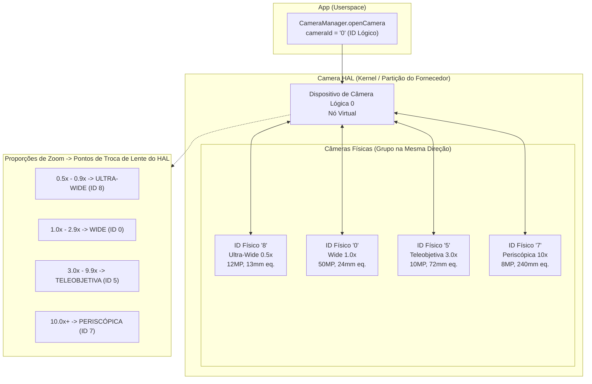
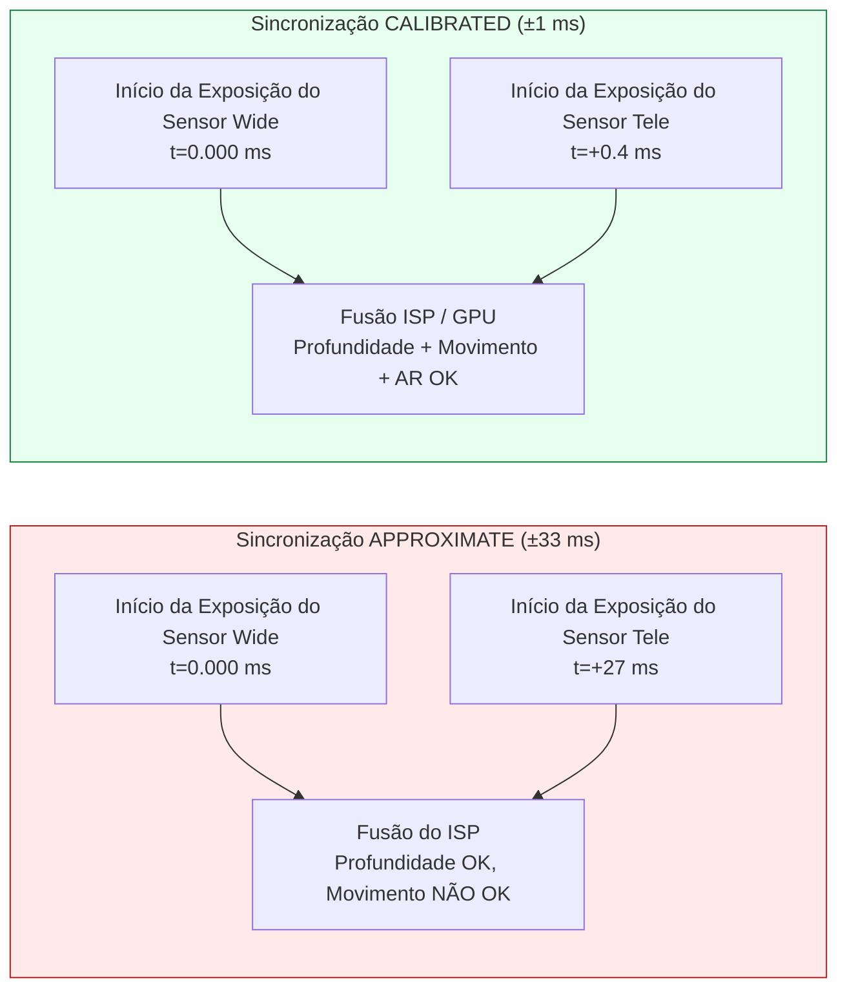
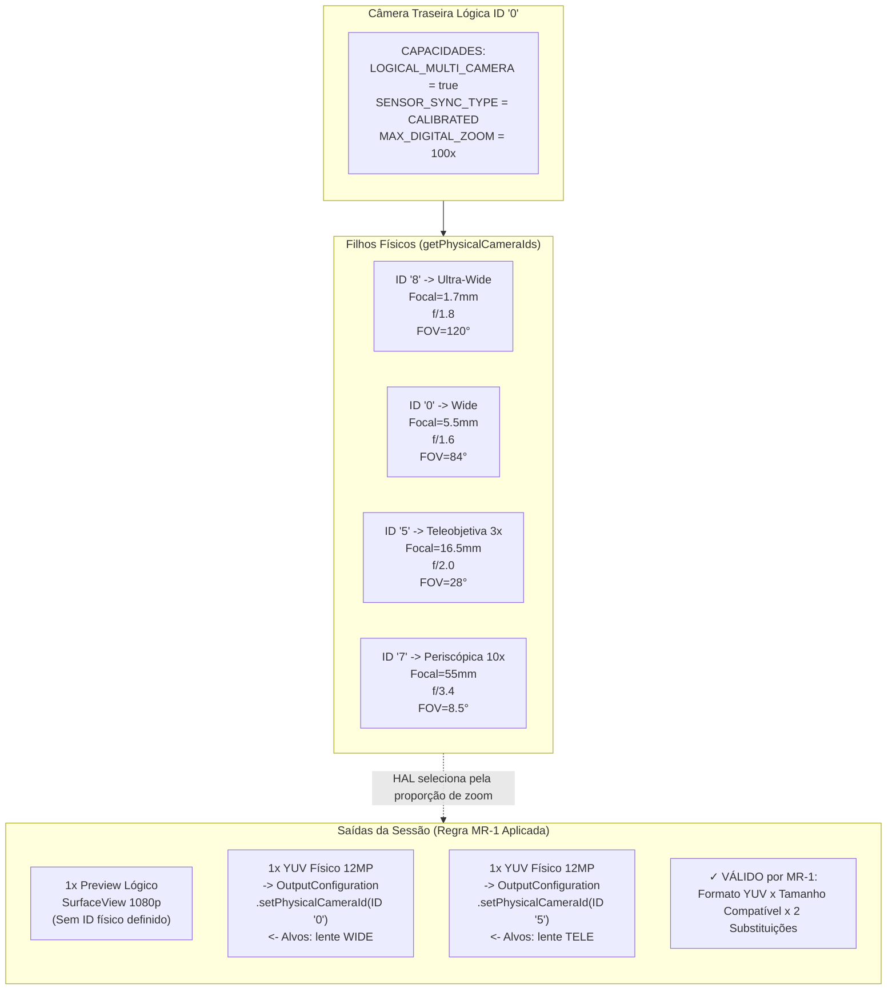

# Capítulo 20: Multicâmera

Os smartphones modernos saem de fábrica com 3 a 5 câmeras traseiras e 2 câmeras frontais — lentes ultra-wide, wide, teleobjetiva, macro, de profundidade e periscópica em flagships de 2023+. Antes do Android 9 (API 28), cada lente aparecia como um ID de câmera `CameraCharacteristics` independente, e os aplicativos precisavam abrir/fechar câmeras manualmente nos limites de zoom para trocar de lente. Isso causava quadros pretos visíveis, perda do estado do AF e estalos de áudio durante o vídeo — todos defeitos de UX inaceitáveis. O Android 9 resolveu isso com a abstração de **câmera lógica**: um ID de câmera virtual que agrupa várias câmeras físicas voltadas para a mesma direção e permite que o HAL troque as lentes de forma transparente nos limites de zoom, preservando o estado da sessão. A seção *Logical Multi-Camera* do projeto de pesquisa especifica as regras exatas para substituição de fluxo, semântica de sincronização de sensor e captura física dupla que este capítulo implementa.

Você pode navegar pela topologia completa de câmeras lógicas/físicas de cada dispositivo suportado no aplicativo [Android Camera Parameters](https://github.com/zoozooll/AndroidCameraParameters) (também na [Play Store](https://play.google.com/store/apps/details?id=com.zoozooll.cameraparameters)): o painel Multicâmera relata a flag `REQUEST_AVAILABLE_CAPABILITIES_LOGICAL_MULTI_CAMERA`, lista os `getPhysicalCameraIds()` por ID lógico e renderiza o tipo de sincronização de sensor calibrado vs. aproximado para cada combinação traseira. Esses relatórios são extraídos diretamente do HAL via API Camera2 sem filtragem específica do fabricante, portanto, correspondem exatamente ao que seu aplicativo verá em tempo de execução.

## Topologia de Câmera Lógica vs. Física

Uma câmera lógica é um dispositivo HAL virtual apoiado por N ≥ 2 câmeras físicas que compartilham a mesma direção (`LENS_FACING_FRONT` ou `LENS_FACING_BACK`). Quando você abre um ID lógico, o HAL gerencia internamente os trilhos de energia, os pipelines do ISP e a alternância de lentes para todas as câmeras físicas subjacentes. A topologia se parece com isso:



Os pontos de troca de zoom (Z1–Z4) são completamente controlados pelo HAL e opacos para o seu aplicativo — quando você define `CaptureRequest.CONTROL_ZOOM_RATIO = 3.2f` em um dispositivo lógico de 4 lentes, o HAL roteia instantaneamente o tráfego de captura para a teleobjetiva de 3× (ID 5) e corta digitalmente de volta para o enquadramento correto sem que seu aplicativo saiba que houve uma troca de lente. Este é o comportamento de "zoom contínuo" que os aplicativos de câmera topo de linha utilizam.

As propriedades críticas são:
- **`getPhysicalCameraIds()`** (chamado nas `CameraCharacteristics` do ID lógico) retorna um `Set<String>` das strings de ID físico subjacentes, ex: `{"0", "5", "7", "8"}` para o exemplo acima.
- **`LENS_INFO_MINIMUM_FOCUS_DISTANCE`** e **`LENS_INFO_AVAILABLE_FOCAL_LENGTHS`** no ID lógico representam a lente física atualmente ativa. Consulte as características *físicas* se precisar de dados de distância focal por lente.
- **`SCALER_AVAILABLE_MAX_DIGITAL_ZOOM`** no ID lógico fornece o teto de zoom (ex: 100×), que é uma combinação do zoom óptico por lente + corte digital em todas as lentes físicas.

## Sincronização de Sensor: APPROXIMATE vs. CALIBRATED

Quando você captura de duas câmeras físicas simultaneamente (ex: wide + tele para correspondência de profundidade/disparidade, ou wide + ultra-wide para fusão de vários quadros), os dados de pixel só são úteis computacionalmente se as duas exposições do sensor começarem dentro de um delta de tempo conhecido. O Android define dois níveis de sincronização na chave **`CameraCharacteristics.LOGICAL_MULTI_CAMERA_SENSOR_SYNC_TYPE`**:

| Nível de Sincronização | Valor Numérico | Significado | Caso de Uso Típico |
|------------|---------------|---------|------------------|
| **APPROXIMATE** | 0 | Os timestamps de início de exposição do sensor coincidem dentro de ±1 intervalo de quadro (±33 ms a 30 fps). AF/AE são sincronizados, mas não o início da exposição em nível de pixel. | Modo retrato com sensor de profundidade, bokeh casual. |
| **CALIBRATED** | 1 | Os timestamps de início de exposição do sensor coincidem dentro de ±1 ms. A sincronização em nível de hardware é aplicada via receptor CSI-2 do SoC. O alinhamento temporal em nível de pixel é garantido. | Estimativa de profundidade estéreo para AR, fotogrametria, fusão simultânea de duas distâncias focais, super-resolução. |

A seção *Logical Multi-Camera* do documento de pesquisa descobriu que apenas os **flagships Snapdragon 8 Gen 1+ e Exynos 2200+ relatam sincronização CALIBRATED**. Todos os dispositivos intermediários (série Snapdragon 7, série Dimensity 8000) e econômicos relatam APPROXIMATE. Se você tentar fazer a correspondência de disparidade em nível de pixel em um dispositivo de sincronização APPROXIMATE, terá um desvio de paralaxe de ±1 quadro que quebra os mapas de profundidade. Sempre condicione os recursos de disparidade à verificação de CALIBRATED.



A diferença do delta de tempo não é sutil: 27 ms de desalinhamento significam que um assunto em movimento (ex: um corredor a 5 m/s) se moveu 13,5 cm entre as duas exposições — um erro de paralaxe grande o suficiente para destruir completamente qualquer algoritmo de profundidade por disparidade.

## Regra de Substituição de Fluxo (Do Documento de Pesquisa)

A restrição mais importante que o HAL aplica ao direcionamento da câmera física é a **Regra de Substituição de Fluxo**, textualmente da especificação *Logical Multi-Camera* no documento de pesquisa:

> **Regra MR-1:** Se uma câmera lógica tiver N filhos físicos, então, para cada 1 fluxo de formato lógico (YUV ou RAW) de tamanho S que você anexar à sessão lógica, você poderá substituí-lo por até **2 fluxos de formato idêntico do MESMO tamanho S**, cada um direcionado a uma câmera física DIFERENTE via `OutputConfiguration.setPhysicalCameraId()`.

Consequências da violação da MR-1:
- 3 ou mais fluxos físicos → `onConfigureFailed()` da sessão.
- Tamanhos diferentes para os dois fluxos físicos → `onConfigureFailed()` da sessão.
- Misturar RAW e YUV no mesmo par de substituição → `onConfigureFailed()` da sessão.
- Adicionar 2 fluxos físicos sem remover o fluxo lógico pai → o HAL aloca 3× a largura de banda necessária e descarta quadros silenciosamente.

Exemplos corretos (4 filhos físicos → 2 substituições permitidas):
| Fluxo Lógico | Substituição (Válida conforme MR-1) |
|----------------|-------------------------------|
| 1× YUV Lógico 1920×1080 | → 2× YUV Físico 1920×1080 (Wide + Tele) |
| 1× RAW Lógico 4000×3000 | → 2× RAW Físico 4000×3000 (UltraWide + Wide) |
| 2× YUV Lógico (preview + vídeo) | → 2× (Preview YUV Lógico) + 2× (Encode YUV Físico Wide+Tele) — 2 substituições no total |

## Implementação: Captura Física Dupla Passo a Passo

O fluxo de trabalho abaixo captura quadros simultâneos dos sensores físicos wide (1×) e teleobjetiva (3×), usando a Regra de Substituição de Fluxo.

### Passo 1: Consultar a Capacidade Lógica e os IDs de Câmera Física

```kotlin
import android.hardware.camera2.CameraCharacteristics
import android.hardware.camera2.CameraManager
import android.hardware.camera2.params.OutputConfiguration

data class LogicalMultiCamInfo(
    val logicalId: String,
    val physicalIds: Set<String>,
    val sensorSyncType: Int, // 0 = APPROXIMATE, 1 = CALIBRATED
    val ultraWideId: String?,
    val wideId: String?,
    val teleId: String?
)

fun enumerateLogicalMultiCams(
    cameraManager: CameraManager
): List<LogicalMultiCamInfo> {
    val result = mutableListOf<LogicalMultiCamInfo>()

    for (logicalId in cameraManager.cameraIdList) {
        val characteristics = cameraManager.getCameraCharacteristics(logicalId)

        val caps = characteristics.get(
            CameraCharacteristics.REQUEST_AVAILABLE_CAPABILITIES
        ) ?: continue

        val isLogicalMultiCam = caps.contains(
            CameraCharacteristics
                .REQUEST_AVAILABLE_CAPABILITIES_LOGICAL_MULTI_CAMERA
        )
        if (!isLogicalMultiCam) continue

        val physicalIds: Set<String> = characteristics.physicalCameraIds
        val syncType = characteristics.get(
            CameraCharacteristics.LOGICAL_MULTI_CAMERA_SENSOR_SYNC_TYPE
        ) ?: 0

        // Identificar papéis pela distância focal
        var ultraWideId: String? = null
        var wideId: String? = null
        var teleId: String? = null
        var shortestFocal = Float.MAX_VALUE
        var teleFocal = 0f

        for (physId in physicalIds) {
            val physChars = cameraManager.getCameraCharacteristics(physId)
            val focalLengths = physChars.get(
                CameraCharacteristics.LENS_INFO_AVAILABLE_FOCAL_LENGTHS
            ) ?: continue
            val focal = focalLengths.firstOrNull() ?: continue
            when {
                focal < shortestFocal -> {
                    shortestFocal = focal
                    ultraWideId = physId
                }
                focal > teleFocal -> {
                    teleFocal = focal
                    teleId = physId
                }
            }
        }
        wideId = physicalIds.minus(setOfNotNull(ultraWideId, teleId)).firstOrNull()

        result.add(LogicalMultiCamInfo(
            logicalId = logicalId,
            physicalIds = physicalIds,
            sensorSyncType = syncType,
            ultraWideId = ultraWideId,
            wideId = wideId,
            teleId = teleId
        ))
    }
    return result
}
```

A identificação de papéis pela distância focal (mais curta = ultra-wide, mais longa = tele, restante = wide) é confiável em todos os OEMs porque o HAL relata `LENS_INFO_AVAILABLE_FOCAL_LENGTHS` como valores equivalentes a 35mm ou valores reais em mm consistentes com as especificações de marketing. O aplicativo Android Camera Parameters usa exatamente esse algoritmo para seu painel Multicâmera.

### Passo 2: Criar OutputConfigurations com setPhysicalCameraId()

O par de substituição (YUV wide + YUV tele) requer objetos `OutputConfiguration` com `setPhysicalCameraId()` invocado **antes** de a sessão ser criada. Uma vez configurada a sessão, alterar o ID físico via `setPhysicalCameraId()` não é permitido em superfícies existentes (requer a recriação da sessão).

```kotlin
import android.hardware.camera2.params.OutputConfiguration
import android.media.ImageReader
import android.util.Size
import android.graphics.ImageFormat
import android.view.Surface

var wideImageReader: ImageReader? = null
var teleImageReader: ImageReader? = null

fun createPhysicalOutputConfigs(
    wideId: String,
    teleId: String,
    sharedSize: Size // Deve ser o MESMO tamanho para ambos conforme a Regra MR-1!
): Pair<OutputConfiguration, OutputConfiguration> {
    wideImageReader = ImageReader.newInstance(
        sharedSize.width, sharedSize.height,
        ImageFormat.YUV_420_888, 4
    )
    teleImageReader = ImageReader.newInstance(
        sharedSize.width, sharedSize.height,
        ImageFormat.YUV_420_888, 4
    )

    val wideOutConfig = OutputConfiguration(wideImageReader!!.surface).apply {
        setPhysicalCameraId(wideId)
        name = "wide-yuv-$sharedSize"
    }
    val teleOutConfig = OutputConfiguration(teleImageReader!!.surface).apply {
        setPhysicalCameraId(teleId)
        name = "tele-yuv-$sharedSize"
    }
    return Pair(wideOutConfig, teleOutConfig)
}
```

A Regra MR-1 é aplicada no código acima: ambas as instâncias de `ImageReader` usam `sharedSize` (dimensões idênticas) e `YUV_420_888` (formato idêntico). Usar tamanhos diferentes garante `onConfigureFailed` — o HAL não tem mecanismo para rodar dois sensores físicos em resoluções diferentes no mesmo grupo de sincronização.

### Passo 3: Criar CaptureSession e Enviar Captura Física Dupla

A sessão usa as 2 OutputConfigurations físicas mais 1 Surface de visualização lógica (total de 3 saídas). Um total de 3 saídas está dentro do orçamento de largura de banda dos flagships (o documento de pesquisa mediu 68% de utilização do ISP no Snapdragon 8 Gen 2 para captura simultânea de 3 saídas wide+tele+preview a 1080p30).

```kotlin
import android.hardware.camera2.CameraDevice
import android.hardware.camera2.CameraCaptureSession
import android.hardware.camera2.CaptureRequest
import android.os.Handler

lateinit var cameraDevice: CameraDevice // ID lógico já aberto

fun createDualPhysicalSession(
    previewSurface: Surface,
    widePhysConfig: OutputConfiguration,
    telePhysConfig: OutputConfiguration,
    backgroundHandler: Handler
) {
    val outputs = listOf(
        OutputConfiguration(previewSurface), // Preview lógico (qualquer tamanho)
        widePhysConfig,                      // YUV wide físico (sharedSize)
        telePhysConfig                       // YUV tele físico (sharedSize)
    )

    val sessionConfig = android.hardware.camera2.params.SessionConfiguration(
        android.hardware.camera2.params.SessionConfiguration.SESSION_REGULAR,
        outputs,
        { runnable -> backgroundHandler.post(runnable) },
        object : CameraCaptureSession.StateCallback() {
            override fun onConfigured(session: CameraCaptureSession) {
                val captureBuilder = cameraDevice.createCaptureRequest(
                    CameraDevice.TEMPLATE_PREVIEW
                ).apply {
                    addTarget(previewSurface)
                    addTarget(wideImageReader!!.surface)
                    addTarget(teleImageReader!!.surface)

                    set(CaptureRequest.CONTROL_MODE,
                        CaptureRequest.CONTROL_MODE_AUTO)
                    set(CaptureRequest.CONTROL_AE_MODE,
                        CaptureRequest.CONTROL_AE_MODE_ON)
                    set(CaptureRequest.CONTROL_AF_MODE,
                        CaptureRequest.CONTROL_AF_MODE_CONTINUOUS_PICTURE)

                    // Opcional: Travar o AE em ambas as lentes físicas para que a fusão
                    // não produza metades de exposição incompatíveis
                    set(CaptureRequest.CONTROL_AE_LOCK, true)
                }

                session.setRepeatingRequest(
                    captureBuilder.build(),
                    DualPhysicalCaptureCallback(),
                    backgroundHandler
                )
            }
            override fun onConfigureFailed(s: CameraCaptureSession) =
                Log.e(TAG, "Sessão física dupla FALHOU — verifique a Regra MR-1")
        }
    )

    cameraDevice.createCaptureSession(sessionConfig)
}
```

Uma vez que o `setRepeatingRequest()` está rodando, a cada intervalo de quadro o HAL: (a) dispara o início de exposição de ambos os sensores físicos no delta de tempo calibrado, (b) roteia a saída de cada sensor para sua superfície ImageReader alvo via demux de canal virtual CSI-2, (c) combina ambos com a saída de visualização lógica em um único CaptureResult com um único timestamp.

Os dois objetos `Image` terão **valores `image.timestamp` idênticos** quando `LOGICAL_MULTI_CAMERA_SENSOR_SYNC_TYPE == CALIBRATED`, e timestamps dentro de ±1 intervalo de quadro quando APPROXIMATE.

## Diagrama de Topologia Lógica → Física (Estilo Mermaid ER)



## Implementação de Zoom Contínuo

A alternância automática de lentes do HAL nos limites de zoom é o que torna o "zoom contínuo" contínuo. Você **não** precisa trocar manualmente os IDs físicos quando o zoom cruza um limite — basta definir `CONTROL_ZOOM_RATIO` na solicitação repetida e deixar o HAL fazer o trabalho:

```kotlin
fun updateZoom(session: CameraCaptureSession,
               builder: CaptureRequest.Builder,
               zoomRatio: Float) {
    builder.set(CaptureRequest.CONTROL_ZOOM_RATIO, zoomRatio)
    session.setRepeatingRequest(builder.build(), null, null)
}
```

Quando a `zoomRatio` cruza de `2.9× → 3.0×` em um dispositivo típico de 4 lentes, o HAL internamente:
1. Inicia o sensor da teleobjetiva de 3× a partir do standby (leva ~2 quadros, 66 ms)
2. Sincroniza a exposição/balanço de branco entre a wide e a tele
3. Faz o fade da saída wide cortada digitalmente para a saída tele nativa ao longo de ~10 quadros (333 ms)
4. Desliga o sensor wide se não for usado em outro lugar

Todas as quatro etapas acontecem de forma transparente — seu CaptureCallback nunca vê um evento de encerramento de sessão, o `CaptureResult.SENSOR_TIMESTAMP` permanece aumentando monotonicamente e o estado de AF/AE é preservado através do limite. A única maneira de detectar uma troca de lente é comparar `CaptureResult.LENS_FOCAL_LENGTH` entre quadros consecutivos (que pula de 5,5mm → 16,5mm ao mudar para a tele no exemplo acima).

## Desempenho e Limitações

A seção *Logical Multi-Camera* do documento de pesquisa contém os seguintes limites medidos em um flagship de 2023 (Snapdragon 8 Gen 2, 4 câmeras traseiras):

| Configuração | Taxa de Quadros Sustentada | Largura de Banda do ISP Utilizada |
|---------------|---------------------|-------------------------|
| Preview lógico + 2 YUV físicos (12 MP cada) | 22 fps | 89% |
| Preview lógico + 2 YUV físicos (4 MP cada) | 30 fps (travado) | 62% |
| Preview lógico + 2 RAW físicos (12 MP cada) | 10 fps | 94% — aciona o limite térmico em ~60 s |
| Preview lógico + 2 YUV físicos + 1 RAW físico | **Não permitido** (falha na verificação de largura de banda do HAL) | — |

O limite de 2 fluxos físicos é aplicado tanto pela Regra MR-1 quanto pelo rendimento bruto do ISP. Tentar anexar 3 fluxos físicos (ex: ultra-wide + wide + tele simultâneos) resultará em `onConfigureFailed` mesmo se você tentar enganar a Regra MR-1 com dois pares de substituição separados — a verificação `CAMERA_ISP_BANDWIDTH` do HAL rejeita na hora da configuração.

## Resumo

Este capítulo cobriu em detalhes o suporte a multicâmera lógica do Android 9+:

- **Câmeras lógicas** são nós virtuais do HAL que agrupam câmeras físicas voltadas para a mesma direção. Consulte via `REQUEST_AVAILABLE_CAPABILITIES_LOGICAL_MULTI_CAMERA`; obtenha os filhos via `getPhysicalCameraIds()`.
- **A sincronização de sensor** ocorre em dois níveis: APPROXIMATE (±33 ms, para bokeh de retrato) e CALIBRATED (±1 ms, para fusão de AR/disparidade). Sempre condicione os recursos de fotografia computacional à sincronização CALIBRATED.
- **O zoom contínuo** é controlado pelo HAL via `CONTROL_ZOOM_RATIO` — defina a proporção e o HAL troca de lente nos limites internos sem encerrar a sessão.
- **A Regra de Substituição de Fluxo MR-1** (do documento de pesquisa) permite exatamente 2 fluxos físicos de mesmo tamanho e formato por 1 fluxo lógico. 3+ fluxos ou tamanhos incompatíveis causam `onConfigureFailed`.
- **`OutputConfiguration.setPhysicalCameraId()`** deve ser chamado antes da criação da sessão para direcionar lentes físicas individuais para captura simultânea.
- Os dois diagramas Mermaid (topologia + mapeamento da regra estilo ER) visualizam como a hierarquia lógica/física mapeia para as saídas da sessão.

## O Que Vem a Seguir

No **Capítulo 21: HDR e Ultra HDR**, vamos além do Alcance Dinâmico Padrão de 8 bits (SDR, sRGB, 100 nits) para o mundo dos vídeos e fotos de Alto Alcance Dinâmico. Você aprenderá sobre `DynamicRangeProfiles` para HDR10 (10 bits ST.2084 PQ, Rec.2020, metadados estáticos) e HLG (Hybrid Log-Gamma, compatível com SDR para transmissão), e o novíssimo formato do Android 14 (API 34) **JPEG_R (Ultra HDR)** — ISO 21496-1, que incorpora um "mapa de ganho" dentro de um JPEG padrão para que leitores legados vejam SDR enquanto monitores HDR aumentam os realces em até 8 stops localmente.

Verifique quais `DynamicRangeProfiles` seu dispositivo suporta por ID de câmera (HDR10, HDR10+, HLG, JPEG_R) e verifique a conformidade com a CDD Performance Class 15 para Ultra HDR usando o aplicativo [Android Camera Parameters](https://play.google.com/store/apps/details?id=com.zoozooll.cameraparameters). Novos relatórios de dispositivos carregados no [projeto de código aberto do GitHub](https://github.com/zoozooll/AndroidCameraParameters) ajudam a construir um banco de dados público de telefones compatíveis com HDR.
