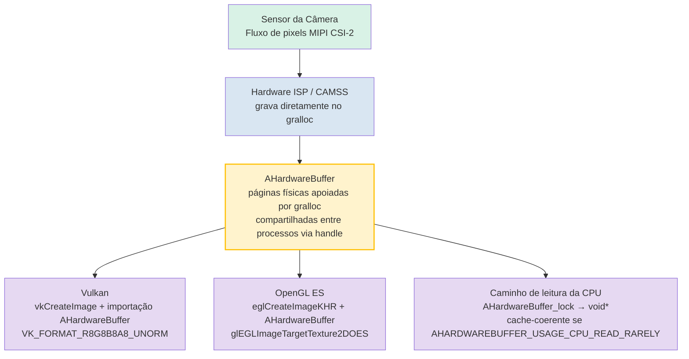

# Capítulo 25: Desenvolvimento de Câmera Nativa

## Resumo

Os Capítulos 1–24 operaram em código gerenciado: Kotlin ou Java rodando no ART, cruzando um limite de IPC do Binder para cada `CaptureRequest`, e alocando cópias de quadros em `ByteBuffer` ou aceitando a sobrecarga de streaming de textura mediado por `SurfaceTexture`. Para aplicativos de câmera social, isso é suficiente. Para mecanismos de AR, pipelines de visão computacional em tempo real, câmeras de ré de automóveis ou mecanismos 3D com um orçamento de 16ms por quadro — não é.

O desenvolvimento de câmera nativa move todo o loop de abrir/configurar/capturar da câmera para C/C++ usando os cabeçalhos `<camera/NdkCameraManager.h>` e `<android/hardware_buffer.h>` do NDK. O ganho imediato é zero de sobrecarga de JNI no caminho crítico e, crucialmente, a capacidade de envolver objetos `AHardwareBuffer` alocados pelo gralloc diretamente como alvos Vulkan `VkImage` ou OpenGL `EGLImage` sem um único byte de cópia de memória entre a saída do sensor e a amostragem de textura da GPU.

O **Android Camera Parameters** ajuda você a validar que seus dispositivos alvo expõem as garantias `INFO_SUPPORTED_HARDWARE_LEVEL_FULL` ou `LEVEL_3` necessárias para uma operação nativa previsível de baixo nível. Instale-o pela [Google Play](https://play.google.com/store/apps/details?id=com.minininja.cameraparams) ou verifique o código-fonte em [github.com/zoozooll/AndroidCameraParameters](https://github.com/zoozooll/AndroidCameraParameters).

---

## Por Que Ser Nativo?

Antes de mergulhar no C++, sejamos precisos sobre o que o nativo oferece e quando justifica a complexidade.

### O Caso para o Nativo

1. **Zero sobrecarga de JNI no caminho crítico.** Um pipeline de 60fps tem 16,67ms por quadro. Uma única travessia de limite ART/C via JNI `CallVoidMethod` leva cerca de 0,5–2µs em microbenchmarks, mas o custo real é a chamada *por quadro*, a transferência de thread, a contabilidade de referências locais de JNI e a pressão do GC de proxies `Image` gerenciados. Multiplique por quatro câmeras alimentando uma sessão de AR simultaneamente e você estará queimando um milissegundo do orçamento apenas cruzando fronteiras de linguagem. O nativo elimina isso.

2. **Propriedade direta da memória com o `AHardwareBuffer`.** No código gerenciado, `Image.getPlanes()[0].getBuffer()` retorna um `ByteBuffer` que é uma *visão* da memória do gralloc; lê-lo força uma invalidação de cache da CPU e, frequentemente, uma cópia interna para formatos como `PRIVATE`. No código nativo, o `AHardwareBuffer` é o próprio handle do gralloc, e a GPU pode vinculá-lo como memória de textura no local.

3. **Integração de mecanismos AR/3D.** Unity, Unreal, Ogre e mecanismos internos são escritos em C++ por um bom motivo. Rodar a câmera *dentro* do código C++ do loop de renderização elimina o emaranhado de três processos "ART + JNI + thread de renderização".

4. **Migração do EVS (External View System) automotivo.** Antes do Android 10, as câmeras de ré automotivas usavam a stack `EVS` legada com seu próprio HAL. As migrações dos OEMs de 2020 a 2024 convergiram o EVS para as APIs NDK padrão do Camera2, reservando o `AID_AUTOMOTIVE_EVS_UID = 1071` para acesso antecipado ao hardware durante o boot, *antes* mesmo de o CameraService do `system_server` estar rodando. Se o seu código visa o setor automotivo, o nativo é inegociável.

### O Caso Contra o Nativo

- A depuração é mais difícil. Travamentos em callbacks de `ACameraDevice` produzem rastros de tombstone, não stack traces bonitos do Kotlin.
- O gerenciamento do ciclo de vida é totalmente manual. O `ACameraManager` *não* reconhece o ciclo de vida; esquecer `ACameraCaptureSession_stopRepeating()` + `ACameraDevice_close()` ao destruir a superfície vaza recursos da câmera e pode bloquear outros aplicativos até a reinicialização.
- Menos soluções alternativas para dispositivos. O banco de dados de peculiaridades do CameraX não existe no mundo NDK; você herda o comportamento bruto do HAL exatamente como ele é entregue.
- Sem `DngCreator`, sem auxiliares `ExifInterface`, sem acessores de conveniência `CameraCharacteristics` — você mesmo analisa as tags de metadados via `ACameraMetadata_getConstEntry`.

A decisão é simples: se você não consegue cumprir seu orçamento de quadros em código gerenciado, ou se precisa de acesso à câmera no momento do boot no nível do EVS, use nativo. Caso contrário, permaneça no gerenciado.

---

## ACameraManager: O Paralelo do NDK para o CameraManager Java

A superfície da API de câmera do NDK em `<camera/NdkCameraManager.h>`, `<camera/NdkCameraDevice.h>` e `<camera/NdkCaptureRequest.h>` mapeia quase um para um com a API Java que você conhece. Cada classe Java tem uma struct nativa e um conjunto de funções livres:

| Java                          | Handle NDK / Prefixo de Função                        |
|-------------------------------|-------------------------------------------------------|
| `CameraManager`               | `ACameraManager` · `ACameraManager_*`                 |
| `CameraCharacteristics`       | `ACameraMetadata` · `ACameraMetadata_*`               |
| `CameraDevice`                | `ACameraDevice` · `ACameraDevice_*`                   |
| `CaptureRequest.Builder`      | `ACaptureRequest` · `ACaptureRequest_setEntry_*`      |
| `CameraCaptureSession`        | `ACameraCaptureSession` · `ACameraCaptureSession_*`   |
| `TotalCaptureResult`          | `ACameraCaptureResult` · `ACaptureResult`             |
| `ImageReader`                 | `AImageReader` (de `<media/NdkImageReader.h>`)        |

O ciclo de vida é idêntico: enumerar câmeras → ler características → abrir → criar superfícies de saída → criar sessão → definir solicitação repetida → desmontar na ordem inversa.

### Exemplo 1: Enumerar Câmeras, Ler Características, Abrir um Dispositivo (C++)

```cpp
#include <camera/NdkCameraManager.h>
#include <camera/NdkCameraDevice.h>
#include <camera/NdkCameraMetadata.h>
#include <android/log.h>

#define LOG_TAG "NativeCam"
#define LOGI(...) __android_log_print(ANDROID_LOG_INFO, LOG_TAG, __VA_ARGS__)
#define LOGE(...) __android_log_print(ANDROID_LOG_ERROR, LOG_TAG, __VA_ARGS__)

static ACameraManager* g_cameraManager = nullptr;
static ACameraDevice* g_cameraDevice = nullptr;

void onDeviceDisconnected(void* ctx, ACameraDevice* dev) {
    LOGI("Dispositivo de câmera desconectado");
}

void onDeviceError(void* ctx, ACameraDevice* dev, int err) {
    LOGE("Erro no dispositivo de câmera: %d", err);
}

static ACameraDevice_stateCallbacks g_deviceCallbacks = {
    .context = nullptr,
    .onDisconnected = onDeviceDisconnected,
    .onError = onDeviceError,
};

bool enumerateAndOpenBackCamera() {
    g_cameraManager = ACameraManager_create();
    if (!g_cameraManager) {
        LOGE("Falha ao criar ACameraManager");
        return false;
    }

    ACameraIdList* cameraIdList = nullptr;
    camera_status_t status = ACameraManager_getCameraIdList(
        g_cameraManager, &cameraIdList);
    if (status != ACAMERA_OK) {
        LOGE("getCameraIdList falhou: %d", status);
        return false;
    }

    const char* chosenId = nullptr;

    for (int i = 0; i < cameraIdList->numCameras; ++i) {
        const char* id = cameraIdList->cameraIds[i];
        ACameraMetadata* chars = nullptr;
        status = ACameraManager_getCameraCharacteristics(
            g_cameraManager, id, &chars);
        if (status != ACAMERA_OK) continue;

        ACameraMetadata_const_entry lensFacingEntry{};
        status = ACameraMetadata_getConstEntry(
            chars,
            ACAMERA_LENS_FACING,
            &lensFacingEntry);

        uint8_t facing = 0;
        if (status == ACAMERA_OK && lensFacingEntry.count > 0) {
            facing = lensFacingEntry.data.u8[0];
        }

        if (facing == ACAMERA_LENS_FACING_BACK) {
            chosenId = id;
            // Também consulta o nível de hardware para verificação de capacidade:
            ACameraMetadata_const_entry hwEntry{};
            if (ACameraMetadata_getConstEntry(
                    chars, ACAMERA_INFO_SUPPORTED_HARDWARE_LEVEL,
                    &hwEntry) == ACAMERA_OK && hwEntry.count > 0) {
                LOGI("Câmera traseira %s nível hw = %d (esperado %d=FULL %d=LEVEL3)",
                     id, hwEntry.data.u8[0],
                     (int)ACAMERA_INFO_SUPPORTED_HARDWARE_LEVEL_FULL,
                     (int)ACAMERA_INFO_SUPPORTED_HARDWARE_LEVEL_3);
            }
            ACameraMetadata_free(chars);
            break;
        }
        ACameraMetadata_free(chars);
    }

    ACameraManager_deleteCameraIdList(cameraIdList);

    if (!chosenId) {
        LOGE("Nenhuma câmera traseira encontrada");
        return false;
    }

    status = ACameraManager_openCamera(
        g_cameraManager, chosenId,
        &g_deviceCallbacks,
        &g_cameraDevice);

    if (status != ACAMERA_OK) {
        LOGE("openCamera falhou: %d", status);
        return false;
    }

    LOGI("Câmera %s aberta com sucesso", chosenId);
    return true;
}
```

Observe a ausência de exceções. Cada função retorna um `camera_status_t`, e você *deve* verificar cada retorno. `ACAMERA_OK = 0`; qualquer valor diferente de zero é um código de falha específico (`ACAMERA_ERROR_CAMERA_IN_USE`, `ACAMERA_ERROR_CAMERA_DISCONNECTED`, etc.). Não há `CameraAccessException` para capturar — se você ignorar o retorno, a função simplesmente deixará silenciosamente o ponteiro de saída como `nullptr` e você travará três linhas depois.

### Criando uma Sessão de Captura e Definindo uma Solicitação Repetida

Uma vez que o dispositivo está aberto, o padrão espelha a criação de sessão em Java. Crie um `ACameraOutputTarget` por superfície, empacote-os em um `ACaptureSessionOutputContainer` e, em seguida, chame `ACameraDevice_createCaptureSession()`. Para solicitações repetidas, construa uma `ACaptureRequest` a partir de um modelo, adicione seu alvo de saída e chame `ACameraCaptureSession_setRepeatingRequest()`. As structs de callback (`ACameraCaptureSession_stateCallbacks`, `ACameraCaptureSession_captureCallbacks`) são registradas no momento da criação da sessão, correspondendo exatamente às suas contrapartes Java.

---

## AHardwareBuffer: O Caminho Crítico de Cópia Zero

Este é o real motivo para usar nativo. O `AHardwareBuffer` (definido em `<android/hardware_buffer.h>`) é o handle do NDK para a memória alocada pelo gralloc — a mesma memória na qual o HAL da câmera grava os pixels do sensor. Quando você alimenta uma superfície apoiada por `AHardwareBuffer` para `ACameraDevice_createCaptureSession` e depois importa esse mesmo `AHardwareBuffer` no Vulkan ou OpenGL, você obtém uma cópia zero real:



O nó `AHardwareBuffer` é o ponto central: é uma alocação única compartilhada pelo endpoint de gravação do HAL da câmera, pelo amostrador de textura da GPU e, opcionalmente, pela CPU. Sem memcpy, sem upload via `glTexImage2D`, sem `ByteBuffer.wrap()` — a textura da GPU está literalmente apontando para as mesmas páginas físicas de DRAM que a câmera acabou de gravar.

Para pipelines de AR a 60fps em um fluxo 4K, isso representa uma economia de largura de banda de ~200ms por segundo (4K × 60fps × 4 bytes = ~4,7 GB/seg economizados) e a diferença entre uma experiência suave e uma confusão instável.

### Exemplo 2: AHardwareBuffer para Vulkan VkImage, Passo a Passo (C++)

```cpp
#include <android/hardware_buffer.h>
#include <vulkan/vulkan.h>
#include <vulkan/vulkan_android.h>

VkImage createVkImageFromAHardwareBuffer(
    VkDevice device,
    AHardwareBuffer* aBuffer,
    VkFormat format,
    uint32_t width,
    uint32_t height) {

    // Passo 1: Preencher VkAndroidHardwareBufferPropertiesANDROID
    VkAndroidHardwareBufferPropertiesANDROID ahbProps{};
    ahbProps.sType = VK_STRUCTURE_TYPE_ANDROID_HARDWARE_BUFFER_PROPERTIES_ANDROID;
    VkResult res = vkGetAndroidHardwareBufferPropertiesANDROID(
        device, aBuffer, &ahbProps);
    if (res != VK_SUCCESS) {
        LOGE("vkGetAndroidHardwareBufferPropertiesANDROID falhou: %d", res);
        return VK_NULL_HANDLE;
    }

    // Passo 2: Descrever a *importação* da imagem (não a alocação)
    VkExternalMemoryImageCreateInfo externalInfo{};
    externalInfo.sType = VK_STRUCTURE_TYPE_EXTERNAL_MEMORY_IMAGE_CREATE_INFO;
    externalInfo.handleTypes =
        VK_EXTERNAL_MEMORY_HANDLE_TYPE_ANDROID_HARDWARE_BUFFER_BIT_ANDROID;

    VkImageCreateInfo imgInfo{};
    imgInfo.sType = VK_STRUCTURE_TYPE_IMAGE_CREATE_INFO;
    imgInfo.pNext = &externalInfo;
    imgInfo.imageType = VK_IMAGE_TYPE_2D;
    imgInfo.format = format;             // ex: VK_FORMAT_R8G8B8A8_UNORM
    imgInfo.extent = { width, height, 1 };
    imgInfo.mipLevels = 1;
    imgInfo.arrayLayers = 1;
    imgInfo.samples = VK_SAMPLE_COUNT_1_BIT;
    imgInfo.tiling = VK_IMAGE_TILING_OPTIMAL;
    imgInfo.usage = VK_IMAGE_USAGE_SAMPLED_BIT |
                    VK_IMAGE_USAGE_TRANSFER_DST_BIT;
    imgInfo.sharingMode = VK_SHARING_MODE_EXCLUSIVE;
    imgInfo.initialLayout = VK_IMAGE_LAYOUT_UNDEFINED;

    VkImage image = VK_NULL_HANDLE;
    res = vkCreateImage(device, &imgInfo, nullptr, &image);
    if (res != VK_SUCCESS) {
        LOGE("vkCreateImage falhou: %d", res);
        return VK_NULL_HANDLE;
    }

    // Passo 3: Alocar VkDeviceMemory *importando* o AHB, não alocando um novo
    VkMemoryRequirements memReqs{};
    vkGetImageMemoryRequirements(device, image, &memReqs);

    VkImportAndroidHardwareBufferInfoANDROID importInfo{};
    importInfo.sType =
        VK_STRUCTURE_TYPE_IMPORT_ANDROID_HARDWARE_BUFFER_INFO_ANDROID;
    importInfo.buffer = aBuffer;

    VkMemoryDedicatedAllocateInfo dedicatedInfo{};
    dedicatedInfo.sType = VK_STRUCTURE_TYPE_MEMORY_DEDICATED_ALLOCATE_INFO;
    dedicatedInfo.pNext = &importInfo;
    dedicatedInfo.image = image;

    VkMemoryAllocateInfo allocInfo{};
    allocInfo.sType = VK_STRUCTURE_TYPE_MEMORY_ALLOCATE_INFO;
    allocInfo.pNext = &dedicatedInfo;
    allocInfo.allocationSize = memReqs.size;
    allocInfo.memoryTypeIndex = ahbProps.memoryTypeBits
        // memoryTypeIndex deve ser selecionado a partir da interseção de
        // memReqs.memoryTypeBits E ahbProps.memoryTypeBits. Omitido por brevidade.
        ;

    VkDeviceMemory mem = VK_NULL_HANDLE;
    res = vkAllocateMemory(device, &allocInfo, nullptr, &mem);
    if (res != VK_SUCCESS) {
        LOGE("vkAllocateMemory import falhou: %d", res);
        vkDestroyImage(device, image, nullptr);
        return VK_NULL_HANDLE;
    }

    // Passo 4: Vincular memória importada ao VkImage
    vkBindImageMemory(device, image, mem, 0);

    // Passo 5: Transição para o layout SHADER_READ_ONLY_OPTIMAL via command buffer
    // (omitido — barreira de memória de imagem padrão para VK_IMAGE_LAYOUT_UNDEFINED
    // → VK_IMAGE_LAYOUT_SHADER_READ_ONLY_OPTIMAL)

    LOGI("AHardwareBuffer importado com sucesso como VkImage %p", image);
    return image;
}
```

O salto conceitual que confunde a maioria dos novatos é o Passo 3: `vkAllocateMemory` com `VK_STRUCTURE_TYPE_IMPORT_ANDROID_HARDWARE_BUFFER_INFO_ANDROID` **não** aloca. Ele registra um `AHardwareBuffer` existente como um objeto `VkDeviceMemory`. Os bytes já foram alocados pelo gralloc quando o produtor da câmera criou a superfície; o Vulkan está simplesmente adotando-os em seu modelo de memória.

O caminho do OpenGL ES é análogo, porém mais curto: `eglCreateImageKHR(..., EGL_NATIVE_BUFFER_ANDROID, aBuffer, ...)` → `glEGLImageTargetTexture2DOES(GL_TEXTURE_2D, eglImage)`. Uma chamada e você está fazendo a amostragem.

---

## Resumo da Interoperabilidade OpenGL e Vulkan

Ambos os caminhos funcionam. Qual escolher:

| Fator                 | OpenGL ES 3.x + EGLImage                     | Vulkan 1.1+ + importação AHB                 |
|-----------------------|----------------------------------------------|----------------------------------------------|
| Simplicidade          | Configuração mais curta, menos cerimônia     | Mais código repetitivo, sincronização explícita |
| Sincronização        | Implícita; o driver insere as barreiras      | Explícita; você escreve barreiras de pipeline + semáforos |
| Multi-queue/threading | Vinculado a um único EGLContext por thread   | Transferências multi-queue de primeira classe |
| Certif. Automotiva/AR | Certificado na maioria dos alvos EVS         | Cada vez mais exigido para novos runtimes de AR |

Se você está integrando com um mecanismo existente, o mecanismo escolhe por você. Se você está começando do zero e deseja o máximo desempenho, o Vulkan é o futuro. Se você quer o mínimo de código, o OpenGL ES via EGLImage ainda é a escolha pragmática e está presente em todos os dispositivos com câmera.

---

## Contexto EVS Automotivo: Migração para Camera2 NDK

Para completar, uma breve nota sobre o caminho de migração automotiva referenciado nas notas de pesquisa. Até o Android 9, as câmeras de ré dos carros usavam a stack `EVS` separada (`android.hardware.automotive.evs@1.0`), com sua própria enumeração e pipeline de streaming. A partir do Android 10 e obrigatório no Android 12+ para novos sistemas IVI, o gerenciador de EVS foi reimplementado *no topo do HAL3 de câmera padrão + stack de câmera do NDK*, com um novo UID reservado `AID_AUTOMOTIVE_EVS_UID = 1071` que recebe acesso ao grupo de permissão `CAMERA` já no `early-boot` — antes mesmo de o `CameraService` do `system_server` ser inicializado.

Na prática, se você está escrevendo código de câmera de ré para carros:
1. Seu processo roda como UID 1071.
2. Você usa *exatamente* as APIs nativas deste capítulo (`ACameraManager_openCamera`, `AImageReader`, `AHardwareBuffer` → importação Vulkan).
3. Você deve ser capaz de abrir, configurar e emitir um quadro em menos de 2 segundos a partir do cold boot (requisito FMVSS 111). É por isso que a stack EVS exige nativo — cada ms de inicialização do ART é um ms que você não tem.

A migração do EVS → Camera2 NDK é uma das maiores refatorações internas do ecossistema de câmera do Android nos últimos cinco anos, e é o motivo pelo qual as APIs de câmera do NDK receberam investimentos tão pesados do Android 10 em diante. Se você está lendo este capítulo para lançar um produto de câmera para automóveis, você está usando exatamente o caminho de código exigido pelos testes de conformidade automotiva do Google.

---

## Exemplo 3 (Stub de Ponte JNI Kotlin)

Para completar, um ponto de entrada JNI Kotlin minimalista que chama o código C++ acima:

```kotlin
// NativeBridge.kt
class NativeBridge {

    external fun enumerateAndOpenBackCameraNative(): Boolean

    companion object {
        init {
            System.loadLibrary("native_camera")
        }
    }
}
```

```cpp
// exportação JNI native_camera.cpp
extern "C" JNIEXPORT jboolean JNICALL
Java_com_example_NativeBridge_enumerateAndOpenBackCameraNative(
    JNIEnv* /*env*/, jobject /*thiz*/) {
    return static_cast<jboolean>(enumerateAndOpenBackCamera() ? JNI_TRUE : JNI_FALSE);
}
```

E no `build.gradle`:

```kotlin
android {
    defaultConfig {
        ndk { abiFilters += listOf("arm64-v8a", "armeabi-v7a", "x86_64") }
    }
    externalNativeBuild {
        cmake { path = file("src/main/cpp/CMakeLists.txt") }
    }
}
```

Com o `CMakeLists.txt` correspondente vinculando `-lcamera2ndk`, `-lmediandk`, `-landroid` e `-lvulkan`.

---

## Resumo

O desenvolvimento de câmera nativa troca a ergonomia do código gerenciado pelo máximo desempenho e propriedade direta do hardware. O `ACameraManager` e suas structs companheiras espelham a API Camera2 Java um para um, apenas com retornos de erro no estilo C e ciclo de vida manual. O real ganho é o `AHardwareBuffer` — o handle do gralloc que permite alimentar a saída do HAL da câmera diretamente em texturas Vulkan `VkImage` ou OpenGL `EGLImage` com zero de cópia de memória, economizando gigabytes por segundo de largura de banda DRAM em pipelines de AR de 60fps. Para o setor automotivo, a migração EVS-para-NDK torna o nativo inegociável devido ao requisito de quadro de boot de 2 segundos e ao acesso antecipado ao hardware do `AID_AUTOMOTIVE_EVS_UID`. Use o **Android Camera Parameters** para validar que seu dispositivo alvo tem `INFO_SUPPORTED_HARDWARE_LEVEL_FULL` ou superior antes de se comprometer com uma implementação nativa.

## O Que Vem a Seguir

Seja em Kotlin ou C++, a Camera2 é uma API inerentemente assíncrona: `StateCallbacks`, `CaptureCallbacks`, `AvailabilityCallbacks`, todos disparando em threads de segundo plano. O Capítulo 26 doma esse caos com coroutines Kotlin e Flow, convertendo o "inferno de callbacks" emaranhado que você escreveu nos primeiros capítulos em um pipeline reativo, linear e limpo.
