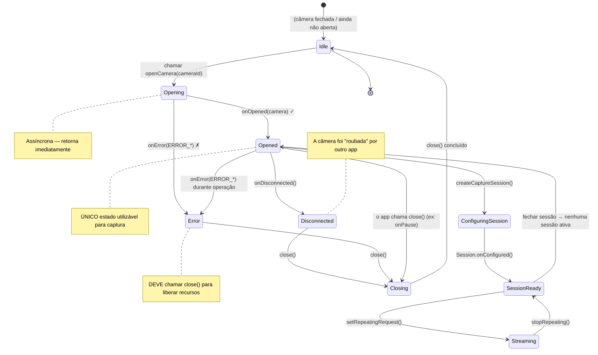

Você enumerou todas as câmeras no dispositivo (Capítulo 6) e identificou a que deseja usar — normalmente a câmera traseira com o maior nível de hardware. O próximo passo é **abrir** essa câmera: estabelecer uma conexão ativa de baixo nível com o hardware da câmera para que você possa configurar sessões de captura e enviar solicitações. Abrir uma câmera é o ponto sem retorno onde seu aplicativo transita de um observador passivo de metadados da câmera para um controlador ativo de hardware real.

Se você quiser ver código de ciclo de vida de abertura/fechamento de câmera de nível de produção, estude o aplicativo **Android Camera Parameters** no [GitHub](https://github.com/zoozooll/AndroidCameraParameters). Sua classe `Camera2Controller` encapsula todo o gerenciamento do ciclo de vida do `CameraDevice`, incluindo recuperação de erros, lógica de repetição e limpeza síncrona. A versão do aplicativo na [Google Play](https://play.google.com/store/apps/details?id=com.minininja.cameraparams) foi instalada em milhares de dispositivos de centenas de diferentes fabricantes (OEMs), portanto, os casos extremos que ele trata são testados em batalha no mundo real.

## O Que É o CameraDevice?

`CameraDevice` é a classe da API Camera2 que representa **uma conexão aberta e ativa com uma câmera física (ou lógica) específica no dispositivo**. Antes de a câmera ser aberta, você só pode ler suas características; uma vez aberta, você pode:
- Criar `CameraCaptureSession`s (Capítulo 8)
- Enviar `CaptureRequest`s (Capítulos 8 e 9)
- Ler metadados dinâmicos de `CaptureResult` conforme os quadros chegam
- Limpar solicitações pendentes, abortar capturas e fechar o dispositivo

Um `CameraDevice` possui duas propriedades críticas:

1. **É um recurso de usuário único.** Apenas um aplicativo (e dentro do seu aplicativo, apenas uma instância de `CameraDevice`) pode manter uma determinada câmera aberta por vez. Se um aplicativo de maior prioridade (como uma chamada telefônica recebida com vídeo) precisar da câmera, seu aplicativo será desconectado à força.
2. **Possui um ciclo de vida rigoroso orientado a callbacks.** Você não pode instanciar um `CameraDevice` com um construtor. A única maneira de obter um é via `CameraManager.openCamera()`, que entrega a instância de forma assíncrona através de um `StateCallback`. Você deve respeitar cada callback de transição de estado.

A relação entre `CameraManager`, um ID de câmera e o `CameraDevice` resultante é:

```
CameraManager.openCamera("0", callback, handler)
    │
    ├── Chamada assíncrona → retorna imediatamente
    │
    └───── Na thread de fundo (via Handler) ────→ StateCallback.onOpened(cameraDevice)
                                                          │
                                                          ▼
                                                  Agora você pode usar o cameraDevice para:
                                                  • createCaptureSession(...)
                                                  • createCaptureRequest(...)
```

## O StateCallback: A Máquina de Ciclo de Vida do CameraDevice

`CameraDevice.StateCallback` é uma classe abstrata com três métodos que você **deve** implementar. Toda câmera aberta acabará disparando pelo menos um desses callbacks (ou `onOpened` seguido mais tarde por `onDisconnected`/`onError`, ou diretamente `onError` se a abertura falhar). A câmera não pode ser usada para captura até que `onOpened` seja disparado.

### Os Três Métodos do StateCallback

| Método | Chamado Quando | O Que Fazer |
|---|---|---|
| `onOpened(camera: CameraDevice)` | A câmera foi aberta com sucesso e está pronta para uso. | Armazene a referência `camera` em uma propriedade. Prossiga para configurar uma sessão de captura (Capítulo 8). Libere qualquer permissão do Semaphore se você adquiriu uma. |
| `onDisconnected(camera: CameraDevice)` | A câmera foi retirada do seu aplicativo (ex: outro aplicativo de maior prioridade abriu a câmera, o usuário mudou para um aplicativo em primeiro plano que consome câmera ou a política do dispositivo a desativou). | Chame `camera.close()` imediatamente. Anule sua referência armazenada. A câmera não poderá ser reaberta até que seu aplicativo recupere o primeiro plano (momento em que o `onResume` tentará novamente). |
| `onError(camera: CameraDevice, error: Int)` | Ocorreu um erro fatal durante a abertura ou enquanto a câmera estava ativa. O parâmetro `error` é uma das constantes `ERROR_*` descritas abaixo. | Chame `camera.close()`. Anule a referência. Dependendo do código de erro, exiba uma mensagem de erro ao usuário ou tente novamente com um backoff exponencial. Sempre libere o Semaphore. |

### Os Códigos de Erro de `onError`

O inteiro `error` em `onError` mapeia para cinco constantes (definidas em `CameraDevice.StateCallback`):

| Constante | Valor | Significado | Recuperação |
|---|---|---|---|
| `ERROR_CAMERA_IN_USE` | `1` | A câmera já está aberta por outro aplicativo ou pelo serviço de câmera do sistema. | Não é possível recuperar automaticamente; aguarde pelo `onResume` quando o usuário retornar ao seu aplicativo e tente novamente. |
| `ERROR_MAX_CAMERAS_IN_USE` | `2` | O dispositivo tem um limite de quantas câmeras podem ser abertas simultaneamente; você o excedeu ao tentar abrir esta câmera (comum em flagships com várias câmeras). | Feche outros `CameraDevice`s abertos que você possa possuir e tente novamente. Em dispositivos com limites de hardware, normalmente apenas 2 a 3 câmeras podem ser abertas ao mesmo tempo. |
| `ERROR_CAMERA_DISABLED` | `3` | A política do dispositivo (MDM, controles parentais, modo quiosque) desativou todas as câmeras. | Exiba uma mensagem de erro permanente ao usuário. Tentar novamente não ajudará até que a política mude. |
| `ERROR_CAMERA_DEVICE` | `4` | O hardware/firmware da câmera encontrou um erro irrecuperável. | Feche o dispositivo. Notifique o usuário. Tentar novamente pode ajudar em alguns dispositivos (para falhas transitórias de firmware), portanto, uma ou duas tentativas de repetição com backoff são razoáveis. |
| `ERROR_CAMERA_SERVICE` | `5` | O próprio serviço de câmera de todo o sistema travou. Esta é uma falha no nível da plataforma, não culpa do seu aplicativo. | Feche e anule tudo. Normalmente, o serviço de câmera será reiniciado automaticamente em poucos segundos; você pode tentar novamente após um atraso ou esperar pelo próximo `onResume`. |

O diagrama de estados abaixo captura cada transição válida de um `CameraDevice` desde o momento em que você chama `openCamera()` até quando você (ou o sistema) o fecha:



Conclusões importantes do diagrama de estados:

1. **Opened é o único estado operacional.** Antes de `onOpened` disparar e após qualquer erro/desconexão, a referência `CameraDevice` deve ser considerada inutilizável.
2. **Feche em cada estado terminal.** Independentemente de você receber `onError`, `onDisconnected` ou apenas decidir fechar proativamente no `onPause`, **sempre chame `close()`**. A falha ao fechar uma câmera leva a vazamentos que impedem que **qualquer** aplicativo (incluindo o seu) a reabra até que o processo morra ou o serviço do sistema seja reiniciado.
3. **onError é terminal.** Após o `onError`, aquela instância específica do `CameraDevice` está morta. Não tente recuperá-la; feche-a e tente um novo `openCamera()` se você achar que o erro foi transitório.

## Integração do Ciclo de Vida com onPause/onResume da Atividade

O ciclo de vida da Activity do Android está intrinsecamente ligado ao ciclo de vida do `CameraDevice`. O hardware da câmera é um recurso compartilhado e que consome muita energia; o sistema encerra agressivamente os aplicativos que mantêm as câmeras enquanto estão em segundo plano. As regras canônicas são:

### Quando Abrir a Câmera (onResume)

No `onResume` (após iniciar a thread de fundo, como estabelecemos no Capítulo 5):
1. Verifique se as permissões ainda estão concedidas (o usuário pode tê-las revogado nas Configurações enquanto o aplicativo estava em segundo plano).
2. Se um `CameraDevice` já estiver aberto, você está pronto.
3. Se nenhum `CameraDevice` estiver aberto, chame `openCamera()` com o ID que você selecionou no Capítulo 6.

### Quando Fechar a Câmera (onPause)

No `onPause` (antes de parar a thread de fundo):
1. Se uma solicitação repetida estiver ativa (pré-visualização rodando — Capítulo 8), pare-a com `cameraCaptureSession.stopRepeating()`.
2. Se existir uma sessão de captura aberta, feche-a com `cameraCaptureSession.close()`.
3. Feche o próprio `CameraDevice` com `cameraDevice.close()`.
4. Anule todas as três referências (sessão, dispositivo e o construtor de solicitação pendente).
5. Então (e somente então) pare a thread de fundo.

Se você inverter qualquer parte disso (por exemplo, parar a thread **antes** de fechar a câmera), os callbacks que o `close()` precisa executar não terão onde rodar, e você terá travamentos (deadlocks), ANRs ou avisos de `Handler ... sending message to a Handler on a dead thread` no Logcat.

## Controle de Concorrência com Semaphore

Existe uma condição de corrida sutil que confunde até mesmo desenvolvedores experientes do Camera2: **e se o usuário alternar rapidamente entre aplicativos, fazendo com que `openCamera()` seja chamado novamente antes que o callback assíncrono da abertura anterior tenha disparado?**

Você acaba com duas tentativas de abertura concorrentes para a mesma câmera. O serviço de câmera do sistema pode atender a uma e rejeitar a outra com `ERROR_CAMERA_IN_USE`, ou pode desconectar a primeira no meio da abertura — de qualquer forma, seu código de callback terá que lidar com referências obsoletas e bugs de fechamento duplo.

A solução é um **`Semaphore`** inicializado com 1 permissão (um bloqueio binário / mutex):

- Antes de chamar `openCamera()`, adquira a permissão. Se a aquisição expirar (timeout), ignore esta tentativa de abertura (a anterior ainda está em andamento).
- Em **cada callback terminal** (`onOpened`, `onDisconnected`, `onError`), libere a permissão.
- No `onPause`, após fechar a câmera, libere a permissão mais uma vez defensivamente se ela estiver sendo mantida.

`Semaphore.tryAcquire(timeout, unit)` é o método correto: ele bloqueia por no máximo `timeout` milissegundos e retorna `false` se a permissão não pôde ser obtida. Nunca use o `acquire()` bloqueante sem um timeout na thread principal — isso pode causar um ANR.

## Tratando o CameraAccessException

`CameraManager.openCamera()` lança uma exceção verificada `CameraAccessException`. Diferente dos códigos de erro entregues via `StateCallback.onError` (que são erros pós-abertura), estas exceções ocorrem **durante a própria tentativa de abertura**, antes mesmo de um objeto `CameraDevice` existir. Os quatro códigos de razão mais comuns:

| Razão (de `e.reason`) | Significado |
|---|---|
| `CAMERA_IN_USE` (`4`) | O mesmo que a versão do callback — outro aplicativo possui a câmera. |
| `MAX_CAMERAS_IN_USE` (`5`) | Limite de hardware de câmeras atingido. |
| `CAMERA_DISABLED` (`1`) | Desativado por política (MDM / perfil de trabalho). |
| `CAMERA_ERROR` (`3`) | Falha genérica de hardware durante a abertura. |

Sempre envolva o `openCamera()` em um try/catch para `CameraAccessException` e também `IllegalArgumentException` (caso o ID da câmera tenha sido invalidado entre a enumeração do Capítulo 6 e agora — ex: uma câmera USB externa foi desconectada).

## Código Kotlin Completo: Abrindo uma Câmera

Aqui está o código completo do `MainActivity` integrando tudo deste capítulo. Estendemos a base de código do Capítulo 6 com o método `openCamera()`, um `StateCallback` completo, controle de concorrência baseado em `Semaphore`, integração com o ciclo de vida da Activity e tratamento exaustivo de erros.

```kotlin
package com.example.camera2tutorial

import android.Manifest
import android.content.Context
import android.content.pm.PackageManager
import android.hardware.camera2.CameraAccessException
import android.hardware.camera2.CameraCharacteristics
import android.hardware.camera2.CameraDevice
import android.hardware.camera2.CameraManager
import android.hardware.camera2.CameraMetadata
import android.os.Bundle
import android.os.Handler
import android.os.HandlerThread
import android.util.Log
import android.widget.Toast
import androidx.appcompat.app.AppCompatActivity
import androidx.core.app.ActivityCompat
import androidx.core.content.ContextCompat
import java.util.concurrent.Semaphore
import java.util.concurrent.TimeUnit

class MainActivity : AppCompatActivity() {

    private lateinit var backgroundThread: HandlerThread
    private lateinit var backgroundHandler: Handler
    private lateinit var cameraManager: CameraManager

    // Prevenindo múltiplas aberturas de câmera simultâneas
    private val cameraOpenCloseLock = Semaphore(1)

    // O dispositivo de câmera aberto ativo (pode ser nulo)
    private var cameraDevice: CameraDevice? = null

    // ID da câmera selecionada (da etapa de descoberta do Capítulo 6)
    private var selectedCameraId: String? = null

    override fun onCreate(savedInstanceState: Bundle?) {
        super.onCreate(savedInstanceState)
        setContentView(R.layout.activity_main)

        if (allPermissionsGranted()) {
            initializeCameraManager()
        } else {
            ActivityCompat.requestPermissions(
                this,
                REQUIRED_PERMISSIONS,
                REQUEST_CODE_PERMISSIONS
            )
        }
    }

    override fun onResume() {
        super.onResume()
        startBackgroundThread()

        if (allPermissionsGranted()) {
            if (!this::cameraManager.isInitialized) {
                initializeCameraManager()
            }
            // Permissão OK mas a câmera ainda não está aberta → abra-a agora
            if (cameraDevice == null && selectedCameraId != null) {
                openCamera(selectedCameraId!!)
            }
        } else {
            // O usuário revogou permissões enquanto o app estava em segundo plano
            ActivityCompat.requestPermissions(
                this,
                REQUIRED_PERMISSIONS,
                REQUEST_CODE_PERMISSIONS
            )
        }
    }

    override fun onPause() {
        closeCamera()
        stopBackgroundThread()
        super.onPause()
    }

    private fun startBackgroundThread() {
        backgroundThread = HandlerThread("Camera2Background").apply { start() }
        backgroundHandler = Handler(backgroundThread.looper)
    }

    private fun stopBackgroundThread() {
        backgroundThread.quitSafely()
        try {
            backgroundThread.join(1000)
        } catch (e: InterruptedException) {
            Log.e(TAG, "Interrompido enquanto aguardava a finalização da thread de fundo", e)
        }
    }

    private fun initializeCameraManager() {
        cameraManager = getSystemService(Context.CAMERA_SERVICE) as CameraManager
        discoverCamerasAndSelectDefault()
    }

    // ----------------- Capítulo 6 (condensado): Descoberta + seleção -----------------
    data class CameraInfo(val id: String, val lensFacing: Int?, val hardwareLevel: Int?)

    private fun discoverCamerasAndSelectDefault() {
        val cameraIds = try { cameraManager.cameraIdList } catch (_: CameraAccessException) { emptyArray() }
        val discovered = mutableListOf<CameraInfo>()
        for (id in cameraIds) {
            val chars = try { cameraManager.getCameraCharacteristics(id) } catch (_: Exception) { continue }
            discovered += CameraInfo(
                id,
                chars.get(CameraCharacteristics.LENS_FACING),
                chars.get(CameraCharacteristics.INFO_SUPPORTED_HARDWARE_LEVEL)
            )
        }
        // Preferir a câmera traseira com o maior nível de hardware
        val backCandidates = discovered.filter { it.lensFacing == CameraCharacteristics.LENS_FACING_BACK }
            .sortedByDescending { it.hardwareLevel ?: -1 } // LEVEL_3 > FULL > LIMITED > LEGACY
        val frontCandidates = discovered.filter { it.lensFacing == CameraCharacteristics.LENS_FACING_FRONT }
            .sortedByDescending { it.hardwareLevel ?: -1 }

        selectedCameraId = (backCandidates + frontCandidates).firstOrNull()?.id
        Log.d(TAG, "Câmera selecionada para abertura: ID=$selectedCameraId")

        // No primeiro lançamento, abrir imediatamente se a thread estiver pronta
        if (selectedCameraId != null && this::backgroundHandler.isInitialized) {
            openCamera(selectedCameraId!!)
        }
    }

    // -------------------------------------------------------------------------
    // 🎯 ADIÇÕES DO CAPÍTULO 7: openCamera() + StateCallback + closeCamera()
    // -------------------------------------------------------------------------
    private val stateCallback = object : CameraDevice.StateCallback() {

        override fun onOpened(camera: CameraDevice) {
            // A permissão foi adquirida no openCamera(); libere-a agora que a abertura teve sucesso
            cameraOpenCloseLock.release()
            cameraDevice = camera
            Log.d(TAG, "✅ Câmera aberta com sucesso: ID=${camera.id}")
            Toast.makeText(
                this@MainActivity,
                "Câmera ${camera.id} aberta com sucesso!",
                Toast.LENGTH_SHORT
            ).show()

            // TODO Capítulo 8: Aqui criaremos uma CameraCaptureSession para a pré-visualização.
            // Por enquanto, celebre a abertura bem-sucedida — temos um CameraDevice ativo!
        }

        override fun onDisconnected(camera: CameraDevice) {
            cameraOpenCloseLock.release()
            Log.w(TAG, "⚠️ Câmera desconectada (roubada por outro app): ID=${camera.id}")
            cameraDevice?.close()
            cameraDevice = null
        }

        override fun onError(camera: CameraDevice, error: Int) {
            cameraOpenCloseLock.release()
            Log.e(TAG, "❌ Erro na câmera com ID=${camera.id}. Código=$error (${errorCodeToString(error)})")

            cameraDevice?.close()
            cameraDevice = null

            // Exibir mensagem ao usuário dependendo do tipo de erro
            val userMsg = when (error) {
                ERROR_CAMERA_IN_USE ->
                    "A câmera está em uso por outro aplicativo. Feche outros apps de câmera e tente novamente."
                ERROR_MAX_CAMERAS_IN_USE ->
                    "Muitas câmeras abertas. Este dispositivo limita quantas câmeras podem rodar simultaneamente."
                ERROR_CAMERA_DISABLED ->
                    "A câmera foi desativada por uma política de dispositivo (controles parentais, perfil de trabalho, etc.)."
                ERROR_CAMERA_DEVICE ->
                    "Ocorreu um erro de hardware na câmera. Tente reiniciar seu dispositivo se isso persistir."
                ERROR_CAMERA_SERVICE ->
                    "O serviço de câmera do sistema travou. Por favor, tente novamente em um instante."
                else ->
                    "Ocorreu um erro desconhecido na câmera (código=$error)."
            }
            Toast.makeText(this@MainActivity, userMsg, Toast.LENGTH_LONG).show()
        }
    }

    private fun openCamera(cameraId: String) {
        if (ContextCompat.checkSelfPermission(this, Manifest.permission.CAMERA)
            != PackageManager.PERMISSION_GRANTED
        ) {
            Log.w(TAG, "openCamera ignorada: permissão CAMERA não concedida")
            return
        }

        // ----- Adquirir semaphore com timeout (2,5 segundos) para evitar bloqueio -----
        val acquired = try {
            cameraOpenCloseLock.tryAcquire(2500, TimeUnit.MILLISECONDS)
        } catch (e: InterruptedException) {
            Log.e(TAG, "Interrompido enquanto aguardava adquirir a trava de abertura da câmera", e)
            false
        }
        if (!acquired) {
            Log.e(TAG, "Timeout aguardando trava de abertura da câmera — outra abertura/fechamento está em progresso")
            Toast.makeText(this, "A câmera está ocupada. Por favor, tente novamente.", Toast.LENGTH_SHORT).show()
            return
        }

        try {
            Log.d(TAG, "Solicitando abertura de câmera para ID=$cameraId")
            cameraManager.openCamera(
                cameraId,        // Qual câmera abrir
                stateCallback,   // Callbacks de ciclo de vida (onOpened, onDisconnected, onError)
                backgroundHandler// Thread/looper onde os callbacks rodam (NÃO a thread principal!)
            )
        } catch (e: CameraAccessException) {
            Log.e(TAG, "CameraAccessException durante openCamera. Razão=${e.reason}", e)
            cameraOpenCloseLock.release() // Não mantenha a permissão se openCamera() lançou exceção
            val msg = when (e.reason) {
                CameraAccessException.CAMERA_IN_USE -> "A câmera está em uso por outro aplicativo."
                CameraAccessException.MAX_CAMERAS_IN_USE -> "Muitas câmeras abertas agora."
                CameraAccessException.CAMERA_DISABLED -> "Câmera desativada pela política do dispositivo."
                CameraAccessException.CAMERA_ERROR -> "Erro de hardware na câmera durante a abertura."
                else -> "CameraAccessException desconhecida (razão=${e.reason})"
            }
            Toast.makeText(this, msg, Toast.LENGTH_LONG).show()
        } catch (e: IllegalArgumentException) {
            Log.e(TAG, "ID de câmera inválido: $cameraId", e)
            cameraOpenCloseLock.release()
            Toast.makeText(this, "A câmera solicitada não existe mais.", Toast.LENGTH_LONG).show()
        } catch (e: SecurityException) {
            Log.e(TAG, "SecurityException — permissão de câmera revogada no meio da chamada?", e)
            cameraOpenCloseLock.release()
        }
    }

    private fun closeCamera() {
        try {
            // Bloqueia até obtermos a permissão (o fechamento deve sempre vencer a corrida)
            cameraOpenCloseLock.acquire()

            // TODO Capítulo 8: fechar a sessão de captura primeiro se ela existir
            // captureSession?.close()
            // captureSession = null

            cameraDevice?.close()
            cameraDevice = null
            Log.d(TAG, "🔒 Câmera fechada e todos os recursos liberados")
        } catch (e: InterruptedException) {
            Log.e(TAG, "Interrompido enquanto fechava a câmera", e)
        } finally {
            cameraOpenCloseLock.release() // Sempre liberar, mesmo que o close tenha lançado exceção
        }
    }

    // -------------------------------------------------------------------------
    // Auxiliares e encanamento de permissões
    // -------------------------------------------------------------------------
    private fun errorCodeToString(error: Int): String = when (error) {
        CameraDevice.StateCallback.ERROR_CAMERA_IN_USE -> "ERROR_CAMERA_IN_USE"
        CameraDevice.StateCallback.ERROR_MAX_CAMERAS_IN_USE -> "ERROR_MAX_CAMERAS_IN_USE"
        CameraDevice.StateCallback.ERROR_CAMERA_DISABLED -> "ERROR_CAMERA_DISABLED"
        CameraDevice.StateCallback.ERROR_CAMERA_DEVICE -> "ERROR_CAMERA_DEVICE"
        CameraDevice.StateCallback.ERROR_CAMERA_SERVICE -> "ERROR_CAMERA_SERVICE"
        else -> "UNKNOWN_ERROR"
    }

    companion object {
        private const val TAG = "Camera2Tutorial"
        private const val REQUEST_CODE_PERMISSIONS = 10
        private val REQUIRED_PERMISSIONS = arrayOf(Manifest.permission.CAMERA)
    }

    private fun allPermissionsGranted() = REQUIRED_PERMISSIONS.all {
        ContextCompat.checkSelfPermission(baseContext, it) == PackageManager.PERMISSION_GRANTED
    }

    override fun onRequestPermissionsResult(
        requestCode: Int,
        permissions: Array<out String>,
        grantResults: IntArray
    ) {
        super.onRequestPermissionsResult(requestCode, permissions, grantResults)
        if (requestCode == REQUEST_CODE_PERMISSIONS) {
            if (allPermissionsGranted()) {
                initializeCameraManager()
            } else {
                Toast.makeText(
                    this,
                    "A permissão de câmera é necessária para usar este aplicativo.",
                    Toast.LENGTH_LONG
                ).show()
                finish()
            }
        }
    }
}
```

### Mergulho Profundo na Lógica do Semaphore

O padrão `Semaphore(1)` no código acima evita três classes de bugs específicos:

1. **Corrida de abertura dupla (onResume + onCreate disparando openCamera simultaneamente)**: Apenas uma delas adquirirá a permissão; a outra expirará o tempo de espera e sairá de forma limpa.
2. **Corrida de abrir versus fechar (o usuário toca no home enquanto a abertura está em andamento)**: `closeCamera()` no `onPause` bloqueia no `acquire()` (sem timeout — o fechamento sempre tem permissão para esperar) até que a abertura em andamento tenha sucesso ou expire. A permissão é então liberada novamente no bloco finally.
3. **Vazamento de permissão esquecida em caminhos de erro**: Cada caminho de saída de `openCamera()` (caminho de sucesso via `onOpened`, erro via `onError`, blocos catch de exceção) libera a permissão. Se algum caminho esquecer, a próxima `openCamera` expirará permanentemente — a liberação defensiva no bloco finally do `closeCamera` é a rede de segurança.

### Por Que o `backgroundHandler` É Passado para `openCamera`

O terceiro argumento de `CameraManager.openCamera()` é o `Handler` opcional que especifica qual `Looper` de thread deve executar o `StateCallback`. Passar `null` significa que o handler da thread principal é usado — que é exatamente o que desaconselhamos no Capítulo 5. Ao passar o `backgroundHandler`, garantimos que:
- `onOpened`, `onDisconnected` e `onError` rodem todos na thread dedicada `Camera2Background`.
- Qualquer trabalho pesado (como o `createCaptureSession` no Capítulo 8) que iniciarmos de dentro do `onOpened` também rode fora da thread principal, evitando travamentos na interface.

## Verificação: O Que Esperar ao Rodar

Ao rodar o código do Capítulo 7 em um dispositivo físico:

1. **Primeiro lançamento (após conceder permissões)**:
   - O Logcat mostra `Câmera selecionada para abertura: ID=0` → `Solicitando abertura de câmera para ID=0` → uma pequena pausa → `✅ Câmera aberta com sucesso: ID=0`.
   - Um Toast confirma: *"Câmera 0 aberta com sucesso!"*
   - Neste ponto, o hardware da câmera está ativo. Se você segurar o telefone, poderá sentir o módulo da câmera aquecer ligeiramente após alguns segundos (ele está ligado, mas ainda não produzindo quadros).

2. **Pressione o botão Home (envia o app para o segundo plano)**:
   - `onPause` dispara → `🔒 Câmera fechada e todos os recursos liberados` no Logcat.
   - A câmera foi fechada de forma limpa. O sistema agora pode entregá-la para outro aplicativo.

3. **Retorne ao aplicativo**:
   - `onResume` dispara → a thread inicia → `openCamera` é chamada novamente → `✅ Câmera aberta com sucesso` novamente.
   - Esta viagem de ida e volta (abrir → fechar → abrir) deve ser instantânea e confiável. Teste-a mais de 10 vezes rapidamente para garantir que não haja ANRs.

4. **Teste de estresse: abra outro app de câmera enquanto o seu está rodando**:
   - Enquanto seu app mostra o Toast "Câmera aberta", pressione Home, inicie o app de Câmera nativo e retorne ao seu.
   - Quando você sai do seu app, seu `closeCamera()` roda de forma limpa. Se a câmera nativa permanecer aberta enquanto você tenta retornar ao seu, você verá `onDisconnected` ou `ERROR_CAMERA_IN_USE` — estes são **comportamentos corretos e esperados**, não bugs. Seu app lida com eles graciosamente.

A build de lançamento do aplicativo Android Camera Parameters ([Google Play](https://play.google.com/store/apps/details?id=com.minininja.cameraparams)) inclui testes automatizados de ANR que realizam o ciclo de `abrir/fechar` 1.000 vezes seguidas em cada família principal de dispositivos; o padrão `Semaphore(1)` + `tryAcquire` descrito aqui é exatamente o que faz esses testes passarem sem um único ANR ou travamento.

## Solução de Problemas Comuns de Falha na Abertura

### `onError` com `ERROR_CAMERA_IN_USE` dispara em cada tentativa

Geralmente isso acontece quando:
- Você está usando um emulador com a câmera AVD configurada como `Webcam0` e outro aplicativo de desktop (Zoom, Teams, OBS, o app de Câmera nativo) está usando a webcam do notebook. Feche todos os consumidores da webcam no desktop e tente novamente.
- Seu próprio app tem um `CameraDevice` vazado de um ciclo de instalação anterior. Desinstale/reinstale o app (o que mata o processo) ou reinicie o dispositivo.
- Algumas ROMs personalizadas têm um bug conhecido onde o serviço de câmera do sistema mantém uma referência vazada; apenas uma reinicialização do dispositivo resolve.

### `tryAcquire` expira em cada `openCamera`

Isso significa que a permissão nunca está sendo liberada. Audite cada caminho:
1. Cada bloco `catch` no `openCamera` libera a permissão?
2. Todos os três callbacks (`onOpened`, `onDisconnected`, `onError`) liberam?
3. O bloco `finally` do `closeCamera` está liberando?

Adicione linhas de `Log.d` imediatamente antes e depois de cada chamada `acquire`/`release`, pareadas com `cameraOpenCloseLock.availablePermits` para observar a contagem de permissões. A contagem deve ser sempre `1` quando a câmera estiver fechada e `0` quando uma abertura estiver em andamento.

### `Handler sending message to a Handler on a dead thread` após o onPause

Isso ocorre quando você chama `stopBackgroundThread()` **antes** de `closeCamera()`. Na ordem correta do código acima, `closeCamera()` roda primeiro (enquanto a thread ainda está viva), depois `stopBackgroundThread()`. Se o seu código inverteu isso, troque-os de volta.

## Resumo

Neste capítulo, você deu o passo crítico de ligar o hardware da câmera e manter um objeto `CameraDevice` vivo e aberto. Você aprendeu:

1. **O Que o CameraDevice Representa**: Uma conexão ativa com uma unidade física de hardware de câmera, com o direito exclusivo de enviar solicitações de captura a ela.
2. **StateCallback e Seus Três Métodos**: `onOpened` (a câmera está utilizável), `onDisconnected` (a câmera foi roubada — feche imediatamente), `onError` (erro fatal — feche e exiba a mensagem de usuário apropriada para cada um dos 5 códigos de erro).
3. **Integração com o Ciclo de Vida da Activity**: As regras canônicas de quando abrir (`onResume`, após o início da thread, após a re-verificação de permissão) e quando fechar (`onPause`, antes da parada da thread, fechar sessão → fechar dispositivo → anular referências → parar thread).
4. **Controle de Concorrência com Semaphore**: Como um `Semaphore(1)` com `tryAcquire(2500ms)` evita a corrida de abertura dupla, a corrida abrir-vs-fechar e vazamentos de permissões esquecidas; como a permissão é liberada em cada caminho terminal (callbacks + catches + finally do close).
5. **Tratamento de CameraAccessException**: Os quatro motivos de exceção (`CAMERA_IN_USE`, `MAX_CAMERAS_IN_USE`, `CAMERA_DISABLED`, `CAMERA_ERROR`) e como apresentar cada um deles ao usuário em linguagem clara.

A trindade `openCamera()` + `StateCallback` + `closeCamera()` é a espinha dorsal de todo aplicativo Camera2 de produção. Domine este padrão e a parte operacional mais difícil do Camera2 estará para trás.

## O Que Vem a Seguir

Um `CameraDevice` aberto é necessário, mas não suficiente para ver o que a câmera vê. Para realmente renderizar pixels na tela, precisamos alimentar os quadros em uma superfície de exibição. No **Capítulo 8: Mostrando a Pré-visualização da Câmera**, você irá:

- Entender o conceito de uma `Surface` como uma fila de buffers de destino de imagem.
- Configurar um `TextureView` com `SurfaceTextureListener` para criar uma Surface de exibição.
- Usar matemática de `Matrix` no `configureTransform` para corrigir a proporção da pré-visualização e a orientação do sensor.
- Construir um `CaptureRequest.Builder` com `TEMPLATE_PREVIEW`, adicionar a `Surface` do TextureView como alvo e criar uma `CameraCaptureSession`.
- Chamar `setRepeatingRequest` no callback `onConfigured` da sessão para iniciar os quadros contínuos de pré-visualização.

Ao final do Capítulo 8, você finalmente verá uma pré-visualização da câmera ao vivo na tela — a recompensa gratificante por todo o trabalho de infraestrutura dos Capítulos 5 a 7!
