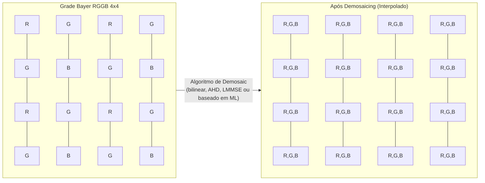
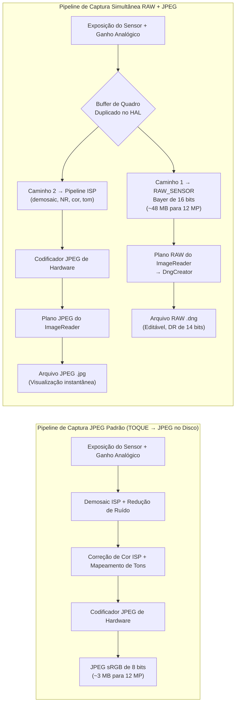

---     
sidebar_position: 18
title: "Capítulo 18: Fotografia RAW"
description: "Domine o formato RAW_SENSOR, a criação de arquivos DNG com o DngCreator, padrões Bayer e a captura simultânea de RAW+JPEG na API Camera2 do Android"
keywords: [Android Camera2, fotografia RAW, RAW_SENSOR, DngCreator, DNG, padrão Bayer, RGGB, JPEG_R, metadados da câmera]
---

# Capítulo 18: Fotografia RAW

A fotografia móvel profissional exige mais do que os JPEGs processados que o ISP (Processador de Sinal de Imagem) do Android produz por padrão. Quando você captura um JPEG, os dados brutos do sensor já foram filtrados, interpolados, corrigidos em termos de cor, reduzidos em ruído e mapeados em tons — destruindo a maior parte da margem de edição na qual os fotógrafos confiam. A API Camera2 oferece acesso direto ao formato **RAW_SENSOR**: dados de padrão Bayer não processados de 16 bits vindos diretamente do sensor, com zero interferência do ISP. Combinado com o **DngCreator**, o framework Android fornece tudo o que você precisa para produzir arquivos Adobe DNG (Digital Negative) compatíveis com os padrões que abrem diretamente no Lightroom, Capture One, Photoshop e em todos os editores RAW profissionais.

Este capítulo se baseia na pesquisa documentada na seção *RAW / DngCreator* da referência interna do projeto e a estende com código prático que você pode inserir em seu próprio aplicativo. Você pode ver essas capacidades enumeradas para cada dispositivo suportado no aplicativo [Android Camera Parameters](https://github.com/zoozooll/AndroidCameraParameters) — também disponível na [Google Play Store](https://play.google.com/store/apps/details?id=com.zoozooll.cameraparameters) — que relata o tamanho máximo de RAW, as variantes de RAW disponíveis (RAW10, RAW12, RAW14) e se os metadados do DngCreator estão totalmente preenchidos para cada ID de câmera.

## Por que RAW? O Custo do Processamento do ISP

Antes de mergulhar nos detalhes da API, é fundamental entender exatamente o que o ISP faz quando produz um JPEG e por que ignorá-lo é importante. Um pipeline típico de ISP de smartphone aplica os seguintes estágios em ordem:

1. **Fixação do nível de preto (Black level clamping)** — subtrai a linha de base da corrente escura do sensor.
2. **Correção de sombreamento da lente (Lens shading correction)** — remove vinhetas usando mapas de ganho por pixel.
3. **Demosaicing** — interpola a grade Bayer de 1 cor por pixel em uma imagem RGB completa.
4. **Redução de ruído** — aplica filtragem espacial/temporal que apaga detalhes finos junto com o ruído.
5. **Correção de cor** — aplica uma matriz 3×3 para mapear o espaço de cor do sensor para sRGB.
6. **Mapeamento de gama / tons** — compacta as 14 paradas lineares da cena em uma curva não linear de 8 bits.
7. **Aprimoramento de bordas (Edge enhancement)** — nitidez para compensar o filtro óptico passa-baixa.
8. **Compressão JPEG** — aplica subamostragem de croma com perdas (geralmente 4:2:0) e quantização.

O problema com este pipeline é que cada estágio é **irreversível** e ajustado para *pré-visualizações* de consumo, não para *pós-processamento* profissional. Um JPEG fixa os realces em taxas de contraste de 100:1 e envolve 14 bits de faixa dinâmica (DR) do sensor em 8 bits — de modo que, quando você aumenta as sombras em 2 paradas na pós-produção, obtém listras (banding) em vez de detalhes. O RAW preserva toda a saída linear do sensor, permitindo a recuperação de 4 a 6 paradas de sombra/realce e mudanças personalizadas de balanço de branco que não introduzem artefatos de cor.

```mermaid
flowchart TD
    subgraph ISP["Pipeline de Processamento ISP (Caminho JPEG)"]
        S1[Dados RAW do Sensor] --> S2[Fixação do Nível de Preto]
        S2 --> S3[Correção de Sombreamento da Lente]
        S3 --> S4[Demosaic]
        S4 --> S5[Redução de Ruído]
        S5 --> S6[Correção de Cor]
        S6 --> S7[Mapeamento de Gama / Tons]
        S7 --> S8[Aprimoramento de Bordas]
        S8 --> S9[Compressão JPEG]
        S9 --> S10["JPEG sRGB de 8 bits<br/>(≈6 paradas de DR utilizáveis)"]
    end

    subgraph RAW["Caminho RAW (Sem Processamento ISP)"]
        R1[Dados RAW do Sensor] --> R2["Padrão Bayer Linear de 16 bits<br/>(10–14 paradas de DR utilizáveis)"]
        R2 --> R3["DngCreator Grava<br/>Metadados + Dados de Pixel"]
        R3 --> R4["Arquivo .dng<br/>Editável no Lightroom/PS"]
    end
```



Compare visualmente os dois caminhos acima: o caminho JPEG remove dados em cada etapa, enquanto o caminho RAW preserva toda a carga útil do sensor. A compensação é que os arquivos RAW **não são diretamente exibíveis** — eles requerem uma passagem de renderização separada (a etapa de "revelação" no Lightroom) para interpretar a grade Bayer e converter para um espaço de cores como sRGB ou Rec.2020.

## A Matriz de Filtros de Cores Bayer

Os dados RAW não são RGB. Cada fotossítio no sensor registra apenas **uma cor** — vermelho, verde ou azul — porque um fotodiodo de silício por si só é daltônico e só pode medir a contagem de fótons (luminância). Para reconstruir a cor, os fabricantes depositam uma **Matriz de Filtros de Cores (CFA)** sobre o sensor, e a grade de canal único resultante recebe o nome de seu inventor: o padrão Bayer.

Existem quatro layouts de CFA comuns em dispositivos Android, identificados pela ordem do bloco 2×2 superior esquerdo:

| Padrão | Layout do Bloco | Caso de Uso Típico |
|---------|-------------|------------------|
| **RGGB** | `R G / G B` | Maioria dos smartphones (padrão Samsung, Sony Exmor RS) |
| **BGGR** | `B G / G R` | Sensores Sony IMX em alguns dispositivos Xiaomi/OnePlus |
| **GRBG** | `G R / B G` | Certos sensores OmniVision |
| **GBRG** | `G B / R G` | Raro; encontrado em alguns dispositivos Motorola intermediários |

A característica mais marcante da grade Bayer é que **50% dos pixels são verdes**, enquanto o vermelho e o azul recebem 25% cada. Esta não é uma escolha arbitrária — a resposta de luminância fotópica do olho humano atinge o pico nos comprimentos de onda verdes (em torno de 555 nm), portanto, dedicar o dobro de amostras ao verde maximiza a nitidez percebida e o desempenho de ruído. O canal de luminância em qualquer JPEG resultante é derivado em ~60% dos fotossítios verdes, de modo que a densidade de amostragem verde se traduz diretamente em detalhes resolvidos.



O bloco de demosaic acima (P11–P44) mostra como cada pixel é reconstruído: um fotossítio `R` usa os valores `G` e `B` de seus vizinhos via interpolação, e vice-versa. Esta interpolação é a maior fonte individual de suavização de imagem no pipeline JPEG — e exatamente por isso que você deseja fazer isso sozinho na pós-produção, onde o demosaicing de IA moderno (AI Enhance do Lightroom, Topaz DeNoise AI, etc.) pode entregar resultados mais nítidos do que o ISP de hardware em tempo real do smartphone.

## Formato RAW_SENSOR e Variantes Compactadas (RAW10 / RAW12 / RAW14)

O identificador canônico de formato RAW do Android é `ImageFormat.RAW_SENSOR`, que se enumera como um buffer de 16 bits por pixel armazenado no `Plane` retornado por `Image.getPlanes()`. No entanto, a profundidade de bits *efetiva* depende do dispositivo e é relatada via `CameraCharacteristics.SENSOR_INFO_BIT_DEPTH` — os bits superiores além da resolução real do ADC do sensor são preenchidos com zero.

A maioria dos smartphones contemporâneos usa uma das três variantes de RAW compactadas, que são expostas através de `StreamConfigurationMap.getOutputSizes()` com constantes de formato dedicadas:

| Constante de Formato | Bits/amostra | Layout de Armazenamento | Geração de Sensor Típica |
|-----------------|-------------|----------------|---------------------------|
| `RAW10`         | 10          | Compactado: 4 amostras por 5 bytes (alinhado ao MSB) | Sensores intermediários 2019–2022 (ex: IMX586, IMX682) |
| `RAW12`         | 12          | Compactado: 2 amostras por 3 bytes | Flagships 2021–2024 (ex: IMX800, IMX989 tipo 1 polegada) |
| `RAW14`         | 14          | Preenchimento de 16 bits (alinhado ao MSB) | Nível profissional / sensores de 1 polegada+ (IMX989 com DOL-HDR) |

Os formatos compactados são o motivo pelo qual você **deve usar `Buffer.getByte()` / `Buffer.getShort()` com ciência do pixel-stride**, em vez de tratar o buffer RAW como uma matriz short[] plana — as amostras RAW10 e RAW12 cruzam os limites de byte e exigem deslocamento de bits para extração. O `DngCreator` lida com toda essa compactação/descompactação de forma transparente se você passar o objeto `Image` diretamente, que é a abordagem recomendada.

## DNG: Padrão Digital Negative da Adobe 1.4

Por que gravar arquivos `.dng` em vez de um formato proprietário como `.arw` (Sony) ou `.cr3` (Canon)? Porque o **DNG é o único formato RAW universal**, publicado como ISO 12234-2 e aceito por todas as cadeias de ferramentas fotográficas profissionais. O DNG v1.4 (a versão que o Android visa) especifica:

- Um contêiner compatível com TIFF/EP (estrutura IFD little-endian).
- Tags TIFF obrigatórias para padrão CFA, níveis de preto e matrizes de cores.
- `ColorMatrix2` / `CalibrationIlluminant2` opcionais para perfis de iluminante duplo.
- Mapa de sombreamento de lente opcional (tag 0xC618) para correção de campo plano por pixel.
- IFD "makernotes" opcional para dados de calibração específicos do fabricante (OEM).

Sem esses metadados, um buffer RAW é apenas uma grade de números sem rótulo — nenhum editor RAW poderia renderizá-lo corretamente. A classe `DngCreator` no pacote `android.hardware.camera2` do Android foi construída especificamente para preencher **todos os metadados DNG 1.4 obrigatórios automaticamente** a partir de `CameraCharacteristics` e `CaptureResult`, o que significa que seu aplicativo não precisa enviar dados de calibração de sensor para cada dispositivo.

Os campos de metadados específicos que o `DngCreator` grava incluem:

| Tag DNG | Fonte | Propósito |
|---------|--------|---------|
| **BlackLevel** (SENSOR_BLACK_LEVEL_PATTERN) | `CameraCharacteristics` | Linha de base da corrente escura de 4 elementos por canal |
| **ColorMatrix1 / ColorMatrix2** (SENSOR_COLOR_TRANSFORM1 / 2) | `CameraCharacteristics` | Matrizes 3×3 mapeando RGB do sensor → XYZ no Iluminante A (D65) |
| **CalibrationIlluminant1 / 2** | `CameraCharacteristics` | Enum de iluminante padrão (17 = Standard A, 21 = D65) |
| **ForwardMatrix1 / ForwardMatrix2** (SENSOR_FORWARD_MATRIX1 / 2) | `CameraCharacteristics` | Transformação inversa XYZ → RGB do sensor |
| **NeutralColorPoint** (SENSOR_NEUTRAL_COLOR_POINT) | `CameraCharacteristics` | Balanço de branco nativo (proporções r/g, b/g) |
| **LensShadingMap** (STATISTICS_LENS_SHADING_MAP) | `CaptureResult` | Grade de ganho de 4 canais por canal para remoção de vinhetas |
| **CFA Pattern 2** | `CameraCharacteristics.SENSOR_INFO_COLOR_FILTER_ARRANGEMENT` | Codificação do bloco Bayer |
| **BaselineExposure** | `SENSOR_REFERENCE_ILLUMINANT1` | Offset de exposição padrão para aplicar durante a renderização |

Esta lista é extraída diretamente da especificação *RAW / DngCreator* no documento de pesquisa do projeto. Se qualquer um desses campos for relatado como `null` pela API Camera2, o `DngCreator` ainda produzirá um DNG válido, mas o arquivo resultante pode exigir calibração manual na pós-produção. Você pode verificar quais campos são preenchidos para cada ID de câmera usando o aplicativo Android Camera Parameters.

## Configurando a Captura Simultânea de RAW + JPEG

O fluxo de trabalho correto para a captura RAW usa **múltiplos alvos de saída em uma única `CaptureRequest`** — isso garante que o buffer RAW e o JPEG venham do *exato mesmo quadro* (timestamp idêntico, mesma exposição do sensor), o que é essencial para fluxos de trabalho de backup RAW+JPEG que a maioria dos fotógrafos espera. Tentar duas capturas sequenciais introduz variabilidade de quadro a quadro na exposição, AF e AWB.

### Passo 1: Consultar Capacidades e Tamanho Máximo de RAW

```kotlin
import android.hardware.camera2.CameraCharacteristics
import android.hardware.camera2.params.StreamConfigurationMap
import android.util.Size
import android.graphics.ImageFormat

fun getRawCapabilities(cameraId: String,
                       characteristics: CameraCharacteristics): Pair<Boolean, Size?> {
    val caps = characteristics.get(
        CameraCharacteristics.REQUEST_AVAILABLE_CAPABILITIES
    ) ?: intArrayOf()
    val supportsRaw = caps.contains(
        CameraCharacteristics.REQUEST_AVAILABLE_CAPABILITIES_RAW
    )
    if (!supportsRaw) return Pair(false, null)

    val configMap: StreamConfigurationMap? =
        characteristics.get(CameraCharacteristics.SCALER_STREAM_CONFIGURATION_MAP)

    val rawSizes = configMap?.getOutputSizes(ImageFormat.RAW_SENSOR)
        ?: emptyArray()
    val maxRawSize = rawSizes.maxByOrNull { it.width * it.height }

    return Pair(true, maxRawSize)
}
```

`REQUEST_AVAILABLE_CAPABILITIES_RAW` é a porta de entrada obrigatória — se não estiver definida, o HAL recusará qualquer saída RAW_SENSOR, e tentar criar um `ImageReader` com esse formato lançará uma `IllegalArgumentException`. O aplicativo Android Camera Parameters lista essa capacidade por ID de câmera em seu painel principal.

### Passo 2: Criar ImageReaders Duplos (RAW + JPEG)

```kotlin
import android.media.ImageReader
import android.graphics.ImageFormat

private var rawImageReader: ImageReader? = null
private var jpegImageReader: ImageReader? = null

fun setupDualImageReaders(rawSize: Size, jpegSize: Size) {
    rawImageReader = ImageReader.newInstance(
        rawSize.width,
        rawSize.height,
        ImageFormat.RAW_SENSOR,
        5 // Profundidade do buffer de aquisição: >= 2, 5 permite margem para captura burst
    ).apply {
        setOnImageAvailableListener(
            OnRawImageAvailableListener(),
            backgroundHandler
        )
    }

    jpegImageReader = ImageReader.newInstance(
        jpegSize.width,
        jpegSize.height,
        ImageFormat.JPEG,
        2
    ).apply {
        setOnImageAvailableListener(
            OnJpegImageAvailableListener(),
            backgroundHandler
        )
    }
}
```

A profundidade do buffer `maxImages` do RAW deve ser maior (5) porque os buffers RAW têm de 2 a 4 vezes a largura de banda do JPEG, e o HAL pode entregar de 2 a 3 quadros antes que o gravador de disco os processe. Ficar sem espaço no buffer RAW causa descartes de quadros silenciosos sem callback de erro.

### Passo 3: Criar uma CaptureSession com Ambas as Superfícies e Emitir uma Captura Multi-Alvo

```kotlin
import android.hardware.camera2.CameraDevice
import android.hardware.camera2.CaptureRequest
import android.view.Surface

lateinit var cameraDevice: CameraDevice

fun createCaptureSessionAndCapture(
    rawSurface: Surface,
    jpegSurface: Surface,
    previewSurface: Surface
) {
    val outputSurfaces = listOf(previewSurface, rawSurface, jpegSurface)

    cameraDevice.createCaptureSession(
        outputSurfaces,
        object : CameraCaptureSession.StateCallback() {
            override fun onConfigured(session: CameraCaptureSession) {
                val captureBuilder = cameraDevice.createCaptureRequest(
                    CameraDevice.TEMPLATE_STILL_CAPTURE
                ).apply {
                    addTarget(previewSurface)
                    addTarget(rawSurface)
                    addTarget(jpegSurface)

                    set(CaptureRequest.CONTROL_AF_MODE,
                        CaptureRequest.CONTROL_AF_MODE_CONTINUOUS_PICTURE)
                    set(CaptureRequest.CONTROL_AE_MODE,
                        CaptureRequest.CONTROL_AE_MODE_ON)
                    set(CaptureRequest.CONTROL_AWB_MODE,
                        CaptureRequest.CONTROL_AWB_MODE_OFF) // Travar WB no RAW!
                }

                session.capture(
                    captureBuilder.build(),
                    RawCaptureCallback(),
                    backgroundHandler
                )
            }
            override fun onConfigureFailed(session: CameraCaptureSession) = Unit
        },
        backgroundHandler
    )
}
```

Três detalhes aqui são inegociáveis:

1. **O AWB deve ser travado (`CONTROL_AWB_MODE_OFF`) para capturas RAW.** Se o AWB for deixado ativado, o HAL aplicará uma rampa de ganho RGB no meio do burst, o que significa que cada quadro RAW terá um balanço de branco nativo diferente — o que quebra a capacidade dos editores RAW de aplicar um perfil uniforme. Use `CaptureResult.SENSOR_NEUTRAL_COLOR_POINT` para derivar o WB correto na pós-produção.

2. **Use o `TEMPLATE_STILL_CAPTURE`** como modelo base. Ele configura o sensor para o modo de leitura de maior qualidade e desativa a redução de ruído específica da pré-visualização que o HAL poderia injetar.

3. **Todos os três alvos (preview, RAW, JPEG) estão em uma única `CaptureRequest`.** O HAL garante a entrega simultânea no tempo.

### Passo 4: Usar o DngCreator para Gravar o Arquivo DNG

O callback `OnImageAvailableListener` recebe objetos `Image` dos quais os dados de pixel RAW já estão acessíveis. Passe a `Image` *e* o `CaptureResult` correspondente para o `DngCreator`, junto com as `CameraCharacteristics` originais usadas para abrir a câmera — esta combinação é necessária para preencher corretamente todos os metadados do DNG 1.4.

```kotlin
import android.hardware.camera2.CameraCharacteristics
import android.hardware.camera2.CaptureResult
import android.hardware.camera2.DngCreator
import android.media.Image
import java.io.File
import java.io.FileOutputStream
import java.io.IOException

inner class OnRawImageAvailableListener : ImageReader.OnImageAvailableListener {
    private val pendingDngWrites =
        HashMap<Long, CaptureResult>() // timestamp → CaptureResult

    fun registerCaptureResult(timestamp: Long, result: CaptureResult) {
        pendingDngWrites[timestamp] = result
    }

    override fun onImageAvailable(reader: ImageReader) {
        var image: Image? = null
        try {
            image = reader.acquireLatestImage() ?: return
            val timestamp = image.timestamp

            val captureResult = pendingDngWrites.remove(timestamp) ?: return
            val characteristics = latestCameraCharacteristics ?: return

            val dngFile = File(
                getExternalFilesDir(null),
                "RAW_${System.currentTimeMillis()}.dng"
            )

            FileOutputStream(dngFile).use { fos ->
                val dngCreator = DngCreator(characteristics, captureResult)
                dngCreator.writeByteBuffer(
                    fos,
                    image.width,
                    image.height,
                    image.planes[0].buffer,
                    0 // padding, sempre 0 para RAW_SENSOR
                )
            }

        } catch (e: IOException) {
            Log.e(TAG, "Falha ao gravar arquivo DNG", e)
        } catch (e: IllegalStateException) {
            Log.e(TAG, "DngCreator rejeitou metadados (falta campo obrigatório)", e)
        } finally {
            image?.close() // CRÍTICO: NUNCA vaze referências de Image
        }
    }
}
```

O construtor do `DngCreator` recebe exatamente dois argumentos:
- **`CameraCharacteristics`** — campos estáticos por câmera (níveis de preto, matrizes de cores, padrão CFA, ponto de cor neutra, iluminantes 1 e 2).
- **`CaptureResult`** — campos dinâmicos por quadro (exposição do sensor, ISO, mapa de sombreamento da lente, posição da lente AF).

Se algum deles for `null` ou se faltar um campo de metadados obrigatório (ex: alguns dispositivos econômicos relatam `null` para `SENSOR_COLOR_TRANSFORM1`), o construtor lançará uma `IllegalArgumentException` no momento da construção (não no `writeByteBuffer`). É por isso que o aplicativo Android Camera Parameters relata explicitamente todos os campos relevantes para o DNG: os desenvolvedores podem pré-filtrar os dispositivos para evitar falhas em aparelhos com implementações incompletas do HAL.

O mapa `pendingDngWrites` por timestamp resolve um problema real de concorrência: `CaptureResult.CaptureCallback.onCaptureCompleted()` dispara **antes ou depois** de `OnImageAvailableListener.onImageAvailable()` (dependendo do HAL). A correspondência por `image.timestamp` == `CaptureResult.SENSOR_TIMESTAMP` garante que os metadados corretos sejam pareados com o buffer de pixel correto.

## Comparação do Pipeline de Processamento (Mermaid Detalhado)



A principal percepção deste diagrama é o **nó de duplicação de quadro G**: o HAL lê um quadro do sensor e então roteia uma cópia não modificada para a saída RAW enquanto alimenta a *mesma* cópia no ISP para codificação JPEG. Isso garante a paridade do quadro sem dobrar a largura de banda de leitura do sensor.

## Considerações de Desempenho e Limites Práticos

Gravar arquivos DNG de 12 a 48 MB no armazenamento flash leva um tempo mensurável:
- Armazenamento UFS 3.1: gravação sequencial de ~250 MB/s → DNG de 12 MP (~48 MB) leva ~190 ms.
- Armazenamento eMMC 5.1: gravação sequencial de ~120 MB/s → o mesmo arquivo leva ~400 ms.

Isso significa que você **não pode bloquear a thread de UI nas gravações DNG** — sempre execute `writeByteBuffer` em uma thread/Handler de segundo plano e sempre feche a `Image` em um bloco `finally` para evitar a inanição do buffer do HAL.

Outra restrição importante: nem todos os dispositivos suportam RAW + JPEG na mesma sessão, mesmo que `CAPABILITIES_RAW` esteja definido. A maneira correta de verificar é `StreamConfigurationMap.isOutputSupportedFor(surfaceList)` com ambas as superfícies na lista. Se isso retornar `false`, use sessões apenas RAW.

## Resumo

Este capítulo cobriu todo o fluxo de trabalho de fotografia RAW de ponta a ponta no Android Camera2:

- **O formato RAW_SENSOR** entrega a grade Bayer de 16 bits não processada do sensor, ignorando todos os estágios de processamento do ISP.
- **Os padrões Bayer** (RGGB, BGGR, GRBG, GBRG) alocam 50% dos fotossítios ao verde para amostragem de luminância otimizada para a visão humana.
- **Variantes compactadas** — RAW10, RAW12, RAW14 — armazenam amostras na profundidade de bits nativa do ADC; o DngCreator as descompacta de forma transparente.
- **DNG v1.4** é o contêiner RAW universal. O `DngCreator(characteristics, result).writeByteBuffer(...)` preenche todos os metadados obrigatórios: níveis de preto, matrizes de cores, mapa de sombreamento da lente, ponto de cor neutra e iluminantes de calibração 1 e 2.
- **CaptureRequests de múltiplos alvos** roteiam o mesmo quadro para os ImageReaders RAW e JPEG, garantindo a paridade de quadro para fluxos de trabalho RAW+JPEG.
- **A correspondência de timestamps** entre `CaptureResult` e `Image` é necessária porque os callbacks disparam em ordem dependente do HAL.

## O Que Vem a Seguir

No próximo capítulo, mudaremos da fotografia estática para o vídeo com o **Capítulo 19: Vídeo de Alta Velocidade**, onde usaremos o `CameraConstrainedHighSpeedCaptureSession` para alcançar capturas de 120 fps (câmera lenta de 4×) e 240 fps (câmera lenta de 8×). Você aprenderá por que as sessões de alta velocidade exigem o `createHighSpeedRequestList` em vez de CaptureRequests individuais e como o pipeline de alta velocidade dedicado do HAL ignora o caminho de pré-visualização normal para entregar taxas de quadros que, de outra forma, seriam proibitivas para a CPU.

Você pode validar as capacidades RAW do seu dispositivo, o tamanho máximo de RAW e a completude dos metadados do DngCreator instalando o [aplicativo Android Camera Parameters](https://play.google.com/store/apps/details?id=com.zoozooll.cameraparameters) — e contribuir com relatórios de dispositivos para o [repositório de código aberto no GitHub](https://github.com/zoozooll/AndroidCameraParameters) para ajudar outros desenvolvedores a saber quais dispositivos suportam fluxos de trabalho RAW profissionais.
