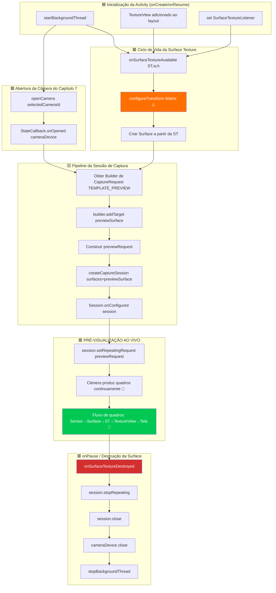

Este é o capítulo que você estava esperando. Após três capítulos construindo a estrutura (permissões, threads, CameraManager, enumeração, ciclo de vida de abertura/fechamento), você finalmente **verá a saída da câmera renderizada ao vivo na tela do dispositivo Android**. A pré-visualização é a alma de um aplicativo de câmera — é o que o usuário olha para enquadrar uma foto, verificar o foco e validar a exposição antes de tocar no obturador. Acertar nesse ponto faz a diferença entre um aplicativo instável e inutilizável e uma experiência de câmera polida e responsiva.

Para uma implementação de referência de pré-visualização que lida com casos extremos em centenas de dispositivos, veja a tela de pré-visualização no aplicativo **Android Camera Parameters** ([GitHub](https://github.com/zoozooll/AndroidCameraParameters) / [Google Play](https://play.google.com/store/apps/details?id=com.minininja.cameraparams)). Seu pipeline de pré-visualização inclui transformações cientes da orientação, superfícies de saída multi-resolução e limitação suave da taxa de quadros — tudo construído sobre os mesmos componentes fundamentais que cobrimos aqui.

## O Pipeline de Pré-visualização: Visão Geral dos Componentes

Antes de mergulharmos no código, vamos mapear a jornada conceitual de um único quadro de pré-visualização, do sensor da câmera até a tela do celular. Cada quadro passa por cinco camadas:

```
Sensor da Câmera → Pipeline do CameraDevice → Surface (BufferQueue) → SurfaceTexture → TextureView → Tela
```

Cada camada desempenha um papel específico e não intercambiável. Pular ou atalhar qualquer uma delas produz telas pretas, proporções de aspecto distorcidas ou rasgos na imagem. Vamos definir cada componente:

### 1. Surface — O Buffer de Destino da Imagem

Uma `Surface` é o conceito genérico da API Camera2 para **um destino para quadros de imagem processados**. Sob o capô, uma Surface envolve uma `BufferQueue` do Android: um buffer circular de buffers gráficos (normalmente com profundidade de 3 a 5 buffers) gerenciado pelo compositor do sistema (SurfaceFlinger). Quando o Camera2 "renderiza um quadro" em uma Surface, ele retira um buffer vazio da fila, preenche-o com dados de pixels e o coloca de volta na fila para o consumidor usar.

Qualquer coisa que possa consumir buffers gráficos pode expor uma `Surface`. Os consumidores mais comuns são:
- **SurfaceTexture** → alimenta um `TextureView` (para pré-visualização na tela — este capítulo)
- **Surface de um MediaRecorder/MediaCodec** → codificação de vídeo (não coberto nesta série)
- **Surface do ImageReader** → objetos `Image` acessíveis pela CPU para captura JPEG/RAW (Capítulo 9)

### 2. SurfaceTexture — A Ponte GPU para GPU

`SurfaceTexture` é a classe mágica que transforma um fluxo bruto de quadros de câmera em uma textura que a GPU pode amostrar e renderizar. É a extremidade consumidora da BufferQueue da Surface, mas em vez de entregar buffers para a CPU, ela os converte em uma textura OpenGL ES `GL_TEXTURE_EXTERNAL_OES`. Isso permite que o `TextureView` componha o quadro da câmera na hierarquia de visualização usando a renderização padrão da GPU — nenhuma cópia da CPU é necessária, de modo que a pré-visualização de 60+ FPS é facilmente alcançável.

Você obtém uma `Surface` para uma `SurfaceTexture` com:
```kotlin
val surface = Surface(surfaceTexture)
```

### 3. TextureView — A Janela na Tela

`TextureView` é uma subclasse de `View` que pode exibir o conteúdo de uma `SurfaceTexture`. É a sucessora moderna da antiga `SurfaceView` e a escolha recomendada para a pré-visualização do Camera2 por três motivos:
- Ela se comporta como uma View normal (pode ser animada, transformada, mesclada com alfa, colocada em contêineres roláveis).
- Ela não força a Activity a usar uma janela transparente (ao contrário da SurfaceView, que faz um "furo" na hierarquia de visualização).
- Seu `SurfaceTextureListener` nos fornece callbacks precisos de ciclo de vida para quando a superfície é criada, destruída ou redimensionada.

Para obter acesso orientado a callbacks à SurfaceTexture subjacente, o `TextureView` expõe `setSurfaceTextureListener()` com quatro callbacks:
- `onSurfaceTextureAvailable(surfaceTexture, width, height)` — a superfície está pronta para receber quadros (dispara uma vez quando a visualização é disposta no layout).
- `onSurfaceTextureSizeChanged(surfaceTexture, width, height)` — o tamanho da superfície mudou (ex: dispositivo rotacionado).
- `onSurfaceTextureDestroyed(surfaceTexture)` — prestes a ser destruída; devemos parar a pré-visualização antes que este retorne.
- `onSurfaceTextureUpdated(surfaceTexture)` — dispara para **cada novo quadro** (pode ser usado para conduzir sobreposições de rastreamento facial, etc.).

### 4. CameraCaptureSession — O Pipeline Configurado

Antes que um `CameraDevice` possa produzir qualquer quadro, você deve criar uma `CameraCaptureSession`. Uma sessão é uma **configuração de todas as superfícies de saída nas quais o pipeline da câmera irá gravar**. Você pode pensar nela como o "encanamento" do ISP (Processador de Sinal de Imagem) da câmera para rotear sua saída para um ou mais coletores. Para apenas pré-visualização, a sessão tem uma Surface (a do TextureView). Quando adicionarmos a captura de fotos no Capítulo 9, a sessão terá duas Surfaces: pré-visualização + `ImageReader`.

Regras principais:
- Uma sessão é criada com `CameraDevice.createCaptureSession(outputSurfaces, stateCallback, handler)`.
- A sessão só é utilizável **após** o disparo de `StateCallback.onConfigured(session)`.
- Um `CameraDevice` pode ter apenas **uma sessão ativa por vez**. Criar uma nova sessão fecha a anterior.
- A sessão possui *todas* as saídas durante sua vida útil; adicionar uma nova superfície (ex: decidir repentinamente gravar vídeo) requer desmontar a sessão antiga e criar uma nova com todas as superfícies (pré-visualização + gravador).

### 5. Solicitação de Captura Repetida (TEMPLATE_PREVIEW)

Uma vez configurada a sessão, como ocorre a pré-visualização contínua? O Camera2 é uma API orientada a solicitações — cada quadro é uma `CaptureRequest` enviada à sessão. Para a pré-visualização, enviamos **uma solicitação e a marcamos como repetida**: o hardware da câmera executará novamente essa mesma solicitação (com as mesmas configurações de sensor, alvos e estado 3A) continuamente, produzindo quadros tão rápido quanto o pipeline permitir (normalmente de 30 a 120 FPS).

Uma solicitação repetida é enviada com:
```kotlin
session.setRepeatingRequest(previewRequest, captureCallback, backgroundHandler)
```

O modelo para pré-visualização é `CameraDevice.TEMPLATE_PREVIEW`. O Camera2 fornece vários modelos pré-construídos que configuram centenas de parâmetros de baixo nível (exposição, faixa de taxa de quadros, modo 3A, redução de ruído, etc.) apropriadamente para o caso de uso. Para pré-visualização, o `TEMPLATE_PREVIEW` otimiza para **baixa latência e taxa de quadros suave**, mesmo que isso signifique uma faixa dinâmica de sensor ligeiramente reduzida em comparação com o `TEMPLATE_STILL_CAPTURE` (usado no Capítulo 9 para fotos).

## Fluxograma de Pré-visualização de Ponta a Ponta

O fluxograma abaixo mostra como todos esses componentes se conectam. Acompanhe-o de perto ao ler o código — cada bloco corresponde a uma chamada de função real.



O bloco destacado em laranja (`configureTransform`) e o bloco destacado em verde (PRÉ-VISUALIZAÇÃO AO VIVO) são as duas etapas mais críticas. Pule o `configureTransform` e sua pré-visualização ficará esticada, rotacionada ou achatada. Conecte tudo corretamente, mas falhe ao chamar `setRepeatingRequest`, e a tela permanecerá preta sem nenhum erro logado.

## Passo 1: Adicionar o TextureView ao Layout XML

Primeiro, crie ou atualize o arquivo `app/src/main/res/layout/activity_main.xml` para incluir um `TextureView` em tela cheia. Também adicionaremos uma sobreposição de `TextView` como indicador de status para que possamos ver o tamanho da pré-visualização.

```xml
<?xml version="1.0" encoding="utf-8"?>
<FrameLayout xmlns:android="http://schemas.android.com/apk/res/android"
    android:layout_width="match_parent"
    android:layout_height="match_parent">

    <TextureView
        android:id="@+id/textureView"
        android:layout_width="match_parent"
        android:layout_height="match_parent"
        android:layout_gravity="center" />

    <TextView
        android:id="@+id/statusTextView"
        android:layout_width="wrap_content"
        android:layout_height="wrap_content"
        android:layout_gravity="top|center_horizontal"
        android:layout_marginTop="16dp"
        android:background="#80000000"
        android:padding="8dp"
        android:textColor="#FFFFFFFF"
        android:textSize="12sp"
        tools:text="Inicializando câmera..." />

</FrameLayout>
```

Por que `FrameLayout` como raiz? Porque a pré-visualização é uma camada em tela cheia e o `FrameLayout` empilha os filhos com ordenação Z (filhos posteriores são desenhados por cima). Mais tarde, adicionaremos uma sobreposição de botão de obturador. O `TextureView` usa `match_parent` em ambas as dimensões — mas não se preocupe, usaremos o `configureTransform` abaixo para fazer o letterbox corretamente, de modo que os próprios pixels nunca fiquem esticados, embora a visualização preencha a tela.

## Passo 2: configureTransform — O Segredo da Proporção Correta da Pré-visualização

Se você não fizer nada e apenas canalizar quadros para um TextureView em tela cheia, a pré-visualização ficará **esticada**. Por quê? Porque os sensores de câmera têm uma proporção de aspecto fixa (quase sempre 4:3 para captura estática, às vezes 16:9 para modos de vídeo) e a tela do celular tem uma proporção diferente (frequentemente ~20:9 em flagships modernos). Se a câmera emitir um quadro de pré-visualização de 4032×3024 (4:3) e o TextureView esticá-lo para 1080×2400 (20:9), os rostos parecerão finos e altos.

A solução é o **`configureTransform(viewWidth: Int, viewHeight: Int)`**: um método que calcula uma `Matrix` (rotação + escala de corte central) e a aplica ao TextureView. A matriz faz três coisas:
1. **Rotaciona** a imagem pelo número de graus que o dispositivo está rotacionado em relação à orientação natural do sensor da câmera.
2. **Escalona** a imagem para que ela preencha totalmente o TextureView, mantendo a proporção de aspecto (estilo center-crop, ou letterbox com barras pretas, se preferir).
3. **Re-centraliza** a imagem escalonada/rotacionada para que ela fique no meio da visualização.

Esta é a função individual mais copiada das amostras oficiais de Android Camera2 — todo desenvolvedor precisa dela e é fácil errar. Aqui está a versão canônica:

```kotlin
/**
 * Configura a transformação Matrix necessária para o `textureView`.
 * Este método deve ser chamado após o tamanho da pré-visualização da câmera ser determinado
 * e também após o tamanho do `textureView` ser fixado.
 *
 * @param viewWidth  A largura do `textureView`
 * @param viewHeight A altura do `textureView`
 * @param previewSize O tamanho de pré-visualização selecionado pela câmera (largura, altura)
 * @param sensorOrientationDegrees A característica SENSOR_ORIENTATION da câmera
 * @param deviceDisplayRotationDegrees A rotação da tela (0/90/180/270) em relação à natural
 */
private fun configureTransform(
    viewWidth: Int,
    viewHeight: Int,
    previewSize: android.util.Size,
    sensorOrientationDegrees: Int,
    deviceDisplayRotationDegrees: Int
) {
    val rotation = when (deviceDisplayRotationDegrees) {
        android.view.Surface.ROTATION_0 -> 0
        android.view.Surface.ROTATION_90 -> 90
        android.view.Surface.ROTATION_180 -> 180
        android.view.Surface.ROTATION_270 -> 270
        else -> return
    }

    val matrix = android.graphics.Matrix()
    val viewRect = android.graphics.RectF(0f, 0f, viewWidth.toFloat(), viewHeight.toFloat())
    val bufferRect = android.graphics.RectF(
        0f,
        0f,
        previewSize.height.toFloat(),
        previewSize.width.toFloat()
    )
    val centerX = viewRect.centerX()
    val centerY = viewRect.centerY()

    // Passo 1: Considerar a rotação do dispositivo em relação à orientação do sensor
    if (Surface.ROTATION_90 == rotation || Surface.ROTATION_270 == rotation) {
        bufferRect.offset(centerX - bufferRect.centerX(), centerY - bufferRect.centerY())
        matrix.setRectToRect(viewRect, bufferRect, android.graphics.Matrix.ScaleToFit.FILL)
        val scale = maxOf(
            viewHeight.toFloat() / previewSize.height,
            viewWidth.toFloat() / previewSize.width
        )
        matrix.postScale(scale, scale, centerX, centerY)
        matrix.postRotate(
            (90 * (rotation - 2)).toFloat(),
            centerX,
            centerY
        )
    } else if (Surface.ROTATION_180 == rotation) {
        matrix.postRotate(180f, centerX, centerY)
    }

    // Passo 2: Também considerar como o sensor é montado em relação ao dispositivo
    val relativeRotation = (sensorOrientationDegrees - rotation + 360) % 360
    if (relativeRotation != 0) {
        matrix.postRotate(relativeRotation.toFloat(), centerX, centerY)
    }

    textureView.setTransform(matrix)
}
```

Um detalhe importante: `previewSize` é o tamanho de saída da câmera, relatado como (largura, altura) na **orientação do sensor**. As dimensões do TextureView estão na **orientação da tela**. O truque com RectF trocando largura/altura (`bufferRect` usa `previewSize.height` para largura e vice-versa) considera essa inversão de coordenadas sensor-vs-tela.

Você precisará de duas informações de CameraCharacteristics para chamar isso:
- `SENSOR_ORIENTATION` — quantos graus o sensor está rotacionado em relação à orientação natural do dispositivo. Para câmeras traseiras, isso é quase sempre 90°. Para câmeras frontais, é tipicamente 270° (para que a imagem seja espelhada corretamente). Leia isso uma vez por câmera na fase de descoberta.
- Rotação da tela — obtida de `(getSystemService(Context.WINDOW_SERVICE) as WindowManager).defaultDisplay.rotation` (em APIs mais novas use `display?.rotation`).

## Passo 3: Escolher um Tamanho de Pré-visualização de SCALER_STREAM_CONFIGURATION_MAP

Antes de podermos escrever o `configureTransform` ou criar uma sessão, precisamos saber qual tamanho de pré-visualização a câmera pode emitir. Para cada câmera, `CameraCharacteristics.SCALER_STREAM_CONFIGURATION_MAP` retorna um `StreamConfigurationMap` contendo todos os pares (formato, tamanho) válidos que a câmera pode produzir. Para a pré-visualização em uma `SurfaceTexture`, consultamos os tamanhos de saída para a classe `SurfaceTexture::class.java`:

```kotlin
private fun chooseOptimalPreviewSize(
    characteristics: CameraCharacteristics,
    maxWidth: Int,
    maxHeight: Int,
    targetAspectRatio: Double
): android.util.Size {
    val map = characteristics.get(CameraCharacteristics.SCALER_STREAM_CONFIGURATION_MAP)
        ?: throw IllegalStateException("Mapa de configuração de fluxo não disponível")

    // Todos os tamanhos suportados para saída SurfaceTexture (classe de pré-visualização)
    val choices = map.getOutputSizes(SurfaceTexture::class.java).toList()

    // Preferir tamanhos que combinem com a proporção de aspecto, depois os que cabem nas dimensões máximas,
    // então escolher o maior (melhor qualidade) entre os restantes.
    val acceptable = choices.filter {
        it.width <= maxWidth
            && it.height <= maxHeight
            && Math.abs(it.width.toDouble() / it.height - targetAspectRatio) < 0.02
    }

    val chosen = acceptable.ifEmpty { choices }
        .maxByOrNull { it.width * it.height }!!

    Log.d(TAG, "Tamanho de pré-visualização selecionado: ${chosen.width}x${chosen.height} " +
        "(de ${choices.size} opções, máxPermitido=${maxWidth}x${maxHeight})")
    return chosen
}
```

Parâmetros padrão de bom senso: `maxWidth = 1920`, `maxHeight = 1080`, `targetAspectRatio = textureView.width.toDouble() / textureView.height`. A superfície de pré-visualização não precisa ser 4K — 1080p é o suficiente para o enquadramento na tela de um celular, consome menos energia e mantém baixa a latência do pipeline.

## Passo 4: Código Completo do Capítulo 8 — Pré-visualização ao Vivo

Aqui está o `MainActivity.kt` completo integrando cada peça deste capítulo: o `TextureView` baseado no layout, `SurfaceTextureListener`, seleção de tamanho, `configureTransform`, criação da `CameraCaptureSession` e o importantíssimo `setRepeatingRequest(TEMPLATE_PREVIEW)`.

```kotlin
package com.example.camera2tutorial

import android.Manifest
import android.content.Context
import android.content.pm.PackageManager
import android.graphics.Matrix
import android.graphics.RectF
import android.graphics.SurfaceTexture
import android.hardware.camera2.CameraAccessException
import android.hardware.camera2.CameraCharacteristics
import android.hardware.camera2.CameraCaptureSession
import android.hardware.camera2.CameraDevice
import android.hardware.camera2.CameraManager
import android.hardware.camera2.CaptureRequest
import android.hardware.camera2.params.StreamConfigurationMap
import android.os.Bundle
import android.os.Handler
import android.os.HandlerThread
import android.util.Log
import android.util.Size
import android.view.Surface
import android.view.TextureView
import android.view.WindowManager
import android.widget.TextView
import android.widget.Toast
import androidx.appcompat.app.AppCompatActivity
import androidx.core.app.ActivityCompat
import androidx.core.content.ContextCompat
import java.util.Collections
import java.util.concurrent.Semaphore
import java.util.concurrent.TimeUnit
import kotlin.math.max

class MainActivity : AppCompatActivity() {

    // UI
    private lateinit var textureView: TextureView
    private lateinit var statusTextView: TextView

    // Threads
    private lateinit var backgroundThread: HandlerThread
    private lateinit var backgroundHandler: Handler

    // Câmera
    private lateinit var cameraManager: CameraManager
    private var cameraDevice: CameraDevice? = null
    private var captureSession: CameraCaptureSession? = null
    private var previewRequestBuilder: CaptureRequest.Builder? = null
    private var previewRequest: CaptureRequest? = null
    private var selectedCameraId: String? = null
    private var sensorOrientation = 0
    private lateinit var previewSize: Size

    private val cameraOpenCloseLock = Semaphore(1)

    // ------------------------- Ciclo de Vida -------------------------
    override fun onCreate(savedInstanceState: Bundle?) {
        super.onCreate(savedInstanceState)
        setContentView(R.layout.activity_main)

        textureView = findViewById(R.id.textureView)
        statusTextView = findViewById(R.id.statusTextView)
        statusTextView.text = "Aguardando layout do TextureView..."

        if (allPermissionsGranted()) {
            initializeCameraManager()
        } else {
            ActivityCompat.requestPermissions(
                this, REQUIRED_PERMISSIONS, REQUEST_CODE_PERMISSIONS
            )
        }
    }

    override fun onResume() {
        super.onResume()
        startBackgroundThread()

        if (allPermissionsGranted()) {
            if (!this::cameraManager.isInitialized) initializeCameraManager()
            // Se a visualização de textura já estiver disponível, abra a câmera e crie a sessão agora
            if (textureView.isAvailable) {
                openCameraAndStartPreview(textureView.width, textureView.height)
            }
        } else {
            ActivityCompat.requestPermissions(
                this, REQUIRED_PERMISSIONS, REQUEST_CODE_PERMISSIONS
            )
        }
    }

    override fun onPause() {
        closeCameraAndPreview()
        stopBackgroundThread()
        super.onPause()
    }

    private fun startBackgroundThread() {
        backgroundThread = HandlerThread("Camera2Background").apply { start() }
        backgroundHandler = Handler(backgroundThread.looper)
    }

    private fun stopBackgroundThread() {
        backgroundThread.quitSafely()
        try { backgroundThread.join(1000) } catch (_: InterruptedException) {}
    }

    // ------------------------- Capítulo 6 condensado: Descoberta -------------------------
    data class CameraInfo(val id: String, val facing: Int?, val hwLevel: Int?, val chars: CameraCharacteristics)

    private fun initializeCameraManager() {
        cameraManager = getSystemService(Context.CAMERA_SERVICE) as CameraManager
        val discovered = mutableListOf<CameraInfo>()
        for (id in cameraManager.cameraIdList) {
            val chars = try { cameraManager.getCameraCharacteristics(id) } catch (_: Exception) { continue }
            discovered += CameraInfo(
                id,
                chars.get(CameraCharacteristics.LENS_FACING),
                chars.get(CameraCharacteristics.INFO_SUPPORTED_HARDWARE_LEVEL),
                chars
            )
        }
        val chosen = discovered
            .sortedWith(
                compareByDescending<CameraInfo> { it.facing == CameraCharacteristics.LENS_FACING_BACK }
                    .thenByDescending { it.hwLevel ?: -1 }
            )
            .first()
        selectedCameraId = chosen.id
        sensorOrientation = chosen.chars.get(CameraCharacteristics.SENSOR_ORIENTATION) ?: 90

        Log.d(TAG, "Câmera selecionada id=$selectedCameraId, sensorOrientation=$sensorOrientation°")

        // Conectar o listener da SurfaceTexture — ele disparará o início real da pré-visualização
        textureView.surfaceTextureListener = object : TextureView.SurfaceTextureListener {
            override fun onSurfaceTextureAvailable(st: SurfaceTexture, width: Int, height: Int) {
                Log.d(TAG, "✅ SurfaceTexture disponível: ${width}x$height")
                statusTextView.text = "SurfaceTexture pronta — abrindo câmera..."
                openCameraAndStartPreview(width, height)
            }
            override fun onSurfaceTextureSizeChanged(st: SurfaceTexture, w: Int, h: Int) {
                if (this@MainActivity::previewSize.isInitialized) {
                    configureTransform(w, h)
                }
            }
            override fun onSurfaceTextureDestroyed(st: SurfaceTexture): Boolean {
                Log.d(TAG, "⛔ SurfaceTexture destruída")
                return true
            }
            override fun onSurfaceTextureUpdated(st: SurfaceTexture) {
                // Chamado a CADA quadro. Mantenha o trabalho aqui <1ms. Conte os quadros para FPS, se desejar.
            }
        }
    }

    // ------------------------- Capítulo 7 condensado: openCamera -------------------------
    private val deviceStateCallback = object : CameraDevice.StateCallback() {
        override fun onOpened(camera: CameraDevice) {
            cameraOpenCloseLock.release()
            cameraDevice = camera
            Log.d(TAG, "✅ Câmera ${camera.id} aberta → criando sessão de captura")
            statusTextView.text = "Câmera aberta — criando sessão de captura..."

            // ⬇️ Capítulo 8: Com a câmera aberta E a SurfaceTexture disponível,
            // agora criamos a sessão de captura
            createCaptureSession()
        }
        override fun onDisconnected(camera: CameraDevice) {
            cameraOpenCloseLock.release()
            cameraDevice?.close()
            cameraDevice = null
            Log.w(TAG, "Câmera ${camera.id} desconectada")
        }
        override fun onError(camera: CameraDevice, error: Int) {
            cameraOpenCloseLock.release()
            cameraDevice?.close()
            cameraDevice = null
            val msg = when (error) {
                ERROR_CAMERA_IN_USE -> "Câmera em uso por outro aplicativo"
                else -> "Erro na câmera $error"
            }
            Toast.makeText(this@MainActivity, msg, Toast.LENGTH_LONG).show()
        }
    }

    // ------------------------- 🎯 CAPÍTULO 8: Pipeline de Pré-visualização -------------------------
    private fun openCameraAndStartPreview(viewWidth: Int, viewHeight: Int) {
        val camId = selectedCameraId ?: return
        if (ContextCompat.checkSelfPermission(this, Manifest.permission.CAMERA)
            != PackageManager.PERMISSION_GRANTED) return
        if (!cameraOpenCloseLock.tryAcquire(2500, TimeUnit.MILLISECONDS)) {
            Toast.makeText(this, "Timeout de bloqueio da câmera", Toast.LENGTH_SHORT).show()
            return
        }

        // 1) Decidir o tamanho da pré-visualização ANTES de abrir a sessão
        val chars = cameraManager.getCameraCharacteristics(camId)
        previewSize = chooseOptimalPreviewSize(chars, viewWidth, viewHeight)

        // 2) Aplicar transformação de correção de aspecto ao TextureView
        configureTransform(viewWidth, viewHeight)

        // 3) Configurar o tamanho do buffer da SurfaceTexture para CORRESPONDER ao tamanho escolhido
        textureView.surfaceTexture!!.setDefaultBufferSize(previewSize.width, previewSize.height)

        statusTextView.text = "Tamanho da pré-visualização: ${previewSize.width}×${previewSize.height}"

        // 4) Abrir a câmera — a criação da sessão continua em onOpened → createCaptureSession()
        try {
            cameraManager.openCamera(camId, deviceStateCallback, backgroundHandler)
        } catch (e: CameraAccessException) {
            cameraOpenCloseLock.release()
            Toast.makeText(this, "Falha ao abrir a câmera: ${e.reason}", Toast.LENGTH_LONG).show()
        }
    }

    /**
     * Cria uma CameraCaptureSession cuja única superfície de saída é a do TextureView.
     * Em seguida, constrói uma solicitação TEMPLATE_PREVIEW e inicia a repetição.
     */
    private fun createCaptureSession() {
        val camera = cameraDevice ?: return
        val texture = textureView.surfaceTexture ?: return

        val previewSurface = Surface(texture)
        val outputSurfaces = Collections.singletonList(previewSurface)

        try {
            // Construir o Builder de CaptureRequest TEMPLATE_PREVIEW uma vez
            previewRequestBuilder =
                camera.createCaptureRequest(CameraDevice.TEMPLATE_PREVIEW).apply {
                    addTarget(previewSurface)
                }

            // Criar a sessão de captura
            camera.createCaptureSession(
                outputSurfaces,
                object : CameraCaptureSession.StateCallback() {
                    override fun onConfigured(session: CameraCaptureSession) {
                        captureSession = session
                        previewRequest = previewRequestBuilder!!.build()
                        Log.d(TAG, "✅ CaptureSession configurada → iniciando pré-visualização repetida")
                        statusTextView.text = "🎥 PRÉ-VISUALIZAÇÃO AO VIVO: ${previewSize.width}×${previewSize.height}"

                        // ⭐ ESTA É A LINHA MÁGICA QUE INICIA A PRÉ-VISUALIZAÇÃO:
                        session.setRepeatingRequest(
                            previewRequest!!,
                            null,  // CaptureCallback é nulo para pré-visualização — não precisamos de metadados por quadro
                            backgroundHandler
                        )
                    }

                    override fun onConfigureFailed(session: CameraCaptureSession) {
                        Log.e(TAG, "❌ Falha na configuração da CaptureSession")
                        Toast.makeText(
                            this@MainActivity,
                            "Falha na sessão de captura — pré-visualização indisponível",
                            Toast.LENGTH_LONG
                        ).show()
                    }

                    override fun onClosed(session: CameraCaptureSession) {
                        // Opcional: gancho de limpeza simétrica
                        if (captureSession === session) captureSession = null
                    }
                },
                backgroundHandler
            )
        } catch (e: CameraAccessException) {
            Log.e(TAG, "createCaptureSession lançou CameraAccessException", e)
        } catch (e: IllegalStateException) {
            Log.e(TAG, "A câmera foi fechada durante a criação da sessão", e)
        }
    }

    /**
     * Escolhe o maior tamanho de pré-visualização que corresponda à proporção da visualização
     * e caiba nas dimensões máximas dadas.
     */
    private fun chooseOptimalPreviewSize(
        characteristics: CameraCharacteristics,
        viewWidth: Int,
        viewHeight: Int
    ): Size {
        val map: StreamConfigurationMap =
            characteristics.get(CameraCharacteristics.SCALER_STREAM_CONFIGURATION_MAP)
                ?: throw IllegalStateException("StreamConfigurationMap indisponível")

        val viewAspect = max(viewWidth, viewHeight).toDouble() / min(viewWidth, viewHeight)
        val choices = map.getOutputSizes(SurfaceTexture::class.java).toList()

        // Limite superior razoável para a pré-visualização — não há necessidade de fluxo 4K
        val maxPreviewPixels = 1920 * 1080

        val aspectMatches = choices.filter {
            val szAspect = max(it.width, it.height).toDouble() / min(it.width, it.height)
            kotlin.math.abs(szAspect - viewAspect) < 0.02
                && (it.width * it.height) <= maxPreviewPixels * 2
        }

        val final = aspectMatches.ifEmpty { choices }
            .sortedByDescending { it.width * it.height }
            .first()

        Log.d(TAG, "Escolha do tamanho de pré-visualização: ${final.width}×${final.height} " +
            "(de ${choices.size} opções, targetAspect=%.2f)".format(viewAspect))
        return final
    }

    /**
     * Aplica uma Matrix ao TextureView para que os pixels da pré-visualização sejam renderizados
     * na proporção correta (sem esticar) e orientação correta (sem rotação).
     */
    private fun configureTransform(viewWidth: Int, viewHeight: Int) {
        if (!this::previewSize.isInitialized) return
        val rotation = (getSystemService(Context.WINDOW_SERVICE) as WindowManager)
            .defaultDisplay.rotation
        val matrix = Matrix()
        val viewRect = RectF(0f, 0f, viewWidth.toFloat(), viewHeight.toFloat())
        val bufferRect = RectF(
            0f, 0f,
            previewSize.height.toFloat(),
            previewSize.width.toFloat()
        )
        val cx = viewRect.centerX()
        val cy = viewRect.centerY()
        bufferRect.offset(cx - bufferRect.centerX(), cy - bufferRect.centerY())
        matrix.setRectToRect(viewRect, bufferRect, Matrix.ScaleToFit.FILL)
        val scale = max(
            viewHeight.toFloat() / previewSize.height,
            viewWidth.toFloat() / previewSize.width
        )
        matrix.postScale(scale, scale, cx, cy)
        val rotationDegrees = when (rotation) {
            Surface.ROTATION_0 -> sensorOrientation
            Surface.ROTATION_90 -> 0
            Surface.ROTATION_180 -> 360 - sensorOrientation
            Surface.ROTATION_270 -> 180
            else -> 0
        }
        matrix.postRotate(rotationDegrees.toFloat(), cx, cy)
        textureView.setTransform(matrix)
        Log.d(TAG, "configureTransform aplicado (rotação=$rotationDegrees°, escala=%.2f)".format(scale))
    }

    // ------------------------- Desmontagem -------------------------
    private fun closeCameraAndPreview() {
        try {
            cameraOpenCloseLock.acquire()

            captureSession?.apply {
                try {
                    stopRepeating()
                    abortCaptures()
                } catch (_: CameraAccessException) {}
                close()
            }
            captureSession = null

            cameraDevice?.close()
            cameraDevice = null

            Log.d(TAG, "🔒 Pré-visualização e câmera totalmente desmontadas")
        } catch (_: InterruptedException) {
        } finally {
            cameraOpenCloseLock.release()
        }
    }

    // ------------------------- Boilerplate -------------------------
    companion object {
        private const val TAG = "Camera2Tutorial"
        private const val REQUEST_CODE_PERMISSIONS = 10
        private val REQUIRED_PERMISSIONS = arrayOf(Manifest.permission.CAMERA)
    }

    private fun allPermissionsGranted() = REQUIRED_PERMISSIONS.all {
        ContextCompat.checkSelfPermission(baseContext, it) == PackageManager.PERMISSION_GRANTED
    }

    override fun onRequestPermissionsResult(
        requestCode: Int, permissions: Array<out String>, grantResults: IntArray
    ) {
        super.onRequestPermissionsResult(requestCode, permissions, grantResults)
        if (requestCode == REQUEST_CODE_PERMISSIONS) {
            if (allPermissionsGranted()) {
                initializeCameraManager()
            } else {
                Toast.makeText(this, "Permissão de câmera necessária", Toast.LENGTH_LONG).show()
                finish()
            }
        }
    }
}
