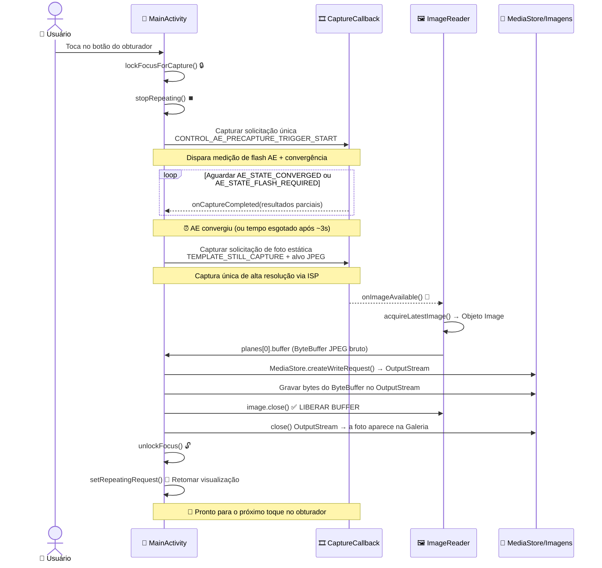

Parabéns por chegar ao capítulo final da Parte II! Se você nos acompanhou desde o Capítulo 5, seu aplicativo agora possui: tratamento de permissões, uma thread dedicada de segundo plano, enumeração de câmeras com `CameraCharacteristics`, gerenciamento robusto de ciclo de vida de abertura/fechamento via `Semaphore` e uma visualização ao vivo suave e orientada corretamente, renderizada através do `TextureView`. O que está faltando? **A capacidade de tocar em um botão e guardar uma foto**. É isso que este capítulo entrega.

Ao final deste capítulo, seu projeto tutorial será uma aplicação de câmera genuinamente utilizável: ao tocar no obturador, o aplicativo congelará brevemente a visualização (como deve ser, para limpar o pipeline), uma imagem estática será capturada com convergência de exposição automática adequada, será salva no diretório de Imagens compartilhado do dispositivo com metadados de orientação EXIF corretos e a visualização será retomada automaticamente. Você poderá então abrir a foto no Google Fotos ou no aplicativo Android Camera Parameters ([GitHub](https://github.com/zoozooll/AndroidCameraParameters), [Google Play](https://play.google.com/store/apps/details?id=com.minininja.cameraparams)) para inspecionar os dados EXIF, a resolução e a qualidade.

O modo de captura manual do aplicativo Android Camera Parameters usa uma versão mais avançada do pipeline que construiremos neste capítulo: ele executa capturas sequenciais de vários quadros com ISO, tempo de exposição e posição da lente personalizados por quadro — mas tudo isso se baseia nos mesmos fundamentos de `ImageReader` + `CaptureCallback` que você aprenderá aqui.

## Por Que Tirar uma Foto é Mais Complexo do que a Visualização

À primeira vista, "apenas capturar um quadro" parece fácil — já temos 60 quadros de visualização por segundo fluindo pela sessão, por que não podemos pegar um? A resposta é que os quadros de visualização e os quadros estáticos são saídas fundamentalmente diferentes:

1. **Diferença de resolução**: A visualização é de ~1–2 MP (1080p). Uma foto estática deve usar a resolução **máxima** do sensor (muitas vezes 50+ MP em flagships modernos). Você não quer uma foto de 2 MP quando seu telefone pode entregar 50 MP.
2. **Diferença de exposição**: O `TEMPLATE_PREVIEW` otimiza para uma taxa de quadros de baixa latência. O `TEMPLATE_STILL_CAPTURE` otimiza para alcance dinâmico, redução de ruído e precisão de cor — o quadro estático precisa do processamento ISP de maior qualidade que o pipeline pode oferecer.
3. **Convergência 3A**: Antes de tirar uma foto, o algoritmo de Exposição Automática (AE) da câmera precisa ser avisado: "estamos prestes a tirar uma foto estática — trave na cena atual, convirja a exposição, o balanço de branco e o foco, e dispare o flash se necessário". Este é o **gatilho de pré-captura**. Ignorá-lo leva a fotos que ficam sobre ou subexpostas em relação ao que a pré-visualização mostrava.
4. **Armazenamento e Scoped Storage**: O quadro de visualização nunca é persistido. O quadro da foto deve ser gravado no disco como um arquivo JPEG válido, indexado pelo MediaStore para que os aplicativos de galeria possam vê-lo e, no Android 10+, isso deve usar as APIs de Scoped Storage (sem gravações arbitrárias de `File` em `/sdcard/DCIM/`).

A captura estática é uma **máquina de estados assíncrona de vários estágios**, não uma única chamada. O diagrama de sequência abaixo mostra a ordem e o tempo exatos que você deve implementar. Não pule nenhuma etapa.



O tempo do gatilho de pré-captura é crítico: ele deve ser enviado ANTES da captura estática, e você deve esperar o AE convergir (ou atingir um timeout) antes de disparar a foto. Se você pular a espera, a foto usará as configurações de exposição da pré-visualização, que podem estar ajustadas para alta taxa de quadros em vez de qualidade fotográfica.

## Introduzindo o ImageReader: O Coletor de Quadros Acessível pela CPU

No Capítulo 8, enviamos quadros de visualização para um `SurfaceTexture` (coletor GPU). Para a captura estática, precisamos de um coletor acessível pela CPU para que possamos gravar os bytes JPEG no disco. Esse coletor é o `ImageReader`.

O `ImageReader` é construído com:
```kotlin
val imageReader = ImageReader.newInstance(
    width,           // Largura em pixels das fotos estáticas (tamanho estático máx das características)
    height,          // Altura em pixels das fotos estáticas
    ImageFormat.JPEG,// Formato — JPEG para fotos, RAW_SENSOR para RAW DNG, YUV_420_888 para processamento
    maxImages        // Quantos buffers alocar na fila (normalmente de 2 a 5)
)
```

Os quatro parâmetros explicados:

1. **width/height**: Use o tamanho JPEG máximo da câmera de `SCALER_STREAM_CONFIGURATION_MAP.getOutputSizes(ImageFormat.JPEG)`. Sempre escolha o maior tamanho para obter a foto de melhor qualidade.
2. **ImageFormat.JPEG**: O Processador de Sinal de Imagem (ISP) executará o pipeline completo de codificação JPEG (codificação de Huffman, quantização, incorporação de EXIF, cabeçalho JFIF) antes de entregar o quadro. O `Image.planes[0].buffer` é um **arquivo JPEG completo e válido** — nenhuma recodificação é necessária; você pode gravar esses bytes diretamente no disco.
3. **maxImages**: A profundidade da `BufferQueue` interna. Os buffers JPEG são grandes (5–20 MB cada). Defina isso como **2** para uma captura de foto típica (um em voo + um reserva). Definir um valor maior desperdiça RAM; definir como **1** e esquecer de chamar `close()` na Image leva a um deadlock permanente de captura (a fila nunca poderá retirar outro buffer vazio).

O `ImageReader` expõe duas superfícies de API cruciais:
- **`imageReader.surface`**: Retorna um `Surface` que pode ser adicionado como alvo a CaptureRequests e incluído na lista de superfícies de saída da `CameraCaptureSession`.
- **`imageReader.setOnImageAvailableListener(listener, handler)`**: Registra um callback que dispara a **cada novo quadro** entregue a este leitor. Dentro deste callback, você chama `acquireLatestImage()` (ou `acquireNextImage()`) para obter o objeto `Image`.

### ⚠️ REGRA CRÍTICA: Sempre feche a Image

Se você chamar `acquireLatestImage()` e **não** chamar `image.close()`, esse buffer é **removido permanentemente do pool**. Uma vez que os buffers `maxImages` vazarem, o `OnImageAvailableListener` para de disparar PARA SEMPRE (a fila não tem buffers vazios para receber novos quadros, então nenhum quadro novo pode chegar). Sempre use um bloco try/finally:

```kotlin
val image = imageReader.acquireLatestImage()
try {
    // Use os bytes da imagem aqui
} finally {
    image.close() // SEMPRE. Sem exceções.
}
```

Este é o erro mais comum do Capítulo 9: a captura funciona uma vez e depois nunca mais funciona até que o aplicativo seja reiniciado.

## A Máquina de Estados AE de Pré-captura

O sistema 3A do Camera2 (Auto-Exposure / Auto-Focus / Auto-White-Balance) é uma máquina de estados por quadro acionada pela chave de solicitação `CONTROL_AE_PRECAPTURE_TRIGGER`. O fluxo:

1. **Parar a pré-visualização repetida**: `captureSession.stopRepeating()`. Não queremos quadros de visualização se intercalando com o pipeline estático.
2. **Disparar o gatilho de pré-captura**: Construa uma única `CaptureRequest` que defina `CONTROL_AE_PRECAPTURE_TRIGGER` como `START`. Envie-a com `captureSession.capture()` (NÃO `setRepeatingRequest` — é um comando de disparo único, não contínuo).
3. **Aguardar a convergência**: No `CaptureCallback.onCaptureCompleted()` do gatilho de pré-captura (e quadros subsequentes), inspecione `CaptureResult.CONTROL_AE_STATE`. Estamos esperando por um dos seguintes:
   - `CONTROL_AE_STATE_CONVERGED` ✓ (O AE está satisfeito, a cena foi medida corretamente)
   - `CONTROL_AE_STATE_FLASH_REQUIRED` ✓ (O AE determinou que o flash é necessário, o flash agora está carregado)
   - `CONTROL_AE_STATE_LOCKED` ✓ (se o usuário travou manualmente o AE anteriormente)
   - Um timeout de 3000ms dispara ✗ (válvula de segurança — alguns dispositivos com bugs nunca sinalizam a convergência).
4. **Disparar a captura estática**: Construa uma solicitação `TEMPLATE_STILL_CAPTURE` visando a superfície do `ImageReader`. Envie-a com `captureSession.capture()`.
5. **A imagem chega**: `OnImageAvailableListener.onImageAvailable()` dispara → adquire os bytes JPEG → salva no disco.
6. **Destravar e retomar**: Construa uma solicitação que cancele o gatilho AE (`CONTROL_AE_PRECAPTURE_TRIGGER_CANCEL`), chame `unlockFocus()` para AF/AWB e, em seguida, `setRepeatingRequest(previewRequest, ...)` para reiniciar a pré-visualização.

Cada uma das 6 etapas corresponde a um estado em nosso enum `CaptureState` que definiremos no código.

## Scoped Storage e MediaStore (Android 10+)

A partir do Android 10 (API 29), os aplicativos não podem mais gravar arquivos arbitrários no diretório compartilhado `/sdcard/Pictures` usando a API `java.io.File` — fazer isso lança uma `FileNotFoundException` com "Permission denied", mesmo se você possuir `WRITE_EXTERNAL_STORAGE`. A abordagem correta e à prova de futuro usa o provedor de conteúdo `MediaStore`:

1. **Preparar um pacote `ContentValues`**: Tipo MIME (`image/jpeg`), caminho relativo (`Pictures/Camera2Tutorial/` — o sistema cria o diretório se necessário), nome de exibição (com timestamp).
2. **Inserir uma linha pendente**: `contentResolver.insert(MediaStore.Images.Media.EXTERNAL_CONTENT_URI, values)` retorna um `Uri`.
3. **Abrir um OutputStream para a Uri**: `contentResolver.openOutputStream(uri)` fornece um stream apoiado por `ParcelFileDescriptor`.
4. **Gravar os bytes e fechar**: O ByteBuffer JPEG do `ImageReader` é copiado diretamente no OutputStream.
5. **Tornar o arquivo visível para aplicativos de galeria**: Opcional — adicione `IS_PENDING=0` nos valores se você usou um padrão de gravação pendente (usaremos o padrão mais simples `IS_PENDING=1` seguido de atualização para máxima compatibilidade).

Na API 28 e anteriores, voltamos para o caminho tradicional de `File(Environment.getExternalStoragePublicDirectory(Environment.DIRECTORY_PICTURES), ...)` com `FileOutputStream` direto, que ainda funciona porque os modelos de armazenamento legado se aplicam.

## Código Completo do Capítulo 9 — Captura de Foto

Aqui está o `MainActivity.kt` completo e de ponta a ponta incorporando tudo o que foi dito acima: o `ImageReader`, a máquina de estados AE de pré-captura de 6 estados, o botão do obturador, salvamento via `MediaStore`/legado e a desmontagem de ambas as superfícies da sessão (pré-visualização + jpeg). Também atualizamos o XML do layout para o botão do obturador.

### Layout Atualizado (activity_main.xml)

```xml
<?xml version="1.0" encoding="utf-8"?>
<FrameLayout xmlns:android="http://schemas.android.com/apk/res/android"
    xmlns:tools="http://schemas.android.com/tools"
    android:layout_width="match_parent"
    android:layout_height="match_parent">

    <TextureView
        android:id="@+id/textureView"
        android:layout_width="match_parent"
        android:layout_height="match_parent"
        android:layout_gravity="center" />

    <TextView
        android:id="@+id/statusTextView"
        android:layout_width="wrap_content"
        android:layout_height="wrap_content"
        android:layout_gravity="top|center_horizontal"
        android:layout_marginTop="16dp"
        android:background="#80000000"
        android:padding="8dp"
        android:textColor="#FFFFFFFF"
        android:textSize="12sp"
        tools:text="Inicializando..." />

    <com.google.android.material.floatingactionbutton.FloatingActionButton
        android:id="@+id/shutterButton"
        android:layout_width="wrap_content"
        android:layout_height="wrap_content"
        android:layout_gravity="bottom|center_horizontal"
        android:layout_marginBottom="48dp"
        android:contentDescription="Tirar foto"
        android:src="@android:drawable/ic_menu_camera"
        app:fabSize="normal" />

</FrameLayout>
```

Se você não tiver componentes Material, substitua o FAB por um `Button` com `layout_gravity="bottom|center_horizontal"`.

### Atividade Kotlin Completa

```kotlin
package com.example.camera2tutorial

import android.Manifest
import android.content.ContentValues
import android.content.Context
import android.content.pm.PackageManager
import android.graphics.ImageFormat
import android.graphics.Matrix
import android.graphics.RectF
import android.graphics.SurfaceTexture
import android.hardware.camera2.CameraAccessException
import android.hardware.camera2.CameraCharacteristics
import android.hardware.camera2.CameraCaptureSession
import android.hardware.camera2.CameraDevice
import android.hardware.camera2.CameraManager
import android.hardware.camera2.CaptureRequest
import android.hardware.camera2.CaptureResult
import android.hardware.camera2.TotalCaptureResult
import android.hardware.camera2.params.StreamConfigurationMap
import android.media.Image
import android.media.ImageReader
import android.os.Build
import android.os.Bundle
import android.os.Environment
import android.os.Handler
import android.os.HandlerThread
import android.provider.MediaStore
import android.util.Log
import android.util.Size
import android.view.Surface
import android.view.TextureView
import android.view.View
import android.view.WindowManager
import android.widget.TextView
import android.widget.Toast
import androidx.appcompat.app.AppCompatActivity
import androidx.core.app.ActivityCompat
import androidx.core.content.ContextCompat
import com.google.android.material.floatingactionbutton.FloatingActionButton
import java.io.File
import java.io.FileOutputStream
import java.io.OutputStream
import java.text.SimpleDateFormat
import java.util.Collections
import java.util.Date
import java.util.Locale
import java.util.concurrent.Semaphore
import java.util.concurrent.TimeUnit
import kotlin.math.max
import kotlin.math.min

class MainActivity : AppCompatActivity() {

    // UI
    private lateinit var textureView: TextureView
    private lateinit var statusTextView: TextView
    private lateinit var shutterButton: FloatingActionButton

    // Threads
    private lateinit var backgroundThread: HandlerThread
    private lateinit var backgroundHandler: Handler

    // Estado do pipeline da câmera
    private lateinit var cameraManager: CameraManager
    private var cameraDevice: CameraDevice? = null
    private var captureSession: CameraCaptureSession? = null
    private var previewRequestBuilder: CaptureRequest.Builder? = null
    private var previewRequest: CaptureRequest? = null
    private var selectedCameraId: String? = null
    private var sensorOrientation = 0
    private var jpegOrientation = 0
    private lateinit var previewSize: Size
    private lateinit var jpegSize: Size

    // 🆕 Coletor de captura estática
    private lateinit var imageReader: ImageReader

    // Concorrência
    private val cameraOpenCloseLock = Semaphore(1)

    // 🆕 Máquina de estados de captura
    private enum class CaptureState {
        IDLE,                 // Pré-visualização rodando normalmente
        WAITING_AE_PRECAPTURE, // Gatilho de pré-captura AE disparado, aguardando convergência
        WAITING_AF_LOCK,      // (opcional) usado se adicionarmos gatilho AF também
        WAITING_STILL_CAPTURE,// Captura estática enviada, aguardando o ImageReader
        PICTURE_SAVED         // Foto salva, prestes a retornar para IDLE
    }
    private var captureState: CaptureState = CaptureState.IDLE
    private val precaptureTimeoutHandler: Handler by lazy { Handler(mainLooper) }
    private val precaptureTimeoutRunnable = Runnable {
        if (captureState == CaptureState.WAITING_AE_PRECAPTURE) {
            Log.w(TAG, "⏰ Timeout da pré-captura AE — prosseguindo com a foto de qualquer maneira")
            captureStillPicture()
        }
    }

    // -------------------------------------------------------------------------
    // Ciclo de vida + Configuração da UI
    // -------------------------------------------------------------------------
    override fun onCreate(savedInstanceState: Bundle?) {
        super.onCreate(savedInstanceState)
        setContentView(R.layout.activity_main)

        textureView = findViewById(R.id.textureView)
        statusTextView = findViewById(R.id.statusTextView)
        shutterButton = findViewById(R.id.shutterButton)
        statusTextView.text = "Inicializando..."

        shutterButton.setOnClickListener { takePicture() }

        if (allPermissionsGranted()) {
            initializeCameraManager()
        } else {
            val allPerms = REQUIRED_PERMISSIONS + WRITE_EXTERNAL_IF_NEEDED
            ActivityCompat.requestPermissions(this, allPerms, REQUEST_CODE_PERMISSIONS)
        }
    }

    override fun onResume() {
        super.onResume()
        startBackgroundThread()
        if (allPermissionsGranted()) {
            if (!this::cameraManager.isInitialized) initializeCameraManager()
            if (textureView.isAvailable) openCameraAndStartSession(textureView.width, textureView.height)
        }
    }

    override fun onPause() {
        closeEverything()
        stopBackgroundThread()
        super.onPause()
    }

    private fun startBackgroundThread() {
        backgroundThread = HandlerThread("Camera2Background").apply { start() }
        backgroundHandler = Handler(backgroundThread.looper)
    }

    private fun stopBackgroundThread() {
        backgroundThread.quitSafely()
        try { backgroundThread.join(1000) } catch (_: InterruptedException) {}
    }

    // -------------------------------------------------------------------------
    // Capítulo 6 condensado: descoberta da câmera
    // -------------------------------------------------------------------------
    data class CamInfo(val id: String, val facing: Int?, val hw: Int?, val chars: CameraCharacteristics)

    private fun initializeCameraManager() {
        cameraManager = getSystemService(Context.CAMERA_SERVICE) as CameraManager
        val cams = mutableListOf<CamInfo>()
        for (id in cameraManager.cameraIdList) {
            val chars = try { cameraManager.getCameraCharacteristics(id) } catch (_: Exception) { continue }
            cams += CamInfo(
                id,
                chars[CameraCharacteristics.LENS_FACING],
                chars[CameraCharacteristics.INFO_SUPPORTED_HARDWARE_LEVEL],
                chars
            )
        }
        val best = cams.sortedWith(
            compareByDescending<CamInfo> { it.facing == CameraCharacteristics.LENS_FACING_BACK }
                .thenByDescending { it.hw ?: -1 }).first()
        selectedCameraId = best.id
        sensorOrientation = best.chars[CameraCharacteristics.SENSOR_ORIENTATION] ?: 90

        textureView.surfaceTextureListener = object : TextureView.SurfaceTextureListener {
            override fun onSurfaceTextureAvailable(s: SurfaceTexture, w: Int, h: Int) {
                openCameraAndStartSession(w, h)
            }
            override fun onSurfaceTextureSizeChanged(s: SurfaceTexture, w: Int, h: Int) {
                if (this@MainActivity::previewSize.isInitialized) configureTransform(w, h)
            }
            override fun onSurfaceTextureDestroyed(s: SurfaceTexture): Boolean = true
            override fun onSurfaceTextureUpdated(s: SurfaceTexture) {}
        }
    }

    // -------------------------------------------------------------------------
    // Capítulo 7 condensado: openCamera
    // -------------------------------------------------------------------------
    private val deviceCallback = object : CameraDevice.StateCallback() {
        override fun onOpened(cam: CameraDevice) {
            cameraOpenCloseLock.release()
            cameraDevice = cam
            createCaptureSession()
        }
        override fun onDisconnected(cam: CameraDevice) {
            cameraOpenCloseLock.release()
            cameraDevice?.close(); cameraDevice = null
        }
        override fun onError(cam: CameraDevice, err: Int) {
            cameraOpenCloseLock.release()
            cameraDevice?.close(); cameraDevice = null
            Toast.makeText(this@MainActivity, "Erro na câmera $err", Toast.LENGTH_LONG).show()
        }
    }

    // -------------------------------------------------------------------------
    // Criação de sessão (agora com 2 superfícies: visualização + jpeg)
    // -------------------------------------------------------------------------
    private fun openCameraAndStartSession(vw: Int, vh: Int) {
        val camId = selectedCameraId ?: return
        if (checkSelfPermission(Manifest.permission.CAMERA) != PackageManager.PERMISSION_GRANTED) return
        if (!cameraOpenCloseLock.tryAcquire(2500, TimeUnit.MILLISECONDS)) {
            Toast.makeText(this, "Tempo esgotado para bloqueio da câmera", Toast.LENGTH_SHORT).show(); return
        }
        val chars = cameraManager.getCameraCharacteristics(camId)

        // Tamanho da pré-visualização
        previewSize = choosePreviewSize(chars, vw, vh)
        // 🆕 Tamanho JPEG estático (MÁXIMO disponível para melhor qualidade)
        jpegSize = chooseMaxJpegSize(chars)

        // Tag de orientação JPEG = orientação do sensor rotacionada pela rotação do dispositivo
        jpegOrientation = computeJpegOrientation()

        // 🆕 Criar o ImageReader: largura=jpegW, altura=jpegH, formato=JPEG, 2 buffers
        imageReader = ImageReader.newInstance(
            jpegSize.width,
            jpegSize.height,
            ImageFormat.JPEG,
            2
        )
        // 🆕 Vincular o listener de quadro JPEG disponível
        imageReader.setOnImageAvailableListener(onJpegAvailableListener, backgroundHandler)

        configureTransform(vw, vh)
        textureView.surfaceTexture!!.setDefaultBufferSize(previewSize.width, previewSize.height)
        statusTextView.text = "Sessão: pré-visualização ${previewSize} • JPEG ${jpegSize}"

        try { cameraManager.openCamera(camId, deviceCallback, backgroundHandler) }
        catch (e: CameraAccessException) { cameraOpenCloseLock.release() }
    }

    private fun createCaptureSession() {
        val cam = cameraDevice ?: return
        val st = textureView.surfaceTexture ?: return
        val previewSurface = Surface(st)
        val jpegSurface = imageReader.surface
        val outputs = listOf(previewSurface, jpegSurface)

        previewRequestBuilder =
            cam.createCaptureRequest(CameraDevice.TEMPLATE_PREVIEW).apply { addTarget(previewSurface) }

        cam.createCaptureSession(outputs, object : CameraCaptureSession.StateCallback() {
            override fun onConfigured(session: CameraCaptureSession) {
                captureSession = session
                previewRequest = previewRequestBuilder!!.build()
                captureState = CaptureState.IDLE
                shutterButton.isEnabled = true
                statusTextView.text = "🎥 Pré-visualização — toque no obturador para tirar foto"
                session.setRepeatingRequest(previewRequest!!, captureCallback, backgroundHandler)
            }
            override fun onConfigureFailed(session: CameraCaptureSession) {
                Toast.makeText(this@MainActivity, "Falha na sessão", Toast.LENGTH_LONG).show()
            }
        }, backgroundHandler)
    }

    // -------------------------------------------------------------------------
    // 🆕 CaptureCallback + máquina de estados takePicture
    // -------------------------------------------------------------------------
    private val captureCallback = object : CameraCaptureSession.CaptureCallback() {
        override fun onCaptureStarted(
            session: CameraCaptureSession,
            request: CaptureRequest,
            timestamp: Long,
            frameNumber: Long
        ) {}

        override fun onCaptureProgressed(
            session: CameraCaptureSession,
            request: CaptureRequest,
            partialResult: CaptureResult
        ) {
            process(partialResult)
        }

        override fun onCaptureCompleted(
            session: CameraCaptureSession,
            request: CaptureRequest,
            result: TotalCaptureResult
        ) {
            process(result)
        }

        /**
         * Chamado para cada quadro parcial e concluído.
         * Quando estamos esperando a convergência da pré-captura AE, verifique o AE_STATE aqui.
         */
        private fun process(result: CaptureResult) {
            when (captureState) {
                CaptureState.WAITING_AE_PRECAPTURE -> {
                    val aeState = result[CaptureResult.CONTROL_AE_STATE]
                    Log.d(TAG, "AE_STATE = $aeState")
                    if (aeState == null) return
                    when (aeState) {
                        CaptureResult.CONTROL_AE_STATE_CONVERGED,
                        CaptureResult.CONTROL_AE_STATE_FLASH_REQUIRED,
                        CaptureResult.CONTROL_AE_STATE_LOCKED -> {
                            // ✅ AE está pronto — cancele o timeout e dispare a captura estática
                            precaptureTimeoutHandler.removeCallbacks(precaptureTimeoutRunnable)
                            captureStillPicture()
                        }
                        // else → CONTROL_AE_STATE_PRECAPTURE / SEARCHING / INACTIVE → continuar esperando
                    }
                }
                else -> { /* Nenhum rastreamento de estado necessário em IDLE ou outros estados */ }
            }
        }
    }

    /** Ponto de entrada público para o clique no obturador. */
    fun takePicture() {
        if (cameraDevice == null || captureSession == null) return
        if (captureState != CaptureState.IDLE) {
            Log.d(TAG, "⚠️ Captura em andamento — ignorando toque duplicado no obturador")
            return
        }
        shutterButton.isEnabled = false
        statusTextView.text = "📸 Travando exposição..."
        lockFocusAndFirePrecaptureTrigger()
    }

    /**
     * Passos 1–3: Parar pré-visualização repetida, enviar gatilho de pré-captura AE, iniciar timeout de 3s.
     * O método captureCallback.process() observa o AE_STATE e chama captureStillPicture()
     * quando convergido.
     */
    private fun lockFocusAndFirePrecaptureTrigger() {
        val session = captureSession ?: return
        try {
            captureState = CaptureState.WAITING_AE_PRECAPTURE

            // Construir uma solicitação idêntica à pré-visualização, mas com gatilho de pré-captura AE = START
            previewRequestBuilder?.apply {
                set(
                    CaptureRequest.CONTROL_AE_PRECAPTURE_TRIGGER,
                    CaptureRequest.CONTROL_AE_PRECAPTURE_TRIGGER_START
                )
            }

            // Pausar quadros de pré-visualização contínua — use capture() para disparar UM quadro de gatilho
            session.stopRepeating()
            session.capture(previewRequestBuilder!!.build(), captureCallback, backgroundHandler)

            // Timeout de válvula de segurança (3 segundos): alguns dispositivos nunca sinalizam convergência de AE
            precaptureTimeoutHandler.postDelayed(precaptureTimeoutRunnable, 3000)

        } catch (e: CameraAccessException) {
            Log.e(TAG, "Falha no gatilho de pré-captura", e)
            unlockFocusAndResumePreview()
        }
    }

    /**
     * Passo 4: AE convergido (ou tempo esgotado). Disparar a solicitação TEMPLATE_STILL_CAPTURE única
     * visando a superfície do ImageReader → os bytes JPEG chegam via onJpegAvailableListener.
     */
    private fun captureStillPicture() {
        val cam = cameraDevice ?: return
        val session = captureSession ?: return
        captureState = CaptureState.WAITING_STILL_CAPTURE
        statusTextView.text = "📷 Capturando foto..."

        try {
            // 🆕 Usar TEMPLATE_STILL_CAPTURE — pipeline ISP de maior qualidade
            val stillBuilder = cam.createCaptureRequest(CameraDevice.TEMPLATE_STILL_CAPTURE)
            stillBuilder.addTarget(imageReader.surface)
            stillBuilder.set(CaptureRequest.JPEG_ORIENTATION, jpegOrientation)
            stillBuilder.set(CaptureRequest.JPEG_QUALITY, 95.toByte()) // qualidade 1–100

            val stillCallback = object : CameraCaptureSession.CaptureCallback() {
                override fun onCaptureCompleted(
                    s: CameraCaptureSession,
                    req: CaptureRequest,
                    res: TotalCaptureResult
                ) {
                    Log.d(TAG, "📨 Metadados da captura estática entregues")
                    // Nota: os bytes JPEG reais chegam via onJpegAvailableListener, não aqui.
                }
            }

            session.stopRepeating()
            session.capture(stillBuilder.build(), stillCallback, backgroundHandler)

        } catch (e: CameraAccessException) {
            Log.e(TAG, "Falha na captura estática", e)
            unlockFocusAndResumePreview()
        }
    }

    /**
     * Passo 5: Bytes JPEG disponíveis no ImageReader. Adquirir a Image mais recente, gravar seus bytes
     * no MediaStore (ou arquivo legado), FECHAR A IMAGE e retomar a pré-visualização.
     */
    private val onJpegAvailableListener = ImageReader.OnImageAvailableListener { reader ->
        var image: Image? = null
        try {
            image = reader.acquireLatestImage()
            if (image == null) {
                Log.w(TAG, "acquireLatestImage retornou null — buffer descartado")
                return@OnImageAvailableListener
            }
            val buffer = image.planes[0].buffer
            val bytes = ByteArray(buffer.remaining())
            buffer.get(bytes)

            val savedUri = savePhotoToStorage(bytes)
            captureState = CaptureState.PICTURE_SAVED

            // Mudar para a thread principal para atualizações de UI / toasts
            runOnUiThread {
                shutterButton.isEnabled = true
                if (savedUri != null) {
                    statusTextView.text = "✅ Salvo! Uri=$savedUri"
                    Toast.makeText(
                        this@MainActivity,
                        "Foto salva: $savedUri",
                        Toast.LENGTH_LONG
                    ).show()
                } else {
                    statusTextView.text = "❌ Falha ao salvar"
                    Toast.makeText(
                        this@MainActivity,
                        "Falha ao salvar a foto — verifique o Logcat",
                        Toast.LENGTH_LONG
                    ).show()
                }
            }
        } catch (e: Exception) {
            Log.e(TAG, "Erro no onJpegAvailable", e)
        } finally {
            image?.close() // ✅ SEMPRE FECHE A IMAGE — sem exceções!
        }

        // Passo 6: Retomar a pré-visualização independentemente do sucesso/falha do salvamento
        runOnUiThread { unlockFocusAndResumePreview() }
    }

    /**
     * Passo 6: Cancelar o gatilho de pré-captura AE, limpar as travas de foco, reiniciar a pré-visualização repetida.
     */
    private fun unlockFocusAndResumePreview() {
        val session = captureSession ?: return
        try {
            previewRequestBuilder?.apply {
                set(
                    CaptureRequest.CONTROL_AF_TRIGGER,
                    CaptureRequest.CONTROL_AF_TRIGGER_CANCEL
                )
                set(
                    CaptureRequest.CONTROL_AE_PRECAPTURE_TRIGGER,
                    CaptureRequest.CONTROL_AE_PRECAPTURE_TRIGGER_CANCEL
                )
            }
            session.capture(previewRequestBuilder!!.build(), captureCallback, backgroundHandler)

            captureState = CaptureState.IDLE
            precaptureTimeoutHandler.removeCallbacks(precaptureTimeoutRunnable)
            session.setRepeatingRequest(previewRequest!!, captureCallback, backgroundHandler)

            if (statusTextView.text.startsWith("📸") ||
                statusTextView.text.startsWith("📷")) {
                statusTextView.text = "🎥 Pré-visualização — toque no obturador para tirar foto"
            }
        } catch (e: CameraAccessException) {
            Log.e(TAG, "Falha ao retomar a pré-visualização após a captura estática", e)
        }
    }

    // -------------------------------------------------------------------------
    // 🆕 savePhotoToStorage: MediaStore (API 29+) + arquivo legado (API 28-)
    // -------------------------------------------------------------------------
    private fun savePhotoToStorage(jpegBytes: ByteArray): android.net.Uri? {
        val timestamp = SimpleDateFormat("yyyyMMdd_HHmmss", Locale.US).format(Date())
        val displayName = "IMG_Camera2Tutorial_$timestamp"
        val relativeDir = "${Environment.DIRECTORY_PICTURES}/Camera2Tutorial"

        return if (Build.VERSION.SDK_INT >= Build.VERSION_CODES.Q) {
            // ✅ Scoped Storage via MediaStore (nenhuma permissão WRITE_EXTERNAL_STORAGE necessária!)
            val values = ContentValues().apply {
                put(MediaStore.Images.Media.DISPLAY_NAME, "$displayName.jpg")
                put(MediaStore.Images.Media.MIME_TYPE, "image/jpeg")
                put(MediaStore.Images.Media.RELATIVE_PATH, relativeDir)
                put(MediaStore.Images.Media.IS_PENDING, 1) // Marcar como pendente durante a gravação
            }
            val resolver = contentResolver
            val uri = resolver.insert(MediaStore.Images.Media.EXTERNAL_CONTENT_URI, values)
                ?: return null
            try {
                resolver.openOutputStream(uri)?.use { os -> os.write(jpegBytes) }
                // Limpar a flag PENDING para que os aplicativos de galeria possam vê-la agora
                values.clear()
                values.put(MediaStore.Images.Media.IS_PENDING, 0)
                resolver.update(uri, values, null, null)
                Log.d(TAG, "✅ Salvo no MediaStore: $uri")
                uri
            } catch (e: Exception) {
                Log.e(TAG, "Falha ao gravar no MediaStore", e)
                resolver.delete(uri, null, null) // Limpar arquivo pendente parcialmente gravado
                null
            }
        } else {
            // 🕰️ Caminho legado: gravação direta de arquivo no diretório público de Imagens
            val dir = File(Environment.getExternalStoragePublicDirectory(Environment.DIRECTORY_PICTURES), "Camera2Tutorial")
            if (!dir.exists()) dir.mkdirs()
            val file = File(dir, "$displayName.jpg")
            try {
                FileOutputStream(file).use { os -> os.write(jpegBytes) }
                // Indexar o arquivo para que os aplicativos de galeria o descubram imediatamente
                val values = ContentValues().apply {
                    put(MediaStore.Images.Media.DATA, file.absolutePath)
                    put(MediaStore.Images.Media.MIME_TYPE, "image/jpeg")
                    put(MediaStore.Images.Media.DISPLAY_NAME, displayName)
                }
                contentResolver.insert(MediaStore.Images.Media.EXTERNAL_CONTENT_URI, values)
                android.net.Uri.fromFile(file)
            } catch (e: Exception) {
                Log.e(TAG, "Falha na gravação de arquivo legado", e)
                null
            }
        }
    }

    // -------------------------------------------------------------------------
    // Auxiliares de dimensionamento + orientação
    // -------------------------------------------------------------------------
    private fun choosePreviewSize(chars: CameraCharacteristics, vw: Int, vh: Int): Size {
        val map = chars[CameraCharacteristics.SCALER_STREAM_CONFIGURATION_MAP]!!
        val viewAspect = max(vw, vh).toDouble() / min(vw, vh)
        val choices = map.getOutputSizes(SurfaceTexture::class.java).toList()
        val matches = choices.filter {
            val a = max(it.width, it.height).toDouble() / min(it.width, it.height)
            kotlin.math.abs(a - viewAspect) < 0.02 && (it.width * it.height) <= 1920 * 1080 * 2
        }
        return (matches.ifEmpty { choices }).maxByOrNull { it.width * it.height }!!
    }

    private fun chooseMaxJpegSize(chars: CameraCharacteristics): Size {
        val map = chars[CameraCharacteristics.SCALER_STREAM_CONFIGURATION_MAP]!!
        val choices = map.getOutputSizes(ImageFormat.JPEG).toList()
        val max = choices.maxByOrNull { it.width * it.height }!!
        Log.d(TAG, "Tamanho JPEG máx selecionado: ${max.width}×${max.height} " +
            "(de ${choices.size} tamanhos)")
        return max
    }

    private fun computeJpegOrientation(): Int {
        val deviceRotation = (getSystemService(Context.WINDOW_SERVICE) as WindowManager)
            .defaultDisplay.rotation
        val facing = try {
            selectedCameraId?.let {
                cameraManager.getCameraCharacteristics(it)[CameraCharacteristics.LENS_FACING]
            }
        } catch (_: Exception) { CameraCharacteristics.LENS_FACING_BACK }
        val frontFacing = facing == CameraCharacteristics.LENS_FACING_FRONT

        return when (deviceRotation) {
            Surface.ROTATION_0 -> if (frontFacing) (360 - sensorOrientation) % 360 else sensorOrientation
            Surface.ROTATION_90 -> if (frontFacing) (360 - (sensorOrientation + 270) % 360) % 360 else (sensorOrientation + 270) % 360
            Surface.ROTATION_180 -> if (frontFacing) (360 - (sensorOrientation + 180) % 360) % 360 else (sensorOrientation + 180) % 360
            Surface.ROTATION_270 -> if (frontFacing) (360 - (sensorOrientation + 90) % 360) % 360 else (sensorOrientation + 90) % 360
            else -> 0
        }
    }

    private fun configureTransform(vw: Int, vh: Int) {
        val rotation = (getSystemService(Context.WINDOW_SERVICE) as WindowManager).defaultDisplay.rotation
        val matrix = Matrix()
        val vr = RectF(0f, 0f, vw.toFloat(), vh.toFloat())
        val br = RectF(0f, 0f, previewSize.height.toFloat(), previewSize.width.toFloat())
        val cx = vr.centerX(); val cy = vr.centerY()
        br.offset(cx - br.centerX(), cy - br.centerY())
        matrix.setRectToRect(vr, br, Matrix.ScaleToFit.FILL)
        val scale = max(vh.toFloat() / previewSize.height, vw.toFloat() / previewSize.width)
        matrix.postScale(scale, scale, cx, cy)
        val rot = when (rotation) {
            Surface.ROTATION_0 -> sensorOrientation
            Surface.ROTATION_90 -> 0
            Surface.ROTATION_180 -> 360 - sensorOrientation
            Surface.ROTATION_270 -> 180
            else -> 0
        }
        matrix.postRotate(rot.toFloat(), cx, cy)
        textureView.setTransform(matrix)
    }

    // -------------------------------------------------------------------------
    // Desmontagem
    // -------------------------------------------------------------------------
    private fun closeEverything() {
        try {
            cameraOpenCloseLock.acquire()
            precaptureTimeoutHandler.removeCallbacks(precaptureTimeoutRunnable)
            captureSession?.apply {
                try { stopRepeating(); abortCaptures() } catch (_: CameraAccessException) {}
                close()
            }
            captureSession = null
            cameraDevice?.close(); cameraDevice = null
            if (this::imageReader.isInitialized) {
                imageReader.close() // Importante — libera a memória BufferQueue do JPEG
            }
        } catch (_: InterruptedException) {
        } finally {
            cameraOpenCloseLock.release()
        }
    }

    // -------------------------------------------------------------------------
    // Permissões clichê
    // -------------------------------------------------------------------------
    companion object {
        private const val TAG = "Camera2Tutorial"
        private const val REQUEST_CODE_PERMISSIONS = 10
        private val REQUIRED_PERMISSIONS = arrayOf(Manifest.permission.CAMERA)
        // WRITE_EXTERNAL_STORAGE só é necessária pré-Q para o caminho de salvamento de arquivo legado
        private val WRITE_EXTERNAL_IF_NEEDED =
            if (Build.VERSION.SDK_INT < Build.VERSION_CODES.Q)
                arrayOf(Manifest.permission.WRITE_EXTERNAL_STORAGE)
            else
                emptyArray()
    }

    private fun allPermissionsGranted(): Boolean {
        val need = REQUIRED_PERMISSIONS + WRITE_EXTERNAL_IF_NEEDED
        return need.all { ContextCompat.checkSelfPermission(baseContext, it) == PackageManager.PERMISSION_GRANTED }
    }

    override fun onRequestPermissionsResult(
        requestCode: Int, permissions: Array<out String>, grantResults: IntArray
    ) {
        super.onRequestPermissionsResult(requestCode, permissions, grantResults)
        if (requestCode == REQUEST_CODE_PERMISSIONS) {
            if (allPermissionsGranted()) {
                initializeCameraManager()
            } else {
                Toast.makeText(this, "Permissões necessárias", Toast.LENGTH_LONG).show()
                finish()
            }
        }
    }
}
```

### Lendo a Máquina de Estados de Captura

Acompanhe a cadeia de chamadas `takePicture()` → `lockFocusAndFirePrecaptureTrigger()` → (AE convergido ou timeout) → `captureStillPicture()` → `onJpegAvailableListener` → `unlockFocusAndResumePreview()`. A transição de cada etapa é controlada por `captureState`. Toques duplicados são ignorados (a verificação `if (captureState != IDLE) return` no topo de `takePicture()`).

Detalhes específicos principais:
- **`JPEG_ORIENTATION`**: Definido na solicitação de captura estática. Aplicativos de galeria leem a tag de orientação EXIF do cabeçalho JPEG para rotacionar a foto exibida. Sem isso, fotos em paisagem aparecem de lado, mesmo que os dados de pixel estejam corretos.
- **`JPEG_QUALITY = 95`**: Bom equilíbrio entre qualidade e tamanho do arquivo. 100 é teoricamente sem perdas, mas produz arquivos 2 a 3 vezes maiores com ganho visual mínimo; 80 produz artefatos de compressão visíveis em texturas detalhadas.
- **Padrão `IS_PENDING=1 → 0` (API 29+)**: Diz ao MediaStore "não deixe editores de fotos, aplicativos de galeria ou hosts MTP verem este arquivo até que eu termine de gravá-lo". Impede que arquivos corrompidos gravados pela metade apareçam no Google Fotos enquanto a gravação no `OutputStream` está em andamento. Sempre limpe a flag.

## Verificação: Executando o Fluxo de Captura de Foto

Instale e inicie o aplicativo do Capítulo 9 em um dispositivo Android físico (câmeras de emulador possuem máquinas de estado de AE estranhas e não são representativas). Verifique cada um dos seguintes comportamentos:

1. **A pré-visualização funciona como antes**. O status mostra *🎥 Pré-visualização — toque no obturador para tirar foto*. O FAB do obturador está visível e clicável.
2. **Toque no obturador**. O status muda para *📸 Travando exposição...* → *📷 Capturando foto...* → *✅ Salvo! Uri=content://media/external/images/media/12345*.
3. **A pré-visualização congela brevemente** (~0,3–1,0 segundos) enquanto o AE converge e o quadro estático é processado. Em seguida, a pré-visualização inicia novamente. Este congelamento breve é o comportamento correto e esperado.
4. **Abra o aplicativo de Galeria / Fotos do dispositivo**. Navegue até o álbum **Imagens → Camera2Tutorial**. Você deverá ver uma miniatura da foto que tirou. Abra-a — ela deve estar em resolução total (ex: 8160×6120 para um sensor de 50 MP), orientada corretamente e exposta adequadamente.
5. **Abra a foto no visualizador EXIF do aplicativo Android Camera Parameters** ([Google Play](https://play.google.com/store/apps/details?id=com.minininja.cameraparams)). Verifique se a tag de orientação EXIF corresponde à rotação do dispositivo no momento da captura, qualidade JPEG = 95 e se a resolução corresponde ao `jpegSize` registrado na inicialização da sessão.
6. **Toque rapidamente no obturador mais de 10 vezes**. A proteção `captureState != IDLE` deve ignorar toques duplicados durante o ciclo de captura; ao final, você deve ter exatamente tantas fotos salvas quanto os ciclos de captura concluídos.

### Referência de Saída do Logcat

Uma captura bem-sucedida produz entradas no Logcat aproximadamente nesta ordem:
```
D/Camera2Tutorial: Tamanho JPEG máx selecionado: 8160×6120 (de 9 tamanhos)
D/Camera2Tutorial: 📸 Travando exposição...
D/Camera2Tutorial: AE_STATE = CONTROL_AE_STATE_SEARCHING
D/Camera2Tutorial: AE_STATE = CONTROL_AE_STATE_SEARCHING
D/Camera2Tutorial: AE_STATE = CONTROL_AE_STATE_CONVERGED
D/Camera2Tutorial: 📷 Capturando foto...
D/Camera2Tutorial: 📨 Metadados da captura estática entregues
D/Camera2Tutorial: ✅ Salvo no MediaStore: content://media/external/images/media/9876
D/Camera2Tutorial: 🎥 Pré-visualização — toque no obturador para tirar foto
```

## Solução de Problemas de Falhas na Captura

### captureStillPicture() nunca dispara (travado em Travando exposição...)

O timeout de 3 segundos deve eventualmente disparar e prosseguir — se nem mesmo o timeout disparar, o `precaptureTimeoutRunnable` nunca foi postado. Verifique se `lockFocusAndFirePrecaptureTrigger()` chama `precaptureTimeoutHandler.postDelayed(precaptureTimeoutRunnable, 3000)`. Se o timeout disparar todas as vezes, mas o `AE_STATE` nunca aparecer como convergido, você pode estar em uma câmera de nível LEGACY com relatórios de estado de AE defeituosos. Nesse caso, adicione uma verificação: se o nível de hardware for LEGACY, pule o gatilho de pré-captura inteiramente e pule direto de `takePicture()` para `captureStillPicture()`.

### A captura funciona uma vez e depois todas as capturas subsequentes nunca produzem onImageAvailable

Você vazou a `Image` ao esquecer de chamar `image.close()`. O pool `maxImages = 2` está esgotado, então nenhum novo quadro pode ser entregue até que o processo do aplicativo seja encerrado. Verifique o bloco `finally { image?.close() }` no `onJpegAvailableListener`. Como ajuda para depuração, registre se `imageReader.acquireLatestImage()` retornar null — esse é o sinal revelador de um vazamento de buffer.

### A foto aparece de lado na galeria

O valor de retorno de seu `computeJpegOrientation()` está errado. Teste-o em todas as 4 orientações do dispositivo (retrato, paisagem para a esquerda, paisagem invertida, retrato invertido) nas câmeras traseira e frontal. A câmera frontal precisa da orientação invertida (espelhada) porque os sensores `LENS_FACING_FRONT` são espelhados por convenção.

### MediaStore lança SecurityException na API 29+

Você esqueceu de remover `WRITE_EXTERNAL_STORAGE` da lista de permissões da API 29+ E está em um dispositivo com `requestLegacyExternalStorage=false`. Na API 29+, `WRITE_EXTERNAL_STORAGE` não concede **nada** — apenas as Uris do MediaStore funcionam. O auxiliar `WRITE_EXTERNAL_IF_NEEDED` omite corretamente a permissão no Q+.

## Resumo

A Parte II termina em alta: seu aplicativo tutorial agora é uma **aplicação de câmera totalmente funcional**. Você implementou:

1. **ImageReader** como o coletor JPEG acessível pela CPU: largura/altura corretas (tamanho JPEG máx), `ImageFormat.JPEG`, contagem de buffer `maxImages = 2`, registro de `OnImageAvailableListener` e a regra inviolável de **sempre fechar a Image em um bloco finally** para evitar a inanição permanente do buffer.
2. **A máquina de estados de captura de 6 estágios**: `IDLE → WAITING_AE_PRECAPTURE → (convergido/timeout) → WAITING_STILL_CAPTURE → PICTURE_SAVED → volta para IDLE`, protegida por supressão de toque duplicado e um timeout de válvula de segurança de 3 segundos para dispositivos com relatórios de estado de AE defeituosos.
3. **Fluxo do gatilho de pré-captura AE**: `stopRepeating → session.capture(CONTROL_AE_PRECAPTURE_TRIGGER_START) → processar AE_STATE no CaptureCallback até CONVERGED/FLASH_REQUIRED/LOCKED → disparar captura estática`.
4. **TEMPLATE_STILL_CAPTURE + configurações de qualidade**: Tag EXIF `JPEG_ORIENTATION` definida com base na orientação do sensor + rotação do dispositivo (câmera frontal espelhada corretamente), `JPEG_QUALITY = 95`.
5. **Armazenamento de fotos à prova de futuro**: `MediaStore.Images.Media.EXTERNAL_CONTENT_URI` + `RELATIVE_PATH` + padrão `IS_PENDING=1→0` para Scoped Storage no Android 10+, com um caminho legado `FileOutputStream` para `Environment.DIRECTORY_PICTURES` no Android 9 e anterior, além de indexação imediata do MediaStore para que os aplicativos de galeria vejam o novo arquivo imediatamente.
6. **Desmontagem simétrica**: `closeEverything()` para a repetição, aborta capturas, fecha a sessão, fecha o dispositivo, fecha o `ImageReader` (crítico para liberar 2 buffers JPEG de 20 MB cada), tudo dentro da seção crítica `Semaphore(1)`.

O código deste capítulo forma a linha de base para qualquer aplicativo sério de fotografia estática Camera2. O aplicativo Android Camera Parameters ([GitHub](https://github.com/zoozooll/AndroidCameraParameters), [Google Play](https://play.google.com/store/apps/details?id=com.minininja.cameraparams)) estende esta máquina de estados com mais de 10 estados adicionais para gatilho AF, trava AWB, captura sequencial de vários quadros, saída RAW (DNG) ao lado de JPEG e sobreposição manual de ISO/tempo de exposição por quadro — mas cada um desses recursos é uma adição incremental ao mesmo padrão de `ImageReader` + `CaptureCallback` + máquina de estados que você agora entende perfeitamente.

## O Que Vem a Seguir (Olhando para a Parte III)

Isso conclui a **Parte II: Seu Primeiro App Camera2**. Em cinco capítulos, você construiu um esqueleto de aplicação de qualidade de produção com tratamento de permissão, threads, enumeração de câmera, ciclo de vida de abertura/fechamento, renderização de pré-visualização e captura estática JPEG. Se você parasse aqui e enviasse este código, já teria um aplicativo de câmera melhor do que muitos na Play Store.

Mas o verdadeiro poder da API Camera2 reside no que vem a seguir. A **Parte III (Capítulos 10–12)** mergulha profundamente nos internos que você precisará para um aplicativo de câmera profissional:
- **Capítulo 10: A Enciclopédia CameraCharacteristics** — cada família de chaves (SENSOR, LENS, SCALER, STATISTICS, CONTROL, INFO, REQUEST, SYNC), o que significam e como projetar flags de recursos em torno delas.
- **Capítulo 11: O Pipeline Camera2 e a Arquitetura HAL3** — nós P1 vs P2 vs P3, reprocessamento, a dualidade de chaves `CaptureRequest`/`CaptureResult`, framework de sincronização e o que o `TEMPLATE_*` realmente configura sob o capô.
- **Capítulo 12: Tipos de Captura, Bursts e 3A em Profundidade** — repetição vs disparo único vs burst, filas de reprocessamento ZSL, transições de máquina de estados AF/AE/AWB, controles manuais (`LENS_FOCUS_DISTANCE`, `SENSOR_SENSITIVITY`/`SENSOR_EXPOSURE_TIME`) e a taxonomia `CONTROL_CAPTURE_INTENT`.

Até lá, tire algumas fotos com seu aplicativo do Capítulo 9. Explore uma cena com iluminação mista (janela brilhante + interior escuro) e veja como o gatilho de pré-captura AE ajusta a exposição em relação à pré-visualização. Compare o tamanho do arquivo com `JPEG_QUALITY = 50` vs `95` vs `100`. Troque `chooseMaxJpegSize` por um tamanho 4K e note a diferença de velocidade. A melhor maneira de internalizar este material é ver as consequências reais de cada parâmetro. Parabéns por construir sua primeira câmera Camera2 — você mereceu.
