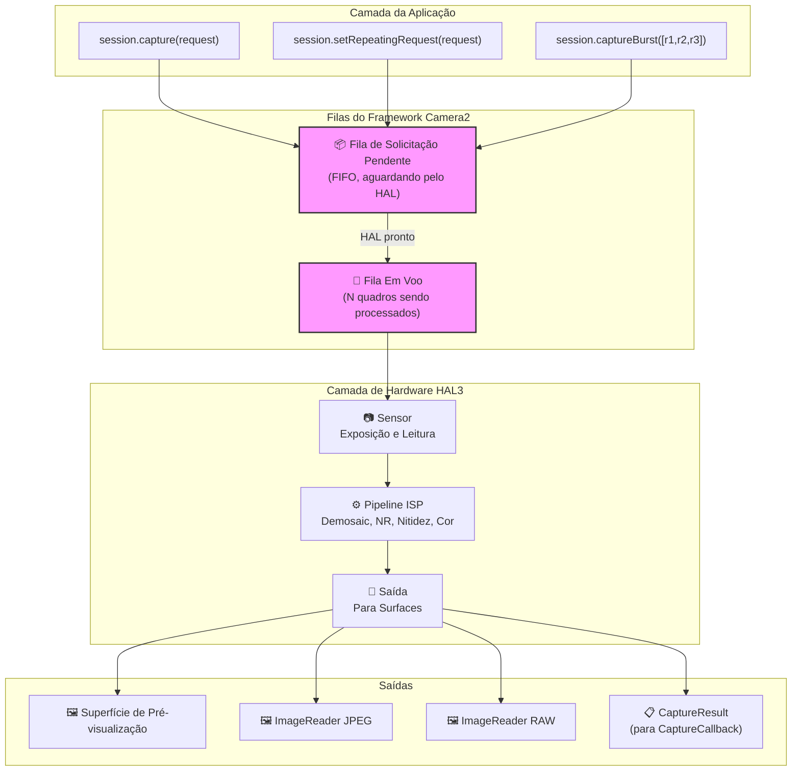
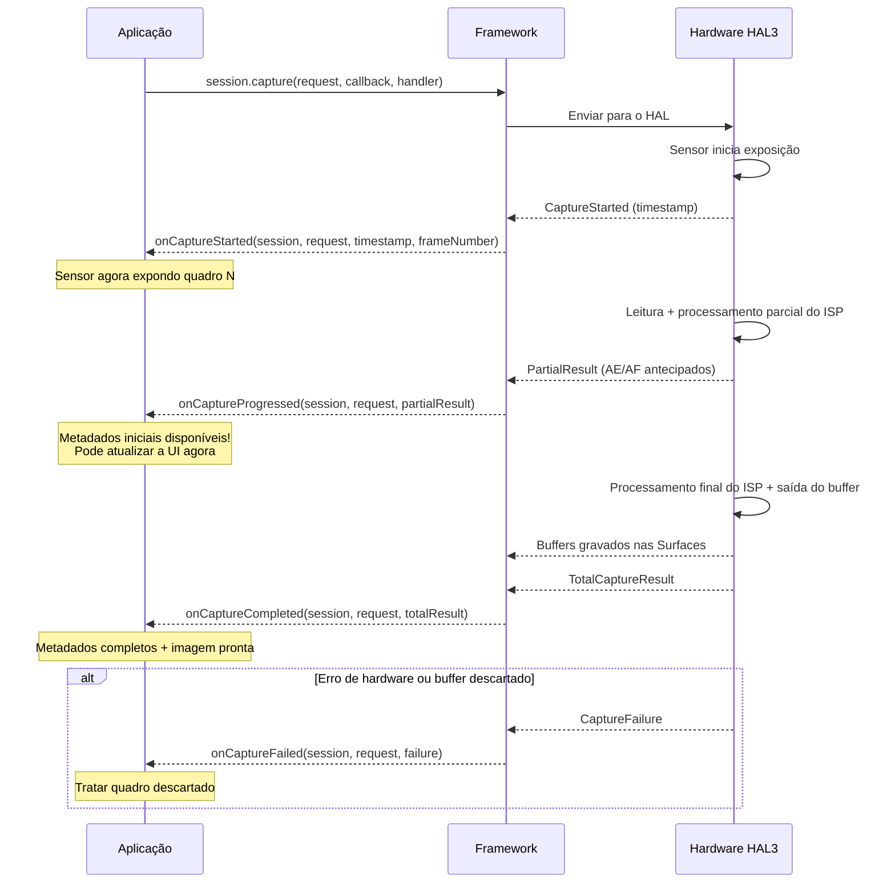
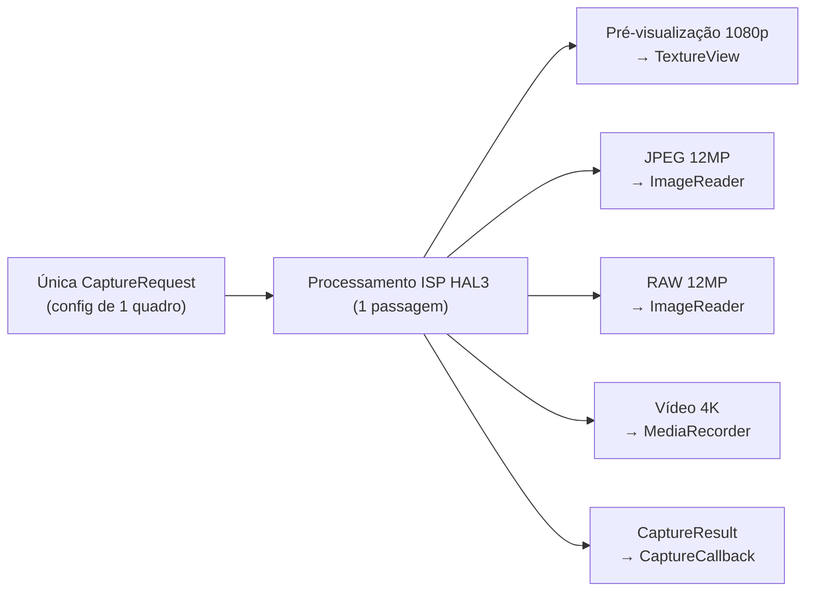
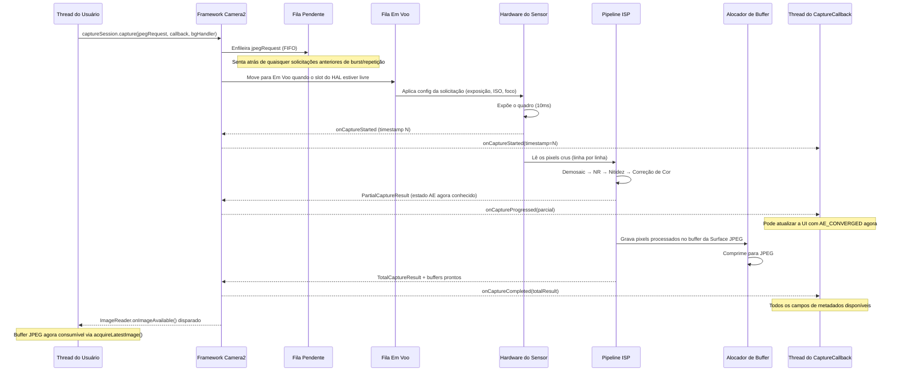

## 10.1 Do Uso ao Entendimento

Nos capítulos anteriores desta série, você *usou* o Camera2: mostrou pré-visualizações, capturou fotos e trabalhou com arquivos RAW. Agora é hora de inverter a lente e olhar para dentro — **como o Camera2 realmente entrega esses quadros?**

Entender o pipeline não é apenas acadêmico. Quando você sabe como as solicitações fluem pelo sistema, você pode:
- Diagnosticar quedas de quadros na captura de alta velocidade.
- Explicar por que as mudanças nas configurações levam de 1 a 2 quadros para aparecer.
- Otimizar a captura sequencial (burst) para zero blackout.
- Construir modelos mentais corretos para o tempo dos callbacks.

O aplicativo Android Camera Parameters ([GitHub](https://github.com/zoozooll/AndroidCameraParameters), [Play Store](https://play.google.com/store/apps/details?id=com.minininja.cameraparams)) visualiza o comportamento do pipeline em tempo real — veja as abas **Frame Timing** e **Raw JSON** para ver os conceitos deste capítulo ao vivo no seu dispositivo.

## 10.2 As Estruturas de Dados Principais

Antes de olharmos para o próprio pipeline, vamos examinar profundamente os dois objetos que viajam por ele: `CaptureRequest` (o que entra) e `CaptureResult` (o que sai).

### CaptureRequest: O Projeto Imutável do Quadro

Uma `CaptureRequest` é uma **configuração completa e imutável para um único quadro**. Ela descreve *tudo* o que o sensor, a lente e o ISP devem fazer para uma exposição: tempo de exposição do sensor, ISO, distância de foco da lente, modos 3A, alvos de saída, qualidade JPEG, região de corte e muito mais.

As principais propriedades da `CaptureRequest`:

- **Imutável após build()** — Uma vez que você chama `.build()`, a solicitação está congelada. Para alterar as configurações, você deve criar um novo Builder.
- **Padrão Builder** — Construída via `CaptureRequest.Builder`, obtida a partir de `CameraDevice.createCaptureRequest(template)`.
- **Por quadro** — Cada quadro individual recebe seu próprio objeto de solicitação. Mesmo capturas repetidas criam (implicitamente) uma nova solicitação por quadro.
- **Direcionada a superfícies** — Cada solicitação lista explicitamente quais superfícies de saída recebem os buffers de imagem processados.

```kotlin
// Construir uma CaptureRequest usando o padrão Builder
val builder = cameraDevice.createCaptureRequest(CameraDevice.TEMPLATE_STILL_CAPTURE)

// Parâmetros de nível de sensor
builder.set(CaptureRequest.SENSOR_EXPOSURE_TIME, 10_000_000L)   // 10ms
builder.set(CaptureRequest.SENSOR_SENSITIVITY, 400)             // ISO 400
builder.set(CaptureRequest.SENSOR_FRAME_DURATION, 33_333_333L)  // ~30fps máx

// Parâmetros de lente
builder.set(CaptureRequest.LENS_FOCUS_DISTANCE, 0.1f)           // Foco a 10cm
builder.set(CaptureRequest.LENS_APERTURE, 1.8f)                 // f/1.8

// Modos de controle 3A
builder.set(CaptureRequest.CONTROL_AF_MODE, CaptureRequest.CONTROL_AF_MODE_OFF)
builder.set(CaptureRequest.CONTROL_AE_MODE, CaptureRequest.CONTROL_AE_MODE_OFF)
builder.set(CaptureRequest.CONTROL_AWB_MODE, CaptureRequest.CONTROL_AWB_MODE_OFF)

// Alvos de saída
builder.addTarget(previewSurface)
builder.addTarget(jpegReader.surface)

// Build — agora imutável!
val request: CaptureRequest = builder.build()

// request.set(...) falharia — não existe set() no objeto construído!
```

:::note
A imutabilidade é crítica para a correção do pipeline. Como o HAL lê a solicitação de forma assíncrona, se você pudesse modificá-la após o envio, criaria condições de corrida entre a thread do aplicativo e a thread de processamento do hardware.
:::

### CaptureResult: O Relatório de Metadados (Não a Imagem!)

Uma `CaptureResult` é a **saída de metadados** para um quadro processado. Crucialmente: **CaptureResult NÃO contém dados de pixels de imagem**. Os pixels vão para os alvos `Surface` que você adicionou à solicitação; a `CaptureResult` vai para o seu `CaptureCallback` carregando a *história* do que aconteceu durante a captura.

Aqui estão os campos mais importantes em uma `CaptureResult`:

| Chave de Resultado | Tipo | Descrição |
|-----------|------|-------------|
| `SENSOR_EXPOSURE_TIME` | `Long` | Tempo de exposição real usado em nanossegundos (pode diferir da solicitação) |
| `SENSOR_SENSITIVITY` | `Int` | Ganho ISO real aplicado |
| `SENSOR_TIMESTAMP` | `Long` | Timestamp em nanossegundos no início da exposição (de `SystemClock.elapsedRealtimeNanos()`) |
| `CONTROL_AE_STATE` | `Int` | Estado da exposição automática: INACTIVE, SEARCHING, CONVERGED, LOCKED, FLASH_REQUIRED |
| `CONTROL_AF_STATE` | `Int` | Estado do foco automático: INACTIVE, PASSIVE_SCAN, ACTIVE_SCAN, FOCUSED_LOCKED, NOT_FOCUSED_LOCKED |
| `CONTROL_AWB_STATE` | `Int` | Estado do balanço de branco automático |
| `LENS_FOCUS_DISTANCE` | `Float` | Distância de foco real definida pela lente |
| `SCALER_CROP_REGION` | `Rect` | Região de corte real usada para o zoom digital |
| `JPEG_GPS_LOCATION` | `Location` | Tag GPS gravada no JPEG (se solicitada) |
| `STATISTICS_FACE_DETECT_MODE` | `Int` | Modo de detecção facial realmente utilizado |

Os campos de resultado são a sua **verdade absoluta**. A `CaptureRequest` é o que você *pediu*; a `CaptureResult` é o que o hardware *realmente fez*. Em dispositivos LEGACY ou LIMITED, o HAL pode silenciosamente limitar, arredondar ou substituir seus valores solicitados — o resultado permite detectar isso.

```kotlin
val captureCallback = object : CameraCaptureSession.CaptureCallback() {
    override fun onCaptureCompleted(
        session: CameraCaptureSession,
        request: CaptureRequest,
        result: TotalCaptureResult
    ) {
        val timestampNs = result.get(CaptureResult.SENSOR_TIMESTAMP)
        val exposureNs = result.get(CaptureResult.SENSOR_EXPOSURE_TIME)
        val iso = result.get(CaptureResult.SENSOR_SENSITIVITY)
        val aeState = result.get(CaptureResult.CONTROL_AE_STATE)
        val afState = result.get(CaptureResult.CONTROL_AF_STATE)
        val focusDistance = result.get(CaptureResult.LENS_FOCUS_DISTANCE)
        val cropRegion = result.get(CaptureResult.SCALER_CROP_REGION)

        val aeStateStr = when (aeState) {
            CaptureResult.CONTROL_AE_STATE_INACTIVE -> "INACTIVE"
            CaptureResult.CONTROL_AE_STATE_SEARCHING -> "SEARCHING"
            CaptureResult.CONTROL_AE_STATE_CONVERGED -> "CONVERGED"
            CaptureResult.CONTROL_AE_STATE_LOCKED -> "LOCKED"
            CaptureResult.CONTROL_AE_STATE_FLASH_REQUIRED -> "FLASH_REQUIRED"
            else -> "UNKNOWN($aeState)"
        }

        val afStateStr = when (afState) {
            CaptureResult.CONTROL_AF_STATE_INACTIVE -> "INACTIVE"
            CaptureResult.CONTROL_AF_STATE_PASSIVE_SCAN -> "PASSIVE_SCAN"
            CaptureResult.CONTROL_AF_STATE_ACTIVE_SCAN -> "ACTIVE_SCAN"
            CaptureResult.CONTROL_AF_STATE_FOCUSED_LOCKED -> "FOCUSED_LOCKED"
            CaptureResult.CONTROL_AF_STATE_NOT_FOCUSED_LOCKED -> "NOT_FOCUSED_LOCKED"
            else -> "UNKNOWN($afState)"
        }

        Log.d("Pipeline", buildString {
            append("Quadro @${timestampNs?.let { it / 1_000_000 } ?: "?"}ms | ")
            append("Exposição: ${exposureNs?.let { "%.2fms".format(it / 1_000_000.0) } ?: "?"} | ")
            append("ISO: $iso | ")
            append("Foco: ${focusDistance?.let { "%.3f".format(it) } ?: "?"} dioptrias | ")
            append("AE: $aeStateStr | ")
            append("AF: $afStateStr | ")
            append("Corte: ${cropRegion?.width()}x${cropRegion?.height()}")
        })
    }
}
```

:::tip
No aplicativo Android Camera Parameters, habilite **Live Result Logging** nas configurações e assista a esse fluxo exato de metadados em tempo real. Você verá a transição de AE_SEARCHING para AE_CONVERGED conforme a exposição se estabiliza, e a transição de AF_SCAN para FOCUSED_LOCKED ao tocar para focar.
:::

## 10.3 As Filas de Solicitação

O Camera2 usa um **modelo de pipeline de duas filas** no nível do framework. Entender essas filas explica quase todos os comportamentos de tempo que você observa.

### Fila de Solicitação Pendente (FIFO)

Quando você chama `session.capture()`, `session.captureBurst()` ou `session.setRepeatingRequest()`, a solicitação não vai para o HAL imediatamente. Em vez disso, ela aterrissa na **Fila de Solicitação Pendente** — uma fila FIFO (First-In, First-Out) gerenciada pelo framework Camera2.

Pense nisso como a "sala de espera". As solicitações ficam aqui até que o HAL tenha capacidade para aceitar uma nova solicitação para processamento.

Propriedades principais:
- **Ordenação FIFO** — As solicitações são processadas na ordem exata em que foram enviadas.
- **Atomicidade do burst** — Todos os quadros em um `captureBurst()` são enfileirados de forma contígua e processados sem intercalação com solicitações repetidas.
- **Sobreposição de prioridade** — Solicitações de disparo único/sequencial (burst) saltam para a **frente** da solicitação repetida na fila (a solicitação repetida é enfileirada novamente de forma automática após a conclusão do disparo único).
- **Limitada** — A fila tem uma profundidade finita (tipicamente de 4 a 8 solicitações); o estouro dispara erros.

### Fila Em Voo (In-Flight)

Quando o HAL retira uma solicitação da Fila Pendente e inicia a leitura do sensor / processamento do ISP, a solicitação move-se para a **Fila Em Voo**. Esta fila contém todas as solicitações que estão sendo processadas pelo hardware no momento.

A profundidade da Fila Em Voo (`CameraCharacteristics.REQUEST_PIPELINE_MAX_DEPTH`) informa quantos quadros o hardware trabalha simultaneamente. Em dispositivos FULL típicos, isso tem uma profundidade de 3 a 4 quadros, o que significa: enquanto o quadro N está sendo exposto, o quadro N-1 está sendo processado pelo ISP, o quadro N-2 está sendo gravado na memória e o quadro N-3 está sendo retornado para o aplicativo. É assim que o Camera2 alcança 30+ fps, apesar de cada quadro levar ~100ms de ponta a ponta.



## 10.4 Callbacks de Resultado: O Ciclo de Vida do CaptureCallback

Os resultados retornam através do `CameraCaptureSession.CaptureCallback`. O HAL pode retornar resultados em múltiplos estágios, oferecendo acesso antecipado a metadados parciais antes que o quadro completo esteja pronto.

### Os Quatro Métodos de Callback

| Método | Quando é Chamado | Contém | Caso de Uso |
|--------|------------|----------|----------|
| `onCaptureStarted` | O sensor *inicia* a exposição para este quadro | Info mínima: número do quadro, timestamp | Sincronização exata de tempo |
| `onCaptureProgressed` | O ISP processou parcialmente o quadro | PartialCaptureResult — alguns campos de metadados prontos | Atualizações antecipadas de estado AE/AF |
| `onCaptureCompleted` | Quadro completo concluído, todos os buffers entregues | TotalCaptureResult — todos os campos | Log de metadados final |
| `onCaptureFailed` | O quadro foi descartado / ocorreu um erro | CaptureFailure — código de erro, razão | Recuperação de erros |

### Resultados Parciais vs. Totais

Um `PartialCaptureResult` é retornado quando o ISP computou *alguns* campos de metadados, mas ainda não terminou o pipeline completo. Uma `TotalCaptureResult` é retornada quando tudo está concluído.



```kotlin
val fullPipelineCallback = object : CameraCaptureSession.CaptureCallback() {
    override fun onCaptureStarted(
        session: CameraCaptureSession,
        request: CaptureRequest,
        timestamp: Long,
        frameNumber: Long
    ) {
        super.onCaptureStarted(session, request, timestamp, frameNumber)
        Log.d("Pipeline", "Quadro #$frameNumber iniciou exposição @ ${timestamp / 1_000_000}ms")
    }

    override fun onCaptureProgressed(
        session: CameraCaptureSession,
        request: CaptureRequest,
        partialResult: CaptureResult
    ) {
        super.onCaptureProgressed(session, request, partialResult)
        val aeState = partialResult.get(CaptureResult.CONTROL_AE_STATE)
        val afState = partialResult.get(CaptureResult.CONTROL_AF_STATE)
        Log.v("Pipeline", "Parcial: AE=$aeState AF=$afState")
    }

    override fun onCaptureCompleted(
        session: CameraCaptureSession,
        request: CaptureRequest,
        result: TotalCaptureResult
    ) {
        super.onCaptureCompleted(session, request, result)
        val totalFrames = result.frameNumber
        Log.d("Pipeline", "Quadro #$totalFrames concluído totalmente")
    }

    override fun onCaptureFailed(
        session: CameraCaptureSession,
        request: CaptureRequest,
        failure: CaptureFailure
    ) {
        super.onCaptureFailed(session, request, failure)
        val reason = when (failure.reason) {
            CaptureFailure.REASON_ERROR -> "Erro interno"
            CaptureFailure.REASON_FLUSHED -> "Descartado por abortCaptures()"
            else -> "Desconhecido (${failure.reason})"
        }
        Log.e("Pipeline", "Quadro #${failure.frameNumber} FALHOU: $reason. Descartado: ${failure.wasImageCaptured()}")
    }
}
```

## 10.5 Internos do Pipeline: Sem Estado, Sequencial, Assíncrono, Multi-Saída

O modelo de pipeline HAL3 que o Camera2 expõe possui quatro propriedades definidoras. Internalize-as e a maior parte do comportamento "estranho" do Camera2 fará sentido subitamente.

### 1. Ausência de Estado (Statelessness)

O hardware **não tem memória entre as solicitações**. Cada `CaptureRequest` deve ser autocontida — ela inclui *cada configuração*, não apenas as que você alterou em relação ao quadro anterior.

Isso significa que:
- Se você definir `SENSOR_EXPOSURE_TIME` no quadro N mas *omitir* no quadro N+1, ele voltará para o padrão do modelo (template).
- A solicitação repetida não é um "conjunto de substituições" — ela é regenerada e reenviada na íntegra a cada quadro pelo framework.
- Não existe um "definir e esquecer" no nível do HAL.

```kotlin
// 🔴 ERRADO: Esperando que as configurações persistam
session.setRepeatingRequest(requestComExposicao10ms, callback, handler)
// Mais tarde: apenas alterar o gatilho AF, esquecer de redefinir a exposição
val triggerBuilder = cameraDevice.createCaptureRequest(CameraDevice.TEMPLATE_PREVIEW)
triggerBuilder.set(CaptureRequest.CONTROL_AF_TRIGGER, CaptureRequest.CONTROL_AF_TRIGGER_START)
triggerBuilder.addTarget(previewSurface)
session.capture(triggerBuilder.build(), callback, handler)
// 🐛 A exposição volta para o padrão do TEMPLATE_PREVIEW para este quadro de disparo único!

// ✅ CORRETO: Cada solicitação é autocontida
val triggerBuilder = cameraDevice.createCaptureRequest(CameraDevice.TEMPLATE_PREVIEW)
triggerBuilder.set(CaptureRequest.SENSOR_EXPOSURE_TIME, 10_000_000L)
triggerBuilder.set(CaptureRequest.CONTROL_AF_TRIGGER, CaptureRequest.CONTROL_AF_TRIGGER_START)
triggerBuilder.addTarget(previewSurface)
session.capture(triggerBuilder.build(), callback, handler)
```

### 2. Processamento Sequencial

Dentro de um único fluxo de câmera lógica, as solicitações são processadas **uma por uma na ordem FIFO**. Não há reordenação, nem avaliação paralela de solicitações. Se o quadro 50 estiver atrás do quadro 49 na fila, o quadro 50 espera o quadro 49 terminar a exposição, mesmo que o quadro 50 fosse "mais rápido" para processar.

É por isso que a captura sequencial produz quadros contíguos e sem lacunas: as N solicitações do burst têm a execução garantida em sequência.

### 3. Resultados Assíncronos

A thread que envia uma solicitação **nunca** é a thread que recebe o resultado. Os resultados são entregues na thread do `Handler` que você forneceu (ou em uma thread de binder se você passou `null`).

Consequência prática: **nunca acesse estado mutável compartilhado a partir do callback sem sincronização**. Um bug comum é ler/escrever `latestExposure` tanto no clique do botão de captura quanto no callback.

### 4. Múltiplas Saídas por Solicitação

Uma solicitação → muitas saídas. Uma única `CaptureRequest` pode mirar 2, 3 ou até 4+ alvos `Surface` simultaneamente:

- **SurfaceTexture de Pré-visualização** (para exibição)
- **ImageReader JPEG** (para captura estática)
- **ImageReader RAW** (para DNG)
- **Surface do MediaRecorder** (para codificação de vídeo)
- **Surface de Alocação** (para processamento RenderScript/ML)

O HAL é responsável por rotear a leitura de sensor única através de múltiplos ramos do ISP para produzir cada formato de saída. Você não duplica a captura; você declara alvos e o hardware distribui.



## 10.6 Ponta a Ponta: Rastreando um Quadro

Vamos rastrear uma única solicitação de captura JPEG por todo o pipeline para amarrar tudo:



## 10.7 Vendo o Pipeline em Ação

O aplicativo Android Camera Parameters ([GitHub](https://github.com/zoozooll/AndroidCameraParameters), [Play Store](https://play.google.com/store/apps/details?id=com.minininja.cameraparams)) inclui uma visualização de depuração do **Pipeline Visualizer** que sobrepõe a profundidade atual da Fila Pendente, a profundidade da Fila Em Voo e os timestamps por quadro. Abra o aplicativo, ative o **Modo Desenvolvedor** nas configurações, selecione uma câmera e mude para a aba **Pipeline** para ver:

- Quantas solicitações estão enfileiradas vs. em voo.
- Latência por quadro desde o início → conclusão.
- Contagem de resultados parciais por quadro (quantas chamadas `onCaptureProgressed` disparam).
- Quaisquer quadros descartados com as razões da falha.

Esta aba é a melhor maneira individual de desenvolver a intuição para os conceitos deste capítulo.

## 10.8 Resumo

| Conceito | Conclusão Principal |
|---------|-------------|
| **CaptureRequest** | Projeto imutável por quadro. Construa via Builder. Contém TODAS as configurações (sem persistência). |
| **CaptureResult** | Apenas metadados (sem pixels). Verdade absoluta sobre o que o hardware *realmente fez*. Verifique o estado AE/AF, exposição, corte. |
| **Fila Pendente** | Sala de espera FIFO. Bursts permanecem contíguos. Disparo único pula para a frente da repetição. |
| **Fila Em Voo** | Solicitações sendo processadas no momento. Profundidade = prof. máx do pipeline. 3-4 quadros típicos em dispositivos FULL. |
| **CaptureCallback** | Quatro fases: started → progressed → completed (ou failed). Resultados parciais vs. totais. |
| **Ausência de Estado**| O hardware não tem memória. Cada solicitação deve incluir cada configuração de seu interesse. |
| **Sequencial + Assíncrono** | Ordem FIFO garantida. Callback em thread diferente da de envio. |
| **Multi-Saída** | Uma solicitação → muitas Surfaces (pré-visualização + JPEG + RAW + vídeo de uma só vez). |

## O Que Vem a Seguir

No [Capítulo 11: Tipos de Captura](capture-types.md), veremos as três maneiras de enviar solicitações para este pipeline — disparo único, sequencial (burst) e repetida — e quando usar cada uma. Também exploraremos os modelos (templates) integrados (`TEMPLATE_PREVIEW`, `TEMPLATE_STILL_CAPTURE`, etc.) que pré-configuram padrões razoáveis para casos de uso comuns.
