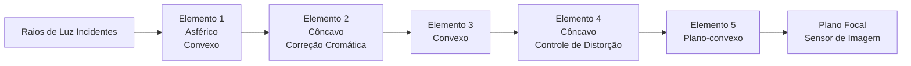
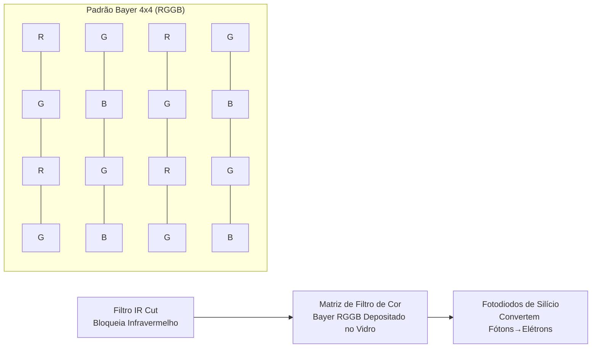
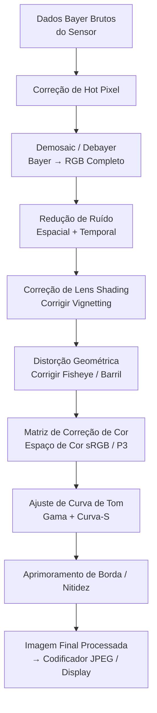
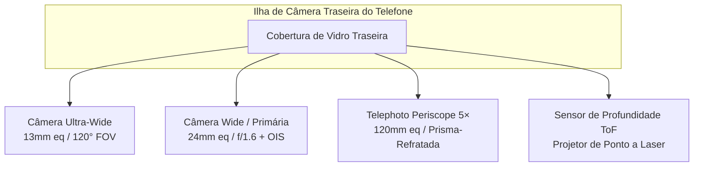
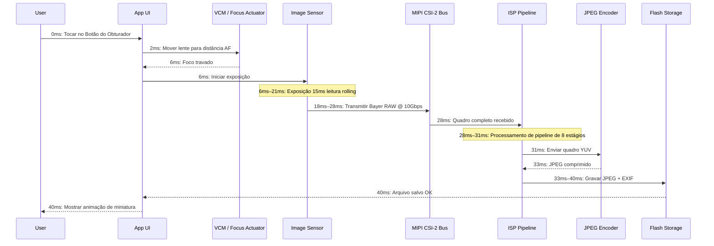

# Capítulo 2: Entendendo as Câmeras de Smartphones

Antes de escrever uma única linha de código da Camera2 API, você deve entender o hardware físico que seu código comandará. Uma câmera de smartphone não é apenas "uma lente apontada para um sensor." É um conjunto fortemente integrado, selado e projetado com precisão contendo óptica, atuadores, filtros, semicondutores e barramentos de dados de alta velocidade. Este capítulo explica cada componente, desde o vidro que primeiro captura a luz até o chip de memória flash onde sua foto final é armazenada.

O objetivo deste capítulo é construir um modelo mental do pipeline da câmera como um sistema físico. Quando capítulos posteriores pedirem que você configure uma solicitação de captura com `CONTROL_AE_TARGET_FPS_RANGE` ou `SENSOR_SENSITIVITY`, você entenderá exatamente qual peça de hardware esses parâmetros afetam e por que os valores importam.

## O Módulo da Câmera: Um Conjunto Óptico Selado

Quando você olha para a parte de trás de um telefone carro-chefe moderno — imagine um Pixel 10 ou Galaxy S26 Ultra — você vê uma ilha retangular elevada que se projeta de 2 a 4 milímetros do vidro traseiro. Essa ilha não é uma única câmera. Uma ilha retangular abriga três módulos circulares separados: o maior na parte inferior é a grande angular primária, um menor acima dela é a telephoto periscope 3× e o de tamanho médio à esquerda é a ultra-wide 0.5×. Cada "elevação" circular dentro dessa ilha é um módulo de câmera completo e independente.

Um módulo de câmera é uma unidade selada hermeticamente fabricada em uma sala limpa sem poeira. Ele contém, empilhados em ordem do mundo exterior para dentro:

1. **Vidro de cobertura protetor**: Uma janela de safira ou Gorilla Glass resistente a arranhões que sela o módulo e mantém a poeira fora.
2. **Tubo da lente**: Uma pilha cilíndrica de 4 a 6 elementos de lente de vidro individuais (ou às vezes plástico asférico) mantidos em alinhamento preciso por espaçadores de plástico finos.
3. **Motor de Bobina de Voz (VCM)**: Um atuador eletromagnético que move todo o tubo da lente para frente ou para trás ao longo do eixo óptico por frações de milímetro para alcançar foco automático. Alguns VCMs premium também podem deslocar a lente perpendicularmente ao eixo para estabilização de imagem óptica (OIS).
4. **Filtro de corte infravermelho (IR)**: Uma bolacha de vidro fino revestida colocada diretamente na frente do sensor. Ela bloqueia a luz infravermelha (à qual o sensor de silício é sensível, mas o olho humano não) para que as cores registradas correspondam ao que os humanos percebem.
5. **Die do sensor**: O próprio chip sensor de imagem CMOS de silício, com ligação de fio a um substrato. A matriz de pixels ativa volta-se para cima em direção à lente.
6. **Circuito Impresso Flexível (FPC)**: Um cabo de fita fino e dobrável que transporta energia, terra, sinais de controle (I2C) e dados de imagem de alta velocidade (MIPI CSI-2) do módulo para a placa-mãe do telefone.
7. **Conector board-to-board**: Um plugue minúsculo de alta densidade no final do FPC que encaixa em um receptáculo de acoplamento na PCB principal do telefone.

Todo o conjunto — do vidro de cobertura ao conector — tem tipicamente de 5 a 8 milímetros de espessura para uma câmera traseira convencional, e de 10 a 14 milímetros de comprimento (dentro do telefone, orientado horizontalmente) para uma telephoto periscope. Os módulos são calibrados individualmente na fábrica: alinhamento da lente, inclinação do sensor, sombreamento de cor e posição infinita de foco automático são todos medidos e armazenados em memória one-time-programmable (OTP) no próprio módulo. A Camera2 API lê esses dados de calibração na inicialização do dispositivo para que seu aplicativo não precise contabilizar a variação de fabricação entre unidades.

## A Lente: Distância Focal, Abertura e Estabilização

A lente é o primeiro componente que a luz encontra. Seu trabalho é curvar os raios de luz recebidos para que convirjam em uma imagem nítida exatamente no plano do sensor de imagem.

### Distância Focal e Equivalência Full-Frame

A distância focal determina o campo de visão (quanto da cena se encaixa no enquadramento) e a ampliação (quão grandes os assuntos distantes aparecem). As especificações da câmera do smartphone sempre anunciam **distâncias focais equivalentes a full-frame**. Esta é uma convenção que normaliza entre diferentes tamanhos de sensor para que os consumidores possam comparar de forma justa. Um sensor full-frame é o tamanho de 36mm × 24mm historicamente usado em câmeras SLR de filme 35mm.

Distâncias focais equivalentes a full-frame comuns em smartphones:

- **10–18mm (Ultra-wide)**: Campo de visão diagonal de 100° a 130°. Usadas para paisagens, arquitetura, selfies em grupo e close-ups macro.
- **22–28mm (Wide / Primária)**: A câmera "normal" padrão em todo telefone. Campo de visão de ~75°, semelhante à visão periférica humana, mas mais plana.
- **45–80mm (Telephoto, 2× a 3×)**: Campo de visão estreito de 30° a 50°. Usadas para retratos (proporções faciais naturais, menos distorção de perspectiva) e zoom geral.
- **100–240mm (Telephoto periscope, 5× a 10×)**: Campo de visão de 10° a 25°. O design periscope com prisma dobrado permite distâncias focais longas sem tornar o telefone com 2 centímetros de espessura.

Veja como a luz viaja através de um conjunto de lente grande angular de 5 elementos típico:

### Abertura

A abertura é o tamanho da abertura através da qual a luz passa dentro da lente. É descrita como um **número f** (ou f-stop): a distância focal dividida pelo diâmetro da abertura. **Um número f menor significa um buraco mais largo, o que significa mais luz** atinge o sensor.

- f/1.4 a f/1.8: Abertura muito larga. Típica de câmeras primárias carro-chefe. Excelente em pouca luz.
- f/2.0 a f/2.4: Abertura moderada. Típica de câmeras ultra-wide e telephoto na maioria dos telefones.
- f/2.8 a f/4.0: Abertura estreita. Encontrada em câmeras frontais de baixo custo e alguns módulos periscope.

A abertura geralmente é fixa em câmeras de smartphone. Alguns carro-chefe da Samsung da era 2020 apresentavam um **mecanismo de abertura variável** com um diafragma duplo que podia alternar mecanicamente entre f/1.5 e f/2.4. Isso é extremamente raro hoje porque o foco baseado em VCM e o HDR computacional de múltiplos quadros tornaram a abertura variável desnecessária para a maioria dos casos de uso.

### Estabilização de Imagem Óptica (OIS)

Quando você segura um telefone, suas mãos naturalmente tremem em pequenas quantidades angulares — da ordem de 0,1° a 0,5° em 1/30 de segundo. Em uma exposição longa o suficiente, esse tremor faz com que toda a imagem fique borrada. A **Estabilização de Imagem Óptica (OIS)** resolve esse problema movendo fisicamente o tubo da lente (OIS de deslocamento de lente) ou o die do sensor em si (OIS de deslocamento de sensor) para neutralizar o movimento detectado. Um pequeno giroscópio dentro do módulo da câmera (ou compartilhado do IMU principal do telefone) mede a velocidade angular 1.000 a 8.000 vezes por segundo, e o atuador OIS move a óptica adequadamente. OIS pode tipicamente compensar 3 a 5 stops de tremor de mão, o que significa que uma exposição que teria exigido 1/60s para permanecer nítida agora pode ser disparada em 1/8s ou 1/4s com a mesma nitidez.

## O Sensor de Imagem: Onde a Luz Se Torna Eletricidade

O sensor de imagem é um chip de silício contendo milhões de detectores de luz individuais chamados **fotodiodos**, dispostos em uma grade retangular precisa. Todo sensor de smartphone hoje é do tipo **CMOS (Complementary Metal-Oxide-Semiconductor)**.

### Tamanho de Pixel e Megapixels

Cada fotodiodo individual + circuito de leitura é chamado de **pixel**. O tamanho físico de cada pixel (medido em micrômetros, μm) é indiscutivelmente mais importante do que a contagem total de megapixels. Um pixel maior captura mais fótons por unidade de tempo, o que significa menos ruído de disparo e melhor desempenho em pouca luz.

Tamanhos de pixel comuns em smartphones de 2026:

- **0,6μm a 0,8μm**: Pixels muito pequenos. Usados em sensores de alta resolução de 108MP a 200MP. Eles dependem inteiramente do pixel binning para ruído aceitável.
- **1,0μm a 1,2μm**: Tamanho médio. Usados em sensores de 48MP a 64MP com binning padrão 4:1 para saída de 12MP–16MP.
- **2,0μm a 2,4μm**: Pixels grandes "carro-chefe". Usados em sensores dedicados de 12MP–16MP (Google Pixel, iPhone Pro) ou como a saída com binning de sensores de 48MP no modo "alta qualidade".

Pixel binning é a técnica de combinar a carga de pixels adjacentes 2×2 (ou 3×3, ou 4×4) em um único "super pixel" durante a leitura. Um sensor de 48MP com pixels individuais de 0,8μm, quando binning 4-para-1, se comporta como um sensor de 12MP com pixels efetivos de 1,6μm — melhorando drasticamente a relação sinal-ruído. A Camera2 API expõe tanto o modo raw de resolução total quanto o modo binned padrão como configurações de fluxo separadas.

A matemática da contagem de megapixels é direta: um sensor de 48MP tem uma matriz ativa de aproximadamente 8.000 × 6.000 fotodiodos = 48.000.000 sensores de luz individuais.

### Classificações de Tamanho de Sensor

O tamanho do sensor segue uma notação baseada em polegadas herdada que remonta aos tubos de televisão Vidicon dos anos 1950. O formato é "1/X polegada", onde X é o divisor; X menor significa um sensor maior:

- 1/3.06" a 1/2.55": Sensores pequenos, típicos para câmeras frontais e ultra-wide de orçamento (~5MP a 13MP).
- 1/1.7" a 1/1.3": Grandes sensores móveis, câmeras primárias carro-chefe (48MP, 50MP, 108MP).
- 1 polegada (Tipo 1): Muito grande para um telefone. Encontrado no Xiaomi 13 Ultra, Sharp Aquos R series e Sony Xperia Pro-I. Aproximadamente 13,2mm × 8,8mm de área ativa — aproximando-se do tamanho de algumas câmeras Micro Four Thirds.

Um sensor maior, dada contagem igual de megapixels, sempre tem pixels individuais maiores. É por isso que os telefones de "sensor de uma polegada" produzem fotos em pouca luz notavelmente melhores.

### A Matriz de Filtro de Cor Bayer (CFA)

Um fotodiodo de silício bruto é daltônico — ele só mede a intensidade total de fótons, não o comprimento de onda. Para registrar cor, os fabricantes depositam um minúsculo **filtro de cor** em cima de cada pixel individual. O padrão quase universal é a **matriz de filtro Bayer RGGB**: 50% de pixels verdes, 25% vermelhos e 25% azuis, dispostos em um ladrilho 2×2 repetitivo. O olho humano é mais sensível à luz verde, então dobrar a amostragem verde melhora a resolução de luminância percebida e o desempenho de ruído.

Após a leitura, os dados do sensor são um mosaico de valores vermelhos, verdes e azuis separados — ainda não uma imagem em cores completas. A etapa que preenche as informações de cor ausentes para cada pixel é chamada de **demosaicing** (ou debayering) e é a primeira grande etapa computacional realizada no ISP.

### Rolling Shutter vs Global Shutter

Quase todo sensor de imagem de smartphone usa um **rolling shutter**. O sensor não expõe ou lê todos os pixels de uma vez. Em vez disso, ele expõe e lê a matriz de pixels linha por linha, de cima para baixo, uma linha horizontal por vez. Uma leitura rolling típica de sensor de 48MP leva aproximadamente 15 a 25 milissegundos para uma captura de quadro completo.

O rolling shutter produz distorções características em assuntos que se movem muito rápido: uma hélice de avião girando ou um ventilador de teto parece dobrado ou ondulado; o topo e a base de um prédio com pan vertical se inclinam em direções opostas (o "efeito gelatina" no vídeo). Sensores global shutter, por outro lado, expõem cada pixel simultaneamente e os leem todos de uma vez após o término da exposição. Global shutter é usado em visão de máquina, câmeras de ação e alguns sensores IR frontais especializados de desbloqueio facial, mas o design de pixel global shutter tem menor sensibilidade à luz e maior custo, então não é usado em câmeras principais de smartphones.

## O ISP: Image Signal Processor

O **ISP (Image Signal Processor)** é um bloco de hardware dedicado (seja um chip separado ou, mais comumente hoje, uma parte integrada do SoC principal ao lado da CPU e GPU) cujo único trabalho é transformar os dados brutos, mosaico, ruidosos e distorcidos que fluem do sensor em uma imagem colorida visualmente agradável.

O ISP executa um pipeline fixo e hardwired de estágios de processamento de imagem em uma taxa de transferência extremamente alta. Um sensor moderno de 48MP rodando a 30 quadros por segundo envia 1,44 bilhão de pixels por segundo ao ISP. O ISP deve processar cada pixel através de todos os estágios em menos de 33 milissegundos por quadro para acompanhar.

Os estágios canônicos do pipeline do ISP, em ordem, são:

1. **Correção de Hot Pixel**: Pixels "presos" calibrados em fábrica (sempre brilhantes ou sempre escuros) são substituídos por valores interpolados dos vizinhos.
2. **Demosaic / Debayer**: O mosaico Bayer RGGB é convertido em uma imagem RGB completa estimando os dois canais de cor ausentes em cada localização de pixel a partir dos pixels circundantes usando algoritmos de interpolação com detecção de bordas.
3. **Redução de Ruído (Temporal + Espacial)**: O ruído de disparo aleatório e o ruído de leitura do sensor são suprimidos. NR espacial desfoca regiões planas enquanto preserva bordas. NR temporal funde informações de quadros de vídeo anteriores (se disponíveis) para resultados ainda mais limpos.
4. **Correção de Lens Shading (Correção de Vignetting)**: Os cantos da imagem são naturalmente mais escuros porque a luz deve passar pela lente em um ângulo mais íngreme. O ISP aplica uma rampa de ganho digital por pixel, mais brilhante nos cantos, para achatar a iluminação. Os dados de calibração para essa rampa são armazenados no OTP do módulo.
5. **Correção de Distorção Geométrica**: Lentes ultra-wide e fisheye produzem distorção de barril (linhas retas se curvam para fora). O ISP remapeia as coordenadas de pixel usando um modelo de lente polinomial armazenado para produzir uma imagem rectilinear onde linhas retas realmente aparecem retas. Esta etapa inerentemente corta 5–10% do anel de pixel externo.
6. **Matriz de Correção de Cor (CCM)**: A resposta espectral RGB do sensor bruto não corresponde à resposta tricromática do olho humano. Uma multiplicação de matriz 3×3 converte RGB nativo do sensor no espaço de cor sRGB ou DCI-P3 padrão. Os coeficientes CCM são ajustados por módulo por iluminante (luz do dia, tungstênio, fluorescente).
7. **Ajuste de Curva de Tom**: Uma curva de mapeamento de tom não-linear em forma de S é aplicada aos dados RGB lineares para comprimir o sinal do sensor de alto alcance dinâmico na saída de baixo alcance dinâmico (tipicamente sRGB codificado em gama de 8 bits). Esta etapa é o que faz a imagem "pular" — contraste aumenta nos meios-tons, realces são suavizados, sombras são levantadas.
8. **Aprimoramento de Borda / Nitidez**: Uma máscara de unsharp sutil é aplicada para recuperar detalhes de alta frequência suavizados pela redução de ruído e filtro de passa-baixa óptico. A quantidade de nitificação é cuidadosamente controlada para evitar introduzir halos.

A qualidade de processamento do ISP é um grande diferencial entre os fabricantes de telefones. Google, Samsung, Apple e Xiaomi cada um ajusta seus pipelines de ISP com diferentes prioridades artísticas: alguns favorecem cores naturais, alguns saída "vibrante" supersaturada, alguns redução de ruído agressiva vs detalhe retido. A Camera2 API oferece algum controle sobre as intensidades individuais dos estágios do ISP (através dos controles de tonemap e correção de cor do Android), mas a maioria dos parâmetros detalhados de estágio está bloqueada atrás de APIs proprietárias do fornecedor.

## RAW vs JPEG: Dois Caminhos do Sensor ao Armazenamento

O pipeline do ISP acima produz uma imagem processada. Mas a Camera2 API também permite que você ignore totalmente o ISP e leia os dados brutos do sensor diretamente. Esta é a distinção crítica entre saída RAW e JPEG.

### Formato RAW

Um **arquivo RAW** (no Android isso significa um arquivo DNG, Digital Negative) contém exatamente o que o sensor mediu antes que qualquer processamento do ISP seja executado. É um mosaico Bayer de 10 bits, 12 bits ou 14 bits por pixel — ainda no padrão RGGB original, ainda com vignetting, ainda com ruído, ainda linear. O arquivo RAW também contém tags de metadados especificando o padrão exato da matriz de filtro de cor, o perfil de cor do sensor, nível de preto, nível de branco e o modelo da lente.

- **Profundidade de bits**: RAW10 = 10 bits por canal = 1.024 níveis. RAW12 = 4.096 níveis. RAW14 = 16.384 níveis. Compare isso com 8 bits do JPEG = 256 níveis.
- **Tamanho do arquivo**: 20–40 MB por foto de 48MP. Não comprimido ou comprimido quase sem perda.
- **Caso de uso**: Edição profissional de pós-produção. Os stops adicionais de folga permitem que um editor "resgate" realces superexpostos (em 2 a 3 stops de EV) ou levante sombras subexpostas sem banding.

### Formato JPEG

Um **arquivo JPEG** é a saída totalmente cozida do ISP. Cada um dos 8 estágios do ISP acima já foi aplicado aos dados de pixel. Então a imagem é convertida de RGB para o espaço de cor YCbCr 4:2:0 chroma-subsampled e comprimida com um algoritmo de Transformada Discreta de Cosseno com perdas em uma taxa de compressão de aproximadamente 10:1 a 20:1.

- **Profundidade de bits**: Sempre 8 bits por canal = 256 níveis por cor.
- **Tamanho do arquivo**: 2–5 MB para uma foto de 12MP–48MP, dependendo do nível de qualidade do JPEG.
- **Caso de uso**: Compartilhamento instantâneo, mídias sociais, qualquer fluxo de trabalho onde a foto está "pronta" assim que tirada. Ajustes em um editor móvel degradam a imagem rapidamente porque apenas 256 níveis permanecem.

### Tabela de Comparação: RAW vs JPEG

| Recurso | RAW (DNG) | JPEG |
|---------|-----------|------|
| Processamento ISP Aplicado | Nenhum — todos os estágios ignorados | Todos os 8 estágios aplicados e irreversíveis |
| Profundidade de Cor | 10–14 bits (1.024–16.384 níveis) | 8 bits (256 níveis) |
| Balanço de Branco | Marcado em metadados, totalmente alterável em pós | Incorporado nos pixels — apenas edições menores |
| Latitude de Exposição | ±2 a 3 stops recuperáveis | ±1/2 stop no máximo antes do banding |
| Tamanho do Arquivo (48MP) | 25–40 MB | 3–6 MB |
| Espaço de Cor | RGB linear nativo do sensor | sRGB ou Display P3 codificado em gama |
| Nitificação / Redução de Ruído | Nenhum — escolha do editor | Aplicado; não pode ser desfeito |
| Fluxo de Trabalho Típico | Fluxo de trabalho Adobe Lightroom / Capture One | Compartilhamento direto para Instagram / Messages |

## Telefones Multi-Câmera: Por Que Não Uma Única Lente Zoom Gigante?

Uma câmera point-and-shoot tradicional usa uma única lente zoom com grupos internos móveis que mudam continuamente a distância focal de wide a telephoto. Por que um smartphone não pode fazer o mesmo? Física. Uma lente zoom de 10× que cobre 24mm–240mm equivalente full-frame com abertura constante f/2.8 requer um caminho óptico de aproximadamente 5 centímetros (2 polegadas) de comprimento. Um smartphone tem, no máximo, 0,9 centímetros de espessura. A matemática simplesmente não cabe.

A indústria de smartphones resolveu isso não com uma lente zoom, mas com **múltiplas câmeras de distância focal fixa**, cada uma otimizada para um propósito diferente, e um sistema computacional de "zoom suave" que faz a transição de uma câmera para a próxima em taxas de zoom específicas.

Uma ilha de câmera traseira carro-chefe típica de 2026 contém:

1. **Ultra-Wide (zoom 0.5×, ~13mm eq, ~120° FOV)**: Distância focal curta, grande profundidade de campo. Ideal para paisagens, arquitetura, fotos de grupo e macro de foco próximo quando reposicionada via software.
2. **Wide / Primária (zoom 1×, ~24mm eq, ~75° FOV)**: O padrão. O maior sensor, a abertura mais ampla, o melhor OIS. Usada para 80% das fotos do dia a dia.
3. **Telephoto / Periscope (óptico 3× a 10×, ~72mm a ~240mm eq)**: Uma lente telephoto convencional (3×) fica diretamente acima de seu sensor. Uma telephoto periscope (5×, 10×) usa um prisma de 45° perto da borda do telefone para refletir a luz em 90°, de modo que o tubo da lente corra horizontalmente dentro do corpo do telefone em vez de verticalmente através de sua espessura.
4. **Sensor ToF / Profundidade**: Um projetor de ponto a laser infravermelho próximo (ou, em iPhones, um scanner LiDAR de luz estruturada) que pulsa mais de 30.000 pontos IR na cena e mede seu tempo de ida e volta para produzir um mapa de profundidade por pixel. Usado para bokeh de retrato preciso, oclusão de realidade aumentada e foco automático rápido em pouca luz.

Quando você executa um gesto de pinch-zoom no aplicativo de câmera, o HAL (Hardware Abstraction Layer) alterna suavemente a câmera física ativa em limiares pré-determinados. Por exemplo, aplicar zoom de 0.5× a 1.0× transiciona da ultra-wide para a wide. Em 2.9× o aplicativo ainda está cortando digitalmente a câmera wide. Em 3.0×, o HAL troca a fonte ativa para a câmera telephoto periscope. Entre essas taxas de zoom, um algoritmo sofisticado de fusão de imagem usa ambas as câmeras simultaneamente para manter uma transição sem emendas.

## A Jornada Completa: Do Fóton à Foto Salva, Milissegundo a Milissegundo

Aqui está a cronologia completa e numerada do que fisicamente acontece dentro de um smartphone durante uma única captura de foto parada, começando do momento em que o dedo do usuário sai do botão de obturador virtual. Os números são representativos de um carro-chefe de 2026 capturando um JPEG no modo padrão de 12MP à luz do dia:

- **0 ms**: O usuário toca no obturador. A estrutura da Camera2 API recebe a `CaptureRequest` com `TEMPLATE_STILL_CAPTURE`.
- **0–2 ms**: O algoritmo 3A (Auto-Foco, Auto-Exposição, Auto-Balanço de Branco) converge para seus valores finais.
- **2–6 ms**: O motor de bobina de voz (VCM) energiza sua bobina, movendo fisicamente o tubo da lente em 0,2mm para a distância de foco exata que o algoritmo AF calculou.
- **6–21 ms (exposição de 15 ms)**: O reset global libera a carga dos pixels do sensor. Por 15 milissegundos, os fotodiodos acumulam elétrons gerados por fótons. O rolling shutter lê linha por linha durante e após esta janela.
- **18–28 ms**: O sensor produz os dados Bayer brutos pelo barramento serial de alta velocidade MIPI CSI-2. Uma configuração típica é 4 pistas de dados a 2,5 Gbps por pista = largura de banda total de 10 Gbps, que lida confortavelmente com a profundidade de bits bruta de um quadro de 12MP mais intervalos de blank.
- **28–31 ms**: O pipeline de 8 estágios do ISP processa o quadro através de correção de hotpixel, demosaic, redução de ruído, lens shading, correção geométrica, matriz de cor, curva de tom e nitidez. Isso acontece inteiramente em hardware — nenhum envolvimento da CPU no nível de pixel.
- **31–33 ms**: A imagem YUV processada é enviada ao codificador JPEG de hardware, que aplica compressão DCT com perdas no nível de qualidade 90–95 e grava os cabeçalhos de arquivo JFIF (EXIF, miniatura, coordenadas GPS se marcadas).
- **33–40 ms**: O blob JPEG concluído é gravado via provedor de conteúdo MediaStore no diretório files do aplicativo, por exemplo `/data/data/com.yourpackagename/files/DCIM/Camera/IMG_20260806_151042.jpg`. O MediaScanner é notificado e a foto aparece na galeria do sistema.

Todo o processo leva aproximadamente 40 milissegundos de ponta a ponta para uma foto parada à luz do dia. Em pouca luz o tempo de exposição aumenta (potencialmente para vários segundos para captura multi-frame do Night Mode), e a cronologia escala proporcionalmente.

## Resumo

Você agora tem uma imagem física completa do sistema de câmera do smartphone. Você sabe que cada elevação de câmera traseira é um módulo selado contendo um tubo de lente com múltiplos elementos, um atuador de foco automático VCM, um filtro IR-cut, um sensor CMOS com uma matriz de filtro de cor Bayer RGGB e um cabo flexível transportando dados MIPI CSI-2. Você entende equivalência de distância focal, abertura e OIS. Você sabe como o pipeline de 8 estágios do ISP transforma um mosaico Bayer bruto em um JPEG finalizado, e você pode distinguir RAW (nativo do sensor, 10–14 bits, folga de pós-processamento) de JPEG (processado pelo ISP, 8 bits, pronto para compartilhar). Você entende por que os telefones modernos usam 3+ câmeras fixas em vez de uma lente zoom, e você percorreu a cronologia exata milissegundo a milissegundo de uma única captura de foto.

## O Que Vem a Seguir

No Capítulo 3, passamos do hardware físico para o que esse hardware é capaz de produzir. Vamos explorar os recursos do mundo real da fotografia moderna de smartphones: HDR multi-frame bracketing, bokeh de retrato via estéreo / ToF / ML, Night Sight de exposição longa multi-frame, captura de vídeo em câmera lenta de alta velocidade, correção de distorção ultra-wide e telephoto periscope. Você aprenderá como a fotografia computacional — a fusão de óptica, sensores, processamento de sinal multi-frame e aprendizado de máquina no dispositivo — cria imagens que nenhuma combinação única de lente/sensor jamais poderia produzir por conta própria.
