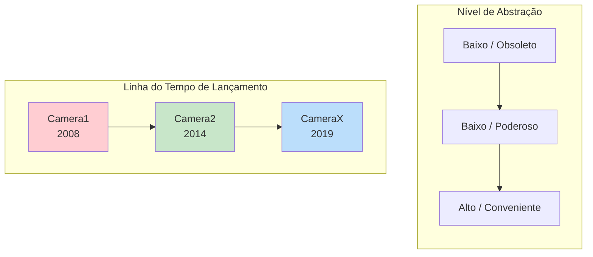
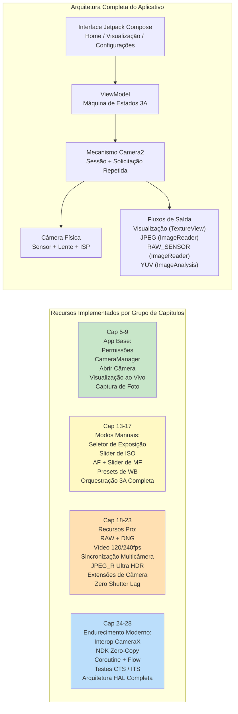

# Capítulo 1: Bem-vindo ao Android Camera2

> **Visão Geral do Capítulo:** Neste capítulo de abertura, damos um passo atrás e olhamos para o quadro geral. Por que o Camera2 existe? Quais problemas ele resolve em comparação com a antiga API Camera e a biblioteca CameraX mais recente? Quem deve investir tempo aprendendo o Camera2? E, o mais importante, o que você realmente construirá ao final desta série? Sem arquitetura profunda, sem camadas HAL e sem diagramas de pipeline ainda — apenas respostas claras às perguntas que todo desenvolvedor faz antes de mergulhar.

***

## 1.1 Por que Camera2?

Pegue seu smartphone.

Olhe para a parte de trás. Você provavelmente vê duas, três ou até mais lentes de câmera. Esse pequeno calombo retangular abriga mais poder óptico e de silício do que uma DSLR profissional de meados dos anos 2000.

Agora abra o aplicativo de câmera padrão.

Toque no obturador. Instantaneamente, uma foto de alta resolução é armazenada na sua galeria. A imagem provavelmente parece ótima — cores vibrantes, temas nítidos, desfoque de fundo suave e sombras brilhantes mesmo em luz interna.

Mas o aplicativo de câmera que você está usando apenas arranha a superfície do que o hardware pode fazer. Escondido sob esse botão de obturador amigável está um pipeline de imagem incrivelmente sofisticado: um que pode tirar fotos RAW, gravar vídeo em câmera lenta de 240 fps, fundir 10 quadros para uma única foto noturna ou controlar independentemente cada mícron de movimento da lente.

A maioria dos aplicativos Android de terceiros nunca acessa esse poder. Por quê? Porque **a antiga API de câmera do Android (retroativamente chamada de Camera1) era extremamente limitada**. O Camera1 foi projetado para um mundo de telefones com câmera única com captura básica de foto e vídeo. Ele não conseguia:

- Controlar o tempo de exposição ou o ISO manualmente
- Capturar dados brutos do sensor (RAW)
- Gravar em câmera lenta com altas taxas de quadros
- Usar várias câmeras simultaneamente
- Acessar metadados por quadro durante a captura
- Tirar fotos em sequência (burst) de forma confiável

A partir do **Android 5.0 (nível de API 21)**, o Google introduziu o **Camera2 (android.hardware.camera2)** para derrubar essas barreiras. O Camera2 não é uma atualização incremental — é um **redesenho completo**, construído do zero para expor as capacidades brutas do silício de câmera moderno a todos os desenvolvedores Android.

Em resumo: **O Camera2 existe porque as câmeras de smartphones tornaram-se de nível profissional, e a API antiga não conseguia acompanhar.**

***

## 1.2 Camera1 vs Camera2 vs CameraX

Mais de uma década de desenvolvimento de câmera Android produziu **três gerações** de APIs de câmera. Antes de escrever uma única linha de código, é essencial entender qual API resolve qual problema.

### Três Gerações, Três Filosofias

### Camera1 — `android.hardware.Camera`

A API de câmera original, introduzida com o Android 1.0 e **descontinuada no Android 5.0**.

- **Modelo:** Comandos procedurais. Você chama métodos como `startPreview()`, `takePicture()`, `setFlashMode()`.
- **Filosofia de design:** "A câmera é uma máquina de estados que você comanda."
- **Melhor para:** Aplicativos legados destinados a dispositivos muito antigos (pré-Lollipop). Apenas isso.
- **Por que evitá-la:** O Google não a atualiza mais. Novos recursos de hardware (multicâmera, RAW, HDR) nunca são portados para o Camera1. A superfície da API é minúscula. Em dispositivos modernos, o Camera1 é, na verdade, **emulado por um wrapper do Camera2** internamente, então você paga a complexidade do Camera2 sem os benefícios do Camera2.

### Camera2 — `android.hardware.camera2.*`

O framework moderno de baixo nível, introduzido no Android 5.0 e expandido continuamente em cada versão do Android desde então.

- **Modelo:** Um pipeline de solicitação/resposta. Você constrói objetos `CaptureRequest` imutáveis, submete-os a uma `CameraCaptureSession` e recebe metadados `CaptureResult` + buffers de imagem de forma assíncrona.
- **Filosofia de design:** "A câmera é um pipeline programável. Você controla cada parâmetro de cada quadro."
- **Melhor para:** Aplicativos de câmera avançados, ferramentas de fotografia manual, pipelines de visão computacional, captura RAW, pesquisa multicâmera, vídeo de alta velocidade e qualquer caso de uso onde você precise de controle próximo ao hardware.
- **Por que usá-la:** Acesso total a cada capacidade que o HAL do OEM expõe. Controle direto de quadros. O único caminho de API para recursos profissionais. O Camera2 é o que o CameraX chama internamente.

### CameraX — `androidx.camera.*`

Uma **biblioteca Jetpack** (não uma API de plataforma) introduzida em beta em 2019 e estabilizada por volta do Android 11.

- **Modelo:** Casos de uso declarativos. Você vincula ao ciclo de vida (`bindToLifecycle()`) um conjunto de casos de uso `Preview`, `ImageCapture`, `ImageAnalysis` ou `VideoCapture` e a biblioteca faz o resto.
- **Filosofia de design:** "Nós resolvemos os 10.000 casos extremos para você. Apenas nos diga qual saída você precisa."
- **Melhor para:** A maioria das aplicações que precisam de uma câmera. Scanners de QR/código de barras, uploads de fotos, digitalização de documentos, gravação de vídeo simples — qualquer cenário onde a conveniência e a confiabilidade superam o controle bruto.
- **Por que usá-la:** Ciente do ciclo de vida (sem vazamentos de recursos), a seleção de resolução é automática, as peculiaridades do OEM possuem soluções integradas, o exato mesmo código roda em milhares de modelos de dispositivos com zero declarações `if`.

### Comparação Lado a Lado

| Dimensão | Camera1 | Camera2 | CameraX |
|:---|:---|:---|:---|
| **Introduzido** | Android 1.0 (2008) | Android 5.0 (2014) | Android 10 (Jetpack) |
| **Status** | Obsoleto | Ativo, mantido | Recomendado (Jetpack) |
| **Abstração** | Baixa (legado) | Baixa | Alta |
| **Curva de aprendizado** | Fácil | Muito íngreme | Muito suave |
| **Exposição manual / ISO / foco** | Limitado | Controle total | Limitado via Interoperabilidade |
| **Captura RAW** | Não | Sim | Com soluções de Interoperabilidade |
| **Multicâmera (fluxos físicos)** | Não | Sim | Não |
| **Vídeo de alta velocidade (120+ fps)** | Não | Sim | Limitado |
| **Burst / Bracketing** | Não | Controle total | Não |
| **Metadados por quadro** | Não | Sim, resultados totais + parciais | Exposto via callbacks de Interop |
| **Segurança de ciclo de vida** | Manual, propenso a erros | Manual, propenso a erros | Automático, vinculado ao ciclo de vida |
| **Tratamento de peculiaridades OEM** | Nenhum | Nenhum | Integrado (mais de 1000 dispositivos testados) |
| **Volume de código para um app funcional**| Médio | Muito alto (verboso) | Muito baixo |
| **Desempenho** | OK (wrapper indireto) | Máximo possível | Próximo do máximo (sobrecarga mínima) |

***

## 1.3 O que o Camera2 pode fazer?

Para entender concretamente o poder do Camera2, imagine recursos que você viu em telefones topo de linha. O Camera2 torna **todos eles acessíveis programaticamente**:

### Captura de Nível Profissional

- **Exposição Manual Total:** Ajuste a velocidade do obturador de 1/8000 s a 30 s, e o ISO de 50 a 102.400. Construa uma interface de modo Pro real.
- **Fotografia RAW:** Extraia dados **Bayer não processados** de 10 bits, 12 bits, 14 bits ou 16 bits diretamente do sensor (sem demosaicing, sem redução de ruído, sem correção de cor). Escreva arquivos Adobe DNG usando o `DngCreator` integrado para edição no Lightroom.
- **Bracketing de Exposição:** Tire 3, 5, 7 ou 9 quadros em valores de EV precisamente escalonados. Alimente-os em um algoritmo de fusão HDR.
- **Bloqueio de Timelapse:** Congele a exposição, o foco e o balanço de branco em **milhares de quadros** — sem oscilação enquanto o sol se move ou as nuvens passam.

### Acesso ao Hardware de Fotografia Computacional

- **Vídeo de Alta Velocidade:** Configure `CameraConstrainedHighSpeedCaptureSession` para captura de 120 fps, 240 fps ou até 960 fps. Construa editores de câmera lenta.
- **Multicâmera Lógica:** Acesse **ambas** as câmeras físicas sob um ID de multicâmera lógica **simultaneamente**. Capture quadros YUV sincronizados de uma lente grande angular e uma teleobjetiva para computar mapas de profundidade no dispositivo.
- **Reprocessamento YUV / PRIVATE (dispositivos LEVEL_3):** Mantenha um **buffer circular em resolução total no ISP** e, ao tocar no obturador, pegue um quadro do passado e execute novamente a redução de ruído pesada e o nitidez. É assim que os OEMs implementam o **Zero Shutter Lag (ZSL)**.
- **Ultra HDR / JPEG_R (Android 14+):** Solicite e escreva arquivos `ImageFormat.JPEG_R` que armazenam um JPEG SDR de 8 bits **mais** um mapa de ganho HDR secundário. Visualizadores legados veem uma foto normal; painéis HDR renderizam destaques de mais de 1.000 nits.
- **Extensões de Câmera (Android 12+):** Delegue os modos Noturno, Bokeh (retrato), HDR e Retoque Facial **para o HAL do OEM** — usando exatamente o mesmo pipeline de IA de vários quadros que a câmera padrão usa.

### Pipelines de Vídeo e Visão Avançados

- **Saída Simultânea de Múltiplos Fluxos:** Alimente uma Surface de **visualização**, uma Surface de **análise YUV** (para detecção de objetos por ML rodando a 30 fps) e uma Surface de **foto JPEG** a partir de uma única solicitação de captura — tudo sem copiar memória.
- **Precisão de Tempo do Flash:** Coordene explicitamente a medição pré-flash, o disparo do flash principal e a leitura do obturador eletrônico quadro a quadro.
- **Resultados de Captura Parciais:** Receba metadados de estado de AE e distância de foco **milissegundos antes** do buffer da imagem final estar pronto — permitindo a resposta "toque em qualquer lugar e a UI atualiza instantaneamente".
- **Sessões Offline (API 30+):** Se o usuário colocar seu aplicativo em segundo plano no meio de um Modo Noturno, entregue a mesclagem de vários quadros em andamento a uma `CameraOfflineSession` isolada e o HAL terminará o processamento de forma assíncrona; seu aplicativo acorda com a imagem final.

### E Isso é Apenas o Começo

Cada nova versão do Android expande o Camera2. O Android 15 (API 35) adicionou o `CameraDeviceSetup` para que você possa sondar as configurações da sessão **sem sequer ligar o sensor**, reduzindo a latência da verificação de capacidade em 10 vezes. A API está viva, evoluindo e sempre um passo à frente do hardware de câmera mais recente.

***

## 1.4 Quem deve aprender o Camera2?

Aprender o Camera2 adequadamente leva tempo. A superfície da API é enorme — mais de 300 chaves de metadados, dezenas de callbacks, múltiplos tipos de sessão e centenas de casos extremos de OEMs. Você deve investir esse tempo se alguma destas situações descrever você ou seu projeto:

### Você está construindo um aplicativo de câmera avançado

Seu aplicativo oferece um **modo Pro** com seletores manuais de ISO/obturador/foco/WB. Ou ele captura **fotos RAW** e permite que os usuários as exportem para edição no desktop. Ou ele grava **vídeo em câmera lenta**. Nada disso é possível (or é severamente prejudicado) com o CameraX.

### Você está construindo uma aplicação de Visão Computacional ou Pesquisa

Você precisa de **quadros YUV de latência mínima e cópia zero** para alimentar um pipeline de ML no dispositivo. Ou você requer **dados do sensor com bloqueio de quadro** (o timestamp do giroscópio em `SENSOR_TIMESTAMP` deve corresponder à imagem dentro de ±1 ms para SLAM / odometria visual-inercial precisa). Ou você deve controlar a **duração exata do obturador por quadro** para luz estruturada / detecção de profundidade.

### Você está construindo uma ferramenta de diagnóstico de capacidade de câmera

Como o aplicativo complementar a esta série — **Android Camera Parameters** ([GitHub](https://github.com/zoozooll/AndroidCameraParameters), [Google Play](https://play.google.com/store/apps/details?id=com.minininja.cameraparams)) — você precisa despejar exaustivamente cada chave de `CameraCharacteristics` para visualizar o que cada dispositivo suporta. O CameraX esconde intencionalmente a maior parte desse detalhe.

### Você está depurando um problema do CameraX ou da câmera do OEM

O CameraX falha às vezes em dispositivos obscuros. Quando sua visualização do CameraX está esticada, ou um modelo Galaxy específico retorna quadros verdes no modo noturno, ou o Pixel 9 trava no `VideoCapture`, você **deve** descer para o Camera2 para reproduzir e isolar o bug.

### Você trabalha com imagens móveis, stacks de câmera OEM ou pipelines de câmera automotiva

Se você toca no código do HAL do fornecedor, `frameworks/av/camera`, no NDK de Câmera ou na migração de EVS→Camera2 automotiva — a fluência no Camera2 é indispensável.

### Quem **não** precisa aprender o Camera2?

Se seus requisitos forem: *"Eu preciso permitir que os usuários tirem uma foto de perfil ou escaneiem um código QR"* — **use o CameraX**. Sério. O CameraX é uma obra-prima da engenharia. Ele economizará meses de trabalho em compatibilidade de dispositivos. O Camera2 é uma ferramenta poderosa; use-a quando precisar especificamente desse poder.

***

## 1.5 O que você construirá ao longo deste livro

Teoria sem código é abstrata. Código sem progressão é confuso.

Ao longo deste livro, você **construirá progressivamente um aplicativo Camera2 real e totalmente funcional**. Cada capítulo adiciona um recurso, e cada recurso compila e roda em um telefone real. Ao capítulo final, você terá montado este aplicativo completo:

### Os Marcos

| Faixa de Capítulos | O que você poderá fazer depois |
|:---|:---|
| **Cap 1–4** | Você entende o hardware. Sabe como uma lente, um sensor e um ISP interagem. Pode ler a folha de especificações de qualquer telefone e dizer quais recursos do Camera2 ele suporta. Instalou o aplicativo complementar Android Camera Parameters e explorou seu próprio dispositivo. |
| **Cap 5–9** | Você tem um **aplicativo de câmera funcional**. Ele abre a câmera traseira, mostra uma visualização ao vivo na tela e salva uma foto JPEG quando você toca no botão do obturador. Correção total da proporção, rotação correta do retrato e limpeza adequada do ciclo de vida, tudo funcionando. |
| **Cap 10–12** | Você entende **por que** o código funciona da maneira que funciona. Pode rastrear uma CaptureRequest pela fila pendente, fila em voo, HAL e de volta como um CaptureResult. Sabe como restringir recursos com base no nível de hardware real e nas capacidades relatadas. |
| **Cap 13–17** | Seu aplicativo tem um **Modo Pro completo**. ISO manual, obturador, distância de foco e seletores de temperatura de cor WB. Histograma ao vivo / leitura de EV. Sequência completa de AF de disparo único → AE de pré-captura → captura que imita exatamente como as câmeras padrão dos OEMs obtêm resultados perfeitos. |
| **Cap 18–23** | Seu aplicativo agora é de **nível flagship**: salva RAW+JPEG simultaneamente, grava vídeo em câmera lenta de 120 fps, pode capturar fluxos YUV físicos duplos para profundidade de retrato, escreve arquivos Ultra HDR JPEG_R, delega os modos Bokeh e Noturno às Extensões de Câmera e implementa o reprocessamento Zero-Shutter-Lag em dispositivos LEVEL_3. |
| **Cap 24–28** | Você é um **engenheiro sênior de Câmera Android**. Pode integrar o CameraX via Interop em 90% dos apps enquanto usa o Camera2 nos 10% que precisam. Pode criar pipelines de câmera nativa NDK com cópia zero. Envolve todos os callbacks em Kotlin Coroutines e Flow para um código limpo e testável. Entende como escrever testes de câmera que passam no CTS ITS. E pode desenhar toda a stack App→Framework→Binder→Native→HAL→Kernel→Hardware em um quadro branco. |
| **Cap 29 (Enciclopédia)** | Você tem uma **referência de mesa** das 29 chaves de `CameraCharacteristics` mais importantes, cada uma explicada com racional, uma consulta Kotlin, um ponteiro do Android Camera Parameters e as armadilhas dos OEMs. Este capítulo permanece aberto enquanto você entrega código de produção. |

Esse é um conjunto de habilidades genuinamente raro. Vamos começar a jornada.

***

## 1.6 Resumo

- **Camera2** é o framework moderno de câmera de baixo nível do Android, introduzido no Android 5.0 para expor a capacidade total dos smartphones atuais com várias câmeras e ricos em ISP.
- O **Camera1** está obsoleto; o **CameraX** é conveniente para a maioria dos casos de uso, mas esconde o poder que apenas o Camera2 expõe. Você escolhe com base nos requisitos.
- O Camera2 desbloqueia **controles manuais, fotografia RAW, vídeo de alta velocidade, multicâmera lógica, reprocessamento YUV/ZSL, Ultra HDR, Extensões OEM** e **Sessões Offline**.
- Invista no Camera2 quando estiver construindo ferramentas de foto Pro, pipelines de visão/pesquisa, aplicativos de diagnóstico ou depurando camadas mais profundas.
- Ao longo deste livro, você **construirá incrementalmente um aplicativo Camera2 completo** — de uma câmera de um botão no Capítulo 9 a uma ferramenta de imagem de nível flagship no Capítulo 23, endurecida por padrões modernos do Android no Capítulo 28.

## 1.7 O que vem a seguir

Antes de escrever uma única linha de código do Camera2, precisamos entender o hardware que estamos comandando. No **Capítulo 2: Entendendo as Câmeras de Smartphones**, você aprenderá o que cada parte de um módulo de câmera de telefone realmente faz: a lente, o sensor de imagem, o ISP e como a luz bruta se torna um JPEG compactado. Ao final, você verá por que um rótulo de "48 MP" na caixa não diz quase nada sobre a qualidade real da imagem.
