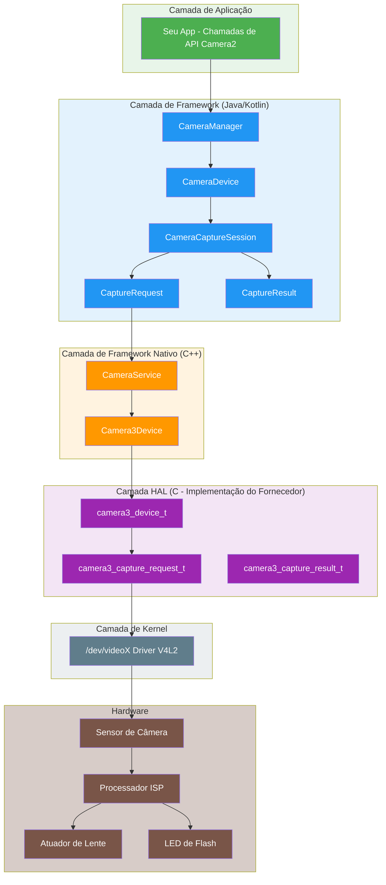
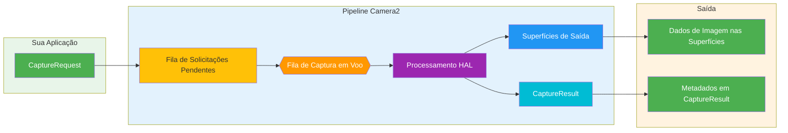
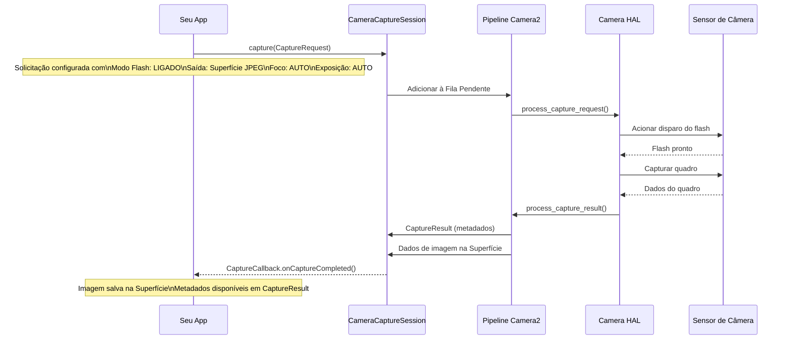
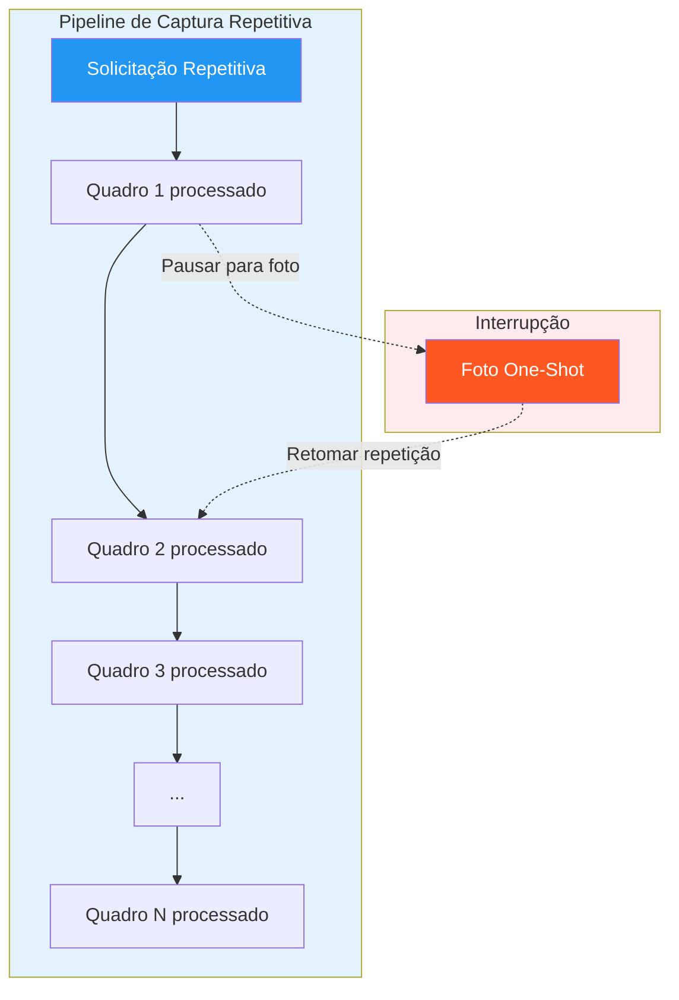
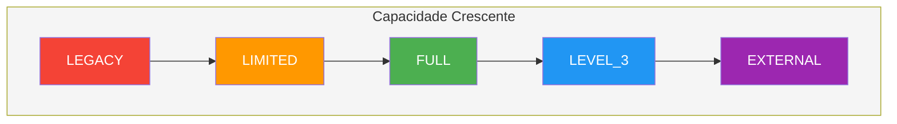
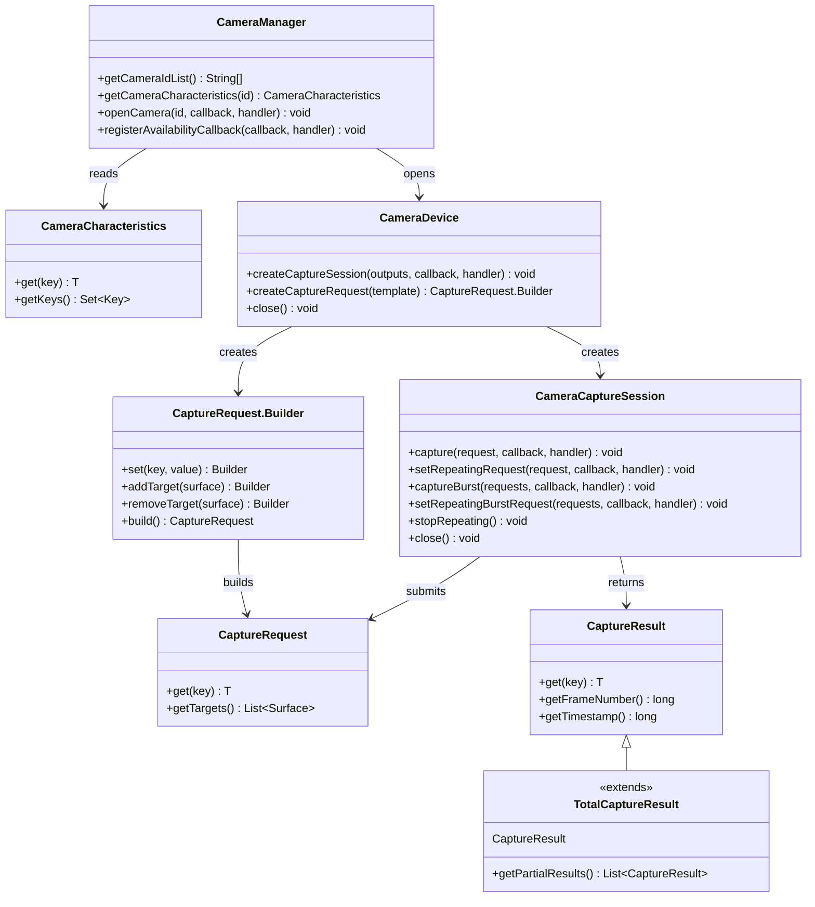
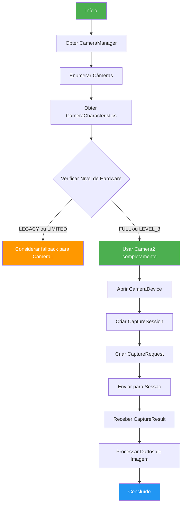
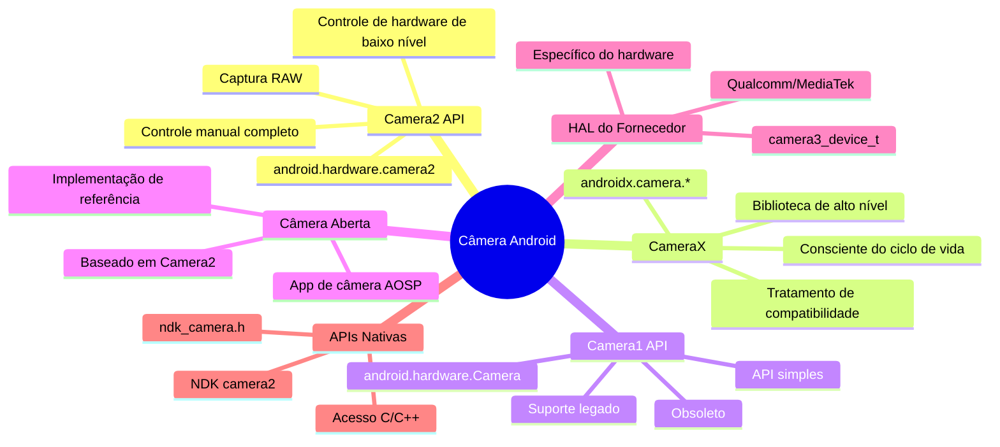

# Capítulo 1: Bem-vindo ao Android Camera2

> **Visão Geral do Capítulo:** Neste capítulo, exploraremos o mundo do Android Camera2 do zero. Você entenderá não apenas *o que* é o Camera2, mas *por que* ele foi criado, *como* funciona e *onde* ele se posiciona no ecossistema de câmera do Android. Abordaremos o modelo de Pipeline, os tipos de Capture, a classificação de Níveis de Hardware e toda a arquitetura, do App ao HAL.

---

## 1.1 Por que aprender Camera2?

Quase todo smartphone hoje possui um sistema de câmera poderoso. Um telefone moderno pode:

- Capturar fotos com aparência profissional usando fotografia computacional
- Gravar vídeos 4K e 8K em altas taxas de quadros
- Criar efeitos de retrato com sensoriamento de profundidade
- Fotografar em condições de baixa iluminação extrema com modo noturno
- Capturar vídeos em câmera lenta a 960 fps
- Gerar informações de profundidade 3D para aplicações de AR
- Combinar múltiplas câmeras de forma transparente

Mas quando você abre o app de câmera padrão, só vê uma interface simples: um botão de obturador, um controle de zoom e alguns modos de disparo.

Por trás dessa interface simples está um sistema surpreendentemente complexo. O app de câmera se comunica com componentes de hardware, processadores de imagem e frameworks Android para produzir cada quadro.

### Quem deve aprender Camera2?

Como desenvolvedores Android, podemos querer construir aplicações que vão além do app de câmera padrão:

- Um **aplicativo de fotografia manual** com controle total de exposição, ISO e foco
- Uma **ferramenta de teste de câmera** para técnicos verificarem capacidades do dispositivo
- Um **aplicativo de visão computacional** que precisa de acesso a quadros brutos
- Um **aplicativo de varredura 3D** usando sensores de profundidade
- Um **gravador de vídeo profissional** com seleção de codec e controle de taxa de bits
- Um **analisador de capacidades de câmera** como o nosso próprio [Android Camera Parameters](/)

Se algum desses cenários parece familiar, o Camera2 é a API que você precisa dominar.

---

## 1.2 O que é o Android Camera2?

**Android Camera2** é o framework de câmera moderno introduzido pelo Google no **Android 5.0 (nível de API 21)**. Ele substituiu a API original `android.hardware.Camera` (agora retroativamente chamada de **Camera1**).

### O problema que o Camera2 resolveu

A antiga API de câmera (Camera1) foi projetada para um mundo mais simples: uma câmera, captura de foto básica e gravação de vídeo simples. Mas as câmeras de smartphone evoluíram drasticamente:

| Época | Dispositivo Típico | API de Câmera |
|-------|-------------------|---------------|
| 2010-2014 | Câmera única, sensor básico | Camera1 |
| 2015-2018 | Câmeras duplas, OIS, HDR | Camera2 (uso limitado) |
| 2019-2022 | Câmeras triplas, profundidade, telefoto | Camera2 (padrão) |
| 2023+ | Câmeras quádruplas, periscópio, LiDAR, UWB | Camera2 (essencial) |

Dispositivos modernos podem conter múltiplas câmeras traseiras (wide, ultra-wide, telefoto, periscópio), sensores de profundidade e até câmeras USB externas. Eles suportam recursos avançados como:

- Exposição e foco manuais
- Captura de imagem RAW
- Gravação de vídeo de alta velocidade
- Processamento HDR
- Estabilização óptica (OIS)
- Fusão de múltiplas câmeras

O Camera2 foi criado para dar aos desenvolvedores **controle profundo, preciso e granular** sobre o hardware da câmera.

---

## 1.3 Camera2 vs Camera1 vs CameraX

Antes de mergulhar profundamente no Camera2, vamos esclarecer a relação entre as três principais APIs de câmera.

### Camera1 (`android.hardware.Camera`)

- **Introduzido:** Android 1.0 (obsoleto no Android 5.0)
- **Modelo:** Procedural, com estado, orientado a câmera única
- **Pontos Fortes:** Simples, bem conhecido, amplamente compatível
- **Pontos Fracos:** Controle limitado, sem suporte a RAW, sem múltiplas câmeras, sem modo burst

### Camera2 (`android.hardware.camera2`)

- **Introduzido:** Android 5.0 (API 21)
- **Modelo:** Orientado a objetos, sem estado, pipeline de solicitação/resposta
- **Pontos Fortes:** Controle profundo de hardware, suporte a RAW, múltiplas câmeras, vídeo de alta velocidade
- **Pontos Fracos:** Complexo, verboso, requer entendimento dos internos da câmera

### CameraX (`androidx.camera.*`)

- **Introduzido:** Android 10 (pré-lançamento), estável no Android 11+
- **Modelo:** Declarativo, consciente do ciclo de vida, orientado a casos de uso
- **Pontos Fortes:** Fácil de usar, compatibilidade automática, gerenciamento de ciclo de vida
- **Pontos Fracos:** Controle avançado limitado, pode não expor todos os recursos de hardware

### Tabela de Comparação

| Dimensão | Camera1 | Camera2 | CameraX |
|-----------|---------|---------|---------|
| **Nível** | Baixo nível (obsoleto) | Baixo nível (atual) | Alto nível (Jetpack) |
| **Dificuldade** | Fácil | Difícil | Fácil |
| **Controle** | Mínimo | Máximo | Moderado |
| **Suporte a RAW** | Não | Sim | Limitado |
| **Múltiplas Câmeras** | Não | Sim | Limitado |
| **Modo Burst** | Não | Sim | Não |
| **Controles Manuais** | Limitados | Completos | Limitados |
| **Melhor Para** | Apps legados | Apps avançados de câmera | Maioria dos apps de câmera |
| **Status** | Obsoleto | Ativo | Recomendado |

### Por que esta série se concentra no Camera2

Embora o CameraX seja recomendado para a maioria das aplicações, entender o Camera2 é essencial porque:

1. **O CameraX é construído sobre o Camera2** — O CameraX usa o Camera2 por baixo dos panos. Entender o Camera2 ajuda você a entender o que o CameraX está fazendo.
2. **Alguns recursos estão disponíveis apenas no Camera2** — Captura RAW, controle manual do sensor e cenários avançados de múltiplas câmeras exigem o Camera2.
3. **Depuração requer conhecimento do Camera2** — Quando um app CameraX não funciona como esperado, muitas vezes você precisa entender o comportamento subjacente do Camera2 para diagnosticar problemas.
4. **O entendimento do Camera2 é fundamental** — Mesmo que você use o CameraX no seu app, entender o Camera2 torna você um melhor desenvolvedor de câmera Android.

---

## 1.4 Arquitetura do Camera2: A Visão Geral

O Camera2 fica no meio da pilha de câmera do Android, conectando o código da aplicação com os drivers de hardware. Entender essa arquitetura é crucial para a depuração e otimização.

### Arquitetura em Camadas



### Explicação de Cada Camada da Arquitetura

| Camada | Localização | Linguagem | Responsabilidade |
|--------|------------|-----------|------------------|
| **Aplicação** | Código do seu app | Kotlin/Java | Criar CaptureRequests, manipular CaptureResults |
| **Framework (Java)** | `android.hardware.camera2.*` | Java | API pública, gerencia sessões, converte dados |
| **Framework Nativo** | `frameworks/av/` | C++ | Binder IPC, CameraService, Camera3Device |
| **HAL** | `hardware/libhardware/` + fornecedor | C | Abstração de hardware, implementação específica do fornecedor |
| **Kernel** | `/dev/videoX` | C | Driver V4L2, comunicação com hardware |
| **Hardware** | Módulo físico da câmera | — | Sensor, ISP, lente, flash |

### Princípio de Design Chave: O Camera2 é um Pipeline

O conceito mais importante a entender sobre o Camera2 é que ele modela as operações de câmera como um **pipeline**. Cada ação — visualização, captura de foto, gravação de vídeo — é expressa como uma **Solicitação de Capture** que flui pelo pipeline e produz um **Resultado de Capture**.

---

## 1.5 O Modelo de Pipeline do Camera2

O Pipeline é o coração do design do Camera2. Ele substitui o modelo com estado e sequencial do Camera1 por um modelo sem estado de solicitação/resposta.

### Como o Pipeline Funciona



### Componentes do Pipeline Explicados

| Componente | Descrição |
|-----------|-----------|
| **CaptureRequest** | Um objeto de configuração que descreve *um quadro* de captura. Contém todos os parâmetros: tempo de exposição, modo de foco, flash, superfícies de saída, etc. |
| **Fila de Solicitações Pendentes** | Uma fila FIFO onde novos CaptureRequests esperam para serem processados |
| **Fila de Captura em Voo** | Solicitações atualmente sendo processadas pelo HAL. Geralmente limitada a 1-4 solicitações dependendo do dispositivo |
| **Processamento HAL** | A camada de abstração de hardware processa a solicitação: controla sensor, ISP, lente, etc. |
| **Superfícies de Saída** | Imagens são escritas nas Superfícies configuradas (Superfície de visualização, Superfície ImageReader, etc.) |
| **CaptureResult** | Metadados sobre a captura: tempo de exposição real, estado AF, timestamp, etc. NÃO contém dados de imagem |

### Propriedades Chave do Pipeline

1. **Solicitações são sem estado** — Cada CaptureRequest contém todas as informações necessárias. O pipeline não tem memória de solicitações anteriores.
2. **Processamento é sequencial** — As solicitações são processadas em ordem FIFO pelo HAL.
3. **Resultados são assíncronos** — Os CaptureResults chegam via callbacks, não são retornados sincronizadamente.
4. **Múltiplas saídas por solicitação** — Um CaptureRequest pode escrever em múltiplas Superfícies (ex., visualização + foto simultaneamente).
5. **Pipeline pode ser configurado** — Você pode escolher templates (visualização, captura parada, gravação) ou modo totalmente manual.

### Exemplo Concreto: Tirando uma Foto com Flash

Para entender o Pipeline, vamos rastrear o que acontece quando você tira uma foto com flash:



---

## 1.6 Tipos de Capture: One-Shot, Burst e Repetitivo

O Camera2 define três tipos fundamentais de Capture, cada um atendendo a diferentes casos de uso. Entender esses tipos é crucial para projetar aplicações de câmera corretamente.

### Tipo 1: Captura One-Shot

Capturas **One-Shot** executam exatamente uma vez. Elas são ideais para ações únicas, como tirar uma foto ou aplicar uma mudança de configuração única.


**Casos de Uso:**
- Tirar uma única foto
- Aplicar um flash temporário
- Capturar um quadro para análise
- Disparar autofoco uma vez

**Chamada de API:**
```kotlin
cameraCaptureSession.capture(captureRequest, callback, handler)
```

### Tipo 2: Captura Burst

Capturas **Burst** executam múltiplas vezes consecutivas sem interrupção. Uma vez iniciadas, nenhuma outra solicitação pode ser inserida até que o burst seja concluído.


**Características Principais:**
- Todos os quadros em um burst têm configurações idênticas ou incrementalmente diferentes
- Nenhuma outra solicitação pode ser processada durante um burst
- A fila de burst é separada da fila de solicitações pendentes
- Maior prioridade do que solicitações repetitivas

**Casos de Uso:**
- Captura contínua de fotos (modo burst)
- Bracketing (captura da mesma cena em diferentes exposições)
- Análise de movimento (captura de assuntos em movimento rápido)
- Captura sequencial de múltiplos quadros para composição

**Chamada de API:**
```kotlin
cameraCaptureSession.captureBurst(burstRequests, callback, handler)
```

### Tipo 3: Captura Repetitiva

Capturas **Repetitivas** executam continuamente, formando a base da visualização ao vivo e da gravação de vídeo. Quando uma solicitação repetitiva está ativa, ela ocupa o pipeline entre outras capturas.



**Características Principais:**
- Apenas uma solicitação repetitiva pode estar ativa por vez (substitui a anterior)
- É interrompida por solicitações one-shot e burst, depois retoma automaticamente
- Forma a base da visualização e da gravação de vídeo
- Não produz CaptureResults individuais para cada quadro (usa resultados parciais para eficiência)

**Casos de Uso:**
- Visualização de câmera ao vivo
- Gravação de vídeo
- Monitoramento contínuo de foco
- Análise de quadros em tempo real

**Chamada de API:**
```kotlin
cameraCaptureSession.setRepeatingRequest(captureRequest, callback, handler)
// ou para vídeo:
cameraCaptureSession.setRepeatingBurstRequest(burstRequests, callback, handler)
```

### Comparação de Tipos de Capture

| Recurso | One-Shot | Burst | Repetitivo |
|---------|----------|-------|------------|
| **Execução** | Uma vez | Múltiplas (contíguas) | Contínua |
| **Prioridade** | Alta | Mais alta | Mais baixa |
| **Interrupção** | Não pode ser interrompido | Não pode ser interrompido | Pode ser interrompido |
| **Fila** | Fila Pendente | Fila Burst separada | Ocupação do pipeline |
| **Uso Típico** | Foto, quadro único | Modo burst, bracketing | Visualização, vídeo |
| **Callback de Resultado** | Um resultado por chamada | Um resultado por quadro | Resultados periodicamente |

### O Sistema de Templates de Capture

O Camera2 fornece templates pré-definidos para cenários comuns de captura:

| Template | Descrição | Caso de Uso |
|----------|-----------|-------------|
| `TEMPLATE_PREVIEW` | Otimizado para visualização ao vivo | Visualização de câmera |
| `TEMPLATE_STILL_CAPTURE` | Otimizado para captura de foto | Tirar fotos |
| `TEMPLATE_RECORD` | Otimizado para gravação de vídeo | Captura de vídeo |
| `TEMPLATE_VIDEO_SNAPSHOT` | Foto durante a gravação de vídeo | Snapshot enquanto grava |
| `TEMPLATE_ZERO_SHUTTER_LAG` | Alta qualidade, atraso mínimo | Fotografia em burst |
| `TEMPLATE_MANUAL` | Todos os controles automáticos desativados | Controle manual completo |

Templates são atalhos que pré-configuram parâmetros comuns. Você pode então modificar configurações individuais a partir do template.

---

## 1.7 Níveis de Hardware Suportados

Nem todos os dispositivos Android suportam o conjunto completo de recursos do Camera2. Para resolver isso, o Google definiu **Níveis de Hardware Suportados** — um sistema de classificação que informa aos desenvolvedores o que esperar da implementação de câmera de um dispositivo.

### Classificação de Níveis de Hardware



### Descrições dos Níveis

| Nível | Descrição | Suporte Camera2 |
|-------|-----------|----------------|
| **LEGACY** | Compatível com versões anteriores do Camera1. Chamadas Camera2 são convertidas para Camera1 por baixo dos panos. | Apenas recursos básicos do Camera1 |
| **LIMITED** | Alguns recursos do Camera2 são suportados. O pipeline completo do Camera2 não é garantido. | Recursos parciais do Camera2 |
| **FULL** | Conjunto completo de recursos do Camera2. Pipeline completo, controles manuais, múltiplas câmeras. | Todos os recursos do Camera2 |
| **LEVEL_3** | Tudo em FULL, mais reprocessamento YUV e fluxos de saída adicionais. | FULL + recursos avançados |
| **EXTERNAL** | Similar ao LIMITED, mas para câmeras externas (USB, etc.). | Suporte a câmeras externas |

### Como Verificar o Nível de Hardware

Você pode consultar o nível de hardware usando `CameraCharacteristics`:

```kotlin
val cameraManager = getSystemService(Context.CAMERA_SERVICE) as CameraManager
val cameraId = cameraManager.cameraIdList[0]
val characteristics = cameraManager.getCameraCharacteristics(cameraId)

val hardwareLevel = characteristics.get(CameraCharacteristics.INFO_SUPPORTED_HARDWARE_LEVEL)
val levelName = when (hardwareLevel) {
    CameraCharacteristics.INFO_SUPPORTED_HARDWARE_LEVEL_LEGACY -> "LEGACY"
    CameraCharacteristics.INFO_SUPPORTED_HARDWARE_LEVEL_LIMITED -> "LIMITED"
    CameraCharacteristics.INFO_SUPPORTED_HARDWARE_LEVEL_FULL -> "FULL"
    CameraCharacteristics.INFO_SUPPORTED_HARDWARE_LEVEL_3 -> "LEVEL_3"
    CameraCharacteristics.INFO_SUPPORTED_HARDWARE_LEVEL_EXTERNAL -> "EXTERNAL"
    else -> "UNKNOWN"
}
Log.d("Camera", "Hardware Level: $levelName")
```

### Implicações Práticas

| Nível | O que significa para o seu app |
|-------|-------------------------------|
| **LEGACY** | O Camera2 pode funcionar, mas com limitações. Considere o Camera1 como fallback. |
| **LIMITED** | Recursos básicos do Camera2 funcionam. Alguns recursos avançados podem estar ausentes. |
| **FULL** | Suporte completo ao Camera2. Seguro para usar todos os recursos do Camera2. |
| **LEVEL_3** | Pode usar reprocessamento YUV e recursos avançados de múltiplos fluxos. |
| **EXTERNAL** | Pode suportar câmeras USB e outras entradas externas. |

### Consulta de Capacidades em Tempo de Execução

Além do nível de hardware, sempre verifique capacidades específicas em tempo de execução:

```kotlin
val capabilities = characteristics.get(CameraCharacteristics.REQUEST_AVAILABLE_CAPABILITIES)
capabilities?.forEach { capability ->
    when (capability) {
        CameraMetadata.REQUEST_AVAILABLE_CAPABILITIES_BACKWARD_COMPATIBLE ->
            Log.d("Camera", "Supports backward compatible mode")
        CameraMetadata.REQUEST_AVAILABLE_CAPABILITIES_MANUAL_SENSOR ->
            Log.d("Camera", "Supports manual sensor control")
        CameraMetadata.REQUEST_AVAILABLE_CAPABILITIES_MANUAL_POST_PROCESSING ->
            Log.d("Camera", "Supports manual post-processing")
        CameraMetadata.REQUEST_AVAILABLE_CAPABILITIES_RAW ->
            Log.d("Camera", "Supports RAW capture")
        CameraMetadata.REQUEST_AVAILABLE_CAPABILITIES_PRIVATE_REPROCESSING ->
            Log.d("Camera", "Supports private reprocessing")
        CameraMetadata.REQUEST_AVAILABLE_CAPABILITIES_DEEP_OUTPUT ->
            Log.d("Camera", "Supports deep output")
    }
}
```

---

## 1.8 Visão Geral das Classes Principais do Camera2

A API do Camera2 é construída em torno de um pequeno conjunto de classes principais. Vamos conhecê-las antes de nos aprofundarmos em cada uma.

### Diagrama de Relacionamento entre Classes Principais



### Responsabilidades das Classes

| Classe | Pacote | Responsabilidade |
|--------|--------|------------------|
| `CameraManager` | `android.hardware.camera2` | Serviço de sistema de alto nível. Enumera câmeras, fornece acesso ao CameraDevice. |
| `CameraCharacteristics` | `android.hardware.camera2` | Metadados de capacidades de câmera somente leitura. |
| `CameraDevice` | `android.hardware.camera2` | Representa uma câmera conectada. Cria sessões e builders de solicitação de captura. |
| `CameraCaptureSession` | `android.hardware.camera2` | A instância do pipeline. Submete CaptureRequests, gerencia capturas repetitivas. |
| `CaptureRequest` | `android.hardware.camera2` | Configuração de captura imutável. Todos os parâmetros para um quadro. |
| `CaptureRequest.Builder` | `android.hardware.camera2` | Builder para criar objetos CaptureRequest. |
| `CaptureResult` | `android.hardware.camera2` | Saída de metadados de uma captura concluída. |
| `TotalCaptureResult` | `android.hardware.camera2` | Resultado de captura completo, incluindo todos os resultados parciais. |

### O Fluxo de Trabalho do Camera2



---

## 1.9 Camera2 vs Camera1: Comparação Detalhada

Se você já trabalhou com Camera1 antes, apreciará as diferenças. Se não, esta seção ajudará você a entender por que o Camera2 é um redesign fundamental.

### Comparação de Arquitetura

| Aspecto | Camera1 | Camera2 |
|---------|---------|---------|
| **Modelo de Programação** | Procedural (imperativo) | Orientado a objetos (declarativo) |
| **Gerenciamento de Estado** | Com estado (a câmera mantém estado) | Sem estado (cada solicitação é autocontida) |
| **Modelo de Captura** | Comandos (takePicture(), startPreview()) | Pipeline (CaptureRequest → CaptureResult) |
| **Threading** | Principalmente single-threaded | Projetado para uso multi-threaded |
| **Tratamento de Erros** | Exceções, difícil de recuperar | Códigos de erro + exceções, mais granular |
| **Metadados** | Somente leitura após a captura | Disponível em tempo real durante a captura |
| **Múltiplas Saídas** | Não suportado | Uma solicitação → múltiplas superfícies |
| **Zero-Copy** | Não suportado | Suportado via ImageReader |

### Comparação de API Lado a Lado

#### Abrindo uma Câmera

```kotlin
// Camera1 (API antiga)
val camera = Camera.open()
camera.setPreviewDisplay(surfaceHolder)
camera.startPreview()

// Camera2 (API nova)
val cameraManager = getSystemService(Context.CAMERA_SERVICE) as CameraManager
cameraManager.openCamera(cameraId, object : CameraDevice.StateCallback() {
    override fun onOpened(camera: CameraDevice) {
        mCameraDevice = camera
        // Criar sessão e solicitações...
    }
    override fun onDisconnected(camera: CameraDevice) { camera.close() }
    override fun onError(camera: CameraDevice, error: Int) { camera.close() }
}, handler)
```

#### Tirando uma Foto

```kotlin
// Camera1 (API antiga)
camera.takePicture(null, null, object : Camera.PictureCallback() {
    override fun onPictureTaken(data: ByteArray, camera: Camera) {
        // Processar dados de imagem
    }
})

// Camera2 (API nova)
val requestBuilder = mCameraDevice.createCaptureRequest(CameraDevice.TEMPLATE_STILL_CAPTURE)
requestBuilder.addTarget(imageReader.surface)
val captureRequest = requestBuilder.build()
mCameraCaptureSession.capture(captureRequest, object : CameraCaptureSession.CaptureCallback() {
    override fun onCaptureCompleted(session: CameraCaptureSession, 
                                    request: CaptureRequest, 
                                    result: TotalCaptureResult) {
        // Metadados no resultado
        val exposureTime = result.get(CaptureResult.SENSOR_EXPOSURE_TIME)
    }
}, handler)
// Dados de imagem chegam via ImageReader.OnImageAvailableListener
```

#### Diferenças Principais na Prática

| Operação | Camera1 | Camera2 |
|----------|---------|---------|
| **Visualização + Foto** | Deve parar a visualização para tirar foto, depois reiniciar | Pode tirar foto sem parar a visualização |
| **Múltiplas Fotos** | Apenas uma foto por vez | Modo burst com quantidade arbitrária |
| **Exposição Manual** | Não disponível | Controle total sobre tempo de exposição e ganho |
| **Foco Manual** | Apenas modos pré-definidos | Controle total sobre posição da lente |
| **Captura RAW** | Não disponível | Suportado em dispositivos FULL+ |
| **Metadados em Tempo Real** | Não disponível | Disponível via CaptureResults parciais |

### Dicas de Migração do Camera1

Se você está migrando do Camera1 para o Camera2, tenha estas dicas em mente:

1. **Pense em termos de CaptureRequests**, não de comandos. Cada ação — foco, flash, foto — é um CaptureRequest.
2. **Separe a visualização da captura**. No Camera1, você tinha que parar a visualização para capturar. No Camera2, você envia uma solicitação separada enquanto a solicitação repetitiva continua.
3. **Use handlers para callbacks**. Os callbacks do Camera2 rodam na thread do Handler. Sempre forneça um para evitar ANRs.
4. **Verifique o nível de hardware primeiro**. Se um dispositivo for LEGACY, considere usar o Camera1 em vez disso.
5. **Use templates de CaptureRequest** para operações comuns. Modifique a partir dos templates em vez de construir do zero.
6. **Não bloqueie a thread principal**. Todas as operações do Camera2 devem rodar em uma thread de fundo.

---

## 1.10 Camera2 no Ecossistema Android

O Camera2 não existe isoladamente. Ele é parte de um ecossistema maior de APIs e bibliotecas relacionadas à câmera.

### Ecossistema de APIs de Câmera



### Quando usar qual API

| Requisito | API Recomendada | Razão |
|-----------|----------------|-------|
| App de foto simples | CameraX | Mais fácil, mais compatível |
| Gravação de vídeo | CameraX | Suporte a vídeo integrado |
| Fotografia manual | Camera2 | Controle total sobre todos os parâmetros |
| Visão computacional | Camera2 | Acesso direto a quadros, latência mínima |
| Fusão de múltiplas câmeras | Camera2 | Única API com suporte completo a múltiplas câmeras |
| Captura RAW | Camera2 | Única API com suporte a RAW |
| Câmera externa | Camera2 | Suporte a câmera externa (nível EXTERNAL) |
| Suporte a dispositivos legados | Camera1 | Compatibilidade com dispositivos mais antigos |

---

## 1.11 Aprendendo com Android Camera Parameters

Ler documentação é útil, mas as capacidades da câmera são mais fáceis de entender quando você pode ver dados reais de um telefone real. Ao longo desta série, usaremos o [Android Camera Parameters](/) para explorar informações reais de câmera do seu próprio dispositivo.

Você pode usar o app para descobrir:

- Câmeras disponíveis (ID, orientação, nível de hardware)
- Resoluções e taxas de quadros suportadas
- Informações do sensor (tamanho da matriz ativa, distância focal)
- Suporte a controle manual (faixa de ISO, faixa de tempo de exposição)
- Capacidade e formatos de RAW
- Nível de hardware e capacidades suportadas
- Dump completo de CameraCharacteristics

Em vez de aprender com exemplos abstratos, você pode investigar diretamente o seu próprio dispositivo e ver como os conceitos deste capítulo se aplicam ao hardware real.

---

## 1.12 Principais Conclusões

Parabéns por terminar o Capítulo 1! Aqui está o que você deve lembrar:

### Conceitos Principais

1. **O Camera2 é um pipeline** — Cada operação de câmera é um CaptureRequest que flui pelo pipeline e produz um CaptureResult.
2. **Tipos de Capture** — One-shot (único), Burst (múltiplos contíguos), Repetitivo (contínuo)
3. **Níveis de Hardware** — LEGACY → LIMITED → FULL → LEVEL_3 → EXTERNAL
4. **Camadas da Arquitetura** — App → Framework → Framework Nativo → HAL → Kernel → Hardware

### Princípios Práticos

1. **Sempre verifique o nível de hardware** — Nem todos os dispositivos suportam recursos completos do Camera2
2. **Verifique capacidades em tempo de execução** — Não assuma que os recursos estão disponíveis
3. **Use templates para operações comuns** — `TEMPLATE_PREVIEW`, `TEMPLATE_STILL_CAPTURE`, etc.
4. **Rode em threads de fundo** — Operações do Camera2 não devem bloquear a thread principal
5. **Separe a visualização da captura** — Use solicitação repetitiva para visualização, one-shot para fotos

### O que vem a seguir

No próximo capítulo, **Entendendo Câmeras de Smartphone**, deixaremos o Android por um momento e exploraremos o hardware da câmera em si. Você aprenderá sobre:

- Tecnologia de sensor de câmera (CMOS vs CCD)
- Design de lente e distância focal
- Pipeline de processamento do ISP (Image Signal Processor)
- Por que dois telefones com contagens de megapixels semelhantes podem produzir fotos completamente diferentes
- O pipeline de imagem completo, da luz à foto final

Depois de entender o hardware, os conceitos do Camera2 se tornarão muito mais intuitivos.

---

## 1.13 Resumo

O Android Camera2 é um framework de câmera poderoso e de baixo nível que oferece aos desenvolvedores um controle sem precedentes sobre o hardware da câmera. Sua arquitetura baseada em Pipeline, três tipos de Capture e classificação de Níveis de Hardware fornecem uma base robusta para a construção de aplicações avançadas de câmera.

Neste capítulo, cobrimos:
- ✅ Arquitetura do Camera2 e posição no ecossistema
- ✅ Modelo de pipeline com fluxo de solicitação/resultado
- ✅ Tipos de Capture: one-shot, burst, repetitivo
- ✅ Classificação de Níveis de Hardware e verificação em tempo de execução
- ✅ Visão geral das classes principais e relacionamentos
- ✅ Comparação detalhada Camera1 vs Camera2

Agora vamos mergulhar no hardware da câmera no Capítulo 2! 🚀