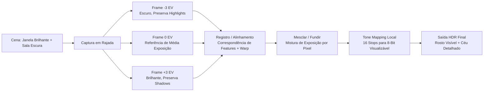
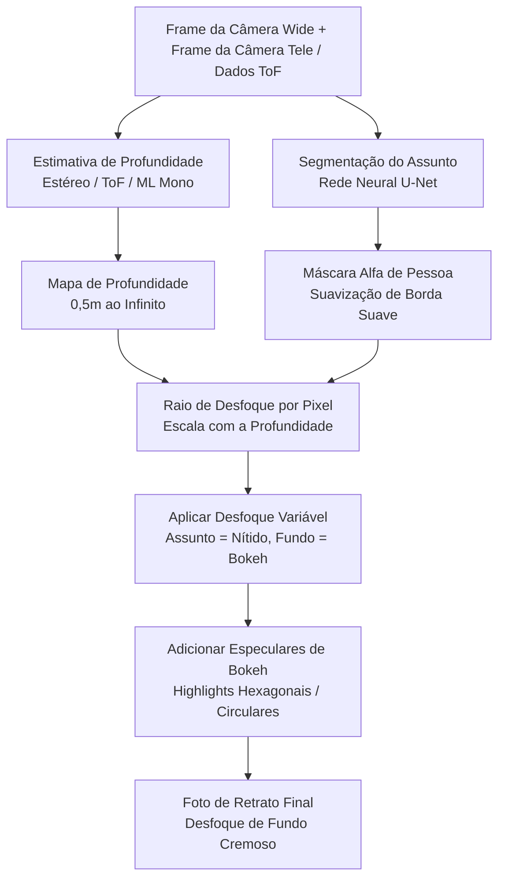
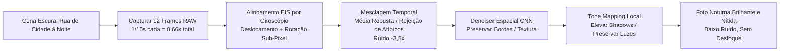
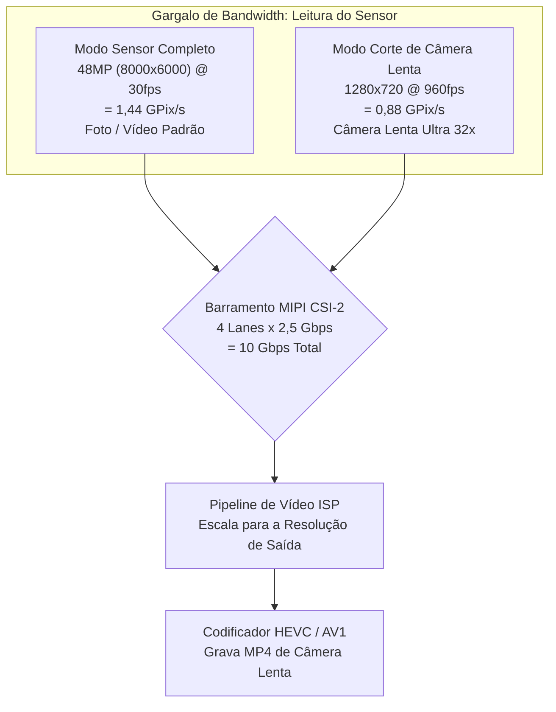
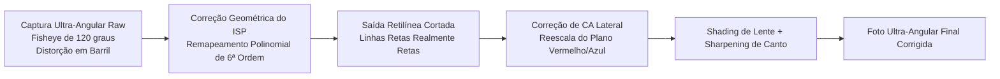
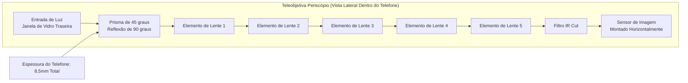
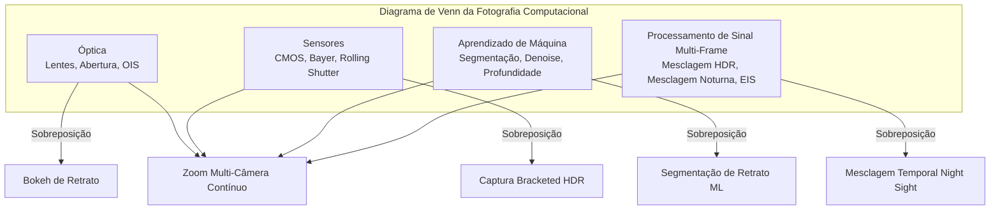

# Capítulo 3: Fotografia Moderna em Smartphones

O Capítulo 2 deu a você as fundamentações de hardware: lentes, sensores, pipelines de ISP e módulos multi-câmera. Este capítulo responde à pergunta natural que se segue: **Como os aplicativos de câmera modernos realmente usam esse hardware para produzir as fotos que vejo no Instagram?**

Um smartphone de 2010 capturava uma única exposição, passava por um ISP básico e gravava um JPEG. Um smartphone de 2026 rotineiramente captura de 5 a 15 frames separados para uma única foto estática, alinha-os com precisão sub-pixel usando dados do giroscópio, funde-os usando processamento de sinal multi-frame, passa o resultado por uma rede neural para segmentação semântica ou estimativa de profundidade e, finalmente, aplica tone mapping em uma única imagem compartilhável — tudo dentro do tempo de um único pressionamento do botão do obturador.

Este capítulo é um tour recurso por recurso da fotografia moderna em smartphones. Explicaremos como cada recurso funciona no nível de hardware + software, sem qualquer código da Camera2 API. O objetivo é construir um vocabulário do que os sistemas de câmera modernos podem fazer, para que quando você escrever código posteriormente para controlar esses recursos, saiba o que está acontecendo sob o capô.

## HDR: Fusão Multi-Frame de High Dynamic Range

**Dynamic range** é a razão entre as partes mais claras e mais escuras de uma cena que o sistema de imagem pode registrar simultaneamente sem clipping. O olho humano pode perceber aproximadamente 20 stops de dynamic range (uma razão de contraste de 1.000.000:1) em uma única olhada, graças à adaptação sacádica. Uma única exposição do sensor de um smartphone pode capturar aproximadamente 10 a 12 stops no ISO base. A lacuna entre esses dois números é o motivo pelo qual o HDR existe.

Imagine que você está tirando uma foto em ambientes internos com uma janela brilhante atrás do seu assunto. Se você expõe para o rosto da pessoa (digamos 1/30s, ISO 400), a janela estoura para um branco clippado puro — sem céu, sem nuvens, sem detalhes. Se você expõe para a janela (1/2000s, ISO 50), o rosto da pessoa se torna uma mancha preta silhuetada. Nenhuma das exposições únicas funciona.

### Como o HDR de Smartphones Funciona

Todo sistema HDR em smartphones modernos usa **bracketing multi-frame** seguido de fusão computacional. O algoritmo funciona assim:

1. **Captura bracketed**: A câmera captura uma rajada rápida de 3 a 10 frames consecutivos em diferentes valores de exposição (EV). Um conjunto típico pode ser frames em -3 EV (muito curto, preserva highlights), -1 EV, +1 EV e +3 EV (muito longo, captura shadows). O sensor e o VCM são mantidos perfeitamente imóveis durante a rajada; apenas o tempo do obturador eletrônico muda.
2. **Seleção do frame de referência**: O algoritmo escolhe o frame de média exposição mais nítido como referência geométrica.
3. **Registro / alinhamento de imagem**: Cada frame não-referencial é alinhado computacionalmente à referência. O algoritmo encontra features de keypoint distintos (cantos, bordas) usando algoritmos como FAST ou SIFT, calcula uma transformação affine ou homography que mapeia as features de cada frame no frame de referência e warpa os pixels de acordo. Quaisquer frames que estejam muito borrados (devido a micro-tremores durante a rajada) são descartados inteiramente.
4. **Fusão**: Para cada localização de pixel na imagem final, o algoritmo combina informações dos frames alinhados. Pixels subexpostos contribuem com seus dados de highlight limpos e não clippados. Pixels superexpostos contribuem com seus dados de shadow com baixo ruído. Pixels de médio tom são calculados como média em todos os frames para reduzir o shot noise.
5. **Tone mapping**: A imagem linear fundida — que agora pode conter de 14 a 18 stops de dynamic range utilizável — é comprimida através de um sofisticado operador de tone mapping local em uma imagem de saída de 8-bit ou 10-bit que parece boa em uma tela sRGB padrão.

Exemplo do mundo real: um Galaxy S26 Ultra no modo padrão "Scene Optimizer HDR" dispara internamente 7 frames bracketed totalizando aproximadamente 0,2 segundos de tempo de captura. A detecção de movimento das mãos embutida descarta 2 frames borrados. Os 5 frames restantes são alinhados, fundidos e recebem tone mapping. A saída é gravada como um **arquivo JPEG_R Ultra HDR** em dispositivos Android 14+: uma imagem JPEG primária padrão (SDR de 8-bit) com um gain map embutido que visualizadores compatíveis com HDR (Galaxy Android 14, Chrome 120+, Adobe Lightroom) podem usar para reconstruir a faixa completa de luminância HDR de 10-bit em uma tela HDR10 ou Dolby Vision.

### Quando o HDR Funciona e Quando Não Funciona

O HDR se destaca em cenas estáticas com highlights brilhantes e shadows profundas: paisagens, retratos contraluz, cômodos com janelas, pôr do sol sobre a água. Ele falha ativamente — produzindo artefatos de ghosting — quando objetos na cena se movem durante a rajada bracketed: um pássaro voando, uma bandeira ondulando, uma pessoa piscando, uma criança correndo. Algoritmos HDR modernos baseados em IA detectam e segmentam objetos em movimento, misturando apenas o frame de referência para esses pixels para evitar o clássico "ghost" do HDR.

## Modo Retrato: Bokeh via Estimativa de Profundidade

O modo retrato produz a estética onde o rosto do assunto está perfeitamente nítido e o fundo se dissolve em um desfoque cremoso, fora de foco, chamado **bokeh**. Câmeras tradicionais conseguem isso opticamente com sensores grandes, aberturas amplas e longas distâncias focais. Smartphones conseguem isso computacionalmente, porque um sensor de 1/1,3-polegada em f/1.6 não produz naturalmente profundidade de campo rasa suficiente para o efeito.

### Três Métodos de Estimativa de Profundidade em Smartphones

Existem três técnicas independentes usadas pelos sistemas de retrato modernos; muitos telefones usam uma combinação das três.

**Método 1: Disparidade Estéreo de Câmeras Duplas.** Este é o método mais antigo e geometricamente mais sólido. O telefone dispara tanto a câmera wide quanto a teleobjetiva simultaneamente no mesmo assunto. Como as duas câmeras estão fisicamente separadas por 10 a 15 milímetros (a "baseline"), elas veem o assunto de posições horizontais ligeiramente diferentes. A posição de um objeto em primeiro plano muda mais entre os dois pontos de vista do que a posição de um objeto distante ao fundo. Essa mudança é chamada **disparidade**. O algoritmo executa um algoritmo de block-matching ou semi-global matching (SGM) sobre as duas imagens retificadas para calcular um valor de disparidade para cada pixel. A disparidade é inversamente proporcional à profundidade, então o mapa de disparidade é convertido diretamente em um mapa de profundidade por pixel.

**Método 2: Sensoriamento de Profundidade Ativo ToF / LiDAR.** Um sensor de profundidade ToF (Time-of-Flight) ou LiDAR projeta um padrão estruturado de mais de 30.000 pontos de laser infravermelho próximo na cena, então mede o tempo de ida e volta (para ToF direto) ou a mudança de fase (para ToF indireto) da luz refletida para calcular uma profundidade métrica real em metros para cada pixel. ToF produz mapas de profundidade precisos e densos mesmo em escuridão total e em superfícies sem textura (paredes lisas, céu) onde a correspondência estéreo falha. Sistemas de retrato modernos tipicamente usam ToF como a referência de profundidade ground-truth e a disparidade estéreo como sinal de refinamento.

**Método 3: Estimativa de Profundidade ML Monocular.** Para telefones de câmera única (ou para a câmera selfie frontal, que não tem parceiro estéreo), uma rede neural estima a profundidade a partir de uma única imagem RGB. O modelo, treinado em milhões de imagens com rótulos de profundidade ground-truth, aprende as pistas estatísticas que os humanos usam para julgar profundidade: tamanho relativo, oclusão, perspectiva linear, gradiente de textura, desfoque de defocus e perspectiva atmosférica. O PortraitNet do Google e o DeepLabV3+ da Meta são arquiteturas representativas. A profundidade monocular é menos precisa metricamente que estéreo ou ToF, mas é suficiente para um bokeh de retrato de aparência plausível.

### O Pipeline de Renderção de Retrato

Uma vez que um mapa de profundidade é obtido, os passos restantes são os mesmos, independentemente do método de estimativa de profundidade usado:

1. **Segmentação do Assunto**: Uma rede neural de segmentação semântica separada (geralmente uma variante U-Net) roda na imagem principal da câmera RGB e produz uma máscara alfa suave identificando quais pixels pertencem a "pessoa" vs "fundo". A máscara é suavizada nas bordas — especialmente ao redor do cabelo, óculos e detalhes finos de primeiro plano — para evitar o visual de recorte "paper doll" do modo retrato do início dos anos 2010.
2. **Refinamento de Profundidade**: O mapa de profundidade bruto do Método 1/2/3 é multiplicado com a máscara de segmentação. Pixels de fundo mantêm seu valor de profundidade; pixels do assunto são fixados a uma única profundidade de plano de foco.
3. **Desfoque Variável por Pixel**: Cada pixel de fundo é borrado por uma Gaussiana (ou, para modos premium de "simulação óptica", uma convolução de kernel de lente renderizada fisicamente) cujo raio escala linearmente com a distância do pixel ao plano de foco. Um objeto de fundo a 5 metros recebe um desfoque pesado; um objeto de fundo a 1,5 metros recebe um desfoque leve. Os pixels do assunto são copiados intactos.
4. **Glare Óptico Falso**: Um toque premium: highlights especulares brilhantes no fundo borrado (luminárias de rua, reflexos, o sol) são renderizados como hexágonos ou círculos característicos de bokeh em forma de lente, em vez de simples manchas Gaussianas. Isso vende a ilusão de que o desfoque veio de um diafragma de lente real.

## Modo Noturno: Mesclagem Temporal Multi-Frame

Antes de 2018, a fotografia em smartphones com pouca luz era essencialmente inutilizável sem flash. Um bar mal iluminado ou uma rua de cidade à noite produzia uma bagunça ruidosa, granulada e borrada. Então o Google lançou o **Night Sight** no Pixel 3, e tudo mudou. A percepção central foi contraintuitiva: em vez de fazer uma única exposição longa de 1 segundo (que seria esperançosamente borrada pelo tremor das mãos), faça 15 exposições muito curtas de 1/15 de segundo (cada uma individualmente nítida porque o OIS está ativo), então alinhe-as e calcule a média algoritmicamente. O tempo de exposição integrado total ainda é 1 segundo, mas a exposição por frame é curta o suficiente para que o desfoque por tremor de mãos nunca se acumule.

### O Algoritmo do Modo Noturno Passo a Passo

1. **Captura em Rajada**: A câmera captura de 8 a 15 frames raw. Cada frame usa um tempo de exposição moderado (1/15s a 1/8s é típico) e ISO moderado (800 a 3200). Frames individuais são ruidosos, mas não borrados. A rajada totaliza de 0,5 a 2 segundos de tempo real.
2. **Alinhamento EIS Auxiliado por Giroscópio**: O giroscópio IMU principal do telefone registra a velocidade angular a 8.000 Hz durante toda a rajada. Para cada frame, a rotação e translação cumulativas em relação ao frame de referência são calculadas. Cada frame raw é então deslocado, rotacionado e ligeiramente escalado digitalmente (Electronic Image Stabilization, EIS) no NPU com precisão sub-pixel, registrando-o perfeitamente no frame de referência, mesmo que as mãos do usuário tenham se movido vários pixels completos de desfoque durante a rajada.
3. **Mesclagem Temporal de Pixels**: Para cada localização de pixel nos 12 frames alinhados, o algoritmo reúne 12 valores de pixel candidatos. Ele então realiza uma mesclagem estatística robusta em vez de uma simples média: valores atípicos (causados por pixels quentes, impactos de raios cósmicos, ou faróis de um carro transitando por aquele ponto) são identificados e descartados. Os valores consistentes restantes são calculados como média, reduzindo o shot noise Gaussiano por um fator igual à raiz quadrada do número de frames mantidos. Uma mesclagem de 12 frames reduz o ruído em 3,5×.
4. **Denoising Espacial**: Um denoiser baseado em CNN (treinado especificamente em imagens noturnas raw) remove qualquer ruído de alta frequência restante, preservando bordas e texturas reais.
5. **Tone Mapping Local**: A imagem raw fundida tem um dynamic range muito alto. Um operador de tone mapping espacialmente variável (baseado em filtragem bilateral ou em um tone map CNN aprendido) eleva as shadows sem estourar as luzes da cidade, aumenta a saturação de cor em regiões escuras (que de outra forma pareceriam dessaturadas) e produz uma imagem final de 8-bit que parece brilhante e limpa em vez de dim e turva.

O "Nightography" da Samsung, o "Night Mode" da Apple, o "Night Mode 2.0" da Xiaomi e o "Ultra Dark Mode" da OPPO usam substancialmente a mesma arquitetura de algoritmo. Variações existem no número exato de frames, na escolha da estatística de mesclagem robusta, na arquitetura do denoiser e na aparência do tone map, mas a média temporal multi-frame alinhada por giroscópio é universal em toda a indústria.

## Câmera Lenta: Captura Cortada de Alta Taxa de Quadros

O vídeo em câmera lenta estica o tempo capturando quadros de vídeo mais rápido do que a taxa de reprodução padrão de 30 fps, depois reproduzindo-os na velocidade normal de 30 fps. Os multiplicadores comuns:

- **Captura de 120 fps → reprodução de 30 fps = câmera lenta de 4×.** Um evento do mundo real de 1 segundo se torna 4 segundos de vídeo.
- **240 fps → 30 fps = câmera lenta de 8×.**
- **960 fps → 30 fps = câmera lenta ultra de 32×.** O respingo de uma gota d'água, o estouro de um balão ou o bater de asas de um beija-flor se tornam visíveis.

### Por Que 960 fps Exige um Corte do Sensor

O gargalo para a captura de alta taxa de quadros é a **bandwidth de leitura do sensor**. O sensor de imagem tem um número finito de lanes MIPI CSI-2 rodando em uma taxa de dados máxima fixa (tipicamente 2,5 Gbps por lane, 4 lanes = 10 Gbps no total). O sensor só pode emitir uma certa quantidade de pixels por segundo.

- A leitura de um frame completo de 48MP (8000×6000) a 960 fps exigiria 48.000.000 × 960 = 46,08 bilhões de pixels por segundo. Isso é 30× a bandwidth de leitura real de qualquer sensor de smartphone de 2026.
- Portanto, para atingir 960 fps, o sensor deve ler apenas um pequeno corte central de seu array de pixels. Um modo de 960 fps é tipicamente um corte de 1280×720 (720p HD) ou às vezes 1920×1080 (1080p FHD). A bandwidth total de pixels torna-se gerenciável: 1280×720×960 fps = 884 megapixels por segundo, o que cabe confortavelmente em 10 Gbps mesmo com codificação de 10-bit por pixel.

Os números na prática: captura de 960 fps × 0,3 segundos de tempo real = 288 frames individuais. Reproduzidos a 30 fps = 9,6 segundos de vídeo em câmera lenta suave. Alguns telefones flagship Sony Xperia e Samsung Galaxy suportam uma breve rajada de 960 fps na resolução 1080p lendo o sensor através de um banco de conversores analógico-digitais (ADC) limitado apenas na região de corte central.

Modos de câmera lenta também costumam usar uma técnica de HDR escalonado em que linhas alternadas do sensor são expostas por durações diferentes para manter um alto dynamic range mesmo a 240 fps ou 960 fps.

## Ultra-Angular: Correção de Distorção e Qualidade de Borda

A câmera ultra-angular de um flagship moderno oferece uma distância focal equivalente a 10–18mm em full-frame e um campo de visão diagonal de 100° a 130°. Ela abre possibilidades de composição que a câmera wide padrão não consegue: paisagens panorâmicas, fotos de arquitetura imponente onde todo o prédio cabe sem entrar no trânsito, selfies em grupo que realmente incluem todo mundo e um efeito divertido de "distorção de proximidade em close-up" onde objetos segurados perto da lente aparecem massivamente sobredimensionados em relação ao fundo.

No entanto, a distância focal ultra-angular vem com três falhas ópticas características que o ISP deve corrigir antes que a foto seja utilizável:

1. **Distorção Geométrica (Barril)**: Linhas retas curvam-se para fora como as bordas de uma lente olho de peixe. Uma foto de uma moldura de porta retangular parecerá estufada ou em barril. O estágio de Geometric Distortion Correction do ISP (veja o Capítulo 2) aplica um remapeamento de coordenadas por pixel usando um modelo de lente polinomial de 4ª ou 6ª ordem calibrado para aquele módulo específico. A correção necessariamente corta os 5–10% externos do array do sensor porque o remapeamento empurra esses pixels externos para fora da tela.
2. **Aberração Cromática Lateral (LCA)**: A lente dobra diferentes comprimentos de onda de luz em quantidades ligeiramente diferentes, então imagens vermelha, verde e azul do mesmo ponto fora do eixo aterrissam em coordenadas de pixel ligeiramente diferentes. O resultado é uma coloração visível (bordas roxas/verdes) em objetos de alto contraste perto dos cantos. O ISP corrige a LCA aplicando um fator de ampliação ligeiramente diferente aos planos de cor vermelho e azul em relação ao verde.
3. **Vinheta / Suavidade de Canto**: Pixels de canto recebem significativamente menos luz que pixels centrais (devido à atenuação natural cos⁴θ da lente mais vinheta mecânica do corpo da lente), e a MTF (Modulation Transfer Function) óptica da lente é menor em ângulos extremos, então os cantos parecem suaves. O estágio de Lens Shading Correction aplica um ganho radialmente simétrico para achatar a iluminação, e um filtro de sharpening consciente de bordas é aplicado de forma mais agressiva nos cantos do que no centro.

## Teleobjetiva: Padrão vs Periscópio

A câmera teleobjetiva captura assuntos distantes que a câmera wide não consegue resolver. Smartphones modernos vêm com dois designs distintos de teleobjetiva.

**Teleobjetiva Padrão (óptico de 2× a 3×):** Este é um módulo de câmera convencional: o corpo da lente fica perpendicular à tampa traseira do telefone, diretamente acima do sensor de imagem, exatamente como a câmera wide, mas com uma lente de distância focal mais longa. Uma teleobjetiva de 3× tem uma distância focal equivalente em full-frame de ~72mm. O empilhamento físico é limitado pela espessura do telefone (7–9mm), então a lente não pode ser mais longa que isso. Daí o teto prático de 3× para módulos de teleobjetiva convencionais.

**Teleobjetiva Periscópio (óptico de 5× a 10×):** Para obter distâncias focais mais longas sem tornar o telefone mais espesso, engenheiros dobraram o caminho óptico em 90° usando um prisma. A luz entra por uma janela na borda do telefone ou no vidro traseiro, atinge um prisma de ângulo reto de 45°, reflete 90° lateralmente e então viaja horizontalmente através de um corpo de lente multi-elementos de 10–14mm de comprimento que corre paralelo à placa-mãe do telefone, finalmente aterrissando em um sensor de imagem montado lateralmente no PCB. O prisma em si é montado em um gimbal de OIS de 2 eixos, e o sensor às vezes é montado em um OIS de sensor-shift separado, dando estabilização total de 4 ou 5 eixos — suficiente para obter fotos nítidas de 10× em mãos de um texto em uma placa de um prédio distante.

Nos limites de zoom entre câmeras físicas (por exemplo, 2,9× ainda cortado digitalmente da câmera wide vs 3,1× usando a teleobjetiva periscópio de 3×), o HAL executa um truque de fusão multi-câmera: por aproximadamente ±0,2× ao redor do ponto de transição, ele captura ambas as câmeras simultaneamente e realiza um cross-fade ponderado pela razão de zoom, para que o usuário nunca veja um "salto" visível quando a câmera física ativa muda.

## Macro: Fotografia de Close-Up Extremo

A fotografia macro captura close-ups extremos de assuntos pequenos: a textura de pétalas de flores, os olhos compostos de insetos, as fibras de um pedaço de tecido, os cristais individuais de açúcar em um biscoito.

Duas estratégias de macro existem em smartphones modernos:

**Câmera Macro Dedicada:** Telefones de entrada e médios geralmente vêm com um pequeno módulo macro dedicado de baixa resolução (2MP a 5MP) com uma lente de distância focal curta de foco fixo. O módulo é ajustado para uma distância mínima de foco específica (tipicamente 2–4 cm) e produz imagens macro surpreendentemente nítidas apesar de sua baixa resolução. A principal desvantagem é que o sensor é minúsculo, então a qualidade da imagem degrada acentuadamente em qualquer coisa menos que luz do dia brilhante.

**Ultra-Angular Redirecionada como Macro:** Telefones flagship (Google Pixel, Samsung S-series Ultra, iPhone Pro) não vêm com uma câmera macro dedicada. Em vez disso, eles redirecionam a câmera ultra-angular. A distância focal curta da ultra-angular (13mm eq) lhe dá uma distância mínima de foco muito curta — frequentemente 1 a 2 centímetros do assunto. Quando o usuário toca no modo "Macro" ou o aplicativo de câmera detecta um assunto próximo via sensor ToF ou rangefinder de phase-detect AF, o aplicativo muda para a ultra-angular, direciona seu VCM para a posição de foco mínimo, aplica correção extra de distorção geométrica (porque o assunto está agora em um extremo de curvatura de campo onde o remapeamento polinomial difere significativamente da calibração de infinito) e corta o centro do sensor ultra-angular para produzir o frame macro final. O grande sensor ultra-angular de 12MP–50MP oferece qualidade de imagem macro dramaticamente melhor que um módulo dedicado de 5MP.

## Fotografia Computacional: A Filosofia Unificadora

Os recursos acima — HDR, Retrato, Modo Noturno, Câmera Lenta, correção Ultra-Angular, fusão de zoom Periscópio, Macro — compartilham uma única ideia unificadora. **Fotografia computacional** é a filosofia de que o sensor de câmera, o ISP, o giroscópio/IMU, a NPU (Neural Processing Unit) e os algoritmos de processamento de sinal multi-frame podem trabalhar juntos para produzir imagens que nenhuma combinação única de lente/sensor, não importa quão caro o vidro, poderia produzir por conta própria.

O modelo clássico de DSLR é: luz → lente → sensor → armazenamento. O modelo de smartphone é: luz → múltiplas lentes → múltiplos sensores → giroscópio/IMU → captura de rajada multi-frame → inferência neural na NPU → fusão de decisão por pixel → tone mapping sofisticado → armazenamento. Ambos começam e terminam no mesmo lugar, mas o smartphone insere dezenas de passos computacionais adicionais no meio, cada um dos quais melhora o resultado final de maneiras que a óptica sozinha não consegue.

Dar zoom de forma contínua de 0,5× a 10× em um Galaxy S26 Ultra é computacional: o HAL mescla três câmeras diferentes com três distâncias focais diferentes em cinco pontos de troca de zoom. Salvar um retrato contraluz onde a janela atrás do assunto não estoura mais é computacional: fusão HDR de 7 frames. Uma foto noturna à mão da Via Láctea que exigiria um tripé e uma exposição de 30 segundos em uma DSLR é computacional: mesclagem temporal alinhada por giroscópio de 12 frames. Cada recurso descrito neste capítulo é fotografia computacional.

Esta é a ideia mais importante para levar aos capítulos da Camera2 API que se seguem. A Camera2 API não é apenas uma ferramenta para "tirar uma foto". É uma interface de controle de baixo nível que permite ao seu aplicativo disparar rajadas multi-frame precisas, ler metadados de giroscópio por frame, selecionar qual câmera física dispara em qual razão de zoom e transmitir frames por redes neurais no dispositivo — os blocos de construção para implementar seus próprios recursos de fotografia computacional.

## Resumo

Neste capítulo você aprendeu os algoritmos do mundo real por trás dos recursos de fotografia moderna em smartphones. O HDR usa bracketing de exposição de 3–10 frames, alinhamento baseado em features por frame e tone mapping para capturar o dynamic range que o sensor não consegue ver em uma única exposição. O modo retrato calcula um mapa de profundidade por pixel via disparidade de câmera estéreo, medição a laser ToF ou estimativa de profundidade ML monocular, então roda uma segmentação de assunto U-Net e aplica um desfoque Gaussiano variável por pixel escalado pela profundidade. O modo noturno captura 8–15 exposições curtas, alinha-as usando EIS auxiliado por giroscópio, aplica mesclagem temporal robusta de pixels para reduzir o ruído em 3,5× e aplica tone mapping local no resultado. Vídeo em câmera lenta a 960 fps deve cortar o sensor porque a bandwidth de leitura MIPI é o gargalo rígido. Fotos ultra-angulares passam por correção de distorção geométrica, correção de aberração cromática e correção de shading de canto no ISP antes de se tornarem visualizáveis. Câmeras teleobjetivas periscópio usam um prisma de 45° para dobrar o caminho da luz em 90° e encaixar uma lente óptica de 10× dentro de um telefone de 8,5mm de espessura. Você aprendeu a definição de fotografia computacional: a fusão de Óptica, Sensores, Aprendizado de Máquina e Processamento de Sinal Multi-Frame para criar imagens além do alcance de qualquer sistema único de lente/sensor.

## O Que Vem a Seguir

O Capítulo 4 é o capítulo prático hands-on. Você instalará o aplicativo complementar **Android Camera Parameters** a partir do código-fonte ou Google Play, o iniciará no seu próprio telefone e inspecionará exatamente do que seu próprio hardware é capaz. Você aprenderá a ler IDs de câmera e direções de frente, verificar o Hardware Level de cada câmera (LEGACY / LIMITED / FULL / LEVEL_3), enumerar formatos de saída suportados (JPEG, YUV_420_888, PRIVATE, RAW_SENSOR, JPEG_R Ultra HDR), encontrar faixas máximas de FPS de câmera lenta, explorar razões de zoom e pontos de troca entre as câmeras físicas do seu telefone e verificar se seu sensor principal suporta captura RAW — anotando as respostas para o seu dispositivo específico, porque essas respostas determinam o que é e o que não é possível para o seu próprio aplicativo Camera2 API fazer naquele telefone.
