# Capítulo 16: Balanço de Branco e Cor

Você dominou o brilho (exposição) e a nitidez (foco). Agora é hora de controlar o **visual** — o *tom de cor* da imagem.

Quando você tira uma foto de um pedaço de papel branco sob uma lâmpada incandescente quente, a luz amarela/laranja da lâmpada atinge o papel e o sensor a vê como laranja. *Seu cérebro* corrige isso instantaneamente e ainda vê "papel branco" — mas os dados brutos do sensor registram a verdade: é laranja.

O **Balanço de Branco (WB - White Balance)** é o processo da câmera de compensar a cor da fonte de luz para que os brancos neutros pareçam neutros. Erre nisso e sua foto inteira terá uma tonalidade de cor indesejada (muito laranja, muito azul, muito verde).

O [aplicativo Android Camera Parameters](https://github.com/zoozooll/AndroidCameraParameters) exibe todas as predefinições de AWB em uma visualização de grade ao vivo e expõe um seletor de ganhos manuais — abra o aplicativo, mude para o painel White Balance e você poderá ver exatamente o que implementaremos neste capítulo.

---

## Temperatura de Cor: O Espectro do Quente ao Frio

As fontes de luz são descritas por sua **temperatura de cor** em Kelvin (K). A escala descreve a temperatura de um "radiador de corpo negro" teórico que brilha com a mesma cor.

```mermaid
graph LR
    A["1800K<br/>Luz de vela"] --> B["2800K<br/>Lâmpada Incandescente"]
    B --> C[3500K<br/>Fluorescente Quente]
    C --> D[4500K<br/>Fluorescente Fria]
    D --> E[5500K<br/>Luz do dia / Flash]
    E --> F[6500K<br/>Dia Nublado]
    F --> G[8000K<br/>Sombra Aberta]
    G --> H[10000K+<br/>Céu Azul / Sombra Profunda]
    style A fill:#e67e22,color:#fff
    style B fill:#f39c12,color:#fff
    style C fill:#f1c40f,color:#333
    style D fill:#f9e79f,color:#333
    style E fill:#ffffff,color:#333,stroke:#333
    style F fill:#d4e6f1,color:#333
    style G fill:#85c1e9,color:#333
    style H fill:#3498db,color:#fff
```



**Regra contraintuitiva:** Luz quente = número Kelvin *baixo* (vela de 1800K = muito laranja). Luz fria = número Kelvin *alto* (céu de 10000K = muito azul). Seus olhos aprendem isso na infância; seu código deve lembrar disso explicitamente.

| Cena | Temp. de Cor Típica | Tonalidade se o WB "Luz do dia" for usado |
|-------|-------------------|----------------------------|
| Jantar à luz de velas | 1800–2200K | Muito laranja / âmbar |
| Lâmpada de tungstênio doméstica | 2700–3000K | Laranja / amarelo |
| Nascer do sol / Pôr do sol | 3000–4000K | Tonalidade dourada quente (frequentemente desejável!) |
| Fluorescente "branco frio" | 4000–5000K | Tonalidade esverdeada |
| Luz solar ao meio-dia | 5200–5800K | Neutro correto |
| Flash eletrônico | 5500–6000K | Neutro (combina com a luz do dia) |
| Nublado / nuvens pesadas | 6000–7500K | Levemente azul |
| Sombra aberta (sem sol direto) | 7000–9000K | Tonalidade azul |
| Céu azul com névoa | 9000–12000K | Muito azul |

O trabalho do Balanço de Branco Automático: detectar o provável iluminante a partir das estatísticas da cena e, em seguida, *subtrair* a tonalidade de cor para que os objetos neutros pareçam neutros.

---

## Modos de Balanço de Branco Automático (AWB) no Camera2

Definidos via `CaptureRequest.CONTROL_AWB_MODE`:

| Modo (CONTROL_AWB_MODE_*) | Efeito | Caso de Uso |
|---------------------------|--------|----------|
| `OFF` | Apenas balanço de branco manual. Use `COLOR_CORRECTION_GAINS` ou `_TRANSFORM` explicitamente. | Modo Pro, gradação de cor personalizada, RAW + pós-processamento |
| `AUTO` | Padrão. O ISP executa a detecção de iluminante continuamente. | Fotografia geral |
| `INCANDESCENT` (TUNGSTEN) | ~2800K. Ganho azul forte para cancelar a luz quente de tungstênio. | Lâmpadas domésticas internas, iluminação de palco |
| `FLUORESCENT` | ~4500K. Ganhos para fluorescente de escritório típica (tende à tonalidade verde). | Escritório / sala de aula |
| `WARM_FLUORESCENT` | ~3200K. Compensa lâmpadas fluorescentes compactas (CFL) "branco quente". | Lâmpadas CFL domésticas "branco quente" |
| `DAYLIGHT` | ~5500K. Perfil de iluminante solar padrão ao meio-dia. | Dia ensolarado ao ar livre, combina com flash |
| `CLOUDY_DAYLIGHT` | ~6500K. Aquecimento leve para cancelar o frio do dia nublado. | Dia nublado / com névoa |
| `TWILIGHT` | Perfil de hora dourada quente do crepúsculo (~4500K). | Pôr do sol, anoitecer, paisagem quente |
| `SHADE` | ~7500K. Ganho de vermelho forte contra a luz azul profunda da sombra. | Retrato na sombra, sombra da cidade |

**Consulte os modos suportados primeiro:** Nem todo dispositivo traz todas as 9 predefinições. Telefones topo de linha geralmente trazem; dispositivos econômicos podem oferecer apenas `AUTO` + `OFF`.

```kotlin
val availableAwbModes = characteristics.get(
    CameraCharacteristics.CONTROL_AWB_AVAILABLE_MODES
) ?: intArrayOf()
Log.d("AWB", "Modos disponíveis: ${availableAwbModes.toList()}")
```

### Estados de AWB (Como o AF, mas Menos Tagarela)

A máquina de estados de AWB é conceitualmente similar à do AF, mas mais simples — possui menos estados:

| Estado de AWB | Significado |
|-----------|---------|
| `CONTROL_AWB_STATE_INACTIVE` | AWB desativado (`AWB_MODE = OFF`) |
| `CONTROL_AWB_STATE_SEARCHING` | Procurando pelo iluminante correto (a tonalidade pode flutuar) |
| `CONTROL_AWB_STATE_CONVERGED` | Encontrou iluminante estável — a cor está estável |
| `CONTROL_AWB_STATE_LOCKED` | Travado explicitamente via `CONTROL_AWB_LOCK = true` |

Use o mesmo padrão "aguardar por convergência / trava antes da captura" que você aplicou ao AF para fotografia crítica em termos de cor (fotos de produtos, trabalhos para catálogos).

---

## Como Funciona a Correção do Balanço de Branco: Por Baixo do Capô

O AWB aplica duas transformações de cor para ir do RGB do sensor para o sRGB exibível. Entendê-las permite que você ignore o AWB completamente com valores manuais.

### Passo 1: Ganhos de Canal (Correção de Ponto Branco)

Primeiro, multiplique cada canal de cor por um ganho para que uma superfície neutra resulte em R, G, B iguais:

> Se uma cena com uma lâmpada de tungstênio de 3200K produz `[R=200, G=150, B=100]` do sensor para um alvo cinza, o AWB aplica ganhos de canal de aproximadamente `R: 1.0, G: 1.33, B: 2.0` para normalizar para `[200, 200, 200]`.

No Camera2, isso é exposto como **`CaptureRequest.COLOR_CORRECTION_GAINS`**: um array de float de 4 elementos na ordem **[R, Geven, B, Godd]**.

Os dois canais verdes (`Geven`, `Godd`) existem porque muitos sensores de smartphones usam uma grade Bayer 2×2: linhas alternadas **GR / BG**. As linhas que começam com Verde-R versus Verde-B têm sensibilidades espectrais ligeiramente diferentes e precisam de ganhos digitais independentes. Para o trabalho diário, definir ambos os verdes com o mesmo valor é aceitável.

```kotlin
// COLOR_CORRECTION_GAINS = [ ganho R, ganho G-par, ganho B, ganho G-ímpar ]
val warmGains = floatArrayOf(1.0f, 1.2f, 0.8f, 1.2f)  // Tom quente: aumenta R, reduz B
val coolGains = floatArrayOf(0.85f, 1.0f, 1.25f, 1.0f) // Tom frio: aumenta B, reduz R
val neutralGains = floatArrayOf(1.0f, 1.0f, 1.0f, 1.0f) // Ganhos unitários (cor bruta do sensor)
```

**Faixa válida:** Os ganhos são tipicamente limitados a [0.0, 4.0] pelo HAL. Use fatores multiplicativos entre 0,5× e 3× para resultados plausíveis.

### Passo 2: Matriz de Transformação de Cor 3×3 (Mapeamento de Gamut)

Os ganhos de canal corrigem apenas o *ponto branco*. Mas diferentes sensores têm diferentes respostas espectrais nativas de filtros de cores, e diferentes dispositivos de saída têm diferentes gamuts de exibição (sRGB/Rec.709 vs DCI-P3 vs Display P3). Uma **matriz de correção de cor (CCM) 3×3** mapeia o espaço de cor RGB nativo do sensor para o espaço de saída padrão.

Matematicamente:

```
[ R' ]   [ m11  m12  m13 ] [ R ]
[ G' ] = [ m21  m22  m23 ] [ G ]
[ B' ]   [ m31  m32  m33 ] [ B ]
```

Ou em código: `output = M × input` onde M é uma matriz 3×3.

O Camera2 expõe isso via **`COLOR_CORRECTION_TRANSFORM`**, que é definido usando um array `Rational[9]` (ordem de linha: `m11, m12, m13, m21, m22, m23, m31, m32, m33`). Matriz identidade = entrada copiada diretamente:

```kotlin
// Matriz identidade 3x3 em Rationals: 1/1 para diagonal, 0/1 fora da diagonal
val identityMatrix = arrayOf(
    Rational(1,1), Rational(0,1), Rational(0,1),
    Rational(0,1), Rational(1,1), Rational(0,1),
    Rational(0,1), Rational(0,1), Rational(1,1)
)
```

**Os Gamuts Rec.709 vs DCI-P3:**

| Espaço de Cor | Cobertura | Caso de Uso |
|-------------|----------|----------|
| **Rec.709 (sRGB)** | ~35% da luz visível | HDTV, web, padrão JPEG, ~100% das telas de celulares até ~2020 |
| **DCI-P3** | ~45% da luz visível | Cinema digital, 4K UHD, telas modernas de iPhone/Android de gama ampla |

Uma tela P3 pode exibir vermelhos e verdes mais ricos que o Rec.709. Sua CCM de saída deve escolher um gamut alvo que corresponda ao que a tela do espectador espera. No Android, verifique `Display.isWideColorGamut()` e use uma matriz apropriada.

**Conselho prático:** A menos que você esteja escrevendo um revelador RAW profissional ou um app de cinema com gerenciamento de cores, defina `COLOR_CORRECTION_MODE = TRANSFORM_MATRIX` e deixe a matriz padrão do OEM lidar com o mapeamento de gamut. A maioria dos apps de modo pro ajusta apenas os `COLOR_CORRECTION_GAINS` (os 4 ganhos) e deixa a matriz intocada.

---

## Exemplo Completo 1: Travar o AWB na Predefinição Luz do Dia (Trava de Tom Quente)

Vamos começar simples. Às vezes você não quer o manual completo — você apenas quer **evitar que o AWB mude** entre os quadros (ex: timelapse, vídeo com mudanças de cena). Definir uma predefinição fixa como `DAYLIGHT` garante uma cor consistente entre os disparos.

Este é o controle manual de cor mais simples.

```kotlin
class AwbPresetController(
    private val characteristics: CameraCharacteristics,
    private val captureSession: CameraCaptureSession,
    private val previewSurface: Surface
) {
    // Retorna true se o HAL realmente suportar este modo
    fun isModeSupported(mode: Int): Boolean {
        val available = characteristics.get(
            CameraCharacteristics.CONTROL_AWB_AVAILABLE_MODES
        ) ?: intArrayOf()
        return mode in available
    }

    fun setPresetDaylightForWarmTintLock(): Boolean {
        if (!isModeSupported(CameraMetadata.CONTROL_AWB_MODE_DAYLIGHT)) {
            Log.w("AWB", "Predefinição DAYLIGHT não suportada neste dispositivo")
            return false
        }

        val request = captureSession.device.createCaptureRequest(
            CameraDevice.TEMPLATE_PREVIEW
        ).apply {
            addTarget(previewSurface)

            // Trava o balanço de branco no modo DAYLIGHT (~5500K).
            // Isso renderizará cenas internas de tungstênio como intencionalmente quentes/laranja,
            // que é o visual "fílmico" preferido na cinematografia.
            set(CaptureRequest.CONTROL_AWB_MODE,
                CameraMetadata.CONTROL_AWB_MODE_DAYLIGHT)

            // Mantém AE e AF em seus padrões (automático) para este exemplo
            set(CaptureRequest.CONTROL_MODE,
                CameraMetadata.CONTROL_MODE_AUTO)
        }

        captureSession.setRepeatingRequest(request.build(),
            object : CameraCaptureSession.CaptureCallback() {
                override fun onCaptureCompleted(
                    session: CameraCaptureSession,
                    request: CaptureRequest,
                    result: TotalCaptureResult
                ) {
                    val awbState = result.get(CaptureResult.CONTROL_AWB_STATE)
                    Log.d("AWB", "Predefinição DAYLIGHT aplicada, estado de AWB=$awbState")
                }
            }, null
        )
        return true
    }
}
```

**Aplicação artística:** – Se você estiver fotografando um pôr do sol com `AWB_MODE = DAYLIGHT`, a luz de 3000K do pôr do sol será registrada como *quente* para o balanço fixo de 5500K — produzindo tons laranja-dourados ricos e saturados. Usar o `AWB_MODE = AUTO` aqui iria *neutralizar o pôr do sol* (o objetivo principal!) injetando mais azul para cancelar a luz dourada. As predefinições preservam o clima.

---

## Exemplo Completo 2: AWB Manual Completo — Ganhos de Pôr do Sol Quente Personalizados

Para o controle criativo definitivo, desative o AWB completamente e escreva seus próprios ganhos. Vamos construir um "visual de pôr do sol quente" — aumentando levemente o vermelho, suprimindo o azul, com um aumento sutil de verde para evitar uma mudança para o roxo.

```kotlin
class ManualColorGradingController(
    private val characteristics: CameraCharacteristics,
    private val captureSession: CameraCaptureSession,
    private val previewSurface: Surface,
    private val jpegReaderSurface: Surface
) {
    // Predefinições canônicas de gradação de cor (R, G-par, B, G-ímpar)
    object Presets {
        val NEUTRAL = floatArrayOf(1.00f, 1.00f, 1.00f, 1.00f)
        val WARM_SUNSET = floatArrayOf(1.00f, 1.20f, 0.80f, 1.20f)  // Âmbar quente
        val COOL_MORNING = floatArrayOf(0.85f, 1.00f, 1.25f, 1.00f)  // Azul frio
        val VINTAGE_KODAK = floatArrayOf(1.15f, 1.00f, 0.85f, 1.00f) // Filme clássico
        val GREEN_SHIFT_FLUO = floatArrayOf(1.00f, 1.25f, 1.00f, 1.25f) // Correção de fluorescente
    }

    fun applyManualGains(gains: FloatArray, includeMatrix: Boolean = true) {
        // Validar: AWB_MODE = OFF deve ser suportado (sempre é na capacidade MANUAL)
        val hwLevel = characteristics.get(CameraCharacteristics.INFO_SUPPORTED_HARDWARE_LEVEL)
        val supportsManualColor = (hwLevel == CameraMetadata.INFO_SUPPORTED_HARDWARE_LEVEL_3 ||
                                   hwLevel == CameraMetadata.INFO_SUPPORTED_HARDWARE_LEVEL_FULL ||
                                   isModeSupported(CameraMetadata.CONTROL_AWB_MODE_OFF))
        if (!supportsManualColor) {
            Log.e("AWB", "Este dispositivo de nível LEGACY não pode fazer ganhos de AWB manuais")
            return
        }

        val request = captureSession.device.createCaptureRequest(
            CameraDevice.TEMPLATE_PREVIEW
        ).apply {
            addTarget(previewSurface)

            // 1) DESATIVAR o AWB completamente
            set(CaptureRequest.CONTROL_AWB_MODE, CameraMetadata.CONTROL_AWB_MODE_OFF)

            // 2) Aplicar os 4 ganhos de canal (R, G-par, B, G-ímpar)
            set(CaptureRequest.COLOR_CORRECTION_GAINS, gains)

            // 3) Escolher uma estratégia de correção de cor
            if (includeMatrix) {
                // FAST: deixa o HAL computar uma boa matriz para este iluminante
                // (a matriz é auto-derivada; apenas os ganhos são controlados pelo usuário)
                set(CaptureRequest.COLOR_CORRECTION_MODE,
                    CameraMetadata.COLOR_CORRECTION_MODE_FAST)
            } else {
                // EXPERT: define nossa própria matriz de transformação 3x3 + ganhos juntos
                set(CaptureRequest.COLOR_CORRECTION_MODE,
                    CameraMetadata.COLOR_CORRECTION_MODE_TRANSFORM_MATRIX)
                set(CaptureRequest.COLOR_CORRECTION_TRANSFORM, identityMatrix())
            }
        }

        captureSession.setRepeatingRequest(request.build(), null, null)
        Log.d("AWB", "Ganhos manuais aplicados: [${gains.joinToString()}]")
    }

    // ------- Captura estática com cor manual travada -------
    fun captureStillWithColorGrading(gains: FloatArray) {
        applyManualGains(gains)

        val stillRequest = captureSession.device.createCaptureRequest(
            CameraDevice.TEMPLATE_STILL_CAPTURE
        ).apply {
            addTarget(previewSurface)
            addTarget(jpegReaderSurface)

            set(CaptureRequest.CONTROL_AWB_MODE, CameraMetadata.CONTROL_AWB_MODE_OFF)
            set(CaptureRequest.COLOR_CORRECTION_GAINS, gains)
            set(CaptureRequest.COLOR_CORRECTION_MODE,
                CameraMetadata.COLOR_CORRECTION_MODE_FAST)

            set(CaptureRequest.JPEG_QUALITY, 95)
        }

        captureSession.capture(stillRequest.build(), null, null)
    }

    // ------- Auxiliares -------
    private fun identityMatrix(): Array<Rational> = arrayOf(
        Rational(1,1), Rational(0,1), Rational(0,1),
        Rational(0,1), Rational(1,1), Rational(0,1),
        Rational(0,1), Rational(0,1), Rational(1,1)
    )

    private fun isModeSupported(mode: Int): Boolean {
        val available = characteristics.get(
            CameraCharacteristics.CONTROL_AWB_AVAILABLE_MODES
        ) ?: intArrayOf()
        return mode in available
    }
}
```

### Usando as Predefinições

```kotlin
// O usuário toca no botão "Pôr do sol Quente"
controller.applyManualGains(ManualColorGradingController.Presets.WARM_SUNSET)

// O usuário toca em "Capturar" — os mesmos ganhos fluem para o JPEG
controller.captureStillWithColorGrading(ManualColorGradingController.Presets.WARM_SUNSET)
```

### COLOR_CORRECTION_MODE: FAST vs TRANSFORM_MATRIX

Use esta tabela de decisão:

| Cenário | Escolha `COLOR_CORRECTION_MODE =` |
|----------|----------------------------------|
| Eu quero apenas ganhos manuais; deixe o OEM escolher a matriz (maioria dos apps) | `FAST` |
| Estou aplicando um LUT / matriz de gradação de cor completo externamente, preciso do espaço de cor bruto intocado | `TRANSFORM_MATRIX` + matriz identidade |
| Eu tenho um perfil de cor personalizado (ICC / DCP) derivado para este sensor | `TRANSFORM_MATRIX` + CCM personalizada |

**Aviso:** `TRANSFORM_MATRIX` com a matriz identidade fornece a **cor bruta do sensor** sem o mapeamento de gamut do OEM. Em muitos sensores, isso parece visivelmente dessaturado e levemente tingido de verde sem processamento adicional. Este é o comportamento correto — é a saída bruta do sensor pronta para o seu pipeline de processamento personalizado.

---

## Conversor Manual Kelvin para Ganhos (Slider de Temperatura de Cor)

Apps de câmera pro (incluindo o [Android Camera Parameters](https://play.google.com/store/apps/details?id=com.minininja.cameraparams)) expõem um **slider de temperatura Kelvin**. Como o Camera2 não aceita Kelvin diretamente, aproximamos a curva de ganhos R/B.

Uma aproximação simples que funciona para a maioria dos sensores de smartphones (calibre sua curva de ganho empiricamente no seu hardware alvo):

```kotlin
class KelvinGainsConverter {
    // Converter Kelvin [2000..10000] → ganhos aproximados [R, G-par, B, G-ímpar]
    // Aproximação simples do locus Planckiano (bom o suficiente para sliders de UI)
    fun kelvinToRgbGains(kelvin: Int): FloatArray {
        val k = kelvin.coerceIn(2000, 10000)
        val temp = k / 100.0

        // Vermelho (quente em baixo K)
        val r = when {
            temp <= 66 -> 255.0
            else -> {
                var x = temp - 60.0
                x = 329.698727446 * Math.pow(x, -0.1332047592)
                x.coerceIn(0.0, 255.0)
            }
        }

        // Verde
        val g = when {
            temp <= 66 -> {
                var x = temp
                x = 99.4708025861 * Math.log(x) - 161.1195681661
                x.coerceIn(0.0, 255.0)
            }
            else -> {
                var x = temp - 60.0
                x = 288.1221695283 * Math.pow(x, -0.0755148492)
                x.coerceIn(0.0, 255.0)
            }
        }

        // Azul (frio em alto K)
        val b = when {
            temp >= 66 -> 255.0
            temp <= 19 -> 0.0
            else -> {
                var x = temp - 10.0
                x = 138.5177312231 * Math.log(x) - 305.0447927307
                x.coerceIn(0.0, 255.0)
            }
        }

        // Normalizar para que VERDE = 1.0, depois inverter: queremos GANHOS para compensar a temp.
        // Se o usuário escolher 2800K (quente), precisamos de MAIS ganho azul para cancelar a tonalidade quente.
        // Esta função retorna o RGB de *origem*; os ganhos são 1/R : 1/G : 1/B, normalizados em G=1
        val rGain = (g / r).toFloat().coerceIn(0.3f, 3.0f)
        val bGain = (g / b).toFloat().coerceIn(0.3f, 3.0f)
        return floatArrayOf(rGain, 1.0f, bGain, 1.0f)  // [R, G-par, B, G-ímpar]
    }
}
```

Use isso com um SeekBar (faixa de 2000–10000 K):

```kotlin
val converter = KelvinGainsConverter()
seekKelvin.setOnSeekBarChangeListener(object : SeekBar.OnSeekBarChangeListener {
    override fun onProgressChanged(sb: SeekBar, progress: Int, fromUser: Boolean) {
        val kelvin = 2000 + progress * 8   // 0→2000K, 1000→10000K
        val gains = converter.kelvinToRgbGains(kelvin)
        textKelvinLabel.text = "$kelvin K"
        controller.applyManualGains(gains)
    }
    override fun onStartTrackingTouch(sb: SeekBar) = Unit
    override fun onStopTrackingTouch(sb: SeekBar) = Unit
})
```

**Nota sobre calibração:** – Esta é uma aproximação Planckiana genérica. Para resultados perfeitos, utilize um Macbeth ColorChecker ou calibração de ponto branco no seu dispositivo alvo e, em seguida, ajuste uma curva para as proporções de ganho R/B medidas vs. Kelvin verdadeiro. O [aplicativo Android Camera Parameters](https://github.com/zoozooll/AndroidCameraParameters) usa dados de calibração por dispositivo carregados do HAL via `SENSOR_CALIBRATION_TRANSFORM1` onde disponível.

---

## Solução de Problemas de Cores

| Sintoma | Causa | Correção |
|---------|-------|-----|
| Ganhos manuais definidos mas a cor não muda | Esqueceu de `CONTROL_AWB_MODE = OFF` → AWB ainda sobrepondo ganhos | Defina AWB_MODE = OFF *antes* de definir GAINS/TRANSFORM |
| COLOR_CORRECTION_TRANSFORM ignorada | Modo ainda `FAST`; respeitado apenas no modo `TRANSFORM_MATRIX` | Defina `COLOR_CORRECTION_MODE = TRANSFORM_MATRIX` primeiro |
| AWB flutua entre quadros de timelapse (flash de tonalidade verde/roxa) | AWB ainda em AUTO e reavaliando a cada quadro | Defina predefinição de AWB_MODE fixa ou ganhos manuais completos para timelapse |
| JPEG com cor diferente da pré-visualização | JPEG aplicou modo/ganhos diferentes da última solicitação repetida | Aplique os MESMOS ganhos aos builders TEMPLATE_PREVIEW e TEMPLATE_STILL_CAPTURE |
| Dispositivo de nível LEGACY: travamento em ganhos manuais | INFO_SUPPORTED_HARDWARE_LEVEL = LEGACY (sem cor manual) | Fallback gracioso; exponha apenas a UI de AUTO + predefinições |

---

## Resumo

Balanço de branco e correção de cor no Camera2 dão a você a peça final da trilogia de controles manuais:

- **Temperatura de Cor (K):** – K baixo (vela 1800K) = quente/laranja; K alto (sombra 10000K) = frio/azul. O AWB compensa para neutralizar o iluminante.
- **Modos de AWB:** – 9 predefinições (`INCANDESCENT` → `SHADE`) + `AUTO` + `OFF`. Consulte `CONTROL_AWB_AVAILABLE_MODES` antes do uso.
- **Estados de AWB:** – `SEARCHING → CONVERGED → LOCKED`. Aguarde por CONVERGED/LOCKED em sequências críticas para a cor.
- **O controle manual tem duas camadas:**
  1. `COLOR_CORRECTION_GAINS` = array de float de 4 elementos `[R, G-par, B, G-ímpar]` — correção de ponto branco. Use `COLOR_CORRECTION_MODE = FAST` (matriz OEM, ganhos personalizados).
  2. `COLOR_CORRECTION_TRANSFORM` = matriz 3×3 `Rational[9]` — mapeamento de gamut completo. Use o modo `TRANSFORM_MATRIX` para matriz identidade ou CCM personalizada.
- **Rec.709 vs DCI-P3:** – A matriz 3×3 mapeia o espaço de cor do sensor → gamut alvo da tela.
- **Slider Kelvin:** – Kelvin→ganhos aproximados via matemática de locus Planckiano, aplique com AWB OFF.

## O Que Vem a Seguir

Você agora entende **exposição, foco e balanço de branco individualmente**. No **Capítulo 17: O Pipeline 3A**, finalmente orquestraremos todos os três juntos como uma sequência de captura de foto estática coesa:

- O fluxo completo `Gatilho AF → AF travado → Pré-captura AE → AE convergido com flash → capturar foto`.
- Modos de flash AE (`ON_AUTO_FLASH`, `ON_ALWAYS_FLASH`, `ON_AUTO_FLASH_REDEYE`).
- Estados de AE e a sequência do gatilho de pré-captura.
- Estados de AWB coordenados com AE+AF.
- Uma classe Kotlin de qualidade de produção completa que implementa toda a orquestração 3A com um diagrama de sequência Mermaid.
- Referência à pesquisa de Pipeline de Controle 3A.

Este é o capítulo que une tudo em um app de câmera pro funcional. Não perca.
