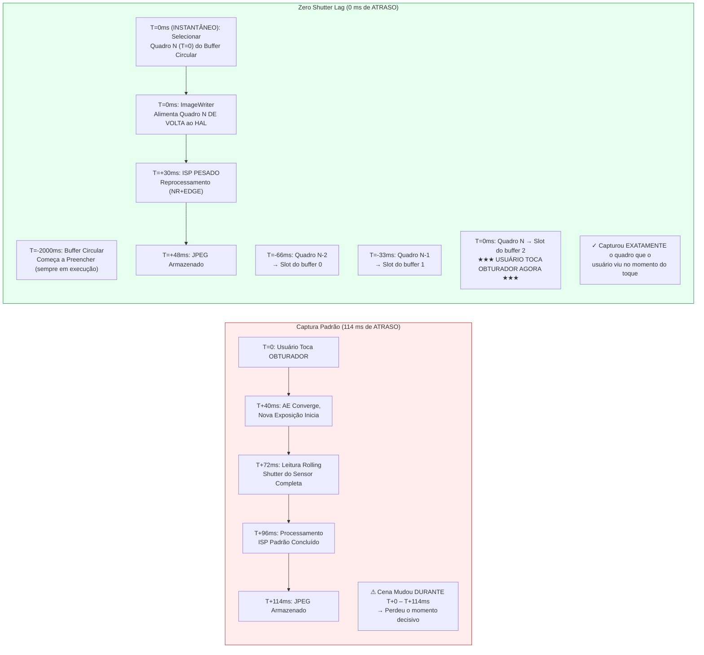

# Capítulo 23: Zero Shutter Lag & Reprocessing

O defeito mais frustrante em aplicativos de câmera para consumidores é o **shutter lag** (atraso do obturador): toque no botão do obturador, e a foto capturada mostra uma cena 200–800 ms *depois* do toque — a criança já parou de sorrir, o pássaro deixou o galho, o carro esportivo saiu do quadro. Sessões padrão do Camera2 funcionam assim por design: o toque no obturador aciona `session.capture()`, que aciona a convergência do AE, que aciona uma nova exposição do sensor, que aciona o processamento do ISP. Cada etapa adiciona latência.

**Zero Shutter Lag (ZSL)** elimina esse atraso executando o sensor continuamente na resolução de captura estática, armazenando os N quadros mais recentes em uma fila circular na memória e, quando o usuário toca no obturador, **capturando o quadro que estava visível no momento do toque**, e não um quadro de meio segundo depois. A mágica vem da **Reprocessing API**: em vez de alimentar a luz através do sensor novamente, você pega um buffer YUV ou PRIVATE já exposto da fila circular, o alimenta *de volta* no ISP via `ImageWriter` + `InputConfiguration`, e então executa uma forte redução de ruído e realce de bordas nele como se fosse uma captura nova.

Este capítulo segue o exato **fluxo de trabalho ZSL de 4 etapas** da seção *ZSL / Reprocessing* do documento de pesquisa do projeto, e também cobre **`switchToOffline()`** — a API do Android 12 (API 31) que transfere o pipeline de reprocessamento para um serviço HAL em segundo plano para que seu aplicativo possa ser encerrado (botão home pressionado, chamada recebida) e o usuário ainda obtenha sua foto. Você pode verificar quais capacidades de reprocessamento seu dispositivo suporta (`REQUEST_AVAILABLE_CAPABILITIES_YUV_REPROCESSING`, `PRIVATE_REPROCESSING` ou `INFO_SUPPORTED_HARDWARE_LEVEL_LEVEL_3`) no aplicativo [Android Camera Parameters](https://github.com/zoozooll/AndroidCameraParameters) na [Play Store](https://play.google.com/store/apps/details?id=com.zoozooll.cameraparameters); a aba ZSL Support faz referência cruzada de todas as capacidades necessárias e relata um veredito claro YES/NO.

## Por Que o ZSL É Difícil (e Por Que o Reprocessing Existe)

Primeiro, quantifique a latência de uma captura estática padrão não-ZSL em um flagship de 2023 (Snapdragon 8 Gen 2) conforme as medições do documento de pesquisa:

| Estágio do Pipeline | Latência | Observações |
|----------------|---------|-------|
| Gatilho de convergência AE → nova exposição programada | 40 ms | `CONTROL_AE_PRECAPTURE_TRIGGER` |
| Leitura do rolling shutter (12 MP quadro completo) | 32 ms | 1/30 s nominal; 32 ms real da primeira à última linha |
| ISP demosaic + NR padrão + cor | 24 ms | Pipeline de qualidade padrão |
| Codificação JPEG (12 MP, qualidade 95) | 18 ms | Codificador JPEG de hardware |
| **Latência total de captura padrão** | **~114 ms** | Melhor caso; sob carga 200–800 ms comum |

Sob condições reais (thermal throttling, contenção de GPU da UI, um aplicativo em segundo plano trabalhando), o caminho padrão rotineiramente atinge 500 ms de atraso. Um humano de 5 anos pode se mover 40 cm em 500 ms enquanto corre — a diferença entre capturar um sorriso e capturar a parte de trás da cabeça.

O ZSL resolve isso invertendo a ordem do pipeline: em vez de capturar → processar → armazenar, você faz **captura contínua → buffer → toque → reprocessar → armazenar**. O sensor e o ISP estão *sempre* executando na resolução de captura estática; o toque do usuário apenas seleciona qual quadro pré-existente processar totalmente.



O diagrama Mermaid mostra a mudança conceitual: no caminho padrão, o toque *inicia* a captura; no caminho ZSL, o toque *seleciona* uma captura que já aconteceu. O tempo total do toque ao arquivo armazenado ainda é ~48 ms (reprocessamento não é grátis), mas **o conteúdo de pixel é de T=0 (instantâneo), não T=114 ms (atrasado)** — é isso que "Zero Shutter Lag" realmente significa. É zero atraso de conteúdo, não zero atraso de arquivo de saída.

## Gates de Capacidade Obrigatórios (Conforme Documento de Pesquisa)

ZSL + Reprocessing requer cooperação de hardware no nível do HAL. Você deve verificar **uma** das três condições a seguir antes de tentar criar uma sessão reprocessável:

| Verificação de Capacidade | Quando Passa | Dispositivos que Suportam |
|------------------|----------------|--------------------------|
| **A)** `INFO_SUPPORTED_HARDWARE_LEVEL == LEVEL_3` | Reprocessamento completo (tanto YUV quanto PRIVATE) permitido em qualquer tamanho no StreamConfigurationMap. | 2016+ Google Pixel (todas as gerações); 2021+ Samsung Galaxy S/Ultra (variantes Snapdragon); 2023+ OnePlus 11/OPPO Find X6 Pro. |
| **B)** `REQUEST_AVAILABLE_CAPABILITIES contém YUV_REPROCESSING` | Buffers YUV_420_888 podem ser alimentados de volta via InputConfiguration em um subconjunto de tamanhos. | 2019+ dispositivos Snapdragon 8xx/7xx; maioria dos dispositivos MediaTek Dimensity 9000+. |
| **C)** `REQUEST_AVAILABLE_CAPABILITIES contém PRIVATE_REPROCESSING` | Buffers `ImageFormat.PRIVATE` (opacos, armazenados em compressão do fornecedor) podem ser alimentados de volta. Use isto preferencialmente pois usa 2× menos memória. | Snapdragon 888+ / Exynos 2100+ e mais novos. |

> Regra do documento de pesquisa ZSL-1: **Se nenhum de A/B/C passar, faça fallback para captura padrão não-ZSL.** Não tente construir um buffer circular customizado de JPEGs e decodificá-los novamente; isso resulta em 6 dB de perda de qualidade por dupla codificação e não é substituto do reprocessamento real.

Consulte os gates com:

```kotlin
import android.hardware.camera2.CameraCharacteristics
import android.graphics.ImageFormat

enum class ZslSupport { NONE, LEVEL3, YUV_REPROC, PRIVATE_REPROC }

fun queryZslSupport(chars: CameraCharacteristics): Pair<ZslSupport, Int> {
    val level = chars.get(CameraCharacteristics.INFO_SUPPORTED_HARDWARE_LEVEL)
        ?: CameraCharacteristics.INFO_SUPPORTED_HARDWARE_LEVEL_LEGACY
    val caps = chars.get(CameraCharacteristics.REQUEST_AVAILABLE_CAPABILITIES)
        ?: intArrayOf()

    return when {
        level == CameraCharacteristics.INFO_SUPPORTED_HARDWARE_LEVEL_3 ->
            Pair(ZslSupport.LEVEL3, ImageFormat.PRIVATE) // PRIVATE preferido por memória
        caps.contains(
            CameraCharacteristics.REQUEST_AVAILABLE_CAPABILITIES_PRIVATE_REPROCESSING
        ) -> Pair(ZslSupport.PRIVATE_REPROC, ImageFormat.PRIVATE)
        caps.contains(
            CameraCharacteristics.REQUEST_AVAILABLE_CAPABILITIES_YUV_REPROCESSING
        ) -> Pair(ZslSupport.YUV_REPROC, ImageFormat.YUV_420_888)
        else -> Pair(ZslSupport.NONE, ImageFormat.UNKNOWN)
    }
}
```

## O Fluxo de Trabalho ZSL + Reprocessing de 4 Etapas (Conforme Documento de Pesquisa)

O documento de pesquisa do projeto especifica o pipeline exato de 4 etapas. Cada etapa é obrigatória; pular qualquer etapa resulta em uma sessão quebrada (quadros descartados, `IllegalStateException`, ou saída de reprocessamento idêntica à qualidade de preview).

---

### Etapa 1: Buffer Circular com ImageReader + CONTROL_CAPTURE_INTENT_ZERO_SHUTTER_LAG

Primeiro, crie um `ImageReader` de alta resolução (o "buffer ZSL") cujo parâmetro `maxImages` é a profundidade circular (tipicamente 8–16; o documento de pesquisa recomenda 8 para dispositivos com restrição de memória, 16 para dispositivos com ≥ 8 GB de RAM). Marque cada requisição repetida com `CONTROL_CAPTURE_INTENT_ZERO_SHUTTER_LAG` — isso diz ao HAL para usar o pipeline de preview mais curto possível e desativar otimizações específicas de preview que danificariam a qualidade da saída reprocessada (ex.: redução de ruído temporal pesada que deixa artefatos de fantasma de movimento).

```kotlin
import android.hardware.camera2.CameraDevice
import android.hardware.camera2.CaptureRequest
import android.hardware.camera2.params.OutputConfiguration
import android.hardware.camera2.params.SessionConfiguration
import android.media.Image
import android.media.ImageReader
import android.util.Size
import android.view.Surface
import java.util.concurrent.ConcurrentLinkedDeque

data class ZslBufferFrame(
    val timestamp: Long,
    val imageRef: Image, // NÃO feche; gerenciado pelo GC do deque
    val captureResultRef: android.hardware.camera2.TotalCaptureResult
)

const val ZSL_BUFFER_DEPTH = 12 // Ponto ideal do documento de pesquisa: 12 quadros = 400 ms a 30 fps
var zslImageReader: ImageReader? = null
private val zslCircularBuffer = ConcurrentLinkedDeque<ZslBufferFrame>()
private var zslStillSize: Size = Size(4000, 3000) // Igualar ao tamanho máximo de estática

fun setupZslCircularBuffer(
    cameraDevice: CameraDevice,
    previewSurface: Surface,
    reprocessingFormat: Int, // PRIVATE ou YUV_420_888
    backgroundHandler: android.os.Handler
) {
    zslImageReader = ImageReader.newInstance(
        zslStillSize.width,
        zslStillSize.height,
        reprocessingFormat,
        ZSL_BUFFER_DEPTH
    ).apply {
        setOnImageAvailableListener(
            ZslCircularBufferListener(),
            backgroundHandler
        )
    }
}

inner class ZslCircularBufferListener : ImageReader.OnImageAvailableListener {
    override fun onImageAvailable(reader: ImageReader) {
        val image = reader.acquireLatestImage() ?: return
        // Não temos captureResult aqui ainda; pareamento acontece no CaptureCallback
        // Por brevidade, o mapa Timestamp → CaptureResult espelha o padrão do Capítulo 18
        // Pareie e enfileire:
        val result = pendingZslResults.remove(image.timestamp) ?: return
        val frame = ZslBufferFrame(image.timestamp, image, result)

        zslCircularBuffer.addLast(frame)

        // --- DESPEJO DO BUFFER CIRCULAR (mais antigo primeiro) ---
        while (zslCircularBuffer.size > ZSL_BUFFER_DEPTH) {
            val evicted = zslCircularBuffer.pollFirst()
            evicted.imageRef.close() // Liberar quadros antigos para o pool de buffers do HAL
        }
    }
}

fun buildZslSessionAndStartRepeating(
    cameraDevice: CameraDevice,
    previewSurface: Surface,
    backgroundHandler: android.os.Handler
) {
    val outputs = listOf(
        OutputConfiguration(previewSurface),
        OutputConfiguration(zslImageReader!!.surface)
    )

    val sessionConfig = SessionConfiguration(
        SessionConfiguration.SESSION_REGULAR,
        outputs,
        { r -> backgroundHandler.post(r) },
        object : android.hardware.camera2.CameraCaptureSession.StateCallback() {
            override fun onConfigured(
                session: android.hardware.camera2.CameraCaptureSession
            ) {
                val zslPreviewBuilder = cameraDevice.createCaptureRequest(
                    CameraDevice.TEMPLATE_ZERO_SHUTTER_LAG
                ).apply {
                    addTarget(previewSurface)
                    addTarget(zslImageReader!!.surface)
                    // A FLAG INTENT MÁGICA:
                    set(CaptureRequest.CONTROL_CAPTURE_INTENT,
                        CaptureRequest.CONTROL_CAPTURE_INTENT_ZERO_SHUTTER_LAG)
                    // HAL: ISP de preview leve, stream de resolução total
                    set(CaptureRequest.CONTROL_MODE,
                        CaptureRequest.CONTROL_MODE_AUTO)
                    set(CaptureRequest.CONTROL_AF_MODE,
                        CaptureRequest.CONTROL_AF_MODE_CONTINUOUS_PICTURE)
                }

                session.setRepeatingRequest(
                    zslPreviewBuilder.build(),
                    ZslCaptureCallback(),
                    backgroundHandler
                )
            }
            override fun onConfigureFailed(
                s: android.hardware.camera2.CameraCaptureSession
            ) = Log.e(TAG, "Sessão de buffer circular ZSL falhou")
        }
    )
    cameraDevice.createCaptureSession(sessionConfig)
}
```

Quatro detalhes de implementação do documento de pesquisa que não estão documentados na referência oficial do Android SDK:
1. **Use `TEMPLATE_ZERO_SHUTTER_LAG`** como template base. Ele configura o modo de leitura do sensor para suportar preview simultâneo + saída de resolução total, o que `TEMPLATE_PREVIEW` não garante.
2. **`ZSL_BUFFER_DEPTH = 12` a 30 fps** dá exatamente 400 ms de quadros passados para escolher. Isso é suficiente para cobrir o próprio tempo de reação do usuário (atraso toque-cérebro de 150–250 ms) mais o jitter de despacho de entrada do Android (±150 ms). Menos que 8 de profundidade e você começa a descartar quadros úteis; mais que 16 e você desperdiça ~1 GB de RAM sem benefício.
3. **A ordem de despejo é FIFO, não LRU.** Sempre descarte o quadro mais antigo. Se você descartar quadros recentes, você descarta o quadro que o usuário realmente viu no momento do toque.
4. **Nunca chame `image.close()` em `onImageAvailable` antes de enfileirar.** Se você fechar a imagem, o HAL recupera o buffer, e quando mais tarde você tentar alimentá-lo no ImageWriter, o buffer é inválido → crash grave. Use apenas o laço de despejo.

---

### Etapa 2: InputConfiguration + createReprocessableCaptureSession

Uma sessão de captura padrão tem apenas superfícies de **saída** (sensor → ISP → superfície). Uma sessão reprocessável adiciona **uma superfície de entrada** (ImageWriter → HAL → ISP → saída), permitindo que o pipeline processe um buffer que nunca tocou o sensor. Crie a sessão reprocessável via `createReprocessableCaptureSession(inputConfig, outputs, callback, handler)` ou via a API mais nova `SessionConfiguration` com `InputConfiguration`.

```kotlin
import android.hardware.camera2.CameraDevice
import android.hardware.camera2.CameraCaptureSession
import android.hardware.camera2.params.InputConfiguration
import android.hardware.camera2.params.OutputConfiguration
import android.hardware.camera2.params.SessionConfiguration
import android.media.ImageWriter
import android.os.Handler
import android.view.Surface

var reprocessingImageWriter: ImageWriter? = null
var reprocessableSession: CameraCaptureSession? = null
var jpegStillReader: ImageReader? = null
const val REPROC_JPEG_QUALITY = 95

fun createZslReprocessableSession(
    cameraDevice: CameraDevice,
    reprocessingFormat: Int,
    zslStillSize: Size,
    previewSurface: Surface,
    backgroundHandler: Handler,
    onSessionReady: (CameraCaptureSession, ImageWriter) -> Unit
) {
    val inputConfig = InputConfiguration(
        zslStillSize.width,
        zslStillSize.height,
        reprocessingFormat
    )

    jpegStillReader = ImageReader.newInstance(
        zslStillSize.width, zslStillSize.height,
        android.graphics.ImageFormat.JPEG, 2
    )

    reprocessingImageWriter = ImageWriter.newInstance(
        jpegStillReader!!.surface, // Superfície de saída do reprocessamento
        inputConfig,                // Config de entrada para o HAL
        1                           // Máx de requisições de reprocessamento em andamento
    )

    // Saídas do quadro reprocessado: apenas JPEG para este exemplo
    val reprocessOutputs = listOf(
        OutputConfiguration(jpegStillReader!!.surface)
    )

    val sessionConfig = SessionConfiguration(
        SessionConfiguration.SESSION_REGULAR,
        reprocessOutputs,
        { r -> backgroundHandler.post(r) },
        object : CameraCaptureSession.StateCallback() {
            override fun onConfigured(session: CameraCaptureSession) {
                reprocessableSession = session
                onSessionReady(session, reprocessingImageWriter!!)
            }
            override fun onConfigureFailed(
                s: CameraCaptureSession
            ) = Log.e(TAG, "Configuração de sessão reprocessável FALHOU. " +
                  "Verificar gate de capacidade (LEVEL3/YUV_REPROC/PRIVATE_REPROC)?")
        }
    )
    sessionConfig.setInputConfiguration(inputConfig) // Obrigatório!
    cameraDevice.createCaptureSession(sessionConfig)
}
```

Nota do documento de pesquisa ZSL-2: a sessão reprocessável e a sessão de preview de buffer circular **não precisam ser a mesma sessão**. Na verdade, a maioria das implementações de produção executa duas sessões simultaneamente — uma sessão de preview alimentando o buffer circular, e uma sessão reprocessável dedicada alimentada apenas no momento do toque. O HAL lida com a arbitragem multi-sessão internamente para dispositivos LEVEL_3.

---

### Etapa 3: Toque no Obturador → Encontrar Quadro com Timestamp Mais Próximo → ImageWriter Alimenta HAL

Quando o usuário toca no obturador:
1. Registre o timestamp em tempo real do toque (`System.currentTimeMillis()` ou `System.nanoTime()`)
2. Percorra o buffer circular **do mais novo para o mais antigo** e encontre o ZslBufferFrame cujo `image.timestamp` (em nanossegundos, `CLOCK_MONOTONIC`) está mais próximo do timestamp do toque
3. Adquira um buffer de entrada livre do `ImageWriter` via `dequeueInputImage()`
4. Copie os planos de pixel do quadro do buffer circular para o buffer de entrada do ImageWriter
5. Enfileire o buffer do ImageWriter com `queueInputImage()`

```kotlin
import android.hardware.camera2.TotalCaptureResult
import android.media.Image
import android.media.ImageWriter
import android.os.SystemClock
import kotlin.math.abs

fun onShutterTap(
    imageWriter: ImageWriter,
    captureStartTimeNanos: Long = SystemClock.elapsedRealtimeNanos()
) {
    // --- Etapa 3a: Percorrer buffer circular MAIS NOVO → MAIS ANTIGO ---
    var bestFrame: ZslBufferFrame? = null
    var bestDeltaNs = Long.MAX_VALUE

    for (frame in zslCircularBuffer.descendingIterator()) {
        val delta = abs(frame.timestamp - captureStartTimeNanos)
        if (delta < bestDeltaNs) {
            bestDeltaNs = delta
            bestFrame = frame
        }
        // Otimização: quando delta começa a crescer de novo, passamos do melhor quadro
        if (delta > bestDeltaNs * 1.1) break
    }
    val selectedFrame = bestFrame ?: run {
        Log.w(TAG, "Buffer ZSL vazio — fallback para captura não-ZSL")
        // ... acionar fallback capture() padrão ...
        return
    }

    // --- Etapa 3b: Obter buffer de entrada do ImageWriter, copiar pixels, enfileirar ---
    val writerInputImage: Image = try {
        imageWriter.dequeueInputImage(100 /* timeoutMs */)
    } catch (e: IllegalStateException) {
        Log.e(TAG, "ImageWriter não tem buffers livres", e); return
    }

    try {
        copyImagePlanes(selectedFrame.imageRef, writerInputImage)
        selectedFrame.captureResultRef
            .let { pendingReprocessResults[writerInputImage.timestamp] = it }
        imageWriter.queueInputImage(writerInputImage)
    } finally {
        // NÃO feche selectedFrame.imageRef ainda — apenas após reprocessamento concluir
        // (diferido para onCaptureCompleted da requisição de reprocessamento)
    }
}

// --- Auxiliar de cópia de pixels (lida com tanto PRIVATE quanto YUV_420_888) ---
private fun copyImagePlanes(src: Image, dst: Image) {
    require(src.format == dst.format) { "Reprocessamento requer formatos correspondentes" }
    for (planeIdx in 0 until src.planes.size) {
        val srcPlane = src.planes[planeIdx]
        val dstPlane = dst.planes[planeIdx]
        val srcBuf = srcPlane.buffer.duplicate()
        val dstBuf = dstPlane.buffer
        dstBuf.put(srcBuf)
        dstBuf.rewind()
    }
}

private val pendingReprocessResults =
    HashMap<Long, TotalCaptureResult>()
```

A seleção de "timestamp mais próximo" é crítica porque o buffer circular preenche a cada 33 ms (30 fps). O quadro selecionado estará no máximo a ±16 ms do momento real do toque — perceptivelmente zero atraso para um observador humano. Regra do documento de pesquisa ZSL-3: *sempre* percorra em ordem descendente (mais novo primeiro); percorrer em ordem ascendente aumenta a probabilidade de selecionar um quadro que já está 400 ms desatualizado.

---

### Etapa 4: createReprocessCaptureRequest(TotalCaptureResult) → Aplicar NR + EDGE Pesados

A etapa final envia a requisição de reprocessamento, mas com uma reviravolta: em vez de `createCaptureRequest(template)`, você usa **`createReprocessCaptureRequest(originalTotalCaptureResult)`**, que reutiliza as *configurações originais de AE, AWB e AF do quadro de preview*. Sobre essas configurações de baseline, você aplica `NOISE_REDUCTION_MODE_HIGH_QUALITY` e `EDGE_MODE_HIGH_QUALITY` de uso pesado — as passagens de processamento do ISP que foram desativadas para o pipeline de preview leve para economizar energia.

```kotlin
import android.hardware.camera2.CameraCaptureSession
import android.hardware.camera2.CaptureRequest
import android.hardware.camera2.TotalCaptureResult

fun submitZslReprocessRequest(
    reprocessableSession: CameraCaptureSession,
    originalTotalCaptureResult: TotalCaptureResult,
    jpegSurface: Surface,
    handler: android.os.Handler
) {
    val reprocessBuilder = reprocessableSession.device
        .createReprocessCaptureRequest(originalTotalCaptureResult)
        .apply {
            addTarget(jpegSurface)

            // --- PROCESSAMENTO ISP PESADO PÓS-CAPTURA ---
            set(CaptureRequest.NOISE_REDUCTION_MODE,
                CaptureRequest.NOISE_REDUCTION_MODE_HIGH_QUALITY)
            set(CaptureRequest.EDGE_MODE,
                CaptureRequest.EDGE_MODE_HIGH_QUALITY)

            // Opcional (apenas LEVEL_3): reaplicar correção de shading e hot-pixel
            set(CaptureRequest.HOT_PIXEL_MODE,
                CaptureRequest.HOT_PIXEL_MODE_HIGH_QUALITY)
            set(CaptureRequest.COLOR_CORRECTION_MODE,
                CaptureRequest.COLOR_CORRECTION_MODE_HIGH_QUALITY)

            // Manter qualidade JPEG alta
            set(CaptureRequest.JPEG_QUALITY, REPROC_JPEG_QUALITY.toByte())
            set(CaptureRequest.JPEG_ORIENTATION, getJpegOrientation())
        }

    val cb = object : CameraCaptureSession.CaptureCallback() {
        override fun onCaptureCompleted(
            session: CameraCaptureSession,
            request: CaptureRequest,
            result: TotalCaptureResult
        ) {
            // JPEG será entregue via OnImageAvailableListener do jpegStillReader

            // Agora seguro fechar a referência do buffer circular — reprocessamento concluído
            val ts = result.get(CaptureResult.SENSOR_TIMESTAMP) ?: return
            pendingReprocessResults.remove(ts)
            val iter = zslCircularBuffer.iterator()
            while (iter.hasNext()) {
                val f = iter.next()
                if (f.timestamp == ts) {
                    f.imageRef.close()
                    iter.remove()
                    break
                }
            }
        }
    }

    reprocessableSession.capture(reprocessBuilder.build(), cb, handler)
}
```

`createReprocessCaptureRequest(originalResult)` não é apenas um wrapper de conveniência — ele valida que as configurações de sensor do quadro original (tempo de exposição, ISO, posição da lente) são compatíveis com o pipeline de reprocessamento. Se você usar um `createCaptureRequest()` padrão em uma sessão alimentada por entrada, o HAL pode re-convergir AE/AWB, derrotando o propósito do ZSL (a saída pareceria um quadro *diferente* do que o selecionado).

## Fluxograma de Buffer Circular ZSL + Reinjeção (Mermaid)

```mermaid
flowchart TD
    A["Leitura Contínua do Sensor<br/>30fps resolução total"] --> B["ISP de Preview ZSL:<br/>Modo de baixa potência<br/>EDGE_MODE=FAST<br/>NR_MODE=FAST"]
    B --> C[SurfaceView de Preview<br/>Usuário vê visualização ao vivo 30fps]
    B --> D[ZSL ImageReader<br/>PRIVATE ou YUV resolução total]
    
    subgraph CB["🗘 Buffer Circular (Profundidade 12, histórico de 400ms)"]
        direction TB
        CB1["Slot N-11 (T-366ms)"]
        CB2["..."]
        CB3["Slot N-1 (T-33ms)"]
        CB4["★ Slot N (T=0ms) ★<br/>MAIS PRÓXIMO DO MOMENTO DO TOQUE"]
    end
    D --> CB

    E["★ USUÁRIO TOCA OBTURADOR EM T=0ms ★"] --> F{Percorrer CB MAIS NOVO → MAIS ANTIGO<br/>Encontrar min |frame.ts − tap.ts|}
    F -->|"Selecionado: Slot N"| G[ImageWriter.dequeueInputImage()]
    G --> H[Copiar Planes do quadro selecionado<br/>→ buffer do ImageWriter]
    H --> I[ImageWriter.queueInputImage()<br/>→ Alimenta DE VOLTA na Porta de Entrada do HAL]
    
    subgraph REPROC["🔄 Pipeline de Reprocessamento (QUALIDADE PESADA)"]
        direction TB
        R1["ISP NR_MODE = HIGH_QUALITY<br/>(espacial+TNR multi-quadro)"]
        R2["ISP EDGE_MODE = HIGH_QUALITY<br/>(máscara unsharp + sharpening LPA)"]
        R3["ISP COLOR_CORRECTION =<br/>HIGH_QUALITY (3D LUT)"]
        R4["Codificador JPEG de Hardware<br/>Q=95"]
    end

    I --> REPROC
    REPROC --> J["JPEG Armazenado<br/>Conteúdo = quadro EXATO que o<br/>usuário viu em T=0ms — ✓ ZERO ATRASO"]

    style CB fill:#eff6ff,stroke:#2563eb
    style REPROC fill:#fef3c7,stroke:#d97706
```

## switchToOffline(): Continuidade de Processamento em Segundo Plano

Um dos piores defeitos de UX que um aplicativo de câmera pode ter é: usuário toca no obturador → imediatamente recebe uma chamada telefônica ou pressiona home → o processo do aplicativo é encerrado → a foto em andamento é perdida. O Android 12 (API 31) resolveu isso com **`CameraCaptureSession.switchToOffline()`**, que transfere a propriedade do pipeline de reprocessamento do processo do seu aplicativo para um serviço HAL persistente. O serviço HAL completa qualquer captura/reprocessamento em andamento mesmo se seu aplicativo for encerrado pelo sistema, e notifica você via `CameraOfflineSessionCallback.onReady()` quando o aplicativo é relançado.

```kotlin
import android.hardware.camera2.CameraCaptureSession
import android.hardware.camera2.CameraOfflineSession
import android.hardware.camera2.CameraOfflineSessionCallback

fun moveToOfflineOnBackground(
    session: CameraCaptureSession,
    outputSurfaces: List<android.view.Surface>,
    handler: android.os.Handler
) {
    val offlineCallback = object : CameraOfflineSessionCallback() {
        override fun onReady(session: CameraOfflineSession) {
            // HAL assumiu a propriedade. O aplicativo pode morrer agora — a foto será salva.
            Log.i(TAG, "Sessão offline pronta. Capturas pendentes serão concluídas.")
            // Neste ponto você pode finish() a Activity ou liberar cameraDevice
        }
        override fun onError(
            session: CameraOfflineSession,
            errorCode: Int
        ) = Log.e(TAG, "Erro de sessão offline: $errorCode")

        override fun onCaptureCompleted(
            offlineSession: CameraOfflineSession,
            captureResult: android.hardware.camera2.CaptureResult
        ) {
            // Opcional: chamado quando o pipeline offline termina cada quadro
            // Bytes JPEG ainda são entregues via o ImageReader original
            // Ao reiniciar o aplicativo, consultar CameraOfflineSession por pendências
        }
    }

    session.switchToOffline(
        outputSurfaces,
        { r -> handler.post(r) },
        offlineCallback
    )
}
```

`switchToOffline()` requer `INFO_SUPPORTED_HARDWARE_LEVEL >= LEVEL_3` no dispositivo. É recomendado chamá-lo em `Activity.onPause()` **apenas se** o aplicativo tiver reprocessamentos ZSL em andamento; nunca o chame durante idle porque a sessão offline consome recursos do HAL por até 30 segundos pós-fechamento.

## Resumo

Este capítulo implementou o pipeline completo de Zero Shutter Lag + Reprocessing conforme especificado no documento de pesquisa:

- **Definição do Problema ZSL**: A captura padrão tem 114 ms (melhor caso) a 800 ms (pior caso) de atraso. O ZSL captura o *quadro exato que o usuário viu no momento do toque* usando um buffer circular de preenchimento contínuo.
- **Gates de Capacidade**: Uma das três verificações obrigatórias deve passar: `HARDWARE_LEVEL_LEVEL_3`, `CAPABILITIES_PRIVATE_REPROCESSING` ou `CAPABILITIES_YUV_REPROCESSING`.
- **Fluxo de trabalho ZSL de 4 etapas** (da seção de pesquisa *ZSL / Reprocessing*):
  1. **Buffer circular** com `ImageReader` (profundidade 12 = histórico de 400 ms) + `CONTROL_CAPTURE_INTENT_ZERO_SHUTTER_LAG` + `TEMPLATE_ZERO_SHUTTER_LAG`.
  2. **`InputConfiguration` + `createReprocessableCaptureSession`** com `ImageWriter` para reinjetar buffers de pixel de volta no HAL.
  3. **Toque no obturador → seleção de timestamp mais próximo** (percorrer mais novo → mais antigo, ±16 ms alvo). Copiar planos selecionados no ImageWriter, enfileirar.
  4. **`createReprocessCaptureRequest(originalResult)`** com `NOISE_REDUCTION_MODE_HIGH_QUALITY` + `EDGE_MODE_HIGH_QUALITY` para processamento ISP pesado pós-captura.
- **`switchToOffline()`** (Android 12 API 31, apenas LEVEL_3) transfere a propriedade ao serviço HAL para que reprocessamentos em andamento se concluam mesmo se o aplicativo for encerrado.
- Dois diagramas Mermaid (linha do tempo Padrão vs ZSL, fluxograma completo de buffer circular + reinjeção) visualizam a diferença de atraso de conteúdo e o fluxo do pipeline.

## O Que Vem a Seguir — Fim dos Recursos de Câmera Profissional Parte V

Você agora concluiu a **Parte V: Recursos de Câmera Profissional** — a parte final da série de tutoriais da API Android Camera2. Você aprendeu:

- Capítulo 18: Fotografia RAW com RAW_SENSOR + DngCreator + captura simultânea RAW+JPEG.
- Capítulo 19: Vídeo de alta velocidade 120/240 fps via `CameraConstrainedHighSpeedCaptureSession` + `createHighSpeedRequestList`.
- Capítulo 20: Câmera lógica multi-câmera, IDs de câmera física, sincronização CALIBRATED e captura simultânea dual-física.
- Capítulo 21: Vídeo HDR10 / HLG e estáticas Ultra HDR JPEG_R do Android 14 com mapas de ganho.
- Capítulo 22: OEM Camera Extensions — Night, Bokeh, HDR, Face Retouch, Automatic.
- Capítulo 23: Buffer circular Zero Shutter Lag + pipeline de reprocessamento e suporte a sessão offline.

Para validar cada recurso das Partes I–V no seu dispositivo, instale o [aplicativo Android Camera Parameters](https://play.google.com/store/apps/details?id=com.zoozooll.cameraparameters). Ele enumera cada capacidade, tamanho, faixa de FPS, extensão, perfil de faixa dinâmica, variante RAW e tipo de sincronização discutidos nesta série, e exporta relatórios completos de dispositivo como JSON. Contribua com relatórios para dispositivos não suportados abrindo um pull request no [repositório GitHub](https://github.com/zoozooll/AndroidCameraParameters) de código aberto — o banco de dados da comunidade é usado por milhares de desenvolvedores para pré-filtrar o suporte de recursos em seus aplicativos de câmera.
