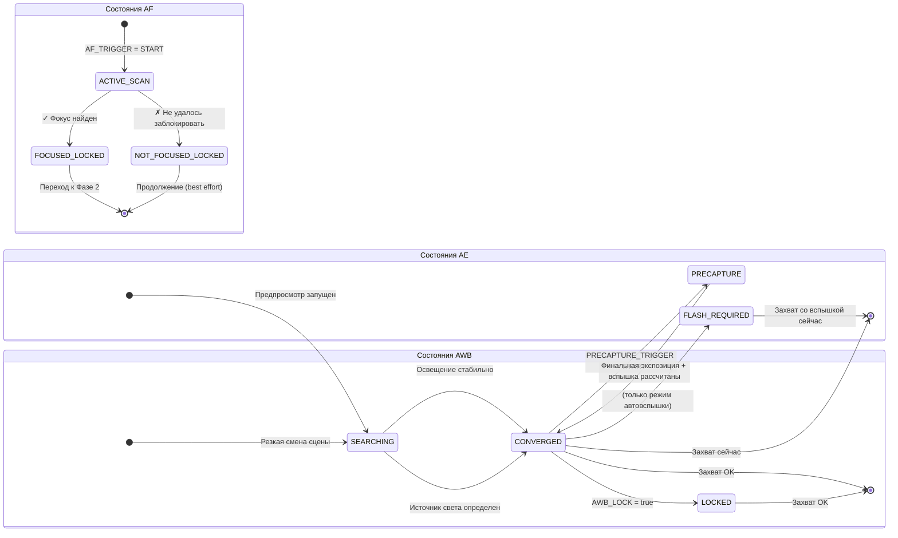

# Глава 17: Конвейер 3A

Мы изучили **AE** (автоэкспозиция, главы 13–14), **AF** (автофокус, глава 15) и **AWB** (автоматический баланс белого, глава 16) как независимые системы. Настоящие приложения для фотосъемки должны координировать работу всех трех систем перед каждым нажатием кнопки затвора — при этом *порядок и время* имеют огромное значение.

Наивная реализация, которая вызывает `capture()` сразу после того, как пользователь нажимает кнопку затвора, дает нестабильные результаты: иногда фокус есть, иногда нет; иногда вспышка срабатывает, иногда нет; иногда AWB в процессе настройки дает фотографии с зеленым оттенком. Надежный конвейер 3A устраняет все эти проблемы.

Реализация конвейера 3A в этой главе идентична потоку, используемому внутри приложения [Android Camera Parameters](https://github.com/zoozooll/AndroidCameraParameters), и последовательности, описанной в документах по архитектуре Android Camera и статьях CSDN по профессиональной разработке с использованием Camera2.

---

## Полная последовательность координации 3A (Обзор)

Прежде чем погрузиться в каждую подсистему, давайте визуализируем полный поток состояний. Это реальная производственная последовательность, а не упрощение.

```mermaid
sequenceDiagram
    actor User
    participant App as CaptureController
    participant HAL as Camera2 HAL
    participant AE as AE Engine
    participant AF as AF Engine
    participant AWB as AWB Engine

    User->>App: Нажимает кнопку "Захват"
    App->>HAL: Установить AF_MODE = AUTO (или MACRO)
    App->>HAL: CONTROL_AF_TRIGGER = START
    Note over HAL,AF: Запуск сканирования фокуса

    loop Каждый кадр предпросмотра
        HAL-->>App: CaptureResult
        App->>App: Проверка AF_STATE
    end

    AF-->>HAL: Фокус заблокирован
    HAL-->>App: AF_STATE = FOCUSED_LOCKED ✓
    Note over App,AE: Фокус стабилен → переход к предварительному захвату AE

    App->>HAL: CONTROL_AE_PRECAPTURE_TRIGGER = START
    Note over HAL,AE: Замер экспозиции перед захватом<br/>(если режим вспышки требует, срабатывает<br/>предварительная вспышка для замера)

    loop Каждый кадр предпросмотра
        HAL-->>App: CaptureResult
        App->>App: Проверка AE_STATE и FLASH_STATE
    end

    AE-->>HAL: AE сошлась; окончательная экспозиция определена
    HAL-->>App: AE_STATE = CONVERGED (+ FLASH_STATE = READY, если нужно) ✓
    AWB-->>HAL: AWB_STATE = CONVERGED (обычно уже выполнено)
    Note over App: Все 3A сошлись! МОЖНО ДЕЛАТЬ СНИМОК

    App->>HAL: Запрос на захват фото (TEMPLATE_STILL_CAPTURE)
    HAL->>HAL: Срабатывание основной вспышки, если нужно
    HAL->>HAL: Экспонирование сенсора, чтение кадра
    HAL-->>App: Кадр JPEG / RAW доставлен через ImageReader

    App->>HAL: CONTROL_AF_TRIGGER = CANCEL
    App->>HAL: CONTROL_AE_PRECAPTURE_TRIGGER = IDLE
    App->>HAL: Восстановить AF_MODE = CONTINUOUS_PICTURE
    Note over App,HAL: Очистка: предпросмотр возобновляет обычную автонастройку
```

**Каждый шаг является блокирующим.** Вы не переходите к шагу N+1, пока HAL не подтвердит состояние, требуемое на шаге N. Никогда не пропускайте шаги — именно так выпускаются приложения с периодическим нечетким фокусом, плохой экспозицией со вспышкой или фотографиями с синим оттенком.

---

## Глубокое погружение в AE (автоэкспозицию)

AE является самой сложной из трех "A", так как она включает в себя не только затвор + ISO, но и **замер вспышки**, а также **триггер предварительного захвата**.

### Режимы AE: CONTROL_AE_MODE

| Режим | Поведение | Поддержка вспышки |
|------|----------|--------------|
| `OFF` | Полностью ручной (описано в главе 14) | Нет |
| `ON` | Автоэкспозиция, **вспышка отключена** | Нет |
| `ON_AUTO_FLASH` | Автоэкспозиция, **автоматическая вспышка** — HAL включает вспышку только при слабом освещении | Авто (самый частый выбор) |
| `ON_ALWAYS_FLASH` | Автоэкспозиция, **вспышка всегда включена** (заполняющая вспышка для портретов против света) | Всегда |
| `ON_AUTO_FLASH_REDEYE` | Автоэкспозиция + вспышка + подавление эффекта красных глаз | Авто + красные глаза |
| `ON_EXTERNAL_FLASH` | Внешняя вспышка аксессуара камеры | Только внешняя (редко) |

**По умолчанию для обычного приложения камеры** используется `ON_AUTO_FLASH`. Пользователи ожидают, что телефон «знает», когда нужно включить вспышку.

### Состояния AE и триггер предварительного захвата

Как и AF, AE сообщает о своем состоянии через `CaptureResult.CONTROL_AE_STATE`:

| Состояние | Значение |
|-------|---------|
| `INACTIVE` (0) | AE отключена или еще не запущена |
| `SEARCHING` (1) | Активный поиск правильной экспозиции |
| `CONVERGED` (2) | Экспозиция стабильна. В режимах со вспышкой это означает, что *фоновая* экспозиция сошлась, но предварительный замер вспышки еще не проводился. |
| `LOCKED` (3) | Экспозиция явно заблокирована через `CONTROL_AE_LOCK = true` |
| `FLASH_REQUIRED` (4) | Сошлась на фоне, и HAL решил, что **нужна вспышка** для правильного снимка |
| `PRECAPTURE` (5) | **Ключевое состояние.** Выполняется замер перед захватом — HAL проводит замер (выпуская импульсы предвспышки, если нужна вспышка) для расчета окончательной экспозиции кадра + мощности вспышки. |

### Почему триггер предварительного захвата важен

Движок AE, работающий на кадрах предпросмотра, дает *приблизительные* значения. Конвейер предпросмотра использует меньшие буферы, обработку с меньшей разрядностью и не учитывает огромный вклад света от основной вспышки, срабатывающей во время съемки.

`CONTROL_AE_PRECAPTURE_TRIGGER = START` сообщает HAL:

> «Я собираюсь сделать реальное фото. Перестань выдавать приблизительные значения. Запусти конвейер замера с полной точностью. Если я нахожусь в режиме автовспышки, сделай один или несколько маломощных предварительных импульсов, измерь отражение и рассчитай точные значения затвора/ISO/мощности вспышки для захвата кадра».

**Пропуск предварительного захвата = фотографии со вспышкой будут случайно переэкспонированы или недоэкспонированы.** У HAL просто не было возможности измерить свет от вспышки в реальном времени.

### Области AE (Точечный замер)

Так же, как `CONTROL_AF_REGIONS` для фокусировки, `CONTROL_AE_REGIONS` указывает, *в какой части сцены* проводить замер. Нажатие для фокусировки на портрете должно одновременно применять ту же область к AE — лицо получает приоритет и по фокусу, И по экспозиции, а не замеряется по яркому небу на фоне.

```kotlin
// Используйте ОДИН И ТОТ ЖЕ массив MeteringRectangle для областей AF и AE
val focusWeightedRegions = arrayOf(userTapRegion)
builder.set(CaptureRequest.CONTROL_AF_REGIONS, focusWeightedRegions)
builder.set(CaptureRequest.CONTROL_AE_REGIONS, focusWeightedRegions)
```

**Вес:** Каждый `MeteringRectangle` имеет `weight` (0–1000). Области с большим весом сильнее влияют на замер. Режим «точечного замера» использует один прямоугольник с большим весом (1000). «Матричный / оценочный» замер использует множество прямоугольников с низким весом, распределенных по кадру.

---

## AWB: Тихий партнер трио

AWB обычно сходится рано и остается стабильным в большинстве сцен — поэтому о нем часто думают в последнюю очередь. Но его вклад в точность цветопередачи критически важен, и он *может* все еще находиться в поиске, когда вы будете готовы к съемке.

### Резюме состояний AWB

| Состояние AWB | Решение о захвате |
|-----------|------------------|
| `INACTIVE` (AWB_MODE = OFF) | Можно продолжать (ручное усиление) |
| `SEARCHING` | **Ждать.** Цвета могут измениться. Обычно < 500 мс после резкой смены сцены. |
| `CONVERGED` | ✅ Идеально — можно продолжать |
| `LOCKED` | ✅ Также идеально — явно заблокировано через `CONTROL_AWB_LOCK = true` |

### Связывание блокировок AWB с AE/AF

Для критически важной студийной или предметной съемки заблокируйте все три параметра *перед* захватом:

```kotlin
// В запросе на захват фото (не раньше — нам нужны заблокированные финальные сошедшиеся значения)
builder.set(CaptureRequest.CONTROL_AWB_LOCK, true)
builder.set(CaptureRequest.CONTROL_AE_LOCK, true)
// AF остается заблокированным, так как мы запустили его ранее и не отменили
```

Это гарантирует, что при основном захвате используется *точно такой же* профиль цвета/wb, который использовался в последнем кадре предварительного замера AE.

---

## Полный производственный контроллер захвата 3A (Kotlin)

Теперь давайте соберем все это в один переиспользуемый класс. Эта реализация соответствует потоку координации в документах по архитектуре Android Camera (раздел «3A Control Pipeline») и паттернам, рекомендованным в серии CSDN по Android Camera.

```kotlin
class ThreeACaptureController(
    private val characteristics: CameraCharacteristics,
    private val captureSession: CameraCaptureSession,
    private val previewSurface: Surface,
    private val jpegReaderSurface: Surface,
    private val mainHandler: Handler
) {
    // ----------- Публичный API -----------
    interface CaptureListener {
        fun onCaptureStarted() {}
        fun onCaptureSuccess(jpegBytes: ByteArray)
        fun onCaptureError(reason: String)
    }

    /**
     * Координация полной последовательности захвата 3A:
     * Триггер AF → Фокус заблокирован → Предварительный захват AE → AE сошлась → Захват фото → Очистка
     */
    fun captureStillPhoto(
        aeMode: Int = CameraMetadata.CONTROL_AE_MODE_ON_AUTO_FLASH,
        listener: CaptureListener
    ) {
        this.listener = listener
        listener.onCaptureStarted()
        beginPhase1_AfTrigger(aeMode)
    }

    // ----------- Внутреннее состояние -----------
    private var listener: CaptureListener? = null
    private var timeoutRunnable: Runnable? = null
    private var phase: Int = 0
    private lateinit var currentAeMode: Int

    private val SESSION_TIMEOUT_MS = 3500L  // Бюджетным телефонам нужно до 3 секунд

    // ---- ФАЗА 1: Запуск AF, ожидание FOCUSED_LOCKED ----
    private fun beginPhase1_AfTrigger(aeMode: Int) {
        currentAeMode = aeMode
        phase = 1

        val request = captureSession.device.createCaptureRequest(
            CameraDevice.TEMPLATE_PREVIEW
        ).apply {
            addTarget(previewSurface)

            set(CaptureRequest.CONTROL_AF_MODE,
                CameraMetadata.CONTROL_AF_MODE_AUTO)
            set(CaptureRequest.CONTROL_AE_MODE, aeMode)
            set(CaptureRequest.CONTROL_AWB_MODE,
                CameraMetadata.CONTROL_AWB_MODE_AUTO)

            // Запуск однократного сканирования AF
            set(CaptureRequest.CONTROL_AF_TRIGGER,
                CameraMetadata.CONTROL_AF_TRIGGER_START)
        }

        startTimeout("AF scan")
        captureSession.setRepeatingRequest(request.build(), captureCallback, mainHandler)
    }

    // ---- ФАЗА 2: AF заблокирован. Запуск триггера предварительного захвата AE ----
    private fun beginPhase2_AePrecapture() {
        phase = 2
        val request = captureSession.device.createCaptureRequest(
            CameraDevice.TEMPLATE_PREVIEW
        ).apply {
            addTarget(previewSurface)

            // Держим AF заблокированным — НЕ отменяйте триггер AF пока что!
            set(CaptureRequest.CONTROL_AF_MODE,
                CameraMetadata.CONTROL_AF_MODE_AUTO)
            // AF_TRIGGER остается в состоянии START с Фазы 1

            set(CaptureRequest.CONTROL_AE_MODE, currentAeMode)

            // ---- КРИТИЧЕСКАЯ СТРОКА: Запуск Precapture ----
            set(CaptureRequest.CONTROL_AE_PRECAPTURE_TRIGGER,
                CameraMetadata.CONTROL_AE_PRECAPTURE_TRIGGER_START)

            set(CaptureRequest.CONTROL_AWB_MODE,
                CameraMetadata.CONTROL_AWB_MODE_AUTO)
        }

        restartTimeout("AE precapture")
        captureSession.setRepeatingRequest(request.build(), captureCallback, mainHandler)
    }

    // ---- ФАЗА 3: AE сошлась + AWB сошлась. Выполнение реального захвата фото. ----
    private fun beginPhase3_StillCapture() {
        phase = 3
        cancelTimeout()

        val request = captureSession.device.createCaptureRequest(
            CameraDevice.TEMPLATE_STILL_CAPTURE
        ).apply {
            addTarget(previewSurface)
            addTarget(jpegReaderSurface)

            // Держим AF заблокированным до завершения захвата
            set(CaptureRequest.CONTROL_AF_MODE,
                CameraMetadata.CONTROL_AF_MODE_AUTO)

            set(CaptureRequest.CONTROL_AE_MODE, currentAeMode)

            // Блокируем AE и AWB для захвата фото, чтобы предотвратить дрейф последнего кадра
            set(CaptureRequest.CONTROL_AE_LOCK, true)
            set(CaptureRequest.CONTROL_AWB_LOCK, true)

            set(CaptureRequest.CONTROL_AWB_MODE,
                CameraMetadata.CONTROL_AWB_MODE_AUTO)

            set(CaptureRequest.JPEG_QUALITY, 95)
            // Ориентация JPEG: используйте поворот дисплея для правильной ориентации
            val jpegOrient = computeJpegOrientation()
            set(CaptureRequest.JPEG_ORIENTATION, jpegOrient)
        }

        captureSession.capture(request.build(), object : CameraCaptureSession.CaptureCallback() {
            override fun onCaptureCompleted(
                session: CameraCaptureSession,
                request: CaptureRequest,
                result: TotalCaptureResult
            ) {
                super.onCaptureCompleted(session, request, result)
                // OnImageAvailableListener в ImageReader обработает сохранение байтов
                // Теперь очистка: сброс обратно в нормальный режим предпросмотра
                resetToContinuousPreview()
            }
        }, mainHandler)
    }

    // ---- Очистка: Возобновление нормального непрерывного предпросмотра ----
    private fun resetToContinuousPreview() {
        phase = 0
        val request = captureSession.device.createCaptureRequest(
            CameraDevice.TEMPLATE_PREVIEW
        ).apply {
            addTarget(previewSurface)
            set(CaptureRequest.CONTROL_AF_MODE,
                CameraMetadata.CONTROL_AF_MODE_CONTINUOUS_PICTURE)
            set(CaptureRequest.CONTROL_AE_MODE, currentAeMode)
            set(CaptureRequest.CONTROL_AWB_MODE,
                CameraMetadata.CONTROL_AWB_MODE_AUTO)

            // Снятие всех блокировок и отмена всех триггеров
            set(CaptureRequest.CONTROL_AF_TRIGGER,
                CameraMetadata.CONTROL_AF_TRIGGER_CANCEL)
            set(CaptureRequest.CONTROL_AE_PRECAPTURE_TRIGGER,
                CameraMetadata.CONTROL_AE_PRECAPTURE_TRIGGER_IDLE)
            set(CaptureRequest.CONTROL_AE_LOCK, false)
            set(CaptureRequest.CONTROL_AWB_LOCK, false)
        }
        captureSession.setRepeatingRequest(request.build(), null, mainHandler)
    }

    // ----------- Основной обратный вызов: Управляет всеми 3 фазами через проверку состояния -----------
    private val captureCallback = object : CameraCaptureSession.CaptureCallback() {
        override fun onCaptureCompleted(
            session: CameraCaptureSession,
            request: CaptureRequest,
            result: TotalCaptureResult
        ) {
            val afState = result.get(CaptureResult.CONTROL_AF_STATE)
            val aeState = result.get(CaptureResult.CONTROL_AE_STATE)
            val awbState = result.get(CaptureResult.CONTROL_AWB_STATE)

            when (phase) {
                1 -> {
                    // ---- ФАЗА 1: Ожидание блокировки AF ----
                    when (afState) {
                        CaptureResult.CONTROL_AF_STATE_FOCUSED_LOCKED -> {
                            Log.d("3A", "✓ AF FOCUSED_LOCKED — переход к AE precapture")
                            beginPhase2_AePrecapture()
                        }
                        CaptureResult.CONTROL_AF_STATE_NOT_FOCUSED_LOCKED -> {
                            Log.w("3A", "⚠ AF NOT_FOCUSED_LOCKED — продолжаем все равно (фокус может быть мягким)")
                            beginPhase2_AePrecapture()
                        }
                        // ACTIVE_SCAN / PASSIVE_SCAN → продолжаем ждать
                    }
                }
                2 -> {
                    // ---- ФАЗА 2: Ожидание схождения AE после предварительного захвата ----
                    // Принимаем состояния, означающие «AE завершила предварительный захват и готова к съемке»
                    val aeReady = (aeState == CaptureResult.CONTROL_AE_STATE_CONVERGED
                                || aeState == CaptureResult.CONTROL_AE_STATE_LOCKED
                                || aeState == CaptureResult.CONTROL_AE_STATE_FLASH_REQUIRED)
                    val awbReady = (awbState == CaptureResult.CONTROL_AWB_STATE_CONVERGED
                                 || awbState == CaptureResult.CONTROL_AWB_STATE_LOCKED
                                 || awbState == CaptureResult.CONTROL_AWB_STATE_INACTIVE)

                    if (aeReady && awbReady) {
                        Log.d("3A", "✓ AE=$aeState, AWB=$awbState — выполнение захвата")
                        beginPhase3_StillCapture()
                    }
                }
            }
        }
    }

    // ----------- Защита по таймауту: Никогда не зависать, если HAL не сообщает о схождении -----------
    private fun startTimeout(phaseName: String) {
        cancelTimeout()
        timeoutRunnable = Runnable {
            Log.w("3A", "⏱ Таймаут ожидания $phaseName — продолжаем, как есть")
            when (phase) {
                1 -> beginPhase2_AePrecapture()  // Продолжаем с наилучшим возможным фокусом
                2 -> beginPhase3_StillCapture()  // Продолжаем с наилучшей возможной экспозицией
            }
        }
        mainHandler.postDelayed(timeoutRunnable!!, SESSION_TIMEOUT_MS)
    }
    private fun restartTimeout(phaseName: String) = startTimeout(phaseName)
    private fun cancelTimeout() {
        timeoutRunnable?.let { mainHandler.removeCallbacks(it) }
        timeoutRunnable = null
    }

    // ----------- Утилита: Корректная ориентация JPEG на основе поворота дисплея -----------
    private fun computeJpegOrientation(): Int {
        val sensorOrient = characteristics.get(
            CameraCharacteristics.SENSOR_ORIENTATION
        ) ?: 0
        // Объедините с Display.rotation (0, 90, 180, 270) из вашей Activity
        // Типичная реализация: return (sensorOrient + displayRotationDegrees) % 360
        return sensorOrient  // Упрощено; привяжите к повороту вашего дисплея
    }
}
```

### Как использовать контроллер

```kotlin
// Внутри слушателя клика по кнопке захвата вашего CameraFragment
val controller = ThreeACaptureController(
    characteristics = yourCameraCharacteristics,
    captureSession = yourActiveSession,
    previewSurface = previewView.surface,
    jpegReaderSurface = jpegImageReader.surface,
    mainHandler = yourCameraHandler
)

controller.captureStillPhoto(
    aeMode = CameraMetadata.CONTROL_AE_MODE_ON_AUTO_FLASH
) {
    override fun onCaptureSuccess(jpegBytes: ByteArray) {
        lifecycleScope.launch(Dispatchers.IO) {
            val file = File(requireContext().filesDir, "photo_${System.currentTimeMillis()}.jpg")
            file.writeBytes(jpegBytes)
            withContext(Dispatchers.Main) {
                Toast.makeText(requireContext(), "Сохранено: ${file.name}", Toast.LENGTH_SHORT).show()
            }
        }
    }
    override fun onCaptureError(reason: String) {
        Toast.makeText(requireContext(), "Ошибка захвата: $reason", Toast.LENGTH_LONG).show()
    }
}
```

### Связывание с ImageReader

Не забудьте настроить `OnImageAvailableListener` на вашем JPEG `ImageReader`, чтобы фактически передать `jpegBytes` слушателю. Приведенный выше контроллер предполагает, что вы это уже сделали:

```kotlin
// Настройте это при создании ImageReader (см. главу о захвате)
jpegImageReader.setOnImageAvailableListener({ reader ->
    val image = reader.acquireLatestImage() ?: return@setOnImageAvailableListener
    image.use {
        val buffer = it.planes[0].buffer
        val bytes = ByteArray(buffer.remaining())
        buffer.get(bytes)
        // Передача байтов в UI / сохранение в файл
        lastCaptureListener?.onCaptureSuccess(bytes)
    }
}, mainHandler)
```

---

## Нюансы обработки, специфичные для вспышки

Для режимов `ON_AUTO_FLASH` / `ON_ALWAYS_FLASH` / `ON_AUTO_FLASH_REDEYE` триггер предварительного захвата запускает импульсы предвспышки. Две важные детали:

1. **Видимость импульса предвспышки:** Предвспышки — это *реальные вспышки*. Пользователь видит их как вспышку низкой яркости перед основной вспышкой. Большинство современных интерфейсов камер скрывают это анимацией «кнопки затвора» или затемнением предпросмотра.

2. **Состояние FLASH_STATE должно быть READY:** В дополнение к `AE_STATE = CONVERGED`, перед захватом в режимах со вспышкой убедитесь, что `CaptureResult.FLASH_STATE = FLASH_STATE_READY` (или `FIRED`). Вполне возможно, что AE сошлась, но конденсатор заряда вспышки все еще заряжается.

```kotlin
// Улучшенная проверка aeReady внутри обратного вызова Фазы 2 для режимов со вспышкой:
val aeState = result.get(CaptureResult.CONTROL_AE_STATE)
val flashState = result.get(CaptureResult.FLASH_STATE)

val flashModeWantsFlash = (currentAeMode == CameraMetadata.CONTROL_AE_MODE_ON_ALWAYS_FLASH ||
                          (currentAeMode == CameraMetadata.CONTROL_AE_MODE_ON_AUTO_FLASH &&
                           aeState == CaptureResult.CONTROL_AE_STATE_FLASH_REQUIRED))

val aeReady = when {
    flashModeWantsFlash -> {
        // HAL должен иметь и AE сошедшейся, И вспышку готовой к срабатыванию
        (aeState == CaptureResult.CONTROL_AE_STATE_CONVERGED
         || aeState == CaptureResult.CONTROL_AE_STATE_FLASH_REQUIRED) &&
        (flashState == CaptureResult.FLASH_STATE_READY
         || flashState == CaptureResult.FLASH_STATE_FIRED)
    }
    else -> {
        // Режим без вспышки: обычного схождения AE достаточно
        (aeState == CaptureResult.CONTROL_AE_STATE_CONVERGED
         || aeState == CaptureResult.CONTROL_AE_STATE_LOCKED)
    }
}
```

---

## Машина перехода состояний 3A (Суммарная диаграмма)

Для быстрой справки при отладке ниже приведена комбинированная диаграмма состояний AE, AF и AWB, показывающая ожидаемые переходы во время успешного захвата.



Глобальный контроллер переходит к захвату фото только тогда, когда финальное состояние «захват OK» достигнуто одновременно во всех трех подсостояниях.

---

## Устранение неполадок в конвейере 3A

| Симптом | Основная причина | Исправление |
|---------|-----------|-----|
| Фотографии со вспышкой случайно недо/переэкспонированы | Пропущен `AE_PRECAPTURE_TRIGGER = START` | Всегда запускайте предварительный захват перед съемкой в любом режиме со вспышкой |
| Каждая 5–10 фотография слегка нечеткая | Захват выполнен до `FOCUSED_LOCKED` | Блокируйте состояние AF (наш контроллер это делает) |
| Камера зависает на секунды, затем вылетает | Нет таймаута; HAL застрял в SEARCHING навсегда | Добавьте таймаут 3500 мс + откат к best-effort, как показано |
| Вспышка срабатывает, но фото все равно темное | Захват выполнен до `FLASH_STATE = READY` | Зарядка конденсатора; добавьте проверку FLASH_STATE в условие готовности AE |
| Портрет человека против света недоэкспонирован | AE замерила небо, а не лицо | Свяжите `CONTROL_AE_REGIONS` с тем же прямоугольником нажатия, что и `CONTROL_AF_REGIONS` |
| Сдвиг цветового оттенка на 2° между кадрами в серии | Забыли `AWB_LOCK = true` перед серией захватов | Заблокируйте AWB на первом кадре схождения; держите заблокированным на протяжении всей серии |
| Последовательность захвата заметно медленная на бюджетном телефоне | `TEMPLATE_STILL_CAPTURE` запускает «холодный» конвейер | Сначала «прогрейте» конвейер с помощью фиктивного `TEMPLATE_PREVIEW` с идентичными настройками AE/AF |

---

## Резюме

Эта глава объединила экспозицию, фокус и баланс белого в единый надежный **конвейер захвата 3A** — именно ту последовательность, которую профессиональное приложение камеры использует для каждого нажатия кнопки затвора:

1. **Фаза 1 (AF):** Установить `AF_MODE = AUTO` + `AF_TRIGGER = START`. Ждать до `AF_STATE = FOCUSED_LOCKED` (или `NOT_FOCUSED_LOCKED` как запасной вариант).
2. **Фаза 2 (AE Precapture):** Установить `AE_PRECAPTURE_TRIGGER = START`. Ждать `AE_STATE = CONVERGED` / `FLASH_REQUIRED` И `FLASH_STATE = READY` (если режимы со вспышкой). Также требовать `AWB_STATE = CONVERGED`.
3. **Фаза 3 (Захват фото):** Отправить `TEMPLATE_STILL_CAPTURE` с `AE_LOCK = true`, `AWB_LOCK = true`.
4. **Фаза 4 (Очистка):** Отменить все триггеры, снять все блокировки, восстановить `AF_MODE = CONTINUOUS_PICTURE`.

Критические вспомогательные концепции:
- **Режимы AE:** `ON_AUTO_FLASH` — разумный выбор по умолчанию для потребительских приложений.
- **Области AE** = точечный замер; всегда связывайте их с областями AF при фокусировке по нажатию.
- **AWB сходится быстро**, но всегда блокируйте выполнение на `CONVERGED` или `LOCKED` для работы, критичной к цвету.
- **Таймауты не подлежат обсуждению.** Бюджетные телефоны и плохое освещение могут заставить AF/AE сканировать бесконечно; всегда продолжайте работу с откатом «как есть» через ~3,5 с.

## Что дальше

Поздравляем с завершением модуля ручной фотографии 3A. Теперь вы на профессиональном уровне понимаете, как управлять:

- **Экспозицией (гл. 13–14):** треугольник экспозиции, ISO + затвор, преобразование наносекунд, ручное переопределение, длительная экспозиция, блокировка таймлапса, брекетинг.
- **Фокусом (гл. 15):** режимы AF, конечный автомат AF, однократный запуск и захват, ручные диоптрии фокуса, пресеты гиперфокального расстояния, области фокусировки по касанию.
- **Цветом (гл. 16):** цветовая температура, пресеты AWB, ручное усиление COLOR_CORRECTION_GAINS, матрицы преобразования CCM 3×3, реализация слайдера Кельвина.
- **Координацией (гл. 17):** полный конвейер 3A с предварительным захватом, безопасным для вспышки схождением AE, таймаутами для каждой фазы, блокировкой и очисткой.

Теперь вы можете создать полноценное приложение камеры профессионального уровня, которое не уступает возможностям самого приложения [Android Camera Parameters](https://github.com/zoozooll/AndroidCameraParameters)!

В следующих главах мы переключимся с **управления** захватом на **качество** захвата — рассмотрим захват в RAW, сохранение в DNG, многокадровую обработку, HDR и методы вычислительной фотографии, которые опираются на освоенный вами конвейер 3A.
