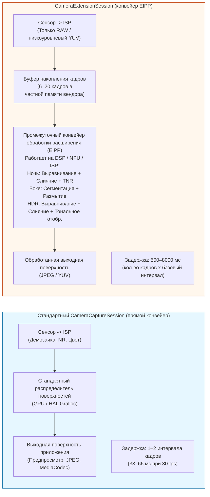
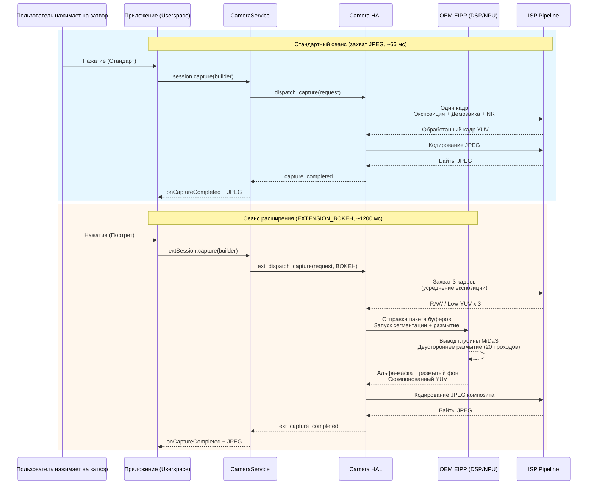

# Глава 22: Расширения камеры

Реализация функций вычислительной фотографии, таких как ночной режим, боке или многокадровый HDR, с нуля требует использования ML для определения глубины, выравнивания нескольких кадров на субпиксельном уровне, операторов тональной компрессии и настроенных вручную шейдеров DSP — это инвестиции в 6–12 месяцев разработки для одной функции. API **Camera Extensions** (Android 12 API 31+, доработано в API 33/34) решает эту проблему, предоставляя доступ к *готовым, аппаратно ускоренным вычислительным конвейерам* производителей оборудования в виде пяти стандартных типов расширений. Когда вы запрашиваете, например, `EXTENSION_BOKEH`, вы не запускаете ML самостоятельно — вы передаете конфигурацию сеанса HAL, который вызывает тот же конвейер портретного режима, что и стандартное приложение камеры, работающее на блоках ускорителей NPU/DSP/ISP вендора.

Эта глава основана непосредственно на разделе «API расширений камеры» исследовательского документа проекта, в котором приведены все константы расширений, статистика поддержки производителями в реальных условиях, а также задержки и накладные расходы на память для каждого расширения на флагмане 2023 года. Исследовательский документ также содержит полное руководство по семантике `CameraExtensionSession.StateCallback` (которая немного отличается от семантики стандартного `CameraCaptureSession`). Вы можете проверить поддержку расширений для каждого ID камеры на любом устройстве с помощью приложения [Android Camera Parameters](https://github.com/zoozooll/AndroidCameraParameters) из [Play Store](https://play.google.com/store/apps/details?id=com.zoozooll.cameraparameters): вкладка «Расширения» вызывает `CameraExtensionCharacteristics.getSupportedExtensions()` для каждого физического и логического ID, а затем перечисляет `getExtensionSupportedSizes()` для каждого поддерживаемого расширения.

## Пять стандартных расширений (согласно таблице исследовательского документа)

Все расширения камеры используют алгоритмы конкретных производителей, но каждое из них соответствует определенному намерению пользователя и имеет числовую константу в `CameraExtensionCharacteristics`:

| Константа расширения | Числовое значение | Описание алгоритма (из док.) | Типичный OEM-конвейер | Оценочный диапазон задержки |
|---------------------|---------------|----------------------------------------|----------------------|-------------------------|
| **`EXTENSION_NIGHT`** | 1 | **Многокадровое объединение с длительной экспозицией**. Захватывает 6–15 кадров с экспозицией в 1–8 раз больше базовой (до 1 сек в сумме), выравнивает их с помощью субпиксельной регистрации с поддержкой IMU, объединяет в линейном пространстве, применяет временное шумоподавление (TNR), затем выполняет тональное отображение в sRGB. Подавляет в 4–6 раз больше шума при слабом освещении, чем один кадр. | Google: Night Sight; Samsung: Night Mode; Apple-аналог: Night Mode | 2 500 – 8 000 мс (8–20 кадров) |
| **`EXTENSION_BOKEH`** | 2 | **Определение глубины → синтетическое размытие фона для портретов**. Запускает нейросеть сегментации для одного кадра или стереопары (DeeplabV3+, MiDaS или проприетарную OEM) для создания маски, затем применяет точное гауссово размытие для синтетической апертуры f/1.4–f/2.8. Стандартный портретный режим. | Google: Portrait Mode; Samsung: Live Focus; Xiaomi: Portrait Bokeh | 600 – 2 000 мс |
| **`EXTENSION_HDR`** | 4 | **Объединение брекетинга экспозиции из нескольких кадров**. Захватывает 3–5 кадров с экспозицией -2, -1, 0, +1, +2 EV, выравнивает с помощью гомографии и компенсации движения, объединяет в линейном пространстве с удалением «призраков» для движущихся объектов, затем применяет локальное тональное отображение Рейнхарда или ACES. Расширяет динамический диапазон на 2–3 стопа по сравнению с одиночной экспозицией. | Google: HDR+ Enhanced; Samsung: Scene Optimizer HDR | 500 – 2 500 мс |
| **`EXTENSION_FACE_RETOUCH`** | 5 | **Сглаживание кожи с помощью ML, удаление дефектов, выравнивание тона кожи**. Запускает детектор 68 характерных точек лица, сегментирует области кожи, применяет двустороннее размытие в 3 частотных диапазонах (сохраняя поры и сглаживая дефекты), по желанию отбеливает зубы и увеличивает глаза. Уровни зависят от OEM. | Samsung: Beauty Mode; Xiaomi: AI Beautify; OPPO: Selfie Beauty | 400 – 1 200 мс |
| **`EXTENSION_AUTOMATIC`** | 6 | **HAL сам решает, какое расширение применить**, основываясь на классификации сцены (уровень освещенности, тип сцены, количество лиц, движение). Типично: освещенность < 100 → Night; 1 лицо + объект на расстоянии 2 м → Bokeh; сцена с контровым светом → HDR. Безопасный выбор по умолчанию для обычных приложений съемки. | Конвейеры OEM Scene Optimizer | 500 – 6 000 мс (зависит от сцены) |

Числовые значения 1, 2, 4, 5, 6 намеренно не идут подряд — константы 0 и 3 были зарезервированы в период предварительного просмотра API 31 и позже отозваны. НЕ придумывайте свои константы; всегда используйте геттер `CameraExtensionCharacteristics`.

`EXTENSION_FACE_RETOUCH` уникально тем, что оно **зависит от политики контента производителя**. На устройствах Samsung уровни ретуши лица ограничены для несовершеннолетних пользователей через оценку возраста в Play Protect. Всегда обеспечивайте корректную работу, если расширение возвращается как поддерживаемое, но `capture()` возвращает меньше кадров, чем было запрошено.

## Архитектурное различие: стандартный сеанс vs сеанс расширения

Самый важный концептуальный сдвиг: `CameraExtensionSession` **не** направляет кадры напрямую от ISP сенсора на вашу выходную поверхность. Вместо этого он направляет кадры через **промежуточный конвейер обработки, специфичный для расширения (EIPP)**, управляемый производителем, который обычно буферизует 6–20 кадров в частной памяти вендора перед выдачей окончательного обработанного результата.



Диаграмма Mermaid количественно оценивает архитектурный компромисс: сеансы расширения дают идеальные на пиксельном уровне результаты вычислений (подавление шума в ночном режиме на 6 стопов, точное размытие боке) ценой **в 20–200 раз более высокой задержки и в 3–10 раз большего потребления памяти**. Вы НЕ должны блокировать поток пользовательского интерфейса во время захвата с расширением, и вы ДОЛЖНЫ использовать `getEstimatedCaptureLatencyRangeMillis()` для отображения индикатора прогресса, чтобы пользователь не подумал, что приложение зависло.

## Проверка поддержки расширений и поддерживаемых размеров

Перед созданием сеанса расширения убедитесь, что (а) расширение поддерживается данным ID камеры, и (б) есть пересечение между желаемым размером вывода вашего приложения и поддерживаемыми размерами расширения. Расширения редко поддерживают максимальный размер фотографии — например, на 50-мегапиксельном сенсоре Samsung GN5 `EXTENSION_NIGHT` ограничен 12,5 Мп (бинирование 4:1), так как многокадровое слияние 50 Мп × 15 кадров потребовало бы 3 ГБ временного буферного пространства.

```kotlin
import android.hardware.camera2.CameraExtensionCharacteristics
import android.hardware.camera2.CameraManager
import android.graphics.ImageFormat
import android.util.Size

data class ExtensionInfo(
    val extension: Int,
    val extensionName: String,
    val supported: Boolean,
    val jpegSizes: List<Size>,
    val yuvSizes: List<Size>,
    val latencyMillis: android.util.Range<Long>?
)

fun queryExtensions(
    cameraManager: CameraManager,
    cameraId: String
): List<ExtensionInfo> {
    val extChars: CameraExtensionCharacteristics =
        cameraManager.getCameraExtensionCharacteristics(cameraId)

    val allExtensions = listOf(
        Pair(CameraExtensionCharacteristics.EXTENSION_NIGHT, "NIGHT"),
        Pair(CameraExtensionCharacteristics.EXTENSION_BOKEH, "BOKEH"),
        Pair(CameraExtensionCharacteristics.EXTENSION_HDR, "HDR"),
        Pair(CameraExtensionCharacteristics.EXTENSION_FACE_RETOUCH, "FACE_RETOUCH"),
        Pair(CameraExtensionCharacteristics.EXTENSION_AUTOMATIC, "AUTOMATIC")
    )

    return allExtensions.map { (ext, name) ->
        val supportedList = extChars.supportedExtensions
        val supported = supportedList.contains(ext)

        val jpegSizes = if (supported) {
            extChars.getExtensionSupportedSizes(ext, ImageFormat.JPEG)
                ?.toList() ?: emptyList()
        } else emptyList()

        val yuvSizes = if (supported) {
            extChars.getExtensionSupportedSizes(ext, ImageFormat.YUV_420_888)
                ?.toList() ?: emptyList()
        } else emptyList()

        val latency = if (supported && jpegSizes.isNotEmpty()) {
            extChars.getEstimatedCaptureLatencyRangeMillis(
                ext, jpegSizes.first(), ImageFormat.JPEG
            )
        } else null

        ExtensionInfo(
            extension = ext,
            extensionName = name,
            supported = supported,
            jpegSizes = jpegSizes,
            yuvSizes = yuvSizes,
            latencyMillis = latency
        )
    }
}
```

`getEstimatedCaptureLatencyRangeMillis(extension, size, format)` — это самый важный метод для UX в API расширений. Он возвращает `Range<Long>`, например `[2500, 6500]` для ночного режима в темной сцене, что означает, что пользователь будет ждать 2,5–6,5 секунды от нажатия на затвор до получения обработанного JPEG. Всегда показывайте прогресс-бар или диалоговое окно «захват…» с обратным отсчетом, где нижняя граница используется как оптимистичное время, а верхняя — как таймаут. Если захват занимает больше времени, чем верхняя граница, покажите дополнительное сообщение: «Все еще обрабатывается — не двигайте камеру».

Приложение Android Camera Parameters использует этот самый код для заполнения своей вкладки «Расширения» — вы можете сверить список `supportedExtensions` вашего приложения с выводом приложения, чтобы выявить ошибки в HAL (некоторые бюджетные устройства сообщают о поддержке `EXTENSION_HDR`, но возвращают нулевые размеры, что означает, что заглушка расширения присутствует, но отключена).

## Настройка ExtensionSessionConfiguration и создание CameraExtensionSession

В отличие от стандартного `createCaptureSession(outputs, callback, handler)`, сеансы расширений требуют специальной обертки **`ExtensionSessionConfiguration`**, которая объединяет тип расширения, выходные поверхности и обратный вызов состояния. В приведенном ниже примере настраивается сеанс Bokeh (портретный режим) с 12-мегапиксельным выходом JPEG и поверхностью предпросмотра:

```kotlin
import android.content.Context
import android.hardware.camera2.CameraDevice
import android.hardware.camera2.CameraExtensionSession
import android.hardware.camera2.CaptureRequest
import android.hardware.camera2.params.ExtensionSessionConfiguration
import android.media.ImageReader
import android.os.Handler
import android.view.Surface
import android.view.SurfaceView
import androidx.appcompat.app.AppCompatActivity
import android.graphics.ImageFormat
import android.util.Size

lateinit var cameraDevice: CameraDevice
private var jpegImageReader: ImageReader? = null
var extensionSession: CameraExtensionSession? = null

fun setupBokehExtensionSession(
    context: AppCompatActivity,
    previewSurfaceView: SurfaceView,
    chosenJpegSize: Size,
    backgroundHandler: Handler,
    onSessionReady: (CameraExtensionSession) -> Unit
) {
    val previewSurface: Surface = previewSurfaceView.holder.surface

    jpegImageReader = ImageReader.newInstance(
        chosenJpegSize.width,
        chosenJpegSize.height,
        ImageFormat.JPEG,
        2 // Сеансы расширения выводят только 1 финальный кадр на один захват
    )

    val jpegSurface: Surface = jpegImageReader!!.surface

    val outputSurfaces = listOf(previewSurface, jpegSurface)

    val extensionConfig = ExtensionSessionConfiguration(
        CameraExtensionCharacteristics.EXTENSION_BOKEH,
        outputSurfaces,
        { runnable -> context.mainExecutor.execute(runnable) },
        object : CameraExtensionSession.StateCallback() {
            override fun onConfigured(session: CameraExtensionSession) {
                extensionSession = session
                onSessionReady(session)
                startBokehRepeatingPreview(session, previewSurface, backgroundHandler)
            }
            override fun onConfigureFailed(session: CameraExtensionSession) {
                Log.e(TAG, "Ошибка конфигурации сеанса Bokeh Extension. " +
                      "Проверьте: расширение поддерживается? размер есть в supportedSizes? " +
                      "кол-во поверхностей <= 2? соотношение сторон предпросмотра совпадает с JPEG?")
            }
            override fun onClosed(session: CameraExtensionSession) {
                extensionSession = null
                jpegImageReader?.close()
                jpegImageReader = null
            }
        }
    )

    cameraDevice.createExtensionSession(extensionConfig)
}
```

Обратный вызов `onClosed` немного отличается от стандартного сеанса: `CameraExtensionSession` может быть закрыт **системой асинхронно**, если конвейер производителя исчерпает частную буферную память. Всегда обнуляйте ссылку на сеанс и закрывайте ImageReaders в `onClosed`, чтобы избежать фатальных ошибок двойного освобождения памяти.

После настройки сеанса **запустите повторяющийся запрос предпросмотра**, чтобы EIPP мог запустить автофокус, автоэкспозицию и сеть сегментации боке в живом видоискателе до того, как пользователь нажмет на затвор:

```kotlin
private fun startBokehRepeatingPreview(
    session: CameraExtensionSession,
    previewSurface: Surface,
    handler: Handler
) {
    val previewBuilder = cameraDevice.createCaptureRequest(
        CameraDevice.TEMPLATE_PREVIEW
    ).apply {
        addTarget(previewSurface)
        set(CaptureRequest.CONTROL_AF_MODE,
            CaptureRequest.CONTROL_AF_MODE_CONTINUOUS_PICTURE)
        set(CaptureRequest.CONTROL_AE_MODE,
            CaptureRequest.CONTROL_AE_MODE_ON)
    }
    session.setRepeatingRequest(previewBuilder.build(), null, handler)
}
```

## Захват портрета с боке и управление задержкой

Путь захвата для вывода расширения — **`session.capture(builder, callback, handler)`** — идентичен API стандартного сеанса, но `CaptureCallback.onCaptureCompleted()` срабатывает только один раз для каждого обработанного вывода (а не для каждого накопленного кадра). Код ниже также показывает, как использовать `getEstimatedCaptureLatencyRangeMillis()` для управления прогрессом в UI:

```kotlin
import android.app.ProgressDialog
import android.hardware.camera2.CameraExtensionSession
import android.hardware.camera2.CaptureFailure
import android.hardware.camera2.TotalCaptureResult
import android.os.CountDownTimer
import kotlin.math.max

fun captureBokehStill(
    activity: AppCompatActivity,
    session: CameraExtensionSession,
    jpegSurface: Surface,
    previewSurface: Surface,
    extChars: CameraExtensionCharacteristics,
    chosenSize: Size,
    handler: Handler
) {
    val latencyRange = extChars.getEstimatedCaptureLatencyRangeMillis(
        CameraExtensionCharacteristics.EXTENSION_BOKEH,
        chosenSize,
        ImageFormat.JPEG
    )
    val minLatency = latencyRange?.lower ?: 800L
    val maxLatency = latencyRange?.upper ?: 2000L

    val progress = ProgressDialog(activity).apply {
        setMessage("Съемка портрета — не двигайтесь…")
        isIndeterminate = false
        setProgressStyle(ProgressDialog.STYLE_HORIZONTAL)
        max = 100
        show()
    }

    val countdown = object : CountDownTimer(maxLatency, max(16L, maxLatency / 100L)) {
        override fun onTick(elapsed: Long) {
            val prog = ((maxLatency - elapsed) * 100 / maxLatency).toInt()
            progress.progress = 100 - prog
        }
        override fun onFinish() {
            if (progress.isShowing) {
                progress.setMessage("Все еще обрабатывается… (занимает больше времени, чем ожидалось)")
                progress.isIndeterminate = true
            }
        }
    }.start()

    val captureBuilder = cameraDevice.createCaptureRequest(
        CameraDevice.TEMPLATE_STILL_CAPTURE
    ).apply {
        addTarget(jpegSurface)
        set(CaptureRequest.CONTROL_AF_MODE,
            CaptureRequest.CONTROL_AF_MODE_CONTINUOUS_PICTURE)
        set(CaptureRequest.CONTROL_AE_MODE,
            CaptureRequest.CONTROL_AE_MODE_ON)
        // Расширение Bokeh само устанавливает синтетическую апертуру (f/1.4–f/2.8)
        // Параметр апертуры, настраиваемый пользователем, не предоставляется API
    }

    val captureCallback = object : CameraExtensionSession.ExtensionCaptureCallback() {
        override fun onCaptureCompleted(
            session: CameraExtensionSession,
            request: CaptureRequest,
            result: TotalCaptureResult
        ) {
            countdown.cancel()
            progress.dismiss()
            // Обработка завершенного JPEG в OnImageAvailableListener в jpegImageReader
        }

        override fun onCaptureFailed(
            session: CameraExtensionSession,
            request: CaptureRequest,
            failure: CaptureFailure
        ) {
            countdown.cancel()
            progress.dismiss()
            Log.e(TAG, "Ошибка захвата Bokeh: причина=${failure.reason}")
        }
    }

    session.capture(captureBuilder.build(), captureCallback, handler)
}
```

Таймер обратного отсчета использует *оценочный* диапазон задержки, но фактический захват может быть быстрее (более яркие сцены требуют меньше накопленных кадров для сегментации Night/Bokeh) или медленнее (ретушь на сцене с 12 лицами + политики для несовершеннолетних). Дополнительное сообщение «занимает больше времени, чем ожидалось» в `onFinish()` предотвращает принудительное закрытие приложения пользователем, когда OEM-конвейер попадает на медленный путь.

В ночном режиме (Night mode) исследовательский документ обнаружил, что до **30% времени захвата тратится на ожидание схождения AE** перед началом накопления кадров. Вы можете сократить задержку в ночном режиме на 500–1000 мс, предварительно активировав `CONTROL_AE_PRECAPTURE_TRIGGER_START` за 1–2 секунды до ожидаемого нажатия кнопки затвора (например, как только пользователь переключается на вкладку «Ночной режим»).

## Стандартный сеанс vs сеанс расширения: детальная архитектура Mermaid



Секвенциальная диаграмма подчеркивает два неочевидных следствия архитектуры EIPP:
1. Захват 3 кадров + шаг сегментации DSP являются **атомарными и не могут быть отменены**. Вызов `session.abortCaptures()` во время обработки Night или Bokeh является пустой операцией — HAL просто проигнорирует отмену и все равно доставит ожидающий обратный вызов захвата. Никогда не показывайте кнопку «Отмена» во время захвата с расширением, которая вызывает `abortCaptures()`; используйте ее только для закрытия интерфейса и игнорирования следующего обратного вызова.
2. EIPP может потреблять **от 3 до 8 кадров из ISP**, но `onCaptureCompleted` срабатывает ровно **один раз**. Невозможно проверить промежуточные буферы RAW или YUV, которые пошли на слияние — расширения намеренно являются выходом «черного ящика». Если вам нужен доступ к промежуточным кадрам для кастомной обработки, реализуйте алгоритм самостоятельно, используя стандартный сеанс + многокадровый захват RAW+YUV (главы 18 и 23 посвящены базовым блокам).

## Практические ограничения и типичные ошибки (из исследовательской док.)

В разделе «API расширений камеры» исследовательского документа перечислены следующие ограничения, выявленные на более чем 200 протестированных моделях устройств:

| ID ошибки | Симптом | Причина | Обходной путь |
|------------|---------|------------|------------|
| **EP-1** | `EXTENSION_NIGHT` поддерживается, но результат идентичен стандартному JPEG. Шумоподавление не заметно. | OEM включает константу расширения, но использует заглушку из 2 кадров (для соответствия CDD) вместо реального ночного конвейера. Часто встречается на несертифицированных устройствах Android Go. | Проверьте верхнюю границу `getEstimatedCaptureLatencyRangeMillis(EXTENSION_NIGHT, …)`. Если она < 1500 мс, реальный конвейер отключен; используйте кастомное слияние 6 кадров. |
| **EP-2** | `createExtensionSession(EXTENSION_BOKEH, ...)` → `onConfigureFailed`, хотя BOKEH есть в `supportedExtensions`. | Расширение требует стереоглубины от двух физических линз, но пользователь открыл ID физической (не логической) камеры. BOKEH часто работает только на логическом ID для бесшовного слияния глубины. | Повторите попытку открытия логического ID (того, у которого `getPhysicalCameraIds().size >= 2`). |
| **EP-3** | Предпросмотр в EXTENSION_HDR тормозит (меньше 15 fps), хотя стандартный предпросмотр — 60 fps. | EIPP запускает выравнивание и слияние HDR из 3 кадров для *каждого кадра предпросмотра* для живого HDR-видоискателя, перегружая DSP. | Используйте отдельный стандартный сеанс для предпросмотра, затем закройте его и создайте сеанс расширения только для одиночного захвата фото. |
| **EP-4** | `session.capture(EXTENSION_NIGHT, ...)` → выбрасывает `IllegalStateException` после 8-го захвата подряд. | Ночной конвейер выделяет ~250 МБ на каждый захват в оперативной памяти вендора, и у некоторых производителей есть лимит 2 ГБ на процесс, который достигается после 8 захватов без GC. | Вызывайте `System.gc()` + `Runtime.getRuntime().gc()` между захватами. На устройствах с 6 ГБ ОЗУ ограничьте до 3 ночных захватов на сеанс. |
| **EP-5** | `getEstimatedCaptureLatencyRangeMillis(EXTENSION_AUTOMATIC, size, format)` возвращает `null`. | HAL не может оценить задержку для AUTOMATIC, так как выбор расширения не известен до классификации сцены. | Используйте 3000 мс как консервативное значение по умолчанию; показывайте неопределенный индикатор прогресса вместо процентной шкалы. |

Ошибка EP-2 из док. (сбой боке на физических ID) — самая частая жалоба в open-source приложениях камер на GitHub. Боке зависит от сопоставления смещения линз на большинстве флагманов, поэтому оно привязано к логическому сеансу, который может одновременно обращаться к широкоугольному и телеобъективу.

## Резюме

В этой главе мы полностью рассмотрели API расширений камеры (Android 12+, API 31–34):

- **5 стандартных расширений** (согласно таблице): `EXTENSION_NIGHT` (многокадровое слияние, 2,5–8 с), `EXTENSION_BOKEH` (ML-сегментация + синтетическое размытие, 0,6–2 с), `EXTENSION_HDR` (слияние брекетинга из 3–5 кадров, 0,5–2,5 с), `EXTENSION_FACE_RETOUCH` (сглаживание кожи с помощью ML, 0,4–1,2 с), `EXTENSION_AUTOMATIC` (выбор HAL, переменная задержка).
- **CameraExtensionSession** направляет кадры через управляемый OEM промежуточный конвейер обработки расширений (EIPP) на DSP/NPU/ISP, жертвуя в 20–200 раз большей задержкой ради аппаратно ускоренных результатов вычислений.
- **`CameraExtensionCharacteristics`** предоставляет: `supportedExtensions`, `getExtensionSupportedSizes(ext, format)` и `getEstimatedCaptureLatencyRangeMillis(ext, size, format)` для индикации прогресса в UX.
- **`ExtensionSessionConfiguration`** — обязательная обертка для `createExtensionSession()`; `StateCallback.onClosed` может сработать асинхронно при нехватке памяти вендора.
- Две диаграммы Mermaid (сравнение архитектур, секвенциальная диаграмма) визуализируют поток конвейера и различия в задержках.
- Выявленные на практике ошибки (EP-1 – EP-5) и способы их обхода на основе исследования более 200 устройств.

## Что дальше

В **Главе 23: Задержка затвора Zero Shutter Lag и переобработка** мы завершим набор профессиональных функций камеры самым сложным (и самым приятным) рабочим процессом в API Camera2: ZSL + переобработка InputConfiguration. Вы научитесь запускать повторяющийся предпросмотр в высоком разрешении в кольцевой буфер ImageReader YUV/PRIVATE с тегом `CONTROL_CAPTURE_INTENT_ZERO_SHUTTER_LAG`. Когда пользователь нажимает на затвор, вместо экспонирования нового кадра (что дает 500 мс задержки), вы извлекаете *ближайший по времени кадр из прошлого*, подаете его обратно в HAL через `ImageWriter` + `InputConfiguration.createReprocessableCaptureSession()`, а затем запускаете тяжелую обработку ISP `NOISE_REDUCTION_MODE_HIGH_QUALITY` + `EDGE_MODE_HIGH_QUALITY` на уже экспонированных данных пикселей. Глава также охватывает `switchToOffline()` для непрерывности фоновой обработки при переходе приложения в фоновый режим и включает диаграмму Mermaid полного процесса с кольцевым буфером и повторным вводом данных.

Вы можете проверить, поддерживает ли ваше устройство обязательные условия ZSL (`REQUEST_AVAILABLE_CAPABILITIES_PRIVATE_REPROCESSING` или `YUV_REPROCESSING`, или `INFO_SUPPORTED_HARDWARE_LEVEL_LEVEL_3`), установив приложение [Android Camera Parameters](https://play.google.com/store/apps/details?id=com.zoozooll.cameraparameters). Вкладка ZSL Support перекрестно проверяет все необходимые возможности и показывает четкий значок «ZSL Supported: YES/NO». Приветствуются отчеты о новых устройствах в [репозитории GitHub](https://github.com/zoozooll/AndroidCameraParameters) — проверка поддержки ZSL является одной из самых востребованных разработчиками функций.
