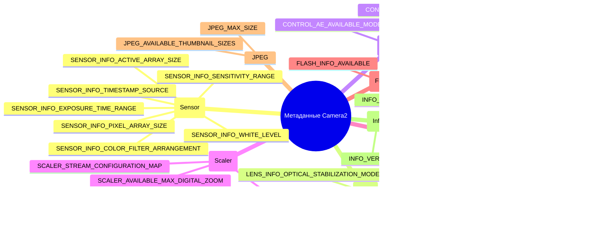

---
sidebar_position: 29
title: "Энциклопедия метаданных камеры"
description: Полный справочник по основным ключам метаданных CameraCharacteristics, включая категории Sensor, Lens, Control, Scaler, Request, Flash, JPEG, Statistics и Info.
keywords: [CameraCharacteristics, CameraMetadata, Sensor, Lens, Control, Scaler, справочник метаданных камеры]
---

import Tabs from '@theme/Tabs';
import TabItem from '@theme/TabItem';

# Энциклопедия метаданных камеры

## Приложение-компаньон

Изучите каждый ключ из этой энциклопедии вживую на своем устройстве — установите приложение Android Camera Parameters:

- **GitHub (Open Source):** [github.com/zoozooll/AndroidCameraParameters](https://github.com/zoozooll/AndroidCameraParameters)
- **Google Play:** [play.google.com/store/apps/details?id=com.minininja.cameraparams](https://play.google.com/store/apps/details?id=com.minininja.cameraparams)

Это приложение является живой реализацией каждой концепции, описанной на этой странице. Для каждой записи метаданных ниже указано, на какой именно вкладке и экране отображается это значение, чтобы вы могли сопоставить теорию с реальным устройством в руках.

---

## Таксономия метаданных



---

## Введение

Добро пожаловать в Энциклопедию метаданных камеры — исчерпывающий справочник для понимания более чем 300 ключей метаданных, описывающих каждую возможность устройства камеры Android. Если предыдущие главы этой серии учили вас тому, *как* работать с Camera2 (открывать сеансы, создавать запросы, транслировать поверхности), то эта энциклопедия научит вас тому, *на что* на самом деле способна ваша камера. Каждая функция, которую вы включаете в `CaptureRequest.Builder`, должна быть сначала проверена по `CameraCharacteristics`. Пропустите эту проверку, и ваше приложение будет вылетать на определенном проценте устройств или, что еще хуже, молча выдавать испорченный результат.

Эта энциклопедия существует потому, что метаданные Camera2 печально известны скудным описанием в официальной документации Android SDK. Документация сообщает тип каждого ключа (`Range&lt;Int&gt;`, `FloatArray` и т. д.), но редко раскрывает *семантику*: что означает «диоптрия» на практике, почему размер активной матрицы отличается от размера матрицы пикселей или какую последовательность ключей нужно проверить вместе перед тем, как показать кнопку ручного ISO. Записи здесь устраняют этот пробел с помощью кода промышленного уровня, описания типичных ошибок производителей (OEM) и реального поведения устройств, взятого из тысяч профилей в базе данных Android Camera Parameters.

Воспринимайте эту страницу как таблицу поиска для архитектуры вашего приложения камеры. Когда вы проектируете экран настроек, загляните в раздел Control. Когда строите интерфейс зума — в Scaler. Когда пишете конвейер обработки RAW — в Sensor. Каждая запись следует одной и той же шестипунктовой структуре, чтобы вы могли сразу перейти к нужному коду. Приложение-компаньон на вашем телефоне подтвердит, что эти же запросы работают на реальном железе от Samsung, Sony, HiSilicon, MediaTek и Google Tensor.

Ни одно устройство не поддерживает все ключи из этой энциклопедии. В этом и заключается смысл. Правильный паттерн разработки для Camera2 таков: запросить ключ → проверить результат на null → ограничить UI по функционалу → задокументировать путь отката. Эта страница дает вам запрос, проверку и описание ловушки, в которую вы попадете, если пропустите проверку.

---

## Как организованы метаданные Camera2

Метаданные Camera2 живут в трех параллельных иерархиях классов, корнем которых является `android.hardware.camera2.CameraMetadata`. Статическое описание того, что камера *может* делать, находится в `CameraCharacteristics` — вы запрашиваете это ровно один раз для каждого ID камеры после ее обнаружения через `CameraManager.getCameraIdList()`. Описание того, что вы *хотите*, чтобы камера сделала в конкретном запросе, находится в `CaptureRequest` — вы заполняете ключи через `CaptureRequest.Builder.set()`. Описание того, что камера *сделала на самом деле* в конкретном кадре, находится в `CaptureResult` (или его полном варианте `TotalCaptureResult`) — вы читаете ключи из обратного вызова в `CameraCaptureSession.CaptureCallback.onCaptureCompleted()`.

Каждый ключ во всех трех иерархиях расширяет `CaptureResult.Key<T>` (или его собратьев `CameraCharacteristics.Key<T>` и `CaptureRequest.Key<T>`) и является строго типизированным дескриптором поля. Существует более 300 публичных ключей, плюс дополнительные приватные ключи производителей, доступные через `CameraCharacteristics.get(CameraCharacteristics.REQUEST_AVAILABLE_SESSION_KEYS)` на определенных расширениях вендоров. Категории в этой энциклопедии следуют концептуальным группам, используемым в спецификации интерфейса HAL3: Sensor описывает матрицу, Lens — оптику, Control — алгоритмы 3A (автоэкспозиция, автофокус, автобаланс белого), Scaler — конвейер обрезки и масштабирования, Request — сквозные флаги возможностей, Flash — светодиод вспышки/фонарика, JPEG — кодировщик неподвижных изображений, а Info — пакет камеры и версию HAL.

---

## Соглашения, используемые в этой энциклопедии

Каждая запись метаданных ниже содержит ровно шесть разделов:

1. **Что это такое?** Определение ключа в 1–2 абзацах, его тип и семантика.
2. **Зачем это нужно?** Обоснование дизайна, побудившее инженеров Android открыть этот ключ, а не вычислять значение неявно.
3. **Какие устройства это поддерживают?** Минимальный уровень аппаратной поддержки, флаги возможностей и версия Android, начиная с которой этот ключ становится значимым.
4. **Как это запросить?** Готовый фрагмент кода на Kotlin с проверкой на null, показывающий вызов `characteristics.get()` и обработку ошибок.
5. **Как это проверить в Android Camera Parameters?** Точный путь в меню приложения-компаньона, где можно увидеть это значение на устройстве.
6. **Типичные ловушки.** Описание реальных проблем, с которыми сталкиваются разработчики, обычно связанных с фрагментацией OEM, скрытыми связями между ключами или неправильным пониманием единиц измерения.

Фрагменты кода используют идиоматичный Kotlin с операторами безопасного вызова (`?.`) и Elvis (`?:`), а также блоками `run` для случаев отсутствия данных. Предполагается, что у вас уже есть экземпляр `CameraCharacteristics` с именем `characteristics`. Фрагменты, выдающие пользовательский текст, используют форматирование строк с единицами измерения (диоптрии, наносекунды, ступени EV).

Ссылки на приложение-компаньон всегда используют один и тот же шаблон: *Вкладка / Подзаголовок*. Например, «Overview / Hardware Level» означает: откройте приложение, перейдите на вкладку Overview в нижней навигации, затем найдите карточку Hardware Level.

---

## Категория Sensor (Сенсор)

### SENSOR_INFO_ACTIVE_ARRAY_SIZE

**1. Что это такое?**

`SENSOR_INFO_ACTIVE_ARRAY_SIZE` — это объект `android.graphics.Rect`, описывающий координаты пикселей активной области захвата в пределах всей матрицы сенсора. На практике это самый большой прямоугольник пикселей, который может быть считан и доставлен в выходной поток. Прямоугольник всегда выровнен по осям и выражен в пространстве координат пикселей, где `(0,0)` — это верхний левый угол всей матрицы. Типичные значения выглядят как `Rect(0, 0, 8000, 6000)` для сенсора 8K×6K или `Rect(120, 160, 3880, 2880)`, если производитель оставляет небольшую неактивную рамку (оптически черные пиксели) по краям.

Каждый настроенный вами выходной поток — будь то JPEG, YUV_420_888, RAW или SurfaceTexture предпросмотра — в конечном итоге вырезается из этой активной области. Когда вы запрашиваете JPEG 4:3 с разрешением 12 Мп, ISP камеры обрезает активную матрицу до соотношения 4:3 и масштабирует ее. Когда вы применяете цифровой зум через `SCALER_CROP_REGION`, эта область обрезки сама отсчитывается относительно активной матрицы, а не всей матрицы пикселей.

**2. Зачем это нужно?**

Кристаллы сенсоров всегда содержат больше физических фотодиодов, чем доставляется в конвейер ISP. Самые крайние строки и столбцы — это «пустые» или «оптически черные» пиксели, используемые для калибровки темнового тока и коррекции виньетирования, а не для реального изображения. Без `SENSOR_INFO_ACTIVE_ARRAY_SIZE` у разработчиков не было бы способа узнать, какую систему координат использовать для `SCALER_CROP_REGION` или отслеживания лиц. В Camera1 это различие было скрыто, что делало математику цифрового зума непоследовательной у разных производителей. Camera2 открывает это явно, чтобы области обрезки можно было рассчитывать с пиксельной точностью.

**3. Какие устройства это поддерживают?**

Все устройства Camera2 поддерживают этот ключ на всех уровнях аппаратной поддержки: LEGACY, LIMITED, FULL и LEVEL_3. Он перечислен в `CameraCharacteristics.getAvailableCaptureResultKeys()` для каждого ID камеры, включая внешние USB-камеры. Прямоугольник всегда не пуст, а его ширина/высота никогда не превышают `SENSOR_INFO_PIXEL_ARRAY_SIZE`.

**4. Как это запросить?**

```kotlin
val activeArray: Rect? = characteristics.get(
    CameraCharacteristics.SENSOR_INFO_ACTIVE_ARRAY_SIZE
)

activeArray?.let { rect ->
    val widthPx = rect.width()
    val heightPx = rect.height()
    val megapixels = (widthPx * heightPx) / 1_000_000.0
    Log.d(TAG, "Активная матрица: ${widthPx}×${heightPx}px (%.1f Мп)".format(megapixels))
    Log.d(TAG, "  Слева=${rect.left}, Сверху=${rect.top}, Справа=${rect.right}, Снизу=${rect.bottom}")
} ?: run {
    Log.w(TAG, "Размер активной матрицы недоступен на этом устройстве")
}
```

**5. Как это проверить в Android Camera Parameters?**

Перейдите в **Sensor / Sensor Info**. Активная матрица отображается во второй строке карточки «Sensor Geometry», ниже размера матрицы пикселей. Приложение также рисует прямоугольник активной матрицы поверх масштабированного изображения всей матрицы пикселей, чтобы вы могли наглядно увидеть, какая часть физического кристалла реально используется.

**6. Типичные ловушки**

Самая большая ошибка — запросить `SENSOR_INFO_PIXEL_ARRAY_SIZE` и ожидать выход JPEG в таком разрешении. Полноразмерные неподвижные изображения всегда используют размеры активной матрицы, а не всей матрицы пикселей. На типичном 50-мегапиксельном сенсоре Samsung ISOCELL матрица пикселей может быть 8192×6144, но активная матрица — 8000×6000. Если вы выделите буфер на 50,3 Мп (из матрицы пикселей), вы получите изображение 48 Мп, а остальные пиксели будут молча отброшены или, что хуже, вы получите битый буфер на старых HAL. Всегда используйте `activeArray.width() * activeArray.height()` для расчета размера буфера. Вторая ловушка — использование координат активной матрицы без учета смещения: если левый/верхний углы не равны нулю, ваша математика области обрезки должна добавлять это смещение, иначе зум будет смещаться к верхнему левому углу.

---

### SENSOR_INFO_PIXEL_ARRAY_SIZE

**1. Что это такое?**

`SENSOR_INFO_PIXEL_ARRAY_SIZE` — это объект `android.util.Size`, представляющий общее количество физических фотодиодов на кристалле сенсора, включая любые оптически черные или пустые краевые пиксели. Это «маркетинговое» число мегапикселей: сенсор на 108 Мп заявляет размеры матрицы пикселей 12000×9000 независимо от того, сколько из них реально попадает в конвейер ISP. Тип данных — простой `Size` с полями `.width` и `.height`.

Связь с активной матрицей всегда такова:
- `pixelArray.width >= activeArray.width`
- `pixelArray.height >= activeArray.height`

Разница обычно составляет 100–400 пикселей по каждой оси и используется для строк оптического черного (OB) и заводской калибровки виньетирования.

**2. Зачем это нужно?**

Конвейеры обработки RAW нуждаются в полных размерах пикселей для правильного разбора буферов RAW10/RAW12/RAW16, так как формат RAW (когда `SENSOR_INFO_PRE_CORRECTION_ACTIVE_ARRAY_SIZE` недоступен) иногда включает строки OB. Разработчикам, пишущим собственные алгоритмы демозаики или вычитания темного кадра, также нужно знать, сколько пикселей на каждой границе нужно отсечь перед обработкой. Со стороны потребителя маркетинговые отделы и бенчмарки используют этот размер для отчета о «честном» разрешении сенсора без обрезки ISP.

**3. Какие устройства это поддерживают?**

Этот ключ предоставляют все уровни аппаратной поддержки. Предварительных условий по флагам возможностей нет. Устройства с поддержкой RAW (заявляющие `REQUEST_AVAILABLE_CAPABILITIES_RAW`) обязаны сообщать размер матрицы пикселей с точностью до одной строки/столбца физической спецификации сенсора.

**4. Как это запросить?**

```kotlin
val pixelArray: Size? = characteristics.get(
    CameraCharacteristics.SENSOR_INFO_PIXEL_ARRAY_SIZE
)

pixelArray?.let { size ->
    val mp = (size.width * size.height) / 1_000_000.0
    Log.d(TAG, "Матрица пикселей: ${size.width}×${size.height}px (%.1f Мп маркетинг)".format(mp))
    
    characteristics.get(CameraCharacteristics.SENSOR_INFO_ACTIVE_ARRAY_SIZE)?.let { active ->
        val usablePct = (active.width() * active.height()).toDouble() /
                        (size.width * size.height).toDouble() * 100.0
        Log.d(TAG, "  %.1f%% пикселей доступны через активную матрицу".format(usablePct))
    }
} ?: run {
    Log.w(TAG, "Размер матрицы пикселей недоступен")
}
```

**5. Как это проверить в Android Camera Parameters?**

Откройте **Sensor / Sensor Info** и посмотрите на первую запись в карточке «Sensor Geometry» с меткой «Pixel Array». Приложение отображает его как ширина×высота с указанием маркетингового количества мегапикселей в скобках. При нажатии на строку открывается диалоговое окно с таблицей сравнения матрицы пикселей, активной матрицы и активной матрицы до коррекции.

**6. Типичные ловушки**

Путаница между матрицей пикселей и доступным размером JPEG — универсальная ошибка начинающих разработчиков Camera2. Последовательность всегда такова: (1) запросить `SCALER_STREAM_CONFIGURATION_MAP.getOutputSizes(ImageFormat.JPEG)`, чтобы получить *реальные* разрешения, которые может выдать кодировщик, (2) самый большой размер JPEG будет равен (или будет масштабированной обрезкой) `SENSOR_INFO_ACTIVE_ARRAY_SIZE`, но никогда не матрице пикселей. Если вы напишете код, вычисляющий обрезку 4:3 исходя из размеров матрицы пикселей, результат будет чуть шире того, что ISP реально может выдать, и устройство камеры молча его обрежет, внося микродрейф в зум при отслеживании лиц. Во-вторых, на устройствах с поддержкой переобработки (`REQUEST_AVAILABLE_CAPABILITIES_PRIVATE_REPROCESSING`) входной размер переобработки использует семантику матрицы пикселей; использование активной матрицы для переобработки вызывает ошибки выравнивания кадров.

---

### SENSOR_INFO_SENSITIVITY_RANGE

**1. Что это такое?**

`SENSOR_INFO_SENSITIVITY_RANGE` — это объект `android.util.Range&lt;Int&gt;`, указывающий минимальное и максимальное значения ISO (аналогового усиления), которые сенсор может применить *во время считывания RAW*. Единицы измерения — арифметическая шкала ISO: 100 — базовое ISO (самое чистое изображение, минимум шума), 6400 или выше — режим высокой чувствительности (больше шума, короче выдержка при той же яркости). Типичные диапазоны на современных устройствах: `[100, 6400]` для среднего класса и `[50, 12800]` или `[32, 25600]` для флагманских сенсоров с глубокими потенциальными ямами пикселей.

Усиление применяется *до* любого цифрового усиления в конвейере ISP. Значения здесь соответствуют тому, что вы устанавливаете в `CaptureRequest.SENSOR_SENSITIVITY` при включенном ручном управлении.

**2. Зачем это нужно?**

Каждый CMOS-сенсор имеет физический минимальный уровень усиления (определяется усилителем считывания) и максимальный уровень (определяется тем, насколько можно усилить аналоговый сигнал до появления клиппинга или неприемлемого шума). Без явного диапазона каждый производитель использовал бы разные неявные значения по умолчанию. Camera2 открывает этот диапазон, чтобы слайдеры ручного ISO имели правильные границы, и чтобы разработчики могли проверить запрос на ручное ISO *до* его отправки в сеанс, избегая невнятного `IllegalArgumentException`.

**3. Какие устройства это поддерживают?**

Все устройства возвращают этот ключ как `Range&lt;Int&gt;`. Однако значения *управляемы* только если устройство заявляет флаг `REQUEST_AVAILABLE_CAPABILITIES_MANUAL_SENSOR`. На устройствах уровня LIMITED без этого флага диапазон всё равно вернет значения (обычно `[100, 800]`), но установка `SENSOR_SENSITIVITY` в CaptureRequest будет игнорироваться — алгоритм AE останется главным. Всегда завязывайте интерфейс ручного ISO на флаг MANUAL_SENSOR, а не на отсутствие null в диапазоне.

**4. Как это запросить?**

```kotlin
val sensitivityRange: Range<Int>? = characteristics.get(
    CameraCharacteristics.SENSOR_INFO_SENSITIVITY_RANGE
)

val capabilities: IntArray? = characteristics.get(
    CameraCharacteristics.REQUEST_AVAILABLE_CAPABILITIES
)
val hasManualSensor = capabilities?.contains(
    CameraCharacteristics.REQUEST_AVAILABLE_CAPABILITIES_MANUAL_SENSOR
) ?: false

sensitivityRange?.let { range ->
    Log.d(TAG, "Диапазон чувствительности: ISO ${range.lower} – ISO ${range.upper}")
    Log.d(TAG, "  Доступно ручное управление ISO: $hasManualSensor")
    
    if (hasManualSensor) {
        val stopCount = log2(range.upper.toDouble() / range.lower.toDouble())
        Log.d(TAG, "  Динамический диапазон: %.1f ступеней".format(stopCount))
    } else {
        Log.w(TAG, "  ВНИМАНИЕ: Диапазон сообщается, но флаг MANUAL_SENSOR ОТСУТСТВУЕТ.")
        Log.w(TAG, "  Установка SENSOR_SENSITIVITY будет ИГНОРИРОВАТЬСЯ алгоритмом AE!")
    }
} ?: run {
    Log.w(TAG, "Диапазон чувствительности недоступен")
}
```

**5. Как это проверить в Android Camera Parameters?**

Перейдите в **Sensor / Manual Sensor**, где диапазон чувствительности отображается как «ISO Range» в первой карточке. На устройствах с поддержкой MANUAL_SENSOR диапазон показан с превью слайдера. На устройствах без ручного управления приложение явно помечает диапазон как «Read Only» и выводит предупреждающий баннер, объясняющий, что значения носят лишь информационный характер.

**6. Типичные ловушки**

Первая ловушка: увидеть валидный диапазон чувствительности и включить ручное управление ISO без проверки `MANUAL_SENSOR`. Это работает на тестовом устройстве разработчика (например, Pixel 8, имеющем уровень FULL), но слайдер молча не делает ничего на 60% телефонов среднего класса в реальных условиях. Пользователь видит интерфейс, тянет ползунок, не видит разницы в шуме и оставляет гневный отзыв. Всегда проверяйте оба ключа вместе.

Вторая ловушка: путаница с единицами. `SENSOR_SENSITIVITY` использует *арифметическую* шкалу ISO, а не логарифмическую. Слайдер, который идет от 100 до 6400 *линейно*, делает верхние 75% трека практически одинаковыми (6400 к 3200 — это одна ступень, 3200 к 1600 — еще одна, ..., 200 к 100 — последняя ступень), в то время как нижние 25% покрывают 6 ступеней. Правильные слайдеры интерполируют значения по логарифмической шкале, чтобы каждые 10% трека соответствовали примерно одной ступени.

---

### SENSOR_INFO_EXPOSURE_TIME_RANGE

**1. Что это такое?**

`SENSOR_INFO_EXPOSURE_TIME_RANGE` — это объект `android.util.Range&lt;Long&gt;`, указывающий минимальную и максимальную длительность выдержки, которую сенсор может обеспечить для одного кадра, измеренную в **наносекундах**. Каждое значение в этом диапазоне является допустимым аргументом для `CaptureRequest.SENSOR_EXPOSURE_TIME` при включенном ручном управлении. Типичные диапазоны варьируются от примерно `Range(1_000_000L, 1_000_000_000L)` (минимум 1 миллисекунда, максимум 1 секунда) на устройствах среднего сегмента до `Range(100_000L, 10_000_000_000L)` (0,1 мс – 10 секунд) на флагманах уровня FULL с поддержкой ночной съемки. Некоторые внешние камеры уровня LEVEL_3 поддерживают 30 секунд и более.

Соотношение наносекунд с привычными единицами:
- 1 микросекунда = 1 000 нс
- 1 миллисекунда = 1 000 000 нс
- 1 секунда = 1 000 000 000 нс

**2. Зачем это нужно?**

HAL камеры нуждается в явном контрасте выдержки с уровнем приложения по двум причинам. Во-первых, длинные выдержки неявным образом взаимодействуют с `SENSOR_FRAME_DURATION`: если вы запросите 5-секундную выдержку, минимальная длительность кадра подпрыгнет до 5 секунд плюс время сброса сенсора, что означает, что колбэки предпросмотра перестанут приходить на 5 секунд, и интерфейс будет казаться застывшим. Во-вторых, самые короткие выдержки (микросекунды) взаимодействуют с перекосом скользящего затвора; ниже минимального времени выдержки тайминги считывания сенсора не успевают сработать, и кадры содержат битые строки.

**3. Какие устройства это поддерживают?**

Как и диапазон чувствительности, этот ключ присутствует на всех устройствах, но имеет смысл только в сочетании с ручным управлением. Флаг `MANUAL_SENSOR` определяет, действительно ли установка `SENSOR_EXPOSURE_TIME` меняет поведение сенсора. Устройства LIMITED без этого флага всё равно сообщают правдоподобный диапазон выдержек (обычно от 1 мс до 1/30 с), чтобы инструменты анализа AE могли судить о поведении алгоритма, но ручные настройки игнорируются.

**4. Как это запросить?**

```kotlin
fun Long.nanosToSeconds(): Double = this / 1_000_000_000.0
fun Long.nanosToMillis(): Double = this / 1_000_000.0
fun Double.secondsToNanos(): Long = (this * 1_000_000_000.0).toLong()

val exposureRange: Range<Long>? = characteristics.get(
    CameraCharacteristics.SENSOR_INFO_EXPOSURE_TIME_RANGE
)

val hasManualSensor = characteristics.get(
    CameraCharacteristics.REQUEST_AVAILABLE_CAPABILITIES
)?.contains(CameraCharacteristics.REQUEST_AVAILABLE_CAPABILITIES_MANUAL_SENSOR) ?: false

exposureRange?.let { range ->
    Log.d(TAG, "Диапазон времени выдержки:")
    Log.d(TAG, "  Мин: ${range.lower} нс = %.4f мс = %.7f с"
        .format(range.lower.nanosToMillis(), range.lower.nanosToSeconds()))
    Log.d(TAG, "  Макс: ${range.upper} нс = %.2f мс = %.4f с"
        .format(range.upper.nanosToMillis(), range.upper.nanosToSeconds()))
    Log.d(TAG, "  Ручное управление выдержкой доступно: $hasManualSensor")
    
    val shutterSpeeds = listOf(
        0.001, 0.002, 0.004, 0.008, 0.016, 0.033,
        0.066, 0.125, 0.25, 0.5, 1.0, 2.0, 4.0, 8.0
    )
    val supportedSpeeds = shutterSpeeds.filter { s ->
        val ns = s.secondsToNanos()
        ns >= range.lower && ns <= range.upper
    }
    Log.d(TAG, "  Поддерживаемые стандартные значения: $supportedSpeeds секунд")
} ?: run {
    Log.w(TAG, "Диапазон времени выдержки недоступен")
}
```

**5. Как это проверить в Android Camera Parameters?**

Перейдите в карточку **Sensor / Manual Sensor**, раздел «Exposure Range». Приложение показывает значение тремя способами: в наносекундах, миллисекундах и секундах. Горизонтальная шкала ниже визуализирует диапазон с отметками стандартных значений выдержки (от 1/1000 с до 8 с), чтобы вы могли сразу понять, возможна ли на этом устройстве ночная съемка с длинной выдержкой.

**6. Типичные ловушки**

Ловушка с «замиранием» предпросмотра: разработчик устанавливает выдержку 4 секунды для ночного снимка, но забывает, что тот же `CaptureRequest` применяется ко ВСЕМ поверхностям в сеансе, включая предпросмотр `SurfaceTexture`. Результат: на 4 секунды кадры предпросмотра перестают приходить, экран застывает, и пользователь думает, что приложение зависло. Решение — использовать одиночный повторяющийся запрос для предпросмотра на 30 fps, а длинную выдержку применять только к поверхностям JPEG/RAW через `CaptureRequest.Builder.addTarget()`.

Вторая ловушка — переполнение целых чисел при конвертации. Умножение и деление на `1_000_000_000` вплотную подходит к пределу 32-битных чисел. Всегда используйте `Long` (64 бит) для любых переменных, хранящих наносекунды, и пишите явные вспомогательные функции для конвертации. Выдержка в 1 секунду, сохраненная как Int, переполнится примерно на 2,1 секунды, в результате чего HAL получит отрицательное значение, что либо обрушит сеанс, либо приведет к сбросу в минимум на определенных HAL MediaTek.

---

### SENSOR_INFO_WHITE_LEVEL

**1. Что это такое?**

`SENSOR_INFO_WHITE_LEVEL` — это целое число `Int`, представляющее максимальное значение кода АЦП (аналого-цифрового преобразователя), которое может достичь пиксель сенсора RAW до момента насыщения (клиппинга). Для сенсора RAW10 (10 бит на пиксель на канал) уровень белого обычно составляет 1023 (2¹⁰−1). Для RAW12 — 4095. Для RAW14 — 16383. Некоторые сенсоры округляют это значение чуть вниз (например, 16300 вместо 16383 для RAW14), чтобы оставить запас для HDR или коррекции дефектов пикселей; точное значение калибруется на заводе.

Это значение насыщения для каждого канала. В любом кадре RAW с этого сенсора любое значение канала, равное (или превышающее) уровень белого, представляет собой «выбитые» света без возможности восстановления деталей.

**2. Зачем это нужно?**

Пиксельный формат RAW всегда использует одинаковую разрядность на канал. Буфер RAW10 хранит каждый пиксель в 16-битных целых числах, и разработчики, незнакомые с обработкой RAW, при нормализации к числу с плавающей запятой часто делят на 65535 (максимум для 16 бит). Это дает тусклые, выцветшие изображения с неправильным вычитанием точки черного. `SENSOR_INFO_WHITE_LEVEL` дает вам правильный делитель: делите пиксели RAW на `WHITE_LEVEL - BLACK_LEVEL_PATTERN` (а не на 65535), чтобы получить линейный диапазон яркости 0.0–1.0.

**3. Какие устройства это поддерживают?**

Этот ключ обязателен на любом устройстве, заявляющем флаг `REQUEST_AVAILABLE_CAPABILITIES_RAW` — то есть на любой камере, способной выдавать буферы RAW10/12/16 через `ImageReader`. На устройствах без поддержки RAW ключ может присутствовать, но так как прочитать пиксели RAW нельзя, он носит чисто справочный характер.

**4. Как это запросить?**

```kotlin
val whiteLevel: Int? = characteristics.get(
    CameraCharacteristics.SENSOR_INFO_WHITE_LEVEL
)

val blackLevelPattern: IntArray? = characteristics.get(
    CameraCharacteristics.SENSOR_BLACK_LEVEL_PATTERN
)

whiteLevel?.let { wl ->
    Log.d(TAG, "SENSOR_INFO_WHITE_LEVEL = $wl")
    
    val bits = ceil(log2(wl.toDouble() + 1.0)).toInt()
    Log.d(TAG, "  Эффективная разрядность RAW: $bits бит на канал")
    
    blackLevelPattern?.let { bl ->
        if (bl.size == 4) {
            val avgBlack = (bl[0] + bl[1] + bl[2] + bl[3]) / 4.0
            Log.d(TAG, "  Делитель для нормализации: ${wl - avgBlack.toInt()}")
        }
    }
} ?: run {
    Log.w(TAG, "Уровень белого недоступен — возможно, RAW не поддерживается")
}
```

**5. Как это проверить в Android Camera Parameters?**

Уровень белого находится в **Sensor / Sensor Info** в карточке «RAW Sensor Parameters». Если поддержка RAW есть, приложение показывает живое превью горизонтального градиента, нормализованного правильно с использованием уровня белого устройства, чтобы вы могли сравнить правильную нормализацию с ошибкой деления на 65535 — ошибочная версия будет заметно темнее.

**6. Типичные ловушки**

Нормализация на 65535 вместо уровня белого — универсальная первая ошибка при обработке RAW. Фото RAW10, нормализованное на 65535, получается примерно в 64 раза темнее — почти черным. Разработчики замечают это и применяют множитель 64× для компенсации, что вносит постеризацию (бандинг), так как они растягивают 10 бит информации в 16 бит точности. Правильный код сначала вычитает уровень черного, а затем делит на (уровень белого минус уровень черного). Это дает правильно экспонированное линейное изображение, готовое к применению гаммы и тонального отображения.

---

### SENSOR_INFO_COLOR_FILTER_ARRANGEMENT

**1. Что это такое?**

`SENSOR_INFO_COLOR_FILTER_ARRANGEMENT` — это перечисление `Int`, описывающее макет массива цветовых фильтров Байера (CFA) поверх фотодиодов сенсора. CFA — это микроскопическая цветовая мозаика, которая придает каждому пикселю чувствительность к красному, зеленому или синему цвету. Возможные значения:
- `RGGB` — самый частый (верхняя строка Красный-Зеленый, вторая строка Зеленый-Синий).
- `GRBG` — вариант зеленый-красный / синий-зеленый.
- `BGGR` — синий-зеленый / зеленый-красный (часто встречается в сенсорах Sony).
- `GBRG` — зеленый-синий / красный-зеленый.
- `MONOCHROME` — без цветофильтра, чистый яркостный сенсор (инфракрасные камеры или спец. камеры для ночной съемки).

Макет описывает верхний левый пиксель (x=0, y=0) активной матрицы. Каждый блок 2×2 повторяет этот паттерн по всей поверхности.

**2. Зачем это нужно?**

Данные RAW-сенсора по своей природе монохромны. Для восстановления полноцветного RGB-изображения необходимо применить алгоритм демозаики, который интерполирует недостающие два цветовых канала для каждого пикселя. Алгоритм демозаики *обязан* знать, какой цвет находится в каждой физической позиции. Если запустить демозаику RGGB на сенсоре BGGR, вы получите изображение с инвертированными цветами: красные пиксели станут синими, синие — красными.

**3. Какие устройства это поддерживают?**

Обязательно для всех RAW-устройств. На устройствах без вывода RAW ключ может присутствовать (позволяя инструментам анализа описывать конструкцию сенсора), но нет кода, которому это значение было бы *необходимо*. Внешние USB-камеры иногда опускают этот ключ; в таком случае стоит использовать значение `RGGB` по умолчанию, так как веб-камеры почти повсеместно используют его.

**4. Как это запросить?**

```kotlin
val cfa: Int? = characteristics.get(
    CameraCharacteristics.SENSOR_INFO_COLOR_FILTER_ARRANGEMENT
)

cfa?.let { arrangement ->
    val arrangementName = when (arrangement) {
        CameraCharacteristics.SENSOR_INFO_COLOR_FILTER_ARRANGEMENT_RGGB -> "RGGB"
        CameraCharacteristics.SENSOR_INFO_COLOR_FILTER_ARRANGEMENT_GRBG -> "GRBG"
        CameraCharacteristics.SENSOR_INFO_COLOR_FILTER_ARRANGEMENT_BGGR -> "BGGR"
        CameraCharacteristics.SENSOR_INFO_COLOR_FILTER_ARRANGEMENT_GBRG -> "GBRG"
        CameraCharacteristics.SENSOR_INFO_COLOR_FILTER_ARRANGEMENT_MONOCHROME -> "MONOCHROME"
        else -> "UNKNOWN (значение=$arrangement)"
    }
    Log.d(TAG, "Макет цветофильтров = $arrangementName")
} ?: run {
    Log.w(TAG, "Нет данных о CFA. По умолчанию RGGB для внешних/старых устройств.")
}
```

**5. Как это проверить в Android Camera Parameters?**

Откройте **Sensor / Sensor Info** и посмотрите строку «Color Filter Array» в карточке RAW Sensor Parameters. Приложение рисует визуальное представление мозаики 4×4 пикселя, используя реальный макет сенсора — красные, зеленые и синие квадраты, расположенные так, как их видит кремний. Монохромные сенсоры отображаются в виде серой сетки с надписью «NO CFA».

**6. Типичные ловушки**

Жесткое прописывание демозаики RGGB. Практически каждый сенсор Sony Exmor-RS на рынке поставляется с макетом BGGR, поэтому если вы зашьете RGGB, ваш код будет работать на телефоне Samsung ISOCELL, на котором вы тестировали, но выдаст инвертированные цвета на каждом Xperia, большинстве Pixel и всех iPhone (если бы на них был Android). Решение простое: читайте ключ и ветвите алгоритм демозаики. Многие библиотеки для работы с RAW (libraw) принимают перечисление CFA напрямую.

Вторая ловушка: обрезка RAW-буфера. `SENSOR_INFO_COLOR_FILTER_ARRANGEMENT` описывает левый верхний пиксель активной матрицы. Если вы обрежете буфер RAW (например, вырежете область 1000×1000 для обработки лиц), паттерн CFA *сдвинется* на величину (crop.left mod 2, crop.top mod 2). Сдвиг на один пиксель вправо превращает RGGB в GRBG. Большинство разработчиков забывают об этом и обрабатывают обрезку со старым паттерном, получая высокочастотный цветовой муар. Решение — либо подстраивать CFA под четность координат обрезки, либо всегда делать обрезку по четным границам.

---

## Категория Lens (Объектив)

### LENS_FACING

**1. Что это такое?**

`LENS_FACING` — это перечисление `Int`, описывающее физическое направление установки модуля камеры относительно экрана устройства. Три возможных значения:
- `BACK` — камера направлена от пользователя (основная камера для пейзажной съемки).
- `FRONT` — камера направлена на пользователя (селфи-камера в рамке экрана или вырезе).
- `EXTERNAL` — USB-вебкамера, карта захвата HDMI или другая подключаемая камера с неизвестной ориентацией.

Этот ключ статичен для каждого ID камеры и никогда не меняется в течение жизни устройства (за исключением складных устройств — см. `INFO_DEVICE_STATE_ORIENTATIONS`).

**2. Зачем это нужно?**

Самое заметное влияние направления камеры — трансформация предпросмотра. Android требует, чтобы предпросмотр задней камеры поворачивался вместе с устройством, а для передней камеры он должен быть также **зеркально отражен по горизонтали**, чтобы пользователь видел себя как в зеркале. Без ключа направления каждому приложению пришлось бы угадывать камеру по эвристикам (первый ID — задняя, второй — передняя), которые ломаются на многокамерных устройствах, где ID 0, 1, 2, 3 могут быть задними.

**3. Какие устройства это поддерживают?**

Каждый ID камеры на каждом устройстве сообщает этот ключ. Невозможно получить валидный ID через `CameraManager`, у которого не заполнен `LENS_FACING`. Даже устройства уровня LEGACY предоставляют его. Внешние USB-камеры по умолчанию получают значение `EXTERNAL`.

**4. Как это запросить?**

```kotlin
val facing: Int? = characteristics.get(
    CameraCharacteristics.LENS_FACING
)

facing?.let { f ->
    val name = when (f) {
        CameraCharacteristics.LENS_FACING_BACK -> "Задняя"
        CameraCharacteristics.LENS_FACING_FRONT -> "Передняя"
        CameraCharacteristics.LENS_FACING_EXTERNAL -> "Внешняя"
        else -> "Неизвестно ($f)"
    }
    Log.d(TAG, "LENS_FACING = $name")
}
```

**5. Как это проверить в Android Camera Parameters?**

Перейдите в **Overview / Cameras**. В первой карточке перечислены все ID камер с указанием направления, ориентации сенсора и уровня поддержки. Передние камеры помечены иконкой «🤳», задние — «📷», внешние USB — «🔌». Нажатие на строку камеры открывает подробный вид, где направление указано первым полем.

**6. Типичные ловушки**

Ловушка с зеркалированием селфи: разработчики правильно зеркалируют предпросмотр для комфорта пользователя, но затем захватывают JPEG и удивляются, почему фото *не* отзеркалено. Зеркалирование — это **трансформация только для отображения**, применяемая к поверхности предпросмотра. Реальные пиксели сенсора (и байты JPEG) никогда не зеркалируются. Пользователи это не любят: «Мои селфи выглядят перевернутыми!». Решение — записывать горизонтальный флип в тег ориентации EXIF с помощью `ExifInterface`. Установите `TAG_ORIENTATION` в значение `ORIENTATION_FLIP_HORIZONTAL` для передних камер. Большинство галерей уважают этот флаг. Если вам нужен именно пиксельный флип (для загрузки на сервер, который игнорирует EXIF), обработайте `Bitmap` с помощью `Matrix.preScale(-1f, 1f)` перед сохранением.

---

### LENS_INFO_AVAILABLE_FOCAL_LENGTHS

**1. Что это такое?**

`LENS_INFO_AVAILABLE_FOCAL_LENGTHS` — это массив `FloatArray`, перечисляющий дискретные оптические фокусные расстояния (в миллиметрах), которые эта камера может выдать. Однокамерные устройства сообщают массив из одного элемента, например `[4.2]`, что означает объектив-фикс 4,2 мм. Логические мультикамеры (объединяющие несколько сенсоров под одним ID) сообщают массив вида `[1.7, 5.0, 12.0]`, что означает доступность сверхширокоугольного (1,7 мм), широкоугольного (5,0 мм) и перископического телеобъектива (12,0 мм). Обратите внимание, что это **оптическое** фокусное расстояние, а не маркетинговое число в 35-мм эквиваленте.

**2. Зачем это нужно?**

Фокусное расстояние — фундаментальное свойство, определяющее угол обзора. Подсистема зума в Camera2 была переработана для мультикамерных устройств, чтобы позволить фреймворку *бесшовно переключаться* между физическими камерами, когда пользователь делает жест «щепок». Не зная доступных фокусных расстояний, разработчики не смогли бы создать интерфейс зума с визуальными метками оптических «сладких точек» (1×, 3×, 5×), где используется реальная линза без цифрового кропа. Этот ключ позволяет нарисовать шкалу зума с насечками.

**3. Какие устройства это поддерживают?**

Все уровни аппаратной поддержки. Однокамерные устройства всегда имеют массив из одного элемента. Наличие флага `LOGICAL_MULTI_CAMERA` обычно коррелирует с длинными массивами, но не обязательно — некоторые производители открывают список фокусных расстояний и через обертку LEGACY. На корректных устройствах массив гарантированно отсортирован по возрастанию.

**4. Как это запросить?**

```kotlin
val focalLengths: FloatArray? = characteristics.get(
    CameraCharacteristics.LENS_INFO_AVAILABLE_FOCAL_LENGTHS
)

focalLengths?.let { fLengths ->
    fLengths.sort()
    Log.d(TAG, "Оптические фокусные расстояния (${fLengths.size} значений):")
    fLengths.forEachIndexed { i, mm ->
        Log.d(TAG, "  [$i] ${"%.2f".format(mm)}мм (оптическое)")
    }
}
```

**5. Как это проверить в Android Camera Parameters?**

Откройте **Lens / Lens Info**. Фокусные расстояния отображаются в карточке «Focal Lengths» с указанием 35-мм эквивалента, угла обзора и кроп-фактора для каждого значения. На логических мультикамерах у каждого значения есть плашка с ID физической камеры, которая его обеспечивает.

**6. Типичные ловушки**

Фокусное расстояние против дистанции фокусировки: самая частая путаница в Camera2. `LENS_INFO_AVAILABLE_FOCAL_LENGTHS` (в мм) — это **оптическое свойство объектива** (насколько широко он видит). `LENS_FOCUS_DISTANCE` (в диоптриях, 1/м) — это **текущее положение автофокуса** (на каком расстоянии наведена резкость). Изменение фокусного расстояния переключает физические линзы; изменение дистанции фокусировки двигает моторчик внутри одной линзы. Эти параметры независимы. Разработчики часто пытаются сделать один слайдер, управляющий обоими сразу, что дает странные результаты.

---

### LENS_INFO_MINIMUM_FOCUS_DISTANCE

**1. Что это такое?**

`LENS_INFO_MINIMUM_FOCUS_DISTANCE` — это число `Float`, измеряемое в **диоптриях (D)**, определенных как обратная величина минимального расстояния фокусировки в метрах. Значение `10.0` означает, что линза может сфокусироваться на объектах на расстоянии 0,1 метра (10 см). Значение `0.0` означает, что линза имеет фиксированный фокус («focus free») — она не может менять резкость, так как оптимизирована для бесконечности. Большинство селфи-камер и сверхширокоугольных модулей бюджетных телефонов имеют фиксированный фокус. Значения 20D и выше указывают на макро-модуль, способный фокусироваться на объектах, касающихся линзы.

**2. Зачем это нужно?**

Без этого параметра нет программного способа узнать, способна ли камера на ручную фокусировку. Если показать слайдер ручного фокуса на камере с фиксированным фокусом (0.0 диоптрий), его движение не вызовет никаких изменений, что запутает пользователя. Ключ также определяет допустимый диапазон параметра запроса `LENS_FOCUS_DISTANCE`: валидные значения всегда лежат в пределах `[0.0, minimum_focus_distance]` (от бесконечности до макро).

**3. Какие устройства это поддерживают?**

Доступно на всех устройствах, но имеет смысл только в сочетании с ручным управлением. Флаг `MANUAL_SENSOR` определяет, действительно ли установка `LENS_FOCUS_DISTANCE` двигает линзу. Устройства уровня LIMITED могут сообщать `MINIMUM_FOCUS_DISTANCE = 10.0`, но если флаг MANUAL_SENSOR отсутствует, установка значения в запросе будет молча игнорироваться.

**4. Как это запросить?**

```kotlin
val minFocusDiopters: Float? = characteristics.get(
    CameraCharacteristics.LENS_INFO_MINIMUM_FOCUS_DISTANCE
)

minFocusDiopters?.let { d ->
    Log.d(TAG, "LENS_INFO_MINIMUM_FOCUS_DISTANCE = %.2f D (диоптрий)".format(d))
    
    val closestFocusCm = if (d > 0.0f) (100.0 / d.toDouble()) else Double.POSITIVE_INFINITY
    
    if (d == 0.0f) {
        Log.d(TAG, "  Тип: ФИКСИРОВАННЫЙ ФОКУС (нельзя менять резкость)")
    } else {
        Log.d(TAG, "  Минимальная дистанция фокусировки: ~${"%.0f".format(closestFocusCm)} см")
    }
}
```

**5. Как это проверить в Android Camera Parameters?**

Загляните в **Lens / Lens Info**, раздел «Minimum Focus Distance». Приложение отображает значение тремя способами: в диоптриях, сантиметрах и дюймах. Если значение равно 0.0, красная плашка предупреждает: «FIXED FOCUS — ручной фокус недоступен».

**6. Типичные ловушки**

Отображение слайдера ручного фокуса, когда `minFocusDistance == 0.0f`. Слайдер будет идти от 0.0 до 0.0 — то есть в одну точку. С точки зрения интерфейса это неработающий элемент, и тестировщики пометят это как баг. Правильно проверять условие `minFocusDistance > 0.0` вместе с флагом `MANUAL_SENSOR`. Если проверка не проходит — скрывайте слайдер из настроек.

Вторая ловушка: инвертированная шкала диоптрий на слайдере. Диоптрии растут *по направлению к камере* (10 D = 10 см, 1 D = 1 м, 0 D = бесконечность). Если вы наивно сопоставите левый край слайдера с 0.0, а правый — с `minFocusDistance`, то «сдвиг вправо» будет фокусировать *ближе*, что противоположно ожиданиям пользователя от шкалы «далеко → близко». Переверните маппинг: положение слайдера `p ∈ [0,1]` должно давать `focus = (1.0 - p) * minFocusDistance`.

---

### LENS_INFO_AVAILABLE_APERTURES

**1. Что это такое?**

`LENS_INFO_AVAILABLE_APERTURES` — это массив `FloatArray` со значениями диафрагменных чисел (f-stop), представляющих дискретные размеры отверстия диафрагмы, которые может обеспечить объектив. Число f — это отношение `фокусное_расстояние / диаметр_отверстия`: меньшие числа означают широкую диафрагму (больше света, размытый фон), большие — узкую (меньше света, всё в резкости). У большинства смартфонов диафрагма фиксированная: `[1.8]` или `[2.2]`. Лишь небольшое число премиальных устройств (Samsung Galaxy S9–S10, некоторые флагманы Xiaomi) имеют *механическую двойную диафрагму*, переключающуюся между двумя значениями, например `[1.5, 2.4]`.

**2. Зачем это нужно?**

«Треугольник экспозиции» в фотографии — это ISO, выдержка и диафрагма. В смартфонах с фиксированной диафрагмой треугольник схлопывается до двух переменных. Список доступных диафрагм говорит разработчику, является ли «А» в ISO+SS+A переменной или константой. Интерфейсы ручной съемки, показывающие выбор диафрагмы для камер с фикс-диафрагмой, выглядят непрофессионально.

**3. Какие устройства это поддерживают?**

Все устройства возвращают этот массив. Массивы из одного элемента доминируют на рынке. Многоэлементные массивы встречаются только на флагманах с механизмом физической диафрагмы. Флаги возможностей не требуются: если в массиве больше одного значения, вы можете устанавливать любое из них через `CaptureRequest.LENS_APERTURE` — проверка MANUAL_SENSOR не нужна, так как переключение диафрагмы не зависит от управления сенсором.

**4. Как это запросить?**

```kotlin
val apertures: FloatArray? = characteristics.get(
    CameraCharacteristics.LENS_INFO_AVAILABLE_APERTURES
)

apertures?.let { stops ->
    if (stops.size > 1) {
        Log.d(TAG, "ПЕРЕМЕННАЯ диафрагма: f/${stops.joinToString(", f/")}")
    } else {
        Log.d(TAG, "ФИКСИРОВАННАЯ диафрагма f/${stops.firstOrNull()}")
    }
}
```

**5. Как это проверить в Android Camera Parameters?**

Перейдите в **Lens / Lens Info** — диафрагма отображается как «Aperture» с кнопками-плашками для каждого значения. На устройствах с переменной диафрагмой нажатие на кнопку мгновенно переключает ее, и предпросмотр становится темнее или светлее, позволяя увидеть изменение глубины резкости в реальном времени.

**6. Типичные ловушки**

Восприятие диафрагмы как управляемого параметра на каждом устройстве. Многие разработчики приходят из мира зеркалок и считают, что на телефоне есть все три настройки. Если вызвать `captureRequest.set(LENS_APERTURE, 2.8f)` на камере с фикс f/1.8, хороший HAL проигнорирует запрос, а плохой — обрушит сеанс. Всегда проверяйте `apertures.size > 1` перед показом UI выбора диафрагмы.

---

### LENS_INFO_OPTICAL_STABILIZATION_MODE

**1. Что это такое?**

`LENS_INFO_OPTICAL_STABILIZATION_MODE` (в паре с `LENS_INFO_AVAILABLE_OPTICAL_STABILIZATION` для массива) — это перечисление `IntArray`, указывающее на наличие аппаратной оптической стабилизации (OIS) и поддерживаемые ею режимы. Стандартные значения:
- `OFF` — нет OIS, стабилизация только программная (EIS).
- `ON` — стандартная OIS для фото; гироскоп сдвигает линзу для компенсации дрожания рук.
- `VIDEO_STABILIZATION` — оптимизированный профиль OIS для видеосъемки.

**2. Зачем это нужно?**

OIS и программная EIS — это две разные технологии, которые взаимодействуют друг с другом. OIS физически двигает линзу, что требует корректировки запаса обрезки для работы EIS. На большинстве устройств 2019–2024 годов HAL не разрешает включать OIS и `CONTROL_VIDEO_STABILIZATION_MODE_ON` одновременно — это вызывает конфликт, так как алгоритм EIS ожидает статичную оптическую схему, а мотор OIS ее меняет.

**3. Какие устройства это поддерживают?**

Все устройства отдают массив режимов. Наличие `ON` в массиве означает наличие реального железа OIS. Флагманы и смартфоны среднего класса обычно имеют OIS в основном модуле. Бюджетные телефоны и селфи-камеры обычно имеют только `[OFF]`. OIS не зависит от уровня поддержки железа: бывают устройства LIMITED с OIS и FULL без нее.

**4. Как это запросить?**

```kotlin
val availableOisModes: IntArray? = characteristics.get(
    CameraCharacteristics.LENS_INFO_AVAILABLE_OPTICAL_STABILIZATION
)

availableOisModes?.let { modes ->
    val hasOis = modes.contains(CameraMetadata.LENS_OPTICAL_STABILIZATION_MODE_ON)
    Log.d(TAG, "Аппаратная стабилизация OIS: ${if (hasOis) "ЕСТЬ" else "НЕТ"}")
}
```

**5. Как это проверить в Android Camera Parameters?**

В меню **Lens / Stabilization** карточка показывает «Available OIS Modes». Ниже приложение также выводит режимы EIS и предупреждающий баннер, если доступны оба варианта, объясняя риск их несовместимости.

**6. Типичные ловушки**

Взаимное исключение: главная проблема — включение `LENS_OPTICAL_STABILIZATION_MODE = ON` и `CONTROL_VIDEO_STABILIZATION_MODE = ON` одновременно. На устройствах Samsung это часто молча отключает OIS. На устройствах с MediaTek создание сеанса может завершиться ошибкой `CameraAccessException`. Безопасное правило: выбирайте ЛИБО OIS, ЛИБО EIS, но не оба сразу. Предпочитайте OIS, когда она доступна (она корректирует свет до попадания на сенсор и сохраняет больше деталей), и переходите на EIS, если в линзе нет моторчиков.

---

## Категория Control (Управление)

### CONTROL_AE_AVAILABLE_MODES

**1. Что это такое?**

`CONTROL_AE_AVAILABLE_MODES` — это массив `IntArray`, описывающий режимы работы алгоритма автоэкспозиции (AE). Основные значения:
- `OFF` — AE заблокирована; выдержка и ISO берутся только из ручных ключей.
- `ON` — стандартная автоэкспозиция (авто ISO + авто выдержка).
- `ON_AUTO_FLASH` — AE + автоматическое срабатывание вспышки при плохом свете.
- `ON_ALWAYS_FLASH` — AE + принудительная вспышка.
- `ON_AUTO_FLASH_REDEYE` — AE + предвспышка для подавления эффекта красных глаз.

**2. Зачем это нужно?**

Каждый режим требует разного внутреннего состояния HAL. Например, для подавления красных глаз нужно настроить серию коротких импульсов за 20–50 мс до основного затвора. Если HAL не поддерживает такую схему (например, бюджетный телефон с простым драйвером вспышки), режим должен отсутствовать в списке. Попытка использовать неподдерживаемый режим приведет к сбросу в `ON` или вылету сеанса.

**3. Какие устройства это поддерживают?**

Все уровни аппаратной поддержки. Минимум, гарантированный для любой камеры — `[OFF, ON]`. Режимы со вспышкой присутствуют только при `FLASH_INFO_AVAILABLE = true`.

**4. Как это запросить?**

```kotlin
val aeModes: IntArray? = characteristics.get(
    CameraCharacteristics.CONTROL_AE_AVAILABLE_MODES
)

aeModes?.let { modes ->
    Log.d(TAG, "Доступные режимы AE: ${modes.toList()}")
}
```

**5. Как это проверить в Android Camera Parameters?**

В разделе **Control / 3A Modes** первая карточка «AE Modes» отображает каждый доступный режим в виде кнопки. Нажатие на кнопку применяет режим к живому предпросмотру, позволяя наблюдать за поведением (например, за импульсами предвспышки в режиме RED_EYE).

**6. Типичные ловушки**

Ловушка «двойного OFF»: установка только `CONTROL_AE_MODE_OFF` **НЕ** включает ручную экспозицию. Каждый разработчик спотыкается об это. Существует глобальный переключатель `CONTROL_MODE`. Если он оставлен в значении по умолчанию `AUTO`, HAL интерпретирует OFF в отдельных ветках 3A как «не менять поведение автомата» — ровно противоположно тому, что вы ожидаете. Правильная последовательность для ручного режима:

```kotlin
builder.set(CaptureRequest.CONTROL_MODE, CONTROL_MODE_OFF)
builder.set(CaptureRequest.CONTROL_AE_MODE, CONTROL_AE_MODE_OFF)
builder.set(CaptureRequest.CONTROL_AF_MODE, CONTROL_AF_MODE_OFF)
builder.set(CaptureRequest.CONTROL_AWB_MODE, CONTROL_AWB_MODE_OFF)
builder.set(CaptureRequest.SENSOR_SENSITIVITY, iso)
builder.set(CaptureRequest.SENSOR_EXPOSURE_TIME, exposureNs)
```

И `CONTROL_MODE`, и `CONTROL_AE_MODE` должны быть в `OFF`. Если установить только второй, запрос будет валидным, но ISO продолжит меняться автоматически.

---

### CONTROL_AF_AVAILABLE_MODES

**1. Что это такое?**

`CONTROL_AF_AVAILABLE_MODES` — это массив `IntArray`, перечисляющий поддерживаемые режимы автофокуса. Основные значения:
- `OFF` — AF выключен; фокус берется из `LENS_FOCUS_DISTANCE`.
- `AUTO` — одиночный фокус: запускается по триггеру `CONTROL_AF_TRIGGER = START`, блокируется при наведении.
- `CONTINUOUS_PICTURE` — непрерывный фокус, агрессивный, настроен для фото: быстро перефокусируется при любом изменении сцены.
- `CONTINUOUS_VIDEO` — непрерывный фокус, плавный и медленный: избегает рывков («дыхания» фокуса), чтобы не портить видеоряд.
- `EDOF` — программно увеличенная глубина резкости, моторчик линзы отсутствует.

**2. Зачем это нужно?**

Для разных задач нужны разные стратегии AF. Видеосъемка не терпит рывков `CONTINUOUS_PICTURE`, так как каждое изменение фокуса заметно меняет масштаб изображения и создает шум моторчика на аудиодорожке. Режим макро требует ограничения диапазона поиска. Ключ сообщает, какие алгоритмы вшиты в HAL.

**3. Какие устройства это поддерживают?**

Все уровни. Почти каждое устройство имеет `[AUTO, CONTINUOUS_PICTURE]`. `CONTINUOUS_VIDEO` есть везде, где можно записывать видео.

**4. Как это запросить?**

```kotlin
val afModes: IntArray? = characteristics.get(
    CameraCharacteristics.CONTROL_AF_AVAILABLE_MODES
)

afModes?.let { modes ->
    Log.d(TAG, "Доступные режимы AF: ${modes.toList()}")
}
```

**5. Как это проверить в Android Camera Parameters?**

В **Control / 3A Modes** карточка «AF Modes». Приложение показывает индикатор состояния AF рядом с каждой кнопкой: при нажатии CONTINUOUS_PICTURE и движении рукой перед линзой вы увидите циклы PASSIVE_SCAN → PASSIVE_FOCUSED. В режиме VIDEO те же переходы будут происходить гораздо медленнее.

**6. Типичные ловушки**

Использование `CONTINUOUS_PICTURE` для записи видео: это дает картинку, которая «дышит» при каждой перефокусировке. На широких диафрагмах (f/1.8) плоскость фокуса смещается очень заметно. Используйте `CONTINUOUS_VIDEO` для любого выхода `MediaRecorder`.

Вторая ловушка — EDOF: на таких устройствах автомат фокуса *никогда не переходит в состояние FOCUSED_LOCKED*. Разработчики, которые блокируют затвор до получения `CONTROL_AF_STATE_FOCUSED_LOCKED`, будут вечно ждать на линзах EDOF. Правильный паттерн: если `AF_MODE == EDOF` — пропустить триггер AF и снимать сразу.

---

### CONTROL_AWB_AVAILABLE_MODES

**1. Что это такое?**

`CONTROL_AWB_AVAILABLE_MODES` — это массив `IntArray`, перечисляющий режимы автобаланса белого и фиксированные пресеты цветовой температуры. Значения: `AUTO`, `INCANDESCENT` (лампы накаливания ~2700K), `FLUORESCENT` (~4500K), `DAYLIGHT` (~5500K), `CLOUDY_DAYLIGHT` (~6500K), `SHADE` (~7500K).

**2. Зачем это нужно?**

Пресеты AWB решают проблему «как сделать, чтобы фото выглядело так же, как видит глаз» при предсказуемом свете. Режим `AUTO` иногда ошибается: ярко-красная стена заставляет алгоритм думать, что сцена освещена бирюзовым светом, и он добавляет зеленый оттенок всему кадру. Выбор `INCANDESCENT` говорит камере: «я знаю, что тут светят лампочки — используй калиброванные под них усиления».

**3. Какие устройства это поддерживают?**

Все. Минимум — `[OFF, AUTO]`. Все 8 пресетов присутствуют примерно на 70% устройств.

**4. Как это запросить?**

```kotlin
val awbModes: IntArray? = characteristics.get(
    CameraCharacteristics.CONTROL_AWB_AVAILABLE_MODES
)

awbModes?.let { Log.d(TAG, "Режимы AWB: ${it.toList()}") }
```

**5. Как это проверить в Android Camera Parameters?**

В **Control / 3A Modes** карточка «AWB Modes». Каждая кнопка имеет цветовую плашку, показывающую примерный тон пресета. Нажатие на `INCANDESCENT` в помещении сделает картинку «холоднее» (уберет желтизну ламп).

**6. Типичные ловушки**

Предположение, что значения температуры совпадают у всех производителей. Спецификация Android не требует, чтобы `DAYLIGHT` был ровно 5500К; он должен быть «примерно дневным». На практике у Samsung это ~5200К (тепло), у Pixel — ~5700К (холодно). Если вы строите точный научный конвейер, не полагайтесь на пресеты — используйте `MANUAL_POST_PROCESSING` и задавайте коэффициенты усиления вручную.

---

### CONTROL_AVAILABLE_EFFECTS

**1. Что это такое?**

`CONTROL_AVAILABLE_EFFECTS` — это массив цветовых эффектов, встроенных в ISP. Значения: `MONO` (ч/б), `NEGATIVE` (негатив), `SEPIA` (сепия), `SOLARIZE`, `POSTERIZE`, `AQUA` (подводный стиль). Плюс приватные значения производителей (100+).

**2. Зачем это нужно?**

Встроенные эффекты работают на полном разрешении и с нулевыми затратами процессора, так как реализованы аппаратно в таблицах поиска (LUT) внутри ISP. Аналогичный эффект на GPU при разрешении 4K съест 5–15 мс бюджета кадра. Ключ сообщает, какие LUT зашиты в железо.

**3. Какие устройства это поддерживают?**

Все устройства содержат как минимум `[OFF]`. Samsung и Xiaomi обычно предлагают 12+ эффектов. Pixel — меньше всего (обычно только OFF и MONO).

**4. Типичные ловушки**

Переносимость: эффекты — самая нестабильная часть Camera2. Даже стандартный `MONO` выглядит по-разному: Samsung применяет веса яркости с красным каналом и S-кривую; Pixel использует веса BT.709 без кривой. Оттенки сепии варьируются от красно-коричневого до чисто желтого. Если ваш бренд завязан на конкретный фильтр — делайте его шейдерами на GPU. Используйте эффекты ISP только для бесплатного предпросмотра.

---

### CONTROL_AE_COMPENSATION_RANGE

**1. Что это такое?**

`CONTROL_AE_COMPENSATION_RANGE` — это `Range&lt;Int&gt;`, указывающий диапазон смещения экспозиции (экспокоррекция). Важно: значения указаны в **целых шагах**, а не в стопах. Каждый шаг соответствует значению `CONTROL_AE_COMPENSATION_STEP`, которое является дробью `Rational`, например `Rational(1, 3)` (0.333 EV на шаг).
- диапазон `[-12, +12]`, шаг `1/3 EV` → реальный диапазон от -4 EV до +4 EV.

**2. Зачем это нужно?**

Алгоритм AE принимает глобальные решения. Если яркий свет занимает 10% кадра (окно в комнате), AE недоэкспонирует всю комнату. Пользователь хочет «добавить +1 EV», чтобы в комнате стало светло, даже если окно «выбьется» в белое. Это стандартный диск экспокоррекции ±, как на любой зеркалке.

**3. Какие устройства это поддерживают?**

Все. Устройства уровня LIMITED обычно предлагают ±4 EV или ±6 EV. Флаги не требуются — экспокоррекция работает всегда, даже без MANUAL_SENSOR.

**4. Как это запросить?**

```kotlin
val range: Range<Int>? = characteristics.get(
    CameraCharacteristics.CONTROL_AE_COMPENSATION_RANGE
)
val step: Rational? = characteristics.get(
    CameraCharacteristics.CONTROL_AE_COMPENSATION_STEP
)

range?.let { rng ->
    val stepVal = step?.toDouble() ?: 0.333
    Log.d(TAG, "Диапазон EV: ${rng.lower * stepVal} .. ${rng.upper * stepVal}")
}
```

**5. Как это проверить в Android Camera Parameters?**

В **Control / 3A Modes** карточка «Exposure Compensation». Там есть живой слайдер с дискретными делениями. При перемещении ползунка предпросмотр мгновенно светлеет или темнеет.

**6. Типичные ловушки**

Восприятие значений `Range&lt;Int&gt;` как стопов напрямую. Разработчик видит `[-12, +12]` и рисует слайдер с подписями «-12 EV ... +12 EV», хотя на деле это всего лишь ±4 стопа. Пользователь жалуется: «Почему настройка +12 дает всего 4 деления по гистограмме?». Всегда умножайте шаг на индекс перед выводом текста в UI.

---

## Категория Scaler (Масштабатор)

### SCALER_STREAM_CONFIGURATION_MAP

**1. Что это такое?**

`SCALER_STREAM_CONFIGURATION_MAP` — объект `StreamConfigurationMap`, самый важный источник данных в Camera2 для определения поддерживаемого вывода. Содержит:
- `getOutputSizes(format)` — разрешения для JPEG, RAW, YUV.
- `getOutputSizes(Class)` — разрешения для SurfaceTexture (предпросмотр), MediaRecorder.
- `getHighSpeedVideoSizes()` — разрешения для скоростного видео (120/240 fps).
- `getOutputMinFrameDuration(format, size)` — минимальное время кадра (макс. FPS).

**2. Зачем это нужно?**

Camera2 поддерживает множество форматов и типов поверхностей. Карта позволяет для каждой пары «формат-поверхность» получить список разрешений, которые HAL гарантированно может «прокачать». Данные о минимальной длительности кадра позволяют понять, возможен ли режим 4K60 или потолок этого устройства — 4K30.

**3. Какие устройства это поддерживают?**

Все. На устройствах LEGACY карта генерируется внутренней оберткой, что иногда дает неточности (список размеров больше, чем реально тянет камера). На устройствах FULL все размеры из карты обязаны работать на заявленных FPS.

**4. Типичные ловушки**

Вращение и ориентация. Натуральная ориентация сенсора — альбомная. `SENSOR_ORIENTATION = 90` означает, что ряды пикселей идут вертикально относительно портретного экрана. JPEG 3840×2160 будет выглядеть для пользователя как 2160×3840. Если ваш код считает соотношение сторон просто как `width/height`, вы перепутаете 16:9 и 9:16.

---

### SCALER_AVAILABLE_MAX_DIGITAL_ZOOM

**1. Что это такое?**

Число `Float`, представляющее максимальный коэффициент цифрового зума. Значение `10.0f` означает, что вы можете обрезать активную матрицу до 1/10 ширины и высоты. Это *чисто цифровой* зум — обрезка ISP плюс апскейл с неизбежной потерей качества.

**2. Типичные ловушки**

Восприятие этого числа как «качественного зума». Маркетинг обещает «100x Space Zoom», но этот ключ говорит о пределе цифровой обрезки. 100-кратный зум на 48 Мп матрице оставляет картинку в 0,17 мегапикселя, растянутую до 4K. Правильный UI должен разделять шкалу цветом: зеленая зона — оптический зум (переключение линз), желтая — небольшой цифровой кроп, красная — экстремальный зум, пригодный только для съемки Луны.

---

### SCALER_CROPPING_TYPE

**1. Что это такое?**

Перечисление `Int`, описывающее, как HAL обрабатывает прямоугольник обрезки `SCALER_CROP_REGION`:
- `CENTER_ONLY` — область обрезки *всегда центрируется* HAL, даже если вы передали смещенные координаты (left, top).
- `FREEFORM` — область обрезки может быть в любом месте активной матрицы (свободное перемещение).

**2. Зачем это нужно?**

Свободное перемещение окна обрезки (`FREEFORM`) требует сложного регистра смещения в аппаратном масштабаторе ISP. Бюджетные чипы (MediaTek Helio, Snapdragon 4) используют `CENTER_ONLY` для экономии транзисторов. Ключ позволяет приложению узнать это заранее.

**3. Типичные ловушки**

Реализация отслеживания лиц (face tracking) на устройствах `CENTER_ONLY`. Вы вычисляете лицо сбоку, отправляете смещенный `CROP_REGION`, а HAL его сбрасывает и центрирует. Лицо остается сбоку, а зум сработал. Пользователь думает, что функция не работает. На таких устройствах нужно делать зум по центру через Camera2, а «доводить» центр до лица уже программно через трансформацию текстуры предпросмотра, что требует запаса разрешения.

---

## Категория Request (Запрос)

### REQUEST_AVAILABLE_CAPABILITIES

**1. Что это такое?**

Самый важный ключ метаданных. Это массив флагов `IntArray`, описывающий высокоуровневые возможности HAL. Ключевые флаги:
- `BACKWARD_COMPATIBLE` — база, есть всегда.
- `MANUAL_SENSOR` — ручные ISO, выдержка, фокус.
- `MANUAL_POST_PROCESSING` — ручной баланс белого, тональные кривые.
- `RAW` — возможность вывода `RAW_SENSOR`.
- `LOGICAL_MULTI_CAMERA` — камера объединяет несколько физических линз.
- `BURST_CAPTURE` — поддержка серийной съемки ≥ 20 fps.

**2. Типичные ловушки**

Проверка уровня поддержки (`INFO_SUPPORTED_HARDWARE_LEVEL`) вместо возможностей. Ошибка: `if (hwLevel == FULL) { showManualISO() }`. Проблема: многие устройства LIMITED имеют `MANUAL_SENSOR` (например, серия Samsung A). Ошибка скроет настройки от пользователей, чьи телефоны их поддерживают. Правильно проверять флаги: `if (caps.contains(MANUAL_SENSOR))`.

---

### REQUEST_PARTIAL_RESULT_COUNT

**1. Что это такое?**

Число `Int`, указывающее, сколько *частичных* обратных вызовов `CaptureResult` делает HAL для каждого кадра до финального `TotalCaptureResult`. Значение 1 — частичных результатов нет. Значения 4, 5, 8 (на FULL/LEVEL_3) — `onCaptureProgressed()` вызывается несколько раз по мере прохождения данных через ISP.

**2. Зачем это нужно?**

Отклик интерфейса. Полный кадр 50 Мп готовится 80 мс. Решение AE (какое ISO выбрать) принимается за 10 мс. При использовании частичных результатов индикаторы экспозиции и фокуса в UI обновятся мгновенно, не дожидаясь окончания всей обработки и сжатия JPEG. Это делает ползунки ручного управления «отзывчивыми», а не «липкими».

---

### REQUEST_MAX_NUM_OUTPUT_STREAMS

**1. Что это такое?**

Массив из **3 элементов**, описывающий лимиты выходных потоков разных классов в одном сеансе:
- Индекс 0 (RAW): макс. кол-во ImageReader RAW. Обычно 0 или 1.
- Индекс 1 (Non-stall): предпросмотр, видео, анализ YUV. Обычно 3–5.
- Индекс 2 (Stall): JPEG, HEIC. Обычно 1.

**2. Типичные ловушки**

Добавление второго `ImageReader` для JPEG. Многие создают один ридер для фото 48 Мп, а второй — для миниатюр 1080p. Но лимит на Stall-потоки (индекс 2) почти везде равен **1**. Сеанс просто не создастся. Правильно — делать ОДИН снимок в макс. качестве и программно жать миниатюру из него.

---

## Категория Flash (Вспышка)

### FLASH_INFO_AVAILABLE

**1. Что это такое?**

`Boolean`, указывающий, припаян ли к модулю камеры светодиод вспышки. На мультикамерных устройствах это поле может отличаться для каждой линзы: у основного модуля вспышка есть, у сверхширокого — часто нет.

**2. Типичные ловушки**

Попытка включить фонарик (`TORCH`) на фронтальной камере или сверхширике без проверки этого ключа. Вызов выбросит `CameraAccessException`. Всегда перепроверяйте этот ключ при переключении между Camera ID — не кэшируйте значение от задней камеры.

---

### FLASH_INFO_STRENGTH_MAXIMUM_LEVEL

**1. Что это такое?**

Число `Int` (с Android 13), описывающее макс. уровень яркости фонарика. 0 — только ВКЛ/ВЫКЛ. Значения > 0 (например, 10 или 100) — поддержка диммера для плавной регулировки яркости.

---

## Категория Info (Информация)

### INFO_SUPPORTED_HARDWARE_LEVEL

**1. Что это такое?**

Грубая классификация устройств:
- `LEGACY` — обертка над старым Camera1. Минимум функций.
- `LIMITED` — нативный Camera2 HAL с базовым набором.
- `FULL` — полная поддержка всех стандартных функций Camera2.
- `LEVEL_3` — премиальный уровень: переобработка (ZSL), RAW, сложные кривые.

**2. Зачем это нужно?**

Для аналитики. Вы можете видеть в консоли разработчика, что 70% вашей аудитории — это LIMITED. Но для управления функциями в коде используйте `REQUEST_AVAILABLE_CAPABILITIES`.

---

### INFO_DEVICE_STATE_ORIENTATIONS

**1. Что это такое?**

Массив `IntArray` (с Android 12), перечисляющий все возможные значения ориентации сенсора при складывании/раскладывании устройства. На складных телефонах (Fold) одна и та же камера может менять ориентацию с 90° на 270°.

**2. Типичные ловушки**

Кэширование `SENSOR_ORIENTATION` как статической константы. В складных устройствах это значение **динамическое**. Если закэшировать 90° и не обновлять при складывании, предпросмотр перевернется вверх ногами. Всегда перечитывайте ориентацию в колбэке изменения конфигурации или в `onSurfaceTextureSizeChanged`.

---

### INFO_VERSION

**1. Что это такое?**

Версия реализации Camera HAL производителя: `[3, 2]` (HAL 3.2), `[3, 5]` (HAL 3.5) и т. д.

**2. Зачем это нужно?**

Обход багов (workarounds). Например, все устройства с HAL 3.1 имели баг с несколькими JPEG-выходами. Вместо того чтобы хранить список моделей `Build.MODEL`, вы можете просто проверить `if (halVersion < [3, 2]) { enableWorkaround() }`.

---

## Расширение этого справочника

Эта энциклопедия охватывает ~30 самых важных ключей. Полный класс `CameraCharacteristics` содержит более 120 ключей. Если вы хотите добавить запись:
1. Выберите ключ.
2. Следуйте 6-пунктовой структуре.
3. Отправьте PR в репозиторий [github.com/zoozooll/AndroidCameraParameters](https://github.com/zoozooll/AndroidCameraParameters).
4. Обязательно добавьте код на Kotlin с проверкой на null.
5. Используйте реальные данные с устройств для раздела «Типичные ловушки».
