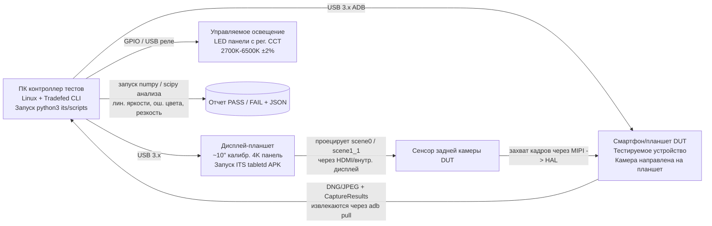

# Глава 27: Тестирование камеры

## Резюме

Вы создали приложение для камеры. Оно работает на вашем Pixel. Оно работает на вашем Galaxy. А будет ли оно работать на Android Go устройстве за 99 долларов с HAL уровня `LEGACY`, производитель которого неверно реализовал `CONTROL_AF_TRIGGER_START` и возвращает каждое значение `SENSOR_EXPOSURE_TIME` в *микросекундах* вместо наносекунд?

Тестирование ПО для камер состоит из двух частей: **валидация производителем на уровне HAL** (тесты, которые Google *заставляет* проходить каждого производителя, прежде чем устройство сможет поставляться с Google Play) и **тестирование приложения на CI** (тесты, которые вы запускаете для своего кода без необходимости в реальном оборудовании камеры). В этой главе рассматриваются обе части. Сначала вы узнаете, что на самом деле проверяет Camera ITS (Image Test Suite, часть CTS) на физических испытательных стендах: перечисление комбинаций потоков, линейность яркости физической сцены и слияние временных меток сенсора и гироскопа. Затем вы научитесь писать собственные инструментальные тесты с использованием моков Mockito для `CameraManager`/`CameraDevice`/`CaptureSession`, чтобы весь ваш стек камер работал на серверах CI без графического интерфейса, а также познакомитесь с паттерном параметризованных тестов, который подтверждает, что ваш код корректно деградирует на оборудовании `LEGACY`, а не вылетает с ошибкой.

Используйте **Android Camera Parameters** ([Google Play](https://play.google.com/store/apps/details?id=com.minininja.cameraparams), [GitHub](https://github.com/zoozooll/AndroidCameraParameters)) в качестве эталонного инструмента для проверки конкретных возможностей, которые должны подтверждать ваши тесты — приложение отображает каждый ключ `CameraCharacteristics`, который ITS также проверяет на реальных стендах.

---

## Часть первая: Как производители проверяют камеры — Camera ITS и CTS

Прежде чем устройство сможет поставляться с сервисами Google Mobile Services (GMS), оно должно пройти Android Compatibility Test Suite (CTS). Camera CTS состоит из двух половин: программных тестов CTS, которые запускаются через `Tradefed`, и Camera ITS (Image Test Suite), для которого требуется физическая испытательная лаборатория с автоматизированными стендами.

### Категории тестов

```mermaid
graph TB
    subgraph CTS[Android CTS — раздел Камера]
        direction TB
        CTS_API[Тесты API<br/>— ключи CameraCharacteristics<br/>— isSessionConfigurationSupported<br/>— корректное перечисление всех сценариев]
        CTS_FLOW[Тесты потока<br/>— open -> close<br/>— open -> session -> capture -> close<br/>— стресс-тест частого открытия/закрытия]
        CTS_V[CTS Verifier<br/>Ручные тесты на устройстве<br/>— плавность предпросмотра<br/>— качество захвата<br/>— переключение между камерами]
    end
    subgraph ITS[Camera ITS — Image Test Suite]
        direction TB
        ITS_COMBI[test_feature_combination<br/>Пермутации потоков x FPS x HDR<br/>Тысячи вызовов<br/>isSessionConfigurationSupported]
        ITS_SCENE[Тесты физических сцен<br/>scene0 (равномерный серый)<br/>scene1_1 (цветовая мишень)<br/>Автомат. планшет → тестируемое устр.]
        ITS_FUSION[Тест sensor_fusion<br/>Метки гироскопа должны совпадать с<br/>SENSOR_TIMESTAMP в CaptureResult<br/>допуск ±1 мс]
        ITS_3A[Тесты схождения 3A<br/>AE/AF/AWB должны сойтись в пределах<br/>N кадров при стандартном освещении]
        ITS_HDR[Тесты HDR / Ultra HDR<br/>валидность карты усиления JPEG_R<br/>измерение динамического диапазона]
    end
    CTS --> SHIP[(Поставка, если ВСЕ пройдены)]
    ITS --> SHIP

    style ITS_COMBI fill:#d9e6f2
    style ITS_SCENE fill:#d9f2e6
    style ITS_FUSION fill:#f2d9e6
    style CTS_API fill:#fff3cd
    style CTS_V fill:#fff3cd
```

Все, что показано на диаграмме, является обязательным. Если хотя бы *один* из этих тестов не проходит для одного ID камеры, устройство не поступает в продажу. Вот почему понимание ITS помогает вашему приложению: оно гарантирует базовый уровень, ниже которого не может опуститься ни один HAL, и точно документирует поведение, на которое вы можете полагаться.

### Архитектура испытательного стенда Camera ITS

Настоящая лаборатория Camera ITS выглядит так:



Ключевая деталь — это *замкнутый цикл*. Контроллер тестов точно знает, какие значения пикселей он приказал отобразить на планшете (например, равномерный серый цвет с интенсивностью 50% и точно известной цветовой температурой 6500K), а затем числовым способом проверяет, что выходные данные камеры DUT — как яркость пикселей в JPEG/DNG, так и сообщаемое значение `SENSOR_EXPOSURE_TIME` × `SENSOR_SENSITIVITY` в `CaptureResult` — соответствуют физическим входным данным в пределах допустимых отклонений.

#### `test_feature_combination`: Испытание перечислением

Самым продолжительным тестом ITS является `test_feature_combination`. Он перечисляет все допустимые размеры потоков из `SCALER_STREAM_CONFIGURATION_MAP`, все форматы (`PRIV`, `YUV`, `JPEG`, `RAW_SENSOR`, `JPEG_R`, `DEPTH`), все диапазоны FPS из `CONTROL_AE_AVAILABLE_TARGET_FPS_RANGES`, все комбинации *количества* выходных поверхностей (конфигурации сеансов с 1, 2, 3 выходами) и все флаги режимов HDR — затем вызывает `isSessionConfigurationSupported` для полученной конфигурации сеанса, захватывает по одному кадру для каждой поддерживаемой конфигурации и подтверждает, что кадр не поврежден. Общее количество комбинаций часто составляет 30 000 – 100 000 на каждый ID камеры.

Для вас как разработчика приложения вывод прост: **если `isSessionConfigurationSupported` возвращает `true` на устройстве, прошедшем CTS, эта комбинация потоков действительно работает в обоих направлениях.** Если возвращается `false`, не пытайтесь ее использовать. Полагайтесь на этот вызов, прежде чем переходить к меньшим размерам. Это тот же самый запрос, который CameraX использует внутри себя в селекторе разрешения.

#### Тесты физических сцен: Линейность экспозиции

Тесты scene0 и scene1_1 подтверждают, что *сообщаемая* камерой математика экспозиции соответствует ее *измеренному* выходу пикселей. Испытательный стенд проецирует равномерное серое поле (scene0) известной яркости `L` на DUT. Затем он выполняет перебор N различных пар `(SENSOR_EXPOSURE_TIME, SENSOR_SENSITIVITY)` из всего доступного диапазона, захватывает по одному кадру DNG для каждой пары и вычисляет среднее арифметическое значение пикселей `Y` по всей активной матрице сенсора.

Условие прохождения строго линейно:

```
Y_i / (EXPOSURE_TIME_i × SENSITIVITY_i) = constant ± допуск
```

для *всех* захваченных пар. Если произведение удваивается, яркость пикселей должна удвоиться. Если уменьшается вдвое — яркость должна уменьшиться вдвое. Любое отклонение выше ~1% в средних тонах приводит к провалу теста.

Почему это важно для вас: это гарантия того, что ваш ползунок ручной экспозиции (глава 14) дает математически предсказуемые результаты на CTS-совместимом устройстве. Если ваше приложение вычисляет «следующую пару ISO/экспозиция» для шага +1 EV, выходное изображение действительно будет на одну ступень ярче. На устройствах, несовместимых с CTS («серые» телефоны, кастомные прошивки без CTS), эта гарантия не действует, и интерфейс ручной экспозиции будет казаться сломанным.

#### `sensor_fusion`: Тест слияния временных меток

На этом тесте держится (или проваливается) электронная стабилизация изображения (EIS) и отслеживание дополненной реальности (AR). Пока DUT записывает видео, контроллер теста физически вращает телефон на моторизованном карданном подвесе с известной угловой скоростью. Одновременно он опрашивает гироскоп DUT через `SensorManager` с частотой 400 Гц+ и `CaptureResult.SENSOR_TIMESTAMP` камеры с частотой 30/60 кадров в секунду.

Условие прохождения: каждая временная метка гироскопа и каждая метка кадра `SENSOR_TIMESTAMP` должны находиться в одной и той же временной базе `CLOCK_MONOTONIC`, причем выборки гироскопа, интерполированные на время выборки камеры, должны соответствовать заданной угловой скорости подвеса с точностью до ±0,1 рад/с и ±1 мс.

Если этот тест не проходит, источник временных меток HAL неверен — обычно он смешивает `CLOCK_REALTIME` (астрономическое время, которое прыгает при синхронизации по NTP) с `CLOCK_MONOTONIC` (стабильное, монотонное время). Google отклоняет такое устройство. Для вас это означает, что вы можете смело передавать `CaptureResult.SENSOR_TIMESTAMP` непосредственно в вызов обновления изображения камеры ARCore без применения какого-либо кастомного смещения временных меток на любом GMS-сертифицированном устройстве.

### CTS Verifier: Ручные тесты пользователя

Не все можно автоматизировать. CTS Verifier — это приложение для устройства, которое специалист по тестированию использует для субъективных тестов:

- **Плавность предпросмотра:** 30 секунд панорамирования устройства; тестер оценивает воспринимаемую плавность по шкале 1–5. (Объективная телеметрия также фиксируется через дампы Choreographer.)
- **Качество захвата:** 5 фотографий стандартных сцен при стандартном освещении; тестер сравнивает их с эталонным устройством.
- **Переход при зуме между камерами:** При непрерывном зумировании 0,5×–10× не должно быть видимых скачков, артефактов или черных кадров между переключениями физических камер.
- **Качество HDR/JPEG_R:** Сравниваются SDR и HDR захваты одних и тех же сцен с заведомо качественными эталонными изображениями.

Это субъективные оценки, но планка публична. Если ваше приложение преследует аналогичные цели по UX (плавные переходы зума, захват HDR), вы можете воспроизвести те же процедуры тестирования в своей лаборатории контроля качества с тем же планшетным стендом для scene0/scene1_1.

---

## Часть вторая: Тестирование собственного приложения — инструментарий и моки

Тесты производителей проверяют HAL. Вам нужно проверять *свой* код. Типичная ошибка команд — требование реального телефона с работающей камерой на сервере CI. Не делайте так. С помощью `mock()` от Mockito + `ArgumentCaptor` любой класс Camera2 — `CameraManager`, `CameraDevice`, `CaptureSession`, `CaptureResult` — превращается в интерфейс или нефинальный класс, который чисто имитируется. Вы можете запустить весь свой конвейер камеры на CI на эмуляторе Linux x86 без графического интерфейса и без какого-либо оборудования камеры.

### Пример 1: Захват «кадра» и проверка того, что CaptureResult содержит ожидаемое EXPOSURE_TIME (AndroidTest с Mockito)

```kotlin
// app/src/androidTest/java/com/example/camera/CameraCaptureTest.kt
@RunWith(AndroidJUnit4::class)
@SmallTest
class CameraCaptureTest {

    @Test
    fun captureRequest_containsManualExposureTime_andResultEchoesIt() = runTest {
        // ---- Настройка (Arrange) ----
        val mockCameraManager = mock<CameraManager>()
        val mockCameraDevice = mock<CameraDevice>()
        val mockSession = mock<CameraCaptureSession>()
        val mockSurface = mock<Surface>()
        val testHandler = Handler(Looper.getMainLooper())

        val expectedExposureNs = 16_666_666L // 1/60 с
        val expectedIso = 400

        // Захват StateCallback, переданного в openCamera
        val deviceCallbackCaptor =
            argumentCaptor<CameraDevice.StateCallback>()
        whenever(mockCameraManager.openCamera(
            anyString(), deviceCallbackCaptor.capture(), any()
        )).thenAnswer { /* ничего не делаем; вызываем callback вручную */ }

        // Захват callback состояния сеанса
        val sessionCallbackCaptor =
            argumentCaptor<CameraCaptureSession.StateCallback>()
        whenever(mockCameraDevice.createCaptureSession(
            anyList<Surface>(),
            sessionCallbackCaptor.capture(),
            any()
        )).thenAnswer { /* ничего не делаем */ }

        // Захват CaptureCallback, переданного в capture()
        val captureCallbackCaptor =
            argumentCaptor<CameraCaptureSession.CaptureCallback>()
        whenever(mockSession.capture(
            any(), captureCallbackCaptor.capture(), any()
        )).thenReturn(1)

        // Создание тестируемой обертки камеры
        val cameraWrapper = YourCameraWrapper(mockCameraManager, testHandler)

        // ---- Действие (Act): запуск цепочки open → configure → capture ----
        cameraWrapper.open("0")
        // (Внутри YourCameraWrapper.open() вызван
        //  mockCameraManager.openCamera, который зафиксировал callback.)
        // Симуляция успешного ответа HAL:
        deviceCallbackCaptor.lastValue.onOpened(mockCameraDevice)

        cameraWrapper.createSession(listOf(mockSurface))
        sessionCallbackCaptor.lastValue.onConfigured(mockSession)

        val requestBuilder: CaptureRequest.Builder =
            mockCameraDevice.createCaptureRequest(CameraDevice.TEMPLATE_STILL_CAPTURE)
        // (Ваша обертка применяет ручные настройки здесь)
        requestBuilder.set(CaptureRequest.CONTROL_MODE,
                           CaptureRequest.CONTROL_MODE_OFF)
        requestBuilder.set(CaptureRequest.SENSOR_EXPOSURE_TIME,
                           expectedExposureNs)
        requestBuilder.set(CaptureRequest.SENSOR_SENSITIVITY,
                           expectedIso)

        val resultDeferred = async { cameraWrapper.capture(requestBuilder.build()) }

        // ---- Утверждение (Assert) 1: CaptureRequest, отправленный в HAL, имел правильные ключи ----
        val sentRequest: CaptureRequest = captureArg(mockSession, 0) {
            capture(any(), any(), any())
        }
        assertThat(sentRequest[CaptureRequest.SENSOR_EXPOSURE_TIME])
            .isEqualTo(expectedExposureNs)
        assertThat(sentRequest[CaptureRequest.SENSOR_SENSITIVITY])
            .isEqualTo(expectedIso)

        // ---- Действие (Act) 2: Симуляция возврата CaptureResult от HAL ----
        val mockResult = mock<TotalCaptureResult>().apply {
            whenever(get(CaptureResult.SENSOR_EXPOSURE_TIME))
                .thenReturn(expectedExposureNs)
            whenever(get(CaptureResult.SENSOR_SENSITIVITY))
                .thenReturn(expectedIso)
            whenever(frameNumber).thenReturn(1L)
        }
        captureCallbackCaptor.lastValue
            .onCaptureCompleted(mockSession, sentRequest, mockResult)

        // ---- Утверждение (Assert) 2: возвращенный оберткой результат захвата повторяет экспозицию ----
        val actual = resultDeferred.await()
        assertThat(actual.exposureTimeNanos).isEqualTo(expectedExposureNs)
        assertThat(actual.iso).isEqualTo(expectedIso)
    }
}
```

Паттерн всегда один и тот же:
1. `argumentCaptor` перехватывает обратный вызов, который должен был уйти в HAL.
2. Вызывается ваша обертка.
3. Вызывается метод успеха обратного вызова *так, как будто ответил HAL*.
4. Проверяются как входные данные (что ваша обертка отправила в HAL), так и выходные (что ваша обертка вернула вызывающей стороне).

Это работает на эмуляторе без камеры. Без «железа». Без нестабильности от освещения. 10 000 прогонов дают те же самые 10 000 успешных прохождений.

### Пример 2: Параметризованный тест — Устройства LEGACY должны корректно деградировать, а не вылетать

Каждое качественное приложение камеры должно работать на HAL уровня `LEGACY`. Самая частая ошибка — вызов `CaptureRequest.CONTROL_MODE_OFF` на устройстве `LEGACY`: HAL игнорирует его, но ваша обертка интерпретирует полученное `CaptureResult.CONTROL_AE_STATE == SEARCHING` как временную ошибку и пытается бесконечно перезапустить AE, что в итоге приводит к ANR.

Параметризуйте свои тесты по уровню `INFO_SUPPORTED_HARDWARE_LEVEL`:

```kotlin
@RunWith(Parameterized::class)
class HardwareLevelGracefulDegradationTest(
    private val hardwareLevel: Int,
    private val hardwareLevelName: String
) {
    companion object {
        @JvmStatic
        @Parameterized.Parameters(name = "{1}")
        fun data() = listOf(
            arrayOf(CameraCharacteristics.INFO_SUPPORTED_HARDWARE_LEVEL_LEGACY,
                    "LEGACY"),
            arrayOf(CameraCharacteristics.INFO_SUPPORTED_HARDWARE_LEVEL_LIMITED,
                    "LIMITED"),
            arrayOf(CameraCharacteristics.INFO_SUPPORTED_HARDWARE_LEVEL_FULL,
                    "FULL"),
            arrayOf(CameraCharacteristics.INFO_SUPPORTED_HARDWARE_LEVEL_3,
                    "LEVEL_3"),
        )
    }

    @Test
    fun requestManualExposure_onAnyHardwareLevel_doesNotCrash_orHang() = runTest {
        val mockCameraManager = mock<CameraManager>()
        val mockChars = mock<CameraCharacteristics>()
        whenever(mockChars.get<Int>(
            CameraCharacteristics.INFO_SUPPORTED_HARDWARE_LEVEL
        )).thenReturn(hardwareLevel)
        whenever(mockCameraManager.getCameraCharacteristics("0"))
            .thenReturn(mockChars)

        val wrapper = YourCameraWrapper(mockCameraManager, testHandler)
        wrapper.open("0")
        // ... (подготовка сеанса, как раньше, опущена)

        val job = launch {
            wrapper.setManualExposure(iso = 400, exposureNs = 8_000_000L)
        }

        // Нет зависания — выполнение должно завершиться в пределах таймаута даже на LEGACY
        withTimeoutOrNull(2_000) { job.join() }
            ?: fail("setManualExposure завис на оборудовании $hardwareLevelName")

        // Исключение не просочилось в необработанные
        assertThat(job.isCancelled).isFalse()
    }
}
```

Запускайте это при каждой сборке. Это занимает 400 мс. Это позволяет отловить именно тот класс зависаний HAL `LEGACY`, который иначе проявился бы в отчетах Play Console об ошибках спустя месяцы.

### AndroidTest на реальном железе: Проверка правильности EXPOSURE_TIME

Для ночных прогонов на небольшой ферме реальных телефонов напишите короткий AndroidTest, который открывает *настоящую* камеру, захватывает один кадр RAW и подтверждает, что `CaptureResult.SENSOR_EXPOSURE_TIME` отклонился не более чем на 5% от запрошенного значения. Это защищает от регрессий HAL в конкретных сборках ОС:

```kotlin
@RunWith(AndroidJUnit4::class)
@RequiresDevice
@LargeTest
class RealHardwareCaptureSanityTest {

    @Test
    fun realCapture_exposureTimeIsWithin5PercentOfRequested() = runTest {
        val context = InstrumentationRegistry.getInstrumentation().context
        val camManager = context.getSystemService(Context.CAMERA_SERVICE)
            as CameraManager
        val chars = camManager.getCameraCharacteristics("0")
        assumeTrue(
            "Требуется уровень FULL или LEVEL_3 для ручной экспозиции",
            chars[CameraCharacteristics.INFO_SUPPORTED_HARDWARE_LEVEL] in
            setOf(
                CameraCharacteristics.INFO_SUPPORTED_HARDWARE_LEVEL_FULL,
                CameraCharacteristics.INFO_SUPPORTED_HARDWARE_LEVEL_3,
            )
        )

        // ... открытие камеры, создание сеанса ImageReader (PRIVATE или YUV), захват
        // одного ручного кадра с известной экспозицией с помощью оберток из
        // корутин главы 26 ...

        val requestedNs = 10_000_000L // 1/100 с
        val result: TotalCaptureResult =
            cameraWrapper.captureManualExposure(requestedNs, iso = 200)

        val actualNs = result[CaptureResult.SENSOR_EXPOSURE_TIME]!!
        val tolerancePct = abs(actualNs - requestedNs) * 100.0 / requestedNs
        assertThat(tolerancePct)
            .withFailMessage(
                "Запрошено %d нс, получено %d нс (отклонение %$.1f%% >5%%)",
                requestedNs, actualNs, tolerancePct
            )
            .isLessThan(5.0)
    }
}
```

Этот тест по своей природе нестабилен (flaky), так как зависит от реального оборудования. Но он ловит именно тот класс обновлений ПО от производителей, которые незаметно ломают ручную экспозицию на флагманских устройствах. Запускайте его по ночам на своей ферме из 5–10 устройств; сигнал стоит этого шума.

---

## Резюме

Тестирование камер делится на валидацию производителей и валидацию приложений. Производители должны проходить CTS и Camera ITS — аппаратно-зависимый набор тестов, который проверяет поддержку комбинаций потоков (через тысячи вызовов `isSessionConfigurationSupported`), линейность яркости в плоскости экспозиция × чувствительность и согласование временных меток сенсора и гироскопа для EIS и AR. Приложения тестируются с помощью инструментария: Mockito имитирует каждый класс Camera2, `ArgumentCaptor` перехватывает обратные вызовы HAL, вы запускаете их вручную и проверяете как запрос, так и результат без использования реального оборудования, что позволяет запускать тесты на CI в эмуляторах. Параметризуйте тесты своих оберток для каждого уровня `INFO_SUPPORTED_HARDWARE_LEVEL` (особенно для `LEGACY`), чтобы гарантировать корректную деградацию функций, и запускайте небольшой набор санитарных тестов `@RequiresDevice @LargeTest` на ферме реальных устройств, чтобы отслеживать регрессии после обновлений ОС.

## Что дальше

Вы освоили публичное API Camera2 от Kotlin до нативного NDK, обернули его в корутины и подтвердили работоспособность тестами. Но что на самом деле происходит «под капотом», когда вы вызываете `CameraManager.openCamera`? Что такое HAL3? Где на самом деле проходит граница IPC Binder? И как `CameraDeviceSetup` (Android 15, API 35) меняет архитектуру, отделяя запросы возможностей от питания сенсора? Глава 28 — это грандиозный финал архитектуры: полный стек от кода приложения до мотора звуковой катушки VCM в оправе объектива.
