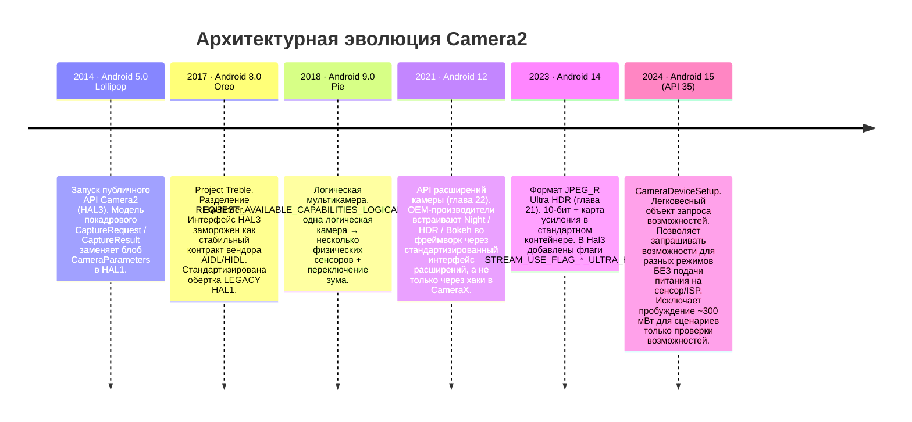

# Глава 28: Архитектура Camera2

## Резюме

Это глава, которую вы заслужили. В главах 1–27 вы использовали `CameraManager`, `CameraCharacteristics`, `CaptureRequest`, `CaptureResult`, `CameraCaptureSession`, `ImageReader`, CameraX, нативный стек NDK, обертки на корутинах и моки для тестов. Вы знаете все публичные поверхности API. Теперь мы слой за слоем снимем все абстракции, начиная от написанной вами строки кода на Kotlin и заканчивая отдельными электронами, пересекающими шину MIPI CSI-2 между сенсором и SoC, мотором звуковой катушки, сдвигающим линзу на 10 микрометров, и контроллером вспышки, выдающим импульс ксенонового или светодиодного стробоскопа в микросекундной синхронизации с подвижным затвором сенсора.

К концу этой главы вы сможете взглянуть на любой запрос `CaptureRequest` и сопоставить, слой за слоем, куда идет каждая его часть, кто ее транслирует, кто валидирует и кто, наконец, исполняет ее на кремнии. Вы также поймете абстракцию `CameraDeviceSetup` из Android 15 (API 35) как пример десятилетнего архитектурного тренда: постепенного отделения *запросов возможностей* от *состояний питания оборудования*, чтобы приложения могли опрашивать камеру, не тратя ~300 мВт, необходимых для включения сенсора и ISP.

Чтобы проверить точные возможности любого реального устройства и сопоставить их с описанными здесь уровнями архитектуры, установите **Android Camera Parameters** ([Google Play](https://play.google.com/store/apps/details?id=com.minininja.cameraparams), [GitHub](https://github.com/zoozooll/AndroidCameraParameters)). Оно считывает каждый ключ `CameraCharacteristics`, который нижние уровни открывают для публичного API.

---

## Диаграмма полного стека слоев

Это самая важная диаграмма во всей книге. Каждый слой, начиная отсюда и ниже, представляет собой реальный код с реальным путем в проекте Android Open Source Project (AOSP), реальным владельцем и реальной границей вызова Binder или функции. Мы пройдемся по каждому слою сверху вниз, затем покажем эволюцию стека за последнее десятилетие и сопоставим ваш путь обучения с этими слоями.

```mermaid
graph TB
    subgraph APP["Слой приложения (ваш код)"]
        direction TB
        A1["Kotlin / Java / C++ NDK<br/>cameraManager.openCamera(id, cb, handler)<br/>session.capture(request, cb, handler)<br/>captureResult.get(SENSOR_EXPOSURE_TIME)"]
    end
    subgraph FRAME["Слой Java/Kotlin Framework — android.hardware.camera2.*"]
        direction TB
        F1["CameraManager · CameraCharacteristics<br/>CaptureRequest.Builder · CaptureResult<br/>CameraDevice · CameraCaptureSession"]
        F2["CameraBinderWrapper (AOSP frameworks/base)<br/>Транслирует Java объекты → AIDL Binder parcel"]
    end
    subgraph BIND["Слой IPC — Binder / HwBinder"]
        direction TB
        B1["AIDL ICameraService (AOSP)<br/>Framework ↔ CameraService"]
        B2["HIDL / AIDL HAL Binder (Treble)<br/>CameraService ↔ Vendor HAL"]
    end
    subgraph NS["Нативный слой Mediaserver (system/bin/cameraserver)"]
        direction TB
        N1["CameraService (frameworks/av/services/camera/)"]
        N2["Camera3Device<br/>frameworks/av/services/camera/libcameraservice/device3/<br/>— Валидирует запрос по выходам сеанса<br/>— Создает camera3_capture_request_t<br/>— Разбирает camera3_capture_result_t"]
        N3["CameraProviderManager (frameworks/av)<br/>Перечисляет реализации вендорных HAL"]
    end
    subgraph HAL["Слой Vendor HAL (код OEM / SoC)"]
        direction TB
        H1["Интерфейс HAL3: camera3_device_t<br/>— process_capture_request()<br/>— process_capture_result()<br/>— flush()"]
        H2["Обертка HAL1 (Legacy)<br/>camera2compat::Camera2Compat<br/>Транслирует запрос HAL3 → HAL1 CameraParameters<br/>для уровня < LIMITED"]
        H3["Реализация вендора<br/>Qualcomm QCamera2 · MediaTek CamHAL · Samsung Exynos Camera HAL"]
    end
    subgraph K["Слой ядра (Linux)"]
        direction TB
        K1["/dev/videoX — драйвер видеозахвата V4L2<br/>VIDIOC_S_FMT · VIDIOC_REQBUFS · VIDIOC_QBUF / DQBUF"]
        K2["Драйвер ISP (Qualcomm CAMSS / MediaTek ISP Driver)<br/>Узел V4L2 m2m для обработки memory-to-memory"]
        K3["Драйвер Sensor Subdev<br/>Записи I2C для режима / экспозиции / усиления / VCM"]
        K4["Драйвер приемника MIPI CSI-2 (SoC)<br/>Конфигурация линий, переходы LP/HS, проверка ECC/CRC"]
    end
    subgraph HW["Слой физического оборудования"]
        direction TB
        HW1["Блок линз<br/>Мотор звуковой катушки VCM (I2C)<br/>Двигает группу линз для фокуса / OIS"]
        HW2["Матрица пикселей сенсора камеры<br/>CMOS сенсор (Sony IMX / Samsung ISOCELL / OmniVision)<br/>Экспозиция → Чтение → A/D"]
        HW3["Физическая шина MIPI CSI-2<br/>2/4/8 дифференциальных пар на 1.5 – 2.5 Гбит/с на линию"]
        HW4["ISP Процессор сигналов изображения (на SoC)<br/>Демозаика · Шумоподавление · Резкость · HDR слияние · Детекция лиц в железе"]
        HW5["Контроллер вспышки LED (I2C)<br/>Ксеноновый стробоскоп или светодиодный драйвер<br/>Синхронизирован с пином сенсора EXRST"]
    end

    APP -->|вызов функции| FRAME
    FRAME -->|пакет AIDL| BIND
    BIND -->|HwBinder| NS
    NS -->|HAL3 AIDL/HIDL| HAL
    HAL -->|системные вызовы ioctl()| K
    K -->|записи I2C + сигналы MIPI + очереди команд ISP| HW

    style APP fill:#e6d9f2
    style FRAME fill:#d9e6f2
    style BIND fill:#fff3cd,stroke:#ffc107,stroke-width:2px
    style NS fill:#d9f2e6
    style HAL fill:#f2d9e6
    style K fill:#e6d9e6
    style HW fill:#f2e6d9,stroke:#d4a373,stroke-width:2px
```

Теперь пройдемся сверху вниз.

---

## Уровень 1 — Слой приложения (Ваш код)

Это код, который вы написали. `cameraManager.openCamera(id, stateCallback, cameraHandler)`. Вы знаете этот уровень наизусть. Два факта, которые вы могли не осознать до конца:
- Каждый вызов `CaptureRequest.Builder.set(key, value)`, который вы делаете, добавляет *запись метаданных с тегом* в структуру, которая в точности повторяет C-структуру `camera_metadata_t` в `system/media/camera/include/system/camera_metadata.h`. Между вашим `CaptureRequest` на Kotlin и запросом HAL нет магической трансформации — это один и тот же бинарный формат метаданных, просто обернутый в разные языковые привязки.
- Каждый вызов `CaptureResult.get(key)`, который вы делаете, считывает именно те байты, которые HAL записал в буфер ответа. Если HAL неверно сообщает время экспозиции в конкретной сборке прошивки, ваше приложение считывает именно это неверное значение. Над HAL нет уровня валидации фреймворка, исправляющего ошибки вендора. Вот почему существует санитарный тест на реальном оборудовании из главы 27.

---

## Уровень 2 — Слой Java/Kotlin Framework (`android.hardware.camera2.*`)

Слой фреймворка (AOSP `frameworks/base/core/java/android/hardware/camera2/`) делает только две вещи:
1. Открывает поверхность публичного API (`CameraManager`, `CameraDevice` и т. д.), которую вы вызываете.
2. Транслирует Java-объекты `CaptureRequest` / `CaptureResult` в их представления для передачи через Binder и обратно.

Он не применяет никаких политик сверх HAL. Он не переписывает метаданные. Он не «исправляет» запросы. Это тонкий уровень трансляции плюс кэш для неизменяемого блоба `CameraCharacteristics`, извлекаемого один раз для каждого ID камеры при загрузке устройства.

Граница Binder находится в AIDL `CameraManager` → `ICameraService`, который является следующим уровнем.

---

## Уровень 3 — Слой IPC: Binder / HwBinder (Treble)

Это критически важный архитектурный контракт, который закрепил Project Treble (Android 8.0, 2017). Задействованы два домена Binder:

| Домен Binder      | Соединяет                                             | Протокол        | Кто обеспечивает стабильность ABI |
|-------------------|-------------------------------------------------------|-----------------|-----------------------------------|
| `/dev/binder`     | Framework ↔ cameraserver (сторона system_server)      | AIDL            | Платформа (сборка одного раздела) |
| `/dev/hwbinder`   | cameraserver ↔ вендорный camera HAL                   | HIDL / AIDL HAL | Treble (стабильный вендорный инт.)|

До Treble HAL представлял собой `.so` библиотеку, загружаемую через dlopen напрямую в процесс `cameraserver`. Каждое обновление от производителя требовало пересборки камеры и фреймворка вместе. Разделение через HwBinder в Treble означает, что вендорный HAL — это собственный процесс, собственный раздел, собственный 3-летний цикл обновлений безопасности, а контракт между ним и `cameraserver` версионирован и заморожен на весь срок службы устройства. Для вас как для разработчика приложений это самая главная причина, по которой поведение API Camera2 предсказуемо при обновлениях: интерфейс HAL буквально не может измениться без нарушения теста на соответствие Treble.

Обертка LEGACY HAL1 живет ниже этой границы, внутри процесса вендорного HAL, поэтому она невидима для вас на уровне приложения, за исключением уровня `INFO_SUPPORTED_HARDWARE_LEVEL_LEGACY`.

---

## Уровень 4 — Нативный слой Mediaserver: `CameraService` / `Camera3Device`

`/system/bin/cameraserver` — это нативный демон, запускаемый при загрузке скриптом `init.rc`. Он работает всегда, владеет каждой открытой камерой на устройстве и является единственным арбитром того, какое приложение получает доступ к камере (побеждает приложение, находящееся на переднем плане; все остальные отключаются).

Два его самых важных класса:

1. **`CameraService`** (`frameworks/av/services/camera/libcameraservice/CameraService.cpp`):
   - Предоставляет AIDL `ICameraService` для фреймворка.
   - Обеспечивает проверку разрешения `android.permission.CAMERA` для каждого вызова binder (вызов приложения без разрешения CAMERA отклоняется в `cameraserver` еще до достижения HAL).
   - Управляет арбитражем одновременного открытия (два приложения запрашивают одну камеру → получает активное приложение; фоновое приложение получает `onDisconnected`).
   - Управляет `CameraProviderManager` для перечисления модулей вендорных HAL.

2. **`Camera3Device`** (`frameworks/av/services/camera/libcameraservice/device3/Camera3Device.cpp`):
   - Сердце конвейера.
   - Валидирует, что каждая выходная поверхность в запросе на захват действительно является частью настроенного набора выходов сеанса. (Именно здесь фреймворк выбрасывает `IllegalArgumentException: Surface not in configured outputs`.)
   - Упаковывает ваш переданный `CaptureRequest` в структуру HAL3 `camera3_capture_request_t`.
   - Потоково передает запросы один за другим в HAL через `process_capture_request(request)`.
   - Получает `camera3_capture_result_t` обратно от HAL, упаковывает метаданные и барьеры (fences) и пересылает их обратно по цепочке Binder в ваш `CaptureCallback.onCaptureCompleted`.
   - Обрабатывает за вас `flush()`, пути ошибок, обратные вызовы затвора и ошибок `notify()`, а также барьеры высвобождения выходного буфера для взаимодействия EGL/Vulkan.

`Camera3Device` — это около 15 000 строк кода на C++, и это самая тщательно протестированная часть всего стека (тесты CTS из главы 27 нацелены непосредственно на поведение `Camera3Device` со стороны фреймворка). Если вы когда-нибудь прочитаете отчет об ошибке, в котором говорится, что «этот ключ запроса работает в Camera2 NDK, но не в Java Camera2», расхождение почти всегда связано с отсутствующим путем валидации или преобразования внутри `Camera3Device`.

---

## Уровень 5 — Слой Vendor HAL: HAL3 (`camera3_device_t`)

Здесь на самом деле живет дифференциация производителей. Каждый производитель SoC поставляет собственную реализацию HAL3:

| Вендор       | Кодовое имя HAL                           | Интерфейс AOSP                              |
|--------------|-------------------------------------------|----------------------------------------------|
| Qualcomm     | QCamera2 / QCamera3 (код mm-camera)       | `camera3_device_t` + расширения `vendor.qti.hardware.camera*` |
| MediaTek     | CamHAL (mtkcam)                           | Тот же `camera3_device_t` + расширения MediaTek |
| Samsung      | Exynos Camera HAL                         | Тот же `camera3_device_t` + расширения Samsung |
| Google Tensor| Google Camera HAL (Pixels)                | Тот же `camera3_device_t` + кастомная логика Google для Night Sight / Computational Raw |

Контракт HAL3 (определенный в `hardware/libhardware/include/hardware/camera3.h`) — это ровно четыре основные операции на открытом устройстве:

```cpp
// Упрощенный контракт HAL3 — это весь интерфейс
typedef struct camera3_device {
    hw_device_t common;

    int (*configure_streams)(
        const struct camera3_device *,
        camera3_stream_configuration_t *stream_list
    );

    int (*process_capture_request)(
        const struct camera3_device *,
        camera3_capture_request_t *request
    );

    void (*get_metadata_vendor_tag_ops)(...);

    int (*flush)(const struct camera3_device *);

    void (*dump)(...);
} camera3_device_t;
```

HAL получает запросы, выдает результаты и выходные буферы. На этом всё. Модель запрос/ответ — это визитная карточка HAL3. HAL1 представлял собой единый текстовый блоб `CameraParameters` (`"preview-size=1920x1080;picture-size=..."`), который вся индустрия ненавидела за отсутствие покадрового управления. Модель запрос/ответ HAL3 — это то, что *позволяет* реализовать каждую продвинутую функцию, которую вы использовали в этой книге: покадровую ручную экспозицию, захват RAW, физические потоки нескольких камер, переобработку, входные поверхности ZSL. Всё это было невозможно в HAL1.

### Обертка LEGACY HAL1

`INFO_SUPPORTED_HARDWARE_LEVEL_LEGACY` означает, что вендор *до сих пор* поставляет только библиотеку HAL1 `.so`, а устройство использует прослойку AOSP `camera2compat::Camera2Compat` для трансляции вызовов запрос/ответ HAL3 обратно в старый блоб `CameraParameters` + точки входа HAL1 `startPreview()`/`takePicture()`. Этот уровень трансляции является причиной того, почему в главе 24 мы предупреждали, что `CONTROL_MODE_OFF` молча ничего не делает на устройствах `LEGACY` — в HAL1 просто нет концепции покадрового `CONTROL_MODE`, в которую можно было бы выполнить трансляцию. Прослойка просто отбрасывает эту запись метаданных.

---

## Уровень 6 — Слой ядра: V4L2 + MIPI CSI-2 + драйверы сенсоров

Процесс HAL3 обращается к ядру Linux исключительно через системные вызовы `ioctl()` к узлам устройств. Для обработки одного кадра взаимодействуют четыре категории драйверов ядра:

1. **Драйвер приемника MIPI CSI-2** (`/dev/v4l-subdevX`): Настраивает количество линий PHY и скорость передачи данных, обрабатывает переходы из режима пониженного энергопотребления (Low-Power) в режим высокой скорости (High-Speed) на дифференциальных парах, проверяет ECC/CRC пакетов и передает полученные строки пикселей через DMA во входной кольцевой буфер ISP. Вы никогда не касаетесь этого драйвера из пространства пользователя. Ошибка CRC в CSI-2 проявляется для вас как поврежденный выходной буфер с соответствующим статусом `camera3_stream_buffer_t.status == BUFFER_ERROR`.

2. **Драйвер Sensor Subdev** (`/dev/v4l-subdevY`, управление через I2C):
   - Записывает регистры сенсора через I2C (медленная шина ~100 кГц, поэтому изменения экспозиции и переключение режимов имеют задержку в 2-3 кадра даже для устройств `HARDWARE_LEVEL_3`).
   - Устанавливает время экспозиции (старт/стоп подвижного затвора для каждого кадра), аналоговое усиление, цифровое усиление, разрешение, режим бинирования.
   - Управляет фокусом VCM через ЦАП со стороны I2C, который подает ток в звуковую катушку (см. слой HW).
   - Управляет синхронизацией стробоскопа вспышки через выходной пин EXRST на стороне сенсора, который слушает контроллер вспышки.

3. **Узел видеозахвата V4L2** (`/dev/video0` и т. д.): HAL вызывает `VIDIOC_REQBUFS` для выделения буферов, поддерживаемых gralloc (те же самые дескрипторы `AHardwareBuffer`, которые вы импортировали в Vulkan в главе 25), затем вызывает `VIDIOC_QBUF` (постановка буфера в очередь) в цикле. По мере поступления кадров от приемника CSI-2 + ISP, HAL вызывает `VIDIOC_DQBUF` (извлечение буфера из очереди) и отправляет его в `Camera3Device` как `camera3_stream_buffer_t`.

4. **Драйвер ISP Memory-to-Memory** (узел `/dev/videoN m2m`): Отдельно от пути захвата HAL ставит входные буферы переобработки (для ZSL, глава 23) в очередь ISP m2m для запуска демозаики, шумоподавления, слияния HDR или детекции лиц на ранее захваченных кадрах RAW. Результат выдается в виде обработанного выходного буфера JPEG/YUV/PRIVATE.

---

## Уровень 7 — Слой физического оборудования

Наконец, электроны. Каждый уровень выше — это код, исполняемый на SoC. Уровень оборудования — это место, где фотоны преобразуются в электроны и обрабатываются:

```mermaid
graph LR
    LENS["Блок линз<br/>Стеклянные элементы<br/>фокусное расст. ~10–20 мм"] --> VCM["Мотор звуковой катушки VCM<br/>I2C ЦАП → ток катушки →<br/>смещение линзы ±50 мкм<br/>Фокус + стабилизация OIS"]
    VCM --> SENSOR[Матрица пикселей CMOS сенсора<br/>Sony IMX / Samsung ISOCELL<br/>~12 Мп – 200 Мп<br/>подвижный затвор: чтение построчно<br/>Глобальный затвор (редко)]
    SENSOR -->|A/D конв. 10/12/14-бит Bayer| CSI[MIPI CSI-2 PHY<br/>2/4/8 пар<br/>до 20 Гбит/с суммарно]
    CSI -->|внутреннее соединение SoC| ISP[ISP — на кристалле SoC<br/>Демозаика · CCM · NR · статистика 3A · слияние HDR<br/>часто 1+ TOPS DNN для лиц/сегментации]
    ISP -->|Буферы Gralloc → DRAM| CPU[CPU / GPU<br/>Процесс вашего прилож. читает их]
    FLASH["Вспышка LED / Ксенон<br/>I2C контроллер вспышки<br/>Синхрон. по пину сенсора EXRST"] --> SENSOR
```

Каждая физическая подсистема:
- **Линза и VCM**: Смещение линзы на 10 мкм — это один шаг автофокусировки. OIS (оптическая стабилизация изображения) добавляет замкнутый цикл обратной связи по гироскопу к VCM, подталкивая линзу 500–5000 раз в секунду, чтобы компенсировать дрожание рук. Драйвер ядра записывает значения ЦАП I²C; ваше приложение управляет этим через ключи метаданных `LENS_FOCUS_DISTANCE` и `LENS_OPTICAL_STABILIZATION_MODE`.
- **Матрица пикселей сенсора**: Фотодиоды накапливают заряд, пропорциональный количеству падающих фотонов. Чтение происходит с подвижным затвором (построчно сверху вниз), поэтому ваш слайдер AE в главе 14 имел задержку в 2-3 кадра — экспозиция для кадра N программируется во время чтения кадра N-1.
- **Шина MIPI CSI-2**: Дифференциальные пары со скоростью до 2,5 Гбит/с на линию × 8 линий = 20 Гбит/с в сыром виде. Более чем достаточно для 4K 60 кадров в секунду 12-бит Bayer. Ошибки пакетов вызывают повторную передачу CRC на аппаратном уровне, но поврежденный кадр доходит до вас как `BUFFER_ERROR`.
- **ISP**: Невоспетый герой. Его аппаратная часть для демозаики + шумоподавления + повышения резкости работает на скорости 1+ гигапиксель/с и избавляет ваш CPU от этой работы. На современных SoC Tensor / Snapdragon он также запускает ускорители DNN для сегментации сцен, детекции лиц и слияния HDR в сенсоре еще до того, как CPU увидит кадр.
- **Контроллер вспышки**: Импульс вспышки должен сработать *точно во время* окна экспозиции подвижного затвора того кадра, который он должен осветить. Бит `FLASH_STATE_FIRED` в `CaptureResult` подтверждает синхронизацию; рассинхронизация приводит к частично экспонированным кадрам.

---

## Архитектурная эволюция: Camera2 в разных версиях Android

Camera2 строилась не за один день. Каждые 2-3 версии Android добавляли новый архитектурный примитив, открывавший реальные возможности для разработчиков:



Тенденция в каждом выпуске ясна: **дезагрегация и отделение (decoupling)**.
- Android 8 отделил HAL от фреймворка (Treble).
- Android 9 отделил логический ID камеры от физических сенсоров.
- Android 12 отделил OEM-расширения от кода приложения.
- Android 14 отделил кодирование HDR от конвейера RAW.
- **`CameraDeviceSetup` в Android 15 отделяет запросы возможностей от питания оборудования.**

### В центре внимания: `CameraDeviceSetup` в Android 15 — Архитектурное отделение в действии

`CameraDeviceSetup` (Android 15, API 35) — это чистейший пример этого тренда. До API 35, если приложение хотело узнать «поддерживается ли эта комбинация потоков 4K@60 с анализом YUV_420_888 одновременно?», единственным способом вызвать `isSessionConfigurationSupported` был экземпляр `CameraCharacteristics`, полученный через `CameraManager.getCameraCharacteristics(id)`. Внутри это заставляло HAL подавать питание на сенсор (≈250–350 мВт) и ISP на несколько миллисекунд только для того, чтобы прочитать таблицу возможностей, которая фактически статична для всего срока службы устройства. Для приложения с ограниченным энергопотреблением это было неприемлемо для любого UX «предполетной проверки функций».

`CameraDeviceSetup` исправляет это, предоставляя легковесное представление, не требующее питания:

```kotlin
// Требуется API 35+
val setup: CameraDeviceSetup = cameraManager.getCameraDeviceSetup(cameraId)
val supported: Boolean = setup.isSessionConfigurationSupported(sessionConfig)
// getCameraDeviceSetup() НЕ подает питание на сенсор или ISP
// Результат может быть кэширован на все время работы устройства
```

Архитектурно таблица возможностей теперь живет в заранее полученном, подписанном, независимом от разделов блобе в разделе vendor, и `getCameraDeviceSetup` считывает его через отдельный вызов HwBinder, который полностью пропускает последовательность включения питания `Camera3Device`. Это направление следующего десятилетия: *каждое* API, на которое можно ответить статически, со временем получит легковесный аналог, не требующий питания. Ожидайте, что `CameraDeviceSetup` получит еще больше запросов возможностей в Android 16+.

---

## Путь читателя, сопоставленный со слоями архитектуры

Наконец, сопоставьте свой собственный путь по этой книге со слоями архитектуры. Каждая глава соответствует конкретному уровню или границе интерфейса:

```mermaid
flowchart TB
    subgraph Journey["Ваш путь по этой книге (Главы → Слои)"]
        direction LR
        C1["Гл. 1–4<br/>Основы<br/>Концепции слоя оборудования"] ~~~ H_L1["↔ Слой HW"]
        C2["Гл. 5–9<br/>Первое прилож. Camera2<br/>CameraManager · Сеанс · ImageReader"] ~~~ H_L2["↔ Приложение + Framework"]
        C3["Гл. 10–12<br/>Конвейер · Типы захвата<br/>Глубокое погружение в Characteristics"] ~~~ H_L3["↔ Метаданные parcel + контракт HAL3"]
        C4["Гл. 13–17<br/>Ручные 3A · Экспоз. · Фокус · WB"] ~~~ H_L4["↔ Ключи метаданных → HAL3 → драйвер I²C"]
        C5["Гл. 18–23<br/>RAW · HDR · Multi-Cam · ZSL · Расшир."] ~~~ H_L5["↔ Модель запроса HAL3 · переобработка ISP m2m"]
        C6["Гл. 24 CameraX<br/>Фасад UseCase + Interop"] ~~~ H_L6["↔ Абстракция над Framework на стороне прил."]
        C7["Гл. 25 Нативный NDK<br/>ACamera + AHB → Vulkan"] ~~~ H_L7["↔ Прослойка NDK прямо над Camera3Device"]
        C8["Гл. 26 Корутины/Flow<br/>Асинхр. обертка обратных вызовов"] ~~~ H_L8["↔ Асинхр. слой прил. вокруг границ Binder"]
        C9["Гл. 27 Тестирование ITS/CTS<br/>Моки против реального железа"] ~~~ H_L9["↔ Валидация каждого слоя через тесты"]
        C10["Гл. 28 ЭТА ГЛАВА<br/>Полный стек архитектуры"] ~~~ H_L10["↔ ВСЕ слои, от конца до конца"]
    end
    H_L1 --> HW
    H_L2 --> FRAME
    H_L3 --> HAL
    H_L4 --> K
    H_L5 --> HAL
    H_L6 --> APP
    H_L7 --> NS
    H_L8 --> APP
    H_L9 --> BIND
    H_L10 --> HW
```



Прочитав эту главу последней, вы сопоставили архитектуру с практикой. Вы не изучали HAL3 абстрактно в первый день, пытаясь применить его к реальному коду. Вы учились на *практике*: открыть → настроить → захватить → результат на протяжении 27 глав, а затем приоткрыли занавес, чтобы увидеть, кто на самом деле отвечал на каждый из этих вызовов.

---

## Резюме

Camera2 — это семислойный стек: Приложение → Framework (Java/Kotlin `android.hardware.camera2.*`) → IPC Binder/HwBinder → Нативные `CameraService` + `Camera3Device` → Vendor HAL3 (`camera3_device_t` с оберткой LEGACY HAL1) → Драйверы ядра V4L2 (MIPI CSI-2, захват, ISP m2m) → Физическое оборудование (линза/VCM, сенсор, шина MIPI, ISP, контроллер вспышки). Project Treble закрепил контракт HAL через HwBinder, обеспечив долгосрочную стабильность. Десятилетний архитектурный тренд — постепенное разделение функций, кульминацией которого стал `CameraDeviceSetup` в Android 15, позволяющий запрашивать возможности без включения питания сенсора. Теперь вы сопоставили каждую функцию — от ручного ISO в главе 14 до ZSL в главе 23 и нативного Vulkan с нулевым копированием в главе 25 — с конкретным слоем, который ее исполняет.

## Что дальше: Часть VII — Энциклопедия метаданных камеры

Это завершает часть VI: Современная разработка камер для Android. Оставшийся фронтир — это подробный энциклопедический справочник по каждому ключу метаданных `CameraCharacteristics`, `CaptureRequest` и `CaptureResult`, которые вы использовали во всех 28 главах. Часть VII — это энциклопедия метаданных: SENSOR, LENS, CONTROL, SCALER, REQUEST — каждый тег определен, объяснен, запрошен, сверен с реальными устройствами и валидирован через приложение Android Camera Parameters. Открывайте ее, когда вам нужно точно знать, что означает `SCALER_CROPPING_TYPE`, какие устройства поддерживают `REQUEST_AVAILABLE_CAPABILITIES_OFFLINE_PROCESSING` или как конкретный ключ на самом деле ведет себя в HAL уровня `LEGACY`.
