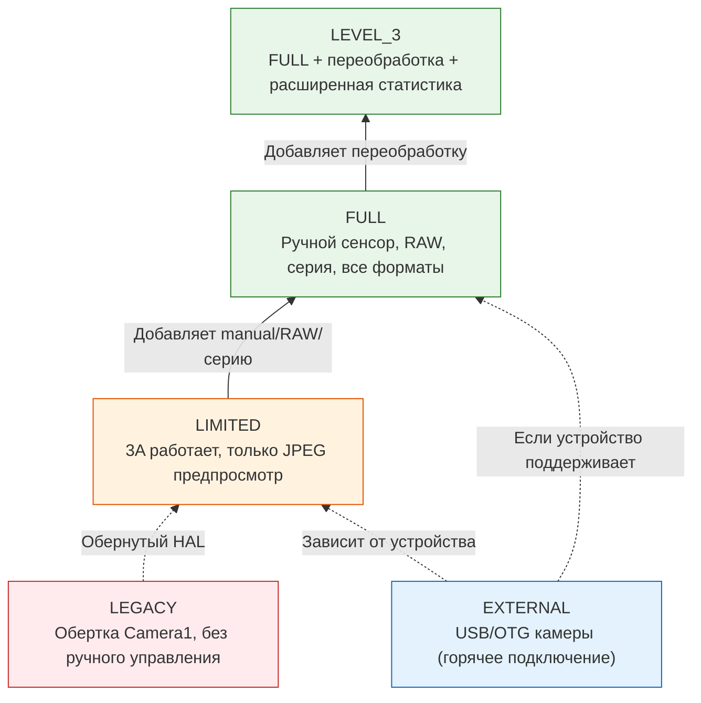
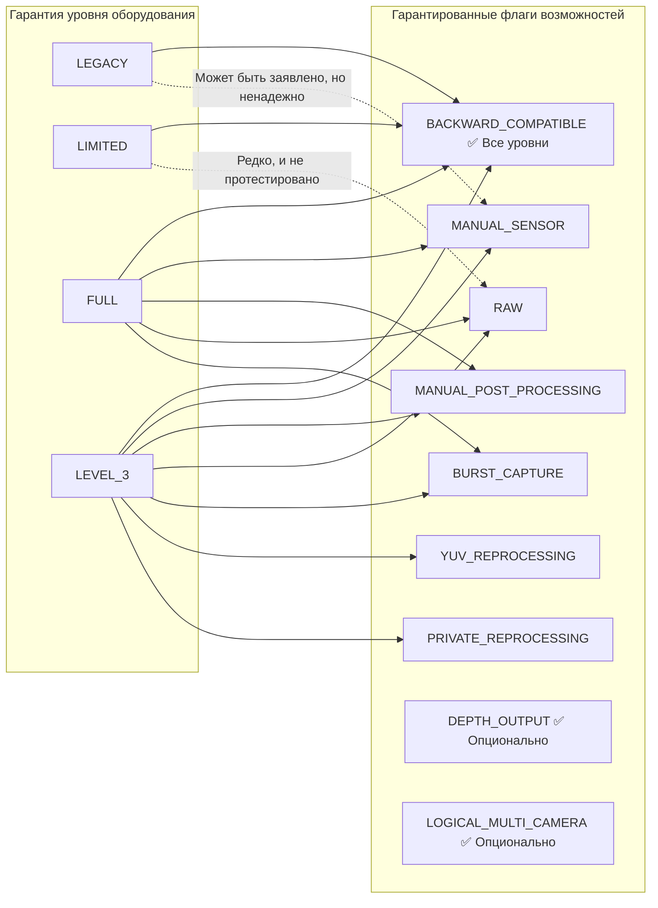
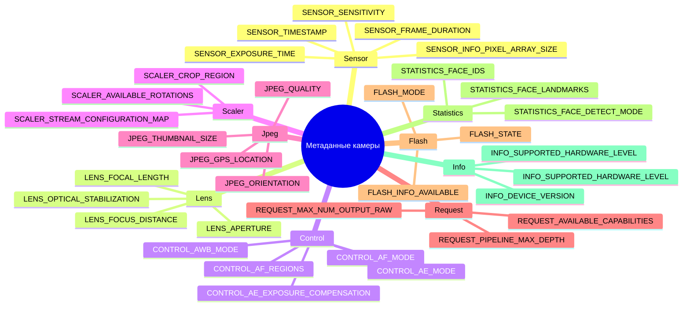

## 12.1 Технический паспорт в вашем кармане

Прежде чем вы сможете вызвать `openCamera()`, прежде чем вы сможете создать `CaptureRequest`, прежде чем вы сможете настроить сеанс — существует `CameraCharacteristics`. Это неизменяемое, не требующее питания окно во *все*, что может делать камера. Думайте об этом как о техническом паспорте камеры, представленном в виде структурированного объекта запроса.

`CameraCharacteristics` — ваш самый важный инструмент для написания приложений, которые работают на более чем 10 000 моделей устройств Android. Вы не можете просто предположить, что ручное ISO работает. Вы не можете предположить, что доступен RAW. Вы даже не можете предположить, что камера поддерживает предпросмотр в 1080p — пока не спросите у `CameraCharacteristics`.

В [главе 6](discovering-cameras.md) мы коснулись основ: ориентации линз, размера сенсора, фокусного расстояния. В этом глубоком погружении мы пойдем гораздо дальше:
- Пять **уровней аппаратной поддержки** (LEGACY → LIMITED → FULL → LEVEL_3 → EXTERNAL) и что гарантирует каждый из них.
- Более десяти **флагов возможностей** (`MANUAL_SENSOR`, `RAW`, `DEPTH_OUTPUT` и т. д.) и какие уровни оборудования их предоставляют.
- Как ключи метаданных **организованы иерархически** по подсистемам (`android.sensor.*`, `android.lens.*`, `android.control.*`, ...).
- Как написать **всеобъемлющий запрос возможностей во время выполнения** с корректными откатами к базовым функциям.

Приложение Android Camera Parameters ([GitHub](https://github.com/zoozooll/AndroidCameraParameters), [Play Store](https://play.google.com/store/apps/details?id=com.minininja.cameraparams)) — это, по сути, браузер `CameraCharacteristics` на стероидах. Откройте его для любой камеры, и вы увидите именно те ключи, которые мы обсуждаем в этой главе, организованные по категориям, с человекочитаемыми метками и визуализацией значений в реальном времени.

## 12.2 Что такое CameraCharacteristics на самом деле

Формально `CameraCharacteristics` — это:

- **Неизменяемый объект** — после получения из `CameraManager.getCameraCharacteristics(id)` объект никогда не меняется (за одним задокументированным исключением: `SENSOR_ORIENTATION` для складных устройств в API 32+).
- **Не требует питания** — запрос к нему **не** включает сенсор или ISP. Вы можете вызывать его в `onCreate()` вашей первой Activity без влияния на заряд батареи.
- **Индивидуален для каждой камеры** — у каждого идентификатора логической камеры есть свой собственный объект `CameraCharacteristics`.
- **Типизированный доступ по ключам** — данные считываются через `<Key<T>> get(Key<T> key)`, где каждый ключ имеет документированный тип (Int, Long, Float, Rect, Array и т. д.).

Вы получаете его одним вызовом:

```kotlin
val cameraManager = getSystemService(CAMERA_SERVICE) as CameraManager
val cameraIdList = cameraManager.cameraIdList  // например, ["0", "1", "2", "3"]

for (id in cameraIdList) {
    val characteristics: CameraCharacteristics = cameraManager.getCameraCharacteristics(id)
    // Делайте запросы — питание сенсора не используется!
}
```

В Android 15 (API 35) вы можете использовать `CameraManager.getCameraDeviceSetup(id)` для легковесных запросов конфигурации сеанса без открытия камеры (подробности о `CameraDeviceSetup` см. в [главе 28](camera2-architecture.md)).

## 12.3 Уровень оборудования: INFO_SUPPORTED_HARDWARE_LEVEL

Самым важным ключом в `CameraCharacteristics` является **`INFO_SUPPORTED_HARDWARE_LEVEL`**. Он определяет весь уровень Camera HAL и сообщает вам (в общих чертах), какие функции гарантированно будут работать. Существует пять уровней аппаратной поддержки:

### Пять уровней аппаратной поддержки

| Уровень | Константа | Типичные устройства | Что это означает на практике |
|-------|----------|----------------|---------------------------|
| **LEGACY** | `INFO_SUPPORTED_HARDWARE_LEVEL_LEGACY` | Бюджетные устройства до 2015 года, очень старые чипсеты | API Camera2 является оберткой над старым API `android.hardware.Camera`. Нет покадрового управления, нет ручных настроек, RAW невозможен, серийная съемка ненадежна. Относитесь к этим устройствам как к «эпохе Camera1 с синтаксисом Camera2». |
| **LIMITED** | `INFO_SUPPORTED_HARDWARE_LEVEL_LIMITED` | Бюджетные телефоны (Android Go, SoC начального уровня, такие как MediaTek Helio, Snapdragon 4xx) | Нативный Camera2 HAL, но только с подмножеством функций. 3A (AF/AE/AWB) работает. Предпросмотр + JPEG работают. Но **нет** ручного управления сенсором, **нет** RAW, **нет** гарантированной серийной съемки, **нет** переобработки YUV. Это «базовый функциональный» уровень камеры Android. |
| **FULL** | `INFO_SUPPORTED_HARDWARE_LEVEL_FULL` | Телефоны среднего и флагманского уровня (Snapdragon 6xx/7xx/8xx, Exynos mid+, Dimensity 7xxx+) | Уровень «профессиональной камеры». Гарантирует MANUAL_SENSOR, MANUAL_POST_PROCESSING, BURST_CAPTURE, покадровые настройки, 30 кадров в секунду в полном разрешении, RAW, все форматы вывода, предсказуемую глубину конвейера. То, что нужно для любого серьезного приложения камеры. |
| **LEVEL_3** | `INFO_SUPPORTED_HARDWARE_LEVEL_3` | Высококлассные флагманы с продвинутым ISP (Snapdragon 8 Gen 1+, Pixel 6+, Exynos 2xxx+) | FULL + дополнительные возможности: переобработка YUV (поддержка входного потока, офлайн-переобработка), частная (private) переобработка, расширенная статистика, одновременный вывод аппаратного JPEG + RAW в максимальном разрешении. Требуется для ZSL с выводом в RAW. |
| **EXTERNAL** | `INFO_SUPPORTED_HARDWARE_LEVEL_EXTERNAL` | USB-камеры, веб-камеры, подключенные через OTG | Внешний Camera HAL. Ведет себя как LIMITED или FULL в зависимости от USB-устройства. Ключевой нюанс: камера может быть подключена/отключена в любое время, поэтому слушайте `ACTION_CAMERA_DEVICE_STATE_CHANGED`. |



:::important
Уровень оборудования — это **гарантия**, а не флаг «по возможности». Если устройство сообщает о уровне FULL, Google CTS (Compatibility Test Suite) подтвердил, что каждая функция уровня FULL работает. Если устройство сообщает о LIMITED, вы не можете полагаться на функции уровня FULL — даже если они случайно заработают на одном конкретном устройстве LIMITED, они сломаются на другом.
:::

### Проверка уровня оборудования во время выполнения

```kotlin
val hardwareLevel = characteristics.get(CameraCharacteristics.INFO_SUPPORTED_HARDWARE_LEVEL)

when (hardwareLevel) {
    CameraCharacteristics.INFO_SUPPORTED_HARDWARE_LEVEL_LEGACY -> {
        Log.w("CamCaps", "Оборудование LEGACY — ручное управление/RAW отключены. Откат к базовому JPEG.")
        disableManualControls()
        disableRawCapture()
    }
    CameraCharacteristics.INFO_SUPPORTED_HARDWARE_LEVEL_LIMITED -> {
        Log.i("CamCaps", "Оборудование LIMITED — только базовое фото + предпросмотр.")
        disableManualControls()
        disableRawCapture()
        disableBurstCapture()
    }
    CameraCharacteristics.INFO_SUPPORTED_HARDWARE_LEVEL_FULL -> {
        Log.i("CamCaps", "Оборудование FULL — включение ручного управления, RAW и серийной съемки.")
        enableManualControls()
        enableRawCapture()
        enableBurstCapture()
    }
    CameraCharacteristics.INFO_SUPPORTED_HARDWARE_LEVEL_3 -> {
        Log.i("CamCaps", "Оборудование LEVEL_3 — FULL + переобработка + ZSL + расширенная статистика.")
        enableManualControls()
        enableRawCapture()
        enableBurstCapture()
        enableReprocessing()
        enableZeroShutterLag()
    }
    CameraCharacteristics.INFO_SUPPORTED_HARDWARE_LEVEL_EXTERNAL -> {
        Log.i("CamCaps", "Внешняя камера — может быть LIMITED или FULL; регистрация слушателя отключения.")
        registerHotplugListener()
        // Динамическая проверка возможностей вместо предположений
    }
    else -> {
        Log.w("CamCaps", "Неизвестный уровень оборудования $hardwareLevel — принимаем LIMITED для безопасности.")
        safeDefaultFeatures()
    }
}
```

## 12.4 Возможности: REQUEST_AVAILABLE_CAPABILITIES

Уровень оборудования — это *грубая* градация. Для детального определения функций Camera2 предоставляет `REQUEST_AVAILABLE_CAPABILITIES` — массив `IntArray` флагов возможностей. Каждый флаг описывает одну конкретную вещь, которую может делать камера.

Формальная связь между уровнем оборудования и возможностями:



### Пояснение флагов возможностей

| Константа флага | Значение | Гарантия уровня оборудования | Практическое следствие |
|--------------|---------|--------------------------|----------------------|
| `BACKWARD_COMPATIBLE` | Камера реализует базовый API Camera2 | **Все 5 уровней** (LEGACY–EXTERNAL) | Если это отсутствует, устройство камеры фактически нефункционально для вашего приложения. |
| `MANUAL_SENSOR` | Приложение может вручную управлять `SENSOR_EXPOSURE_TIME`, `SENSOR_SENSITIVITY`, `SENSOR_FRAME_DURATION`, `LENS_FOCUS_DISTANCE`, `LENS_APERTURE` | Гарантировано на **FULL** и **LEVEL_3** | Требуется для режимов Pro и ручных настроек интерфейса. Без этого все слайдеры ISO/выдержки должны быть скрыты. |
| `MANUAL_POST_PROCESSING` | Приложение может вручную управлять этапами ISP: шумоподавлением, повышением резкости краев, кривой тона, усилением цветокоррекции, матрицей преобразования цвета | Гарантировано на **FULL** и **LEVEL_3** | Нужно для кастомных лутов (LUT), ручного баланса белого через усиление каналов, управления резкостью/размытием. |
| `RAW` | Сенсор выдает «сырые» данные Bayer через форматы `ImageFormat.RAW_SENSOR`, `RAW10` или `RAW12` | Гарантировано на **FULL** и **LEVEL_3** | Захват DNG, конвейер редактирования RAW-to-JPEG, вычислительная фотография — все начинается здесь. |
| `PRIVATE_REPROCESSING` | Камера поддерживает `InputSurface` + офлайн-переобработку изображений в частном формате HAL в JPEG/YUV | Гарантировано на **LEVEL_3**. Редко на FULL. | Позволяет реализовать Zero-Shutter-Lag (ZSL): кольцевой буфер прошлых кадров, переобработка недавнего кадра в качественное фото. |
| `YUV_REPROCESSING` | Камера поддерживает `InputSurface` + переобработку предоставленных приложением YUV_420_888 обратно через ISP | Гарантировано на **LEVEL_3** | Позволяет накладывать «кинематографический LUT» на записанное видео или перефокусировать портрет после съемки. |
| `DEPTH_OUTPUT` | Камера может выдавать карты глубины (форматы `DEPTH16` / `DEPTH_POINT_CLOUD`) | **Опционально на ЛЮБОМ** уровне. Проверяйте массив явно. | Режим портретного боке, AR-измерения, 3D-сканирование. Часто сочетается с `LOGICAL_MULTI_CAMERA` (стереоглубина из двух камер). |
| `LOGICAL_MULTI_CAMERA` | Эта логическая камера поддерживается 2+ физическими сенсорами (например, сверхширик + ширик + телеобъектив) | **Опционально на ЛЮБОМ** уровне. Обычно только флагманы. | Позволяет реализовать бесшовный оптический зум (см. [главу 20](multi-camera.md)). Вы можете запросить `LOGICAL_MULTI_CAMERA_PHYSICAL_IDS`. |
| `BURST_CAPTURE` | `captureBurst()` с > 1 кадром работает в полном разрешении без пропуска кадров | Гарантировано на **FULL** и **LEVEL_3** | Без этого серийная съемка может тормозить, пропускать кадры или молча падать. Требуется для брекетинга. |
| `CONSTRAINED_HIGH_SPEED_VIDEO` | Поддержка `createHighSpeedRequestList()` + скоростное видео (120fps, 240fps) | **Опционально на FULL/LEVEL_3**. Редко на LIMITED. | Запись замедленного видео (см. [главу 19](high-speed-video.md)). |
| `MOTION_TRACKING` | Камера может отслеживать объекты / лица с высокой частотой кадров и низкой задержкой | Опционально (редко). Есть на Pixel и некоторых флагманах. | Отслеживание движения в AR, автофокус на спортивных объектах. |
| `LOGICAL_MULTI_CAMERA_SYNC` | Несколько физических камер в логическом устройстве могут захватывать синхронизированные кадры | Опционально. Требуется для истинного одновременного захвата несколькими сенсорами. | Вычислительная фотография, использующая несколько линз сразу (например, зум со слиянием). |

### Запрос всех возможностей во время выполнения

```kotlin
val capabilities = characteristics.get(
    CameraCharacteristics.REQUEST_AVAILABLE_CAPABILITIES
) ?: intArrayOf()

fun hasCapability(cap: Int): Boolean = capabilities.contains(cap)

val supportsManualSensor = hasCapability(
    CameraCharacteristics.REQUEST_AVAILABLE_CAPABILITIES_MANUAL_SENSOR
)
val supportsRaw = hasCapability(
    CameraCharacteristics.REQUEST_AVAILABLE_CAPABILITIES_RAW
)
val supportsBurst = hasCapability(
    CameraCharacteristics.REQUEST_AVAILABLE_CAPABILITIES_BURST_CAPTURE
)
val supportsDepth = hasCapability(
    CameraCharacteristics.REQUEST_AVAILABLE_CAPABILITIES_DEPTH_OUTPUT
)
val supportsLogicalMultiCam = hasCapability(
    CameraCharacteristics.REQUEST_AVAILABLE_CAPABILITIES_LOGICAL_MULTI_CAMERA
)
val supportsHighSpeed = hasCapability(
    CameraCharacteristics.REQUEST_AVAILABLE_CAPABILITIES_CONSTRAINED_HIGH_SPEED_VIDEO
)
val supportsYuvReprocessing = hasCapability(
    CameraCharacteristics.REQUEST_AVAILABLE_CAPABILITIES_YUV_REPROCESSING
)
val supportsPrivateReprocessing = hasCapability(
    CameraCharacteristics.REQUEST_AVAILABLE_CAPABILITIES_PRIVATE_REPROCESSING
)

// Создание человекочитаемого отчета
val capabilityReport = buildString {
    appendLine("=== Отчет о возможностях камеры ===")
    appendLine("BACKWARD_COMPATIBLE:     ${hasCapability(
        CameraCharacteristics.REQUEST_AVAILABLE_CAPABILITIES_BACKWARD_COMPATIBLE
    )}")
    appendLine("MANUAL_SENSOR:           $supportsManualSensor")
    appendLine("MANUAL_POST_PROCESSING:  ${hasCapability(
        CameraCharacteristics.REQUEST_AVAILABLE_CAPABILITIES_MANUAL_POST_PROCESSING
    )}")
    appendLine("RAW:                     $supportsRaw")
    appendLine("BURST_CAPTURE:           $supportsBurst")
    appendLine("YUV_REPROCESSING:        $supportsYuvReprocessing")
    appendLine("PRIVATE_REPROCESSING:    $supportsPrivateReprocessing")
    appendLine("DEPTH_OUTPUT:            $supportsDepth")
    appendLine("LOGICAL_MULTI_CAMERA:    $supportsLogicalMultiCam")
    appendLine("CONSTRAINED_HIGH_SPEED:  $supportsHighSpeed")
}

Log.i("CamCaps", capabilityReport)

// Управление элементами интерфейса
manualIsoSlider.isEnabled = supportsManualSensor
manualExposureSlider.isEnabled = supportsManualSensor
rawCaptureToggle.isEnabled = supportsRaw
burstCaptureButton.isEnabled = supportsBurst
depthPortraitMode.isEnabled = supportsDepth
zoomSwitcher.isEnabled = supportsLogicalMultiCam
slowMoButton.isEnabled = supportsHighSpeed
zslMode.isEnabled = supportsPrivateReprocessing  // LEVEL_3
```

:::tip
Приложение Android Camera Parameters отображает этот запрос в виде цветных флажков в карточке **Capabilities**. Зеленый = поддерживается, серый = нет. Вы можете сравнивать несколько камер, чтобы увидеть отличия в возможностях между основным модулем и сверхшириком.
:::

## 12.5 Организация метаданных: Пространство имен android.*

Каждый ключ в `CameraCharacteristics`, `CaptureRequest` и `CaptureResult` следует иерархическому соглашению об именовании: `android.<подсистема>.<параметр>`. Компоненты, разделенные точками, группируют связанные настройки по подсистеме оборудования или ПО, которой они управляют.

### Классы подсистем

| Префикс подсистемы | Класс метаданных Kotlin | Что охватывает |
|-----------------|----------------------|---------------|
| `android.sensor.*` | `CameraCharacteristics.SensorInfo*`, `CaptureRequest.SENSOR_*`, `CaptureResult.SENSOR_*` | Считывание сенсора: выдержка, ISO, длительность кадра, метка времени, матрица пикселей, активная матрица, направление подвижного затвора, тестовые режимы |
| `android.lens.*` | `LensInfo*`, `Lens.*` | Оптика: дистанция фокусировки, апертура, фокусное расстояние, оптическая стабилизация (OIS), плотность фильтра (ND), диапазон фокуса, доступные апертуры |
| `android.control.*` | `Control*` | Алгоритмы 3A: режимы/состояние/цели/области AE, режимы/состояние/триггер/области AF, режимы/состояние/области AWB, подавление мерцания, сценарные режимы, эффекты, стабилизация видео (EIS) |
| `android.scaler.*` | `Scaler.*` | Конфигурация конвейера вывода: область обрезки (цифровой зум), поворот, карта конфигурации потоков (форматы, размеры, длительности), доступные минимальные длительности кадров |
| `android.jpeg.*` | `Jpeg*` | Кодирование JPEG: качество, ориентация, координаты GPS, размер миниатюры, качество миниатюры |
| `android.request.*` | `Request*` | Возможности всего конвейера: массив доступных возможностей, макс. глубина конвейера, макс. кол-во выходов RAW/PROC, ключи объектов метаданных, список доступных шаблонов |
| `android.flash.*` | `FlashInfo*`, `Flash*` | Блок вспышки: наличие, состояние заряда, цветовая температура, макс. яркость, режим (выкл / один импульс / фонарик) |
| `android.statistics.*` | `Statistics*` | Вывод статистики ISP: детекция лиц, ID лиц, точки лиц, оценки лиц, гистограмма, карта резкости, карта затенения линз, карта горячих пикселей |
| `android.info.*` | `Info*` | Статическая информация: уровень оборудования, версия устройства, доступные режимы детекции лиц, доступные режимы шумоподавления |
| `android.black.*` | `BlackLevel*` | Блокировка уровня черного, паттерн уровня черного (коррекция фиксированного шума) |
| `android.colorCorrection.*` | `ColorCorrection*` | Цветовой конвейер: матрица преобразования, усиление цветокоррекции (каналы R, G, B), режим коррекции аберраций |
| `android.tonemap.*` | `Tonemap*` | Тональное отображение: кривая тона (кастомная гамма), режим тонального отображения, контраст, насыщенность |
| `android.edge.*` | `Edge*` | Повышение резкости краев: режим, сила |
| `android.noiseReduction.*` | `NoiseReduction*` | Шумоподавление: режим, сила, сила временного шумоподавления |
| `android.shading.*` | `Shading*` | Коррекция виньетирования: режим, сила |
| `android.hotPixel.*` | `HotPixel*` | Коррекция горячих пикселей: режим, карта горячих пикселей |
| `android.distortionCorrection.*` | `DistortionCorrection*` | Коррекция геометрических искажений линз: режим |
| `android.depth.*` | `Depth*` | Вывод глубины: эксклюзивность глубины, макс. кол-во выборок глубины, формат глубины |
| `android.logicalMultiCamera.*` | `LogicalMultiCamera*` | Логическая мультикамера: ID физических камер, синхронизация сенсоров |



### Примечание о доступности ключей

Не каждый ключ существует на каждом устройстве. Если вы вызовете `get(KEY)` для ключа, который устройство не поддерживает, вы получите `null` — отсюда паттерны `?: 0` или `?.let`, которые вы видите в этой книге.

Безопасный паттерн: **проверяйте, существует ли ключ, перед его чтением**, или используйте безопасность null в Kotlin для предоставления значения по умолчанию.

```kotlin
// Безопасный доступ со значениями по умолчанию
val exposureTimeNs: Long = characteristics.get(
    CameraCharacteristics.SENSOR_INFO_EXPOSURE_TIME_RANGE
)?.upper ?: 1_000_000L  // по умолчанию 1 мс, если ключ отсутствует

// Необязательная обработка, если ключ существует
characteristics.get(CameraCharacteristics.LENS_INFO_AVAILABLE_APERTURES)?.let { apertures ->
    Log.d("CamCaps", "Устройство поддерживает ${apertures.size} апертур: ${apertures.contentToString()}")
    buildApertureSelector(apertures)
} ?: run {
    Log.d("CamCaps", "На этом устройстве нет сменной апертуры")
    hideApertureControl()
}
```

## 12.6 Полный запрос возможностей (промышленного уровня)

Соберем все вместе. Вот готовый для использования запрос возможностей, который вы можете добавить в любое приложение на Camera2. Он объединяет уровень оборудования, флаги возможностей и проверку отдельных ключей:

```kotlin
data class CameraCapabilityProfile(
    val cameraId: String,
    val lensFacing: Int,
    val hardwareLevel: Int,
    val hardwareLevelName: String,
    val supportsManualSensor: Boolean,
    val supportsManualPostProcessing: Boolean,
    val supportsRaw: Boolean,
    val supportsBurst: Boolean,
    val supportsDepth: Boolean,
    val supportsLogicalMultiCam: Boolean,
    val supportsHighSpeedVideo: Boolean,
    val supportsYuvReprocessing: Boolean,
    val supportsPrivateReprocessing: Boolean,
    val maxBurstRaw: Int,
    val maxBurstProcessed: Int,
    val pipelineMaxDepth: Int,
    val availableFocalLengths: FloatArray?,
    val availableApertures: FloatArray?,
    val minFocusDistanceDiopters: Float?,
    val maxDigitalZoom: Float?
)

fun buildCapabilityProfile(
    cameraManager: CameraManager,
    cameraId: String
): CameraCapabilityProfile {
    val c = cameraManager.getCameraCharacteristics(cameraId)

    val hwLevel = c.get(CameraCharacteristics.INFO_SUPPORTED_HARDWARE_LEVEL)
        ?: CameraCharacteristics.INFO_SUPPORTED_HARDWARE_LEVEL_LEGACY

    val hwLevelName = when (hwLevel) {
        CameraCharacteristics.INFO_SUPPORTED_HARDWARE_LEVEL_LEGACY -> "LEGACY"
        CameraCharacteristics.INFO_SUPPORTED_HARDWARE_LEVEL_LIMITED -> "LIMITED"
        CameraCharacteristics.INFO_SUPPORTED_HARDWARE_LEVEL_FULL -> "FULL"
        CameraCharacteristics.INFO_SUPPORTED_HARDWARE_LEVEL_3 -> "LEVEL_3"
        CameraCharacteristics.INFO_SUPPORTED_HARDWARE_LEVEL_EXTERNAL -> "EXTERNAL"
        else -> "UNKNOWN($hwLevel)"
    }

    val caps = c.get(CameraCharacteristics.REQUEST_AVAILABLE_CAPABILITIES) ?: intArrayOf()
    fun has(cap: Int) = caps.contains(cap)

    // Уровень оборудования дает гарантии возможностей, но проверяем флаги для надежности
    val atLeastFull = hwLevel == CameraCharacteristics.INFO_SUPPORTED_HARDWARE_LEVEL_FULL ||
                      hwLevel == CameraCharacteristics.INFO_SUPPORTED_HARDWARE_LEVEL_3

    return CameraCapabilityProfile(
        cameraId = cameraId,
        lensFacing = c.get(CameraCharacteristics.LENS_FACING)
            ?: CameraCharacteristics.LENS_FACING_BACK,
        hardwareLevel = hwLevel,
        hardwareLevelName = hwLevelName,

        // Проверка флагов + гарантия уровня оборудования
        supportsManualSensor = has(
            CameraCharacteristics.REQUEST_AVAILABLE_CAPABILITIES_MANUAL_SENSOR
        ) || atLeastFull,
        supportsManualPostProcessing = has(
            CameraCharacteristics.REQUEST_AVAILABLE_CAPABILITIES_MANUAL_POST_PROCESSING
        ) || atLeastFull,
        supportsRaw = has(
            CameraCharacteristics.REQUEST_AVAILABLE_CAPABILITIES_RAW
        ) || atLeastFull,
        supportsBurst = has(
            CameraCharacteristics.REQUEST_AVAILABLE_CAPABILITIES_BURST_CAPTURE
        ) || atLeastFull,
        supportsDepth = has(
            CameraCharacteristics.REQUEST_AVAILABLE_CAPABILITIES_DEPTH_OUTPUT
        ),
        supportsLogicalMultiCam = has(
            CameraCharacteristics.REQUEST_AVAILABLE_CAPABILITIES_LOGICAL_MULTI_CAMERA
        ),
        supportsHighSpeedVideo = has(
            CameraCharacteristics.REQUEST_AVAILABLE_CAPABILITIES_CONSTRAINED_HIGH_SPEED_VIDEO
        ),
        supportsYuvReprocessing = has(
            CameraCharacteristics.REQUEST_AVAILABLE_CAPABILITIES_YUV_REPROCESSING
        ),
        supportsPrivateReprocessing = has(
            CameraCharacteristics.REQUEST_AVAILABLE_CAPABILITIES_PRIVATE_REPROCESSING
        ),

        maxBurstRaw = c.get(CameraCharacteristics.REQUEST_MAX_NUM_OUTPUT_RAW) ?: 1,
        maxBurstProcessed = c.get(CameraCharacteristics.REQUEST_MAX_NUM_OUTPUT_PROC) ?: 1,
        pipelineMaxDepth = c.get(CameraCharacteristics.REQUEST_PIPELINE_MAX_DEPTH) ?: 1,

        availableFocalLengths = c.get(CameraCharacteristics.LENS_INFO_AVAILABLE_FOCAL_LENGTHS),
        availableApertures = c.get(CameraCharacteristics.LENS_INFO_AVAILABLE_APERTURES),
        minFocusDistanceDiopters = c.get(CameraCharacteristics.LENS_INFO_MINIMUM_FOCUS_DISTANCE),
        maxDigitalZoom = c.get(CameraCharacteristics.SCALER_AVAILABLE_MAX_DIGITAL_ZOOM)
    )
}

// Использование:
val profile = buildCapabilityProfile(cameraManager, "0")
Log.d("CamCaps", "Профиль камеры 0: ${profile.hardwareLevelName}, " +
    "Manual=${profile.supportsManualSensor}, RAW=${profile.supportsRaw}, " +
    "Burst=${profile.supportsBurst}, Depth=${profile.supportsDepth}, " +
    "Zoom=${profile.maxDigitalZoom}x")
```

## 12.7 Визуализация в приложении Android Camera Parameters

Приложение Android Camera Parameters ([GitHub](https://github.com/zoozooll/AndroidCameraParameters), [Play Store](https://play.google.com/store/apps/details?id=com.minininja.cameraparams)) — идеальное дополнение к этой главе. Оно превращает сырые пары ключ/значение `CameraCharacteristics` в удобный интерфейс:

- **Карточка сводки (Summary card)** — уровень оборудования (с цветным значком: красный=LEGACY, оранжевый=LIMITED, зеленый=FULL, бирюзовый=LEVEL_3, синий=EXTERNAL), ориентация линз, разрешение сенсора, фокусные расстояния.
- **Карточка возможностей (Capabilities card)** — список всех флагов `REQUEST_AVAILABLE_CAPABILITIES` с галочками, зелеными, если возможность есть.
- **Вкладки категорий** — организованы в точности по подсистемам `android.*`: Sensor, Lens, Control, Scaler, Jpeg, Flash, Statistics, Info, Request.
- **Вкладка Raw JSON** — полный сериализованный объект `CameraCharacteristics` для копирования в отчеты об ошибках.
- **Режим сравнения** — переключайтесь между камерами (0, 1, 2, 3), чтобы увидеть отличия в уровнях оборудования и возможностях.

## 12.8 Резюме

| Концепция | Ключевой вывод |
|---------|-------------|
| **Уровень оборудования** | 5 уровней: LEGACY (обертка) → LIMITED (базовый) → FULL (про + manual/RAW) → LEVEL_3 (FULL + переобработка) → EXTERNAL (USB). FULL — минимум для серьезной работы. Гарантии, проверенные CTS. |
| **Флаги возможностей** | Детальное определение функций через `REQUEST_AVAILABLE_CAPABILITIES`. Ключевые флаги: `MANUAL_SENSOR`, `MANUAL_POST_PROCESSING`, `RAW`, `BURST_CAPTURE`, `DEPTH_OUTPUT`, `LOGICAL_MULTI_CAMERA`, `PRIVATE_REPROCESSING`, `YUV_REPROCESSING`, `CONSTRAINED_HIGH_SPEED_VIDEO`. |
| **Связь Уровень → Возможность** | FULL гарантирует MANUAL_SENSOR, MANUAL_POST_PROCESSING, RAW, BURST. LEVEL_3 добавляет YUV/PRIVATE_REPROCESSING. DEPTH и LOGICAL_MULTI_CAMERA опциональны на всех уровнях. |
| **Пространство имен метаданных** | Ключи организованы как `android.<подсистема>.<параметр>`. Основные подсистемы: sensor, lens, control, scaler, jpeg, request, flash, statistics, info. Каждая имеет статику (Characteristics), вход запроса (Request) и выход результата (Result). |
| **Безопасные запросы** | Всегда используйте значения по умолчанию для `get()` — многие ключи опциональны. Используйте уровень оборудования как грубый фильтр, флаги возможностей как точный, и наличие отдельных ключей для тонкой настройки под конкретное устройство. |

## Что дальше

Теперь, когда вы понимаете, что может делать камера (характеристики) и как ею управлять (конвейер + типы захвата), у вас есть фундамент для части IV.

В **главе 13: Ручное ISO и выдержка**, вы научитесь использовать возможность `MANUAL_SENSOR` для ручного управления `SENSOR_EXPOSURE_TIME` и `SENSOR_SENSITIVITY` — реализуя слайдер экспозиции в режиме Pro с живым предпросмотром, компенсацией экспозиции и пониманием компромиссов треугольника экспозиции.
