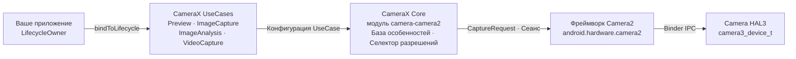

# Глава 24: CameraX

## Резюме

К моменту прочтения этой главы вы уже освоили «чистый» API Camera2: ручное открытие экземпляров `CameraDevice`, создание объектов `CaptureRequest.Builder`, управление жизненным циклом `CameraCaptureSession`, работу с тремя типами обратных вызовов и тщательное освобождение ресурсов в каждом крайнем случае. Вы заслужили свои «шрамы». Теперь мы сделаем шаг назад и спросим: что если бы 80% этого шаблонного кода можно было убрать?

CameraX — это библиотека Jetpack от Google, которая оборачивает Camera2 в декларативное, ориентированное на сценарии использования (use-case-driven) API, учитывающее жизненный цикл компонентов. Она не заменяет Camera2 — это и есть Camera2 «под капотом». Она заменяет сотни строк кода настройки сеанса, обработку особенностей конкретных устройств и ручной учет жизненного цикла. В этой главе вы изучите архитектуру CameraX, поймете модель `UseCase`, увидите, как внедрять «сырые» параметры Camera2 *в* CameraX через `Camera2Interop`, и получите таблицу для принятия решения о том, когда стоит использовать CameraX, а когда необходимо спуститься на уровень «чистого» Camera2.

Чтобы следовать материалу и проверять возможности камеры на своем устройстве перед выбором слоя для разработки, установите приложение **Android Camera Parameters** из [Google Play](https://play.google.com/store/apps/details?id=com.minininja.cameraparams) или изучите исходный код на [github.com/zoozooll/AndroidCameraParameters](https://github.com/zoozooll/AndroidCameraParameters).

---

## Архитектура CameraX

CameraX поставляется в виде пяти артефактов Jetpack: `camera-core`, `camera-camera2`, `camera-lifecycle`, `camera-view` и `camera-extensions`. Архитектурной основой является модель `UseCase` — вместо того чтобы думать о поверхностях (surfaces) и сеансах, вы думаете о том, *что именно вы хотите, чтобы камера делала*.

### Модель UseCase

Существует четыре канонических сценария использования, и вы можете привязать любой их набор к жизненному циклу одновременно:

| UseCase          | Назначение                                                        |
|------------------|----------------------------------------------------------------|
| `Preview`        | Передает поток кадров в `PreviewView` или на `Surface`. Аналогично настройке повторяющегося запроса к `SurfaceTexture`. |
| `ImageAnalysis`  | Передает кадры `ImageProxy` вашему анализатору в фоновом потоке. Заменяет ручное создание `ImageReader` с `YUV_420_888` и подключение его слушателя к повторяющемуся запросу. |
| `ImageCapture`   | Одиночный или серийный захват фото. Берет на себя запрос захвата, работу с `ImageReader`, поворот и EXIF. |
| `VideoCapture`   | Включено в CameraX начиная с версии 1.1; оборачивает конвейер `MediaRecorder` или `ParcelFileDescriptor` с корректной семантикой паузы/возобновления и маршрутизацией звука. |

Привязка всех четырех сценариев абсолютно законна — CameraX внутренне проверяет комбинацию потоков по `SCALER_STREAM_CONFIGURATION_MAP` и вызывает `isSessionConfigurationSupported` от вашего имени, переходя на меньшие разрешения, если ваша точная комбинация не поддерживается. Это одна из самых больших побед: вам больше никогда не придется тратить три часа, чтобы выяснить, что среднебюджетный Samsung 2019 года из вашей тестовой матрицы не поддерживает одновременно `4:3 PRIV + 16:9 JPEG_MAX`. CameraX просто работает.

### ProcessCameraProvider и учет жизненного цикла

Точкой привязки является `ProcessCameraProvider`, синглтон, принадлежащий процессу вашего приложения. Ключевая строка выглядит так:

```kotlin
val cameraProviderFuture = ProcessCameraProvider.getInstance(context)
cameraProviderFuture.addListener({
    val cameraProvider = cameraProviderFuture.get()
    val camera: Camera = cameraProvider.bindToLifecycle(
        lifecycleOwner,
        cameraSelector,
        preview,
        imageCapture,
        imageAnalysis
    )
}, ContextCompat.getMainExecutor(context))
```

И это всё. Никакого ада обратных вызовов `openCamera`, никакого `StateCallback`, никакой настройки сеанса и никакого ручного завершения работы. Когда `lifecycleOwner` (ваш `Fragment` или `Activity`) достигает состояния `ON_STOP`, CameraX закрывает `CameraDevice`. При `ON_DESTROY` она завершает сеанс и освобождает все поверхности. Утечки ресурсов, на которые вы охотились в главе 7, просто не могут произойти — контракт жизненного цикла это гарантирует.

### CameraX внутренне оборачивает Camera2

Внутренне CameraX — это Camera2. Артефакт `camera-camera2` содержит `Camera2Camera`, `Camera2CameraCaptureResult` и `Camera2RequestProcessor`, которые транслируют ваши высокоуровневые объявления UseCase в те же самые вызовы `CameraManager.openCamera`, `createCaptureSession` и `setRepeatingRequest`, которые вы писали вручную в предыдущих 23 главах. Обходные пути для конкретных производителей закодированы в XML-файлах внутри библиотеки — это знаменитая «база данных особенностей CameraX» (quirk database).

Полная архитектура выглядит так:



Следуйте по стрелкам слева направо: ваше приложение заявляет, *что* оно хочет (use cases), CameraX определяет, *как* это получить (размеры поверхностей, конфиг сеанса, особенности), а затем выполняет те же вызовы Camera2, которые написали бы вы сами. Добавленная стоимость здесь — два средних блока, сотни тысяч строк написанного Google кода для совместимости с устройствами, который вам не нужно писать.

---

## Camera2Interop: Внедрение параметров Camera2 в CameraX

CameraX идеальна в 80% случаев. Но вы, дорогой читатель, мастер Camera2. Вы знаете, что означает `CONTROL_AE_MODE_OFF`. Вы понимаете разницу между `SENSOR_SENSITIVITY` и `CONTROL_AE_EXPOSURE_COMPENSATION`. Когда спецификация продукта говорит: «дайте пользователю заблокировать ISO на 400 и выдержку на 1/60 с даже при использовании CameraX», вы не переписываете всю функцию на чистом Camera2. Вы используете `Camera2Interop`.

### Паттерн Extender

У каждого `UseCase.Builder` есть соответствующий `Camera2Interop.Extender`. Вызовите его *перед* `build()`, чтобы внедрить «сырые» ключи Camera2 на уровне сеанса или на уровне каждого запроса:

| Метод                                          | Эквивалент в Camera2                         |
|------------------------------------------------|----------------------------------------------|
| `extender.setCaptureRequestOption(key, value)` | `CaptureRequest.Builder.set(key, value)`     |
| `extender.setSessionOption(key, value)`        | Параметры инициализации сеанса (реже исп.)   |

Extender является аддитивным: CameraX по-прежнему устанавливает свои значения по умолчанию для каждого ключа, который вы не переопределяете. Если вы установите только `SENSOR_SENSITIVITY`, CameraX все равно будет управлять AF, AWB, поворотом и метаданными.

### Пример из практики: Ручное ISO и выдержка в CameraX

Ниже приведен полный билдер `ImageCapture`, который переводит камеру в ручной режим AE с фиксированным ISO 400 и выдержкой 1/60 секунды, а затем делает снимок:

```kotlin
val iso = 400
val exposureTimeNanos = 1_000_000_000L / 60 // 1/60 с

val imageCapture = ImageCapture.Builder()
    .setTargetResolution(Size(4032, 3024))
    .setCaptureMode(ImageCapture.CAPTURE_MODE_MAXIMIZE_QUALITY)
    .apply {
        val interop = Camera2Interop.Extender(this)
        interop.setCaptureRequestOption(
            CaptureRequest.CONTROL_AE_MODE,
            CaptureRequest.CONTROL_AE_MODE_OFF
        )
        interop.setCaptureRequestOption(
            CaptureRequest.CONTROL_AE_LOCK,
            false
        )
        interop.setCaptureRequestOption(
            CaptureRequest.SENSOR_SENSITIVITY,
            iso
        )
        interop.setCaptureRequestOption(
            CaptureRequest.SENSOR_EXPOSURE_TIME,
            exposureTimeNanos
        )
        interop.setCaptureRequestOption(
            CaptureRequest.CONTROL_MODE,
            CaptureRequest.CONTROL_MODE_OFF
        )
    }
    .build()

cameraProvider.bindToLifecycle(
    viewLifecycleOwner,
    CameraSelector.DEFAULT_BACK_CAMERA,
    preview,
    imageCapture
)

// Позже, запуск съемки:
imageCapture.takePicture(
    ContextCompat.getMainExecutor(context),
    object : ImageCapture.OnImageCapturedCallback() {
        override fun onCaptureSuccess(imageProxy: ImageProxy) {
            // imageProxy содержит кадр с ручной экспозицией
            imageProxy.close()
        }

        override fun onError(exception: ImageCaptureException) {
            Log.e(TAG, "Съемка не удалась: ${exception.imageCaptureError}", exception)
        }
    }
)
```

**Важное предостережение:** установка `CONTROL_MODE_OFF` отключает *всю* автоматику 3A. Если вы хотите только заблокировать экспозицию, но оставить работу AF и AWB, устанавливайте только `CONTROL_AE_MODE_OFF` (или `CONTROL_AE_LOCK = true`) и оставьте `CONTROL_MODE` по умолчанию (`CONTROL_MODE_AUTO`). CameraX сама выставит значения для всех ключей, которые вы не трогаете.

И да — вы можете сделать то же самое с `Preview.Builder` и `ImageAnalysis.Builder` для повторяющихся потоков с ручным управлением. Extender применяется к каждому повторяющемуся или одиночному запросу, выдаваемому на протяжении всего времени жизни этого UseCase.

### Чтение результатов Camera2 обратно

Извлечение `TotalCaptureResult` из обратного вызова CameraX выполняется так же просто через `Camera2CameraCaptureResult`:

```kotlin
imageCapture.takePicture(
    executor,
    object : ImageCapture.OnImageCapturedCallback() {
        override fun onCaptureSuccess(imageProxy: ImageProxy) {
            val camera2Result = imageProxy.imageInfo
                .cameraCaptureResult as? Camera2CameraCaptureResult
            val totalResult: TotalCaptureResult? = camera2Result?.captureResult
            val actualIso = totalResult?.get(CaptureResult.SENSOR_SENSITIVITY)
            Log.d(TAG, "Фактическое ISO на сенсоре: $actualIso")
            imageProxy.close()
        }
    }
)
```

Это позволяет убедиться, что ваши внедренные параметры действительно дошли до сенсора. Используйте **Android Camera Parameters**, чтобы проверить, какой `SENSOR_INFO_SENSITIVITY_RANGE` заявляет ваше устройство — если ваше внедренное значение ISO выходит за рамки этого диапазона, CameraX молча ограничит его (или это сделает HAL), и чтение результата будет единственным способом это узнать.

---

## Выбор между CameraX и Camera2

Самый сложный архитектурный вопрос — не «как использовать CameraX?», а «стоит ли вообще использовать CameraX?». Вот схема принятия решения, дистиллированная из реального опыта производства.

### Схема принятия решения

```mermaid
flowchart TD
    A["Начало"] --> B{Нужен захват RAW,<br/>переобработка ZSL,<br/>физические потоки мультикамеры,<br/>скоростная съемка &gt;60fps?}
    B -->|Да| D[Используйте чистый Camera2]
    B -->|Нет| C{Нужна покадровая шаблонизация<br/>CaptureRequest для каждой физ. камеры,<br/>кастомный конфиг сеанса<br/>(поверхности репроцессинга),<br/>или офлайн-сеансы?}
    C -->|Да| D
    C -->|Нет| E{Простой предпросмотр + фото<br/>+ видео + анализ,<br/>широкая совместимость?}
    E -->|Да| F[Используйте CameraX]
    E -->|Нет| G{База особенностей CameraX<br/>покрывает ваши устройства?<br/>Проверьте в Android Camera Parameters}
    G -->|Да| F
    G -->|Нет| D
```

### Таблица принятия решений

| Сценарий                                                              | CameraX | Чистый Camera2 |
|-----------------------------------------------------------------------|:-------:|:-----------:|
| Предпросмотр в стиле Instagram + фото по тапу + видео                 |    ✅    |      ⛔      |
| Сканирование QR / штрихкодов / детекция лиц через ML Kit без кастомизации |    ✅    |      ⛔      |
| Ручная экспозиция с фикс. ISO + затвор (через Camera2Interop)         |    ✅    |      ⚠️       |
| Кастомный конечный автомат 3A, переопределяющий алгоритмы OEM         |    ⛔    |      ✅      |
| Профессиональное фото в `RAW_SENSOR` / `RAW_PRIVATE` / DNG            |    ⛔    |      ✅      |
| Zero Shutter Lag (глава 23) с входными поверхностями переобработки    |    ⛔    |      ✅      |
| Доступ к физическим потокам логической мультикамеры (глава 20)        |    ⛔    |      ✅      |
| Скоростная съемка 120/240fps через constrained-high-speed-sessions    |    ⛔    |      ✅      |
| Расширения камеры (Ночь / Боке / HDR) через OEM расширения            |    ✅    |      ✅      |
| Автомобильная камера заднего вида с миграцией EVS при ранней загрузке |    ⛔    |      ✅ (NDK)  |
| Кросс-платформенная совместимость — приоритет №1                      |    ✅    |      ⚠️       |

«Серая зона» (⚠️) — это место, где важна оценка. Ручное управление экспозицией через `Camera2Interop` надежно работает на устройствах уровня `HARDWARE_LEVEL_FULL`, но молча не срабатывает на устройствах `LEGACY`, потому что HAL `LEGACY` полностью игнорирует `CONTROL_MODE_OFF`. Запустите **Android Camera Parameters** на вашем тестовом парке, проверьте `INFO_SUPPORTED_HARDWARE_LEVEL` для каждого устройства, и если 20% вашего парка — это `LEGACY`, либо переходите на чистый Camera2 с путем отката, либо смиритесь с тем, что ручное управление не будет работать на этих устройствах.

### Базовая настройка CameraX Preview + ImageCapture (полная)

Для справки приведена полная минимальная настройка, которая заменяет ~300 строк чистого кода Camera2, написанного вами в главах 6–9.

```kotlin
class CameraXFragment : Fragment() {

    private lateinit var viewBinding: FragmentCameraXBinding
    private lateinit var imageCapture: ImageCapture

    override fun onViewCreated(view: View, savedInstanceState: Bundle?) {
        super.onViewCreated(view, savedInstanceState)
        viewBinding = FragmentCameraXBinding.bind(view)

        val cameraProviderFuture = ProcessCameraProvider.getInstance(requireContext())
        cameraProviderFuture.addListener({
            val cameraProvider = cameraProviderFuture.get()
            bindCameraUseCases(cameraProvider)
        }, ContextCompat.getMainExecutor(requireContext()))
    }

    private fun bindCameraUseCases(cameraProvider: ProcessCameraProvider) {
        val preview = Preview.Builder().build().also {
            it.setSurfaceProvider(viewBinding.previewView.surfaceProvider)
        }

        imageCapture = ImageCapture.Builder()
            .setCaptureMode(ImageCapture.CAPTURE_MODE_MINIMIZE_LATENCY)
            .setTargetRotation(viewBinding.previewView.display.rotation)
            .build()

        val cameraSelector = CameraSelector.Builder()
            .requireLensFacing(CameraSelector.LENS_FACING_BACK)
            .build()

        cameraProvider.unbindAll()
        try {
            cameraProvider.bindToLifecycle(
                viewLifecycleOwner,
                cameraSelector,
                preview,
                imageCapture
            )
        } catch (exc: Exception) {
            Log.e(TAG, "Ошибка привязки UseCase", exc)
        }
    }

    private fun takePhoto() {
        val photoFile = File(
            outputDirectory,
            "PHOTO_${System.currentTimeMillis()}.jpg"
        )
        val outputOptions = ImageCapture.OutputFileOptions
            .Builder(photoFile)
            .build()

        imageCapture.takePicture(
            outputOptions,
            ContextCompat.getMainExecutor(requireContext()),
            object : ImageCapture.OnImageSavedCallback {
                override fun onImageSaved(output: ImageCapture.OutputFileResults) {
                    val savedUri = Uri.fromFile(photoFile)
                    Toast.makeText(requireContext(),
                        "Сохранено: $savedUri", Toast.LENGTH_SHORT).show()
                }
                override fun onError(exc: ImageCaptureException) {
                    Log.e(TAG, "Ошибка захвата фото: ${exc.message}", exc)
                }
            }
        )
    }

    companion object {
        private const val TAG = "CameraXFragment"
    }
}
```

Это весь конвейер предпросмотра и фото. Обратите внимание на полное отсутствие `HandlerThread`, `CameraDevice.StateCallback`, `CameraCaptureSession.StateCallback`, `ImageReader.OnImageAvailableListener` или ручных вызовов `close()`. CameraX берет всё это на себя.

---

## Резюме

CameraX — это Camera2 с фасадом, учитывающим жизненный цикл и ориентированным на сценарии использования, подкрепленным базой данных особенностей устройств от Google. Архитектура выстраивает цепочку: ваше приложение → UseCases → CameraX Core → Camera2 → HAL, а вызов `ProcessCameraProvider.bindToLifecycle()` заменяет сотни строк ручной настройки. Для 20% параметров, которые CameraX не предоставляет на уровне UseCase, `Camera2Interop.Extender` внедряет «сырые» ключи `CaptureRequest` и считывает «сырые» значения `TotalCaptureResult`. Решение о том, когда использовать эту библиотеку, простое: CameraX является выбором по умолчанию, если только ваша функция не требует RAW, ZSL, физических потоков мультикамеры, скоростного видео или кастомной топологии сеанса, которую селектор CameraX не может выразить.

## Что дальше

CameraX — это все еще код на Java/Kotlin Dalvik/ART, находящийся над границей Binder. Что если даже эти накладные расходы слишком велики для 16-миллисекундного бюджета кадра вашего AR-движка? В главе 25 мы перейдем границу JNI и откроем камеру напрямую из C++, используя нативный стек камер NDK, привязывая кадры как текстуры Vulkan с нулевым копированием.
