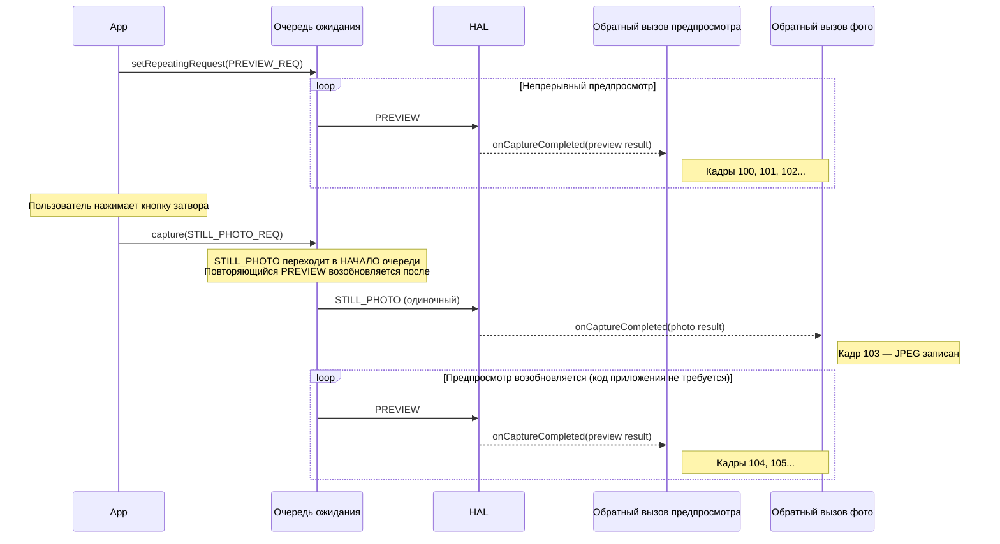
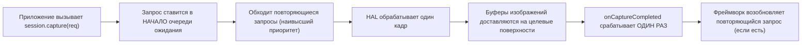
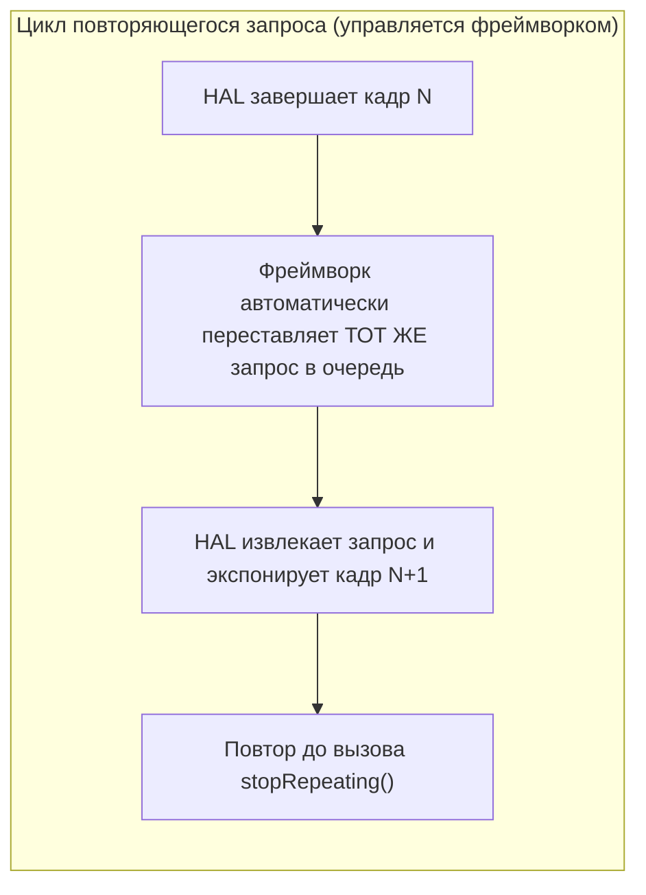
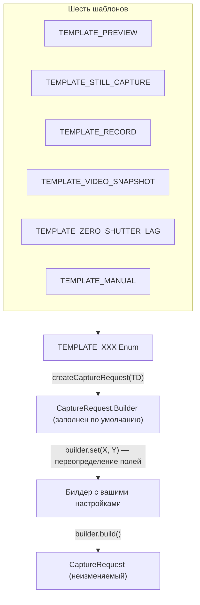

---
sidebar_position: 11
title: "Глава 11: Типы захвата"
description: Изучите три типа захвата в Camera2 — одиночный (capture), серийный (captureBurst) и повторяющийся (setRepeatingRequest), а также встроенные шаблоны (TEMPLATE_PREVIEW, TEMPLATE_STILL_CAPTURE, TEMPLATE_RECORD и др.).
keywords: [типы захвата Camera2, одиночный захват, серийный захват, повторяющийся запрос, captureBurst, setRepeatingRequest, TEMPLATE_PREVIEW, TEMPLATE_STILL_CAPTURE, шаблоны камеры]
---

## 11.1 Три способа наполнения конвейера

В [главе 10](the-camera2-pipeline.md) вы увидели, как запросы проходят через конвейер Camera2: из очереди ожидания в очередь выполнения, затем в HAL, и далее в ваши обратные вызовы и выходные поверхности. Но то, *как вы отправляете* эти запросы, имеет огромное значение. Camera2 предоставляет три механизма отправки, каждый из которых имеет принципиально разное поведение:

1. **Одиночный** (`capture()`) — выполнить один запрос один раз.
2. **Серийный** (`captureBurst()`) — последовательно выполнить список запросов друг за другом.
3. **Повторяющийся** (`setRepeatingRequest()`) — непрерывно выполнять один и тот же запрос (пока он не будет прерван).

В дополнение к этим трем режимам отправки, фреймворк предоставляет шесть **шаблонов захвата**, которые предварительно заполняют `CaptureRequest.Builder` разумными настройками по умолчанию для типичных случаев (предпросмотр, захват фото, видеозапись, нулевая задержка затвора, ручное управление и т. д.).

К концу этой главы вы будете точно знать, когда использовать каждый тип захвата и шаблон, включая то, почему предпросмотр всегда использует повторяющиеся запросы, почему серийная съемка — единственный способ сделать брекетинг экспозиции и почему фотографии используют одиночный захват, даже когда запущен предпросмотр.

Приложение Android Camera Parameters ([GitHub](https://github.com/zoozooll/AndroidCameraParameters), [Play Store](https://play.google.com/store/apps/details?id=com.minininja.cameraparams)) демонстрирует все три типа захвата на вкладке **Capture Demo**. Переключайтесь между режимами «Предпросмотр (повторяющийся)», «Одиночное фото (однократный)» и «Серия (3 кадра)», чтобы увидеть поведение обратных вызовов и разницу в таймингах в реальном времени на вашем устройстве.

## 11.2 Одиночный захват: capture()

Самый простой режим отправки — **одиночный захват** через `CameraCaptureSession.capture()`. Он делает именно то, что заявлено: отправляет один `CaptureRequest` в конвейер, выполняет его ровно один раз и на этом завершается.

```kotlin
// Одиночный захват: захват одного кадра в ImageReader JPEG
fun captureStillPhoto() {
    val builder = cameraDevice.createCaptureRequest(CameraDevice.TEMPLATE_STILL_CAPTURE)
    builder.addTarget(jpegReader.surface)
    builder.set(CaptureRequest.JPEG_QUALITY, 100)
    builder.set(CaptureRequest.CONTROL_AF_MODE, CaptureRequest.CONTROL_AF_MODE_CONTINUOUS_PICTURE)
    builder.set(CaptureRequest.CONTROL_AE_MODE, CaptureRequest.CONTROL_AE_MODE_ON)

    val request = builder.build()

    captureSession.capture(request, object : CameraCaptureSession.CaptureCallback() {
        override fun onCaptureCompleted(
            session: CameraCaptureSession,
            request: CaptureRequest,
            result: TotalCaptureResult
        ) {
            super.onCaptureCompleted(session, request, result)
            Log.d("Capture", "Одиночный захват фото завершен. Кадр #${result.frameNumber}")
        }
    }, backgroundHandler)
}
```

### Когда использовать одиночный захват

| Случай использования | Почему одиночный захват? |
|----------|--------------|
| Одна фотография | Выполняется ровно один раз при нажатии кнопки затвора. |
| Одиночный триггер AF/AE | Запуск `CONTROL_AF_TRIGGER_START` для одного события фокусировки по нажатию. |
| Снимок во время видео | Захват одного кадра высокого разрешения, пока активен повторяющийся запрос видео. |
| Захват одного кадра RAW | Двойной захват RAW + JPEG для одной фотографии. |

### Взаимодействие одиночного захвата с повторяющимся предпросмотром

Критически важный паттерн проектирования в Camera2: **предпросмотр запускается как повторяющийся запрос, а фотографии добавляются как одиночные запросы**. Одиночный запрос встает перед повторяющимся в очереди ожидания (как мы обсуждали в модели очередей в главе 10), поэтому он выполняется немедленно. После завершения одиночного захвата фреймворк автоматически возобновляет выполнение повторяющегося запроса предпросмотра — вам не нужно отправлять его повторно.



:::tip
Это поведение автовозобновления встроено в фреймворк Camera2. Вам никогда не нужно вручную «перезапускать предпросмотр» после одиночного захвата — фреймворк сделает это за вас.
:::

### Поток выполнения одиночного захвата



## 11.3 Серийный захват: captureBurst()

В то время как `capture()` отправляет один запрос, `captureBurst()` отправляет **список запросов `List<CaptureRequest>`** и гарантирует, что все N кадров в списке будут выполнены **последовательно и по порядку, без вклинивания кадров из других источников (включая повторяющийся запрос)**.

Эта гарантия атомарности и отсутствия пропусков делает серийную съемку незаменимой для:

- **Брекетинга экспозиции** — захват 3-5 кадров с ±1EV, ±2EV с последующим объединением в HDR.
- **Брекетинга фокусировки** — проход по дистанциям фокусировки для создания эффекта глубины резкости.
- **Съемки движения** — съемка 10-30 кадров быстродвижущегося объекта для выбора самого четкого.
- **Замедленного видео (high-speed)** — `createHighSpeedRequestList()` + серийная съемка с ограниченной скоростью.
- **Выборки схождения 3A** — запуск триггера AF/AE, а затем серия кадров до схождения.

```kotlin
// Серия: брекетинг экспозиции из 3 кадров (-2EV, 0EV, +2EV)
fun captureExposureBracket() {
    val baseIso = 100
    val baseExposure = 10_000_000L  // 10 мс = базовый уровень "0EV"

    val burstList: MutableList<CaptureRequest> = mutableListOf()

    // Кадр 0: -2EV (выдержка в 4 раза короче = темнее)
    burstList += cameraDevice.createCaptureRequest(CameraDevice.TEMPLATE_STILL_CAPTURE).apply {
        addTarget(jpegReader.surface)
        set(CaptureRequest.SENSOR_SENSITIVITY, baseIso)
        set(CaptureRequest.SENSOR_EXPOSURE_TIME, baseExposure / 4)
        set(CaptureRequest.CONTROL_AE_MODE, CaptureRequest.CONTROL_AE_MODE_OFF)
    }.build()

    // Кадр 1: 0EV (правильная экспозиция)
    burstList += cameraDevice.createCaptureRequest(CameraDevice.TEMPLATE_STILL_CAPTURE).apply {
        addTarget(jpegReader.surface)
        set(CaptureRequest.SENSOR_SENSITIVITY, baseIso)
        set(CaptureRequest.SENSOR_EXPOSURE_TIME, baseExposure)
        set(CaptureRequest.CONTROL_AE_MODE, CaptureRequest.CONTROL_AE_MODE_OFF)
    }.build()

    // Кадр 2: +2EV (выдержка в 4 раза длиннее = светлее)
    burstList += cameraDevice.createCaptureRequest(CameraDevice.TEMPLATE_STILL_CAPTURE).apply {
        addTarget(jpegReader.surface)
        set(CaptureRequest.SENSOR_SENSITIVITY, baseIso)
        set(CaptureRequest.SENSOR_EXPOSURE_TIME, baseExposure * 4)
        set(CaptureRequest.CONTROL_AE_MODE, CaptureRequest.CONTROL_AE_MODE_OFF)
    }.build()

    captureSession.captureBurst(burstList, object : CameraCaptureSession.CaptureCallback() {
        private var completedCount = 0

        override fun onCaptureCompleted(
            session: CameraCaptureSession,
            request: CaptureRequest,
            result: TotalCaptureResult
        ) {
            super.onCaptureCompleted(session, request, result)
            completedCount++
            Log.d("Burst", "Кадр серии $completedCount/${burstList.size} завершен. Кадр #${result.frameNumber}")

            if (completedCount == burstList.size) {
                Log.d("Burst", "Все ${burstList.size} кадров брекетинга захвачены!")
                // TODO: Объединение HDR, фокус-стекинг или выбор лучшего кадра
            }
        }
    }, backgroundHandler)
}
```

### Гарантия последовательности в действии

Ключевым свойством серийной съемки является то, что **весь список ставится в очередь атомарно**. Даже если активен `setRepeatingRequest()`, все N кадров серии будут выполнены друг за другом до возобновления повторяющегося запроса. Кадры повторяющегося запроса не вклиниваются между кадрами серии.

```mermaid
flowchart TB
    subgraph QueueBefore ["Очередь до отправки серии"]
        direction LR
        R1["PREVIEW (повторяющийся)"] --> R2["PREVIEW (повторяющийся)"] --> R3["PREVIEW (повторяющийся)"]
    end

    subgraph Arrow ["приложение вызывает captureBurst([B1,B2,B3])"]
        style Arrow fill:#fff3e0
    end

    subgraph QueueAfter ["После отправки серии (атомарная постановка)"]
        direction LR
        B1["КАДР СЕРИИ 1"] --> B2["КАДР СЕРИИ 2"] --> B3["КАДР СЕРИИ 3"] --> R4["PREVIEW возобновляется"] --> R5["PREVIEW"]
    end

    QueueBefore --> Arrow --> QueueAfter

    Note over B1,B3: Кадры предпросмотра не вклиниваются между ними!
```

### Лимиты размера серии

Максимальный размер серии, которую вы можете отправить за один вызов `captureBurst()`, определяется:
- `CameraCharacteristics.REQUEST_MAX_NUM_OUTPUT_RAW` — для вывода RAW.
- `CameraCharacteristics.REQUEST_MAX_NUM_OUTPUT_PROC` — для обработанного вывода (YUV/JPEG).
- Практической пропускной способностью оборудования (серии 4K будут короче, чем серии 1080p).

Для типичных устройств FULL серии обработанных JPEG из 10-50 кадров допустимы. Серии RAW могут быть ограничены 5-10 кадрами в зависимости от сенсора и памяти.

### Скоростная серия для замедленной съемки

Для замедленного видео Camera2 предоставляет `CameraDevice.createHighSpeedRequestList()`, который преобразует обычный `CaptureRequest` в список запросов серии, подходящих для высокоскоростного видео с ограничениями (например, 120 или 240 кадров в секунду). Это используется вместе с `CameraCaptureSession.captureBurst()` и требует возможности `CONSTRAINED_HIGH_SPEED_VIDEO`:

```kotlin
// Серия: Высокоскоростное замедленное видео (120fps)
fun captureHighSpeedSlowMo() {
    val capabilities = characteristics.get(CameraCharacteristics.REQUEST_AVAILABLE_CAPABILITIES)
    val supportsHighSpeed = capabilities?.contains(
        CameraCharacteristics.REQUEST_AVAILABLE_CAPABILITIES_CONSTRAINED_HIGH_SPEED_VIDEO
    ) ?: false

    if (!supportsHighSpeed) {
        Log.w("HighSpeed", "Устройство не поддерживает скоростное видео с ограничениями")
        return
    }

    // Создание одного базового запроса (нацеленного на MediaRecorder Surface)
    val baseBuilder = cameraDevice.createCaptureRequest(CameraDevice.TEMPLATE_RECORD)
    baseBuilder.addTarget(mediaRecorderSurface)
    val baseRequest = baseBuilder.build()

    // Развертывание в оптимизированный список для скоростной серии (например, 120fps)
    val highSpeedBurst = cameraDevice.createHighSpeedRequestList(listOf(baseRequest))

    // Отправка оптимизированного списка через captureBurst
    captureSession.captureBurst(highSpeedBurst, highSpeedCallback, backgroundHandler)
}
```

## 11.4 Повторяющийся: setRepeatingRequest()

Основным инструментом Camera2 является **повторяющийся запрос**, отправляемый через `CameraCaptureSession.setRepeatingRequest()`. Вместо однократного выполнения, фреймворк заново ставит *тот же самый запрос* в очередь после каждого кадра бесконечно — создавая непрерывный поток кадров с частотой, поддерживаемой оборудованием.

```kotlin
// Повторяющийся: Запуск предпросмотра камеры (непрерывный поток 30fps)
fun startPreview() {
    val builder = cameraDevice.createCaptureRequest(CameraDevice.TEMPLATE_PREVIEW)
    builder.addTarget(previewSurface)
    builder.set(CaptureRequest.CONTROL_AF_MODE, CaptureRequest.CONTROL_AF_MODE_CONTINUOUS_PICTURE)
    builder.set(CaptureRequest.CONTROL_AE_MODE, CaptureRequest.CONTROL_AE_MODE_ON)
    builder.set(CaptureRequest.CONTROL_AWB_MODE, CaptureRequest.CONTROL_AWB_MODE_AUTO)

    val repeatingRequest = builder.build()

    captureSession.setRepeatingRequest(
        repeatingRequest,
        object : CameraCaptureSession.CaptureCallback() {
            private var frameCount = 0
            private var lastFpsLogMs = 0L

            override fun onCaptureCompleted(
                session: CameraCaptureSession,
                request: CaptureRequest,
                result: TotalCaptureResult
            ) {
                super.onCaptureCompleted(session, request, result)
                frameCount++
                val now = System.currentTimeMillis()
                if (now - lastFpsLogMs > 1000) {
                    Log.d("Preview", "FPS предпросмотра: $frameCount")
                    frameCount = 0
                    lastFpsLogMs = now
                }
            }
        },
        backgroundHandler
    )
}
```

### Почему предпросмотр *должен* использовать повторяющиеся запросы

Если бы вы попытались реализовать предпросмотр 30 кадров в секунду, вызывая `capture()` 30 раз в секунду по таймеру, вы бы:
1. Тратили ресурсы процессора на повторную отправку идентичных запросов каждые 33 мс.
2. Столкнулись бы с дрейфом, если бы таймер срабатывал с задержкой.
3. Получали бы пропуски кадров, если бы обратные вызовы блокировали выполнение.
4. Конфликтовали бы с управлением очередью во фреймворке.

Повторяющийся запрос обрабатывается полностью внутри фреймворка/HAL. После завершения каждого кадра HAL автоматически планирует следующую экспозицию без участия потока приложения. Это обеспечивает плавный предпросмотр без пауз и с нулевой нагрузкой на процессор приложения.



### Остановка повторяющихся запросов

Чтобы остановить повторяющийся поток, вызовите `stopRepeating()`. Это удаляет запрос из очереди, но не отменяет кадры, которые уже обрабатываются. Вызовите `abortCaptures()`, чтобы принудительно очистить всё (это вызовет `onCaptureFailed` с `REASON_FLUSHED` для обрабатываемых кадров).

```kotlin
// Временная приостановка предпросмотра
fun pausePreview() {
    captureSession.stopRepeating()
    Log.d("Preview", "Повторение остановлено. Обрабатываемые кадры будут завершены.")
}

// Экстренная остановка — сбросить всё немедленно
fun emergencyStopAllCaptures() {
    captureSession.stopRepeating()
    captureSession.abortCaptures()
    // Все обрабатываемые кадры завершатся с ошибкой REASON_FLUSHED
}
```

### Повторяющиеся запросы также для записи видео

Помимо предпросмотра, повторяющиеся запросы используются для **записи видео** (нацеленной на `Surface` от `MediaRecorder` или `MediaCodec`) и **непрерывного анализа изображений** (нацеленного на YUV `ImageReader` низкого разрешения для детекции лиц, вывода ML и т. д.).

Паттерн всегда один и тот же: настройте один раз, позвольте потоку идти, обновляйте параметры запроса, когда хотите изменить настройки (например, изменить цифровой зум в середине потока, обновив область обрезки в новом повторяющемся запросе).

```kotlin
// Повторяющийся: Обновление уровня зума в реальном времени
fun updateDigitalZoom(cropRegion: Rect) {
    val builder = cameraDevice.createCaptureRequest(CameraDevice.TEMPLATE_PREVIEW)
    builder.addTarget(previewSurface)
    builder.addTarget(mediaRecorderSurface)
    builder.set(CaptureRequest.SCALER_CROP_REGION, cropRegion)
    builder.set(CaptureRequest.CONTROL_AF_MODE, CaptureRequest.CONTROL_AF_MODE_CONTINUOUS_PICTURE)

    // Замена старого повторяющегося запроса новым (те же цели, новая обрезка)
    captureSession.setRepeatingRequest(builder.build(), currentCallback, backgroundHandler)
    Log.d("Zoom", "Повторяющийся запрос обновлен: область ${cropRegion.width()}x${cropRegion.height()}")
}
```

## 11.5 Шаблоны захвата

Каждый `CaptureRequest.Builder` начинается с **шаблона**: вы вызываете `cameraDevice.createCaptureRequest(TEMPLATE_XXX)`, и фреймворк заполняет билдер оптимизированными для этого случая настройками по умолчанию. Затем вы переопределяете только те поля, которые вам нужны.

Шаблоны существуют потому, что конвейер камеры смартфона имеет десятки настроек (сила шумоподавления, повышение резкости краев, кривая тона, подавление мерцания, диапазон частоты кадров...). Шаблоны устанавливают разумные базовые значения, чтобы вам не приходилось настраивать всё с нуля.



### Шесть шаблонов: их настройки и случаи использования

| Шаблон | Случай использования | Ключевые предустановки |
|----------|----------|---------------------------|
| `TEMPLATE_PREVIEW` | Живой видоискатель / предпросмотр | Приоритет низкой задержки, 3A (AF/AE/AWB) в режиме авто, умеренное шумоподавление/резкость, высокая частота кадров (30fps). Плавность важнее качества. |
| `TEMPLATE_STILL_CAPTURE` | Одиночный снимок фото | Приоритет максимального качества, AF в режиме фото, полное шумоподавление/резкость, высококачественное кодирование JPEG, возможно снижение частоты кадров для этого кадра. |
| `TEMPLATE_RECORD` | Запись видео | Стабильная частота кадров, непрерывный AF, метки времени для синхронизации аудио-видео, подавление мерцания, среднее шумоподавление — для движения и сжатия. |
| `TEMPLATE_VIDEO_SNAPSHOT` | Фото высокого рез. во время видео | Похож на STILL_CAPTURE, но сохраняет настройки видеокадра — делает фото без остановки потока записи видео. |
| `TEMPLATE_ZERO_SHUTTER_LAG` | Захват фото ZSL (гл. 14) | Создает кольцевой буфер недавних кадров. При нажатии на затвор возвращается *прошлый* кадр без паузы. Требует серийной съемки и переобработки. |
| `TEMPLATE_MANUAL` | Ручное управление | Все режимы 3A отключены по умолчанию, чтобы вы могли вручную выставлять экспозицию, ISO, фокус и усиление цвета без вмешательства автоматики. База для Pro-интерфейса. |

```kotlin
// Примеры использования шаблонов — посмотрим на значения по умолчанию

// TEMPLATE_PREVIEW — плавность, низкая задержка
val previewBuilder = cameraDevice.createCaptureRequest(CameraDevice.TEMPLATE_PREVIEW)
val previewRequest = previewBuilder.build()
Log.d("Template", "PREVIEW AF_MODE = ${previewRequest.get(CaptureRequest.CONTROL_AF_MODE)}")
// ^ Обычно CONTROL_AF_MODE_CONTINUOUS_PICTURE (постоянная перефокусировка)

// TEMPLATE_STILL_CAPTURE — максимальное качество одного кадра
val stillBuilder = cameraDevice.createCaptureRequest(CameraDevice.TEMPLATE_STILL_CAPTURE)
val stillRequest = stillBuilder.build()
Log.d("Template", "STILL_CAPTURE JPEG_QUALITY = ${stillRequest.get(CaptureRequest.JPEG_QUALITY)}")
// ^ Обычно 100 (максимальное качество кодирования)

// TEMPLATE_MANUAL — всё автоматическое управление отключено
val manualBuilder = cameraDevice.createCaptureRequest(CameraDevice.TEMPLATE_MANUAL)
val manualRequest = manualBuilder.build()
Log.d("Template", "MANUAL AE_MODE = ${manualRequest.get(CaptureRequest.CONTROL_AE_MODE)}")
Log.d("Template", "MANUAL AF_MODE = ${manualRequest.get(CaptureRequest.CONTROL_AF_MODE)}")
Log.d("Template", "MANUAL AWB_MODE = ${manualRequest.get(CaptureRequest.CONTROL_AWB_MODE)}")
// ^ Обычно AE_MODE_OFF, AF_MODE_OFF, AWB_MODE_OFF — ручной режим с самого начала
```

:::tip
Всегда начинайте с шаблона и переопределяйте конкретные поля. Создание запроса на основе `TEMPLATE_PREVIEW` с переопределением 2-3 полей (например, области обрезки для зума или компенсации экспозиции) гораздо надежнее, чем попытка настроить всё с нуля.
:::

## 11.6 Сравнение трех типов захвата

| Характеристика | Одиночный `capture()` | Серийный `captureBurst()` | Повторяющийся `setRepeatingRequest()` |
|-----------|---------------------|----------------------|---------------------------------|
| **Выполнение** | Один запрос выполняется один раз | Список из N запросов выполняется последовательно | Тот же запрос выполняется каждый кадр (автоматически) |
| **Приоритет** | Наивысший — встает в НАЧАЛО очереди ожидания | Высокий — все N кадров вставляются атомарно в НАЧАЛО | Низший — одиночные/серийные вклиниваются перед ним |
| **Прерывание** | Прерывает повторяющийся; он возобновляется после | Прерывает повторяющийся; вся серия завершается до возобновления | Прерывается любым одиночным или серийным; возобновляется сам |
| **Поведение очереди** | Один запрос в очереди | N запросов в очереди последовательно (без пауз) | Один концептуальный запрос переставляется в очередь |
| **Типичное использование** | Одно фото, один триггер AF, фото со вспышкой | Брекетинг, движение, замедление, HDR | Предпросмотр, запись видео, непрерывный ML-анализ, детекция лиц |
| **Обратный вызов** | `onCaptureCompleted` срабатывает один раз | `onCaptureCompleted` срабатывает N раз (по разу на кадр серии) | `onCaptureCompleted` срабатывает непрерывно для каждого кадра (30-60 раз/сек) |

```mermaid
quadrantChart
    title Паттерны использования типов захвата
    x-axis ["Мало кадров", "Много кадров"]
    y-axis ["Одна конфигурация", "Разная конфигурация кадров"]
    quadrant-1 ["Серия: Брекетинг экспозиции / фокуса"]
    quadrant-2 ["Серия: Замедленная съемка (High-Speed)"]
    quadrant-3 ["Одиночный: Обычное фото"]
    quadrant-4 ["Повторяющийся: Предпросмотр + Видео"]
    "Одиночный захват JPEG": [0.15, 0.2]
    "Триггер фокусировки": [0.1, 0.15]
    "HDR брекетинг (3 кадра)": [0.4, 0.75]
    "Фокус-стекинг (7 кадров)": [0.45, 0.8]
    "Замедление 120fps 2 сек": [0.85, 0.25]
    "Предпросмотр 30fps": [0.9, 0.1]
    "Запись видео 4K": [0.88, 0.18]
```

## 11.7 Типы захвата в приложении Android Camera Parameters

Откройте приложение Android Camera Parameters ([GitHub](https://github.com/zoozooll/AndroidCameraParameters), [Play Store](https://play.google.com/store/apps/details?id=com.minininja.cameraparams)) и перейдите на вкладку **Capture Demo**. Приложение наглядно показывает работу всех трех типов захвата:

- Нажмите **Start Preview**, чтобы вызвать `setRepeatingRequest(TEMPLATE_PREVIEW)` и увидеть лог `CaptureCallback` в реальном времени (кадры 1, 2, 3... прокручиваются каждые ~33 мс).
- Нажмите **Take Photo**, чтобы добавить одиночный запрос `capture(TEMPLATE_STILL_CAPTURE)` во время работы предпросмотра. Вы увидите, как счетчик обратных вызовов ненадолго замрет для кадра высокого качества, а затем плавно возобновится.
- Нажмите **Burst 5 Frames**, чтобы вызвать `captureBurst(List<CaptureRequest(5)>)`. Обратите внимание, что ровно 5 кадров завершаются один за другим перед продолжением предпросмотра, что подтверждает гарантию последовательности.

Вы также можете проверить `REQUEST_MAX_NUM_OUTPUT_RAW` и `REQUEST_MAX_NUM_OUTPUT_PROC` на вкладке **Raw JSON**, чтобы увидеть лимиты размера серии для вашего устройства.

## 11.8 Резюме

| Концепция | Ключевой вывод |
|---------|-------------|
| **Одиночный `capture()`** | Один запрос, выполняется один раз, наивысший приоритет. Для фото, триггеров AF. Автовозобновление предпросмотра после. |
| **Серийный `captureBurst()`** | Список запросов выполняется последовательно, без вклинивания других кадров. Для брекетинга, движения, замедления. Список встает в очередь атомарно. |
| **Повторяющийся `setRepeatingRequest()`** | Запрос стримится непрерывно. Фреймворк сам переставляет его в очередь. Для предпросмотра, видео, анализа. Низший приоритет. |
| **Шаблоны** | Шесть базовых наборов настроек для билдера. Начинайте с TEMPLATE_PREVIEW/STILL_CAPTURE/RECORD/ZSL/MANUAL и переопределяйте только нужное. |
| **Правила прерывания** | Одиночные и серийные запросы *всегда* вытесняют повторяющийся. Повторяющийся возобновляется сам. Кадры серии никогда не разрываются. |

## Что дальше

В [главе 12: Глубокое погружение в CameraCharacteristics](cameracharacteristics-deep-dive.md) мы подробно разберем объект статических метаданных, который описывает, *на что вообще способна ваша камера* еще до ее открытия. Мы разберем уровни оборудования (LEGACY → LIMITED → FULL → LEVEL_3 → EXTERNAL), систему флагов возможностей (MANUAL_SENSOR, RAW, DEPTH_OUTPUT и т. д.) и то, как проверять всё это во время выполнения, чтобы писать приложения, работающие на десятках тысяч моделей устройств Android.
