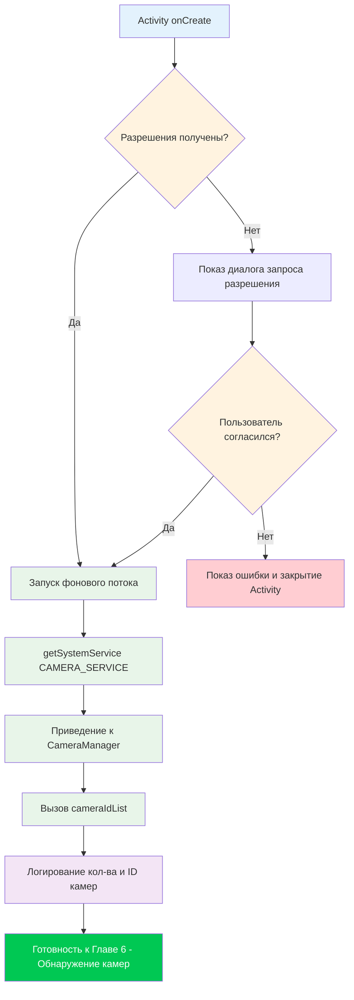

Добро пожаловать в практическую часть серии уроков по Camera2. В предыдущих главах вы узнали об аппаратном обеспечении камер смартфонов и теоретических основах API Camera2. Теперь пришло время засучить рукава и написать настоящий код. К концу этой главы у вас будет рабочий проект Android, который успешно инициализирует API Camera2 и обращается к сервису CameraManager — это критически важный первый шаг перед тем, как вы сможете перечислять камеры, открывать устройства или показывать предпросмотр.

Если вы хотите увидеть промышленный пример всего того, что мы построим в этой серии, изучите приложение **Android Camera Parameters** на [GitHub](https://github.com/zoozooll/AndroidCameraParameters) и в [Google Play](https://play.google.com/store/apps/details?id=com.minininja.cameraparams). Оно демонстрирует продвинутое использование Camera2, включая полное перечисление CameraCharacteristics, ручное управление захватом и поддержку нескольких камер.

## Зачем начинать с настройки проекта?

Прежде чем вы сможете написать хоть одну строку кода Camera2, ваше приложение должно быть правильно настроено. Camera2 — это низкоуровневое, чувствительное к производительности API, и экономия на настройке приведет к таинственным вылетам, ошибкам ANR (приложение не отвечает) или кадрам, которые никогда не дойдут до адресата. Три столпа правильной настройки проекта на Camera2:

1. **Разрешения** — фреймворк Android ограничивает доступ к камере как на этапе установки (манифест), так и во время выполнения (согласие пользователя).
2. **Архитектура потоков** — обратные вызовы Camera2 никогда не должны блокировать главный поток; нам нужен выделенный фоновый поток.
3. **Конфигурация View** — если вы планируете использовать TextureView для предпросмотра (рекомендуемый подход), необходимо включить аппаратное ускорение.

Давайте разберем каждый пункт систематически.

## Шаг 1: Создание нового проекта в Android Studio

Запустите Android Studio и создайте новый проект. Для этой серии уроков мы рекомендуем:

- **Шаблон (Template)**: Empty Activity (самый простой вариант для старта).
- **Язык (Language)**: Kotlin (современный стандарт разработки под Android; все примеры в этой серии написаны на Kotlin).
- **Минимальный SDK (Minimum SDK)**: API 21 (Lollipop) — это первый уровень SDK, нативно поддерживающий Camera2. Если вам нужна поддержка внешних USB-камер через OTG, выбирайте API 23 или выше. Если вам нужна поддержка Scoped Storage для сохранения фото (Глава 9), актуален API 29+, но мы разберем обратную совместимость позже.
- **Язык конфигурации сборки**: Kotlin DSL или Groovy — подойдет любой; наши примеры не будут зависеть от системы сборки.

После генерации проекта откройте файл `build.gradle` (или `build.gradle.kts`) вашего модуля. Шаблон Empty Activity по умолчанию включает большинство нужных зависимостей, но убедитесь, что у вас есть как минимум:

```kotlin
dependencies {
    implementation("androidx.core:core-ktx:1.12.0")
    implementation("androidx.appcompat:appcompat:1.6.1")
    implementation("com.google.android.material:material:1.11.0")
    implementation("androidx.constraintlayout:constraintlayout:2.1.4")
    // Camera2 является частью фреймворка Android, поэтому НИКАКИХ дополнительных 
    // зависимостей для базового API не требуется. 
    // androidx.camera.camera2 нужна только для взаимодействия с CameraX.
}
```

:::tip
Вам **не нужно** добавлять внешние зависимости для Camera2. Весь пакет `android.hardware.camera2` является частью фреймворка Android. Библиотека Jetpack CameraX — это отдельная высокоуровневая абстракция над Camera2; в этом уроке мы используем **нативный API Camera2 напрямую**.
:::

## Шаг 2: Объявление разрешений в AndroidManifest.xml

Каждое приложение для работы с камерой должно объявить разрешение `CAMERA` в `AndroidManifest.xml`. Это сообщает Google Play Store, что ваше приложение использует оборудование камеры, и позволяет отображать диалоговое окно запроса разрешения во время выполнения на Android 6.0 (API 23) и выше.

Откройте `app/src/main/AndroidManifest.xml` и добавьте следующие элементы **как дочерние теги корня `<manifest>`** (не внутри `<application>`):

```xml
<?xml version="1.0" encoding="utf-8"?>
<manifest xmlns:android="http://schemas.android.com/apk/res/android"
    xmlns:tools="http://schemas.android.com/tools">

    <!-- ✅ Объявление разрешения на камеру -->
    <uses-permission android:name="android.permission.CAMERA" />

    <!-- Опциональные объявления функций (используются для фильтрации в Google Play) -->
    <uses-feature
        android:name="android.hardware.camera"
        android:required="true" />
    <uses-feature
        android:name="android.hardware.camera.autofocus"
        android:required="false" />

    <application
        android:allowBackup="true"
        ...>
        <activity
            android:name=".MainActivity"
            android:exported="true"
            android:hardwareAccelerated="true">
            ...
        </activity>
    </application>
</manifest>
```

Разберем важные части:

### `<uses-permission android:name="android.permission.CAMERA" />`

Это основное разрешение. Без него любой вызов сервиса камеры выбросит `SecurityException`. На API 22 и ниже пользователи предоставляют его при установке; на API 23+ вы также должны запрашивать его во время выполнения (рассмотрим далее).

### `<uses-feature android:name="android.hardware.camera" android:required="true" />`

Это объявление сообщает Google Play о необходимости фильтрации вашего приложения для устройств, имеющих хотя бы одну камеру. Установите `android:required="false"`, если ваше приложение может работать без камеры (например, приложение-галерея с опциональной съемкой). Если вы вообще не объявите этот тег, Google Play предположит, что камера **не** обязательна, и приложение может быть установлено на устройства без камер.

### `android:hardwareAccelerated="true"` у `<activity>`

Это **критически важно** для отрисовки предпросмотра в TextureView. TextureView использует конвейер композиции GPU для эффективного отображения кадров камеры. Без включенного аппаратного ускорения на уровне Activity или приложения TextureView не сможет отрисовать картинку (будет черный экран). В современной версии Android значение по умолчанию — `true` для всего приложения, но хорошей практикой считается явное объявление в любой Activity, содержащей TextureView.

## Шаг 3: Запрос разрешения во время выполнения

На Android 6.0 (Marshmallow, API 23) и более поздних версиях одного объявления в манифесте недостаточно. Вы должны **явно запросить разрешение у пользователя** во время работы приложения, используя библиотеку Activity Compat. Стандартный паттерн:

1. Проверить, предоставлено ли уже разрешение через `ContextCompat.checkSelfPermission`.
2. Если предоставлено — переходим к инициализации камеры.
3. Если не предоставлено — вызываем `ActivityCompat.requestPermissions` для показа системного диалога.
4. Обрабатываем результат в `onRequestPermissionsResult`.

Вот полный цикл обработки разрешений в `MainActivity.kt`:

```kotlin
package com.example.camera2tutorial

import android.Manifest
import android.content.pm.PackageManager
import android.os.Bundle
import android.widget.Toast
import androidx.appcompat.app.AppCompatActivity
import androidx.core.app.ActivityCompat
import androidx.core.content.ContextCompat

class MainActivity : AppCompatActivity() {

    override fun onCreate(savedInstanceState: Bundle?) {
        super.onCreate(savedInstanceState)
        setContentView(R.layout.activity_main)

        if (allPermissionsGranted()) {
            initializeCamera()
        } else {
            ActivityCompat.requestPermissions(
                this,
                REQUIRED_PERMISSIONS,
                REQUEST_CODE_PERMISSIONS
            )
        }
    }

    private fun allPermissionsGranted() = REQUIRED_PERMISSIONS.all {
        ContextCompat.checkSelfPermission(baseContext, it) == PackageManager.PERMISSION_GRANTED
    }

    override fun onRequestPermissionsResult(
        requestCode: Int,
        permissions: Array<out String>,
        grantResults: IntArray
    ) {
        super.onRequestPermissionsResult(requestCode, permissions, grantResults)
        if (requestCode == REQUEST_CODE_PERMISSIONS) {
            if (allPermissionsGranted()) {
                initializeCamera()
            } else {
                Toast.makeText(
                    this,
                    "Для работы приложения требуется разрешение на использование камеры.",
                    Toast.LENGTH_LONG
                ).show()
                finish()
            }
        }
    }

    private fun initializeCamera() {
        // TODO: Мы реализуем этот метод в следующих разделах.
        // Здесь будет происходить настройка CameraManager.
        // Пока просто выведем лог.
        android.util.Log.d(TAG, "Разрешения получены. Готовность к инициализации камеры.")
    }

    companion object {
        private const val TAG = "Camera2Tutorial"
        private const val REQUEST_CODE_PERMISSIONS = 10
        private val REQUIRED_PERMISSIONS = arrayOf(Manifest.permission.CAMERA)
    }
}
```

### Почему `allPermissionsGranted()` использует паттерн с массивом

Даже если сейчас нам нужна только `CAMERA`, определение массива `REQUIRED_PERMISSIONS` позволяет легко добавить дополнительные разрешения позже (например, `WRITE_EXTERNAL_STORAGE` для сохранения фото на старых API или `RECORD_AUDIO` для видео). Функция `all { ... }` проверяет, что **каждое** разрешение в массиве предоставлено, прежде чем продолжить.

## Шаг 4: Фоновый поток (HandlerThread)

Это самая часто упускаемая деталь в коде новичков на Camera2, и она вызывает **случайные, трудновоспроизводимые ошибки**. Давайте разберемся, зачем Camera2 нужен фоновый поток, и реализуем его правильно.

### Почему Camera2 НЕ ДОЛЖНА работать в главном потоке

Главный (UI) поток Android отвечает за:
- Отрисовку интерфейса с частотой 60-120 кадров в секунду.
- Обработку событий касания пользователя.
- Рассылку обратных вызовов жизненного цикла.
- Выполнение всего кода Activity/Fragment по умолчанию.

API Camera2 доставляет несколько критически важных обратных вызовов синхронно:
- `CameraDevice.StateCallback` — когда камера открывается, отключается или выдает ошибку.
- `CameraCaptureSession.StateCallback` — когда сеанс захвата настроен.
- `CameraCaptureSession.CaptureCallback` — для каждого кадра (до 60+ раз в секунду!).

Если эти обратные вызовы выполняются в главном потоке, случаются две катастрофические вещи:

1. **Лаги и пропуски кадров**: если обработка вызова занимает хотя бы 10 мс, кадр при 60 FPS пропускается, и пользователь видит заикание картинки.
2. **Взаимные блокировки (deadlocks) и ANR**: некоторые методы Camera2 (например, `close()`) являются синхронными и ждут обратных вызовов. Если вызов должен выполниться в том же потоке, который вызвал `close()`, вы получите вечную блокировку.

Решение — **выделенный фоновый поток** со своим собственным Looper, реализованный через `HandlerThread`.

### Правильная реализация HandlerThread

Жизненный цикл фонового потока должен совпадать с жизненным циклом операций камеры. Мы запускаем поток, когда Activity запускается/возобновляется, и завершаем его, когда Activity останавливается/приостанавливается.

```kotlin
package com.example.camera2tutorial

import android.Manifest
import android.content.Context
import android.content.pm.PackageManager
import android.hardware.camera2.CameraManager
import android.os.Bundle
import android.os.Handler
import android.os.HandlerThread
import android.util.Log
import android.widget.Toast
import androidx.appcompat.app.AppCompatActivity
import androidx.core.app.ActivityCompat
import androidx.core.content.ContextCompat

class MainActivity : AppCompatActivity() {

    // --- Компоненты фоновой многопоточности ---
    private lateinit var backgroundThread: HandlerThread
    private lateinit var backgroundHandler: Handler

    override fun onCreate(savedInstanceState: Bundle?) {
        super.onCreate(savedInstanceState)
        setContentView(R.layout.activity_main)

        if (allPermissionsGranted()) {
            initializeCamera()
        } else {
            ActivityCompat.requestPermissions(
                this,
                REQUIRED_PERMISSIONS,
                REQUEST_CODE_PERMISSIONS
            )
        }
    }

    override fun onResume() {
        super.onResume()
        startBackgroundThread()
        // Реинициализация, если разрешения были даны, пока приложение было в фоне
        if (allPermissionsGranted() && this::cameraManager.isInitialized) {
            // (cameraManager объявляется ниже)
        }
    }

    override fun onPause() {
        stopBackgroundThread()
        super.onPause()
    }

    private fun startBackgroundThread() {
        backgroundThread = HandlerThread("Camera2Background").apply {
            start()
        }
        backgroundHandler = Handler(backgroundThread.looper)
        Log.d(TAG, "Фоновый поток запущен: ${backgroundThread.name}")
    }

    private fun stopBackgroundThread() {
        backgroundThread.quitSafely()
        try {
            backgroundThread.join(1000) // Ждем завершения до 1 секунды
            Log.d(TAG, "Фоновый поток чисто остановлен")
        } catch (e: InterruptedException) {
            Log.e(TAG, "Прерывание во время ожидания завершения фонового потока", e)
        }
    }

    // --- Инициализация CameraManager ---
    private lateinit var cameraManager: CameraManager

    private fun initializeCamera() {
        cameraManager = getSystemService(Context.CAMERA_SERVICE) as CameraManager

        val cameraIdList = cameraManager.cameraIdList
        Log.d(TAG, "Успешный доступ к CameraManager. Найдено камер: ${cameraIdList.size}.")
        cameraIdList.forEachIndexed { index, cameraId ->
            Log.d(TAG, "Камера $index: ID = $cameraId")
        }

        Toast.makeText(
            this,
            "CameraManager инициализирован! Найдено камер: ${cameraIdList.size}.",
            Toast.LENGTH_LONG
        ).show()
    }

    // --- Обработка разрешений (как и раньше) ---
    private fun allPermissionsGranted() = REQUIRED_PERMISSIONS.all {
        ContextCompat.checkSelfPermission(baseContext, it) == PackageManager.PERMISSION_GRANTED
    }

    override fun onRequestPermissionsResult(
        requestCode: Int,
        permissions: Array<out String>,
        grantResults: IntArray
    ) {
        super.onRequestPermissionsResult(requestCode, permissions, grantResults)
        if (requestCode == REQUEST_CODE_PERMISSIONS) {
            if (allPermissionsGranted()) {
                initializeCamera()
            } else {
                Toast.makeText(
                    this,
                    "Для работы приложения требуется разрешение на использование камеры.",
                    Toast.LENGTH_LONG
                ).show()
                finish()
            }
        }
    }

    companion object {
        private const val TAG = "Camera2Tutorial"
        private const val REQUEST_CODE_PERMISSIONS = 10
        private val REQUIRED_PERMISSIONS = arrayOf(Manifest.permission.CAMERA)
    }
}
```

### Пояснения к паттернам работы с потоками

1. **`startBackgroundThread()` в `onResume()`**: каждый раз, когда Activity выходит на передний план, мы создаем новый `HandlerThread`, запускаем его и создаем `Handler`, привязанный к `Looper` этого потока. Этот Handler будет передаваться во все методы Camera2, принимающие обратные вызовы (`openCamera`, `createCaptureSession` и др.).

2. **`stopBackgroundThread()` в `onPause()`**: перед тем как Activity уйдет в фоновый режим, мы вызываем `quitSafely()` у потока. Это велит Looper'у перестать принимать новые сообщения после завершения текущего (в отличие от `quit()`, который просто отбрасывает очередь). Затем мы вызываем `join(1000)`, чтобы заблокировать главный поток максимум на одну секунду, пока фоновый поток завершает работу. Это предотвращает утечки ресурсов.

3. **Почему `HandlerThread` вместо корутин (CoroutineDispatcher)?** Camera2 появилась на несколько лет раньше корутин Kotlin, и ее система обратных вызовов фундаментально основана на связке Handler/Looper. Хотя вы можете использовать `Dispatchers.Default.asExecutor()` или оборачивать вызовы в `suspendCoroutine` для кода более высокого уровня, подлежащему API Camera2 всё равно нужен поток с Looper для работы колбэков. Использование `HandlerThread` напрямую — каноничный подход, описанный в официальной документации Android.

## Шаг 5: Полный цикл инициализации (в сборе)

Теперь посмотрим на полную последовательность событий, которые должны произойти при запуске приложения. Порядок критичен: разрешения → поток → CameraManager. Если вы поменяете шаги местами, код вылетит или будет вести себя непредсказуемо.



Диаграмма выше иллюстрирует смысл каждого шага:

- **Разрешения**: вся подсистема камер защищена; мы не можем продолжать, пока пользователь не даст согласие.
- **Поток перед CameraManager**: хотя сам `getSystemService()` потокобезопасен, мы хотим, чтобы фоновый поток уже работал до начала любых операций в Camera2, управляемых обратными вызовами (которые начнутся в следующей главе).
- **CameraManager → cameraIdList**: вызов `cameraIdList` — самый дешевый способ проверить работу CameraManager. Если он проходит без ошибок, значит объявление в манифесте, разрешения и привязка к сервису верны.

## Итог: запуск и проверка

На данном этапе у вас есть полноценный, готовый к запуску проект на Camera2, который:
1. Создает проект Android с правильными целями SDK.
2. Объявляет разрешение CAMERA в манифесте.
3. Запрашивает разрешение во время выполнения, обрабатывая согласие и отказ.
4. Запускает выделенный HandlerThread в `onResume` и чисто останавливает его в `onPause`.
5. Получает системный сервис `CAMERA_SERVICE` и приводит его к `CameraManager`.
6. Вызывает `cameraIdList` и выводит количество камер и их ID в лог.

### Что вы должны увидеть при запуске

1. При первом запуске Android покажет диалог: *«Разрешить приложению Camera2Tutorial снимать фото и видео?»*
2. Нажмите **Разрешить**.
3. Появится Toast: *«CameraManager инициализирован! Найдено камер: X».*
4. В Logcat (фильтр по `Camera2Tutorial`) вы увидите записи вида:
   ```
   D/Camera2Tutorial: Фоновый поток запущен: Camera2Background
   D/Camera2Tutorial: Успешный доступ к CameraManager. Найдено камер: 4.
   D/Camera2Tutorial: Камера 0: ID = 0
   D/Camera2Tutorial: Камера 1: ID = 1
   D/Camera2Tutorial: Камера 2: ID = 2
   D/Camera2Tutorial: Камера 3: ID = 3
   ```
5. При нажатии кнопки «Домой» или уходе из приложения в логе появится:
   ```
   D/Camera2Tutorial: Фоновый поток чисто остановлен
   ```

Если вы видите эти логи, **поздравляем**! Вы успешно заложили фундамент приложения на Camera2. Предпросмотра пока нет — он появится в главе 8, — но «водопровод» настроен верно. Если вы получили `SecurityException`, проверьте еще раз, дали ли вы разрешение в диалоге. Если `cameraIdList` возвращает пустой массив, возможно, на устройстве нет камер (вряд ли для телефона) или разрешение было отклонено.

## Решение типичных проблем настройки

### `SecurityException: Lacking privileges to access camera service`

Это означает, что разрешение во время выполнения не было предоставлено. Проверьте:
- Добавили ли вы `<uses-permission android:name="android.permission.CAMERA" />` в манифест.
- Вызвали ли вы `ActivityCompat.requestPermissions` с правильным кодом запроса.
- Нажал ли пользователь «Разрешить» в диалоге.
- Если вы тестируете на реальном устройстве, зайдите в Настройки → Приложения → Ваше приложение → Разрешения и убедитесь, что Камера включена.

### `NullPointerException` при обращении к `backgroundHandler`

Это случается, если вы пытаетесь использовать `backgroundHandler` до того, как сработал `startBackgroundThread()`. Убедитесь, что все операции Camera2, принимающие Handler, выполняются только **после** того, как был вызван `onResume` и поток запущен. В нашем коде `initializeCamera()` вызывается из `onCreate`, но она использует только синхронные вызовы CameraManager; колбэки, требующие `backgroundHandler`, будут добавлены в следующих главах и будут защищены проверкой `onResume`.

### `TextureView` показывает черный экран в последующих главах

Если вы забежите вперед и добавите TextureView сейчас, убедитесь, что в манифесте для вашей Activity прописано `android:hardwareAccelerated="true"`. Также проверьте, что TextureView прикреплен к иерархии представлений и видим в вашем XML-макете.

## Резюме

В этой главе вы построили каркас приложения для Android на Camera2. Вы узнали:

1. **Структура проекта**: как создать новый проект в Android Studio с шаблоном Empty Activity, нацеленный на API 21+, используя Kotlin, и убедились, что внешние зависимости для Camera2 не нужны.
2. **Конфигурация манифеста**: объявление разрешения `CAMERA`, теги `uses-feature` для фильтрации в Google Play и `hardwareAccelerated="true"` для Activity для работы TextureView.
3. **Разрешения во время выполнения**: полный цикл «проверка → запрос → результат» с использованием `ContextCompat.checkSelfPermission` и `ActivityCompat.requestPermissions`, с обработкой путей согласия и отказа.
4. **Фоновая многопоточность**: почему обратные вызовы Camera2 не должны работать в главном потоке, и как реализовать пару `HandlerThread` + `Handler` с управлением жизненным циклом в `onResume` и `onPause`.
5. **Инициализация CameraManager**: получение системного сервиса `CAMERA_SERVICE`, приведение к `CameraManager`, вызов `cameraIdList` для проверки работы сервиса и логирование обнаруженных ID камер.

Код этой главы — фундамент для всего последующего материала. Приложение Android Camera Parameters ([GitHub](https://github.com/zoozooll/AndroidCameraParameters), [Google Play](https://play.google.com/store/apps/details?id=com.minininja.cameraparams)) использует именно эти паттерны — несколько `HandlerThread` для разных нагрузок, тщательную проверку разрешений и надежное управление жизненным циклом.

## Что дальше

Теперь, когда `CameraManager` успешно инициализирован и у нас есть список ID камер, следующим шагом будет **запрос возможностей каждой камеры**. В **Главе 6: Обнаружение камер** вы:

- Узнаете, что представляют собой строки ID камер (и почему нельзя жестко прописывать предположения о них).
- Научитесь различать фронтальные, основные и внешние (USB OTG) камеры с помощью `LENS_FACING`.
- Запросите уровень аппаратной поддержки каждой камеры (`INFO_SUPPORTED_HARDWARE_LEVEL`), чтобы определить, является ли она LEGACY, LIMITED, FULL или LEVEL_3.
- Пройдете циклом по каждой камере на устройстве и выведете ее свойства, используя `CameraCharacteristics`.

К концу главы 6 у вас будет готовая утилита для перечисления камер, которая извлекает реальные метаданные Camera2 из устройства — то, что уже можно использовать для сравнения «железа» разных телефонов!
