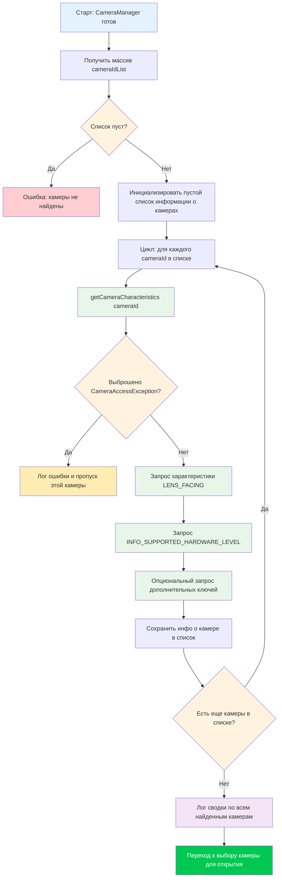

---
sidebar_position: 6
title: "Глава 6: Обнаружение камер"
description: Перечисляйте и запрашивайте каждую камеру на устройстве Android с помощью CameraCharacteristics. Узнайте семантику ID камер, направления линз (передняя/задняя/внешняя), внешние камеры USB OTG и иерархию уровней оборудования от LEGACY до LEVEL_3.
keywords: [CameraCharacteristics, LENS_FACING, перечисление камер, INFO_SUPPORTED_HARDWARE_LEVEL, внешняя USB камера]
---

В главе 5 вы успешно инициализировали `CameraManager` и получили список идентификаторов камер — но такая строка, как `"0"` или `"2"`, ничего не говорит вам о том, что это за камера на самом деле. Это сверхширокоугольная задняя камера? Селфи-камера? Внешняя веб-камера USB, подключенная через OTG? В этой главе вы узнаете, как ответить на эти вопросы с помощью `CameraCharacteristics` — контейнера метаданных, описывающего все возможности устройства камеры.

Для ознакомления с эталонной реализацией перечисления камер и проверки характеристик промышленного уровня изучите приложение **Android Camera Parameters** ([GitHub](https://github.com/zoozooll/AndroidCameraParameters), [Google Play](https://play.google.com/store/apps/details?id=com.minininja.cameraparams)). Оно обходит каждый ключ в `CameraCharacteristics` для каждой камеры на устройстве и представляет результаты в интерфейсе с возможностью поиска и фильтрации — именно такой инструмент вам понадобится при отладке проблем Camera2, специфичных для конкретного оборудования.

## Понимание идентификаторов камер (Camera ID)

Прежде чем погрузиться в характеристики, нам нужно устранить фундаментальный источник путаницы для новых разработчиков Camera2: **что на самом деле означают числовые строки идентификаторов камер?**

Когда вы вызываете `cameraManager.cameraIdList`, вы получаете обратно `Array<String>`, например: `["0", "1", "2", "3", "4"]`. Велик соблазн жестко прописать предположения типа:
- `"0"` = задняя широкоугольная камера
- `"1"` = фронтальная камера
- `"2"` = телеобъектив

**Никогда так не делайте.** Сопоставление ID → физическая камера является:
1. **Специфичным для устройства**: Pixel 8 может использовать ID `"1"` для фронтальной камеры, а Samsung Galaxy S24 — ID `"3"`.
2. **Специфичным для версии**: обновление прошивки OEM (OTA) может изменить список ID после выпуска устройства.
3. **Специфичным для сборки**: некоторые логические устройства с несколькими камерами (рассматриваются в главе Части III) динамически показывают или скрывают базовые физические камеры в зависимости от режимов.

**Единственно правильный** подход — **запросить характеристики каждого ID** и выбрать камеру на основе свойств, которые вам важны (направление линз, уровень оборудования, диапазон фокусных расстояний и т. д.). Именно так поступают грамотно написанные приложения для Camera2, и именно этот паттерн мы реализуем здесь.

## Процесс перечисления камер

Общий алгоритм обнаружения камер на первый взгляд прост, но имеет важные нюансы, связанные с обработкой ошибок. Давайте сначала рассмотрим этот процесс в виде блок-схемы, а затем реализуем его в коде.



Ключевые наблюдения из блок-схемы:
1. **Всегда обрабатывайте пустые списки ID**: это редкость для телефонов, но часто встречается на Android TV, безголовых устройствах или эмуляторах без виртуальной камеры.
2. **Всегда оборачивайте `getCameraCharacteristics` в try/catch**: камера может быть отключена в процессе перечисления (особенно внешняя USB-камера), или политика безопасности устройства может ограничивать доступ к определенным камерам.
3. **Пройдите цикл полностью, затем выбирайте**: сначала соберите всех кандидатов, а затем выберите лучшего на основе ваших критериев. Не открывайте первую же «подходящую» камеру — вы можете пропустить лучшую.

## Знакомство с CameraCharacteristics

`CameraCharacteristics` — это неизменяемая карта «ключ-значение» только для чтения, которая описывает возможности оборудования камеры. Она содержит несколько сотен ключей, охватывающих всё: от фокусного расстояния линзы до размера матрицы пикселей сенсора и поддерживаемых форматов вывода.

Вы получаете объект характеристик с помощью:
```kotlin
val characteristics: CameraCharacteristics =
    cameraManager.getCameraCharacteristics(cameraId)
```

И запрашиваете отдельные ключи с помощью универсального метода `get`:
```kotlin
val lensFacing: Int? = characteristics.get(CameraCharacteristics.LENS_FACING)
```

Тип возвращаемого значения является nullable (в данном случае `Int?`), так как некоторые ключи являются необязательными и могут отсутствовать на всех устройствах. На практике ключи, которые мы запрашиваем в этой главе (`LENS_FACING` и `INFO_SUPPORTED_HARDWARE_LEVEL`), гарантированно присутствуют для каждой валидной камеры, но все равно рекомендуется обрабатывать null для безопасности.

:::note
Эта глава намеренно охватывает только `LENS_FACING` и `INFO_SUPPORTED_HARDWARE_LEVEL`. Более глубокое изучение `CameraCharacteristics` (характеристики сенсора, конфигурации вывода, доступные возможности) является темой главы 10 Части III: Энциклопедия CameraCharacteristics. Мы сосредоточимся на минимальной информации, необходимой для выбора камеры для открытия.
:::

## Ключ 1: LENS_FACING — Передняя, Задняя или Внешняя

Первое, что нужно знать почти любому приложению камеры, — это в каком направлении направлен объектив. Camera2 определяет три константы:

| Константа | Значение | Значение | Типичный случай использования |
|---|---|---|---|
| `LENS_FACING_BACK` | `0` | Камера на задней панели, направлена от пользователя | Фотосъемка, пейзажное видео, AR |
| `LENS_FACING_FRONT` | `1` | Камера на передней панели, направлена на пользователя | Селфи, видеозвонки |
| `LENS_FACING_EXTERNAL` | `2` | Внешняя камера (например, USB OTG веб-камера) | Внешние аксессуары, специальные камеры |

Вот как преобразовать целое число в человекочитаемую строку:

```kotlin
fun lensFacingToString(facing: Int?): String = when (facing) {
    CameraCharacteristics.LENS_FACING_BACK -> "Задняя (LENS_FACING_BACK)"
    CameraCharacteristics.LENS_FACING_FRONT -> "Передняя (LENS_FACING_FRONT)"
    CameraCharacteristics.LENS_FACING_EXTERNAL -> "Внешняя / USB OTG (LENS_FACING_EXTERNAL)"
    null -> "Неизвестно (null)"
    else -> "Неизвестно (value=$facing)"
}
```

### Особый случай: Внешние камеры (USB OTG)

`LENS_FACING_EXTERNAL` была добавлена в API 23 (Marshmallow). Перед открытием внешней камеры учтите:

1. **Объявление функции USB Host**: если ваше приложение специально нацелено на внешние камеры, добавьте `<uses-feature android:name="android.hardware.usb.host" />` в манифест. Установите `required="false"`, если приложение также работает со встроенными камерами.
2. **Разрешение для внешних устройств**: на многих устройствах для доступа к USB-камере достаточно только разрешения `CAMERA`. Однако некоторые чипсеты USB-веб-камер требуют дополнительного подтверждения разрешения USB-хоста через `UsbManager.requestPermission()`. Обрабатывайте широковещательное сообщение `UsbManager.ACTION_USB_DEVICE_ATTACHED`, если хотите автоматически определять подключение камеры.
3. **Уровень оборудования**: внешние камеры почти всегда сообщают об уровне `INFO_SUPPORTED_HARDWARE_LEVEL_EXTERNAL` (см. ниже), что означает, что их набор функций ограничен драйвером USB Video Class (UVC). Не ожидайте ручного управления или вывода RAW от обычной веб-камеры.

На телефоне с подключенной USB-веб-камерой `cameraIdList` может вернуть что-то вроде `["0", "1", "100"]`, где `"100"` — динамически назначенный ID внешней камеры. Идентификаторы внешних камер обычно представляют собой большие числа и **не являются** стабильными после перезагрузки или повторного подключения.

## Ключ 2: INFO_SUPPORTED_HARDWARE_LEVEL — На что способна эта камера?

Уровень аппаратной поддержки — это самая важная классификация возможностей в Camera2. Он сообщает вам, реализуют ли оборудование камеры и HAL (Hardware Abstraction Layer) полный конвейер Camera2 или используют устаревшую обертку совместимости со старым Camera API. Существует пять значений:

| Уровень | Значение | Значение | Реальные устройства |
|---|---|---|---|
| `LEGACY` | `2` | Режим устаревшего HAL. Камера работает поверх старого Camera API через прослойку. Очень ограниченная функциональность, нет ручного управления, нет RAW. | Бюджетные телефоны, устройства до 2015 года, многие эмуляторы |
| `LIMITED` | `0` | Ограниченная поддержка HAL3. Базовый захват, базовые 3A (автоэкспозиция, автофокус, автобаланс белого), но отсутствуют продвинутые функции. | Телефоны среднего сегмента, некоторые фронтальные камеры на флагманах |
| `FULL` | `1` | Полная поддержка HAL3. Ручное управление сенсором, покадровые настройки, вывод RAW, переобработка. | Основные камеры флагманов, основные камеры серии Pixel |
| `LEVEL_3` | `3` | Расширенная поддержка HAL3. Добавлена переобработка YUV, многокадровый ввод, конфигурации разрешений для скоростной съемки. | Последние флагманы, основные камеры Pixel 6+ |
| `EXTERNAL` | `4` | Внешняя камера (USB/OTG). Ограниченные функции, устройство класса UVC. | USB веб-камеры, карты захвата HDMI |

Эту иерархию удобно представлять как лестницу возможностей:

```
LEGACY → LIMITED → FULL → LEVEL_3
          ↑
       EXTERNAL (параллельная ветка для USB-камер)
```

Каждая ступень опирается на предыдущую: `FULL` включает в себя всё, что есть в `LIMITED`, `LEVEL_3` включает в себя всё, что есть в `FULL`. При написании кода для определения функций проверяйте уровни от высшего к низшему — если камера имеет уровень `LEVEL_3`, вы автоматически знаете, что она поддерживает и функции `FULL`.

Вот вспомогательная функция для преобразования уровня в описание:

```kotlin
fun hardwareLevelToString(level: Int?): String = when (level) {
    CameraMetadata.INFO_SUPPORTED_HARDWARE_LEVEL_LEGACY ->
        "LEGACY (прослойка старого Camera API — ограничено ручное управление)"
    CameraMetadata.INFO_SUPPORTED_HARDWARE_LEVEL_LIMITED ->
        "LIMITED (базовый HAL3 — стандартное фото/видео)"
    CameraMetadata.INFO_SUPPORTED_HARDWARE_LEVEL_FULL ->
        "FULL (полный HAL3 — ручное управление + RAW)"
    CameraMetadata.INFO_SUPPORTED_HARDWARE_LEVEL_3 ->
        "LEVEL_3 (расширенный HAL3 — переобработка + многокадровость)"
    CameraMetadata.INFO_SUPPORTED_HARDWARE_LEVEL_EXTERNAL ->
        "EXTERNAL (USB/OTG камера — класс UVC)"
    null -> "Неизвестно (null)"
    else -> "Неизвестно (value=$level)"
}
```

:::tip
Если вы хотите писать код, который работает только на продвинутом оборудовании, используйте `>= LIMITED` для базового захвата, `>= FULL` для ручного управления и `>= LEVEL_3` для конвейеров переобработки. Никогда не предполагайте, что камера уровня FULL или выше — всегда проверяйте. Приложение Android Camera Parameters в [Google Play](https://play.google.com/store/apps/details?id=com.minininja.cameraparams) отображает уровень оборудования в виде заметного значка для каждой камеры, чтобы вы могли быстро увидеть возможности каждого устройства.
:::

## Полный код на Kotlin: Утилита обнаружения камер

Теперь объединим всё в рабочую реализацию. Мы расширим `MainActivity.kt` из главы 5 методом `discoverAndLogCameras()`, который обходит все камеры, запрашивает `LENS_FACING` и `INFO_SUPPORTED_HARDWARE_LEVEL` для каждой из них и выводит результаты в Logcat.

```kotlin
package com.example.camera2tutorial

import android.Manifest
import android.content.Context
import android.content.pm.PackageManager
import android.hardware.camera2.CameraAccessException
import android.hardware.camera2.CameraCharacteristics
import android.hardware.camera2.CameraManager
import android.hardware.camera2.CameraMetadata
import android.os.Bundle
import android.os.Handler
import android.os.HandlerThread
import android.util.Log
import android.widget.Toast
import androidx.appcompat.app.AppCompatActivity
import androidx.core.app.ActivityCompat
import androidx.core.content.ContextCompat

class MainActivity : AppCompatActivity() {

    private lateinit var backgroundThread: HandlerThread
    private lateinit var backgroundHandler: Handler
    private lateinit var cameraManager: CameraManager

    override fun onCreate(savedInstanceState: Bundle?) {
        super.onCreate(savedInstanceState)
        setContentView(R.layout.activity_main)

        if (allPermissionsGranted()) {
            initializeCameraManager()
        } else {
            ActivityCompat.requestPermissions(
                this,
                REQUIRED_PERMISSIONS,
                REQUEST_CODE_PERMISSIONS
            )
        }
    }

    override fun onResume() {
        super.onResume()
        startBackgroundThread()
    }

    override fun onPause() {
        stopBackgroundThread()
        super.onPause()
    }

    private fun startBackgroundThread() {
        backgroundThread = HandlerThread("Camera2Background").apply { start() }
        backgroundHandler = Handler(backgroundThread.looper)
    }

    private fun stopBackgroundThread() {
        backgroundThread.quitSafely()
        try {
            backgroundThread.join(1000)
        } catch (e: InterruptedException) {
            Log.e(TAG, "Прерывание во время ожидания завершения фонового потока", e)
        }
    }

    private fun initializeCameraManager() {
        cameraManager = getSystemService(Context.CAMERA_SERVICE) as CameraManager
        discoverAndLogCameras()
    }

    // -------------------------------------------------------------------------
    // 📸 ДОПОЛНЕНИЯ ГЛАВЫ 6: Обнаружение камер и запрос характеристик
    // -------------------------------------------------------------------------
    data class CameraInfo(
        val id: String,
        val lensFacing: Int?,
        val hardwareLevel: Int?
    ) {
        fun description(): String = buildString {
            append("ID камеры: $id | ")
            append("Направление: ${lensFacingToString(lensFacing)} | ")
            append("Уровень оборудования: ${hardwareLevelToString(hardwareLevel)}")
        }
    }

    private fun discoverAndLogCameras() {
        val cameraIdList: Array<String> = try {
            cameraManager.cameraIdList
        } catch (e: CameraAccessException) {
            Log.e(TAG, "Не удалось получить список ID камер", e)
            Toast.makeText(this, "Сервис камеры недоступен", Toast.LENGTH_LONG).show()
            return
        }

        if (cameraIdList.isEmpty()) {
            Log.w(TAG, "Камеры не найдены на этом устройстве")
            Toast.makeText(this, "Нет доступных камер", Toast.LENGTH_LONG).show()
            return
        }

        val discoveredCameras = mutableListOf<CameraInfo>()
        Log.i(TAG, "═══════════════════════════════════════════")
        Log.i(TAG, "Запуск обнаружения камер (найдено ID: ${cameraIdList.size})")
        Log.i(TAG, "═══════════════════════════════════════════")

        for ((index, cameraId) in cameraIdList.withIndex()) {
            try {
                val characteristics = cameraManager.getCameraCharacteristics(cameraId)

                val lensFacing = characteristics.get(CameraCharacteristics.LENS_FACING)
                val hardwareLevel =
                    characteristics.get(CameraCharacteristics.INFO_SUPPORTED_HARDWARE_LEVEL)

                val info = CameraInfo(cameraId, lensFacing, hardwareLevel)
                discoveredCameras.add(info)

                Log.i(TAG, "── Камера $index ──")
                Log.i(TAG, info.description())

            } catch (e: CameraAccessException) {
                Log.e(TAG, "Не удалось получить доступ к характеристикам камеры $cameraId", e)
            } catch (e: IllegalArgumentException) {
                Log.e(TAG, "Некорректный ID камеры: $cameraId", e)
            }
        }

        Log.i(TAG, "═══════════════════════════════════════════")
        Log.i(TAG, "Обнаружение завершено. Успешно перечислено камер: ${discoveredCameras.size}.")

        // Группировка и сводка по направлению
        val byFacing = discoveredCameras.groupBy { it.lensFacing }
        Log.i(TAG, "  Задние:         ${byFacing[CameraCharacteristics.LENS_FACING_BACK]?.size ?: 0}")
        Log.i(TAG, "  Передние:        ${byFacing[CameraCharacteristics.LENS_FACING_FRONT]?.size ?: 0}")
        Log.i(TAG, "  Внешние/OTG:    ${byFacing[CameraCharacteristics.LENS_FACING_EXTERNAL]?.size ?: 0}")

        // Группировка и сводка по уровню оборудования
        val byLevel = discoveredCameras.groupBy { it.hardwareLevel }
        Log.i(TAG, "  Камеры LEGACY:   ${byLevel[CameraMetadata.INFO_SUPPORTED_HARDWARE_LEVEL_LEGACY]?.size ?: 0}")
        Log.i(TAG, "  Камеры LIMITED:  ${byLevel[CameraMetadata.INFO_SUPPORTED_HARDWARE_LEVEL_LIMITED]?.size ?: 0}")
        Log.i(TAG, "  Камеры FULL:     ${byLevel[CameraMetadata.INFO_SUPPORTED_HARDWARE_LEVEL_FULL]?.size ?: 0}")
        Log.i(TAG, "  Камеры LEVEL_3:  ${byLevel[CameraMetadata.INFO_SUPPORTED_HARDWARE_LEVEL_3]?.size ?: 0}")
        Log.i(TAG, "  Камеры EXTERNAL: ${byLevel[CameraMetadata.INFO_SUPPORTED_HARDWARE_LEVEL_EXTERNAL]?.size ?: 0}")
        Log.i(TAG, "═══════════════════════════════════════════")

        val summary = buildString {
            append("Обнаружено камер: ${discoveredCameras.size}!\n")
            append("Задние: ${byFacing[CameraCharacteristics.LENS_FACING_BACK]?.size ?: 0} • ")
            append("Передние: ${byFacing[CameraCharacteristics.LENS_FACING_FRONT]?.size ?: 0} • ")
            append("Внешние: ${byFacing[CameraCharacteristics.LENS_FACING_EXTERNAL]?.size ?: 0}")
        }

        Toast.makeText(this, summary, Toast.LENGTH_LONG).show()

        // Сохранение для последующих глав (выбор камеры для открытия)
        this.discoveredCameras = discoveredCameras
    }

    private var discoveredCameras: List<CameraInfo> = emptyList()

    // Вспомогательная функция: получить ID задней камеры по умолчанию (первая найденная задняя)
    fun getDefaultBackCameraId(): String? =
        discoveredCameras.firstOrNull {
            it.lensFacing == CameraCharacteristics.LENS_FACING_BACK
        }?.id

    // Вспомогательная функция: получить ID фронтальной камеры по умолчанию
    fun getDefaultFrontCameraId(): String? =
        discoveredCameras.firstOrNull {
            it.lensFacing == CameraCharacteristics.LENS_FACING_FRONT
        }?.id

    companion object {
        private const val TAG = "Camera2Tutorial"
        private const val REQUEST_CODE_PERMISSIONS = 10
        private val REQUIRED_PERMISSIONS = arrayOf(Manifest.permission.CAMERA)

        fun lensFacingToString(facing: Int?): String = when (facing) {
            CameraCharacteristics.LENS_FACING_BACK -> "Задняя"
            CameraCharacteristics.LENS_FACING_FRONT -> "Передняя"
            CameraCharacteristics.LENS_FACING_EXTERNAL -> "Внешняя/USB"
            null -> "Неизвестно(null)"
            else -> "Неизвестно($facing)"
        }

        fun hardwareLevelToString(level: Int?): String = when (level) {
            CameraMetadata.INFO_SUPPORTED_HARDWARE_LEVEL_LEGACY -> "LEGACY"
            CameraMetadata.INFO_SUPPORTED_HARDWARE_LEVEL_LIMITED -> "LIMITED"
            CameraMetadata.INFO_SUPPORTED_HARDWARE_LEVEL_FULL -> "FULL"
            CameraMetadata.INFO_SUPPORTED_HARDWARE_LEVEL_3 -> "LEVEL_3"
            CameraMetadata.INFO_SUPPORTED_HARDWARE_LEVEL_EXTERNAL -> "EXTERNAL"
            null -> "Неизвестно(null)"
            else -> "Неизвестно($level)"
        }
    }

    private fun allPermissionsGranted() = REQUIRED_PERMISSIONS.all {
        ContextCompat.checkSelfPermission(baseContext, it) == PackageManager.PERMISSION_GRANTED
    }

    override fun onRequestPermissionsResult(
        requestCode: Int,
        permissions: Array<out String>,
        grantResults: IntArray
    ) {
        super.onRequestPermissionsResult(requestCode, permissions, grantResults)
        if (requestCode == REQUEST_CODE_PERMISSIONS) {
            if (allPermissionsGranted()) {
                initializeCameraManager()
            } else {
                Toast.makeText(
                    this,
                    "Для использования этого приложения требуется разрешение на камеру.",
                    Toast.LENGTH_LONG
                ).show()
                finish()
            }
        }
    }
}
```

### Основные паттерны в коде

1. **`data class CameraInfo`**: вместо передачи простых кортежей мы инкапсулируем интересующие нас свойства в типизированный класс данных. Это делает код читаемым и легко расширяемым (позже можно будет просто добавить новое поле, например `focalLengths`, без изменения мест вызова).

2. **Try/catch для `CameraAccessException` внутри цикла**: если одна камера дает сбой (например, внешняя камера была отключена в середине процесса перечисления), цикл продолжается, и остальные камеры всё равно обнаруживаются. Сбой одной камеры не должен портить всё перечисление.

3. **Двойные сводки `groupBy`**: группировка камер как по направлению, так и по уровню оборудования с последующим подсчетом количества в каждой группе дает мгновенную наглядную картину топологии камер устройства. Этот паттерн взят непосредственно из экрана обзора приложения Android Camera Parameters ([GitHub](https://github.com/zoozooll/AndroidCameraParameters)).

4. **`getDefaultBackCameraId()` и `getDefaultFrontCameraId()`**: эти вспомогательные функции демонстрируют правильный способ выбора камеры — путем запроса характеристик, а не путем жесткого прописывания ID `"0"` или `"1"`. Мы будем использовать эти функции в главе 7, когда будем открывать камеру.

## Ожидаемый вывод в Logcat

При запуске этого кода на реальном устройстве (например, современном флагмане с 4+ камерами) вывод в Logcat с фильтром по `Camera2Tutorial` должен выглядеть примерно так:

```
I/Camera2Tutorial: ═══════════════════════════════════════════
I/Camera2Tutorial: Запуск обнаружения камер (найдено ID: 5)
I/Camera2Tutorial: ═══════════════════════════════════════════
I/Camera2Tutorial: ── Камера 0 ──
I/Camera2Tutorial: ID камеры: 0 | Направление: Задняя | Уровень оборудования: LEVEL_3
I/Camera2Tutorial: ── Камера 1 ──
I/Camera2Tutorial: ID камеры: 1 | Направление: Передняя | Уровень оборудования: FULL
I/Camera2Tutorial: ── Камера 2 ──
I/Camera2Tutorial: ID камеры: 2 | Направление: Задняя | Уровень оборудования: LIMITED
I/Camera2Tutorial: ── Камера 3 ──
I/Camera2Tutorial: ID камеры: 3 | Направление: Задняя | Уровень оборудования: LIMITED
I/Camera2Tutorial: ── Камера 4 ──
I/Camera2Tutorial: ID камеры: 4 | Направление: Задняя | Уровень оборудования: LIMITED
I/Camera2Tutorial: ═══════════════════════════════════════════
I/Camera2Tutorial: Обнаружение завершено. Успешно перечислено камер: 5.
I/Camera2Tutorial:   Задние:          4
I/Camera2Tutorial:   Передние:         1
I/Camera2Tutorial:   Внешние/OTG:    0
I/Camera2Tutorial:   Камеры LEGACY:   0
I/Camera2Tutorial:   Камеры LIMITED:  3
I/Camera2Tutorial:   Камеры FULL:     1
I/Camera2Tutorial:   Камеры LEVEL_3:  1
I/Camera2Tutorial:   Камеры EXTERNAL: 0
I/Camera2Tutorial: ═══════════════════════════════════════════
```

В этом примере вывода мы имеем:
- **Камера 0** (LEVEL_3, Задняя): основная широкоугольная задняя камера, самая качественная.
- **Камера 1** (FULL, Передняя): фронтальная селфи-камера, уровень FULL позволяет использовать ручное управление.
- **Камеры 2, 3, 4** (LIMITED, Задняя): сверхширокоугольная, телеобъектив и, возможно, датчик глубины или макрообъектив — все уровня LIMITED, что означает поддержку базового захвата, но отсутствие полного ручного управления (это очень часто встречается на вспомогательных задних камерах даже на флагманах).

## Решение проблем с обнаружением камер

### `cameraIdList` возвращает пустой массив в эмуляторе

Большинство эмуляторов Android поставляются с симулированными задней и фронтальной камерами, но они должны быть включены в настройках AVD (Android Virtual Device). Откройте AVD Manager, отредактируйте ваше виртуальное устройство, перейдите в **Advanced Settings** и установите для параметров **Back camera** и **Front camera** значение `Emulated` (использует веб-камеру хоста) или `VirtualScene` (рендерит поддельную 3D-сцену). Затем выполните «холодную загрузку» (cold boot) эмулятора.

### Все камеры сообщают об уровне LEGACY на телефоне, который должен поддерживать FULL

Это происходит в двух сценариях:
1. **Вы используете кастомную прошивку или устройство с root-правами и старым Camera HAL**: производитель оборудования не реализовал HAL3, поэтому используется прослойка совместимости, даже если сенсор технически способен на большее.
2. **Вы используете рабочий профиль или управляемое устройство**: некоторые политики MDM (Mobile Device Management) ограничивают возможности камеры, и сервис камеры может сообщать приложениям в рабочем профиле о заниженном уровне поддержки.

Установите приложение Android Camera Parameters из [Google Play](https://play.google.com/store/apps/details?id=com.minininja.cameraparams) для сверки. Если приложение из Play Store также показывает LEGACY, значит это ограничение на уровне устройства, а не ошибка в вашем коде.

### Внешняя USB-камера не появляется в списке

Сначала убедитесь, что ваш адаптер USB OTG работает: подключите USB-мышь и проверьте, двигается ли курсор. Если оборудование исправно, проверьте:
- На устройстве установлена версия API 23+ (поддержка внешних камер добавлена в Marshmallow).
- Веб-камера совместима с USB Video Class (UVC). Большинство потребительских веб-камер совместимы, но специальным промышленным камерам может потребоваться кастомный драйвер.
- Некоторые устройства блокируют режим USB-хоста при низком уровне заряда батареи. Зарядите устройство и попробуйте снова.

## Резюме

В этой главе вы превратили бессмысленный массив строк идентификаторов камер в полезную информацию об оборудовании камер на устройстве. Вы узнали:

1. **Семантика ID камер**: почему никогда не следует жестко прописывать предположения о том, какой ID соответствует какой камере, и как идентификаторы могут меняться на разных устройствах, после обновлений OTA и перезагрузок.
2. **Основы CameraCharacteristics**: как получить объект характеристик через `cameraManager.getCameraCharacteristics(cameraId)` и запрашивать отдельные ключи с помощью универсального метода `get`.
3. **LENS_FACING**: три возможных направления линз (`LENS_FACING_BACK`, `LENS_FACING_FRONT`, `LENS_FACING_EXTERNAL`), с подробным разбором требований к внешним камерам USB OTG (функция USB-хоста, динамические ID, ограничения UVC).
4. **INFO_SUPPORTED_HARDWARE_LEVEL**: пятиуровневая лестница возможностей (LEGACY → LIMITED → FULL → LEVEL_3, плюс EXTERNAL для USB-камер), что гарантирует каждый уровень в плане поддержки функций и как писать код для фильтрации функций на основе минимально необходимого уровня.
5. **Надежное обнаружение камер**: полная реализация `discoverAndLogCameras()` с использованием try/catch для каждой камеры, классом данных `CameraInfo`, человекочитаемыми строками описания, сводками с группировкой по направлению и уровню оборудования, а также вспомогательными функциями для выбора задней/передней камеры по умолчанию.

Теперь через ваше приложение проходят реальные метаданные Camera2. Это важная веха — код перечисления, который вы написали здесь, можно повторно использовать в каждом проекте Camera2, который вы когда-либо создадите.

## Что дальше

Когда камера выбрана (с помощью `getDefaultBackCameraId()`), пришло время включить ее и «поговорить» с оборудованием. В **главе 7: Открытие камеры** вы:

- Узнаете, что представляет собой `CameraDevice` (активное, открытое соединение с физической камерой).
- Реализуете `CameraDevice.StateCallback` с обработчиками для `onOpened`, `onDisconnected` и `onError`.
- Разберетесь в правилах жизненного цикла: когда открывать, переоткрывать и закрывать камеру синхронно с `onPause` и `onResume`.
- Обработаете все распространенные коды ошибок `CameraAccessException`: `CAMERA_IN_USE`, `MAX_CAMERAS_IN_USE`, `CAMERA_DISABLED` и `CAMERA_ERROR`.
- Будете использовать `Semaphore` для предотвращения одновременных операций открытия с таймаутом `tryAcquire` для защиты от взаимных блокировок.

К концу главы 7 в вашем коде будет активный открытый объект `CameraDevice` — обязательное условие для создания сеанса захвата и, наконец, показа предпросмотра камеры.
