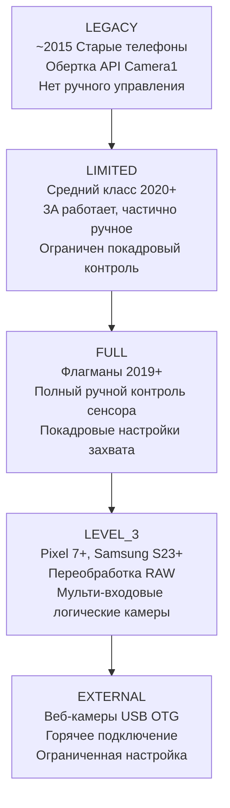
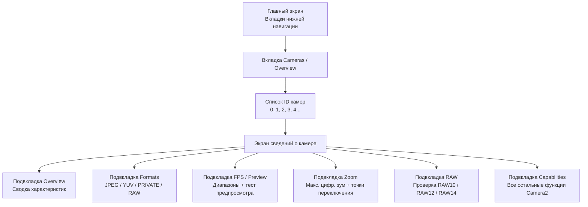

# Глава 4: Изучите свою камеру

В этой главе ваше приложение становится важным инструментом. Главы 2 и 3 дали вам теоретическое понимание аппаратного обеспечения камер и современных функций вычислительной фотографии. Эта глава посвящена практике и специфике конкретных устройств. Вы установите вспомогательное приложение **Android Camera Parameters** на свой телефон, запустите его и систематически проверите, что именно ваше оборудование может и чего не может, записывая ответы по ходу дела.

Информация, которую вы обнаружите в этой главе, — это не просто академические знания. API Camera2 предоставляет возможности индивидуально для каждого устройства и каждой камеры. Функция, которая идеально работает на вашем личном Pixel 10, может молча не сработать (или превратиться в пустую операцию, или, что еще хуже, привести к вылету) на среднебюджетном смартфоне Samsung серии A 2023 года, потому что HAL этого устройства просто не реализует необходимую функцию. Прежде чем вы напишете хоть одну строку кода API Camera2 во второй части этой серии, вы должны знать, на что способно ваше собственное тестовое устройство.

К концу этой главы вы выпишете для своего конкретного телефона: полный список идентификаторов камер с указанием их направления и уровней оборудования; форматы вывода, поддерживаемые каждой камерой; максимальное разрешение JPEG; самый высокий диапазон FPS для замедленной съемки; максимальный цифровой зум и пороги переключения физических камер; а также поддерживает ли ваша основная камера вывод в формате RAW.

## Установка приложения Android Camera Parameters

Доступно два варианта установки. Выберите тот, который вам удобнее.

### Вариант А — Сборка из исходного кода

Если вы являетесь разработчиком Android и у вас уже установлена Android Studio, этот вариант дает вам возможность просматривать исходный код приложения (см. последний раздел этой главы) и даже изменять его для проверки дополнительных характеристик Camera2, которые вас интересуют.

1. Клонируйте репозиторий GitHub:
   `https://github.com/zoozooll/AndroidCameraParameters`
2. Откройте проект в Android Studio Iguana (2023.2.1) или новее. Синхронизация Gradle завершится автоматически; проект нацелен на Android SDK 34 (Android 14) с `minSdkVersion` 21 (Android 5.0 Lollipop), поэтому он будет работать практически на любом телефоне, который у вас может быть.
3. Включите отладку по USB на телефоне. Перейдите в **Настройки → О телефоне → Номер сборки** и нажмите на пункт «Номер сборки» 7 раз. Появится уведомление «Теперь вы разработчик». Вернитесь в главное меню настроек, войдите в **Параметры разработчика** и включите **Отладку по USB**.
4. Подключите телефон к компьютеру с помощью кабеля USB-C. На телефоне примите запрос «Разрешить отладку по USB с этого компьютера?» и установите флажок «Всегда разрешать с этого компьютера», чтобы диалоговое окно не появлялось в будущем.
5. Выберите конфигурацию запуска **app** из выпадающего списка в верхней части Android Studio (по умолчанию она обычно называется `app`). Убедитесь, что ваш подключенный телефон отображается как целевое устройство.
6. Нажмите зеленую кнопку **Run** (иконка треугольника) или нажмите **Shift + F10**. Android Studio скомпилирует приложение, установит APK на ваш телефон через ADB и запустит его автоматически.

### Вариант Б — Установка из Google Play

Если вы просто хотите запустить приложение без компиляции или протестировать его поведение на нескольких пользовательских устройствах без настройки ADB на каждом из них, используйте сборку из Play Store.

Откройте Google Play Store на своем телефоне Android и перейдите по ссылке:

`https://play.google.com/store/apps/details?id=com.minininja.cameraparams`

Нажмите **Установить**. Приложение бесплатно, не содержит рекламы, встроенных покупок и трекеров. Ему требуется только разрешение `CAMERA` (для запроса характеристик камеры и открытия поверхности предпросмотра) и дополнительное разрешение `RECORD_AUDIO` (в настоящее время не используется, зарезервировано для будущей функции тестирования записи видео). Разрешение `ACCESS_FINE_LOCATION` является необязательным и запрашивается только в том случае, если вы хотите пометить образцы снимков метаданными GPS на вкладке предпросмотра.

Запустите приложение после завершения установки. При первом запуске предоставьте разрешение на использование **Камеры**, когда появится системный запрос. Приложение не будет работать без этого разрешения, так как модель безопасности Android требует предоставления разрешения во время выполнения даже для *запроса* характеристик камеры — вы не сможете даже перечислить идентификаторы камер без предоставления разрешения `CAMERA`.

## Идентификаторы камер (Camera IDs)

Посмотрите на главный экран приложения. Первая вкладка (по умолчанию) внизу помечена как **Cameras** (иногда **Overview**, в зависимости от версии сборки). Заголовок в верхней части этой вкладки гласит **All Camera IDs**.

Каждой отдельной камере на устройстве Android — каждой задней камере, фронтальной камере, любому логическому устройству слияния нескольких камер и любой внешней веб-камере USB OTG — присваивается уникальный строковый идентификатор, называемый **Camera ID**. Идентификаторы камер почти всегда представляют собой простые десятичные целые числа: `"0"`, `"1"`, `"2"`, `"3"`, а иногда `"4"`, `"5"` на устройствах с большим количеством камер. На редких устройствах (некоторые внешние веб-камеры и поддельные камеры эмулятора) вы можете увидеть идентификаторы камер типа `"camera@0"` или `"0@external"`, но простые целые числа — это наиболее распространенный формат.

Каждая строка в списке All Camera IDs содержит три части информации, слева направо:

1. Сам номер идентификатора камеры, отображаемый в виде жирного значка.
2. Направление **LENS_FACING**: одно из значений `BACK` (задняя камера, направлена от экрана), `FRONT` (селфи-камера, направлена на пользователя) или `EXTERNAL` (USB-веб-камера / OTG-камера).
3. **Уровень оборудования** (Hardware Level) этой камеры: цветной значок, показывающий `LEGACY`, `LIMITED`, `FULL`, `LEVEL_3` или `EXTERNAL`. Это напрямую соответствует характеристике `INFO_SUPPORTED_HARDWARE_LEVEL` API Camera2, описанной в главе 1 этой серии.

В качестве конкретного примера, Galaxy S26 Ultra обычно сообщает о **5 идентификаторах камер**:

- **ID 0**: BACK (основная широкоугольная камера 24 мм), уровень оборудования = **FULL**
- **ID 1**: FRONT (селфи-камера), уровень оборудования = **LIMITED**
- **ID 2**: BACK (задняя сверхширокоугольная камера 0,5×), уровень оборудования = **FULL**
- **ID 3**: BACK (задняя 5-кратная перископическая телекамера), уровень оборудования = **FULL**
- **ID 4**: BACK (идентификатор логической мультикамеры, представляющий собой комбинацию ID 0 + 2 + 3, управляемую HAL для бесшовного зума), уровень оборудования = **FULL**

Телефон среднего класса (например, Samsung A54 5G) может сообщать только о 3 идентификаторах камер: основной задней, сверхширокоугольной задней и фронтальной. Бюджетный телефон 2016 года может сообщать только о 2: задней и передней.

**Задание для вашего устройства:** выпишите полный список идентификаторов камер, о которых сообщает ваш телефон. Для каждого ID запишите его направление LENS_FACING (Back / Front / External) и цвет/метку уровня оборудования. Подсчитайте общее количество камер. Если вы видите идентификатор камеры, назначение которого неочевидно (например, дополнительный задний ID, который не соответствует ни одному объективу на задней панели телефона), имейте это в виду — часто это датчики глубины ToF, макрокамеры или логическое устройство слияния нескольких камер.

## Уровни оборудования (Hardware Levels)

В главе 1 этой серии были представлены пять уровней оборудования Camera2, упорядоченных от наименее способных к наиболее способным: **LEGACY → LIMITED → FULL → LEVEL_3 → EXTERNAL**. В этом разделе мы освежим в памяти эту иерархию и попросим вас проверить уровень каждой камеры с помощью приложения.

Каждый уровень добавляет новые возможности и более строгие гарантии производительности:

- **LEGACY**: API Camera2 реализован как тонкая прослойка над устаревшим API `android.hardware.Camera` (Camera1). Почти ничего не работает надежно — нет ручной экспозиции, нет покадрового контроля, нет поддержки RAW. В 2026 году вы можете смело игнорировать устройства LEGACY; практически ни один активно используемый телефон больше не сообщает об этом уровне.
- **LIMITED**: самый распространенный уровень оборудования для телефонов среднего сегмента и для фронтальных камер телефонов всех уровней. Алгоритмы 3A (автоэкспозиция, автофокус, автобаланс белого) работают корректно, базовый вывод YUV и JPEG работает, но большинство ручных настроек сенсора недоступны (нет ручной выдержки ниже порога AE, нет ручного управления усилением, нет обновления настроек захвата в каждом кадре с задержкой менее 3–5 кадров).
- **FULL**: «золотой стандарт» для флагманов. Гарантируется работа каждой функции API Camera2: полное ручное управление временем экспозиции сенсора и аналоговым усилением для каждого кадра, гарантированное соблюдение частоты кадров, серийная съемка со скоростью 30+ кадров в секунду с различными настройками для каждого кадра, переобработка YUV, базовый вывод DNG RAW. Если основная задняя камера вашего телефона сообщает об уровне FULL, вы можете реализовать любую функцию из этой серии уроков.
- **LEVEL_3**: самый высокий уровень, представленный в семействах Pixel 7 и Samsung S23 в 2022/2023 годах. Добавляет гарантированные входные потоки переобработки RAW (вы можете подать ранее захваченный DNG обратно в ISP и повторно запустить конвейер с другим тональным отображением или матрицами цветокоррекции), потоки вывода YUV с разным разрешением и гарантированную поддержку слияния логических мультикамер.
- **EXTERNAL**: для USB-веб-камер OTG и донглов захвата HDMI, подключенных через USB-C. Поверхность API идентична, но заводские данные калибровки отсутствуют (нет карт затенения линз, хранящихся в OTP, нет матриц цветокоррекции для каждого модуля), поэтому качество внешних камер бывает разным.

**Как проверить в приложении:** нажмите на значок **Hardware Level** рядом с любым идентификатором камеры в списке. Появится диалоговое окно, показывающее полное описание `INFO_SUPPORTED_HARDWARE_LEVEL` для этой камеры, а также маркированный список того, какие ключевые функции гарантированы (или не гарантированы) на этом уровне.

**Задание для вашего устройства:** для вашей основной задней камеры (обычно ID 0) подтвердите, какой уровень оборудования она сообщает. Для вашей фронтальной камеры подтвердите ее уровень. Затем задайте себе вопрос и подумайте над ответом, прежде чем читать дальше: **Почему фронтальные камеры почти повсеместно сообщают о версии LIMITED вместо FULL?**

Ответ заключается в том, что фронтальные камеры обычно представляют собой более дешевые и простые сенсоры. Алгоритм 3A работает на них надежно (в конце концов, для селфи нужны автоэкспозиция и автобаланс белого для получения приемлемого результата), но ручное управление сенсором является менее приоритетным для селфи. Никто не платит лишние деньги за ручную выдержку 1/1000 с на своей 13-мегапиксельной селфи-камере. Поэтому производители HAL оптимизируют свою реализацию уровня LIMITED под сценарий использования селфи и никогда не внедряют дополнительное тестирование и валидацию, необходимые для прохождения тестов CTS (Compatibility Test Suite) уровня FULL.

## Доступные камеры: направления (Facing)

Android определяет три возможных значения характеристики камеры `LENS_FACING`. Приложение предоставляет панель переключения фильтров в верхней части вкладки «Камеры» для переключения между ними: **All · Back · Front · External**.

- **BACK**: камера на задней панели телефона, направленная от экрана. Любой задний сверхширокоугольный, широкоугольный, телеобъектив, перископ, макрообъектив или датчик ToF сообщает о `LENS_FACING_BACK`. Эту камеру ваше приложение будет использовать в 90% случаев.
- **FRONT**: селфи-камера, направленная на пользователя, когда экран повернут к нему. Обратите внимание, что изображение предпросмотра с фронтальной камеры обычно зеркально отражается по горизонтали стандартным приложением камеры, чтобы соответствовать тому, что пользователь видит в зеркале, но фактические данные пикселей, записываемые в файлы JPEG, не отражаются, если ваше приложение не сделает этого явно.
- **EXTERNAL**: USB-веб-камера OTG, USB-эндоскоп, USB-карта захвата HDMI или другое устройство видеоввода с горячим подключением, подключенное через USB-C. Одной из самых недооцененных функций API Camera2 является то, что внешние камеры доступны через *тот же самый путь в коде*, что и внутренние. Грамотно написанное приложение Camera2 будет автоматически обнаруживать и использовать USB-веб-камеру без какого-либо специфического кода USB, если порт USB-C телефона поддерживает режим USB Video Class (UVC) в режиме хоста.

**Задание для вашего устройства:** используйте переключатели фильтров для переключения между Back, Front и External. Подсчитайте, сколько камер попадает в каждую категорию. Есть ли в списке вашего телефона внешние камеры прямо сейчас? Скорее всего, нет — если только у вас не подключена USB-веб-камера. Если у вас случайно оказалась веб-камера USB или эндоскоп USB, подключите его к телефону сейчас через адаптер USB-C OTG и нажмите кнопку **Refresh** в верхнем правом меню приложения. Вы должны увидеть новый идентификатор камеры с LENS_FACING = EXTERNAL. Откройте вкладку Preview для этой внешней камеры — если всё работает, вы увидите живое изображение с веб-камеры, используя тот же самый путь кода API Camera2, который открывал внутреннюю заднюю камеру 30 секунд назад.

## Поддерживаемые форматы вывода

Каждое устройство камеры Camera2 рекламирует список поддерживаемых **форматов вывода** и для каждого формата — список поддерживаемых пар разрешение/размер. API Camera2 отклонит любой запрос на захват, который пытается нацелиться на комбинацию формат/размер, которую камера не рекламирует.

Приложение отображает эту информацию на экране сведений о камере. Чтобы перейти к нему, нажмите на любую строку идентификатора камеры во вкладке Cameras. Вы попадете на экран сведений с несколькими подвкладками: **Overview · Formats · FPS · Zoom · RAW · Capabilities**. Перейдите на вкладку **Formats**.

В Android SDK существуют десятки возможных констант `ImageFormat`, но на эти **5 форматов** приходится 99% использования приложений Camera2 в реальном мире. Приложение перечисляет их в верхней части вкладки Formats с описаниями на простом языке:

1. **JPEG**: обычные обработанные фотографии, которые вы отправляете по электронной почте, публикуете в социальных сетях или делитесь в мессенджерах. 8-битный цвет YCbCr 4:2:0, обработанный ISP (применены все 8 этапов из главы 2), сжатый с потерями по алгоритму DCT. Небольшой размер файла. Это формат вывода по умолчанию и наиболее распространенный для фото.
2. **YUV_420_888**: универсальный несжатый формат для обработки на устройстве. 8-битная плоскость Y (яркость) плюс 8-битные плоскости Cb и Cr (цветность) с субдискретизацией 2:1 по горизонтали. Используется для распознавания лиц, сканирования QR-кодов, штрих-кодов, вывода машинного обучения (TensorFlow Lite, PyTorch Mobile), кастомной обработки изображений перед повторным кодированием в JPEG и в качестве входных данных для видеокодера MediaCodec при записи видео.
3. **PRIVATE**: непрозрачный формат с нулевым копированием (zero-copy), используемый исключительно для высокоскоростного предпросмотра на дисплее. Фактическая компоновка пикселей зависит от производителя и скрыта от приложения (отсюда и название private). Поверхности PRIVATE (обычно `SurfaceView`, `TextureView` или `ImageReader` с флагами использования `PRIV`) пропускают все доступные процессору копии и передаются напрямую от выхода ISP к компоновщику дисплея. Это единственный формат, который гарантирует предпросмотр в полном разрешении со скоростью 60 или 120 кадров в секунду на современных флагманах.
4. **RAW_SENSOR**: необработанные данные мозаики Байера непосредственно с сенсора, до запуска каких-либо этапов ISP. Разрядность варьируется в зависимости от сенсора: RAW10 (10 бит на образец), RAW12 (12 бит) или RAW14 (14 бит). Записывается в файлы DNG (Digital Negative) для постобработки на настольных ПК в Adobe Lightroom, Capture One или Darktable. Только камеры с уровнем оборудования FULL или выше поддерживают вывод в RAW; камеры уровней LIMITED и LEGACY — никогда.
5. **JPEG_R**: формат Ultra HDR, представленный в Android 14. Стандартное 8-битное основное изображение JPEG (совместимое со всеми программами просмотра) плюс встроенная 10-битная карта усиления (gain map), которую программы просмотра с поддержкой HDR (системная галерея Android 14, Chrome 120+, Adobe Lightroom 7+, Apple iOS 18 Photos) могут использовать для восстановления полного 10-битного диапазона яркости HDR на дисплее HDR10 или Dolby Vision. Только флагманские телефоны 2023+ поддерживают вывод в формате JPEG_R.

**Задание для вашего устройства:** выберите свою основную заднюю камеру (ID 0) в приложении, перейдите на вкладку **Formats**. Приложение отображает каждый формат вывода, поддерживаемый этой камерой, а под каждым форматом — список всех поддерживаемых разрешений, отсортированных от большего (сверху) к меньшему (снизу). Запишите:

- Какие из 5 перечисленных выше форматов (JPEG, YUV_420_888, PRIVATE, RAW_SENSOR, JPEG_R) присутствуют для вашей основной камеры?
- Какое **максимальное разрешение JPEG**? Оно почти всегда будет близко (но не обязательно точно равно) размерам пикселей активной матрицы сенсора. Сенсор 48 Мп может иметь в списке размеров JPEG 8000×6000 (48 Мп полный), 4000×3000 (12 Мп с бинированием), 1920×1080 (2 Мп) и 1280×720 (1 Мп).
- Присутствует ли RAW_SENSOR? Если да, отметьте, что ваш телефон поддерживает захват в DNG RAW; мы будем использовать эту возможность в главе 18.
- Присутствует ли JPEG_R (Ultra HDR)? Это скажет вам, способен ли ISP вашего устройства выводить фотографии HDR с картой усиления.

Повторите упражнение для фронтальной камеры и (если есть) для сверхширокоугольной и телекамеры.

## Диапазоны частоты кадров (FPS)

Перейдите на вкладку **FPS / Preview** на экране сведений о камере. API Camera2 не сообщает «максимальный FPS» камеры в виде одного числа. Вместо этого каждая камера сообщает список **диапазонов FPS**, каждый из которых записывается как `[minimum_fps, maximum_fps]`. HAL камеры гарантирует, что если ваше приложение настроит сеанс с этим диапазоном FPS, алгоритм автоэкспозиции сенсора выберет время выдержки, которое удержит фактическую частоту кадров между этими двумя границами.

Типичные записи, которые вы увидите на современном телефоне:

- `[15, 30]`: обычный адаптивный предпросмотр. Алгоритм AE может снизить частоту кадров до 15 кадров в секунду в очень темных сценах, когда время выдержки становится большим. Это значение по умолчанию почти для всех сценариев предпросмотра фотографий.
- `[30, 30]`: фиксированные 30 кадров в секунду. AE никогда не превысит время выдержки более 1/30 секунды; если сцена слишком темная, вместо этого повышается аналоговое усиление. Используется для стандартной записи видео 30 кадров в секунду.
- `[60, 60]`: фиксированные 60 кадров в секунду. Плавный предпросмотр для игровых сценариев использования камеры или записи видео 60 кадров в секунду. Требует, чтобы сенсор имел достаточно быстрое считывание для поддержания 60 полных кадров в секунду.
- `[120, 120]`: фиксированные 120 кадров в секунду для записи видео с 4-кратным замедлением. Обычно доступно только при уменьшенном разрешении (1080p или ниже).
- `[240, 240]`: фиксированные 240 кадров в секунду для видео с 8-кратным замедлением. Почти всегда доступно только в разрешении 720p.
- `[960, 960]`: фиксированные 960 кадров в секунду для 32-кратного ультразамедленного движения. Встречается крайне редко; только несколько флагманов Sony Xperia и топовые Samsung Galaxy поддерживают это, и только для очень короткой (0,2–0,3 секунды) предварительно записанной серии в 720p.

Приложение отображает каждый поддерживаемый диапазон FPS в прокручиваемом списке. Под списком находится карточка теста предпросмотра: нажмите **Start 60fps Preview Test**, и приложение откроет поток предпросмотра с фиксированной частотой 60 кадров в секунду и отобразит счетчик FPS в углу, чтобы вы могли убедиться, что 60 кадров в секунду действительно достижимы на вашем устройстве.

**Задание для вашего устройства:** для вашей основной задней камеры выпишите полный список поддерживаемых диапазонов FPS. Ответьте на эти вопросы:

- Присутствует ли `[60, 60]`? Ваш телефон поддерживает плавный предпросмотр со скоростью 60 кадров в секунду.
- Присутствует ли `[120, 120]`? Ваш телефон поддерживает 4-кратное замедление.
- Присутствует ли `[240, 240]`? Ваш телефон поддерживает 8-кратное замедление.
- Присутствует ли `[960, 960]`? Если да, то ваш телефон — топовый флагман, наслаждайтесь ультра-замедленной съемкой!

Теперь сравните этот список для вашей фронтальной камеры. Список FPS фронтальной камеры почти всегда короче: там редко бывают записи 240 или 960 кадров в секунду, а иногда отсутствуют и 60 кадров в секунду.

## Диапазоны зума и точки переключения камер

Перейдите на вкладку **Zoom** на экране сведений о камере. Эта вкладка показывает возможности масштабирования камеры.

Первое число, которое вы увидите, помечено как **SCALER_AVAILABLE_MAX_DIGITAL_ZOOM**. Это значение с плавающей точкой, например `10.0`, `20.0` или `100.0`, представляющее максимальный коэффициент *цифрового* зума, который HAL поддерживает для этой камеры. Значение 10.0 означает, что вы можете обрезать центральную 1/10 часть пикселей сенсора (линейно — 1/10 ширины и 1/10 высоты = 1% от общего количества пикселей) и всё равно получить валидный выходной поток. Обратите внимание, что цифровой зум более ~2× дает заметно мягкое, пикселизированное изображение; маркетинговый «100-кратный Space Zoom» на флагманах Samsung — это 10-кратный оптический зум (перископ) × 10-кратный цифровой зум, и на 100-кратном увеличении изображение представляет собой по сути всего 1% пикселей сенсора, увеличенных с помощью ИИ-алгоритмов повышения резкости.

Для **логических мультикамерных устройств** (например, Galaxy S26 Ultra Camera ID 4, объединяющая широкоугольную, сверхширокоугольную и перископическую телекамеру) на вкладке Zoom также отображается диаграмма **оптических коэффициентов зума** и точек переключения камер, управляемых HAL. Вот пример для Galaxy S26 Ultra:

- **0.5×** : активная камера — сверхширокоугольная (ID 2). Ниже 0,7× вывод идет на 100% со сверхширокоугольного сенсора.
- **0.7× → 0.9×** : зона слияния (fusion zone). HAL захватывает изображение одновременно со сверхширокоугольной и широкоугольной камер, выравнивает их и выполняет плавный переход. Пользователь не видит скачка.
- **1.0× (по умолчанию)** : активная камера — широкоугольная / основная (ID 0). Эта камера используется для 80% повседневных фотографий.
- **1.1× → 2.9×** : цифровой кроп широкоугольного сенсора. Качество постепенно снижается по мере увеличения зума.
- **2.9× → 3.1×** : зона слияния. HAL выполняет плавный переход от цифрового кропа основной камеры к нативному 3-кратному перископическому телесенсору.
- **3.0×** : активная камера — 3-кратный телеобъектив (если есть) или начало кропа перископа.
- **5.0× → 9.9×** : цифровой кроп 5-кратного перископического сенсора (ID 3).
- **10.0×** : нативный вывод 10-кратного перископа (если перископ его поддерживает).
- **10.1× → 30.0×** : цифровой кроп 10-кратного перископа. На 30-кратном увеличении вы смотрите на 1/900 часть исходной площади сенсора — впечатляющий маркетинг, но фотографически бесполезно для большинства целей.

В приложении есть интерактивный тест для этого. Вернитесь на вкладку **Preview** экрана сведений о камере. Вы увидите живой предпросмотр камеры и ползунок коэффициента зума в нижней части экрана.

**Задание для вашего устройства:** медленно и плавно выполните жест «щипок» (pinch-zoom) на поверхности предпросмотра или плавно переместите ползунок зума из минимального (слева) в максимальное (справа) положение. Следите за цифрой коэффициента зума. При прохождении определенных порогов (0.5×, 1.0×, 3.0×, 5.0×, 10.0×) вы заметите, что изображение предпросмотра на мгновение «прыгает» по полю зрения, резкости, а иногда и по цветовому тону — эти прыжки означают, что HAL переключает активную физическую камеру, стоящую за логическим мультикамерным устройством. Запишите точки переключения зума, которые вы заметили. Эти конкретные пороги — те коэффициенты, при которых вы, как разработчик API Camera2, захотите переключать свои запросы на захват между отдельными идентификаторами физических камер, если вам нужно максимальное качество изображения вместо цифрового кропа, управляемого HAL.

## Поддержка RAW

Вернитесь на вкладку **Formats**. В правом верхнем углу панели вкладок находится переключатель фильтра: **All / Processed / RAW**. Нажмите **RAW**, чтобы отфильтровать список форматов только до RAW.

Если RAW_SENSOR поддерживается для этой камеры, приложение перечислит все доступные варианты RAW. Наиболее распространенные варианты разрядности RAW на Android в 2026 году:

- **RAW10**: 10 бит на образец. Наиболее распространен в телефонах среднего сегмента и на сверхширокоугольных / телекамерах флагманов. 1024 различных уровня на канал Байера.
- **RAW12**: 12 бит на образец. Значение по умолчанию для основных широкоугольных камер на флагманах. 4096 уровней на канал. Отличный запас для редактирования.
- **RAW14**: 14 бит на образец. Очень редко; только в телефонах профессионального уровня, таких как Sony Xperia Pro-I или Xiaomi 13 Ultra с 1-дюймовым сенсором. 16 384 уровня на канал. Соответствует широте редактирования многих зеркалок с матрицей APS-C.
- **RAW_SENSOR**: универсальный токен, который соответствует разрядности RAW, принятой на устройстве по умолчанию. Вы всегда можете запросить формат `RAW_SENSOR`, и HAL подставит соответствующий вариант разрядности.

Файлы DNG, выводимые из потоков `RAW_SENSOR`, также содержат данные заводской калибровки для каждого модуля: паттерн массива цветовых фильтров, матрицу цветов, сопоставляющую нативный RGB сенсора с пространством XYZ осветителя D65, нейтральную точку цвета, уровень черного для каждого канала и уровень белого для каждого канала. Все эти метаданные необходимы настольным редакторам RAW для интерпретации данных мозаики Байера.

**Задание для вашего устройства:** присутствует ли RAW_SENSOR для вашей основной задней камеры? Если да, то какие варианты разрядности перечислены? Запишите ответ. В главе 18 этой серии вы узнаете, как открыть выходной поток RAW, захватить файл DNG и записать его с правильными данными EXIF и метаданными в хранилище вашего приложения. Если RAW не поддерживается (что часто бывает у фронтальных камер и у устройств среднего уровня LIMITED), то захват RAW в вашем собственном приложении Camera2 будет просто невозможен на этой камере, и вам следует спроектировать свое приложение так, чтобы оно корректно скрывало опцию «Съемка в RAW», когда такая возможность отсутствует.

## Исходный код

Приложение **Android Camera Parameters** имеет на 100% открытый исходный код. Репозиторий GitHub находится по адресу:

`https://github.com/zoozooll/AndroidCameraParameters`

Если вы выбрали вариант А и собрали приложение из исходного кода, то он у вас уже есть. Если вы установили приложение из Google Play, вы можете в любое время клонировать репозиторий, чтобы увидеть, как приложение запрашивает каждое из значений, которые вы только что проверили. Изучив исходный код, вы найдете:

- Как приложение использует `CameraManager.getCameraIdList()` для перечисления всех идентификаторов камер.
- Как оно считывает `CameraCharacteristics.LENS_FACING` и `INFO_SUPPORTED_HARDWARE_LEVEL` для заполнения значков на главной вкладке Cameras.
- Как оно запрашивает `SCALER_STREAM_CONFIGURATION_MAP` для перечисления каждого поддерживаемого формата и разрешения, и как оно фильтрует полученный список для вкладок Formats и RAW.
- Как оно считывает `CONTROL_AE_AVAILABLE_TARGET_FPS_RANGES` для построения списка диапазонов FPS.
- Как оно запрашивает `SCALER_AVAILABLE_MAX_DIGITAL_ZOOM` и `SCALER_AVAILABLE_ZOOM_RATIOS` для построения диаграммы точек переключения зума и интерактивного ползунка зума предпросмотра.

Каждое значение, отображаемое приложением, считывается из той же карты `CameraCharacteristics`, которую ваше собственное приложение на API Camera2 будет запрашивать начиная с главы 5. Вспомогательное приложение, по сути, является визуальной эталонной реализацией первых нескольких глав второй части этой серии уроков.

## Резюме

В этой практической главе вы установили вспомогательное приложение Android Camera Parameters на свой телефон Android (либо путем компиляции из исходного кода GitHub `https://github.com/zoozooll/AndroidCameraParameters`, либо путем установки из Google Play по адресу `https://play.google.com/store/apps/details?id=com.minininja.cameraparams`). Вы перечислили каждый идентификатор камеры на своем устройстве и записали значение LENS_FACING (Back / Front / External) и его уровень оборудования (LEGACY → LIMITED → FULL → LEVEL_3 → EXTERNAL), а также узнали, почему фронтальные камеры почти всегда сообщают о LIMITED вместо FULL. Вы использовали фильтр направления, чтобы увидеть распределение задних, фронтальных и внешних камер, и (если у вас была под рукой USB-веб-камера) убедились, что API Camera2 перечисляет камеры USB OTG через тот же самый путь кода, что и внутренние камеры. Вы проверили поддерживаемые каждой камерой форматы вывода (JPEG, YUV_420_888, PRIVATE, RAW_SENSOR, JPEG_R Ultra HDR) и записали максимальное разрешение JPEG, а также поддержку RAW и Ultra HDR. Вы перечислили диапазоны FPS для каждой камеры и узнали, какие скорости замедленной съемки может фиксировать ваш телефон. Вы изучили ползунок зума и определили точки переключения, управляемые HAL, где активная физическая камера меняется во время масштабирования щипком. Наконец, вы подтвердили, поддерживает ли ваша основная камера вывод RAW_SENSOR и с какой разрядностью, и получили приглашение изучить открытый исходный код вспомогательного приложения, чтобы увидеть, как именно каждое из этих значений считывается из API Camera2.

## Что дальше

Первая часть этой серии завершена. У вас есть основы аппаратного обеспечения (глава 2), словарь функций вычислительной фотографии (глава 3) и карта возможностей вашего собственного телефона (глава 4). Вторая часть начинается в главе 5 с вашего первого кода для API Camera2: открытия `CameraManager`, программного перечисления `CameraCharacteristics`, открытия `CameraDevice`, создания `CaptureSession` и запуска вашего первого повторяющегося запроса предпросмотра в `TextureView` — живого предпросмотра камеры на экране, написанного с нуля на 100 строках кода Kotlin.
