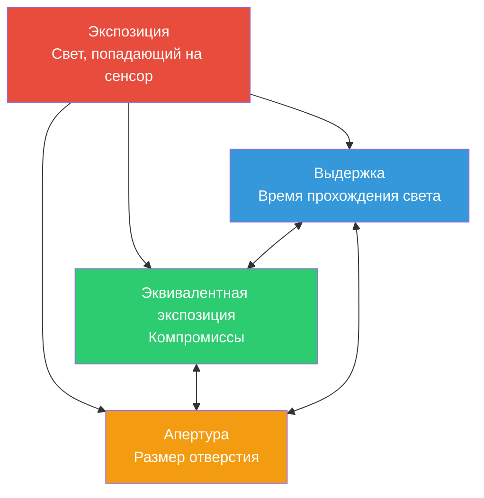

# Глава 13: Экспозиция

## Треугольник экспозиции: три ручки, одна цель

Когда вы делаете фотографию камерой смартфона, вы фиксируете свет. *Количество* света, достигающего сенсора, определяет, будет ли ваша фотография слишком темной (недоэкспонированной), слишком яркой (переэкспонированной) или в самый раз (правильно экспонированной). Этим управляют три основных параметра, которые вместе образуют **треугольник экспозиции**.



**Основная идея:** каждый угол треугольника управляет светом, но каждый также вносит свой *творческий компромисс*. Вы можете достичь *одинаковой* общей экспозиции с помощью различных комбинаций этих трех настроек, но каждая комбинация придает фотографии разный *вид*.

Прежде чем мы перейдем к специфике Android API Camera2 в следующей главе, давайте заложим прочный фундамент понимания каждого элемента.

---

## ISO: Чувствительность сенсора (управление усилением)

Во времена пленки **ISO** описывало *чувствительность фотоматериала к свету*: пленка ISO 100 была «медленной» и требовала яркого света, в то время как ISO 800 была «быстрой» и позволяла снимать в помещении.

**В цифровой фотографии (включая камеры смартфонов) ISO — это усиление сенсора / электронное усиление.** Когда вы удваиваете значение ISO, вы фактически удваиваете усиление, применяемое к аналоговому сигналу сенсора перед его оцифровкой.

### Как работает ISO

Представьте себе ячейки пикселей сенсора, собирающие фотоны (частицы света). После окончания периода экспозиции:

1. Каждый пиксель преобразует накопленные фотоны в крошечный электрический заряд.
2. **Аналоговый усилитель** умножает этот сигнал на коэффициент, соответствующий вашей настройке ISO.
3. Усиленный сигнал преобразуется из аналогового в цифровой (АЦП).
4. Затем применяется дальнейшая цифровая обработка (шумоподавление, тональная компрессия).

**ISO 100 = базовое / самое низкое усиление.** Сигнал усиливается меньше всего, поэтому:
- Фотографии получаются *чистыми* с минимальным цифровым шумом (зерном).
- Динамический диапазон (разница между самыми яркими и самыми темными записываемыми тонами) максимален.
- Цвета передаются наиболее точно.

**ISO 3200 = высокое усиление.** Сигнал усиливается в 32 раза:
- Вы можете снимать в более темных сценах, не увеличивая время выдержки.
- Но вы получаете *заметный шум* (цветные пятна, яркостное зерно).
- Динамический диапазон и точность цветопередачи значительно снижаются.

### Типичный диапазон ISO для смартфонов

| Диапазон ISO | Характеристика | Случай использования |
|-----------|---------------|----------|
| 50–200 | Базовое ISO, самое чистое изображение | Яркий дневной свет, студийное освещение |
| 200–800 | Умеренное усиление, небольшой шум | Пасмурный день, затененные участки |
| 800–3200 | Заметный шум, всё еще пригодно | Освещение в помещении, сумерки |
| 3200–12800+ | Сильный шум / сильное шумоподавление | Ночные сцены, съемка в темноте |

> **Заметка о реальности смартфонов:** флагманские телефоны часто применяют агрессивное вычислительное шумоподавление при высоких значениях ISO (фирменная обработка «ночного режима»). Когда вы позже отключите автоматический конвейер в Camera2, вы *потеряете* многие из этих оптимизаций производителя — это важное предостережение, к которому мы вернемся в главе 14.

---

## Выдержка (время экспозиции)

**Выдержка** — это просто *время, в течение которого сенсор подвергается воздействию света*. В традиционных камерах механический затвор физически открывается и закрывается. В смартфонах это почти всегда **электронный затвор** — сенсор сбрасывается, накапливает фотоны в течение точного времени, а затем считывается.

Выдержка измеряется в **секундах**, обычно выражается в виде дробей:

| Выдержка | Что она делает | Типичное использование |
|--------------|-------------|-------------|
| 1/2000 с – 1/1000 с | Очень короткая экспозиция, «замораживает» движение | Спорт, птицы, быстродвижущиеся объекты |
| 1/500 с – 1/250 с | Замораживает обычное движение человека | Идущие люди, играющие дети |
| 1/125 с – 1/60 с | «Безопасная» выдержка для съемки с рук | Обычная съемка при стабильных руках |
| 1/30 с – 1/15 с | Заметно небольшое размытие, нужен штатив | Творческое размытие, слабый свет |
| 1 с – 30 с | Длинная выдержка, сильное размытие движения | Водопады, звездные треки, гладкая вода |
| 30 с+ | Ультрадлинная выдержка (специальная) | Астрофотография, рисование светом |

### Эффект размытия движения

Существуют **две** причины сознательно выбирать определенную выдержку помимо «количества света»:

1. **Заморозка действия:** птица в полете на 1/1000 с выглядит четко, потому что птица почти не сдвинулась за время экспозиции.

2. **Создание размытия движения:** водопад на 2 секундах превращает движущуюся воду в гладкие шелковистые белые шлейфы — потому что каждая капля воды прошла через множество пикселей сенсора, пока он был открыт.

Думайте об этом как о рисовании с длинной выдержкой: *всё, что движется, пока открыт затвор, превращается в полосу.*

**Важно для видео:** при съемке видео со скоростью 30 кадров в секунду каждый кадр экспонируется максимум в течение ~1/30 с. Кинематографисты следуют **правилу 180-градусного затвора**: устанавливают выдержку, вдвое превышающую частоту кадров → 1/60 с для видео 30 кадров в секунду. Это дает естественное, «киношное» размытие движения — не слишком прерывистое и не слишком смазанное.

---

## Апертура (Диафрагма)

**Апертура** — это размер отверстия в объективе, через которое проходит свет. Она измеряется в **f-ступенях** (f/1.4, f/2.0, f/2.8, f/4.0, f/5.6, f/8.0 и т. д.) — это *контринтуитивная шкала, где меньшее число = большее отверстие*.

```
  f/1.4     f/2.0     f/2.8     f/4.0     f/5.6     f/8.0
█████████████████████████████████████████████████████████
█████████████████                              █████████
███████████████                                  ███████
█████████████                                    ██████
████████████                                      █████
███████████                                      ██████
```

**Уменьшение света вдвое на каждой ступени:** переход от f/1.4 → f/2.0 → f/2.8 → f/4.0 каждый раз *уменьшает вдвое* площадь отверстия, поэтому проходит вдвое меньше света. Это один «стоп» (ступень) затемнения на каждом шаге.

### Компромиссы апертуры (творческие и практические)

1. **Глубина резкости (DoF):** широкая апертура (f/1.8) = *малая* глубина резкости — только узкая плоскость находится в фокусе, всё, что перед ней или за ней, размывается (боке). Узкая апертура (f/8) = *большая* глубина резкости — всё от переднего до заднего плана получается резким.

2. **Сбор света:** f/1.4 собирает в 4 раза больше света, чем f/2.8. Вот почему «светосильные объективы» (с большой максимальной апертурой) ценятся для съемки при слабом освещении.

3. **Дифракция:** при очень узких апертурах (f/11+) световые волны огибают лепестки диафрагмы, немного смягчая изображение. Для смартфонов это обычно неактуально.

### Проверка реальности смартфонов

Большинство смартфонов имеют **объективы с фиксированной апертурой** — вы не можете изменить f-число. Бюджетные телефоны могут иметь f/2.4–f/2.8; флагманы часто достигают f/1.4–f/1.8. Приложение [Android Camera Parameters](https://play.google.com/store/apps/details?id=com.minininja.cameraparams) позволяет проверить фиксированную апертуру вашего объектива в `CameraCharacteristics`.

Некоторые премиальные телефоны (например, Samsung Galaxy S23 Ultra, серия Xperia) предлагают механизм *двойной апертуры*, который механически переключается между двумя значениями (например, f/1.5 и f/2.4). В Camera2 запросите `LENS_INFO_AVAILABLE_APERTURES`, чтобы узнать, поддерживает ли ваше устройство несколько значений апертуры.

**Практический вывод:** в большинстве случаев разработки под Android Camera2 апертура является *фиксированной*, поэтому вы управляете экспозицией только через **ISO + выдержку**. Две ручки вместо трех — что на самом деле упрощает задачу!

---

## EV: значение экспозиции (логарифмическая шкала)

Когда фотографы говорят «изменить на одну ступень (стоп)», они имеют в виду **удвоение или уменьшение вдвое общего количества света**. Чтобы сделать мышление на основе ступеней точным, в индустрии стандартизировали **значение экспозиции (Exposure Value, EV)**.

**EV 0** определяется как комбинация экспозиции, дающая стандартную эталонную яркость: **1 секунда выдержки, апертура f/1.0, ISO 100**.

Каждый **+1 EV удваивает свет** (ярче). Каждый **−1 EV уменьшает свет вдвое** (темнее):

| Изменение EV | Значение |
|-----------|---------|
| +3 EV | в 8 раз больше света (2³) |
| +2 EV | в 4 раза больше света |
| +1 EV | в 2 раза больше света |
| 0 EV | Эталон: 1 с @ f/1.0 ISO 100 |
| −1 EV | ½ света |
| −2 EV | ¼ света |
| −3 EV | ⅛ света |

Прекрасная вещь: **любая комбинация ISO + выдержка + апертура, которая дает в сумме одно и то же значение EV, дает одинаковую общую экспозицию**. Это принцип *эквивалентной экспозиции*, связывающий три угла треугольника.

### EV и комбинации ISO/выдержки

При фиксированной апертуре уравнение EV значительно упрощается. Для смартфона с f/1.8:

| Сцена | Типичный EV | Выдержка ISO 100 | Выдержка ISO 400 | Выдержка ISO 1600 |
|-------|-----------|----------------|-----------------|------------------|
| Яркий солнечный пляж | 15 | 1/4000 с | 1/1000 с | 1/250 с |
| Туманный / пасмурный день | 12 | 1/500 с | 1/125 с | 1/30 с |
| Яркий офис | 8 | 1/30 с | 1/8 с | 1/2 с |
| Гостиная ночью | 4 | 2 с | 0,5 с | 1/8 с |
| Звездная ночь | −2 | 30 с | 8 с | 2 с |

### Знаменитое правило Sunny 16

До появления матричного замера и сложных алгоритмов автоэкспозиции фотографы полагались на эмпирическое правило, позволяющее определить дневную экспозицию без экспонометра:

> **В солнечный день установите апертуру f/16, а выдержку — 1/ISO секунд.**

| Sunny 16 (f/16) | Эквивалент на f/1.8 (смартфон) |
|-----------------|----------------------------------|
| ISO 100, 1/100 с, f/16 → EV 15 | ISO 100, 1/4000 с, f/1.8 → EV 15 ✓ |
| ISO 200, 1/200 с, f/16 → EV 15 | ISO 200, 1/8000 с, f/1.8 → EV 15 ✓ |

Математика сходится: f/1.8 примерно на **6⅓ ступеней шире**, чем f/16. Каждая ступень удваивает площадь света. 2^(6,33) ≈ 80. Значит, выдержка должна быть в 80 раз короче для компенсации: 1/100 с ÷ 80 ≈ 1/8000 с (при ISO 200). Достаточно близко для полевых условий.

---

## Как выглядит недоэкспонированный / правильный / переэкспонированный снимок

Давайте мысленно сравним три снимка одной и той же сцены (например, человек на улице, а за ним небо):

**Недоэкспонированный (−2 EV):** объект слишком темный. Тени «провалены» в чистый черный цвет без деталей. На гистограмме все данные сгрудились в левой (темной) части. Небо может выглядеть хорошо, но человек кажется силуэтом. Вы *можете* попытаться «вытянуть» недоэкспонированные сырые данные при постобработке, но в тенях появится сильный шум, потому что вы усиливаете слабый сигнал.

**Правильная экспозиция (0 EV):** средние тона имеют правильную текстуру. На лице человека видны детали кожи, морщинки на рубашке, блики в глазах. Гистограмма распределена по всему диапазону без резкого обрезания по краям. На телефонах с ограниченным динамическим диапазоном это может означать, что *некоторые* яркие блики на небе «вылетают» в белый цвет (без деталей синевы) — это классический компромисс по сравнению с недоэкспонированным объектом.

**Переэкспонированный (+2 EV):** светлые участки «выбиты» в чистый белый цвет без возможности восстановления. Небо — это однородное белое поле; яркие пуговицы рубашки и зеркальные отражения обрезаны. Лицо человека может выглядеть льстиво (светлая кожа), но вы безвозвратно потеряли все детали в светах. В отличие от недоэкспонированных теней (которые часто можно частично восстановить ценой шума), *выбитые света исчезают навсегда* — в этих пикселях просто нет данных.

**Мантра фотографа:** *экспонируйте по светам, вытягивайте тени.* При съемке в RAW (о которой мы поговорим позже) это особенно эффективно, так как 14-битный RAW хранит достаточно деталей в тенях, чтобы подтянуть их на +2 EV или более без катастрофического шума.

---

## Справочная таблица EV для реальных ситуаций

Запоминание нескольких ключевых значений EV позволит вам оценивать экспозицию где угодно:

| Сцена | Типичный EV (при ISO 100) | Примерная выдержка @ f/1.8, ISO 400 |
|-------|------------------------|--------------------------------|
| Снежный пейзаж на прямом солнце | 16 | 1/4000 с |
| Солнечный пляж, яркий день | 15 | 1/2000 с |
| Обычный солнечный день | 14 | 1/1000 с |
| Пасмурный / облачный день | 12 | 1/250 с |
| Сильная облачность / дождь | 11 | 1/125 с |
| Тень (человек в тени, фон освещен солнцем) | 9 | 1/30 с |
| Закат / «золотой час» | 7 | 1/8 с |
| Яркий офис внутри помещения | 8 | 1/15 с |
| Гостиная дома, только лампы | 4 | 1/2 с |
| Темный интерьер ресторана | 2 | 2 с |
| Городская улица ночью (неоновые вывески) | 1 | 4 с |
| Ночной пейзаж, огни города вдали | −2 | 30 с |
| Лунный пейзаж (полная луна) | −3 | 1 минута |
| Звездное небо, без луны | −6 | 8 минут |

Вы можете проверить эти приближения, посмотрев, что на самом деле выбирает автоэкспозиция вашего телефона. Запустите приложение [Android Camera Parameters](https://github.com/zoozooll/AndroidCameraParameters), перейдите в Live Preview и понаблюдайте за значениями `SENSOR_EXPOSURE_TIME` и `SENSOR_SENSITIVITY`, когда переходите от яркого солнца в темную комнату — вы увидите реальные значения, которые примерно соответствуют этой таблице.

---

## Подведем итоги: эквивалентные экспозиции

Допустим, вам нужна *одна и та же общая экспозиция* (EV 12 = пасмурный день, смартфон f/1.8). Вот три допустимые комбинации, дающие идентичную яркость сенсора:

| Комбинация | ISO | Выдержка | Внешний вид |
|-------------|-----|---------------|-------------|
| Чисто и четко | 100 | 1/500 с | Самый низкий шум, максимально резкая заморозка движения |
| Золотая середина | 400 | 1/125 с | Небольшой шум, хороший баланс |
| Плавное движение | 1600 | 1/30 с | Заметный шум; небольшое размытие на движущихся объектах |

Все три попадают в одно и то же значение EV. Все три *выглядят одинаково ярко*. Но *текстура* (шумовое зерно) и *передача движения* совершенно разные. **В этом и заключается искусство экспозиции.**

### Что если вам нужно и то, и другое?

Здесь на сцену выходит вычислительная фотография. Телефон в «ночном режиме» не делает *один* 2-секундный снимок — он захватывает *десятки* кадров по 1/60 с (замораживая движение в каждом), а затем программно выравнивает и усредняет их. Результат приближается к светосиле длинной выдержки без штрафа в виде размытия движения.

Как только вы поймете ручную экспозицию на уровне Camera2, вы сможете реализовывать такие методы самостоятельно.

---

## Резюме

В этой главе мы рассмотрели *основы фотографии*, не касаясь кода Android:

- **Треугольник экспозиции:** выдержка (время), ISO (усиление сенсора) и апертура (размер отверстия) в сочетании управляют общим количеством света. У каждого есть творческий компромисс.
- **ISO** в цифровой фотографии = аналоговое усиление сенсора. Низкое ISO = чистое изображение, высокое ISO = шумное. Смартфоны обычно поддерживают ISO 100–6400+ с шумоподавлением производителя.
- **Выдержка** — это время экспозиции в секундах. Короткие выдержки (1/1000 с) замораживают действие; длинные выдержки (1 с+) создают размытие движения. Правило 180-градусного затвора применяется к видео.
- **Апертура** — это размер отверстия объектива, контролируемый f-ступенью. У большинства смартфонов апертура фиксированная, поэтому мы полагаемся только на ISO + выдержку.
- **EV (Exposure Value)** — это логарифмическая шкала ступеней, где каждый шаг ±1 удваивает/уполовинивает свет. EV 0 = 1 с @ f/1.0 ISO 100.
- **Правило Sunny 16** и справочная таблица EV позволяют ориентировочно оценивать экспозицию без приборов.
- **Правильная экспозиция** балансирует детали в средних тонах, избегая «проваленных» теней и «выбитых» светов. RAW сохраняет запас для восстановления.

## Что дальше

В **главе 14: Ручная экспозиция в Camera2** мы переведем всю эту концептуальную модель в конкретные вызовы API Camera2. Вы узнаете:

- Как отключить автоматический конвейер экспозиции (`CONTROL_MODE = OFF`, `CONTROL_AE_MODE = OFF`).
- Как перевести значения ISO в `SENSOR_SENSITIVITY`.
- Как конвертировать понятные человеку секунды в наносекунды для `SENSOR_EXPOSURE_TIME`.
- Готовые примеры кода на Kotlin для фиксированной экспозиции таймлапса, длинной ночной выдержки и серии брекетинга из 3 кадров.
- Важное предостережение об отключении шумоподавления производителя при выключении 3A.

Приготовьтесь — впереди много кода.
