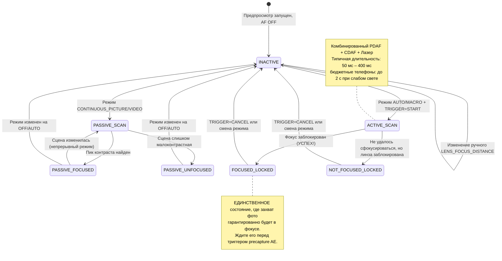

# Глава 15: Фокусировка

Экспозиция управляет яркостью. **Фокусировка управляет резкостью.** Идеально экспонированная фотография с плохим фокусом — это испорченная фотография. В этой главе вы узнаете, как работают системы фокусировки смартфонов, как надежно управлять автофокусом (AF) через Camera2 и как реализовать плавный слайдер ручной фокусировки с помощью `LENS_FOCUS_DISTANCE`.

Приложение [Android Camera Parameters](https://github.com/zoozooll/AndroidCameraParameters) демонстрирует всё это в своей панели Focus — вы можете наблюдать за переходами состояний AF в реальном времени и перемещать слайдер ручной фокусировки, чтобы увидеть, как линза перемещается от бесконечности до минимальной дистанции фокусировки.

---

## Автофокусировка (AF) в современных смартфонах

Прежде чем переходить к специфике API, давайте разберем три физических механизма фокусировки, используемых в смартфонах.

### 1. Контрастный автофокус (CDAF) — пассивное сканирование

Программный метод: анализ кадра изображения, поиск максимального контраста краев (резкие края = самая высокая пространственная частота) и перемещение линзы до нахождения пика контраста.

- **Преимущество:** работает на любом оборудовании камеры (не нужны специальные пиксели).
- **Недостаток:** медленно. Линза должна перемещаться («рыскать») вперед и назад по всему диапазону фокусировки. Метки состояния в Camera2 типа «AF SCANNING» соответствуют этому процессу.

### 2. Фазовый автофокус (PDAF) — активное сканирование

Специальные фотодиоды на сенсоре разделены на две половины. Разность фаз между левой и правой половинами напрямую измеряет, *как далеко и в каком направлении* должна сдвинуться линза — рыскание не требуется. Флагманские телефоны сегодня используют Dual-Pixel PDAF, где *каждый* пиксель выполняет фазовую детекцию.

- **Преимущество:** чрезвычайно быстро (блокировка фокуса < 100 мс при хорошем свете); надежно работает в видео.
- **Недостаток:** испытывает трудности при слабом освещении (недостаточно фотонов для надежного расчета фазы) и имеет ограничения по минимальной дистанции фокусировки.

### 3. Лазерный / ToF автофокус (активный) — дальномер

Специальный аппаратный модуль выпускает импульс инфракрасного лазера, измеряет время отражения и напрямую сообщает ISP расстояние до объекта. Очень распространен в телефонах среднего и премиального сегментов.

- **Преимущество:** молниеносная фокусировка на любой цели, даже в полной темноте (если цель отражает ИК-излучение).
- **Недостаток:** ограниченная эффективная дальность (~50 см – 5 м макс.), не работает на стекле или ИК-прозрачных объектах.

Реальные телефоны объединяют **все три метода**: PDAF для быстрой грубой фокусировки, CDAF для точной настройки и лазерный AF для условий низкой освещенности или макросъемки. Camera2 представляет этот объединенный конвейер в виде единого абстрактного конечного автомата.

---

## Режимы AF: CONTROL_AF_MODE

Camera2 определяет следующие режимы AF в `CameraMetadata`:

| Режим (CONTROL_AF_MODE_*) | Поведение | Случай использования |
|-------------------------|----------|----------|
| `OFF` | Автофокус отключен. Вы устанавливаете `LENS_FOCUS_DISTANCE` вручную. | Ручная фокусировка, фокус-стекинг, астрофотография (фокус на бесконечность) |
| `AUTO` | Однократный автофокус. Ничего не делает до отправки `CONTROL_AF_TRIGGER = START`, затем сканирует один раз и фиксирует фокус. | Классическая фотосъемка «навел и снял» |
| `MACRO` | То же самое, что и AUTO, но с приоритетом на обнаружение близко расположенных объектов. | Макросъемка, сканирование документов, режим «еда» |
| `CONTINUOUS_PICTURE` | Постоянно перефокусируется, но **приостанавливает перефокусировку при запуске захвата фото**, чтобы избежать смещения фокуса во время снимка. | Стандартный режим для фотосъемки |
| `CONTINUOUS_VIDEO` | Постоянно перефокусируется — никогда не делает пауз. Может быть заметно «рыскание», но видео остается в фокусе. | Запись видео, видеочаты |
| `EDOF` | Расширенная глубина резкости (Extended Depth of Field): программная/прошивочная симуляция глубокого фокуса. Физического движения линз нет. | Бюджетные устройства без приводов линз |

**Два важных замечания:**

1. Устройства с `EDOF` (дешевые телефоны, селфи-камеры) имеют *фиксированную* фокальную плоскость. Вы никогда не получите от них состояние `FOCUSED_LOCKED` — максимум, что вы получите, это `PASSIVE_SCAN` → `PASSIVE_FOCUSED` → `INACTIVE`. Приложение [Android Camera Parameters](https://play.google.com/store/apps/details?id=com.minininja.cameraparams) явно показывает «Fixed Focus» для таких камер.

2. Режимы `CONTINUOUS_*` возвращаются в состояние `INACTIVE` после простоя, а не остаются заблокированными. Не ожидайте `FOCUSED_LOCKED` в непрерывном режиме — это состояние только для `AUTO`/`MACRO` при явном триггере.

---

## Конечный автомат AF

Camera2 сообщает статус AF через `CaptureResult.CONTROL_AF_STATE`. Понимание этих состояний критически важно для создания надежных последовательностей захвата фото.



Таблица состояний для справки:

| CONTROL_AF_STATE | Значение | Следующее действие |
|------------------|---------|-------------|
| `INACTIVE` (0) | AF выключен, простаивает или непрерывный режим сейчас не сканирует | Если в режиме AUTO: отправить TRIGGER_START |
| `PASSIVE_SCAN` (1) | Непрерывный режим пассивно сканирует | Ждать; пока не запускать захват фото |
| `PASSIVE_FOCUSED` (2) | Непрерывный режим нашел фокус, но НЕ заблокировал его (может сместиться) | Безопасно запускать захват в CONTINUOUS_PICTURE (он заблокируется) |
| `ACTIVE_SCAN` (3) | Явный триггер запустил сканирование | Просто ждать... |
| `NOT_FOCUSED_LOCKED` (4) | Не удалось найти фокус, но линза заблокирована как есть | Предупреждение пользователя; опционально — повтор или захват всё равно |
| `FOCUSED_LOCKED` (5) | **УСПЕХ.** Фокус найден и аппаратно заблокирован. | Немедленно переходить к триггеру AE precapture |
| `PASSIVE_UNFOCUSED` (6) | Непрерывный режим не смог заблокироваться, всё еще сканирует | Улучшить освещение или сменить цель |

**Непреложное правило для фотосъемки:** *никогда* не отправляйте запрос на захват фото (особенно со вспышкой!), пока не увидите `FOCUSED_LOCKED`. Пропустите этот шаг, и вы получите приложение, которое периодически выдает нерезкие снимки.

---

## Дистанция фокусировки: диоптрии, а не метры

Вот вторая ловушка, в которую попадают разработчики Camera2 (после сюрприза с выдержкой в наносекундах):

**`LENS_FOCUS_DISTANCE` использует диоптрии (D), а не метры.** Диоптрии — это *математическая обратная величина* дистанции фокусировки:

```
Дистанция фокусировки (метры) = 1.0 / Диоптрии
Диоптрии = 1.0 / Дистанция фокусировки (метры)
```

| Диоптрии (LENS_FOCUS_DISTANCE) | Физическая дистанция фокусировки |
|--------------------------------|-------------------------|
| **0.0** | **Бесконечность** (∞) — звезды, далекие горы |
| 0.1 | 10 метров |
| 0.25 | 4 метра |
| 0.5 | 2 метра |
| 1.0 | 1 метр |
| 2.0 | 0,5 метра (50 см) |
| 5.0 | 0,2 метра (20 см) |
| 10.0 | 0,1 метра (10 см) |
| 20.0 | 0,05 метра (5 см) |

Почему диоптрии? Потому что привод линзы движется линейно относительно *оптической силы*, а не физического расстояния. Проход фокуса от 0.0D → 20.0D соответствует равномерному движению линзы, тогда как проход «в метрах» от 10 м → 5 см был бы крайне нелинейным.

### Запрос минимальной дистанции фокусировки

У каждого объектива есть ближайшая точка фокусировки (вы не можете физически сфокусироваться на объекте, прижатом к стеклу). Запросите ее:

```kotlin
// Максимально полезное значение диоптрий для этого объектива
val maxDiopters = characteristics.get(
    CameraCharacteristics.LENS_INFO_MINIMUM_FOCUS_DISTANCE
) ?: 0.0f // 0.0f = объектив с фиксированным фокусом EDOF (ручного управления нет!)

if (maxDiopters == 0.0f) {
    Log.w("Focus", "Это объектив с фиксированным фокусом. Ручной AF отключен.")
} else {
    // Допустимый диапазон диоптрий: [0.0f .. maxDiopters]
    Log.d("Focus", "Диапазон фокуса: 0.0D (беск.) → $maxDiopters D (близко: ${1/maxDiopters} м)")
}
```

Типичные значения:
- Задняя камера бюджетного телефона: ~10D (минимальный фокус 10 см)
- Широкоугольная камера флагмана: ~15–25D (минимальный фокус 4–7 см)
- Макрокамера: ~30–50D (минимальный фокус 2–3 см)
- Фронтальная селфи-камера: часто 0.0D (фиксированный фокус, EDOF)

### Гиперфокальное расстояние (Концепция)

Пейзажные фотографы любят этот прием: установите фокус на **гиперфокальное расстояние**, и всё от половины этого расстояния до бесконечности будет «приемлемо резким». На телефоне с апертурой f/1.8 и стандартным широкоугольным объективом гиперфокальное расстояние составляет примерно 0,5–1,0 метра.

**Эмпирическое правило для смартфонов:** установка `LENS_FOCUS_DISTANCE = 2.0D` (дистанция 50 см) приближенно соответствует гиперфокальному расстоянию на большинстве широкоугольных камер телефонов. Это удобно для пейзажной и стрит-фотографии, когда вы не хотите ждать срабатывания автофокуса.

```kotlin
// Приблизительный пресет "резко всё" (гиперфокальный)
const val HYPERFOCAL_DIOPTERS_APPROX = 2.0f

fun setHyperfocal(builder: CaptureRequest.Builder, characteristics: CameraCharacteristics) {
    val maxD = characteristics.get(
        CameraCharacteristics.LENS_INFO_MINIMUM_FOCUS_DISTANCE
    ) ?: 0.0f
    val diopters = min(HYPERFOCAL_DIOPTERS_APPROX, maxD.takeIf { it > 0 } ?: 0.0f)
    builder.set(CaptureRequest.CONTROL_AF_MODE, CameraMetadata.CONTROL_AF_MODE_OFF)
    builder.set(CaptureRequest.LENS_FOCUS_DISTANCE, diopters)
}
```

Хотите рассчитать точное гиперфокальное расстояние для вашего объектива? Вам также понадобятся `LENS_INFO_AVAILABLE_FOCAL_LENGTHS` (фокусное расстояние в мм) и физический размер пикселя сенсора. В 95% случаев для смартфонов значения 2.0D вполне достаточно.

---

## Полный пример 1: Однократный запуск AF и захват

Это классический поток фотосъемки для режима `AUTO` / `MACRO`. Эта же последовательность будет повторно использоваться при координации 3A в главе 17.

**Цель:** пользователь нажимает «Захват» → довести AF до блокировки фокуса → как только фокус заблокирован, отправить запрос на захват фото.

```kotlin
class AutoFocusCaptureHelper(
    private val characteristics: CameraCharacteristics,
    private val captureSession: CameraCaptureSession,
    private val previewSurface: Surface,
    private val jpegReaderSurface: Surface
) {
    private var afTriggered = false
    private var capturePlanned = false

    fun triggerAutoFocusAndCapture(onCaptureComplete: () -> Unit) {
        // ---- ШАГ 1: Создание повторяющегося запроса с явным триггером AF ----
        val triggerRequest = captureSession.device.createCaptureRequest(
            CameraDevice.TEMPLATE_PREVIEW
        ).apply {
            addTarget(previewSurface)

            // Используем режим AUTO для гарантии состояния LOCKED в конце
            set(CaptureRequest.CONTROL_AF_MODE,
                CameraMetadata.CONTROL_AF_MODE_AUTO)

            // Запускаем однократный триггер AF ПРЯМО СЕЙЧАС
            set(CaptureRequest.CONTROL_AF_TRIGGER,
                CameraMetadata.CONTROL_AF_TRIGGER_START)
        }

        afTriggered = true
        capturePlanned = true

        // ---- ШАГ 2: Подписка на наш обратный вызов для отслеживания состояния ----
        captureSession.setRepeatingRequest(
            triggerRequest.build(),
            object : CameraCaptureSession.CaptureCallback() {
                override fun onCaptureCompleted(
                    session: CameraCaptureSession,
                    request: CaptureRequest,
                    result: TotalCaptureResult
                ) {
                    val afState = result.get(CaptureResult.CONTROL_AF_STATE)
                        ?: return
                    Log.d("AF", "Состояние AF: $afState")

                    when (afState) {
                        // --- УСПЕШНЫЙ ПУТЬ ---
                        CaptureResult.CONTROL_AF_STATE_FOCUSED_LOCKED -> {
                            if (capturePlanned) {
                                capturePlanned = false
                                submitStillCapture()
                                onCaptureComplete()
                            }
                        }
                        // --- ПУТЬ НЕУДАЧИ: не удалось заблокировать, но попробуем всё равно ---
                        CaptureResult.CONTROL_AF_STATE_NOT_FOCUSED_LOCKED -> {
                            Log.w("AF", "AF не заблокировался — захват всё равно (может быть размыто)")
                            if (capturePlanned) {
                                capturePlanned = false
                                submitStillCapture()
                                onCaptureComplete()
                            }
                        }
                        // --- ВСЁ ЕЩЕ СКАНИРУЕТ: игнорируем ---
                        CaptureResult.CONTROL_AF_STATE_ACTIVE_SCAN,
                        CaptureResult.CONTROL_AF_STATE_PASSIVE_SCAN -> {
                            // Всё еще в работе, пока ничего не делаем
                        }
                    }
                }
            },
            null // Обработчик в текущем потоке
        )
    }

    private fun submitStillCapture() {
        val stillRequest = captureSession.device.createCaptureRequest(
            CameraDevice.TEMPLATE_STILL_CAPTURE
        ).apply {
            addTarget(previewSurface)
            addTarget(jpegReaderSurface)

            // Держим AF заблокированным для этого снимка — НЕ отменяйте триггер пока что!
            set(CaptureRequest.CONTROL_AF_MODE,
                CameraMetadata.CONTROL_AF_MODE_AUTO)
            // Оставляем AF_TRIGGER как есть (START остается до явной отмены CANCEL)

            set(CaptureRequest.JPEG_QUALITY, 95)
        }

        captureSession.capture(
            stillRequest.build(),
            object : CameraCaptureSession.CaptureCallback() {
                override fun onCaptureCompleted(
                    session: CameraCaptureSession,
                    request: CaptureRequest,
                    result: TotalCaptureResult
                ) {
                    // Фото захвачено — теперь снимаем блокировку AF, возвращаемся в непрерывный режим
                    resetFocusToContinuous()
                }
            },
            null
        )
    }

    private fun resetFocusToContinuous() {
        val resumePreview = captureSession.device.createCaptureRequest(
            CameraDevice.TEMPLATE_PREVIEW
        ).apply {
            addTarget(previewSurface)
            set(CaptureRequest.CONTROL_AF_MODE,
                CameraMetadata.CONTROL_AF_MODE_CONTINUOUS_PICTURE)
            set(CaptureRequest.CONTROL_AF_TRIGGER,
                CameraMetadata.CONTROL_AF_TRIGGER_CANCEL)
        }
        afTriggered = false
        captureSession.setRepeatingRequest(resumePreview.build(), null, null)
    }
}
```

**Важная деталь:** вы отменяете триггер *после* завершения захвата фото, а не до него. Отмените слишком рано — и линза разблокируется во время съемки, что приведет к нерезкому снимку.

**Защита по таймауту (не показана):** в реальных приложениях добавляется таймаут 2–3 секунды на сканирование AF. Если `ACTIVE_SCAN` длится 3 секунды и состояние `FOCUSED_LOCKED` так и не достигнуто, отмените процесс и покажите пользователю подсказку: «Нажмите на контрастную область для фокусировки».

---

## Полный пример 2: Слайдер ручной фокусировки SeekBar

Это функция ручной фокусировки, которую вы видели в приложениях с режимом Pro. SeekBar плавно сопоставляет физический диапазон фокуса от 0.0D до maxD.

### Макет (res/layout/fragment_manual_focus.xml)

```xml
<LinearLayout
    xmlns:android="http://schemas.android.com/apk/res/android"
    android:layout_width="match_parent"
    android:layout_height="wrap_content"
    android:orientation="vertical"
    android:padding="16dp">

    <TextView
        android:id="@+id/tvFocusLabel"
        android:layout_width="match_parent"
        android:layout_height="wrap_content"
        android:text="Фокус: ∞ (бесконечность)"
        android:textSize="14sp"/>

    <SeekBar
        android:id="@+id/seekFocus"
        android:layout_width="match_parent"
        android:layout_height="wrap_content"
        android:max="1000"/>
</LinearLayout>
```

### Код Kotlin: Связка во фрагменте / активности

```kotlin
class ManualFocusController(
    private val seekBar: SeekBar,
    private val labelView: TextView,
    private val characteristics: CameraCharacteristics,
    private val captureSessionProvider: () -> CameraCaptureSession?,
    private val previewSurface: Surface
) {
    // Слайдер использует 1000 целых шагов для точности меньше одной диоптрии
    private val sliderSteps = 1000
    private val maxDiopters = characteristics.get(
        CameraCharacteristics.LENS_INFO_MINIMUM_FOCUS_DISTANCE
    ) ?: 0.0f

    private var currentDiopters = 0.0f

    init {
        if (maxDiopters == 0.0f) {
            seekBar.isEnabled = false
            labelView.text = "Фиксированный фокус (ручной AF недоступен)"
        } else {
            bindSeekBar()
            applyFocus(0.0f) // Начинаем с бесконечности
        }
    }

    private fun bindSeekBar() {
        // Конвертация: int слайдера [0..1000] ↔ диоптрии [0.0 .. maxDiopters]
        seekBar.setOnSeekBarChangeListener(object : SeekBar.OnSeekBarChangeListener {
            private var lastUpdate = 0L

            override fun onProgressChanged(seekBar: SeekBar, progress: Int, fromUser: Boolean) {
                if (!fromUser) return

                // Ограничение частоты обновления до ~30fps (33 мс) — чтобы не перегружать HAL запросами
                val now = SystemClock.elapsedRealtime()
                if (now - lastUpdate < 33L) return
                lastUpdate = now

                val diopters = progress.toFloat() / sliderSteps.toFloat() * maxDiopters
                applyFocus(diopters)
            }
            override fun onStartTrackingTouch(seekBar: SeekBar) {
                // Переход в полностью ручной режим AF сразу, как только пользователь начал двигать слайдер
                switchToManualMode()
            }
            override fun onStopTrackingTouch(seekBar: SeekBar) {
                // Применение финального точного значения для устранения ошибки ограничения частоты
                val diopters = seekBar.progress.toFloat() / sliderSteps.toFloat() * maxDiopters
                applyFocus(diopters, force = true)
            }
        })
    }

    private fun switchToManualMode() {
        // CONTROL_AF_MODE_OFF отключает автопривод мотора AF
        val session = captureSessionProvider() ?: return
        val request = session.device.createCaptureRequest(
            CameraDevice.TEMPLATE_PREVIEW
        ).apply {
            addTarget(previewSurface)
            set(CaptureRequest.CONTROL_AF_MODE, CameraMetadata.CONTROL_AF_MODE_OFF)
            set(CaptureRequest.CONTROL_MODE, CameraMetadata.CONTROL_MODE_USE_SCENE_MODE)
        }
        session.setRepeatingRequest(request.build(), null, null)
    }

    fun applyFocus(diopters: Float, force: Boolean = false) {
        currentDiopters = diopters.coerceIn(0.0f, maxDiopters)

        // Обновление метки: показываем "∞" для < 0.1D, иначе "X.Y м"
        labelView.text = when {
            currentDiopters < 0.1f -> "Фокус: ∞ (бесконечность)"
            else -> {
                val meters = 1.0f / currentDiopters
                String.format("Фокус: %.1f D  (%.2f м)", currentDiopters, meters)
            }
        }

        // Создание и отправка повторяющегося запроса с новой дистанцией фокусировки
        val session = captureSessionProvider() ?: return
        val request = session.device.createCaptureRequest(
            CameraDevice.TEMPLATE_PREVIEW
        ).apply {
            addTarget(previewSurface)
            set(CaptureRequest.CONTROL_AF_MODE, CameraMetadata.CONTROL_AF_MODE_OFF)
            set(CaptureRequest.LENS_FOCUS_DISTANCE, currentDiopters)
        }

        // Используем setRepeatingRequest, чтобы каждый кадр предпросмотра учитывал новый фокус
        session.setRepeatingRequest(request.build(), null, null)
    }

    // --- Вспомогательные методы для пресетов ---
    fun setInfinity() { seekBar.progress = 0; applyFocus(0.0f, true) }
    fun setHyperfocalApprox() {
        val d = min(2.0f, maxDiopters)
        seekBar.progress = (d / maxDiopters * sliderSteps).toInt()
        switchToManualMode()
        applyFocus(d, true)
    }
    fun setNearest() { seekBar.progress = sliderSteps; applyFocus(maxDiopters, true) }
}
```

**Ключевые детали реализации:**

1. **Ограничение частоты (Throttle).** SeekBar вызывает `onProgressChanged` с частотой до 200 Гц. Отправка `setRepeatingRequest` на каждое событие перегружает HAL работой, вызывая задержки. Ограничение в 33 мс фиксирует обновления на уровне ~30fps — этого вполне достаточно для физической скорости мотора линзы.

2. **Раннее переключение в CONTROL_AF_MODE_OFF.** Если вы находитесь в режиме `CONTINUOUS_PICTURE` и устанавливаете `LENS_FOCUS_DISTANCE`, не отключив AF, алгоритм автофокуса будет *бороться с вами* — возвращая фокус туда, куда он считает нужным, кадром позже. Переключение должно произойти первым, в `onStartTrackingTouch`.

3. **Обновление через `setRepeatingRequest`**, а не через разовый запрос `capture()`. Ручной фокус должен сохраняться на *каждом* кадре предпросмотра, пока пользователь снова не сдвинет слайдер.

4. **Принудительное применение при отпускании.** Ограничение частоты пропускает промежуточные положения; когда пользователь убирает палец, примените точное конечное значение слайдера.

---

## Области фокусировки (Focus Regions / фокусировка по нажатию)

Современные приложения камер позволяют *нажать на видоискатель*, чтобы выбрать цель для фокусировки. Camera2 реализует это через `CONTROL_AF_REGIONS` — список прямоугольников (в координатном пространстве активной матрицы) с весами.

```kotlin
// Конвертация нажатия на видоискатель (x,y) в область координат сенсора из CameraCharacteristics
fun createTapFocusRegion(viewfinderWidth: Int, viewfinderHeight: Int,
                         tapX: Float, tapY: Float,
                         characteristics: CameraCharacteristics): MeteringRectangle {
    val activeArray = characteristics.get(
        CameraCharacteristics.SENSOR_INFO_ACTIVE_ARRAY_SIZE
    )!!
    // Нормализация координат нажатия [0..1] по каждой оси
    val nx = tapX / viewfinderWidth.toFloat()
    val ny = tapY / viewfinderHeight.toFloat()
    // Сопоставление с активной матрицей сенсора, создание области 200x200 с центром в месте нажатия
    val cx = (nx * activeArray.width()).toInt()
    val cy = (ny * activeArray.height()).toInt()
    val rSize = 200
    return MeteringRectangle(
        max(0, cx - rSize/2), max(0, cy - rSize/2),
        rSize, rSize,
        MeteringRectangle.METERING_WEIGHT_MAX
    )
}

// Прикрепление области к билдеру запроса
fun applyTapFocus(builder: CaptureRequest.Builder, region: MeteringRectangle) {
    builder.set(CaptureRequest.CONTROL_AF_REGIONS, arrayOf(region))
    builder.set(CaptureRequest.CONTROL_AE_REGIONS, arrayOf(region)) // Связываем и точку замера AE!
    builder.set(CaptureRequest.CONTROL_AF_TRIGGER,
        CameraMetadata.CONTROL_AF_TRIGGER_CANCEL) // Отмена предыдущей блокировки
    builder.set(CaptureRequest.CONTROL_AF_TRIGGER,
        CameraMetadata.CONTROL_AF_TRIGGER_START)  // Запуск сканирования новой области
}
```

**Совет профессионала:** всегда связывайте `CONTROL_AE_REGIONS` с `CONTROL_AF_REGIONS`. Пользователь нажал на лицо, потому что хочет, чтобы это лицо было *и* в фокусе, И правильно экспонировано — а не сфокусировано на лице, но замерено по яркому небу позади него.

---

## Устранение неполадок с фокусировкой

| Симптом | Основная причина | Исправление |
|---------|-----------|-----|
| Состояние AF никогда не выходит из ACTIVE_SCAN | Малоконтрастная сцена (белая стена, чистое синее небо) или сбой оборудования | Таймаут через ~3 с; подсказка пользователю; откат к гиперфокальному пресету |
| Слайдер ручной фокусировки ничего не делает | Забыли установить `CONTROL_AF_MODE = OFF` → AF борется с вами | Вызовите `switchToManualMode()` в onStartTrackingTouch |
| Фото получается размытым несмотря на FOCUSED_LOCKED | Триггер AF был отменен *до* завершения захвата фото | Отменяйте только в `onCaptureCompleted` запроса *на захват фото* |
| Передняя камера игнорирует команды фокусировки | Объектив с фиксированным фокусом EDOF (`MINIMUM_FOCUS_DISTANCE == 0`) | Корректная деградация: отключите интерфейс фокусировки для этой камеры |
| Автофокус в видео часто «рыскает» | Используется `CONTINUOUS_PICTURE` вместо `CONTINUOUS_VIDEO` для видеозаписи | Смените режим на CONTINUOUS_VIDEO при запуске MediaRecorder |

---

## Резюме

Фокусировка в Camera2 — это конечный автомат, которым нужно управлять явно, а не просто настройка «установил и забыл»:

- **Оборудование AF:** смартфоны сочетают контрастный AF, фазовый AF (Dual-Pixel) и лазерный AF для быстрой и надежной блокировки.
- **Режимы:** `AUTO` (однократный, блокируется), `CONTINUOUS_PICTURE` (перефокусируется, делает паузу для фото), `CONTINUOUS_VIDEO` (всегда перефокусируется), `MACRO`, `OFF` (ручной). Объективы EDOF не имеют подвижной фокусировки.
- **Состояния:** ждите `FOCUSED_LOCKED` (а не просто `PASSIVE_FOCUSED`) перед важными снимками.
- **Диоптрии:** `LENS_FOCUS_DISTANCE` использует обратное расстояние (0.0D = ∞, 10D = 0,1 м). Диапазон: `[0.0 .. LENS_INFO_MINIMUM_FOCUS_DISTANCE]`.
- **Захват с однократным AF:** `TRIGGER = START` → ждать `FOCUSED_LOCKED` → отправить запрос на фото → затем `CANCEL`.
- **Слайдер ручной фокусировки:** SeekBar на 1000 шагов с ограничением частоты 30fps; сначала переключите режим в `AF_MODE_OFF`, чтобы алгоритм автонастройки не мешал вашей ручной настройке.
- **Фокусировка по касанию использует `CONTROL_AF_REGIONS`** в координатах активной матрицы сенсора. Связывайте с `AE_REGIONS` для профессиональных результатов.

## Что дальше

Яркость ✓ Резкость ✓. Теперь исправим **цвет**. В **главе 16: Баланс белого и цвет** мы рассмотрим:

- Автоматический баланс белого (AWB) и 7 пресетов (лампы накаливания → тень).
- Ручную цветокоррекцию с помощью `COLOR_CORRECTION_GAINS` (4-канальный R/G/B/G) и `COLOR_CORRECTION_TRANSFORM` (матрица RGB 3×3).
- Концепцию цветовой температуры (2000K свеча → 10000K тень) и то, как она соотносится с балансом белого.
- Рабочий код для пресета «эффект заката» в теплых тонах и режима полного ручного управления AWB.

Цвет — это завершающая часть трилогии ручного управления.
