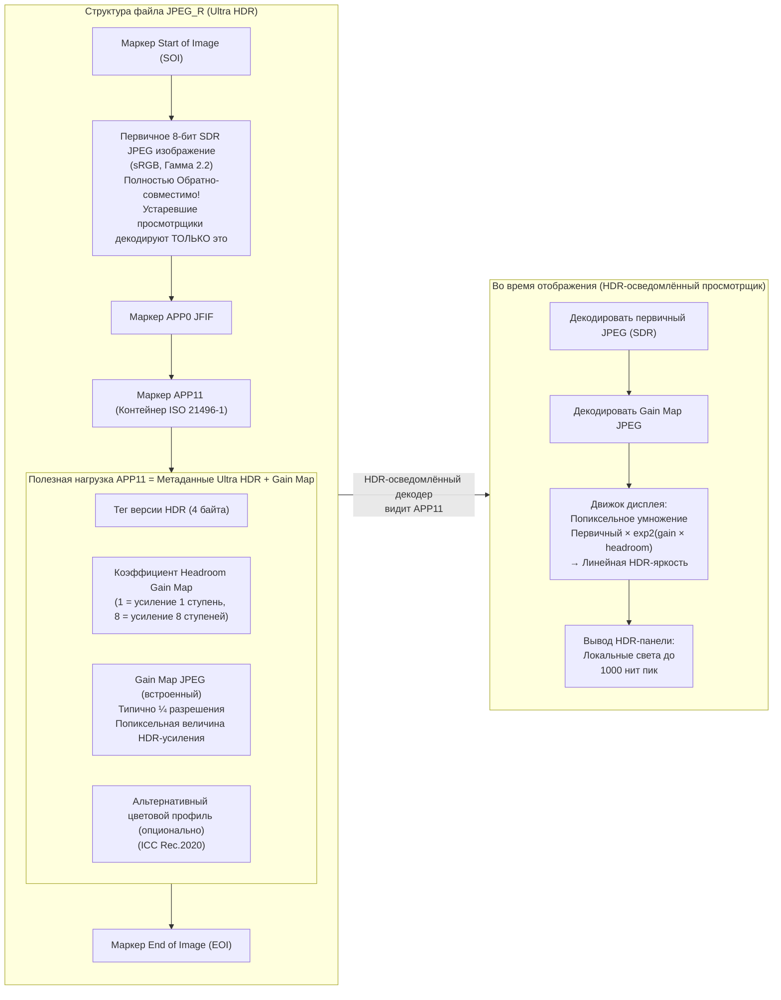

# Глава 21: HDR & Ultra HDR

Фотография Standard Dynamic Range (SDR) — 8-битный на канал sRGB, кодированный гамма-кривой 2.2 и мастеринг для 100-нитовых дисплеев — была разработана для ЭЛТ 1990-х годов. Современные сенсоры смартфонов захватывают **10–14 ступеней динамического диапазона** (контраст сцены от 1024:1 до 16384:1), но 8-битный SDR JPEG может отобразить лишь ~6 ступеней до того, как пересветит светлые участки или превратит тени в шум. Форматы **High Dynamic Range (HDR)** решают эту проблему, сохраняя яркость сцены в 10+ битах на канал, используя перцептивно-равномерные или сцен-ориентированные функции передачи и ориентируясь на пиковую яркость дисплея 1 000–10 000 нит вместо 100.

Эта глава охватывает три рабочих стандарта HDR в Android Camera2:
- **HDR10** (10 бит, ST.2084 PQ, Rec.2020, статические метаданные) для видео
- **HLG (Hybrid Log-Gamma)** (10 бит, обратно-совместимый с SDR, ARIB STD-B67) для вещания и видео
- **JPEG_R / Ultra HDR** (Android 14 API 34+, ISO 21496-1) — революционный формат статических фото, который встраивает вторичную «gain map» внутрь стандартного 8-битного SDR JPEG, так что устаревшие просмотрщики видят обычное фото, тогда как HDR-дисплеи локально повышают светлые участки до 8 ступеней

Все три задокументированы в разделах *Ultra HDR / JPEG_R* и *Dynamic Range* исследовательского документа проекта, в котором также указано требование Android CDD (Compatibility Definition Document) Performance Class 15 о том, что все флагманские устройства 2024+ должны предоставлять JPEG_R как выходной формат при максимальном размере статического снимка. Вы можете проверить поддержку HDR10, HLG и JPEG_R для каждого ID камеры в приложении [Android Camera Parameters](https://github.com/zoozooll/AndroidCameraParameters) в [Play Store](https://play.google.com/store/apps/details?id=com.zoozooll.cameraparameters), которое перечисляет каждый ключ `DynamicRangeProfiles` и сообщает, появляется ли `ImageFormat.JPEG_R` в `getOutputSizes()`.

## Основы динамического диапазона: Почему 8 бит недостаточно

Прежде чем переходить к конкретным форматам, определим, что «динамический диапазон» означает для дисплея и для захвата:

| Метрика | SDR (sRGB/BT.709) | HDR10 (BT.2100) | Человеческое зрение |
|--------|-------------------|------------------|--------------|
| **Глубина бита** | 8 бит / канал (256 уровней) | 10 бит / канал (1024 уровня) | ~4,8 бита перцептивно, но логарифмически |
| **Пиковая яркость** | 100 нит (кд/м²) | 1 000+ нит пик (зависит от контента) | ~20 000 нит (солнце+небо) до ~0,001 нит (тёмная комната) |
| **Функция передачи** | Гамма 2.2 или sRGB кусочная | ST.2084 Perceptual Quantizer (PQ) | Логарифмический отклик (закон Вебера-Фехнера) |
| **Цветовой охват** | sRGB / BT.709 (~35% видимого) | Rec.2020 (~75% видимого) | Полный видимый спектр |
| **Контрастность (рабочая)** | ~6 ступеней (64:1) | ~10 ступеней (1024:1) минимум | ~14 ступеней (16384:1) в одной сцене |

Гамма-кривая, используемая SDR, была разработана для соответствия нелинейности электронного луча ЭЛТ 1990-х годов, а не зрительной системе человека. Кривая PQ (Perceptual Quantizer), используемая HDR10, была стандартизирована в 2014 году Dolby и BBC под ST.2084 и математически подогнана под модель Бартена контрастной чувствительности человека — так что каждое из 1 024 кодовых значений в 10-битном PQ представляет едва заметную разницу (JND) в яркости во всём диапазоне 0–10 000 нит.

```mermaid
flowchart TD
    subgraph SDRpath["Конвейер SDR 8-бит Захват → Дисплей"]
        S1["Сенсор Линейный<br/>14-бит RAW"] --> S2["Гамма-кривая 2.2<br/>(Разрушает Детали Теней)"]
        S2 --> S3["8-битное Квантование<br/>(Только 22 кода для<br/>0–10% яркости)"]
        S3 --> S4["Отсечка Охвата sRGB<br/>(25% цветов потеряно)"]
        S4 --> S5["Пик 100 нит<br/>(Небо/Солнце<br/>Отсечка в Белый)"]
    end

    subgraph HDRpath["Конвейер HDR10 10-бит Захват → Дисплей"]
        H1["Сенсор Линейный<br/>14-бит RAW"] --> H2["Кривая ST.2084 PQ<br/>(Соответствует модели JND)"]
        H2 --> H3["10-битное Квантование<br/>(140 кодов для<br/>0–10% яркости)"]
        H3 --> H4["Охват Rec.2020<br/>(75% видимых цветов)"]
        H4 --> H5["Пик 1000+ нит<br/>(Детали Неба Сохранены)"]
    end

    style SDRpath fill:#ffeded,stroke:#b91c1c
    style HDRpath fill:#e8fff0,stroke:#15803d
```



Mermaid-диаграмма выше количественно определяет два наиболее важных отличия: SDR использует лишь ~22 8-битных кода для нижних 10% яркости (вызывая бандинг теней при поднятии), тогда как PQ выделяет 140 10-битных кодов на тот же диапазон. Перцептивная равномерность кривой PQ — причина, по которой 10-битный HDR выглядит более гладко, чем 8-битный SDR, даже при понижающей дискретизации до 100 нит на SDR-дисплее.

## HDR10 Видео: 10-бит PQ + Rec.2020 + Статические метаданные

HDR10 — базовый формат HDR-видео — каждый смартфон 2021+ с OLED-дисплеем поддерживает воспроизведение HDR10, а каждый SoC Snapdragon 865+ / Exynos 2100+ поддерживает запись HDR10 через Camera2. Формат определяет:

- Кодирование **HEVC Main10 Profile** (H.265) с 10-битными отсчётами
- Функцию передачи **ST.2084 PQ** вместо гаммы
- Цветовые primaries **Rec.2020 (BT.2100)** (широкий охват)
- **Статические метаданные** (SMPTE ST 2086 / CTA-861.3) в сообщении HEVC SEI:
  - `max_content_light_level` (MaxCLL): пиковая яркость любого одиночного пикселя, в нитах
  - `max_frame_average_light_level` (MaxFALL): средняя яркость самого яркого кадра
  - `display_primaries` и `white_point`: цветовой объём мастеринг-дисплея
  - `max_luminance` / `min_luminance`: пик и уровень чёрного мастеринг-дисплея

Статические метаданные означают, что ровно один набор значений применяется ко всей длительности видео. Вариант с динамическими метаданными (HDR10+, альтернатива Samsung для Dolby Vision) не открывается через стандартный Camera2 — он требует расширений производителя — но статические метаданные HDR10 универсально поддерживаются через `DynamicRangeProfiles`.

### Запрос поддержки HDR10 и HLG через DynamicRangeProfiles

Android 13 (API 33) представил `CameraCharacteristics.REQUEST_AVAILABLE_DYNAMIC_RANGE_PROFILES` как структурную альтернативу ручной проверке поддержки 10-битного формата в `StreamConfigurationMap`. Каждая выходная поверхность имеет профиль, выбранный при создании сессии:

```kotlin
import android.hardware.camera2.CameraCharacteristics
import android.hardware.camera2.params.DynamicRangeProfiles
import android.util.Size

data class HdrVideoProfile(
    val profile: Long, // DynamicRangeProfiles.HDR10, HLG10 и т.д.
    val supportedSizes: List<Size>,
    val standardSizesFallbacks: List<Size>
)

fun enumerateHdrProfiles(
    characteristics: CameraCharacteristics
): List<HdrVideoProfile> {
    val profiles: DynamicRangeProfiles? =
        characteristics.get(
            CameraCharacteristics.REQUEST_AVAILABLE_DYNAMIC_RANGE_PROFILES
        ) ?: return emptyList()

    val configMap = characteristics.get(
        CameraCharacteristics.SCALER_STREAM_CONFIGURATION_MAP
    ) ?: return emptyList()

    return listOf(
        DynamicRangeProfiles.HDR10,
        DynamicRangeProfiles.HLG,
        DynamicRangeProfiles.HDR10_PLUS, // Часто null на устройствах не-Samsung
        DynamicRangeProfiles.DOLBY_VISION_10B_HDR_OEM // Требует лицензии Dolby
    ).mapNotNull { profile ->
        if (!profiles.isProfileSupported(profile)) return@mapNotNull null

        val hdrSizes = profiles.getProfileSupportedSizes(profile)
            ?.toList() ?: emptyList()
        val sdrFallbackSizes = configMap.getOutputSizes(
            android.graphics.ImageFormat.PRIVATE
        )?.toList() ?: emptyList()

        HdrVideoProfile(profile, hdrSizes, sdrFallbackSizes)
    }
}
```

Метод `DynamicRangeProfiles.getProfileSupportedSizes(profile)` возвращает *пересечение* размеров с поддержкой 10 бит и поддержки HDR-конвейера ISP. Если `Size(3840, 2160)` (4K UHD) не появляется в `getProfileSupportedSizes(HDR10)`, то даже если 4K SDR поддерживается, у HAL недостаточно пропускной способности ISP для кодирования 4K HDR10 (обычно ограничение 600-Мпикс/сек на Snapdragon 8-й серии). Приложение Android Camera Parameters отображает эту таблицу пересечений во вкладке HDR, так что вы можете проверить перед написанием кода сессии.

### Настройка HDR10 на OutputConfiguration для записи

Профиль динамического диапазона должен быть задан **до создания сессии** через `OutputConfiguration.setDynamicRangeProfile()`. Изменение профиля в середине сессии требует её завершения и повторного создания.

```kotlin
import android.hardware.camera2.params.DynamicRangeProfiles
import android.hardware.camera2.params.OutputConfiguration
import android.media.MediaCodec
import android.media.MediaCodecInfo
import android.view.Surface

fun createHdr10VideoOutput(
    encoderSurface: Surface,
    previewSurface: Surface
): Pair<OutputConfiguration, OutputConfiguration> {
    val encodeOutConfig = OutputConfiguration(encoderSurface).apply {
        setDynamicRangeProfile(DynamicRangeProfiles.HDR10)
    }
    val previewOutConfig = OutputConfiguration(previewSurface).apply {
        setDynamicRangeProfile(DynamicRangeProfiles.HDR10)
    }
    return Pair(encodeOutConfig, previewOutConfig)
}

fun configureHdr10MediaCodec(width: Int, height: Int): MediaCodec {
    val codec = MediaCodec.createEncoderByType("video/hevc")
    val format = android.media.MediaFormat.createVideoFormat(
        "video/hevc", width, height
    ).apply {
        setInteger(MediaFormat.KEY_COLOR_FORMAT,
            MediaCodecInfo.CodecCapabilities.COLOR_FormatSurface)
        setInteger(MediaFormat.KEY_BIT_RATE, 80_000_000) // 80 Mbps для 4K HDR10
        setInteger(MediaFormat.KEY_FRAME_RATE, 30)
        setInteger(MediaFormat.KEY_I_FRAME_INTERVAL, 1)
        setInteger(MediaFormat.KEY_PROFILE,
            MediaCodecInfo.CodecProfileLevel.HEVCProfileMain10)
        setInteger(MediaFormat.KEY_COLOR_STANDARD,
            MediaFormat.COLOR_STANDARD_BT2020)
        setInteger(MediaFormat.KEY_COLOR_TRANSFER,
            MediaFormat.COLOR_TRANSFER_ST2084) // ST.2084 PQ
        setInteger(MediaFormat.KEY_COLOR_RANGE,
            MediaFormat.COLOR_RANGE_LIMITED)
        setFeatureEnabled(MediaCodecInfo.CodecCapabilities.FEATURE_HdrEditing, true)
    }
    codec.configure(format, null, null, MediaCodec.CONFIGURE_FLAG_ENCODE)
    return codec
}
```

Три ключа `COLOR_*` (`BT2020`, `ST2084`, `LIMITED`) в сочетании с `HEVCProfileMain10` создают побитово точный поток HDR10. Если опустить `KEY_COLOR_TRANSFER` или установить неверное значение (напр.: `COLOR_TRANSFER_GAMMA_2_2`), YouTube и другие плееры интерпретируют 10-битный поток как SDR и воспроизведут его выцветшим или пересыщенным.

## HLG (Hybrid Log-Gamma): Обратно-совместимый с SDR вещательный HDR

HLG (стандартизован как ARIB STD-B67 BBC и NHK в 2015 году) был разработан для живого телевидения, где нельзя заранее знать, есть ли у зрителя HDR- или SDR-дисплей. Инновация HLG — **кусочно-гибридная функция передачи**:
- Нижние 50% диапазона кодов — стандартная гамма-кривая (точно соответствует SDR)
- Верхние 50% — логарифмическая кривая (хранит детализацию HDR-светов)

Это означает, что HLG-видео, воспроизводимое на SDR-дисплее, выглядит идентично корректно настроенному SDR-видео с гаммой 2.2, тогда как HDR-дисплей «разблокирует» логарифмическую верхнюю половину и отображает света до 1 000 нит без какой-либо сигнализации метаданных. Явное тональное отображение SDR→HDR не требуется.

Для видеозаписи HLG отличается от HDR10 тремя способами, релевантными Camera2:
1. **Статические метаданные не требуются** —— HLG сцен-ориентирован, поэтому дисплей выводит пиковую яркость из самого сигнала. Это упрощает конфигурацию MediaCodec (нет вставки SEI для MaxCLL/MaxFALL).
2. **Другая константа цветовой передачи** —— используйте `MediaFormat.COLOR_TRANSFER_HLG` вместо `ST2084`.
3. Проверка **`DynamicRangeProfiles.HLG`** вместо `HDR10`.

Любое другое использование API (OutputConfiguration.setDynamicRangeProfile, создание сессии, CaptureRequest) идентично HDR10. В исследовательском документе отмечается, что HLG — предпочтительный формат для пользовательского видео, публикуемого в социальных платформах, потому что он корректно отображается как на SDR-, так и на HDR-дисплеях без артефактов тонального отображения.

## JPEG_R (Ultra HDR): ISO 21496-1 SDR + Встроенная Gain Map

Крупнейший прогресс в мобильной HDR-фотографии со времени многослойного HDR-захвата — это **JPEG_R**, представленный в Android 14 (API 34) и кодифицированный как международный стандарт **ISO 21496-1**. Формат обратно-совместим по построению:

> Файл JPEG_R — это стандартный 8-битный SDR JPEG со **вторичным, меньшим JPEG («gain map»)**, встроенным в сегмент маркера `APP11` с использованием формата контейнера ISO 21496-1. Устаревшие JPEG-декодеры игнорируют нераспознанные APP-маркеры и декодируют только 8-битный первичный кадр. HDR-осведомлённые декодеры считывают как первичный кадр, так и gain map и реконструируют исходную линейную HDR-яркость сцены, умножая значения пикселей первичного кадра на exp2(gain_map_pixel × headroom_factor) попиксельно.

Это «попиксельное усиление» и делает Ultra HDR *локально* HDR (в отличие от статических метаданных HDR10, которые применяют одно пиковое значение глобально). Gain map ISO 21496-1 при ¼ разрешения (типично) может кодировать до **8 ступеней локального headroom светов** — достаточно для восстановления деталей облаков на закате при сохранении средних тонов на естественной SDR-яркости.

Android CDD Performance Class 15 требует:
- Все устройства, заявляющие CDD PC-15 (флагманы 2024+ согласно таблице спецификации CDD), **ОБЯЗАНЫ** поддерживать вывод `ImageFormat.JPEG_R` при максимальном размере статического снимка.
- Максимальный размер статического снимка для JPEG_R должен быть ≥ максимального размера YUV для этого ID камеры.

В разделе *Ultra HDR / JPEG_R* исследовательского документа содержится полный побайтовый разбор структуры маркера APP11, но для Camera2 API нужно лишь рассматривать `ImageFormat.JPEG_R` как единый непрозрачный выходной буфер —— HAL собирает первичный кадр + gain map внутренне.



Ключевая деталь на Mermaid-диаграмме: первичный JPEG — полностью валидное 8-битное SDR фото, поэтому даже JPEG-библиотека из 2010-х может отрисовать корректно выглядящее изображение. HDR-данные *аддитивны*, а не заменяют первичный файл — именно поэтому файлы JPEG_R бесшовно работают со всеми существующими платформами обмена фотографиями (Instagram, Google Photos, Messages), у которых ещё нет декодеров Ultra HDR.

### Запрос поддержки JPEG_R и захват статических Ultra HDR снимков

Захват статических Ultra HDR снимков функционально идентичен захвату стандартного JPEG с двумя отличиями:
1. Запрашивайте `ImageFormat.JPEG_R` в `StreamConfigurationMap.getOutputSizes()` вместо `ImageFormat.JPEG`
2. Если вы используете `DynamicRangeProfiles` (рекомендуется), установите профиль выхода JPEG_R в `DynamicRangeProfiles.JPEG_R`

```kotlin
import android.graphics.ImageFormat
import android.hardware.camera2.CameraCharacteristics
import android.hardware.camera2.CameraDevice
import android.hardware.camera2.CaptureRequest
import android.hardware.camera2.params.DynamicRangeProfiles
import android.hardware.camera2.params.OutputConfiguration
import android.media.ImageReader
import android.util.Size

var jpegRImageReader: ImageReader? = null

fun queryJpegRSupport(
    characteristics: CameraCharacteristics
): Pair<Boolean, Size?> {
    val caps = characteristics.get(
        CameraCharacteristics.REQUEST_AVAILABLE_CAPABILITIES
    ) ?: intArrayOf()
    val supportsDynamicRange = caps.contains(
        CameraCharacteristics.REQUEST_AVAILABLE_CAPABILITIES_DYNAMIC_RANGE_TEN_BIT
    )
    val drProfiles = characteristics.get(
        CameraCharacteristics.REQUEST_AVAILABLE_DYNAMIC_RANGE_PROFILES
    )
    val supportsJpegRProfile =
        drProfiles?.isProfileSupported(DynamicRangeProfiles.JPEG_R) == true

    val configMap = characteristics.get(
        CameraCharacteristics.SCALER_STREAM_CONFIGURATION_MAP
    ) ?: return Pair(false, null)

    val jpegRSizes = configMap.getOutputSizes(ImageFormat.JPEG_R)
        ?: emptyArray()
    val maxJpegR = jpegRSizes.maxByOrNull { it.width * it.height }

    return Pair(
        supportsDynamicRange && supportsJpegRProfile && jpegRSizes.isNotEmpty(),
        maxJpegR
    )
}

fun setupJpegRCapture(
    cameraDevice: CameraDevice,
    maxJpegRSize: Size,
    previewSurface: Surface
) {
    jpegRImageReader = ImageReader.newInstance(
        maxJpegRSize.width, maxJpegRSize.height,
        ImageFormat.JPEG_R, 2
    )

    val jpegROutput = OutputConfiguration(
        jpegRImageReader!!.surface
    ).apply {
        setDynamicRangeProfile(DynamicRangeProfiles.JPEG_R)
    }
    val previewOutput = OutputConfiguration(previewSurface)

    val outputs = listOf(previewOutput, jpegROutput)
    val sessionConfig = android.hardware.camera2.params.SessionConfiguration(
        android.hardware.camera2.params.SessionConfiguration.SESSION_REGULAR,
        outputs,
        { r -> backgroundHandler.post(r) },
        object : android.hardware.camera2.CameraCaptureSession.StateCallback() {
            override fun onConfigured(
                session: android.hardware.camera2.CameraCaptureSession
            ) {
                val stillBuilder = cameraDevice.createCaptureRequest(
                    CameraDevice.TEMPLATE_STILL_CAPTURE
                ).apply {
                    addTarget(previewSurface)
                    addTarget(jpegRImageReader!!.surface)
                    set(CaptureRequest.CONTROL_MODE,
                        CaptureRequest.CONTROL_MODE_USE_SCENE_MODE)
                    set(CaptureRequest.CONTROL_SCENE_MODE,
                        CaptureRequest.CONTROL_SCENE_MODE_HDR)
                    // Запустить HAL многослойную HDR-фьюзию перед кодированием JPEG_R
                }

                session.capture(stillBuilder.build(),
                    JpegRCaptureCallback(), backgroundHandler)
            }
            override fun onConfigureFailed(
                s: android.hardware.camera2.CameraCaptureSession
            ) = Log.e(TAG, "JPEG_R session failed")
        }
    )
    cameraDevice.createCaptureSession(sessionConfig)
}
```

Установка `CONTROL_SCENE_MODE_HDR` вместе с `TEMPLATE_STILL_CAPTURE` запускает конвейер брекетинга и фьюзии многослойного HDR HAL — обычно 3 кадра при -2 / 0 / +2 EV, выровненные и слитые перед разделением на первичный SDR + 8-ступенчатую gain map для кодирования ISO 21496-1. Пропуск режима сцены всё ещё создаёт валидный файл JPEG_R, но headroom gain map будет ограничен собственным DR сенсора (~10 ступеней) вместо вычислительного DR-фьюзии (~14–16 ступеней).

### Получение и сохранение изображения JPEG_R

`OnImageAvailableListener` для JPEG_R побайтово идентичен слушателю JPEG —— HAL уже объединил первичный кадр + APP11 gain map в единый буфер:

```kotlin
import java.io.File
import java.io.FileOutputStream

inner class JpegRCaptureCallback : ImageReader.OnImageAvailableListener {
    override fun onImageAvailable(reader: ImageReader) {
        reader.acquireLatestImage()?.use { image ->
            val buffer = image.planes[0].buffer
            val jpegRBytes = ByteArray(buffer.remaining())
            buffer.get(jpegRBytes)

            val outFile = File(getExternalFilesDir(null),
                "ULTRA_HDR_${System.currentTimeMillis()}.jpg")
            FileOutputStream(outFile).use { it.write(jpegRBytes) }
        }
    }
}
```

Сохранение как `.jpg` (не пользовательское расширение) критично для совместимости —— устаревшие просмотрщики фотографий смотрят на расширение файла перед проверкой содержимого файла, а расширение `.jpg` гарантирует, что они попытаются декодировать стандартный первичный SDR до того, как увидят маркер APP11.

## Сводка сравнения HDR-форматов

| Критерий | HDR10 (Видео) | HLG (Видео) | JPEG_R / Ultra HDR (Фото) |
|-----------|---------------|-------------|-----------------------------|
| **Глубина бита** | 10-бит HEVC Main10 | 10-бит HEVC Main10 | 8-бит первичный + 8-бит gain map → нетто ~12 бит эквивалент |
| **Пик нит (контент)** | 1 000–10 000 (статические метаданные) | 1 000 нит типично (сцен-ориентированный) | ~2 000 нит (8 ступеней × 8-бит headroom по ISO 21496-1) |
| **Обратно-совместим** | Нет —— SDR-воспроизведение выглядит выцветшим без тонального отображения | **Да** —— SDR-дисплеи идеально отображают гамма-половину | **Да** —— устаревшие просмотрщики отображают только 8-битный SDR-первичный кадр |
| **Тип динамического диапазона** | Глобальный (статические метаданные на видео) | Глобальный (сцен-ориентированный, без метаданных) | **Локальный (попиксельная gain map)** —— может усилить облака, не размывая кожу |
| **Точки входа Camera2 API** | `DynamicRangeProfiles.HDR10` + `MediaFormat.COLOR_TRANSFER_ST2084` | `DynamicRangeProfiles.HLG` + `MediaFormat.COLOR_TRANSFER_HLG` | `ImageFormat.JPEG_R` + `DynamicRangeProfiles.JPEG_R` |
| **Версия Android** | API 33+ (DynamicRangeProfiles) | API 33+ | API 34+ (Android 14), требование CDD PC-15 |
| **Сценарий использования** | Кинематографичное HDR-видео для YouTube/Netflix | Живое вещание, социальное UGC-видео | HDR-фотография, обратно-совместимая со всеми фотоплатформами на Земле |

## Резюме

Эта глава охватила три рабочих HDR-технологии, доступные в Android Camera2:

- **Основы динамического диапазона**: 8-битная гамма SDR и пик 100 нит не могут представить 14 ступеней, захватываемых современными сенсорами. PQ (HDR10) и HLG используют перцептивно-оптимизированные 10-битные кривые для соответствия полному DR сенсора.
- **HDR10 видео** использует `DynamicRangeProfiles.HDR10` на OutputConfiguration, кодирование HEVC Main10 с `COLOR_TRANSFER_ST2084` (PQ), primaries `COLOR_STANDARD_BT2020` и статические метаданные SMPTE ST 2086.
- **HLG видео** использует `DynamicRangeProfiles.HLG`, `COLOR_TRANSFER_HLG` и без статических метаданных. Он обратно-совместим с SDR по построению, что делает его идеальным для вещания и пользовательского видео.
- **JPEG_R / Ultra HDR** (API 34+, ISO 21496-1, требование CDD PC-15) встраивает попиксельную gain map в маркер APP11 стандартного 8-битного SDR JPEG. Устаревшие декодеры отображают первичное изображение; HDR-декодеры применяют gain map для получения до 8 ступеней локального headroom светов.
- Две Mermaid-диаграммы (конвейеры SDR против HDR, структура файла JPEG_R) визуализируют пути кодирования и отображения.

## Что дальше

В **Главе 22: Camera Extensions** мы выходим за пределы стандартной `CameraCaptureSession` в мир OEM-ускоренной вычислительной фотографии через `CameraExtensionSession`. Вы научитесь запрашивать `CameraExtensionCharacteristics.getSupportedExtensions()` для Night (многослойное слияние длинной экспозиции), Bokeh (выведённый по глубине размытие фона / портретный режим), HDR (фьюзия множественных экспозиций), Face Retouch (ML-сглаживание кожи) и Automatic (выбранное HAL расширение). Глава включает полный пример портретной съёмки с использованием EXTENSION_BOKEH, объясняет `getEstimatedCaptureLatencyRangeMillis()` для индикаторов прогресса в UI и использует Mermaid-диаграмму для сопоставления стандартного конвейера сессии с конвейером Extension Session, который выгружает ML- и фьюзионную работу на DSP производителя.

Проверьте, какие Camera Extensions поддерживает ваше устройство для каждого ID камеры в приложении [Android Camera Parameters](https://play.google.com/store/apps/details?id=com.zoozooll.cameraparameters) —— вкладка Extensions перечисляет каждую константу `Extension` и поддерживаемые размеры съёмки. Новые отчёты об устройствах, отправленные в [GitHub проект](https://github.com/zoozooll/AndroidCameraParameters), помогают строить публичную базу данных поддержки OEM-расширений.
