# Глава 19: Высокоскоростное видео

Видео в замедленной съемке фиксирует моменты, которые человеческий глаз не может различить: капли воды, отрывающиеся от крана на 120 fps (замедление в 4×), взмахи крыльев колибри на 240 fps (замедление в 8×) или взрыв воздушного шарика на 960 fps (замедление в 32× на некоторых флагманах Samsung). Реализация захвата с высокой частотой кадров в Android Camera2 — это не просто установка `SENSOR_FRAME_DURATION` на малое значение — необходимо использовать специальный тип сессии **`CameraConstrainedHighSpeedCaptureSession`**, отправлять предварительно проверенные пакеты кадров через **`createHighSpeedRequestList`** и ограничивать размеры/разрешения вывода специфичным для устройства списком «одобренных для высокой скорости» конфигураций, возвращаемых **`SCALER_STREAM_CONFIGURATION_MAP.getHighSpeedVideoSizes`**.

Эта глава непосредственно основана на разделе *High-Speed Sessions* проектного исследовательского документа, который оценивает стоимость CPU при отправке 240 отдельных CaptureRequest в секунду (неприемлемо — до 70% загрузки CPU на Snapdragon 8 Gen 2, против < 5% с ограниченным списком пакета) и перечисляет точные ограничения, которые HAL налагает на количество выходов, диапазоны FPS и типы шаблонов. Вы можете узнать, какие диапазоны FPS поддерживает ваше устройство для каждого camera ID, в приложении [Android Camera Parameters](https://github.com/zoozooll/AndroidCameraParameters) — также доступном в [Google Play Store](https://play.google.com/store/apps/details?id=com.zoozooll.cameraparameters) — которое отображает необработанный вывод `getHighSpeedVideoSizes()` и `getHighSpeedVideoFpsRangesFor()` на панели Stream Configurations.

## Почему стандартные сессии не работают на 240 FPS

Прежде чем углубляться в выделенный высокоскоростной API, поймите, что делает 240 fps принципиально отличным от захвата на 30 fps:

- **Пропускная способность**: Один кадр 1080p в 8-битном YUV_420_888 весит ~3,0 МБ. При 240 fps это **720 МБ/с** пиксельных данных, проходящих через память — в 8× больше нагрузки на 30 fps, и достаточно, чтобы насытить линк MIPI D-PHY v1.2 на полной полосе пропускания.
- **Бюджет задержки**: Один кадровый интервал при 240 fps составляет **4,167 мс**. Если служба камеры Android тратит > 2 мс только на маршалинг CaptureRequest parcel из userspace в HAL, вы уже сожгли 50% бюджета до того, как сенсор начал экспозицию.
- **Допуск на джиттер**: Индивидуальные вызовы `capture()` / `setRepeatingRequest()` проходят через мост Framework → CameraService → HAL через binder IPC, что вносит ±1 мс джиттера под нагрузкой. При 240 fps даже ±1 мс джиттера вызывает видимые несоответствия длительности кадров и дрейф синхронизации A/V.
- **Нагрузка на CPU**: Каждый `CaptureRequest` требует создания объекта, маршалинга parcel, транзакции binder и валидации на стороне HAL. Выполнение этого 240×/сек в userspace было измерено исследовательской командой как **68–74% устойчивой загрузки CPU на Snapdragon 8 Gen 2** (Cortex-X3 + A715), что убьет плавность предпросмотра, разрядит батарею за 20 минут и приведет к сбою Thermal HAL задолго до того, как вы запишете пригодный клип.

**Ограниченная высокоскоростная сессия захвата** решает все эти проблемы, сворачивая N отдельных CaptureRequest в **один предварительно проверенный список пакета, который аппаратный планировщик HAL потребляет напрямую**, полностью обходя накладные расходы binder на каждый кадр.

```mermaid
flowchart TD
    subgraph Standard["Стандартная CaptureSession (30/60 FPS)"]
        S1["Приложение строит CaptureRequest<br/>на каждый кадр через Builder"] --> S2["Binder IPC к CameraService<br/>(1 вызов на кадр)"]
        S2 --> S3["CameraService валидирует +<br/>направляет в HAL"]
        S3 --> S4["HAL планирует кадр<br/>на конвейере сенсора/ISP"]
        S4 --> S5["Вывод кадра<br/>→ Surface / MediaCodec"]
    end

    subgraph HighSpeed["CameraConstrainedHighSpeedCaptureSession (120/240 FPS)"]
        H1["Приложение вызывает createHighSpeedRequestList()<br/>ОДИН РАЗ — строит список пакета"] --> H2["HAL предварительно валидирует ВСЕ кадры<br/>в списке пакета (тайминги, размеры, FPS)"]
        H2 --> H3["Список пакета загружен в<br/>аппаратный планировщик HAL"]
        H3 --> H4["Планировщик управляет сенсором + ISP<br/>напрямую — без binder на кадр"]
        H4 --> H5["Вывод 240 кадров/сек<br/>-> видеокодировщик MediaCodec"]
    end
```



Диаграмма делает архитектурное различие явным: стандартный путь имеет каскад binder IPC для каждого кадра, тогда как высокоскоростной путь строит и валидирует расписание один раз, а затем позволяет выделенному аппаратному секвенсору HAL поставлять кадры без перерывов.

## Поддерживаемые диапазоны FPS и коэффициенты замедления

Android Camera2 API не предоставляет «замедленную съемку» как функцию — он предоставляет пары **`FpsRange`** `[min, max]`, где min == max для захвата с фиксированным FPS. Коэффициент замедленного воспроизведения выводится делением FPS захвата на FPS воспроизведения (который почти всегда равен 30 fps для потребительского видео):

| FPS захвата | Фиксированный `FpsRange` | Воспроизведение @ 30 fps → Коэффициент замедления | Типичное минимальное разрешение | Типичный уровень устройства |
|-------------|------------------|----------------------------------------|----------------------------|---------------------|
| 120 | `[120, 120]` | 120 ÷ 30 = **в 4× медленнее** | 1280×720 (720p) | Средний и выше |
| 240 | `[240, 240]` | 240 ÷ 30 = **в 8× медленнее** | 1280×720 или 1920×1080 | Флагман (Snapdragon 8-series, Exynos 2xxx) |
| 480 | `[480, 480]` | 480 ÷ 30 = **в 16× медленнее** | 720p (обычно кроп) | Игровые телефоны (Black Shark, ROG Phone, RedMagic) |
| 960 | `[960, 960]` | 960 ÷ 30 = **в 32× медленнее** | 720p (с буфером DRAM, короткие серии &lt;0,5 сек) | Samsung Galaxy S/Ultra, Sony Xperia 1-series |

Критически важно, что **режимы 960 fps и 480 fps обычно являются режимами «супер-замедленной съемки», требующими буферизации DRAM на сенсоре**, и захватывают лишь ~0,33–0,5 секунды материала до заполнения буфера — эти режимы НЕ предоставляются через `CameraConstrainedHighSpeedCaptureSession` (стандартная сессия не успевает), а вместо этого обрабатываются расширениями, специфичными для вендора, или через CameraX ExtensionsManager на устройствах из белого списка OEM. Эта глава сосредоточена на 120 fps и 240 fps — двух диапазонах, которые стандартный ограниченный высокоскоростной API Camera2 поддерживает повсеместно.

## Запрос высокоскоростных размеров и диапазонов FPS

Правильный способ перечисления поддерживаемых высокоскоростных конфигураций — **НЕ** `getOutputSizes()` — регулярные выходные размеры часто включают 1080p, но HAL может отклонить 1080p при 240 fps из-за ограничений пропускной способности MIPI. Необходимо вызвать два выделенных метода на `StreamConfigurationMap`:

```kotlin
import android.hardware.camera2.CameraCharacteristics
import android.hardware.camera2.params.StreamConfigurationMap
import android.util.Range
import android.util.Size

data class HighSpeedProfile(
    val size: Size,
    val fpsRanges: List<Range<Int>>
)

fun queryHighSpeedProfiles(
    characteristics: CameraCharacteristics
): List<HighSpeedProfile> {
    val configMap: StreamConfigurationMap? =
        characteristics.get(CameraCharacteristics.SCALER_STREAM_CONFIGURATION_MAP)
            ?: return emptyList()

    val highSpeedSizes: Array<Size> =
        configMap.highSpeedVideoSizes ?: return emptyList()

    return highSpeedSizes.map { size ->
        val fpsRangesForSize =
            configMap.getHighSpeedVideoFpsRangesFor(size)?.toList()
                ?: emptyList()
        HighSpeedProfile(size, fpsRangesForSize)
    }
}
```

Свойство `highSpeedVideoSizes` является авторитетным списком. Если размер 1080p здесь не появляется, то попытка создать ограниченную высокоскоростную сессию в 1080p вызовет `IllegalArgumentException`, даже если `getOutputSizes(PRAGMA)` его перечисляет. Исследовательский документ отмечает, что флагманы 2021–2024 повсеместно поддерживают `Size(1920, 1080)` как с `[120,120]`, так и с `[240,240]`, тогда как устройства среднего уровня поддерживают только `Size(1280, 720)` с `[120,120]`.

Приложение Android Camera Parameters отображает точный вывод `highSpeedVideoSizes` и `getHighSpeedVideoFpsRangesFor()` на вкладке Stream Config → High-Speed, так что вы можете сверить вывод вашего кода с проверенным перечислителем.

## Ограничения, налагаемые HAL

Раздел *High-Speed Sessions* проектного исследовательского документа перечисляет точные ограничения ввода/вывода, которые `createCaptureSession` проверит перед созданием `CameraConstrainedHighSpeedCaptureSession`. Нарушите любое ограничение — и вы получите обратный вызов `onConfigureFailed()` без объяснений:

| ID ограничения | Требование |
|---------------|-------------|
| **HS-1** | Количество выходных surface должно быть ≤ 2. Типичная комбинация: `входной surface MediaCodec` + `предпросмотр SurfaceView`. Добавление 3-го surface (например, `ImageReader` для фото) НЕ допускается. |
| **HS-2** | Все выходные surface ДОЛЖНЫ иметь размеры, перечисленные в `highSpeedVideoSizes` (одинаковый размер для обоих surface, или один размер из списка на каждый surface). |
| **HS-3** | Диапазон FPS в каждом CaptureRequest в пакете ДОЛЖЕН быть из `getHighSpeedVideoFpsRangesFor(size)` для выбранного размера. `[30,120]` адаптивный FPS НЕ допускается — min должен равняться max для фиксированного FPS. |
| **HS-4** | Допускаются только шаблоны `TEMPLATE_RECORD` и `TEMPLATE_PREVIEW`. `TEMPLATE_STILL_CAPTURE`, `TEMPLATE_MANUAL` и `TEMPLATE_VIDEO_SNAPSHOT` отклоняются `createHighSpeedRequestList`. |
| **HS-5** | Длина пакета из `createHighSpeedRequestList()` должна быть ≥ 2 кадров. Планировщику HAL нужен как минимум один полный кадровый интервал для предварительной загрузки таймингов. |
| **HS-6** | Выходной формат ограничен `PRIVATE` (SurfaceView / surface MediaCodec) или `YUV_420_888` (ImageReader для обработки на устройстве). `JPEG`, `RAW_SENSOR` и `HEIC` запрещены. |
| **HS-7** | `CONTROL_AE_TARGET_FPS_RANGE` блокируется на значении FPS пакета, как только сессия активна. Попытка изменить его в последующем пакете приведет к тихому отбрасыванию этого пакета. |

Ограничение **HS-1** нарушается на практике чаще всего — разработчики пытаются подключить ImageReader для покадрового YUV-анализа наряду с кодированием MediaCodec, и HAL молча отказывает в конфигурации. Если вам нужен одновременный предпросмотр + кодирование + покадровая обработка на 240 fps, используйте выходной surface MediaCodec **и** считывайте YUV-кадры обратно из выходного ByteBuffer кодировщика через `MediaCodec.dequeueOutputBuffer()` с фильтрацией `BUFFER_FLAG_KEY_FRAME` — никогда не подключайте два независимых YUV-выхода.

## Настройка ограниченной высокоскоростной сессии и записи

### Шаг 1: Построение кодировщика MediaRecorder / MediaCodec

Для простоты код ниже использует `MediaRecorder` (который обрабатывает мультиплексирование аудио внутри). Для кодирования HEVC или потоковой передачи с низкой задержкой вы бы использовали `MediaCodec.createEncoderByType("video/hevc")` напрямую, но Surface, питающий любой из них, идентичен.

```kotlin
import android.hardware.camera2.CameraDevice
import android.hardware.camera2.CameraConstrainedHighSpeedCaptureSession
import android.hardware.camera2.CaptureRequest
import android.media.MediaRecorder
import android.util.Size
import android.view.SurfaceView
import java.io.File

lateinit var cameraDevice: CameraDevice
lateinit var mediaRecorder: MediaRecorder
lateinit var recordingSurface: Surface
lateinit var previewSurface: Surface
var chosenHighSpeedSize: Size = Size(1920, 1080)
var chosenFpsRange: Range<Int> = Range(240, 240)

fun setupMediaRecorder(outputFile: File,
                       size: Size,
                       fps: Int) {
    mediaRecorder = MediaRecorder().apply {
        setAudioSource(MediaRecorder.AudioSource.MIC)
        setVideoSource(MediaRecorder.VideoSource.SURFACE)
        setOutputFormat(MediaRecorder.OutputFormat.MPEG_4)
        setOutputFile(outputFile.absolutePath)

        setVideoEncodingBitRate(40_000_000) // 40 Мбит/с для 240fps 1080p
        setVideoFrameRate(fps)
        setVideoSize(size.width, size.height)
        setVideoEncoder(MediaRecorder.VideoEncoder.HEVC) // H.265 для лучшего размера

        setAudioEncodingBitRate(192_000)
        setAudioSamplingRate(48_000)
        setAudioChannels(2)
        setAudioEncoder(MediaRecorder.AudioEncoder.AAC)

        setCaptureRate(fps.toDouble()) // ЭТО И ЕСТЬ ТО, ЧТО ЗАПУСКАЕТ ЗАМЕДЛЕННУЮ СЪЕМКУ
        // ^ Захват на переменной fps, но воспроизведение в метаданных MP4 = 30 fps
        //   в результате замедление в (fps / 30)×

        prepare()
    }
    recordingSurface = mediaRecorder.surface
}
```

Ключевая строка, которая фактически создает замедленную съемку (а не просто воспроизведение с высокой частотой кадров), — это **`setCaptureRate(fps.toDouble())`**. Она записывает MP4-бокс `tkhd` с масштабом времени воспроизведения 30 fps и длительностью каждого кадра, равной `1/fps` секунд во время захвата. Большинство видеоплееров (YouTube, Instagram, Google Photos, ExoPlayer) учитывают метаданные частоты захвата и воспроизводят клип на 30 fps, обеспечивая замедление 4× (120÷30) или 8× (240÷30), которого ожидают пользователи.

### Шаг 2: Создание CameraConstrainedHighSpeedCaptureSession

Имя конструктора сессии — явный сигнал: вместо `createCaptureSession` вы вызываете **`createConstrainedHighSpeedCaptureSession`** и предоставляете список вывода, ограниченный правилами ограничений (≤ 2 surface, оба из highSpeedVideoSizes).

```kotlin
import android.hardware.camera2.CameraCaptureSession
import android.os.Handler
import android.view.Surface

fun createHighSpeedSession(
    previewSurfaceView: SurfaceView,
    backgroundHandler: Handler
) {
    previewSurface = previewSurfaceView.holder.surface

    val outputSurfaces = listOf(previewSurface, recordingSurface)

    cameraDevice.createConstrainedHighSpeedCaptureSession(
        outputSurfaces,
        object : CameraCaptureSession.StateCallback() {
            override fun onConfigured(session: CameraCaptureSession) {
                val highSpeedSession =
                    session as CameraConstrainedHighSpeedCaptureSession

                val recordBuilder = cameraDevice.createCaptureRequest(
                    CameraDevice.TEMPLATE_RECORD
                ).apply {
                    addTarget(previewSurface)
                    addTarget(recordingSurface)
                    set(
                        CaptureRequest.CONTROL_AE_TARGET_FPS_RANGE,
                        chosenFpsRange
                    )
                    set(
                        CaptureRequest.CONTROL_MODE,
                        CaptureRequest.CONTROL_MODE_AUTO
                    )
                }

                val highSpeedRequestList =
                    highSpeedSession.createHighSpeedRequestList(
                        recordBuilder.build()
                    )

                highSpeedSession.setRepeatingBurst(
                    highSpeedRequestList,
                    null, // Пропустить покадровые обратные вызовы на 240fps!
                    backgroundHandler
                )

                // Теперь запустите MediaRecorder, когда пользователь нажмет кнопку ЗАПИСЬ
                mediaRecorder.start()
            }

            override fun onConfigureFailed(session: CameraCaptureSession) {
                Log.e(TAG, "High-speed session config FAILED. " +
                      "Check HS-1..HS-7 constraints are satisfied.")
            }
        },
        backgroundHandler
    )
}
```

Каждая строка здесь намеренная и напрямую отображается на ограничение из исследовательского документа:
- **`TEMPLATE_RECORD`** → удовлетворяет ограничению HS-4.
- **`CONTROL_AE_TARGET_FPS_RANGE = [240,240]`** → удовлетворяет ограничению HS-3.
- **Ровно 2 выходных surface** (предпросмотр + запись) → удовлетворяет ограничению HS-1.
- **`createHighSpeedRequestList(recordBuilder.build())`** → создает предварительно проверенный пакет минимальной длины (2 кадра), который планировщик HAL потребляет напрямую.
- **Покадровый CaptureCallback равен `null`** → еще одна оптимизация производительности. Включение покадровых обратных вызовов на 240 fps вызывает потоки binder IPC ~2 МБ/с parcel CaptureResult, что измеримо в троттлинге CPU Thermal HAL. Включайте обратные вызовы только для коротких окон отладки, никогда в рабочей записи.

## Архитектура: Обычный конвейер vs Высокоскоростной конвейер (подробный Mermaid)

```mermaid
flowchart LR
    subgraph NormalPipeline["Обычный конвейер записи 30/60 FPS"]
        NP1[Считывание сенсора 30fps] --> NP2[Полный конвейер ISP:<br/>Demosaic + NR + Color + Tone]
        NP2 --> NP3[Очередь Framework<br/>каждый CaptureRequest через Binder]
        NP3 --> NP4[Аппаратный блок<br/>кодировщика JPEG/HEVC]
        NP4 --> NP5[Запись файла /<br/>стример сети]
    end

    subgraph HSPipeline["Ограниченный высокоскоростной конвейер 240 FPS"]
        HP1[Считывание сенсора 240fps<br/>через высокоскоростной режим MIPI D-PHY] --> HP2[Минимальный / быстрый ISP:<br/>Binning + легкое подавление шума<br/>(без тяжелого tone mapping)]
        HP2 --> HP3["Аппаратный планировщик HAL<br/>Список пакета (предварительно проверен)<br/><- без binder на кадр"]
        HP3 --> HP4["Выделенный кодировщик HEVC/H.264<br/>(режим высокой пропускной способности)"]
        HP4 --> HP5[MediaCodec мультиплексирует<br/>аудио + контейнер MP4]
    end

    style HSPipeline fill:#fff4dd,stroke:#c58111
    style NormalPipeline fill:#e5f3ff,stroke:#2563eb
```

Высокоскоростной ISP (блок HP2) намеренно **легковесный**: большинство флагманов снижают разрешение demosaic путем 2× binning, пропускают многокадровое временное подавление шума (только пространственное для одного кадра) и применяют линейную тональную кривую вместо стандартного нелинейного гамма-распределения — всё ради укладки в бюджет 4,167 мс/кадр. Именно поэтому видео 240 fps выглядит более мягким и шумным, чем видео 30 fps при том же разрешении — это не ваше воображение, это намеренный компромисс ISP, продиктованный физикой.

## Бенчмарки нагрузки на CPU из исследовательского документа

Раздел *High-Speed Sessions* проектного исследовательского документа содержит следующие эмпирические измерения на Snapdragon 8 Gen 2 (Xiaomi 13) при разрешении 1920×1080:

| Конфигурация | Загрузка CPU (большие ядра) | Загрузка CPU (малые ядра) | Время теплового троттлинга | Потерянных кадров/10 мин |
|---------------|----------------------|--------------------------|-----------------------|----------------------|
| **Стандартная сессия, 60 fps, repeatingRequest** | 8% | 12% | > 30 мин | 0 |
| **Стандартная сессия, 120 fps, repeatingRequest** | 34% | 41% | ~11 мин | 218 кадров |
| **Стандартная сессия, 240 fps, repeatingRequest** | **68–74%** | **59–62%** | **~3,5 мин** | **4 890 кадров** |
| **Ограниченная HS сессия, 120 fps, repeatingBurst** | **< 3%** | **< 5%** | **> 30 мин** | **0** |
| **Ограниченная HS сессия, 240 fps, repeatingBurst** | **< 5%** | **< 7%** | **> 30 мин** | **2 кадра** |

Цифры говорят сами за себя. Ограниченный список пакета на 240 fps использует **примерно в 8× меньше CPU**, чем подход стандартной сессии, никогда не троттлит и теряет лишь 2 кадра за 10 минут (из-за единичного теплового прерывания). Именно поэтому `CameraConstrainedHighSpeedCaptureSession` — **единственный поддерживаемый путь для высокоскоростной записи** — любой другой подход технически работоспособен, но практически непригоден из-за тепловых, аккумуляторных проблем и потери кадров.

## Остановка записи и освобождение ресурсов

Последовательность завершения для высокоскоростных сессий чувствительна к порядку: остановите MediaRecorder **перед** прерыванием повторяющегося пакета, потому что остановка пакета сначала очищает входной surface кодировщика и может привести к потере финального ключевого кадра, необходимого для atom `moov` MP4.

```kotlin
import android.hardware.camera2.CameraConstrainedHighSpeedCaptureSession

fun stopHighSpeedRecording(
    highSpeedSession: CameraConstrainedHighSpeedCaptureSession
) {
    try {
        // 1. СНАЧАЛА ОСТАНОВИТЬ MEDIARECORDER
        mediaRecorder.stop()
        mediaRecorder.reset()
    } catch (e: RuntimeException) {
        // Не записано валидных кадров — atom MP4 не записан; игнорировать
    }

    // 2. Прервать повторяющийся пакет
    highSpeedSession.stopRepeating()

    // 3. Прервать любые ожидающие захваты
    highSpeedSession.abortCaptures()

    // 4. Закрыть сессию
    highSpeedSession.close()

    // 5. Освободить MediaRecorder ПОСЛЕДНИМ
    mediaRecorder.release()
}
```

## Резюме

Эта глава охватила полную реализацию записи замедленной съемки 120 fps и 240 fps через ограниченный высокоскоростной путь Android Camera2:

- **CameraConstrainedHighSpeedCaptureSession** — единственный поддерживаемый API для высоких частот кадров, поскольку индивидуальные покадровые CaptureRequest через binder вызывают неприемлемую нагрузку на CPU (68%+ при 240 fps, тепловой троттлинг за 3,5 минуты по бенчмаркам исследования).
- **`getHighSpeedVideoSizes()` + `getHighSpeedVideoFpsRangesFor(size)`** — авторитетные перечислители — результаты обычного `getOutputSizes()` могут отклоняться HAL.
- **Коэффициент замедления** = FPS захвата ÷ 30 fps воспроизведения: 120 fps → замедление 4×, 240 fps → замедление 8×. Используйте `MediaRecorder.setCaptureRate(fps)` для встраивания правильных метаданных замедленного воспроизведения в контейнер MP4.
- **`createHighSpeedRequestList(builder.build())`** обязательно. Это предварительно проверяет каждый кадр в списке пакета и загружает его напрямую в аппаратный планировщик HAL, устраняя binder IPC на каждый кадр.
- **7 ограничений HAL (HS-1 — HS-7)** строго соблюдаются. Наиболее частый сбой: > 2 выходных surface.
- **Архитектурная Mermaid-диаграмма** показывает легковесный/быстрый ISP, используемый при 240 fps (binning, легкое NR), по сравнению с полным ISP в конвейере 30 fps.

## Что дальше

В **Главе 20: Multi-Camera** мы войдем в мир логических камер Android 9+ — виртуальных устройств, группирующих несколько физических камер одного направления (ультраширик, широкоугольная, телеобъектив) и позволяющих HAL прозрачно переключать объективы на порогах зума. Вы научитесь получать `getPhysicalCameraIds()`, различать синхронизацию сенсора APPROXIMATE и CALIBRATED и использовать **`OutputConfiguration.setPhysicalCameraId()`** для захвата кадров одновременно с обоих широкоугольного и телеобъективного сенсоров в одном CaptureRequest для сопоставления диспаратности в вычислительной фотографии.

Проверьте, сообщает ли ваше устройство `REQUEST_AVAILABLE_CAPABILITIES_LOGICAL_MULTI_CAMERA`, в приложении [Android Camera Parameters](https://play.google.com/store/apps/details?id=com.zoozooll.cameraparameters), и просмотрите полный список физических camera ID на логическое устройство в открытом [репозитории GitHub](https://github.com/zoozooll/AndroidCameraParameters) — вклады новых отчетов о устройствах всегда приветствуются.
