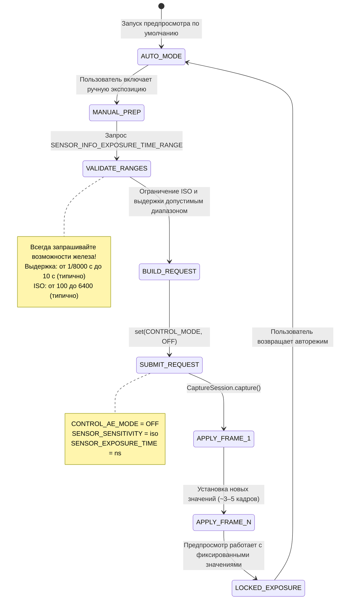

# Глава 14: Ручная экспозиция в Camera2

Вооружившись теорией фотографии из главы 13, пришло время перевести концепции в код. В этой главе вы узнаете, как **полностью взять на себя управление** системой автоэкспозиции (AE) камеры и установить ISO и выдержку вручную с помощью API Camera2.

Приложение [Android Camera Parameters](https://github.com/zoozooll/AndroidCameraParameters) демонстрирует все методы из этой главы — вы можете следить за процессом в реальном времени, переключившись в режим Manual в приложении и настраивая ползунки ISO и Shutter.

---

## Главный переключатель: из AUTO в MANUAL

По умолчанию каждый отправляемый вами `CaptureRequest` выполняется под управлением встроенного в камеру автоконвейера 3A (Auto Exposure, Auto Focus, Auto White Balance). Чтобы перейти в ручной режим, вы должны **явно отключить** этот конвейер.

Существует два уровня переопределения:

| Уровень | Настройка | Что происходит |
|-------|---------|-------------|
| 1. Отключить только AE | `CONTROL_AE_MODE = OFF` | ISO + выдержка становятся ручными; AF и AWB всё еще работают в авторежиме |
| 2. Отключить весь 3A | `CONTROL_MODE = OFF` | **Все** алгоритмы 3A останавливаются; каждый параметр 3A должен быть установлен вручную |

Для надежной ручной экспозиции установите **оба** значения. Отключение только `CONTROL_AE_MODE` на некоторых устройствах всё равно оставляет «помогающую» постобработку производителя. Установка `CONTROL_MODE = OFF` — это самый чистый и предсказуемый путь.



**Задержка перехода:** когда вы отправляете запрос на захват с ручными настройками, новые значения ISO/выдержки не появятся на *следующем* кадре. У CMOS-сенсоров есть задержка конвейера — *текущий* кадр уже экспонируется со старыми настройками. Ожидайте **3–5 кадров перехода**, прежде чем значения стабилизируются. Приложение [Android Camera Parameters](https://play.google.com/store/apps/details?id=com.minininja.cameraparams) явно ждет `CaptureResult`, чтобы подтвердить соответствие запрошенных значений примененным, прежде чем сообщить об успешной блокировке.

---

## Ручное управление в API Camera2

### SENSOR_SENSITIVITY (ISO)

Camera2 выражает ISO как `CaptureRequest.SENSOR_SENSITIVITY` — целое число, которое напрямую соответствует арифметической шкале ISO. На большинстве устройств это прямое сопоставление:

| ISO фотографа | Значение SENSOR_SENSITIVITY |
|-------------------|--------------------------|
| 100 | 100 |
| 400 | 400 |
| 3200 | 3200 |
| 6400 | 6400 |

**Всегда запрашивайте допустимый диапазон.** Не прописывайте значения жестко:

```kotlin
val sensorSensitivityRange = characteristics.get(
    CameraCharacteristics.SENSOR_INFO_SENSITIVITY_RANGE
)
val minIso = sensorSensitivityRange?.lower ?: 100
val maxIso = sensorSensitivityRange?.upper ?: 6400
```

Некоторые премиальные телефоны сообщают о диапазоне 50–12800, в то время как бюджетные устройства могут ограничить вас диапазоном 100–3200. Значения вне диапазона обрезаются HAL, что сводит на нет смысл ручного управления.

### SENSOR_EXPOSURE_TIME (Выдержка в наносекундах)

Вот первая ловушка, в которую попадает каждый новый разработчик Camera2: **время выдержки хранится в наносекундах (нс), а не в секундах.** Люди думают значениями типа 1/60 с; HAL думает значением 16 666 666 нс.

Конвертация между ними — это простая арифметика:

```kotlin
// Секунды → Наносекунды (умножить на 1 000 000 000)
fun secondsToNs(seconds: Double): Long = (seconds * 1_000_000_000.0).toLong()

// Наносекунды → Секунды для отображения пользователю
fun nsToSeconds(ns: Long): Double = ns.toDouble() / 1_000_000_000.0

// Форматтер для человека (например, "1/60s" или "2.5s")
fun formatShutter(ns: Long): String {
    val seconds = nsToSeconds(ns)
    return when {
        seconds >= 1.0 -> String.format("%.1fs", seconds)
        else -> {
            val fraction = (1.0 / seconds).toInt()
            "1/${fraction}s"
        }
    }
}
```

**Общие преобразования для справки:**

| Выдержка в привычном виде | Наносекунды (нс) |
|--------------|-------------------|
| 1/8000 с | 125 000 |
| 1/1000 с | 1 000 000 |
| 1/500 с | 2 000 000 |
| 1/120 с (24fps правило 180°) | 8 333 333 |
| 1/60 с | 16 666 666 |
| 1/30 с | 33 333 333 |
| 1/15 с | 66 666 666 |
| 1 с | 1 000 000 000 |
| 2 с | 2 000 000 000 |
| 10 с | 10 000 000 000 |
| 30 с | 30 000 000 000 |

**И снова, запрашивайте аппаратный диапазон:**

```kotlin
val exposureTimeRange = characteristics.get(
    CameraCharacteristics.SENSOR_INFO_EXPOSURE_TIME_RANGE
)
val minShutterNs = exposureTimeRange?.lower ?: 1_000_000L   // порог 1/1000 с
val maxShutterNs = exposureTimeRange?.upper ?: 10_000_000_000L  // потолок 10 с
```

На устройствах, поддерживающих сверхдлинную выдержку (например, некоторые модели Sony Xperia и Google Pixel), `SENSOR_INFO_EXPOSURE_TIME_RANGE.upper` может превышать 30 000 000 000 нс (30 с). Соблюдайте этот лимит — запросы сверх максимума молча обрезаются.

---

## ⚠️ Критично: ухудшение качества в ручном режиме

**Это самое важное предупреждение в главе.** Не пропускайте его.

Когда вы устанавливаете `CONTROL_MODE = OFF` (полное ручное переопределение), вы не просто отключаете *алгоритмы* AE/AF/AWB — на почти всех устройствах Android вы также **отключаете проприетарную вычислительную постобработку производителя**, которая обычно работает внутри конвейера 3A.

В частности, исследования и анализ HAL3 показывают, что отключение 3A обычно выключает:

| Этап обработки | Режим AUTO | Режим MANUAL (CONTROL_MODE = OFF) |
|-----------------|-----------|-----------------------------------|
| Многокадровое шумоподавление | ✓ Активно — чистый вывод | ✗ ВЫКЛ — виден сырой шум сенсора |
| Адаптивная тональная компрессия / HDR | ✓ Активно — детали в светах и тенях | ✗ ВЫКЛ — только кривая одного кадра |
| Локальное повышение контраста | ✓ Зависит от сцены | ✗ Плоская стандартная кривая |
| Замер по лицам / детекция сцен | ✓ Приоритет экспозиции на лица | ✗ Игнорируется |
| Коррекция виньетирования | ✓ Калибровано для каждой линзы | ✗ Часто снижена или выключена |

**Результат:** фото в ручном режиме при ISO 3200 и 1/15 с будет выглядеть *заметно хуже* (больше шума, плоский контраст), чем тот же снимок в режиме AUTO с *идентичными* ISO и выдержкой, выбранными HAL.

**Что можно сделать?** Два реальных варианта:

1. **Обрабатывать самостоятельно.** Раз уж вы отключили обработку производителя, вы можете применить собственные алгоритмы шумоподавления (например, билатеральный фильтр OpenCV, шумоподавитель MediaPipe или кастомную нейросеть) в своем конвейере. Захват RAW (см. следующие главы) + самостоятельная проявка RAW дают максимальный художественный контроль.

2. **Использовать переопределения AE вместо CONTROL_MODE = OFF.** Если вам нужно только *зафиксировать* определенные значения, сохраняя обработку производителя, попробуйте установить `CONTROL_AE_MODE = ON`, но жестко задать `SENSOR_SENSITIVITY` и `SENSOR_EXPOSURE_TIME` для каждого запроса. Поддержка такого смешанного режима зависит от устройства — тщательно тестируйте.

В приложении [Android Camera Parameters](https://github.com/zoozooll/AndroidCameraParameters) есть переключатель в панели Manual, который позволяет переключаться между обоими подходами и визуально сравнить разницу в качестве.

---

## Полный пример 1: Фиксированная экспозиция для таймлапса

Классический случай использования ручной экспозиции — **таймлапс-съемка**. В режиме AUTO камера постоянно подстраивает экспозицию по мере движения облаков или изменения света. В результате видео ужасно мерцает. Фиксация ISO + выдержки устраняет эту проблему.

**Цель:** ISO 100, 1/60 с (16 666 666 нс) — зафиксировано для каждого кадра.

```kotlin
class TimelapseManualExposure(
    private val characteristics: CameraCharacteristics,
    private val captureSession: CameraCaptureSession,
    private val imageReaderSurface: Surface,
    private val previewSurface: Surface
) {
    companion object {
        private const val TARGET_ISO = 100
        private const val TARGET_SHUTTER_NS = 16_666_666L // 1/60s
    }

    fun captureTimelapseFrame(frameCallback: ImageReader.OnImageAvailableListener) {
        try {
            // ---- ШАГ 1: Проверка допустимости значений для железа ----
            val isoRange = characteristics.get(
                CameraCharacteristics.SENSOR_INFO_SENSITIVITY_RANGE
            )
            val shutterRange = characteristics.get(
                CameraCharacteristics.SENSOR_INFO_EXPOSURE_TIME_RANGE
            )

            val clampedIso = isoRange?.let {
                TARGET_ISO.coerceIn(it.lower, it.upper)
            } ?: TARGET_ISO

            val clampedShutter = shutterRange?.let {
                TARGET_SHUTTER_NS.coerceIn(it.lower, it.upper)
            } ?: TARGET_SHUTTER_NS

            // ---- ШАГ 2: Создание CaptureRequest с ручной экспозицией ----
            val requestBuilder = captureSession.device.createCaptureRequest(
                CameraDevice.TEMPLATE_STILL_CAPTURE
            ).apply {
                addTarget(previewSurface)
                addTarget(imageReaderSurface)

                // --- КЛЮЧЕВЫЕ СТРОКИ: Отключаем 3A и фиксируем значения ---
                set(CaptureRequest.CONTROL_MODE, CameraMetadata.CONTROL_MODE_OFF)
                set(CaptureRequest.CONTROL_AE_MODE, CameraMetadata.CONTROL_AE_MODE_OFF)
                set(CaptureRequest.SENSOR_SENSITIVITY, clampedIso)
                set(CaptureRequest.SENSOR_EXPOSURE_TIME, clampedShutter)

                // Опционально: Фиксируем AWB на Daylight для стабильности цвета
                set(CaptureRequest.CONTROL_AWB_MODE, CameraMetadata.CONTROL_AWB_MODE_DAYLIGHT)

                // Качество JPEG для захвата
                set(CaptureRequest.JPEG_QUALITY, 95)
            }

            // ---- ШАГ 3: Отправка запроса на захват ----
            captureSession.capture(
                requestBuilder.build(),
                object : CameraCaptureSession.CaptureCallback() {
                    override fun onCaptureCompleted(
                        session: CameraCaptureSession,
                        request: CaptureRequest,
                        result: TotalCaptureResult
                    ) {
                        // Проверяем, применил ли HAL наши значения (он может их обрезать!)
                        val appliedIso = result.get(CaptureResult.SENSOR_SENSITIVITY)
                        val appliedShutter = result.get(CaptureResult.SENSOR_EXPOSURE_TIME)
                        Log.d("Timelapse", "Применено: ISO=$appliedIso, Shutter=${formatShutter(appliedShutter!!)}")
                    }
                },
                null // Запуск на Handler текущего потока
            )

        } catch (e: CameraAccessException) {
            Log.e("Timelapse", "Ошибка ручного захвата", e)
        }
    }
}
```

**Ключевые моменты:**

- Всегда используйте `coerceIn()` относительно аппаратных диапазонов. Если минимальное ISO бюджетного телефона — 120, ваш запрос на 100 превратится в 120. `onCaptureCompleted()` подтвердит то, что было применено *на самом деле*.
- Для таймлапса отправляйте этот запрос каждые N секунд (например, каждые 5 с для 300-кратного ускорения при выводе 30 кадров в секунду).
- Фиксация `CONTROL_AWB_MODE_DAYLIGHT` необязательна, но рекомендуется для таймлапсов — иначе баланс белого может немного «гулять» между кадрами даже при фиксированной экспозиции.

---

## Полный пример 2: Длинная выдержка для ночной съемки

**Цель:** ISO 3200, 2 секунды (2 000 000 000 нс) — плавные шлейфы воды, яркое ночное небо.

**Критическое аппаратное требование:** устройство должно поддерживать `SENSOR_INFO_EXPOSURE_TIME_RANGE.upper >= 2 000 000 000 нс`. Многие телефоны среднего класса ограничены значениями от 1/8 с до 1 с.

```kotlin
class NightLongExposure(
    private val characteristics: CameraCharacteristics,
    private val captureSession: CameraCaptureSession,
    private val previewSurface: Surface,
    private val jpegReaderSurface: Surface,
    private val rawReaderSurface: Surface? // Опционально захват RAW
) {
    fun shootLongExposure(onPhotoSaved: (path: String) -> Unit) {
        val shutterNs = 2_000_000_000L  // 2 секунды
        val targetIso = 3200

        // --- Проверяем, способно ли железо на это ---
        val shutterRange = characteristics.get(
            CameraCharacteristics.SENSOR_INFO_EXPOSURE_TIME_RANGE
        )
        if (shutterRange == null || shutterRange.upper < shutterNs) {
            throw UnsupportedOperationException(
                "Устройство не поддерживает выдержку 2с. Максимум = " +
                "${shutterRange?.upper?.let { nsToSeconds(it) } ?: "неизвестно"}с"
            )
        }

        val requestBuilder = captureSession.device.createCaptureRequest(
            CameraDevice.TEMPLATE_STILL_CAPTURE
        ).apply {
            addTarget(previewSurface)
            addTarget(jpegReaderSurface)
            // Если вы ранее настроили OutputConfiguration с поддержкой RAW:
            rawReaderSurface?.let { addTarget(it) }

            // Ручное переопределение экспозиции
            set(CaptureRequest.CONTROL_MODE, CameraMetadata.CONTROL_MODE_OFF)
            set(CaptureRequest.CONTROL_AE_MODE, CameraMetadata.CONTROL_AE_MODE_OFF)
            set(CaptureRequest.SENSOR_SENSITIVITY, targetIso)
            set(CaptureRequest.SENSOR_EXPOSURE_TIME, shutterNs)

            // --- Критично для длинных выдержек ---
            // Отключаем оптическую/цифровую стабилизацию (они конфликтуют при выдержке >1с)
            set(CaptureRequest.LENS_OPTICAL_STABILIZATION_MODE,
                CameraMetadata.LENS_OPTICAL_STABILIZATION_MODE_OFF)
            // Без вспышки для снимков с длинной выдержкой
            set(CaptureRequest.CONTROL_AE_MODE, CameraMetadata.CONTROL_AE_MODE_OFF)
        }

        captureSession.capture(
            requestBuilder.build(),
            object : CameraCaptureSession.CaptureCallback() {
                override fun onCaptureStarted(
                    session: CameraCaptureSession,
                    request: CaptureRequest,
                    timestamp: Long
                ) {
                    super.onCaptureStarted(session, request, timestamp)
                    // Уведомление UI: "Экспозиция началась — держитесь неподвижно 2 секунды"
                    Log.d("LongExposure", "Экспозиция началась @ $timestamp")
                }

                override fun onCaptureCompleted(
                    session: CameraCaptureSession,
                    request: CaptureRequest,
                    result: TotalCaptureResult
                ) {
                    // OnImageAvailableListener в ImageReader сработает отдельно для сохранения JPEG
                    Log.d("LongExposure", "Захват с длинной выдержкой завершен")
                }
            },
            null
        )
    }
}
```

**Советы по длинной выдержке:**

1. **Выключайте OIS.** Оптическая стабилизация в большинстве объективов пытается компенсировать дрожание камеры *во время* экспозиции. При выдержках более 0,5 с приводы OIS могут перенасыщаться и вызывать видимый дрейф. Отключите ее и используйте штатив.

2. **Ожидайте «замирания».** Камера не будет выдавать кадры предпросмотра, пока идет 2-секундная экспозиция. Ваш интерфейс должен показывать явный индикатор «ИДЕТ ЭКСПОНИРОВАНИЕ…».

3. **RAW лучше.** Высокое ISO (3200) + длинная выдержка создают тепловой шум (сенсор нагревается). Сохраните кадр в RAW и используйте настольный проявитель RAW с усреднением кадров — или реализуйте собственную длинную выдержку, усредняя 8 кадров по 0,25 с вместо одного кадра в 2 с (это резко снижает тепловой шум).

---

## Полный пример 3: Брекетинг экспозиции из 3 кадров

**Цель:** одно и то же ISO, 3 разные выдержки: −1 EV, 0 EV, +1 EV. Пользователь позже объединит их в HDR-фото.

Из главы 13 мы знаем, что каждый шаг EV удваивает или уменьшает свет вдвое. При фиксированном ISO каждый шаг EV — это умножение или деление выдержки на 2.

```kotlin
class ExposureBracketing(
    private val characteristics: CameraCharacteristics,
    private val captureSession: CameraCaptureSession,
    private val previewSurface: Surface,
    private val jpegReaderSurface: Surface
) {
    data class BracketFrame(
        val label: String,
        val evShift: Double,  // -1.0, 0.0, +1.0
        val shutterNs: Long,
        val iso: Int
    )

    fun captureBracketSeries(baseIso: Int, baseShutterNs: Long) {
        val isoRange = characteristics.get(
            CameraCharacteristics.SENSOR_INFO_SENSITIVITY_RANGE
        )
        val shutterRange = characteristics.get(
            CameraCharacteristics.SENSOR_INFO_EXPOSURE_TIME_RANGE
        )

        // Планирование серии: умножаем выдержку на 2^(evStep)
        val frames = listOf(-1.0, 0.0, +1.0).map { ev ->
            val multiplier = Math.pow(2.0, ev)
            val rawShutter = (baseShutterNs.toDouble() * multiplier).toLong()
            val clampedShutter = shutterRange?.let {
                rawShutter.coerceIn(it.lower, it.upper)
            } ?: rawShutter
            val clampedIso = isoRange?.let {
                baseIso.coerceIn(it.lower, it.upper)
            } ?: baseIso
            BracketFrame("EV${if (ev > 0) "+" else ""}${ev.toInt()}", ev, clampedShutter, clampedIso)
        }

        Log.d("Bracket", "План: ${frames.map { "${it.label} ISO${it.iso} ${formatShutter(it.shutterNs)}" }}")

        // Отправляем каждый кадр как серию (burst) для атомарности
        val requestList = frames.map { frame ->
            captureSession.device.createCaptureRequest(
                CameraDevice.TEMPLATE_STILL_CAPTURE
            ).apply {
                addTarget(previewSurface)
                addTarget(jpegReaderSurface)

                set(CaptureRequest.CONTROL_MODE, CameraMetadata.CONTROL_MODE_OFF)
                set(CaptureRequest.CONTROL_AE_MODE, CameraMetadata.CONTROL_AE_MODE_OFF)
                set(CaptureRequest.SENSOR_SENSITIVITY, frame.iso)
                set(CaptureRequest.SENSOR_EXPOSURE_TIME, frame.shutterNs)

                // Помечаем каждый запрос тегом, чтобы различать кадры в обратном вызове
                setTag(frame.label)
            }.build()
        }

        captureSession.captureBurst(
            requestList,
            object : CameraCaptureSession.CaptureCallback() {
                override fun onCaptureCompleted(
                    session: CameraCaptureSession,
                    request: CaptureRequest,
                    result: TotalCaptureResult
                ) {
                    val tag = request.tag as? String ?: "?"
                    Log.d("Bracket", "$tag завершен — готов к HDR слиянию")
                }
            },
            null
        )
    }
}
```

**Почему `captureBurst()` вместо трех отдельных вызовов `capture()`?** `captureBurst()` отправляет весь список атомарно. HAL гарантирует, что никакие другие кадры предпросмотра не вклинятся между ними, а состояние фокуса и баланса белого не изменится между кадрами.

**Хотите 5 или 7 кадров?** Просто измените список `listOf(-2.0, -1.0, 0.0, +1.0, +2.0)` — математика масштабируется. Многие профессиональные HDR-приложения снимают серию из 9 кадров для сцен с экстремальным динамическим диапазоном.

**Этап слияния:** как только у вас будут три JPEG (или RAW) кадра, вы можете объединить их, используя:
- Встроенный в Android конвейер HDR через `CameraExtensionSession` (см. главу об HDR).
- Стороннюю библиотеку, например `createMergeDebevec()` / `createMergeRobertson()` из OpenCV для истинного объединения экспозиций.
- Библиотеку Google Photo Sphere HDR.

---

## Устранение распространенных ошибок

| Проблема | Вероятная причина | Исправление |
|---------|-------------|-----|
| Ручные значения игнорируются, всё выглядит как авто | `CONTROL_MODE` не установлен в OFF, или значения обрезаны | Установите и CONTROL_MODE, и CONTROL_AE_MODE в OFF; проверьте примененные значения в `onCaptureCompleted()` |
| Запрос на длинную выдержку 2с сразу выдает ошибку | Устройство не может делать выдержку 2с | Проверьте `SENSOR_INFO_EXPOSURE_TIME_RANGE.upper`; уменьшите время или поднимите ISO |
| Предпросмотр заикается или лагает при переключении в ручной режим | Слишком много вызовов `setRepeatingRequest()` | Используйте ограничение частоты (throttle) для слушателя слайдера (каждые 30–50 мс); обновляйте только повторяющийся запрос |
| Фото с длинной выдержкой полностью черное при ISO 100 2с | Сцене нужно больше света при ISO 100 | Поднимите ISO или увеличьте выдержку; 2с при ISO 100 — это база EV 0, а не «ночная яркость» |
| Ручные снимки шумнее автоматических при том же ISO | Шумоподавление производителя отключено через CONTROL_MODE = OFF | Это ожидаемое поведение! См. раздел «Ухудшение качества в ручном режиме». Обрабатывайте сами или используйте блокировку AE_LOCK |

---

## Резюме

Теперь у вас есть инструменты, чтобы полностью забрать управление экспозицией у Camera2 HAL:

- **Отключайте конвейер 3A** с помощью `CONTROL_MODE = OFF` + `CONTROL_AE_MODE = OFF` для полного ручного контроля.
- **Сопоставляйте ISO с `SENSOR_SENSITIVITY`** (прямое сопоставление на большинстве устройств; всегда запрашивайте диапазон).
- **Сопоставляйте секунды с наносекундами** для `SENSOR_EXPOSURE_TIME` простым умножением на 10⁹.
- **Блокировка таймлапса:** фиксированное ISO 100 + 1/60 с для каждого кадра = отсутствие мерцания.
- **Ночная длинная выдержка:** ISO 3200 + 2 с с отключенным OIS = яркая плавная ночная сцена (на поддерживаемом железе).
- **Брекетинг экспозиции:** одно и то же ISO, выдержка ×0,5 / ×1 / ×2 через `captureBurst()` = готовый вход для HDR-слияния.
- **⚠️ Компромисс качества:** отключение 3A отключает шумоподавление и тональное отображение производителя — ручные фото часто выглядят *хуже*, чем автоматические при том же ISO. Планируйте постобработку.

## Что дальше

Экспозиция управляет *яркостью*. **Фокусировка управляет резкостью.** В **главе 15: Фокусировка** мы разберем:

- Состояния и режимы автофокуса (AF) — как работает пассивное сканирование, разница между режимами для фото и видео.
- Ручную фокусировку с помощью `LENS_FOCUS_DISTANCE` в диоптриях (0.0 = бесконечность, 10D = 0,1 м).
- Код на Kotlin для последовательности запуска AF и захвата, а также слайдер SeekBar для ручной фокусировки.
- Конечный автомат AF — когда на самом деле срабатывает `CONTROL_AF_STATE_FOCUSED_LOCKED` и как его дождаться.

Размытие прекращается здесь.
