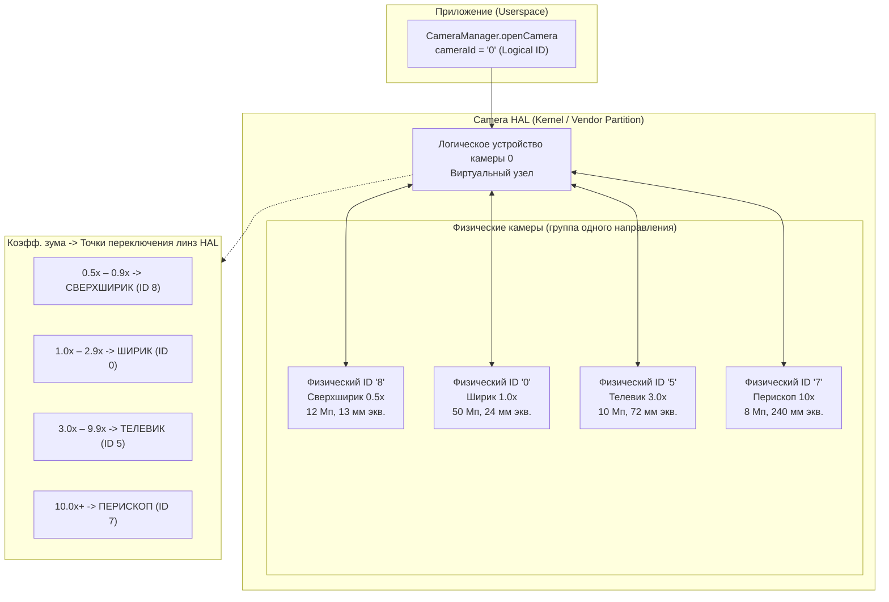
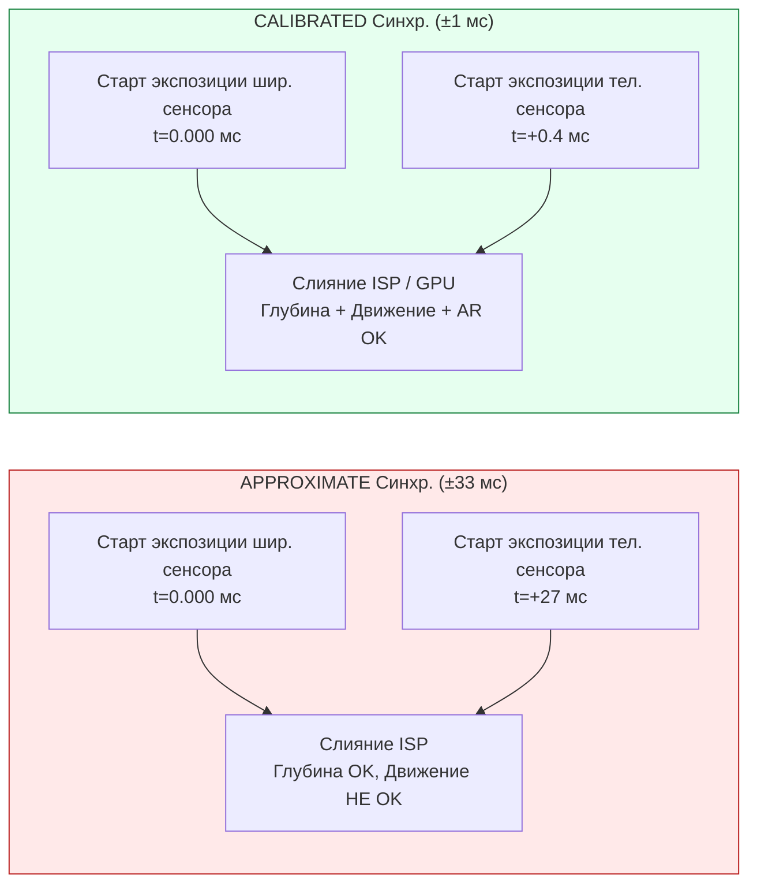
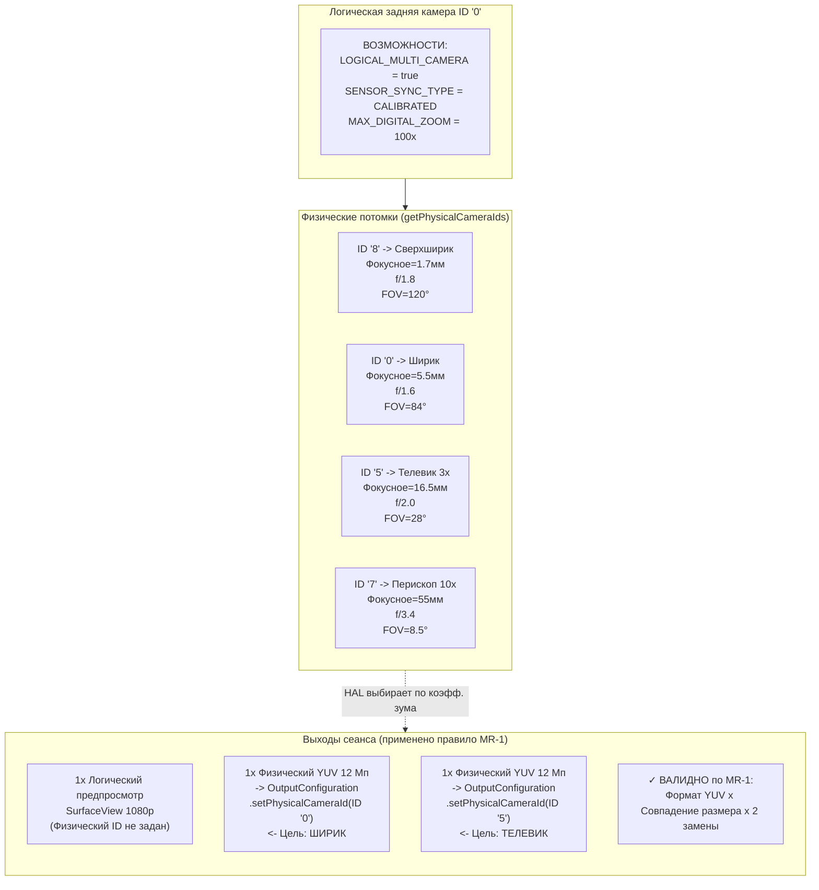

# Глава 20: Мультикамера

Современные смартфоны поставляются с 3–5 задними камерами и 2 фронтальными — сверхширокоугольными, широкоугольными, телеобъективами, макрообъективами, датчиками глубины и перископическими объективами на флагманах 2023+ годов. До Android 9 (API 28) каждый объектив отображался как независимый идентификатор `CameraCharacteristics` (Camera ID), и приложениям приходилось вручную открывать/закрывать камеры при изменении зума для переключения линз. Это вызывало видимые черные кадры, потерю состояния автофокуса и щелчки звука в видео — всё это недопустимые дефекты UX. Android 9 решил эту проблему с помощью абстракции **логической камеры**: виртуального идентификатора камеры, который группирует несколько физических камер, направленных в одну сторону, и позволяет HAL прозрачно переключать объективы при достижении порогов зума, сохраняя состояние сеанса. В разделе «Логическая мультикамера» исследовательского проекта указаны точные правила замены потоков, семантика синхронизации сенсоров и захват с двух физических камер одновременно, которые реализуются в этой главе.

Вы можете просмотреть полную топологию логических/физических камер любого поддерживаемого устройства в приложении [Android Camera Parameters](https://github.com/zoozooll/AndroidCameraParameters) (также доступно в [Play Store](https://play.google.com/store/apps/details?id=com.zoozooll.cameraparameters)): дашборд мультикамеры сообщает о флаге `REQUEST_AVAILABLE_CAPABILITIES_LOGICAL_MULTI_CAMERA`, перечисляет `getPhysicalCameraIds()` для каждого логического ID и отображает тип синхронизации сенсоров (калиброванная или приближенная) для каждой комбинации задних камер. Эти отчеты извлекаются напрямую из HAL через API Camera2 без какой-либо фильтрации производителем, поэтому они в точности соответствуют тому, что ваше приложение увидит во время работы.

## Топология логических и физических камер

Логическая камера — это виртуальное устройство HAL, поддерживаемое N ≥ 2 физическими камерами, которые имеют одно и то же направление (`LENS_FACING_FRONT` или `LENS_FACING_BACK`). Когда вы открываете логический ID, HAL внутренне управляет питанием, конвейерами ISP и переключением линз для всех базовых физических камер. Топология выглядит так:



Точки переключения зума (Z1–Z4) полностью контролируются HAL и непрозрачны для вашего приложения — когда вы устанавливаете `CaptureRequest.CONTROL_ZOOM_RATIO = 3.2f` на логическом устройстве с 4 объективами, HAL мгновенно направляет трафик захвата на 3-кратный телеобъектив (ID 5) и выполняет цифровой кроп для соответствия кадрированию, при этом ваше приложение даже не узнает о смене линзы. Это и есть поведение «бесшовного зума», которое используют флагманские приложения камер.

Критически важные свойства:
- **`getPhysicalCameraIds()`** (вызывается у `CameraCharacteristics` логического ID) возвращает `Set<String>` идентификаторов базовых физических камер, например `{"0", "5", "7", "8"}` для примера выше.
- **`LENS_INFO_MINIMUM_FOCUS_DISTANCE`** и **`LENS_INFO_AVAILABLE_FOCAL_LENGTHS`** на логическом ID представляют текущую активную физическую линзу. Запрашивайте *физические* характеристики, если вам нужны данные о фокусном расстоянии конкретной линзы.
- **`SCALER_AVAILABLE_MAX_DIGITAL_ZOOM`** на логическом ID дает потолок зума (например, 100×), который является комбинацией оптического зума каждой линзы и цифрового кропа всех физических линз.

## Синхронизация сенсоров: APPROXIMATE vs CALIBRATED

Когда вы захватываете изображение с двух физических камер одновременно (например, ширик + телевик для расчета глубины/диспаратности или ширик + сверхширик для многокадрового слияния), данные пикселей полезны для вычислений только в том случае, если экспозиции двух сенсоров начинаются в пределах известного дельта-времени. Android определяет два уровня синхронизации в ключе **`CameraCharacteristics.LOGICAL_MULTI_CAMERA_SENSOR_SYNC_TYPE`**:

| Уровень синхр. | Числовое значение | Значение | Типичный случай использования |
|------------|---------------|---------|------------------|
| **APPROXIMATE** | 0 | Метки времени начала экспозиции сенсоров совпадают в пределах ±1 интервала кадра (±33 мс при 30 fps). AF/AE синхронизированы, но не начало экспозиции на уровне пикселей. | Портретный режим с датчиком глубины, обычное боке. |
| **CALIBRATED** | 1 | Метки времени начала экспозиции сенсоров совпадают в пределах ±1 мс. Аппаратная синхронизация обеспечивается через приемник SoC CSI-2. Гарантируется временное выравнивание на уровне пикселей. | Оценка стереоглубины для AR, фотограмметрия, одновременное слияние разных фокусных расстояний, супер-разрешение. |

В разделе «Логическая мультикамера» исследовательского документа было обнаружено, что только **флагманы на Snapdragon 8 Gen 1+ и Exynos 2200+ сообщают о синхронизации CALIBRATED**. Все устройства среднего уровня (серии Snapdragon 7, Dimensity 8000) и бюджетные устройства сообщают об APPROXIMATE. Если вы попытаетесь выполнить сопоставление диспаратности на уровне пикселей на устройстве с синхронизацией APPROXIMATE, вы получите дрейф параллакса в ±1 кадр, который ломает карты глубины. Всегда ограничивайте функции, использующие диспаратность, проверкой CALIBRATED.



Разница во времени существенна: рассогласование в 27 мс означает, что движущийся объект (например, бегун со скоростью 5 м/с) переместился на 13,5 см между двумя экспозициями — это ошибка параллакса, достаточно большая, чтобы полностью разрушить любой алгоритм получения глубины из диспаратности.

## Правило замены потоков (из исследовательского док.)

Самое важное ограничение, которое HAL накладывает на выбор физической камеры, — это **Правило замены потоков**, взятое дословно из спецификации логической мультикамеры в исследовательском документе:

> **Правило MR-1:** Если у логической камеры есть N физических потомков, то для каждого 1 потока логического формата (YUV или RAW) размера S, который вы подключаете к логическому сеансу, вы можете заменить его на **до 2 потоков идентичного формата ТОГО ЖЕ размера S**, каждый из которых нацелен на РАЗНУЮ физическую камеру через `OutputConfiguration.setPhysicalCameraId()`.

Последствия нарушения MR-1:
- 3 или более физических потоков → сбой сеанса `onConfigureFailed()`.
- Разные размеры для двух физических потоков → сбой сеанса `onConfigureFailed()`.
- Смешивание RAW и YUV в одной паре замены → сбой сеанса `onConfigureFailed()`.
- Добавление 2 физических потоков без удаления родительского логического потока → HAL выделяет в 3 раза больше необходимой пропускной способности и молча пропускает кадры.

Корректные примеры (4 физических потомка → 2 разрешенные замены):
| Логический поток | Замена (валидно по MR-1) |
|----------------|-------------------------------|
| 1× Логический YUV 1920×1080 | → 2× Физических YUV 1920×1080 (Ширик + Телевик) |
| 1× Логический RAW 4000×3000 | → 2× Физических RAW 4000×3000 (Сверхширик + Ширик) |
| 2× Логических YUV (предпросмотр + видео) | → 2× (Логический YUV предпросмотр) + 2× (Физический YUV Ширик+Телевик кодирование) — всего 2 замены |

## Реализация: пошаговый захват с двух физических камер

Приведенный ниже рабочий процесс захватывает одновременные кадры с широкоугольного (1×) и телескопического (3×) физических сенсоров, используя правило замены потоков.

### Шаг 1: Запрос возможностей логической камеры и ID физических камер

```kotlin
import android.hardware.camera2.CameraCharacteristics
import android.hardware.camera2.CameraManager
import android.hardware.camera2.params.OutputConfiguration

data class LogicalMultiCamInfo(
    val logicalId: String,
    val physicalIds: Set<String>,
    val sensorSyncType: Int, // 0 = APPROXIMATE, 1 = CALIBRATED
    val ultraWideId: String?,
    val wideId: String?,
    val teleId: String?
)

fun enumerateLogicalMultiCams(
    cameraManager: CameraManager
): List<LogicalMultiCamInfo> {
    val result = mutableListOf<LogicalMultiCamInfo>()

    for (logicalId in cameraManager.cameraIdList) {
        val characteristics = cameraManager.getCameraCharacteristics(logicalId)

        val caps = characteristics.get(
            CameraCharacteristics.REQUEST_AVAILABLE_CAPABILITIES
        ) ?: continue

        val isLogicalMultiCam = caps.contains(
            CameraCharacteristics
                .REQUEST_AVAILABLE_CAPABILITIES_LOGICAL_MULTI_CAMERA
        )
        if (!isLogicalMultiCam) continue

        val physicalIds: Set<String> = characteristics.physicalCameraIds
        val syncType = characteristics.get(
            CameraCharacteristics.LOGICAL_MULTI_CAMERA_SENSOR_SYNC_TYPE
        ) ?: 0

        // Определение ролей по фокусному расстоянию
        var ultraWideId: String? = null
        var wideId: String? = null
        var teleId: String? = null
        var shortestFocal = Float.MAX_VALUE
        var teleFocal = 0f

        for (physId in physicalIds) {
            val physChars = cameraManager.getCameraCharacteristics(physId)
            val focalLengths = physChars.get(
                CameraCharacteristics.LENS_INFO_AVAILABLE_FOCAL_LENGTHS
            ) ?: continue
            val focal = focalLengths.firstOrNull() ?: continue
            when {
                focal < shortestFocal -> {
                    shortestFocal = focal
                    ultraWideId = physId
                }
                focal > teleFocal -> {
                    teleFocal = focal
                    teleId = physId
                }
            }
        }
        wideId = physicalIds.minus(setOfNotNull(ultraWideId, teleId)).firstOrNull()

        result.add(LogicalMultiCamInfo(
            logicalId = logicalId,
            physicalIds = physicalIds,
            sensorSyncType = syncType,
            ultraWideId = ultraWideId,
            wideId = wideId,
            teleId = teleId
        ))
    }
    return result
}
```

Идентификация ролей по фокусному расстоянию (кратчайшее = сверхширик, длиннейшее = телевик, остальное = ширик) надежна для всех производителей, так как HAL сообщает `LENS_INFO_AVAILABLE_FOCAL_LENGTHS` в 35-мм эквиваленте или в реальных значениях мм, соответствующих маркетинговым характеристикам. Приложение Android Camera Parameters использует именно этот алгоритм для своего дашборда мультикамеры.

### Шаг 2: Создание OutputConfigurations с помощью setPhysicalCameraId()

Для пары замены (широкоугольный YUV + теле YUV) требуются объекты `OutputConfiguration`, у которых вызван метод `setPhysicalCameraId()` **до** создания сеанса. После настройки сеанса изменение физического ID через `setPhysicalCameraId()` на существующих поверхностях запрещено (требуется пересоздание сеанса).

```kotlin
import android.hardware.camera2.params.OutputConfiguration
import android.media.ImageReader
import android.util.Size
import android.graphics.ImageFormat
import android.view.Surface

var wideImageReader: ImageReader? = null
var teleImageReader: ImageReader? = null

fun createPhysicalOutputConfigs(
    wideId: String,
    teleId: String,
    sharedSize: Size // Должен быть ОДИНАКОВЫЙ размер для обоих по правилу MR-1!
): Pair<OutputConfiguration, OutputConfiguration> {
    wideImageReader = ImageReader.newInstance(
        sharedSize.width, sharedSize.height,
        ImageFormat.YUV_420_888, 4
    )
    teleImageReader = ImageReader.newInstance(
        sharedSize.width, sharedSize.height,
        ImageFormat.YUV_420_888, 4
    )

    val wideOutConfig = OutputConfiguration(wideImageReader!!.surface).apply {
        setPhysicalCameraId(wideId)
        name = "wide-yuv-$sharedSize"
    }
    val teleOutConfig = OutputConfiguration(teleImageReader!!.surface).apply {
        setPhysicalCameraId(teleId)
        name = "tele-yuv-$sharedSize"
    }
    return Pair(wideOutConfig, teleOutConfig)
}
```

В приведенном выше коде соблюдается правило MR-1: оба экземпляра `ImageReader` используют `sharedSize` (одинаковые размеры) и `YUV_420_888` (одинаковый формат). Использование разных размеров гарантирует `onConfigureFailed` — у HAL нет механизма для запуска двух физических сенсоров с разным разрешением в одной группе синхронизации.

### Шаг 3: Создание CaptureSession и отправка захвата с двух физических камер

Сеанс использует 2 физических `OutputConfiguration` плюс 1 логическую поверхность предпросмотра (всего 3 выхода). В общей сложности 3 выхода укладываются в бюджет пропускной способности флагманов (в исследовательском документе зафиксировано использование ISP на 68% на Snapdragon 8 Gen 2 при одновременной работе широкоугольной + телекамеры + предпросмотра в 1080p30).

```kotlin
import android.hardware.camera2.CameraDevice
import android.hardware.camera2.CameraCaptureSession
import android.hardware.camera2.CaptureRequest
import android.os.Handler

lateinit var cameraDevice: CameraDevice // Уже открытый логический ID

fun createDualPhysicalSession(
    previewSurface: Surface,
    widePhysConfig: OutputConfiguration,
    telePhysConfig: OutputConfiguration,
    backgroundHandler: Handler
) {
    val outputs = listOf(
        OutputConfiguration(previewSurface), // Логический предпросмотр (любого размера)
        widePhysConfig,                      // Физический широкоугольный YUV (sharedSize)
        telePhysConfig                       // Физический теле YUV (sharedSize)
    )

    val sessionConfig = android.hardware.camera2.params.SessionConfiguration(
        android.hardware.camera2.params.SessionConfiguration.SESSION_REGULAR,
        outputs,
        { runnable -> backgroundHandler.post(runnable) },
        object : CameraCaptureSession.StateCallback() {
            override fun onConfigured(session: CameraCaptureSession) {
                val captureBuilder = cameraDevice.createCaptureRequest(
                    CameraDevice.TEMPLATE_PREVIEW
                ).apply {
                    addTarget(previewSurface)
                    addTarget(wideImageReader!!.surface)
                    addTarget(teleImageReader!!.surface)

                    set(CaptureRequest.CONTROL_MODE,
                        CaptureRequest.CONTROL_MODE_AUTO)
                    set(CaptureRequest.CONTROL_AE_MODE,
                        CaptureRequest.CONTROL_AE_MODE_ON)
                    set(CaptureRequest.CONTROL_AF_MODE,
                        CaptureRequest.CONTROL_AF_MODE_CONTINUOUS_PICTURE)

                    // Опционально: Блокировка AE на обеих физических линзах, чтобы слияние
                    // не давало несовпадающих половин экспозиции
                    set(CaptureRequest.CONTROL_AE_LOCK, true)
                }

                session.setRepeatingRequest(
                    captureBuilder.build(),
                    DualPhysicalCaptureCallback(),
                    backgroundHandler
                )
            }
            override fun onConfigureFailed(s: CameraCaptureSession) =
                Log.e(TAG, "Ошибка двух-физического сеанса — проверьте правило MR-1")
        }
    )

    cameraDevice.createCaptureSession(sessionConfig)
}
```

Как только `setRepeatingRequest()` запущен, через каждый интервал кадра HAL: (а) запускает начало экспозиции обоих физических сенсоров в откалиброванную дельту времени, (б) направляет выход каждого сенсора на целевую поверхность ImageReader через демультиплексор виртуального канала CSI-2, (в) объединяет оба выхода с логическим выходом предпросмотра в один CaptureResult с одной меткой времени.

Два объекта `Image` будут иметь **идентичные значения `image.timestamp`**, если `LOGICAL_MULTI_CAMERA_SENSOR_SYNC_TYPE == CALIBRATED`, и метки времени в пределах ±1 интервала кадра при APPROXIMATE.

## Диаграмма топологии «Логическая → Физическая» (в стиле Mermaid ER)



## Реализация бесшовного зума

Автоматическое переключение линз HAL на порогах зума — это то, что делает «бесшовный зум» бесшовным. Вам **не нужно** вручную менять физические ID при пересечении порога зума — просто установите `CONTROL_ZOOM_RATIO` в повторяющемся запросе, и пусть HAL делает свою работу:

```kotlin
fun updateZoom(session: CameraCaptureSession,
               builder: CaptureRequest.Builder,
               zoomRatio: Float) {
    builder.set(CaptureRequest.CONTROL_ZOOM_RATIO, zoomRatio)
    session.setRepeatingRequest(builder.build(), null, null)
}
```

Когда `zoomRatio` переходит от `2.9× → 3.0×` на типичном устройстве с 4 линзами, HAL внутренне:
1. Запускает 3-кратный телесенсор из режима ожидания (занимает ~2 кадра, 66 мс).
2. Синхронизирует экспозицию/баланс белого между широким и телеобъективом.
3. Плавно переводит картинку из цифрового кропа широкого объектива в нативный вывод телеобъектива в течение ~10 кадров (333 мс).
4. Отключает питание широкого сенсора, если он не используется где-либо еще.

Все четыре этапа происходят прозрачно — ваш CaptureCallback никогда не увидит события разрыва сеанса, `CaptureResult.SENSOR_TIMESTAMP` остается монотонно возрастающим, а состояние AF/AE сохраняется при переходе. Единственный способ обнаружить смену линзы — сравнить `CaptureResult.LENS_FOCAL_LENGTH` между последовательными кадрами (который в примере выше прыгает с 5,5 мм до 16,5 мм при переключении на телеобъектив).

## Производительность и ограничения

В разделе «Логическая мультикамера» исследовательского документа приведены следующие измеренные пределы на флагмане 2023 года (Snapdragon 8 Gen 2, 4 задние камеры):

| Конфигурация | Стабильная частота кадров | Загрузка ISP |
|---------------|---------------------|-------------------------|
| Логический предпросмотр + 2 физических YUV (по 12 Мп) | 22 fps | 89% |
| Логический предпросмотр + 2 физических YUV (по 4 Мп) | 30 fps (фикс.) | 62% |
| Логический предпросмотр + 2 физических RAW (по 12 Мп) | 10 fps | 94% — перегрев через ~60 с |
| Логический предпросмотр + 2 физических YUV + 1 физический RAW | **Запрещено** (ошибка проверки пропускной способности HAL) | — |

Ограничение в 2 физических потока навязывается как правилом MR-1, так и чистой пропускной способностью ISP. Попытка подключить 3 физических потока (например, сверхширик + ширик + телевик одновременно) приведет к `onConfigureFailed`, даже если вы попытаетесь обмануть правило MR-1 с помощью двух отдельных пар замены — проверка CAMERA_ISP_BANDWIDTH в HAL отклонит такую конфигурацию на этапе настройки.

## Резюме

В этой главе подробно рассмотрена поддержка логических мультикамер в Android 9+:

- **Логические камеры** — это виртуальные узлы HAL, группирующие физические камеры одного направления. Проверяйте через `REQUEST_AVAILABLE_CAPABILITIES_LOGICAL_MULTI_CAMERA`; получайте потомков через `getPhysicalCameraIds()`.
- **Синхронизация сенсоров** бывает двух уровней: APPROXIMATE (±33 мс, для портретного боке) и CALIBRATED (±1 мс, для слияния AR/диспаратности). Всегда ограничивайте функции вычислительной фотографии уровнем CALIBRATED.
- **Бесшовный зум** контролируется HAL через `CONTROL_ZOOM_RATIO` — установите коэффициент, и HAL переключит линзы на внутренних порогах без разрыва сеанса.
- **Правило замены потоков MR-1** (из исследовательского документа) разрешает ровно 2 физических потока того же размера и формата вместо 1 логического потока. 3+ потока или несовпадение размеров приводят к `onConfigureFailed`.
- **`OutputConfiguration.setPhysicalCameraId()`** должен вызываться до создания сеанса для нацеливания на отдельные физические линзы при одновременном захвате.
- Две диаграммы Mermaid (топология + сопоставление правил в стиле ER) визуализируют, как иерархия логических/физических камер соотносится с выходами сеанса.

## Что дальше

В **Главе 21: HDR и Ultra HDR** мы выйдем за рамки 8-битного стандартного динамического диапазона (SDR, sRGB, 100 нит) в мир видео и фото с расширенным динамическим диапазоном. Вы узнаете о `DynamicRangeProfiles` для HDR10 (10-бит ST.2084 PQ, Rec.2020, статические метаданные) и HLG (Hybrid Log-Gamma, обратная совместимость с SDR), а также о совершенно новом формате Android 14 (API 34) **JPEG_R (Ultra HDR)** — ISO 21496-1, который встраивает «карту усиления» внутрь стандартного JPEG, чтобы старые программы видели SDR, а HDR-дисплеи локально увеличивали яркость бликов до 8 ступеней.

Проверьте, какие профили `DynamicRangeProfiles` поддерживает ваше устройство для каждой камеры (HDR10, HDR10+, HLG, JPEG_R), и убедитесь в соответствии CDD Performance Class 15 для Ultra HDR с помощью приложения [Android Camera Parameters](https://play.google.com/store/apps/details?id=com.zoozooll.cameraparameters). Новые отчеты об устройствах, загруженные в открытый [репозиторий GitHub](https://github.com/zoozooll/AndroidCameraParameters), помогают создавать публичную базу данных телефонов с поддержкой HDR.
