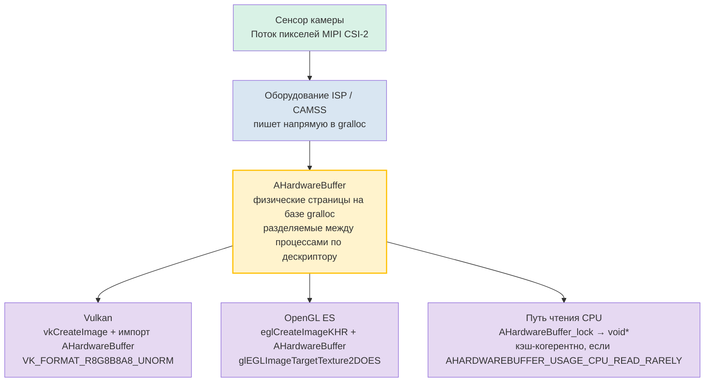

# Глава 25: Нативная разработка камер

## Резюме

Главы 1–24 работали в управляемом коде: Kotlin или Java, работающие в ART, пересекающие границу IPC Binder для каждого `CaptureRequest` и либо выделяющие копии кадров в `ByteBuffer`, либо принимающие накладные расходы на потоковую передачу текстур через `SurfaceTexture`. Для социальных приложений камеры этого вполне достаточно. Для движков AR, конвейеров компьютерного зрения в реальном времени, автомобильных камер заднего вида или 3D-движков с бюджетом 16 мс на кадр — нет.

Нативная разработка камер переносит весь цикл открытия, настройки и захвата в C/C++, используя заголовочные файлы NDK `<camera/NdkCameraManager.h>` и `<android/hardware_buffer.h>`. Немедленным преимуществом является отсутствие накладных расходов JNI на «горячем пути» и, что критически важно, возможность оборачивать объекты `AHardwareBuffer`, выделенные gralloc, напрямую как цели Vulkan `VkImage` или OpenGL `EGLImage` без единого байта копирования памяти между выходом сенсора и выборкой текстуры GPU.

**Android Camera Parameters** поможет вам подтвердить, что ваши целевые устройства предоставляют гарантии уровня `INFO_SUPPORTED_HARDWARE_LEVEL_FULL` или `LEVEL_3`, необходимые для предсказуемой низкоуровневой нативной работы. Установите его из [Google Play](https://play.google.com/store/apps/details?id=com.minininja.cameraparams) или изучите исходный код на [github.com/zoozooll/AndroidCameraParameters](https://github.com/zoozooll/AndroidCameraParameters).

---

## Зачем переходить на нативный код?

Прежде чем погружаться в C++, давайте точно определим, что дает нативный код и когда он оправдывает свою сложность.

### Плюсы нативного кода

1. **Нулевые накладные расходы JNI на критическом пути.** Конвейер 60fps имеет 16,67 мс на кадр. Один вызов JNI `CallVoidMethod`, пересекающий границу ART/C, занимает ~0,5–2 мкс в микротестах, но реальная стоимость — это вызов *на каждом кадре*, передача управления между потоками, учет локальных ссылок JNI и нагрузка на сборщик мусора (GC) от прокси-объектов `Image`. Умножьте это на четыре камеры, одновременно питающие сеанс AR, и вы потеряете миллисекунду бюджета только на пересечение языковых границ. Нативный код устраняет это.

2. **Прямое владение памятью с `AHardwareBuffer`.** В управляемом коде `Image.getPlanes()[0].getBuffer()` возвращает `ByteBuffer`, который является *представлением* (view) памяти gralloc; его чтение заставляет процессор сбрасывать кэш и часто приводит к внутреннему копированию для таких форматов, как `PRIVATE`. В нативном коде `AHardwareBuffer` — это сам дескриптор gralloc, и GPU может привязать его как память текстуры на месте.

3. **Интеграция с движками AR/3D.** Unity, Unreal, Ogre и внутренние движки пишутся на C++ по веской причине. Запуск камеры *внутри* кода C++ цикла рендеринга устраняет путаницу между тремя процессами: «ART + JNI + поток рендеринга».

4. **Миграция автомобильной системы EVS (External View System).** До Android 10 автомобильные камеры заднего вида использовали устаревший стек `EVS` со своим собственным HAL. В 2020–2024 годах OEM-производители перешли на использование стандартных API Camera2 NDK для EVS, зарезервировав `AID_AUTOMOTIVE_EVS_UID = 1071` для раннего доступа к оборудованию во время загрузки, *еще до того*, как запустится `system_server` CameraService. Если ваш код нацелен на автомобили, нативный код обязателен.

### Минусы нативного кода

- Отладка сложнее. Сбои в обратных вызовах `ACameraDevice` порождают дампы tombstone, а не красивые стектрейсы Kotlin.
- Управление жизненным циклом полностью ручное. `ACameraManager` *не* учитывает жизненный цикл; если вы забудете вызвать `ACameraCaptureSession_stopRepeating()` + `ACameraDevice_close()` при уничтожении поверхности, это приведет к утечке ресурсов камеры и может заблокировать другие приложения до перезагрузки.
- Меньше обходных путей для устройств. База данных особенностей CameraX не существует в мире NDK; вы наследуете поведение чистого HAL в том виде, в каком оно поставляется производителем.
- Нет `DngCreator`, нет помощников `ExifInterface`, нет удобных аксессоров `CameraCharacteristics` — вы сами разбираете теги метаданных через `ACameraMetadata_getConstEntry`.

Решение простое: если вы не можете уложиться в бюджет кадра в управляемом коде или вам нужен доступ к камере на этапе загрузки уровня EVS — переходите на нативный код. В противном случае оставайтесь на управляемом.

---

## ACameraManager: аналог CameraManager в NDK

Поверхность API камер в NDK в файлах `<camera/NdkCameraManager.h>`, `<camera/NdkCameraDevice.h>` и `<camera/NdkCaptureRequest.h>` сопоставляется почти один к одному с API Java. Каждому классу Java соответствует нативная структура и набор свободных функций:

| Java                          | Дескриптор NDK / Префикс функции                      |
|-------------------------------|-------------------------------------------------------|
| `CameraManager`               | `ACameraManager` · `ACameraManager_*`                 |
| `CameraCharacteristics`       | `ACameraMetadata` · `ACameraMetadata_*`               |
| `CameraDevice`                | `ACameraDevice` · `ACameraDevice_*`                   |
| `CaptureRequest.Builder`      | `ACaptureRequest` · `ACaptureRequest_setEntry_*`      |
| `CameraCaptureSession`        | `ACameraCaptureSession` · `ACameraCaptureSession_*`   |
| `TotalCaptureResult`          | `ACameraCaptureResult` · `ACaptureResult`             |
| `ImageReader`                 | `AImageReader` (из `<media/NdkImageReader.h>`)        |

Жизненный цикл идентичен: перечисление камер → чтение характеристик → открытие → создание выходных поверхностей → создание сеанса → установка повторяющегося запроса → завершение работы в обратном порядке.

### Пример 1: перечисление камер, чтение характеристик, открытие устройства (C++)

```cpp
#include <camera/NdkCameraManager.h>
#include <camera/NdkCameraDevice.h>
#include <camera/NdkCameraMetadata.h>
#include <android/log.h>

#define LOG_TAG "NativeCam"
#define LOGI(...) __android_log_print(ANDROID_LOG_INFO, LOG_TAG, __VA_ARGS__)
#define LOGE(...) __android_log_print(ANDROID_LOG_ERROR, LOG_TAG, __VA_ARGS__)

static ACameraManager* g_cameraManager = nullptr;
static ACameraDevice* g_cameraDevice = nullptr;

void onDeviceDisconnected(void* ctx, ACameraDevice* dev) {
    LOGI("Устройство камеры отключено");
}

void onDeviceError(void* ctx, ACameraDevice* dev, int err) {
    LOGE("Ошибка устройства камеры: %d", err);
}

static ACameraDevice_stateCallbacks g_deviceCallbacks = {
    .context = nullptr,
    .onDisconnected = onDeviceDisconnected,
    .onError = onDeviceError,
};

bool enumerateAndOpenBackCamera() {
    g_cameraManager = ACameraManager_create();
    if (!g_cameraManager) {
        LOGE("Не удалось создать ACameraManager");
        return false;
    }

    ACameraIdList* cameraIdList = nullptr;
    camera_status_t status = ACameraManager_getCameraIdList(
        g_cameraManager, &cameraIdList);
    if (status != ACAMERA_OK) {
        LOGE("getCameraIdList не удалось: %d", status);
        return false;
    }

    const char* chosenId = nullptr;

    for (int i = 0; i < cameraIdList->numCameras; ++i) {
        const char* id = cameraIdList->cameraIds[i];
        ACameraMetadata* chars = nullptr;
        status = ACameraManager_getCameraCharacteristics(
            g_cameraManager, id, &chars);
        if (status != ACAMERA_OK) continue;

        ACameraMetadata_const_entry lensFacingEntry{};
        status = ACameraMetadata_getConstEntry(
            chars,
            ACAMERA_LENS_FACING,
            &lensFacingEntry);

        uint8_t facing = 0;
        if (status == ACAMERA_OK && lensFacingEntry.count > 0) {
            facing = lensFacingEntry.data.u8[0];
        }

        if (facing == ACAMERA_LENS_FACING_BACK) {
            chosenId = id;
            // Также запрашиваем уровень оборудования для проверки возможностей:
            ACameraMetadata_const_entry hwEntry{};
            if (ACameraMetadata_getConstEntry(
                    chars, ACAMERA_INFO_SUPPORTED_HARDWARE_LEVEL,
                    &hwEntry) == ACAMERA_OK && hwEntry.count > 0) {
                LOGI("Задняя камера %s уровень hw = %d (ожидается %d=FULL %d=LEVEL3)",
                     id, hwEntry.data.u8[0],
                     (int)ACAMERA_INFO_SUPPORTED_HARDWARE_LEVEL_FULL,
                     (int)ACAMERA_INFO_SUPPORTED_HARDWARE_LEVEL_3);
            }
            ACameraMetadata_free(chars);
            break;
        }
        ACameraMetadata_free(chars);
    }

    ACameraManager_deleteCameraIdList(cameraIdList);

    if (!chosenId) {
        LOGE("Задняя камера не найдена");
        return false;
    }

    status = ACameraManager_openCamera(
        g_cameraManager, chosenId,
        &g_deviceCallbacks,
        &g_cameraDevice);

    if (status != ACAMERA_OK) {
        LOGE("openCamera не удалось: %d", status);
        return false;
    }

    LOGI("Камера %s успешно открыта", chosenId);
    return true;
}
```

Обратите внимание на отсутствие исключений. Каждая функция возвращает `camera_status_t`, и вы *обязаны* проверять каждый возврат. `ACAMERA_OK = 0`; любое ненулевое значение — это конкретный код ошибки (`ACAMERA_ERROR_CAMERA_IN_USE`, `ACAMERA_ERROR_CAMERA_DISCONNECTED` и т. д.). Здесь нет `CameraAccessException`, который можно было бы поймать — если вы проигнорируете возврат, функция просто молча оставит выходной указатель как `nullptr`, и вы получите вылет через три строки.

### Создание сеанса захвата и установка повторяющегося запроса

После того как устройство открыто, паттерн повторяет создание сеанса в Java. Создайте `ACameraOutputTarget` для каждой поверхности, упакуйте их в `ACaptureSessionOutputContainer`, а затем вызовите `ACameraDevice_createCaptureSession()`. Для повторяющихся запросов создайте `ACaptureRequest` из шаблона, добавьте цель вывода и вызовите `ACameraCaptureSession_setRepeatingRequest()`. Структуры обратных вызовов (`ACameraCaptureSession_stateCallbacks`, `ACameraCaptureSession_captureCallbacks`) регистрируются при создании сеанса, в точности соответствуя своим аналогам в Java.

---

## AHardwareBuffer: критический путь с нулевым копированием

Это реальная причина перейти на нативный код. `AHardwareBuffer` (определенный в `<android/hardware_buffer.h>`) — это дескриптор NDK для памяти, выделенной gralloc — той самой памяти, в которую HAL камеры записывает пиксели сенсора. Когда вы подаете поверхность на базе `AHardwareBuffer` в `ACameraDevice_createCaptureSession`, а затем импортируете тот же `AHardwareBuffer` в Vulkan или OpenGL, вы получаете истинное нулевое копирование:



Узел `AHardwareBuffer` является связующим звеном: это одна аллокация, разделяемая между конечной точкой записи HAL камеры, сэмплером текстур GPU и, по желанию, CPU. Никаких memcpy, никаких загрузок `glTexImage2D`, никаких `ByteBuffer.wrap()` — текстура GPU буквально указывает на те же физические страницы DRAM, в которые камера только что записала данные.

Для AR-конвейеров 60fps на потоке 4K это экономит около 200 мс пропускной способности в секунду (4K × 60fps × 4 байта = ~4,7 ГБ/с экономии) и является решающим фактором между плавным интерфейсом и дерганой картинкой.

### Пример 2: AHardwareBuffer в Vulkan VkImage, пошагово (C++)

```cpp
#include <android/hardware_buffer.h>
#include <vulkan/vulkan.h>
#include <vulkan/vulkan_android.h>

VkImage createVkImageFromAHardwareBuffer(
    VkDevice device,
    AHardwareBuffer* aBuffer,
    VkFormat format,
    uint32_t width,
    uint32_t height) {

    // Шаг 1: Заполняем AndroidHardwareBufferProperties2KHR
    VkAndroidHardwareBufferPropertiesANDROID ahbProps{};
    ahbProps.sType = VK_STRUCTURE_TYPE_ANDROID_HARDWARE_BUFFER_PROPERTIES_ANDROID;
    VkResult res = vkGetAndroidHardwareBufferPropertiesANDROID(
        device, aBuffer, &ahbProps);
    if (res != VK_SUCCESS) {
        LOGE("vkGetAndroidHardwareBufferPropertiesANDROID не удалось: %d", res);
        return VK_NULL_HANDLE;
    }

    // Шаг 2: Описываем *импорт* изображения (не выделение новой памяти)
    VkExternalMemoryImageCreateInfo externalInfo{};
    externalInfo.sType = VK_STRUCTURE_TYPE_EXTERNAL_MEMORY_IMAGE_CREATE_INFO;
    externalInfo.handleTypes =
        VK_EXTERNAL_MEMORY_HANDLE_TYPE_ANDROID_HARDWARE_BUFFER_BIT_ANDROID;

    VkImageCreateInfo imgInfo{};
    imgInfo.sType = VK_STRUCTURE_TYPE_IMAGE_CREATE_INFO;
    imgInfo.pNext = &externalInfo;
    imgInfo.imageType = VK_IMAGE_TYPE_2D;
    imgInfo.format = format;             // например, VK_FORMAT_R8G8B8A8_UNORM
    imgInfo.extent = { width, height, 1 };
    imgInfo.mipLevels = 1;
    imgInfo.arrayLayers = 1;
    imgInfo.samples = VK_SAMPLE_COUNT_1_BIT;
    imgInfo.tiling = VK_IMAGE_TILING_OPTIMAL;
    imgInfo.usage = VK_IMAGE_USAGE_SAMPLED_BIT |
                    VK_IMAGE_USAGE_TRANSFER_DST_BIT;
    imgInfo.sharingMode = VK_SHARING_MODE_EXCLUSIVE;
    imgInfo.initialLayout = VK_IMAGE_LAYOUT_UNDEFINED;

    VkImage image = VK_NULL_HANDLE;
    res = vkCreateImage(device, &imgInfo, nullptr, &image);
    if (res != VK_SUCCESS) {
        LOGE("vkCreateImage не удалось: %d", res);
        return VK_NULL_HANDLE;
    }

    // Шаг 3: Выделяем VkDeviceMemory, *импортируя* AHB
    VkMemoryRequirements memReqs{};
    vkGetImageMemoryRequirements(device, image, &memReqs);

    VkImportAndroidHardwareBufferInfoANDROID importInfo{};
    importInfo.sType =
        VK_STRUCTURE_TYPE_IMPORT_ANDROID_HARDWARE_BUFFER_INFO_ANDROID;
    importInfo.buffer = aBuffer;

    VkMemoryDedicatedAllocateInfo dedicatedInfo{};
    dedicatedInfo.sType = VK_STRUCTURE_TYPE_MEMORY_DEDICATED_ALLOCATE_INFO;
    dedicatedInfo.pNext = &importInfo;
    dedicatedInfo.image = image;

    VkMemoryAllocateInfo allocInfo{};
    allocInfo.sType = VK_STRUCTURE_TYPE_MEMORY_ALLOCATE_INFO;
    allocInfo.pNext = &dedicatedInfo;
    allocInfo.allocationSize = memReqs.size;
    allocInfo.memoryTypeIndex = ahbProps.memoryTypeBits
        // memoryTypeIndex должен быть выбран из пересечения 
        // memReqs.memoryTypeBits и ahbProps.memoryTypeBits. Опущено для краткости.
        ;

    VkDeviceMemory mem = VK_NULL_HANDLE;
    res = vkAllocateMemory(device, &allocInfo, nullptr, &mem);
    if (res != VK_SUCCESS) {
        LOGE("Импорт vkAllocateMemory не удался: %d", res);
        vkDestroyImage(device, image, nullptr);
        return VK_NULL_HANDLE;
    }

    // Шаг 4: Привязываем импортированную память к VkImage
    vkBindImageMemory(device, image, mem, 0);

    // Шаг 5: Переход к макету SHADER_READ_ONLY_OPTIMAL через командный буфер
    // (опущено — стандартный барьер памяти изображения для 
    // VK_IMAGE_LAYOUT_UNDEFINED → VK_IMAGE_LAYOUT_SHADER_READ_ONLY_OPTIMAL)

    LOGI("AHardwareBuffer успешно импортирован как VkImage %p", image);
    return image;
}
```

Концептуальный скачок, на котором спотыкается большинство новичков, происходит на шаге 3: `vkAllocateMemory` с `VK_STRUCTURE_TYPE_IMPORT_ANDROID_HARDWARE_BUFFER_INFO_ANDROID` **не** выделяет память. Она регистрирует существующий `AHardwareBuffer` как объект `VkDeviceMemory`. Байты уже были выделены gralloc, когда производитель камеры создал поверхность; Vulkan просто принимает их в свою модель памяти.

Путь OpenGL ES аналогичен, но короче: `eglCreateImageKHR(..., EGL_NATIVE_BUFFER_ANDROID, aBuffer, ...)` → `glEGLImageTargetTexture2DOES(GL_TEXTURE_2D, eglImage)`. Один вызов, и вы получаете выборку.

---

## Сводка по взаимодействию OpenGL и Vulkan

Оба пути работают. Что выбрать:

| Фактор                | OpenGL ES 3.x + EGLImage                    | Vulkan 1.1+ + импорт AHB                     |
|-----------------------|----------------------------------------------|----------------------------------------------|
| Простота              | Быстрая настройка, меньше церемоний          | Больше шаблонного кода, явная синхронизация |
| Синхронизация         | Неявная; драйвер вставляет барьеры           | Явная; вы пишете барьеры конвейера + семафоры |
| Многопоточность       | Привязано к одному EGLContext на поток       | Полноценная многоочередная передача          |
| Сертификация          | Сертифицировано на большинстве целей EVS     | Все чаще требуется для новых сред AR         |

Если вы интегрируетесь с существующим движком, движок выбирает за вас. Если вы пишете с нуля и хотите максимальной производительности — за Vulkan будущее. Если вам нужно минимум кода, OpenGL ES через EGLImage по-прежнему остается прагматичным выбором и поддерживается на каждом устройстве с камерой.

---

## Контекст автомобильной системы EVS: миграция на Camera2 NDK

Для полноты картины приведем краткую заметку о пути миграции для автомобилей, упомянутом в результатах исследования. До Android 9 включительно в автомобильных камерах заднего вида использовался отдельный стек `EVS` (`android.hardware.automotive.evs@1.0`) со своим собственным перечислением и конвейером потоковой передачи. Начиная с Android 10 и обязательно в Android 12+ для новых информационно-развлекательных систем (IVI), менеджер EVS был перереализован *поверх стандартного HAL камеры 3 + нативного стека камер NDK* с новым зарезервированным UID `AID_AUTOMOTIVE_EVS_UID = 1071`, который получает доступ к группе разрешений `CAMERA` уже на этапе `early-boot` — еще до того, как инициализируется `CameraService` в `system_server`.

На практике, если вы пишете код камеры заднего вида для автомобилей:
1. Ваш процесс запускается с UID 1071.
2. Вы используете *те же самые* нативные API, описанные в этой главе (`ACameraManager_openCamera`, `AImageReader`, `AHardwareBuffer` → импорт в Vulkan).
3. Вы должны иметь возможность открыть, настроить и выдать кадр менее чем за 2 секунды с момента «холодной» загрузки (требование FMVSS 111). Вот почему стеку EVS требуется нативный код — каждая миллисекунда запуска ART на счету.

Миграция EVS → Camera2 NDK — один из крупнейших внутренних рефакторингов экосистемы камер Android за последние пять лет, и именно поэтому нативные API Camera2 получили такие значительные инвестиции начиная с Android 10. Если вы читаете эту главу, чтобы выпустить продукт с автомобильной камерой, вы используете именно тот путь кода, который предписан тестами на соответствие требованиям Google для автомобилей.

---

## Пример 3 (Заглушка моста JNI на Kotlin)

Для полноты картины — минимальная точка входа Kotlin JNI, которая вызывает приведенный выше код C++:

```kotlin
// NativeBridge.kt
class NativeBridge {

    external fun enumerateAndOpenBackCameraNative(): Boolean

    companion object {
        init {
            System.loadLibrary("native_camera")
        }
    }
}
```

```cpp
// native_camera.cpp экспорт JNI
extern "C" JNIEXPORT jboolean JNICALL
Java_com_example_NativeBridge_enumerateAndOpenBackCameraNative(
    JNIEnv* /*env*/, jobject /*thiz*/) {
    return static_cast<jboolean>(enumerateAndOpenBackCamera() ? JNI_TRUE : JNI_FALSE);
}
```

И в `build.gradle`:

```kotlin
android {
    defaultConfig {
        ndk { abiFilters += listOf("arm64-v8a", "armeabi-v7a", "x86_64") }
    }
    externalNativeBuild {
        cmake { path = file("src/main/cpp/CMakeLists.txt") }
    }
}
```

С соответствующим файлом `CMakeLists.txt`, связывающим `-lcamera2ndk`, `-lmediandk`, `-landroid` и `-lvulkan`.

---

## Резюме

Нативная разработка камер меняет удобство управляемого кода на максимальную производительность и прямое владение оборудованием. `ACameraManager` и сопутствующие структуры зеркально отражают API Camera2 на Java, но с возвратом ошибок в стиле C и ручным управлением жизненным циклом. Реальная выгода заключается в `AHardwareBuffer` — дескрипторе gralloc, который позволяет передавать выходные данные HAL камеры непосредственно в текстуры Vulkan `VkImage` или OpenGL `EGLImage` с нулевым копированием памяти, экономя гигабайты в секунду пропускной способности DRAM в конвейерах AR 60fps. Для автомобильной промышленности миграция с EVS на NDK делает нативный код обязательным из-за требования вывода кадра за 2 секунды после загрузки и раннего доступа к оборудованию через `AID_AUTOMOTIVE_EVS_UID`. Используйте **Android Camera Parameters**, чтобы подтвердить, что ваше целевое устройство имеет уровень `INFO_SUPPORTED_HARDWARE_LEVEL_FULL` или выше, прежде чем приступать к нативной реализации.

## Что дальше

Будь то на Kotlin или на C++, Camera2 — это по своей сути асинхронное API: `StateCallbacks`, `CaptureCallbacks`, `AvailabilityCallbacks`, все они срабатывают в фоновых потоках. Глава 26 укрощает этот хаос с помощью корутин Kotlin и Flow, превращая запутанный ад обратных вызовов, который вы писали в первых главах, в чистый, линейный и реактивный конвейер.
