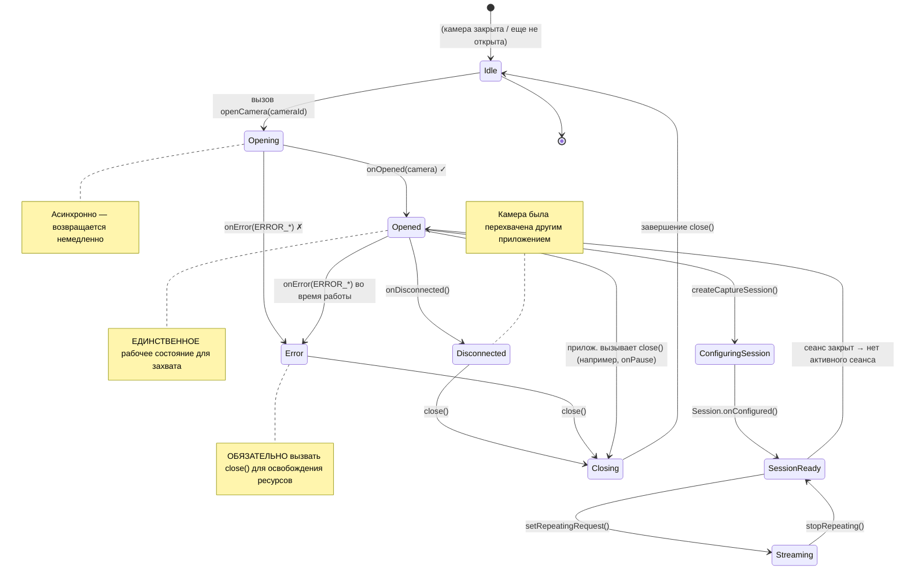

Вы перечислили все камеры на устройстве (глава 6) и определили ту, которую хотите использовать — обычно это основная задняя камера с самым высоким уровнем аппаратной поддержки. Следующий шаг — **открыть** эту камеру: установить активное низкоуровневое соединение с оборудованием камеры, чтобы иметь возможность настраивать сеансы захвата и отправлять запросы. Открытие камеры — это точка невозврата, в которой ваше приложение переходит от пассивного наблюдателя метаданных камеры к активному контроллеру реального оборудования.

Если вы хотите увидеть код жизненного цикла открытия/закрытия камеры промышленного уровня, изучите приложение **Android Camera Parameters** на [GitHub](https://github.com/zoozooll/AndroidCameraParameters). Его класс `Camera2Controller` инкапсулирует всё управление жизненным циклом `CameraDevice`, включая восстановление после ошибок, логику повторных попыток и синхронную очистку. Версия приложения в [Google Play](https://play.google.com/store/apps/details?id=com.minininja.cameraparams) установлена на тысячах устройств сотен различных производителей, поэтому обработанные в ней крайние случаи проверены в реальных условиях.

## Что такое CameraDevice?

`CameraDevice` — это класс Camera2, который представляет собой **активное, открытое соединение с конкретной физической (или логической) камерой на устройстве**. До открытия камеры вы можете только читать ее характеристики; после открытия вы можете:
- Создавать сеансы захвата `CameraCaptureSession` (глава 8).
- Отправлять запросы на захват `CaptureRequest` (главы 8 и 9).
- Читать динамические метаданные `CaptureResult` по мере поступления кадров.
- Сбрасывать ожидающие запросы, прерывать захват и закрывать устройство.

У `CameraDevice` есть два критических свойства:

1. **Это ресурс одного пользователя.** Только одно приложение (и внутри вашего приложения только один экземпляр `CameraDevice`) может держать данную камеру открытой одновременно. Если камеру затребует приложение с более высоким приоритетом (например, входящий видеозвонок), ваше приложение будет принудительно отключено.
2. **У него строгий жизненный цикл, управляемый обратными вызовами.** Вы не можете создать экземпляр `CameraDevice` с помощью конструктора. Единственный способ получить его — через `CameraManager.openCamera()`, который доставляет экземпляр асинхронно через `StateCallback`. Вы обязаны соблюдать каждый вызов перехода состояния.

Связь между `CameraManager`, идентификатором камеры и полученным `CameraDevice` выглядит так:

```
CameraManager.openCamera("0", callback, handler)
    │
    ├── Асинхронный вызов → возвращается немедленно
    │
    └───── В фоновом потоке (через Handler) ────→ StateCallback.onOpened(cameraDevice)
                                                          │
                                                          ▼
                                                  Теперь вы можете использовать cameraDevice для:
                                                  • createCaptureSession(...)
                                                  • createCaptureRequest(...)
```

## StateCallback: Машина жизненного цикла CameraDevice

`CameraDevice.StateCallback` — это абстрактный класс с тремя методами, которые вы **обязаны** реализовать. Каждая открытая камера в конечном итоге вызовет хотя бы один из этих методов (либо `onOpened`, а затем позже `onDisconnected`/`onError`, либо сразу `onError`, если открытие не удалось). Камеру нельзя использовать для захвата, пока не сработает `onOpened`.

### Три метода StateCallback

| Метод | Когда вызывается | Что делать |
|---|---|---|
| `onOpened(camera: CameraDevice)` | Камера успешно открыта и готова к использованию. | Сохраните ссылку на `camera` в переменной. Переходите к настройке сеанса захвата (глава 8). Освободите разрешение Semaphore, если вы его получили. |
| `onDisconnected(camera: CameraDevice)` | Камера была отобрана у вашего приложения (например, ее открыло другое приложение с более высоким приоритетом, пользователь перешел в другое приложение или политика устройства отключила камеру). | Немедленно вызовите `camera.close()`. Обнулите сохраненную ссылку. Камеру нельзя будет открыть повторно, пока ваше приложение снова не выйдет на передний план (в этот момент `onResume` повторит попытку). |
| `onError(camera: CameraDevice, error: Int)` | Произошла фатальная ошибка во время открытия или в процессе работы камеры. Параметр `error` является одной из констант `ERROR_*`, описанных ниже. | Вызовите `camera.close()`. Обнулите ссылку. В зависимости от кода ошибки либо покажите пользователю сообщение об ошибке, либо повторите попытку с экспоненциальной задержкой. Всегда освобождайте Semaphore. |

### Коды ошибок onError

Целое число `error` в `onError` соответствует пяти константам (определенным в `CameraDevice.StateCallback`):

| Константа | Значение | Значение | Восстановление |
|---|---|---|---|
| `ERROR_CAMERA_IN_USE` | `1` | Камера уже открыта другим приложением или системным сервисом камеры. | Автоматическое восстановление невозможно; ждите `onResume`, когда пользователь вернется в ваше приложение, и повторите попытку. |
| `ERROR_MAX_CAMERAS_IN_USE` | `2` | На устройстве достигнут предел одновременно открытых камер; вы превысили его, пытаясь открыть эту камеру (часто встречается на флагманах с множеством камер). | Закройте другие открытые экземпляры `CameraDevice`, которыми вы владеете, и повторите попытку. На устройствах с аппаратными ограничениями обычно одновременно могут работать только 2–3 камеры. |
| `ERROR_CAMERA_DISABLED` | `3` | Политика устройства (MDM, родительский контроль, режим киоска) отключила все камеры. | Покажите пользователю сообщение о неустранимой ошибке. Повторные попытки не помогут, пока политика не изменится. |
| `ERROR_CAMERA_DEVICE` | `4` | Аппаратное обеспечение или прошивка камеры столкнулись с неустранимой ошибкой. | Закройте устройство. Уведомите пользователя. На некоторых устройствах (при кратковременных сбоях прошивки) может помочь повторная попытка, поэтому одна или две попытки с задержкой будут разумными. |
| `ERROR_CAMERA_SERVICE` | `5` | Произошел сбой самого общесистемного сервиса камеры. Это сбой платформы, а не вашего приложения. | Закройте и обнулите всё. Обычно сервис камеры перезапускается автоматически через несколько секунд; вы можете повторить попытку после задержки или дождаться следующего `onResume`. |

Диаграмма состояний ниже фиксирует каждый валидный переход `CameraDevice` с момента вызова `openCamera()` до момента закрытия вами (или системой):



Важные выводы из диаграммы состояний:

1. **Opened — единственное рабочее состояние.** До срабатывания `onOpened` и после любой ошибки/отключения ссылка на `CameraDevice` должна считаться невалидной.
2. **Закрывайте в любом конечном состоянии.** Независимо от того, получили ли вы `onError`, `onDisconnected` или просто решили закрыть камеру превентивно в `onPause`, **всегда вызывайте `close()`**. Отсутствие вызова `close()` ведет к утечкам, которые не позволят **никакому** приложению (включая ваше) снова открыть камеру до тех пор, пока процесс не умрет или не перезапустится системный сервис.
3. **onError — это конец.** После `onError` данный конкретный экземпляр `CameraDevice` мертв. Не пытайтесь его реанимировать; закройте его, а затем попробуйте вызвать `openCamera()` заново, если считаете, что ошибка была временной.

## Интеграция жизненного цикла с Activity onPause/onResume

Жизненный цикл Activity в Android неразрывно связан с жизненным циклом `CameraDevice`. Оборудование камеры — это общий, энергоемкий ресурс; система агрессивно завершает работу приложений, которые удерживают камеры, находясь в фоновом режиме. Канонические правила таковы:

### Когда открывать камеру (onResume)

В методе `onResume` (после запуска фонового потока, как мы установили в главе 5):
1. Проверьте, предоставлены ли еще разрешения (пользователь мог отозвать их в настройках, пока приложение было в фоне).
2. Если `CameraDevice` уже открыт — всё в порядке.
3. Если `CameraDevice` не открыт, вызовите `openCamera()` с ID, который вы выбрали в главе 6.

### Когда закрывать камеру (onPause)

В методе `onPause` (до остановки фонового потока):
1. Если активен повторяющийся запрос (запущен предпросмотр — глава 8), остановите его с помощью `cameraCaptureSession.stopRepeating()`.
2. Если существует открытый сеанс захвата, закройте его с помощью `cameraCaptureSession.close()`.
3. Закройте сам `CameraDevice` с помощью `cameraDevice.close()`.
4. Обнулите все три ссылки (сеанс, устройство и билдер ожидающего запроса).
5. И только после этого остановите фоновый поток.

Если вы нарушите этот порядок (например, остановите поток **до** закрытия камеры), обратным вызовам, которые нужны методу `close()` для завершения, будет негде выполняться, и вы получите взаимные блокировки, ANR или предупреждения `Handler ... sending message to a Handler on a dead thread` в Logcat.

## Контроль параллелизма с помощью Semaphore

Существует тонкое состояние гонки, на котором спотыкаются даже опытные разработчики Camera2: **что если пользователь быстро переключается между приложениями, в результате чего `openCamera()` вызывается снова до того, как сработал асинхронный обратный вызов предыдущего открытия?**

Вы получите две параллельные попытки открытия одной и той же камеры. Системный сервис камеры может обслужить одну и отклонить другую с ошибкой `ERROR_CAMERA_IN_USE`, или он может отключить первую прямо в процессе открытия — в любом случае вашему коду обратных вызовов придется иметь дело с устаревшими ссылками и ошибками двойного закрытия.

Решением является **`Semaphore`**, инициализированный с 1 разрешением (бинарный замок / мутекс):

- Перед вызовом `openCamera()` получите разрешение (acquire). Если получение завершилось по таймауту — пропустите эту попытку открытия (предыдущая всё еще в процессе).
- В **каждом конечном обратном вызове** (`onOpened`, `onDisconnected`, `onError`) освобождайте разрешение (release).
- В `onPause`, после закрытия камеры, освободите разрешение еще раз для страховки, если оно было удержано.

Метод `Semaphore.tryAcquire(timeout, unit)` — правильный выбор: он блокирует выполнение максимум на `timeout` миллисекунд, а затем возвращает `false`, если разрешение не удалось получить. Никогда не используйте блокирующий `acquire()` без таймаута в главном потоке — это может привести к ANR.

## Обработка CameraAccessException

Метод `CameraManager.openCamera()` выбрасывает проверяемое исключение `CameraAccessException`. В отличие от кодов ошибок, доставляемых через `StateCallback.onError` (которые являются ошибками после открытия), эти исключения возникают **во время самой попытки открытия**, еще до существования объекта `CameraDevice`. Четыре наиболее распространенных кода причины:

| Причина (из `e.reason`) | Значение |
|---|---|
| `CAMERA_IN_USE` (`4`) | Аналогично версии в обратном вызове — камеру удерживает другое приложение. |
| `MAX_CAMERAS_IN_USE` (`5`) | Достигнут аппаратный лимит открытых камер. |
| `CAMERA_DISABLED` (`1`) | Отключено политикой (MDM / рабочий профиль). |
| `CAMERA_ERROR` (`3`) | Общий сбой оборудования во время открытия. |

Всегда оборачивайте `openCamera()` в блок try/catch для `CameraAccessException`, а также `IllegalArgumentException` (на случай, если ID камеры стал невалидным между перечислением в главе 6 и текущим моментом — например, была отключена внешняя USB-камера).

## Полный код на Kotlin: Открытие камеры

Ниже приведен полный код `MainActivity`, объединяющий всё из этой главы. Мы расширяем кодовую базу главы 6 методом `openCamera()`, полным `StateCallback`, контролем параллелизма на базе `Semaphore`, интеграцией с жизненным циклом Activity и исчерпывающей обработкой ошибок.

```kotlin
package com.example.camera2tutorial

import android.Manifest
import android.content.Context
import android.content.pm.PackageManager
import android.hardware.camera2.CameraAccessException
import android.hardware.camera2.CameraCharacteristics
import android.hardware.camera2.CameraDevice
import android.hardware.camera2.CameraManager
import android.hardware.camera2.CameraMetadata
import android.os.Bundle
import android.os.Handler
import android.os.HandlerThread
import android.util.Log
import android.widget.Toast
import androidx.appcompat.app.AppCompatActivity
import androidx.core.app.ActivityCompat
import androidx.core.content.ContextCompat
import java.util.concurrent.Semaphore
import java.util.concurrent.TimeUnit

class MainActivity : AppCompatActivity() {

    private lateinit var backgroundThread: HandlerThread
    private lateinit var backgroundHandler: Handler
    private lateinit var cameraManager: CameraManager

    // Предотвращение одновременного открытия нескольких камер
    private val cameraOpenCloseLock = Semaphore(1)

    // Активное открытое устройство камеры (может быть null)
    private var cameraDevice: CameraDevice? = null

    // Выбранный ID камеры (из шага обнаружения в главе 6)
    private var selectedCameraId: String? = null

    override fun onCreate(savedInstanceState: Bundle?) {
        super.onCreate(savedInstanceState)
        setContentView(R.layout.activity_main)

        if (allPermissionsGranted()) {
            initializeCameraManager()
        } else {
            ActivityCompat.requestPermissions(
                this,
                REQUIRED_PERMISSIONS,
                REQUEST_CODE_PERMISSIONS
            )
        }
    }

    override fun onResume() {
        super.onResume()
        startBackgroundThread()

        if (allPermissionsGranted()) {
            if (!this::cameraManager.isInitialized) {
                initializeCameraManager()
            }
            // Разрешение ОК, но камера еще не открыта → открываем сейчас
            if (cameraDevice == null && selectedCameraId != null) {
                openCamera(selectedCameraId!!)
            }
        } else {
            // Пользователь отозвал разрешения, пока приложение было в фоне
            ActivityCompat.requestPermissions(
                this,
                REQUIRED_PERMISSIONS,
                REQUEST_CODE_PERMISSIONS
            )
        }
    }

    override fun onPause() {
        closeCamera()
        stopBackgroundThread()
        super.onPause()
    }

    private fun startBackgroundThread() {
        backgroundThread = HandlerThread("Camera2Background").apply { start() }
        backgroundHandler = Handler(backgroundThread.looper)
    }

    private fun stopBackgroundThread() {
        backgroundThread.quitSafely()
        try {
            backgroundThread.join(1000)
        } catch (e: InterruptedException) {
            Log.e(TAG, "Прерывание во время ожидания завершения фонового потока", e)
        }
    }

    private fun initializeCameraManager() {
        cameraManager = getSystemService(Context.CAMERA_SERVICE) as CameraManager
        discoverCamerasAndSelectDefault()
    }

    // ----------------- Глава 6 (кратко): Обнаружение + выбор -----------------
    data class CameraInfo(val id: String, val lensFacing: Int?, val hardwareLevel: Int?)

    private fun discoverCamerasAndSelectDefault() {
        val cameraIds = try { cameraManager.cameraIdList } catch (_: CameraAccessException) { emptyArray() }
        val discovered = mutableListOf<CameraInfo>()
        for (id in cameraIds) {
            val chars = try { cameraManager.getCameraCharacteristics(id) } catch (_: Exception) { continue }
            discovered += CameraInfo(
                id,
                chars.get(CameraCharacteristics.LENS_FACING),
                chars.get(CameraCharacteristics.INFO_SUPPORTED_HARDWARE_LEVEL)
            )
        }
        // Предпочитаем заднюю камеру с самым высоким уровнем оборудования
        val backCandidates = discovered.filter { it.lensFacing == CameraCharacteristics.LENS_FACING_BACK }
            .sortedByDescending { it.hardwareLevel ?: -1 } // LEVEL_3 > FULL > LIMITED > LEGACY
        val frontCandidates = discovered.filter { it.lensFacing == CameraCharacteristics.LENS_FACING_FRONT }
            .sortedByDescending { it.hardwareLevel ?: -1 }

        selectedCameraId = (backCandidates + frontCandidates).firstOrNull()?.id
        Log.d(TAG, "Выбрана камера для открытия: ID=$selectedCameraId")

        // При первом запуске открываем немедленно, если поток готов
        if (selectedCameraId != null && this::backgroundHandler.isInitialized) {
            openCamera(selectedCameraId!!)
        }
    }

    // -------------------------------------------------------------------------
    // 🎯 ДОПОЛНЕНИЯ ГЛАВЫ 7: openCamera() + StateCallback + closeCamera()
    // -------------------------------------------------------------------------
    private val stateCallback = object : CameraDevice.StateCallback() {

        override fun onOpened(camera: CameraDevice) {
            // Разрешение было получено в openCamera(); освобождаем его теперь, когда открытие удалось
            cameraOpenCloseLock.release()
            cameraDevice = camera
            Log.d(TAG, "✅ Камера успешно открыта: ID=${camera.id}")
            Toast.makeText(
                this@MainActivity,
                "Камера ${camera.id} успешно открыта!",
                Toast.LENGTH_SHORT
            ).show()

            // TODO Глава 8: Здесь мы создадим CameraCaptureSession для предпросмотра.
            // А пока отпразднуем успешное открытие — у нас есть живой объект CameraDevice!
        }

        override fun onDisconnected(camera: CameraDevice) {
            cameraOpenCloseLock.release()
            Log.w(TAG, "⚠️ Камера отключена (перехвачена другим приложением): ID=${camera.id}")
            cameraDevice?.close()
            cameraDevice = null
        }

        override fun onError(camera: CameraDevice, error: Int) {
            cameraOpenCloseLock.release()
            Log.e(TAG, "❌ Ошибка камеры на ID=${camera.id}. Код=$error (${errorCodeToString(error)})")

            cameraDevice?.close()
            cameraDevice = null

            // Показ сообщения пользователю в зависимости от типа ошибки
            val userMsg = when (error) {
                ERROR_CAMERA_IN_USE ->
                    "Камера используется другим приложением. Закройте другие приложения и попробуйте снова."
                ERROR_MAX_CAMERAS_IN_USE ->
                    "Открыто слишком много камер. Это устройство ограничивает количество одновременно работающих камер."
                ERROR_CAMERA_DISABLED ->
                    "Камера отключена политикой устройства (родительский контроль, рабочий профиль и т. д.)."
                ERROR_CAMERA_DEVICE ->
                    "Произошла аппаратная ошибка камеры. Попробуйте перезагрузить устройство, если это повторится."
                ERROR_CAMERA_SERVICE ->
                    "Произошел сбой системного сервиса камеры. Пожалуйста, попробуйте еще раз через мгновение."
                else ->
                    "Произошла неизвестная ошибка камеры (код=$error)."
            }
            Toast.makeText(this@MainActivity, userMsg, Toast.LENGTH_LONG).show()
        }
    }

    private fun openCamera(cameraId: String) {
        if (ContextCompat.checkSelfPermission(this, Manifest.permission.CAMERA)
            != PackageManager.PERMISSION_GRANTED
        ) {
            Log.w(TAG, "openCamera пропущено: разрешение CAMERA не предоставлено")
            return
        }

        // ----- Получение семафора с таймаутом (2,5 секунды) во избежание блокировки -----
        val acquired = try {
            cameraOpenCloseLock.tryAcquire(2500, TimeUnit.MILLISECONDS)
        } catch (e: InterruptedException) {
            Log.e(TAG, "Прерывание во время ожидания блокировки открытия камеры", e)
            false
        }
        if (!acquired) {
            Log.e(TAG, "Таймаут ожидания блокировки камеры — другое открытие/закрытие в процессе")
            Toast.makeText(this, "Камера занята. Пожалуйста, попробуйте еще раз.", Toast.LENGTH_SHORT).show()
            return
        }

        try {
            Log.d(TAG, "Запрос на открытие камеры для ID=$cameraId")
            cameraManager.openCamera(
                cameraId,        // Какую камеру открыть
                stateCallback,   // Обратные вызовы жизненного цикла (onOpened, onDisconnected, onError)
                backgroundHandler// Поток/looper, где работают колбэки (НЕ главный поток!)
            )
        } catch (e: CameraAccessException) {
            Log.e(TAG, "CameraAccessException во время openCamera. Причина=${e.reason}", e)
            cameraOpenCloseLock.release() // Не удерживаем разрешение, если openCamera() выбросила исключение
            val msg = when (e.reason) {
                CameraAccessException.CAMERA_IN_USE -> "Камера используется другим приложением."
                CameraAccessException.MAX_CAMERAS_IN_USE -> "Сейчас открыто слишком много камер."
                CameraAccessException.CAMERA_DISABLED -> "Камера отключена политикой устройства."
                CameraAccessException.CAMERA_ERROR -> "Аппаратная ошибка камеры при открытии."
                else -> "Неизвестная CameraAccessException (причина=${e.reason})"
            }
            Toast.makeText(this, msg, Toast.LENGTH_LONG).show()
        } catch (e: IllegalArgumentException) {
            Log.e(TAG, "Неверный ID камеры: $cameraId", e)
            cameraOpenCloseLock.release()
            Toast.makeText(this, "Запрошенная камера больше не существует.", Toast.LENGTH_LONG).show()
        } catch (e: SecurityException) {
            Log.e(TAG, "SecurityException — разрешение на камеру отозвано в процессе вызова?", e)
            cameraOpenCloseLock.release()
        }
    }

    private fun closeCamera() {
        try {
            // Блокируем до получения разрешения (закрытие всегда должно побеждать в гонке)
            cameraOpenCloseLock.acquire()

            // Глава 8 TODO: сначала закрываем сеанс захвата, если он существует
            // captureSession?.close()
            // captureSession = null

            cameraDevice?.close()
            cameraDevice = null
            Log.d(TAG, "🔒 Камера закрыта, все ресурсы освобождены")
        } catch (e: InterruptedException) {
            Log.e(TAG, "Прерывание во время закрытия камеры", e)
        } finally {
            cameraOpenCloseLock.release() // Всегда освобождаем, даже если close() выбросил исключение
        }
    }

    // -------------------------------------------------------------------------
    // Помощники и работа с разрешениями
    // -------------------------------------------------------------------------
    private fun errorCodeToString(error: Int): String = when (error) {
        CameraDevice.StateCallback.ERROR_CAMERA_IN_USE -> "ERROR_CAMERA_IN_USE"
        CameraDevice.StateCallback.ERROR_MAX_CAMERAS_IN_USE -> "ERROR_MAX_CAMERAS_IN_USE"
        CameraDevice.StateCallback.ERROR_CAMERA_DISABLED -> "ERROR_CAMERA_DISABLED"
        CameraDevice.StateCallback.ERROR_CAMERA_DEVICE -> "ERROR_CAMERA_DEVICE"
        CameraDevice.StateCallback.ERROR_CAMERA_SERVICE -> "ERROR_CAMERA_SERVICE"
        else -> "UNKNOWN_ERROR"
    }

    companion object {
        private const val TAG = "Camera2Tutorial"
        private const val REQUEST_CODE_PERMISSIONS = 10
        private val REQUIRED_PERMISSIONS = arrayOf(Manifest.permission.CAMERA)
    }

    private fun allPermissionsGranted() = REQUIRED_PERMISSIONS.all {
        ContextCompat.checkSelfPermission(baseContext, it) == PackageManager.PERMISSION_GRANTED
    }

    override fun onRequestPermissionsResult(
        requestCode: Int,
        permissions: Array<out String>,
        grantResults: IntArray
    ) {
        super.onRequestPermissionsResult(requestCode, permissions, grantResults)
        if (requestCode == REQUEST_CODE_PERMISSIONS) {
            if (allPermissionsGranted()) {
                initializeCameraManager()
            } else {
                Toast.makeText(
                    this,
                    "Для использования этого приложения требуется разрешение на камеру.",
                    Toast.LENGTH_LONG
                ).show()
                finish()
            }
        }
    }
}
```

### Разбор логики Semaphore

Паттерн `Semaphore(1)` в приведенном выше коде предотвращает три типа ошибок:

1. **Гонка двойного открытия (onResume + onCreate оба вызывают openCamera)**: только один из вызовов получит разрешение; другой завершится по таймауту и корректно прекратит работу.
2. **Гонка открытия и закрытия (пользователь нажимает «домой», пока идет открытие)**: `closeCamera()` в `onPause` блокируется методом `acquire()` (без таймаута — закрытию всегда разрешено ждать) до тех пор, пока текущее открытие не завершится успехом или таймаутом. Затем разрешение снова освобождается в блоке `finally`.
3. **Утечка разрешения в путях ошибок**: каждый выход из `openCamera()` (успешный через `onOpened`, ошибка через `onError`, блоки catch исключений) освобождает разрешение. Если какой-то путь забудет это сделать, следующий вызов `openCamera` будет вечно висеть по таймауту — защитное освобождение в блоке `finally` метода `closeCamera` является страховкой.

### Почему `backgroundHandler` передается в `openCamera`

Третий аргумент `CameraManager.openCamera()` — это необязательный `Handler`, который указывает, в `Looper` какого потока должны выполняться методы `StateCallback`. Передача `null` означает использование обработчика главного потока — именно от этого мы предостерегали в главе 5. Передавая `backgroundHandler`, мы гарантируем, что:
- `onOpened`, `onDisconnected` и `onError` выполняются в выделенном потоке `Camera2Background`.
- Любая тяжелая работа (например, `createCaptureSession` в главе 8), которую мы запускаем из `onOpened`, также выполняется вне главного потока, предотвращая лаги интерфейса.

## Проверка: чего ожидать при запуске

При запуске кода главы 7 на физическом устройстве:

1. **Первый запуск (после предоставления разрешений)**:
   - В Logcat отображается `Выбрана камера для открытия: ID=0` → `Запрос на открытие камеры для ID=0` → короткая пауза → `✅ Камера успешно открыта: ID=0`.
   - Появляется Toast: *«Камера 0 успешно открыта!»*.
   - На данный момент оборудование камеры активно. Если вы держите телефон в руках, вы можете почувствовать, как модуль камеры слегка нагревается через несколько секунд (он включен, но еще не выдает кадры).

2. **Нажатие кнопки «Домой» (отправка приложения в фон)**:
   - Срабатывает `onPause` → в Logcat появляется `🔒 Камера закрыта, все ресурсы освобождены`.
   - Камера была чисто закрыта. Теперь система может передать ее другому приложению.

3. **Возврат в приложение**:
   - Срабатывает `onResume` → запускается поток → снова вызывается `openCamera` → снова `✅ Камера успешно открыта`.
   - Этот цикл (открытие → закрытие → открытие) должен быть мгновенным и надежным. Проверьте его более 10 раз подряд быстро, чтобы убедиться в отсутствии ANR.

4. **Стресс-тест: откройте другое приложение камеры, пока ваше работает**:
   - Пока ваше приложение показывает Toast об открытии камеры, нажмите «Домой», запустите стандартное приложение «Камера», а затем вернитесь в свое.
   - Когда вы уходите из своего приложения, срабатывает ваш метод `closeCamera()`. Если стандартная камера остается открытой, когда вы пытаетесь вернуться в свою, вы увидите `onDisconnected` или `ERROR_CAMERA_IN_USE` — это **правильное и ожидаемое поведение**, а не ошибки. Ваше приложение обрабатывает их корректно.

Релизная сборка приложения Android Camera Parameters ([Google Play](https://play.google.com/store/apps/details?id=com.minininja.cameraparams)) включает автоматические тесты на ANR, которые выполняют цикл `открытие/закрытие` 1000 раз подряд на всех основных семействах устройств; описанный здесь паттерн `Semaphore(1)` + `tryAcquire` — это именно то, что позволяет проходить эти тесты без единого ANR или взаимной блокировки.

## Устранение распространенных ошибок открытия

### `onError` с кодом `ERROR_CAMERA_IN_USE` срабатывает при каждой попытке

Чаще всего это происходит, когда:
- Вы используете эмулятор, в настройках которого камера AVD установлена в `Webcam0`, и при этом другое настольное приложение (Zoom, Teams, OBS, стандартное приложение Windows «Камера») использует веб-камеру ноутбука. Закройте все настольные приложения, использующие веб-камеру, и попробуйте снова.
- Ваше собственное приложение оставило утечку `CameraDevice` после предыдущего цикла установки. Удалите и заново установите приложение (что убьет процесс) или перезагрузите устройство.
- В некоторых кастомных прошивках есть известный баг, когда системный сервис камеры удерживает утекшую ссылку; помогает только перезагрузка устройства.

### `tryAcquire` завершается по таймауту при каждом вызове `openCamera`

Это означает, что разрешение никогда не освобождается. Проверьте все пути:
1. Каждый ли блок `catch` в `openCamera` освобождает разрешение?
2. Освобождают ли его все три обратных вызова (`onOpened`, `onDisconnected`, `onError`)?
3. Освобождается ли оно в блоке `finally` метода `closeCamera`?

Добавьте строки `Log.d` непосредственно до и после каждого вызова `acquire`/`release`, в сочетании с `cameraOpenCloseLock.availablePermits`, чтобы следить за количеством разрешений. Счетчик всегда должен быть равен `1`, когда камера закрыта, и `0`, когда идет процесс открытия.

### `Handler sending message to a Handler on a dead thread` после onPause

Это происходит, когда вы вызываете `stopBackgroundThread()` **до** метода `closeCamera()`. В правильном порядке из приведенного выше кода сначала выполняется `closeCamera()` (пока поток еще жив), а затем `stopBackgroundThread()`. Если в вашем коде порядок нарушен, поменяйте их местами.

## Резюме

В этой главе вы сделали важный шаг: включили оборудование камеры и получили живой, открытый объект `CameraDevice`. Вы узнали:

1. **Что представляет собой CameraDevice**: активное соединение с конкретным аппаратным блоком камеры с эксклюзивным правом отправлять ему запросы на захват.
2. **StateCallback и его три метода**: `onOpened` (камеру можно использовать), `onDisconnected` (камера была отобрана — немедленно закройте ее), `onError` (фатальная ошибка — закройте и покажите пользователю соответствующее сообщение для каждого из 5 кодов ошибок).
3. **Интеграция с жизненным циклом Activity**: канонические правила того, когда открывать (`onResume`, после запуска потока, после повторной проверки разрешений) и когда закрывать (`onPause`, до остановки потока, закрыть сеанс → закрыть устройство → обнулить ссылки → остановить поток).
4. **Контроль параллелизма через Semaphore**: как `Semaphore(1)` с методом `tryAcquire(2500 мс)` предотвращает гонку двойного открытия, гонку открытия против закрытия и утечки забытых разрешений; как разрешение освобождается в каждом конечном пути (обратные вызовы + блоки catch + finally метода close).
5. **Обработка CameraAccessException**: четыре причины исключений (`CAMERA_IN_USE`, `MAX_CAMERAS_IN_USE`, `CAMERA_DISABLED`, `CAMERA_ERROR`) и то, как представить каждую из них пользователю на понятном языке.

Троица `openCamera()` + `StateCallback` + `closeCamera()` — это основа любого промышленного приложения на Camera2. Освойте этот паттерн, и самая сложная операционная часть Camera2 останется позади.

## Что дальше

Открытого `CameraDevice` необходимо, но недостаточно для того, чтобы увидеть то, что видит камера. Чтобы фактически отобразить пиксели на экране, нам нужно подать кадры на поверхность отображения. В **главе 8: Показ предпросмотра камеры** вы:

- Разберетесь в концепции `Surface` как очереди буферов назначения изображений.
- Настроите `TextureView` с помощью `SurfaceTextureListener` для создания поверхности отображения.
- Будете использовать математику `Matrix` в `configureTransform` для исправления соотношения сторон предпросмотра и коррекции ориентации сенсора.
- Создадите `CaptureRequest.Builder` на основе шаблона `TEMPLATE_PREVIEW`, добавите `Surface` от TextureView в качестве цели и создадите `CameraCaptureSession`.
- Вызовете `setRepeatingRequest` в обратном вызове `onConfigured` сеанса, чтобы запустить непрерывную передачу кадров предпросмотра.

К концу главы 8 вы наконец-то увидите живое изображение с камеры на экране — заслуженная награда за всю инфраструктурную работу в главах 5–7!
