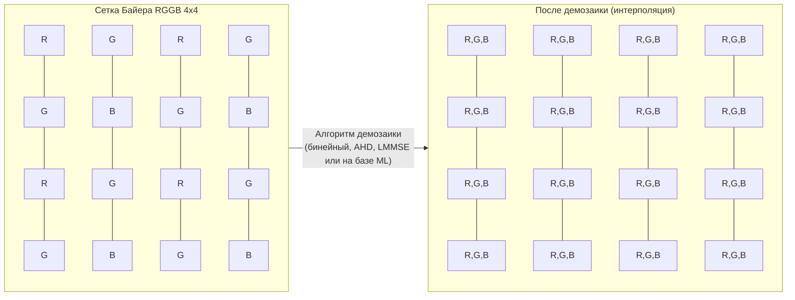
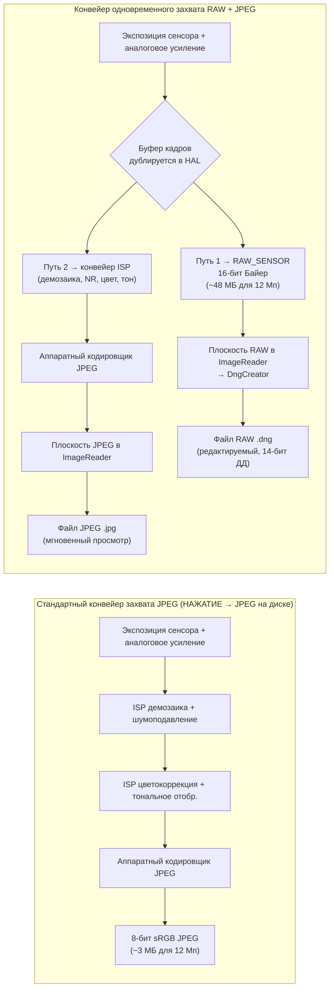

---     
sidebar_position: 18
title: "Глава 18: RAW фотография"
description: "Освойте формат RAW_SENSOR, создание DNG-файлов с помощью DngCreator, паттерны Байера и одновременный захват RAW+JPEG в API Android Camera2"
keywords: [Android Camera2, RAW фотография, RAW_SENSOR, DngCreator, DNG, паттерн Байера, RGGB, JPEG_R, метаданные камеры]
---

# Глава 18: RAW фотография

Профессиональная мобильная фотография требует большего, чем просто обработанные JPEG, которые ISP (Image Signal Processor) Android выдает по умолчанию. Когда вы делаете снимок в JPEG, сырые данные сенсора уже прошли через фильтрацию, интерполяцию, цветокоррекцию, шумоподавление и тональное отображение — это уничтожает большую часть запаса для редактирования, на который полагаются фотографы. API Camera2 дает вам прямой доступ к формату **RAW_SENSOR**: 16-битные необработанные данные в паттерне Байера непосредственно с сенсора, без вмешательства ISP. В сочетании с **DngCreator** фреймворк Android предоставляет всё необходимое для создания стандартных файлов Adobe DNG (Digital Negative), которые открываются напрямую в Lightroom, Capture One, Photoshop и любом профессиональном RAW-редакторе.

Эта глава основана на результатах исследований, зафиксированных в разделе «RAW / DngCreator» внутреннего справочника проекта, и дополняет их практическим кодом, который вы можете встроить в свое приложение. Вы можете увидеть эти возможности, перечисленные для каждого поддерживаемого устройства, в приложении [Android Camera Parameters](https://github.com/zoozooll/AndroidCameraParameters) (также доступно в [Google Play Store](https://play.google.com/store/apps/details?id=com.zoozooll.cameraparameters)), которое сообщает о максимальном размере RAW, доступных вариантах RAW (RAW10, RAW12, RAW14) и о том, полностью ли заполнены метаданные DngCreator для каждого ID камеры.

## Зачем нужен RAW? Цена обработки ISP

Прежде чем углубляться в детали API, критически важно понять, что именно делает ISP при создании JPEG и почему важно его обходить. Типичный конвейер ISP смартфона последовательно применяет следующие этапы:

1. **Фиксация уровня черного** — вычитание базового уровня темнового тока сенсора.
2. **Коррекция виньетирования** — устранение потемнения углов с помощью карт усиления для каждого пикселя.
3. **Демозаика** — интерполяция сетки Байера (1 цвет на пиксель) в полноценное RGB-изображение.
4. **Шумоподавление** — применение пространственной/временной фильтрации, которая стирает мелкие детали вместе с шумом.
5. **Цветокоррекция** — применение матрицы 3×3 для сопоставления цветового пространства сенсора с sRGB.
6. **Гамма / тональное отображение** — сжатие линейных 14 ступеней сцены в нелинейную 8-битную кривую.
7. **Повышение резкости** — компенсация оптического низкочастотного фильтра.
8. **Сжатие JPEG** — применение субдискретизации цветности (обычно 4:2:0) и квантования с потерями.

Проблема этого конвейера в том, что каждый этап **необратим** и настроен на *потребительский предпросмотр*, а не на *профессиональную постобработку*. JPEG ограничивает блики коэффициентом контрастности 100:1 и упаковывает 14 бит динамического диапазона сенсора в 8 бит — поэтому, когда вы поднимаете тени на 2 ступени при обработке, вы получаете постеризацию вместо деталей. RAW сохраняет весь линейный выход сенсора, позволяя восстанавливать 4–6 ступеней в тенях/светах и менять баланс белого без появления цветовых артефактов.

```mermaid
flowchart TD
    subgraph ISP["Конвейер обработки ISP (путь JPEG)"]
        S1[RAW данные сенсора] --> S2[Уровень черного]
        S2 --> S3[Коррекция виньетирования]
        S3 --> S4[Демозаика]
        S4 --> S5[Шумоподавление]
        S5 --> S6[Цветокоррекция]
        S6 --> S7[Гамма / Тональное отобр.]
        S7 --> S8[Повышение резкости]
        S8 --> S9[Сжатие JPEG]
        S9 --> S10["8-бит sRGB JPEG<br/>(≈6 стопов ДД)"]
    end

    subgraph RAW["Путь RAW (без обработки ISP)"]
        R1[RAW данные сенсора] --> R2["16-бит линейный Байер<br/>(10–14 стопов ДД)"]
        R2 --> R3["DngCreator записывает<br/>метаданные + пиксели"]
        R3 --> R4["Файл .dng<br/>для Lightroom/PS"]
    end
```



Сравните два пути визуально выше: путь JPEG отбрасывает данные на каждом шаге, в то время как путь RAW сохраняет все данные сенсора. Обратной стороной является то, что файлы RAW **нельзя отобразить напрямую** — они требуют отдельного этапа рендеринга («проявки» в Lightroom) для интерпретации сетки Байера и преобразования в цветовое пространство типа sRGB или Rec.2020.

## Цветовой фильтр Байера

Данные RAW — это не RGB. Каждая фотоячейка на сенсоре фиксирует только **один цвет** — красный, зеленый или синий — потому что сам кремниевый фотодиод не различает цвета и может измерять только количество фотонов (яркость). Чтобы восстановить цвет, производители наносят на сенсор **массив цветовых фильтров (CFA)**, и полученная одноканальная сетка названа в честь ее изобретателя: паттерн Байера.

В устройствах Android существует четыре распространенных макета CFA, определяемых порядком верхнего левого тайла 2×2:

| Паттерн | Макет тайла | Типичный случай использования |
|---------|-------------|------------------|
| **RGGB** | `R G / G B` | Большинство смартфонов (по умолчанию для Samsung, Sony Exmor RS) |
| **BGGR** | `B G / G R` | Сенсоры Sony IMX в некоторых устройствах Xiaomi/OnePlus |
| **GRBG** | `G R / B G` | Определенные сенсоры OmniVision |
| **GBRG** | `G B / R G` | Редко; встречается в некоторых устройствах Motorola среднего класса |

Самая поразительная особенность сетки Байера заключается в том, что **50% пикселей — зеленые**, а на красный и синий приходится по 25%. Это не произвольный выбор — пик яркостной чувствительности человеческого глаза приходится на зеленый спектр (около 555 нм), поэтому выделение в два раза большего количества выборок зеленому цвету максимизирует воспринимаемую резкость и минимизирует шум. Канал яркости в любом результирующем JPEG примерно на 60% формируется из зеленых фотоячеек, поэтому плотность выборок зеленого цвета напрямую влияет на детализацию.



Блок демозаики выше (P11–P44) показывает, как восстанавливается каждый пиксель: фотоячейка `R` использует значения соседних `G` и `B` посредством интерполяции, и наоборот. Эта интерполяция — самый большой источник размытия изображения в конвейере JPEG, и именно поэтому выгодно делать это самостоятельно на этапе постобработки, где современная демозаика на базе ИИ (Lightroom AI Enhance, Topaz DeNoise AI и т. д.) может обеспечить гораздо более резкие результаты, чем аппаратный ISP смартфона в реальном времени.

## Формат RAW_SENSOR и упакованные варианты (RAW10 / RAW12 / RAW14)

Каноническим идентификатором формата RAW в Android является `ImageFormat.RAW_SENSOR`, который представляется в виде 16-битного буфера на пиксель в `Plane`, возвращаемом `Image.getPlanes()`. Однако *эффективная* разрядность зависит от устройства и сообщается через `CameraCharacteristics.SENSOR_INFO_BIT_DEPTH` — старшие биты сверх фактического разрешения АЦП сенсора заполняются нулями.

Большинство современных смартфонов используют один из трех упакованных (packed) вариантов RAW, которые доступны через `StreamConfigurationMap.getOutputSizes()` со специальными константами формата:

| Константа формата | Бит на образец | Макет хранения | Типичное поколение сенсоров |
|-----------------|-------------|----------------|---------------------------|
| `RAW10`         | 10          | Упаковано: 4 образца на 5 байт (выравнено по MSB) | Сенсоры среднего класса 2019–2022 (напр., IMX586, IMX682) |
| `RAW12`         | 12          | Упаковано: 2 образца на 3 байта | Флагманы 2021–2024 (напр., IMX800, IMX989 1-дюймовый) |
| `RAW14`         | 14          | 16-бит с заполнением (выравнено по MSB) | Профессиональные сенсоры / 1 дюйм+ (IMX989 с DOL-HDR) |

Упакованные форматы являются причиной, по которой вы **обязаны использовать `Buffer.getByte()` / `Buffer.getShort()` с учетом шага пикселей**, а не рассматривать буфер RAW как простой массив `short[]` — образцы RAW10 и RAW12 пересекают границы байтов и требуют побитового сдвига для извлечения. `DngCreator` берет на себя всю упаковку/распаковку прозрачно, если вы передаете объект `Image` напрямую, что и является рекомендуемым подходом.

## DNG: Стандарт Adobe Digital Negative 1.4

Зачем записывать файлы `.dng` вместо проприетарного формата, такого как `.arw` (Sony) или `.cr3` (Canon)? Потому что **DNG — единственный универсальный формат RAW**, опубликованный как ISO 12234-2 и принимаемый всеми профессиональными инструментами для работы с фото. DNG v1.4 (версия, на которую ориентирован Android) определяет:

- TIFF/EP-совместимый контейнер (структура IFD с порядком байтов little-endian).
- Обязательные теги TIFF для паттерна CFA, уровней черного и цветовых матриц.
- Необязательные `ColorMatrix2` / `CalibrationIlluminant2` для профилей с двойным осветителем.
- Необязательную карту затенения линз (тег 0xC618) для коррекции виньетирования по каждому пикселю.
- Необязательный IFD "makernotes" для данных калибровки производителя.

Без этих метаданных буфер RAW — это просто сетка чисел без меток, которую ни один RAW-редактор не смог бы правильно отобразить. Класс `DngCreator` в пакете Android `android.hardware.camera2` специально создан для **автоматического заполнения всех необходимых метаданных DNG 1.4** на основе `CameraCharacteristics` и `CaptureResult`, что означает, что вашему приложению не нужно хранить данные калибровки сенсора для каждого устройства.

Конкретные поля метаданных, которые записывает `DngCreator`, включают:

| Тег DNG | Источник | Назначение |
|---------|--------|---------|
| **BlackLevel** (SENSOR_BLACK_LEVEL_PATTERN) | `CameraCharacteristics` | Базовый уровень темнового тока из 4 элементов для каждого канала. |
| **ColorMatrix1 / ColorMatrix2** (SENSOR_COLOR_TRANSFORM1 / 2) | `CameraCharacteristics` | Матрицы 3×3, сопоставляющие RGB сенсора → XYZ при осветителе A (D65). |
| **CalibrationIlluminant1 / 2** | `CameraCharacteristics` | Перечисление стандартных осветителей (17 = Стандарт A, 21 = D65). |
| **ForwardMatrix1 / ForwardMatrix2** (SENSOR_FORWARD_MATRIX1 / 2) | `CameraCharacteristics` | Обратное преобразование XYZ → RGB сенсора. |
| **NeutralColorPoint** (SENSOR_NEUTRAL_COLOR_POINT) | `CameraCharacteristics` | Нативный баланс белого (соотношения r/g, b/g). |
| **LensShadingMap** (STATISTICS_LENS_SHADING_MAP) | `CaptureResult` | Сетка усиления для 4 каналов для устранения виньетирования. |
| **CFA Pattern 2** | `CameraCharacteristics.SENSOR_INFO_COLOR_FILTER_ARRANGEMENT` | Кодирование байеровского тайла. |
| **BaselineExposure** | `SENSOR_REFERENCE_ILLUMINANT1` | Смещение экспозиции по умолчанию для применения при рендеринге. |

Этот список взят непосредственно из спецификации «RAW / DngCreator» исследовательского документа проекта. Если какое-либо из этих полей возвращается как `null` через API Camera2, `DngCreator` всё равно создаст валидный DNG, но полученный файл может потребовать ручной калибровки при обработке. Вы можете проверить, какие поля заполнены для каждого ID камеры, используя приложение Android Camera Parameters.

## Настройка одновременного захвата RAW + JPEG

Правильный рабочий процесс для захвата RAW использует **несколько целей вывода в одном `CaptureRequest`** — это гарантирует, что буфер RAW и JPEG получены из *одного и того же кадра* (идентичная временная метка, идентичная экспозиция сенсора), что важно для рабочих процессов RAW+JPEG, которых ожидает большинство фотографов. Попытка сделать два последовательных захвата вносит покадровую изменчивость в экспозицию, автофокус и баланс белого.

### Шаг 1: Проверка возможностей и максимального размера RAW

```kotlin
import android.hardware.camera2.CameraCharacteristics
import android.hardware.camera2.params.StreamConfigurationMap
import android.util.Size
import android.graphics.ImageFormat

fun getRawCapabilities(cameraId: String,
                       characteristics: CameraCharacteristics): Pair<Boolean, Size?> {
    val caps = characteristics.get(
        CameraCharacteristics.REQUEST_AVAILABLE_CAPABILITIES
    ) ?: intArrayOf()
    val supportsRaw = caps.contains(
        CameraCharacteristics.REQUEST_AVAILABLE_CAPABILITIES_RAW
    )
    if (!supportsRaw) return Pair(false, null)

    val configMap: StreamConfigurationMap? =
        characteristics.get(CameraCharacteristics.SCALER_STREAM_CONFIGURATION_MAP)

    val rawSizes = configMap?.getOutputSizes(ImageFormat.RAW_SENSOR)
        ?: emptyArray()
    val maxRawSize = rawSizes.maxByOrNull { it.width * it.height }

    return Pair(true, maxRawSize)
}
```

`REQUEST_AVAILABLE_CAPABILITIES_RAW` — обязательное условие. Если этот флаг не установлен, HAL отклонит любой вывод `RAW_SENSOR`, а попытка создать `ImageReader` с таким форматом вызовет `IllegalArgumentException`. Приложение Android Camera Parameters отображает эту возможность для каждого ID камеры на главном экране.

### Шаг 2: Создание двух ImageReader (RAW + JPEG)

```kotlin
import android.media.ImageReader
import android.graphics.ImageFormat

private var rawImageReader: ImageReader? = null
private var jpegImageReader: ImageReader? = null

fun setupDualImageReaders(rawSize: Size, jpegSize: Size) {
    rawImageReader = ImageReader.newInstance(
        rawSize.width,
        rawSize.height,
        ImageFormat.RAW_SENSOR,
        5 // Глубина буфера: >= 2, значение 5 дает запас для серийной съемки
    ).apply {
        setOnImageAvailableListener(
            OnRawImageAvailableListener(),
            backgroundHandler
        )
    }

    jpegImageReader = ImageReader.newInstance(
        jpegSize.width,
        jpegSize.height,
        ImageFormat.JPEG,
        2
    ).apply {
        setOnImageAvailableListener(
            OnJpegImageAvailableListener(),
            backgroundHandler
        )
    }
}
```

Глубина буфера `maxImages` для RAW должна быть больше (5), так как буферы RAW в 2–4 раза тяжелее JPEG, и HAL может доставить 2–3 кадра до того, как обработчик записи на диск успеет их сохранить. Нехватка места в буфере RAW приводит к незаметным пропускам кадров без вызова ошибок.

### Шаг 3: Создание CaptureSession с обеими поверхностями и запуск многоцелевого захвата

```kotlin
import android.hardware.camera2.CameraDevice
import android.hardware.camera2.CaptureRequest
import android.view.Surface

lateinit var cameraDevice: CameraDevice

fun createCaptureSessionAndCapture(
    rawSurface: Surface,
    jpegSurface: Surface,
    previewSurface: Surface
) {
    val outputSurfaces = listOf(previewSurface, rawSurface, jpegSurface)

    cameraDevice.createCaptureSession(
        outputSurfaces,
        object : CameraCaptureSession.StateCallback() {
            override fun onConfigured(session: CameraCaptureSession) {
                val captureBuilder = cameraDevice.createCaptureRequest(
                    CameraDevice.TEMPLATE_STILL_CAPTURE
                ).apply {
                    addTarget(previewSurface)
                    addTarget(rawSurface)
                    addTarget(jpegSurface)

                    set(CaptureRequest.CONTROL_AF_MODE,
                        CaptureRequest.CONTROL_AF_MODE_CONTINUOUS_PICTURE)
                    set(CaptureRequest.CONTROL_AE_MODE,
                        CaptureRequest.CONTROL_AE_MODE_ON)
                    set(CaptureRequest.CONTROL_AWB_MODE,
                        CaptureRequest.CONTROL_AWB_MODE_OFF) // Фиксируем баланс белого для RAW!
                }

                session.capture(
                    captureBuilder.build(),
                    RawCaptureCallback(),
                    backgroundHandler
                )
            }
            override fun onConfigureFailed(session: CameraCaptureSession) = Unit
        },
        backgroundHandler
    )
}
```

Три детали здесь не подлежат обсуждению:

1. **Баланс белого должен быть заблокирован (`CONTROL_AWB_MODE_OFF`) для захвата в RAW.** Если оставить AWB включенным, HAL применит усиление RGB в середине серии, что означает, что каждый кадр RAW будет иметь свой нативный баланс белого — это мешает RAW-редакторам применять единый профиль. Вместо этого используйте `CaptureResult.SENSOR_NEUTRAL_COLOR_POINT` для получения правильного WB при постобработке.

2. **Используйте `TEMPLATE_STILL_CAPTURE`** в качестве базового шаблона. Он настраивает сенсор на режим самого высокого качества и отключает специфическое для предпросмотра шумоподавление, которое иначе мог бы внедрить HAL.

3. **Все три цели (предпросмотр, RAW, JPEG) находятся в одном `CaptureRequest`.** HAL гарантирует доставку данных в один и тот же момент времени.

### Шаг 4: Использование DngCreator для записи файла DNG

Слушатель `OnImageAvailableListener` получает объекты `Image`, из которых уже доступны пиксельные данные RAW. Передайте `Image` *и* соответствующий `CaptureResult` в `DngCreator` вместе с оригинальным объектом `CameraCharacteristics` — эта комбинация необходима для правильного заполнения всех метаданных DNG 1.4.

```kotlin
import android.hardware.camera2.CameraCharacteristics
import android.hardware.camera2.CaptureResult
import android.hardware.camera2.DngCreator
import android.media.Image
import java.io.File
import java.io.FileOutputStream
import java.io.IOException

inner class OnRawImageAvailableListener : ImageReader.OnImageAvailableListener {
    private val pendingDngWrites =
        HashMap<Long, CaptureResult>() // timestamp → CaptureResult

    fun registerCaptureResult(timestamp: Long, result: CaptureResult) {
        pendingDngWrites[timestamp] = result
    }

    override fun onImageAvailable(reader: ImageReader) {
        var image: Image? = null
        try {
            image = reader.acquireLatestImage() ?: return
            val timestamp = image.timestamp

            val captureResult = pendingDngWrites.remove(timestamp) ?: return
            val characteristics = latestCameraCharacteristics ?: return

            val dngFile = File(
                getExternalFilesDir(null),
                "RAW_${System.currentTimeMillis()}.dng"
            )

            FileOutputStream(dngFile).use { fos ->
                val dngCreator = DngCreator(characteristics, captureResult)
                dngCreator.writeByteBuffer(
                    fos,
                    image.width,
                    image.height,
                    image.planes[0].buffer,
                    0 // отступ, всегда 0 для RAW_SENSOR
                )
            }

        } catch (e: IOException) {
            Log.e(TAG, "Не удалось записать файл DNG", e)
        } catch (e: IllegalStateException) {
            Log.e(TAG, "DngCreator отклонил метаданные (отсутствует обязательное поле)", e)
        } finally {
            image?.close() // КРИТИЧНО: НИКОГДА не допускайте утечки объектов Image
        }
    }
}
```

Конструктор `DngCreator` принимает ровно два аргумента:
- **`CameraCharacteristics`** — статические поля для конкретной камеры (уровни черного, цветовые матрицы, паттерн CFA, нейтральная точка цвета, осветители 1 и 2).
- **`CaptureResult`** — динамические поля для каждого кадра (экспозиция сенсора, ISO, карта затенения линз, положение линзы AF).

Если какой-либо из них равен `null` или если отсутствует обязательное поле метаданных (например, некоторые бюджетные устройства возвращают `null` для `SENSOR_COLOR_TRANSFORM1`), конструктор выдаст `IllegalArgumentException` (прямо при создании, а не при `writeByteBuffer`). Именно поэтому приложение Android Camera Parameters явно сообщает о каждом поле, важном для DNG: разработчики могут заранее отфильтровать устройства, чтобы избежать вылетов на устройствах с неполной реализацией HAL.

Карта `pendingDngWrites` с метками времени решает реальную проблему параллелизма: `CaptureResult.CaptureCallback.onCaptureCompleted()` срабатывает **до или после** `OnImageAvailableListener.onImageAvailable()` (зависит от HAL). Сопоставление по условию `image.timestamp` == `CaptureResult.SENSOR_TIMESTAMP` гарантирует, что правильные метаданные объединяются с правильным пиксельным буфером.

## Сравнение конвейеров обработки (детальная диаграмма Mermaid)



Ключевым моментом этой диаграммы является **узел дублирования кадров G**: HAL считывает один кадр с сенсора, а затем направляет немодифицированную копию на выход RAW, одновременно подавая *ту же самую* копию в ISP для кодирования JPEG. Это гарантирует паритет кадров без удвоения нагрузки на шину считывания сенсора.

## Соображения производительности и практические ограничения

Запись файлов DNG размером 12–48 МБ на флэш-память занимает ощутимое время:
- Память UFS 3.1: ~250 МБ/с последовательная запись → DNG 12 Мп (~48 МБ) записывается ~190 мс.
- Память eMMC 5.1: ~120 МБ/с последовательная запись → тот же файл записывается ~400 мс.

Это означает, что вы **не можете блокировать поток пользовательского интерфейса операциями записи DNG** — всегда запускайте `writeByteBuffer` в фоновом потоке или через Handler и всегда закрывайте `Image` в блоке `finally`, чтобы избежать нехватки буферов в HAL.

Еще одно важное ограничение: не все устройства поддерживают RAW + JPEG в одном сеансе, даже если установлен флаг `CAPABILITIES_RAW`. Правильный способ проверки — `StreamConfigurationMap.isOutputSupportedFor(surfaceList)` с обоими поверхностями в списке. Если этот метод возвращает `false`, используйте сеансы только с RAW.

## Резюме

В этой главе был рассмотрен полный цикл работы с RAW в Android Camera2:

- **Формат RAW_SENSOR** выдает необработанную 16-битную сетку Байера прямо с сенсора, обходя все этапы обработки ISP.
- **Паттерны Байера** (RGGB, BGGR, GRBG, GBRG) выделяют 50% фотоячеек под зеленый цвет для оптимизации разрешения яркости под человеческое зрение.
- **Упакованные варианты** — RAW10, RAW12, RAW14 — хранят образцы с нативной разрядностью АЦП; DngCreator распаковывает их прозрачно.
- **DNG v1.4** — универсальный контейнер для RAW. Вызов `DngCreator(characteristics, result).writeByteBuffer(...)` заполняет все необходимые метаданные: уровни черного, цветовые матрицы, карту затенения линз, нейтральную точку цвета и осветители калибровки 1 и 2.
- **Многоцелевые CaptureRequest** направляют один и тот же кадр в ImageReader для RAW и JPEG, гарантируя их идентичность.
- **Сопоставление меток времени** между `CaptureResult` и `Image` необходимо, так как обратные вызовы срабатывают в порядке, зависящем от HAL.

## Что дальше

В следующей главе мы перейдем от фотосъемки к видео в **Главе 19: Скоростное видео**, где мы будем использовать `CameraConstrainedHighSpeedCaptureSession` для захвата со скоростью 120 кадров в секунду (замедление в 4 раза) и 240 кадров в секунду (замедление в 8 раз). Вы узнаете, почему для скоростных сеансов требуется `createHighSpeedRequestList` вместо отдельных запросов CaptureRequest, и как выделенный скоростной конвейер HAL обходит обычный путь предпросмотра для обеспечения частоты кадров, которая иначе была бы непомерно высокой для процессора.

Вы можете проверить возможности RAW вашего устройства, максимальный размер RAW и полноту метаданных DngCreator, установив приложение [Android Camera Parameters](https://play.google.com/store/apps/details?id=com.zoozooll.cameraparameters), и внести свой вклад в отчеты об устройствах в [репозитории GitHub](https://github.com/zoozooll/AndroidCameraParameters), чтобы помочь другим разработчикам узнать, какие устройства поддерживают профессиональные рабочие процессы с RAW.
