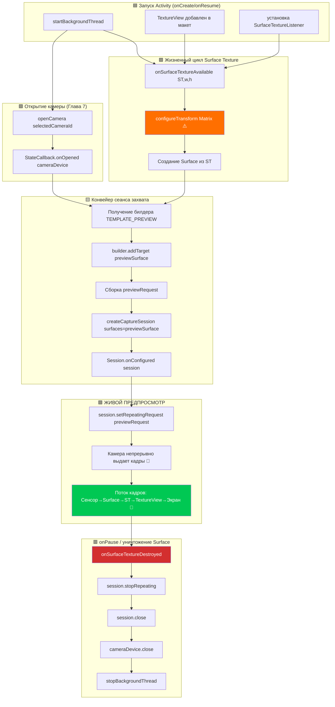

Это глава, которую вы так долго ждали. После трех глав создания фундамента (разрешения, многопоточность, CameraManager, перечисление, жизненный цикл открытия/закрытия) вы наконец-то **увидите вывод камеры в реальном времени на экране устройства Android**. Предпросмотр — это душа приложения камеры; именно на него смотрит пользователь, чтобы выстроить кадр, проверить фокус и экспозицию перед нажатием на кнопку затвора. Правильная реализация предпросмотра — это то, что отличает тормознутое, неудобное приложение от отполированного и отзывчивого инструмента.

Для ознакомления с эталонной реализацией предпросмотра, обрабатывающей крайние случаи на сотнях устройств, изучите экран предпросмотра в приложении **Android Camera Parameters** ([GitHub](https://github.com/zoozooll/AndroidCameraParameters) / [Google Play](https://play.google.com/store/apps/details?id=com.minininja.cameraparams)). Его конвейер предпросмотра включает преобразования с учетом ориентации, поверхности вывода с разным разрешением и плавное ограничение частоты кадров — всё это построено на тех же фундаментальных компонентах, которые мы рассматриваем здесь.

## Конвейер предпросмотра: обзор компонентов

Прежде чем переходить к коду, давайте проследим концептуальный путь одного кадра предпросмотра от сенсора камеры до дисплея телефона. Каждый кадр проходит через пять уровней:

```
Сенсор камеры → Конвейер CameraDevice → Surface (BufferQueue) → SurfaceTexture → TextureView → Дисплей
```

Каждый уровень играет свою специфическую, незаменяемую роль. Пропуск или сокращение любого из них приводит к черному экрану, искаженному соотношению сторон или разрывам изображения. Дадим определение каждому компоненту:

### 1. Surface — Буфер назначения изображения

`Surface` — это универсальная концепция API Camera2 для **места назначения обработанных кадров изображения**. «Под капотом» Surface оборачивает Android `BufferQueue`: кольцевой буфер графических буферов (обычно глубиной 3–5 буферов), управляемый системным компоновщиком (SurfaceFlinger). Когда Camera2 «отрисовывает кадр» на Surface, она извлекает пустой буфер из очереди, заполняет его данными пикселей и ставит обратно в очередь для использования потребителем.

Всё, что может потреблять графические буферы, может предоставлять `Surface`. Наиболее распространенными потребителями являются:
- **SurfaceTexture** → питает `TextureView` (для предпросмотра на экране — эта глава).
- **Surface от MediaRecorder/MediaCodec** → кодирование видео (не рассматривается в этой серии).
- **Surface от ImageReader** → доступные процессору объекты `Image` для захвата JPEG/RAW (глава 9).

### 2. SurfaceTexture — Мост между GPU

`SurfaceTexture` — это магический класс, который превращает сырой поток кадров камеры в текстуру, которую GPU может сэмплировать и отрисовывать. Он является потребительской стороной BufferQueue поверхности, но вместо того чтобы передавать буферы процессору, он преобразует их в текстуру OpenGL ES `GL_TEXTURE_EXTERNAL_OES`. Это позволяет `TextureView` компоновать кадр камеры в иерархию представлений (View), используя стандартный рендеринг через GPU — копирование процессором не требуется, поэтому предпросмотр со скоростью 60+ FPS легко достижим.

Вы получаете `Surface` для `SurfaceTexture` с помощью:
```kotlin
val surface = Surface(surfaceTexture)
```

### 3. TextureView — Окно на экране

`TextureView` — это подкласс `View`, который может отображать содержимое `SurfaceTexture`. Это современный преемник более старого `SurfaceView` и рекомендуемый выбор для предпросмотра в Camera2 по трем причинам:
- Он ведет себя как обычный View (его можно анимировать, трансформировать, применять прозрачность, помещать в прокручиваемые контейнеры).
- Он не заставляет Activity использовать прозрачное окно (в отличие от SurfaceView, который пробивает «дыру» в иерархии представлений).
- Его `SurfaceTextureListener` предоставляет точные обратные вызовы для моментов создания, уничтожения или изменения размера поверхности.

Чтобы получить доступ к базовому SurfaceTexture через обратные вызовы, `TextureView` предоставляет метод `setSurfaceTextureListener()` с четырьмя колбэками:
- `onSurfaceTextureAvailable(surfaceTexture, width, height)` — поверхность готова к приему кадров (срабатывает один раз при компоновке View).
- `onSurfaceTextureSizeChanged(surfaceTexture, width, height)` — размер поверхности изменился (например, устройство повернули).
- `onSurfaceTextureDestroyed(surfaceTexture)` — поверхность скоро будет уничтожена; мы должны остановить предпросмотр до возврата из этого метода.
- `onSurfaceTextureUpdated(surfaceTexture)` — срабатывает для **каждого нового кадра** (можно использовать для наложения рамок распознавания лиц и т. д.).

### 4. CameraCaptureSession — Настроенный конвейер

Прежде чем `CameraDevice` сможет выдавать какие-либо кадры, вы должны создать сеанс захвата — `CameraCaptureSession`. Сеанс — это **конфигурация всех выходных поверхностей Surface, в которые будет записывать конвейер камеры**. Это можно представить как «прокладку труб» от процессора сигналов изображения камеры (ISP) к одному или нескольким приемникам. Для предпросмотра сеанс имеет одну Surface (от TextureView). Когда мы добавим захват фото в главе 9, в сеансе будет две поверхности: предпросмотр + `ImageReader`.

Основные правила:
- Сеанс создается с помощью `CameraDevice.createCaptureSession(outputSurfaces, stateCallback, handler)`.
- Сеанс можно использовать только **после** срабатывания `StateCallback.onConfigured(session)`.
- У `CameraDevice` может быть только **один активный сеанс одновременно**. Создание нового сеанса закрывает предыдущий.
- Сеанс владеет *всеми* выходами на протяжении своего времени жизни; добавление новой поверхности (например, если вы вдруг решили записать видео) требует закрытия старого сеанса и создания нового со всеми поверхностями (предпросмотр + рекордер).

### 5. Повторяющийся запрос захвата (TEMPLATE_PREVIEW)

Как происходит непрерывный предпросмотр после настройки сеанса? Camera2 — это API, управляемое запросами: каждый кадр — это запрос `CaptureRequest`, отправленный в сеанс. Для предпросмотра мы отправляем **один запрос и помечаем его как повторяющийся**: оборудование камеры будет непрерывно выполнять этот запрос (с теми же настройками сенсора, целями и состоянием 3A), выдавая кадры так быстро, как позволяет конвейер (обычно 30–120 FPS).

Повторяющийся запрос отправляется с помощью:
```kotlin
session.setRepeatingRequest(previewRequest, captureCallback, backgroundHandler)
```

Шаблоном для предпросмотра является `CameraDevice.TEMPLATE_PREVIEW`. Camera2 предоставляет несколько готовых шаблонов, которые соответствующим образом настраивают сотни низкоуровневых параметров (экспозиция, диапазон частоты кадров, режим 3A, шумоподавление и т. д.) для конкретного случая использования. Для предпросмотра `TEMPLATE_PREVIEW` оптимизирует **низкую задержку и плавную частоту кадров**, даже если это означает небольшое снижение динамического диапазона сенсора по сравнению с `TEMPLATE_STILL_CAPTURE` (используется в главе 9 для фото).

## Схема процесса предпросмотра

На блок-схеме ниже показано, как соединяются все эти компоненты. Внимательно следите за ней при чтении кода — каждый блок соответствует реальному вызову функции.



Оранжевый блок (`configureTransform`) и зеленый блок (ЖИВОЙ ПРЕДПРОСМОТР) — два самых критических шага. Пропустите `configureTransform`, и ваш предпросмотр будет растянут, повернут или сплющен. Правильно подключите всё остальное, но забудьте вызвать `setRepeatingRequest`, и экран останется черным без каких-либо ошибок в логах.

## Шаг 1: Добавление TextureView в XML-макет

Сначала создайте или обновите файл `app/src/main/res/layout/activity_main.xml`, включив в него полноэкранный `TextureView`. Также добавим `TextView` поверх для индикации статуса, чтобы мы могли видеть размер предпросмотра.

```xml
<?xml version="1.0" encoding="utf-8"?>
<FrameLayout xmlns:android="http://schemas.android.com/apk/res/android"
    android:layout_width="match_parent"
    android:layout_height="match_parent">

    <TextureView
        android:id="@+id/textureView"
        android:layout_width="match_parent"
        android:layout_height="match_parent"
        android:layout_gravity="center" />

    <TextView
        android:id="@+id/statusTextView"
        android:layout_width="wrap_content"
        android:layout_height="wrap_content"
        android:layout_gravity="top|center_horizontal"
        android:layout_marginTop="16dp"
        android:background="#80000000"
        android:padding="8dp"
        android:textColor="#FFFFFFFF"
        android:textSize="12sp"
        tools:text="Инициализация камеры..." />

</FrameLayout>
```

Почему в качестве корня выбран `FrameLayout`? Потому что предпросмотр — это полноэкранный слой, а `FrameLayout` накладывает дочерние элементы друг на друга по оси Z (последние элементы рисуются сверху). Позже мы добавим кнопку затвора поверх. `TextureView` использует `match_parent` для обоих измерений — но не волнуйтесь, ниже мы будем использовать `configureTransform`, чтобы правильно вписать изображение, так что сами пиксели никогда не будут растянуты, даже если представление заполняет весь экран.

## Шаг 2: configureTransform — секрет правильного соотношения сторон

Если вы ничего не предпримете и просто направите кадры в полноэкранный TextureView, предпросмотр будет **растянут**. Почему? Потому что сенсоры камер имеют фиксированное соотношение сторон (почти всегда 4:3 для фото, иногда 16:9 для видео), а дисплей телефона имеет другое соотношение (часто ~20:9 на современных флагманах). Если камера выдает кадр предпросмотра 4032×3024 (4:3), а TextureView растягивает его до 1080×2400 (20:9), лица выглядят худыми и вытянутыми.

Решением является метод **`configureTransform(viewWidth: Int, viewHeight: Int)`**, который вычисляет матрицу `Matrix` (поворот + масштабирование с обрезкой по центру) и применяет ее к TextureView. Матрица делает три вещи:
1. **Поворачивает** изображение на количество градусов, на которое устройство повернуто относительно естественной ориентации сенсора камеры.
2. **Масштабирует** изображение так, чтобы оно полностью заполняло TextureView, сохраняя при этом соотношение сторон (в стиле center-crop; при желании можно сделать letterbox с черными полосами).
3. **Центрирует** масштабированное и повернутое изображение посередине представления.

Это самая копируемая функция из официальных примеров Android Camera2 — она нужна каждому разработчику, и в ней легко ошибиться. Вот ее каноническая версия:

```kotlin
/**
 * Настраивает необходимую трансформацию Matrix для `textureView`.
 * Этот метод следует вызывать после определения размера предпросмотра камеры
 * и фиксации размера `textureView`.
 *
 * @param viewWidth  Ширина `textureView`
 * @param viewHeight Высота `textureView`
 * @param previewSize Выбранный камерой размер предпросмотра (width, height)
 * @param sensorOrientationDegrees Характеристика SENSOR_ORIENTATION камеры
 * @param deviceDisplayRotationDegrees Поворот дисплея устройства (0/90/180/270) относительно естественного
 */
private fun configureTransform(
    viewWidth: Int,
    viewHeight: Int,
    previewSize: android.util.Size,
    sensorOrientationDegrees: Int,
    deviceDisplayRotationDegrees: Int
) {
    val rotation = when (deviceDisplayRotationDegrees) {
        android.view.Surface.ROTATION_0 -> 0
        android.view.Surface.ROTATION_90 -> 90
        android.view.Surface.ROTATION_180 -> 180
        android.view.Surface.ROTATION_270 -> 270
        else -> return
    }

    val matrix = android.graphics.Matrix()
    val viewRect = android.graphics.RectF(0f, 0f, viewWidth.toFloat(), viewHeight.toFloat())
    val bufferRect = android.graphics.RectF(
        0f,
        0f,
        previewSize.height.toFloat(),
        previewSize.width.toFloat()
    )
    val centerX = viewRect.centerX()
    val centerY = viewRect.centerY()

    // Шаг 1: Учет поворота устройства относительно ориентации сенсора
    if (Surface.ROTATION_90 == rotation || Surface.ROTATION_270 == rotation) {
        bufferRect.offset(centerX - bufferRect.centerX(), centerY - bufferRect.centerY())
        matrix.setRectToRect(viewRect, bufferRect, android.graphics.Matrix.ScaleToFit.FILL)
        val scale = maxOf(
            viewHeight.toFloat() / previewSize.height,
            viewWidth.toFloat() / previewSize.width
        )
         Paradis.postScale(scale, scale, centerX, centerY)
        matrix.postRotate(
            (90 * (rotation - 2)).toFloat(),
            centerX,
            centerY
        )
    } else if (Surface.ROTATION_180 == rotation) {
        matrix.postRotate(180f, centerX, centerY)
    }

    // Шаг 2: Также учитываем, как сенсор установлен относительно устройства
    val relativeRotation = (sensorOrientationDegrees - rotation + 360) % 360
    if (relativeRotation != 0) {
        matrix.postRotate(relativeRotation.toFloat(), centerX, centerY)
    }

    textureView.setTransform(matrix)
}
```

Важная деталь: `previewSize` — это выходной размер камеры, сообщаемый как (ширина, высота) в **ориентации сенсора**. Размеры TextureView указаны в **ориентации дисплея**. Прием с RectF и переставленными шириной/высотой (`bufferRect` использует `previewSize.height` для ширины и наоборот) учитывает этот переворот координат между сенсором и дисплеем.

Для вызова этой функции вам понадобятся две части информации из CameraCharacteristics:
- `SENSOR_ORIENTATION` — на сколько градусов сенсор повернут относительно естественной ориентации устройства. Для задних камер это почти всегда 90°. Для передних камер — обычно 270° (чтобы изображение зеркалировалось правильно). Считывайте это один раз для каждой камеры на этапе обнаружения.
- Поворот дисплея — из `(getSystemService(Context.WINDOW_SERVICE) as WindowManager).defaultDisplay.rotation` (в новых API используйте `display?.rotation`).

## Шаг 3: Выбор размера предпросмотра из SCALER_STREAM_CONFIGURATION_MAP

Прежде чем писать `configureTransform` или создавать сеанс, нам нужно узнать, какой размер предпросмотра может выдать камера. Для каждой камеры `CameraCharacteristics.SCALER_STREAM_CONFIGURATION_MAP` возвращает `StreamConfigurationMap`, содержащий все валидные пары (формат, размер), которые может производить камера. Для предпросмотра на `SurfaceTexture` мы запрашиваем выходные размеры для класса `SurfaceTexture::class.java`:

```kotlin
private fun chooseOptimalPreviewSize(
    characteristics: CameraCharacteristics,
    maxWidth: Int,
    maxHeight: Int,
    targetAspectRatio: Double
): android.util.Size {
    val map = characteristics.get(CameraCharacteristics.SCALER_STREAM_CONFIGURATION_MAP)
        ?: throw IllegalStateException("Карта конфигурации потоков недоступна")

    // Все размеры, поддерживаемые для вывода SurfaceTexture (класс предпросмотра)
    val choices = map.getOutputSizes(SurfaceTexture::class.java).toList()

    // Предпочтение отдается размерам, соответствующим соотношению сторон, 
    // затем тем, которые вписываются в максимальные габариты, 
    // и, наконец, выбирается самый большой (лучшее качество) среди оставшихся.
    val acceptable = choices.filter {
        it.width <= maxWidth
            && it.height <= maxHeight
            && Math.abs(it.width.toDouble() / it.height - targetAspectRatio) < 0.02
    }

    val chosen = acceptable.ifEmpty { choices }
        .maxByOrNull { it.width * it.height }!!

    Log.d(TAG, "Выбран размер предпросмотра: ${chosen.width}x${chosen.height} " +
        "(из ${choices.size} вариантов, макс. допустимый=${maxWidth}x${maxHeight})")
    return chosen
}
```

Разумные параметры по умолчанию: `maxWidth = 1920`, `maxHeight = 1080`, `targetAspectRatio = textureView.width.toDouble() / textureView.height`. Поверхности предпросмотра не нужно разрешение 4K — 1080p вполне достаточно для компоновки кадра на экране телефона, при этом тратится меньше энергии и задержка конвейера остается низкой.

## Шаг 4: Полный код главы 8 — Живой предпросмотр

Вот полный файл `MainActivity.kt`, объединяющий все части этой главы: `TextureView` на основе макета, `SurfaceTextureListener`, выбор размера, `configureTransform`, создание `CameraCaptureSession` и важнейший вызов `setRepeatingRequest(TEMPLATE_PREVIEW)`.

```kotlin
package com.example.camera2tutorial

import android.Manifest
import android.content.Context
import android.content.pm.PackageManager
import android.graphics.Matrix
import android.graphics.RectF
import android.graphics.SurfaceTexture
import android.hardware.camera2.CameraAccessException
import android.hardware.camera2.CameraCharacteristics
import android.hardware.camera2.CameraCaptureSession
import android.hardware.camera2.CameraDevice
import android.hardware.camera2.CameraManager
import android.hardware.camera2.CaptureRequest
import android.hardware.camera2.params.StreamConfigurationMap
import android.os.Bundle
import android.os.Handler
import android.os.HandlerThread
import android.util.Log
import android.util.Size
import android.view.Surface
import android.view.TextureView
import android.view.WindowManager
import android.widget.TextView
import android.widget.Toast
import androidx.appcompat.app.AppCompatActivity
import androidx.core.app.ActivityCompat
import androidx.core.content.ContextCompat
import java.util.Collections
import java.util.concurrent.Semaphore
import java.util.concurrent.TimeUnit
import kotlin.math.max

class MainActivity : AppCompatActivity() {

    // Интерфейс
    private lateinit var textureView: TextureView
    private lateinit var statusTextView: TextView

    // Потоки
    private lateinit var backgroundThread: HandlerThread
    private lateinit var backgroundHandler: Handler

    // Камера
    private lateinit var cameraManager: CameraManager
    private var cameraDevice: CameraDevice? = null
    private var captureSession: CameraCaptureSession? = null
    private var previewRequestBuilder: CaptureRequest.Builder? = null
    private var previewRequest: CaptureRequest? = null
    private var selectedCameraId: String? = null
    private var sensorOrientation = 0
    private lateinit var previewSize: Size

    private val cameraOpenCloseLock = Semaphore(1)

    // ------------------------- Жизненный цикл -------------------------
    override fun onCreate(savedInstanceState: Bundle?) {
        super.onCreate(savedInstanceState)
        setContentView(R.layout.activity_main)

        textureView = findViewById(R.id.textureView)
        statusTextView = findViewById(R.id.statusTextView)
        statusTextView.text = "Ожидание компоновки TextureView..."

        if (allPermissionsGranted()) {
            initializeCameraManager()
        } else {
            ActivityCompat.requestPermissions(
                this, REQUIRED_PERMISSIONS, REQUEST_CODE_PERMISSIONS
            )
        }
    }

    override fun onResume() {
        super.onResume()
        startBackgroundThread()

        if (allPermissionsGranted()) {
            if (!this::cameraManager.isInitialized) initializeCameraManager()
            // Если texture view уже доступен, открываем камеру и создаем сеанс сейчас
            if (textureView.isAvailable) {
                openCameraAndStartPreview(textureView.width, textureView.height)
            }
        } else {
            ActivityCompat.requestPermissions(
                this, REQUIRED_PERMISSIONS, REQUEST_CODE_PERMISSIONS
            )
        }
    }

    override fun onPause() {
        closeCameraAndPreview()
        stopBackgroundThread()
        super.onPause()
    }

    private fun startBackgroundThread() {
        backgroundThread = HandlerThread("Camera2Background").apply { start() }
        backgroundHandler = Handler(backgroundThread.looper)
    }

    private fun stopBackgroundThread() {
        backgroundThread.quitSafely()
        try { backgroundThread.join(1000) } catch (_: InterruptedException) {}
    }

    // ------------------------- Глава 6 (кратко): Обнаружение -------------------------
    data class CameraInfo(val id: String, val facing: Int?, val hwLevel: Int?, val chars: CameraCharacteristics)

    private fun initializeCameraManager() {
        cameraManager = getSystemService(Context.CAMERA_SERVICE) as CameraManager
        val discovered = mutableListOf<CameraInfo>()
        for (id in cameraManager.cameraIdList) {
            val chars = try { cameraManager.getCameraCharacteristics(id) } catch (_: Exception) { continue }
            discovered += CameraInfo(
                id,
                chars.get(CameraCharacteristics.LENS_FACING),
                chars.get(CameraCharacteristics.INFO_SUPPORTED_HARDWARE_LEVEL),
                chars
            )
        }
        val chosen = discovered
            .sortedWith(
                compareByDescending<CameraInfo> { it.facing == CameraCharacteristics.LENS_FACING_BACK }
                    .thenByDescending { it.hwLevel ?: -1 }
            )
            .first()
        selectedCameraId = chosen.id
        sensorOrientation = chosen.chars.get(CameraCharacteristics.SENSOR_ORIENTATION) ?: 90

        Log.d(TAG, "Выбрана камера id=$selectedCameraId, sensorOrientation=$sensorOrientation°")

        // Подключаем слушателя SurfaceTexture — он запустит фактический предпросмотр
        textureView.surfaceTextureListener = object : TextureView.SurfaceTextureListener {
            override fun onSurfaceTextureAvailable(st: SurfaceTexture, width: Int, height: Int) {
                Log.d(TAG, "✅ SurfaceTexture доступен: ${width}x$height")
                statusTextView.text = "SurfaceTexture готов — открытие камеры..."
                openCameraAndStartPreview(width, height)
            }
            override fun onSurfaceTextureSizeChanged(st: SurfaceTexture, w: Int, h: Int) {
                if (this@MainActivity::previewSize.isInitialized) {
                    configureTransform(w, h)
                }
            }
            override fun onSurfaceTextureDestroyed(st: SurfaceTexture): Boolean {
                Log.d(TAG, "⛔ SurfaceTexture уничтожен")
                return true
            }
            override fun onSurfaceTextureUpdated(st: SurfaceTexture) {
                // Вызывается для КАЖДОГО кадра. Держите объем работы здесь <1мс.
            }
        }
    }

    // ------------------------- Глава 7 (кратко): openCamera -------------------------
    private val deviceStateCallback = object : CameraDevice.StateCallback() {
        override fun onOpened(camera: CameraDevice) {
            cameraOpenCloseLock.release()
            cameraDevice = camera
            Log.d(TAG, "✅ Камера ${camera.id} открыта → создание сеанса захвата")
            statusTextView.text = "Камера открыта — создание сеанса..."

            // ⬇️ Глава 8: С открытой камерой И доступным SurfaceTexture создаем сеанс
            createCaptureSession()
        }
        override fun onDisconnected(camera: CameraDevice) {
            cameraOpenCloseLock.release()
            cameraDevice?.close()
            cameraDevice = null
            Log.w(TAG, "Камера ${camera.id} отключена")
        }
        override fun onError(camera: CameraDevice, error: Int) {
            cameraOpenCloseLock.release()
            cameraDevice?.close()
            cameraDevice = null
            val msg = when (error) {
                ERROR_CAMERA_IN_USE -> "Камера используется другим приложением"
                else -> "Ошибка камеры $error"
            }
            Toast.makeText(this@MainActivity, msg, Toast.LENGTH_LONG).show()
        }
    }

    // ------------------------- 🎯 ГЛАВА 8: Конвейер предпросмотра -------------------------
    private fun openCameraAndStartPreview(viewWidth: Int, viewHeight: Int) {
        val camId = selectedCameraId ?: return
        if (ContextCompat.checkSelfPermission(this, Manifest.permission.CAMERA)
            != PackageManager.PERMISSION_GRANTED) return
        if (!cameraOpenCloseLock.tryAcquire(2500, TimeUnit.MILLISECONDS)) {
            Toast.makeText(this, "Таймаут блокировки камеры", Toast.LENGTH_SHORT).show()
            return
        }

        // 1) Определение размера предпросмотра ДО открытия сеанса
        val chars = cameraManager.getCameraCharacteristics(camId)
        previewSize = chooseOptimalPreviewSize(chars, viewWidth, viewHeight)

        // 2) Применение трансформации коррекции аспектов к TextureView
        configureTransform(viewWidth, viewHeight)

        // 3) Настройка размера буфера SurfaceTexture в соответствии с выбранным размером
        textureView.surfaceTexture!!.setDefaultBufferSize(previewSize.width, previewSize.height)

        statusTextView.text = "Размер предпросмотра: ${previewSize.width}×${previewSize.height}"

        // 4) Открытие камеры — создание сеанса продолжится в onOpened → createCaptureSession()
        try {
            cameraManager.openCamera(camId, deviceStateCallback, backgroundHandler)
        } catch (e: CameraAccessException) {
            cameraOpenCloseLock.release()
            Toast.makeText(this, "Не удалось открыть камеру: ${e.reason}", Toast.LENGTH_LONG).show()
        }
    }

    /**
     * Создание CameraCaptureSession, единственной выходной поверхностью которой является 
     * поверхность предпросмотра TextureView. Затем создание запроса TEMPLATE_PREVIEW и запуск потока.
     */
    private fun createCaptureSession() {
        val camera = cameraDevice ?: return
        val texture = textureView.surfaceTexture ?: return

        val previewSurface = Surface(texture)
        val outputSurfaces = Collections.singletonList(previewSurface)

        try {
            // Однократное создание билдера запроса TEMPLATE_PREVIEW
            previewRequestBuilder =
                camera.createCaptureRequest(CameraDevice.TEMPLATE_PREVIEW).apply {
                    addTarget(previewSurface)
                }

            // Создание сеанса захвата
            camera.createCaptureSession(
                outputSurfaces,
                object : CameraCaptureSession.StateCallback() {
                    override fun onConfigured(session: CameraCaptureSession) {
                        captureSession = session
                        previewRequest = previewRequestBuilder!!.build()
                        Log.d(TAG, "✅ CaptureSession настроен → запуск повторяющегося предпросмотра")
                        statusTextView.text = "🎥 ЖИВОЙ ПРЕДПРОСМОТР: ${previewSize.width}×${previewSize.height}"

                        // ⭐ МАГИЧЕСКАЯ СТРОКА, ЗАПУСКАЮЩАЯ ПРЕДПРОСМОТР:
                        session.setRepeatingRequest(
                            previewRequest!!,
                            null,  // CaptureCallback не нужен для предпросмотра
                            backgroundHandler
                        )
                    }

                    override fun onConfigureFailed(session: CameraCaptureSession) {
                        Log.e(TAG, "❌ Настройка CaptureSession НЕ УДАЛАСЬ")
                        Toast.makeText(
                            this@MainActivity,
                            "Сбой сеанса захвата — предпросмотр недоступен",
                            Toast.LENGTH_LONG
                        ).show()
                    }

                    override fun onClosed(session: CameraCaptureSession) {
                        if (captureSession === session) captureSession = null
                    }
                },
                backgroundHandler
            )
        } catch (e: CameraAccessException) {
            Log.e(TAG, "createCaptureSession выбросил CameraAccessException", e)
        } catch (e: IllegalStateException) {
            Log.e(TAG, "Камера была закрыта во время создания сеанса", e)
        }
    }

    /**
     * Выбор наибольшего размера предпросмотра, который соответствует соотношению сторон
     * и вписывается в заданные максимальные размеры.
     */
    private fun chooseOptimalPreviewSize(
        characteristics: CameraCharacteristics,
        viewWidth: Int,
        viewHeight: Int
    ): Size {
        val map: StreamConfigurationMap =
            characteristics.get(CameraCharacteristics.SCALER_STREAM_CONFIGURATION_MAP)
                ?: throw IllegalStateException("StreamConfigurationMap недоступен")

        val viewAspect = max(viewWidth, viewHeight).toDouble() / min(viewWidth, viewHeight)
        val choices = map.getOutputSizes(SurfaceTexture::class.java).toList()

        // Разумный верхний предел для предпросмотра — нет смысла в потоке 4K
        val maxPreviewPixels = 1920 * 1080

        val aspectMatches = choices.filter {
            val szAspect = max(it.width, it.height).toDouble() / min(it.width, it.height)
            kotlin.math.abs(szAspect - viewAspect) < 0.02
                && (it.width * it.height) <= maxPreviewPixels * 2
        }

        val final = aspectMatches.ifEmpty { choices }
            .sortedByDescending { it.width * it.height }
            .first()

        Log.d(TAG, "Выбор размера предпросмотра: ${final.width}×${final.height} " +
            "(из ${choices.size} вариантов, целевой аспект=%.2f)".format(viewAspect))
        return final
    }

    /**
     * Применяет Matrix к TextureView, чтобы пиксели предпросмотра отображались с правильным 
     * соотношением сторон (без растяжения) и правильной ориентацией (без поворота).
     */
    private fun configureTransform(viewWidth: Int, viewHeight: Int) {
        if (!this::previewSize.isInitialized) return
        val rotation = (getSystemService(Context.WINDOW_SERVICE) as WindowManager)
            .defaultDisplay.rotation
        val matrix = Matrix()
        val viewRect = RectF(0f, 0f, viewWidth.toFloat(), viewHeight.toFloat())
        val bufferRect = RectF(
            0f, 0f,
            previewSize.height.toFloat(),
            previewSize.width.toFloat()
        )
        val cx = viewRect.centerX()
        val cy = viewRect.centerY()
        bufferRect.offset(cx - bufferRect.centerX(), cy - bufferRect.centerY())
        matrix.setRectToRect(viewRect, bufferRect, Matrix.ScaleToFit.FILL)
        val scale = max(
            viewHeight.toFloat() / previewSize.height,
            viewWidth.toFloat() / previewSize.width
        )
        matrix.postScale(scale, scale, cx, cy)
        val rotationDegrees = when (rotation) {
            Surface.ROTATION_0 -> sensorOrientation
            Surface.ROTATION_90 -> 0
            Surface.ROTATION_180 -> 360 - sensorOrientation
            Surface.ROTATION_270 -> 180
            else -> 0
        }
        matrix.postRotate(rotationDegrees.toFloat(), cx, cy)
        textureView.setTransform(matrix)
        Log.d(TAG, "configureTransform применен (поворот=$rotationDegrees°, масштаб=%.2f)".format(scale))
    }

    // ------------------------- Завершение -------------------------
    private fun closeCameraAndPreview() {
        try {
            cameraOpenCloseLock.acquire()

            captureSession?.apply {
                try {
                    stopRepeating()
                    abortCaptures()
                } catch (_: CameraAccessException) {}
                close()
            }
            captureSession = null

            cameraDevice?.close()
            cameraDevice = null

            Log.d(TAG, "🔒 Предпросмотр и камера полностью выключены")
        } catch (_: InterruptedException) {
        } finally {
            cameraOpenCloseLock.release()
        }
    }

    // ------------------------- Служебное -------------------------
    companion object {
        private const val TAG = "Camera2Tutorial"
        private const val REQUEST_CODE_PERMISSIONS = 10
        private val REQUIRED_PERMISSIONS = arrayOf(Manifest.permission.CAMERA)
    }

    private fun allPermissionsGranted() = REQUIRED_PERMISSIONS.all {
        ContextCompat.checkSelfPermission(baseContext, it) == PackageManager.PERMISSION_GRANTED
    }

    override fun onRequestPermissionsResult(
        requestCode: Int, permissions: Array<out String>, grantResults: IntArray
    ) {
        super.onRequestPermissionsResult(requestCode, permissions, grantResults)
        if (requestCode == REQUEST_CODE_PERMISSIONS) {
            if (allPermissionsGranted()) {
                initializeCameraManager()
            } else {
                Toast.makeText(this, "Требуется разрешение на камеру", Toast.LENGTH_LONG).show()
                finish()
            }
        }
    }
}
```

### 5 строк, которые действительно запускают предпросмотр

Из более чем 350 строк кода инфраструктуры всего **пять последовательных операторов** в приведенном выше коде отвечают за фактическое появление кадров на экране:

```kotlin
// Строка A: Создание запроса TEMPLATE_PREVIEW для поверхности предпросмотра
previewRequestBuilder = camera.createCaptureRequest(CameraDevice.TEMPLATE_PREVIEW).apply {
    addTarget(previewSurface)
}

// Строка B: Создание сеанса захвата с поверхностью предпросмотра в качестве выхода
camera.createCaptureSession(outputSurfaces, object : CameraCaptureSession.StateCallback() {
    override fun onConfigured(session: CameraCaptureSession) {
        // Строка C: Сборка неизменяемого CaptureRequest из билдера
        previewRequest = previewRequestBuilder!!.build()
        // Строка D: ⭐ Запуск непрерывного повторяющегося потока кадров предпросмотра
        session.setRepeatingRequest(previewRequest!!, null, backgroundHandler)
    }
}, backgroundHandler)
```

Пропустите `addTarget(previewSurface)`, и сеанс не будет знать, куда отправлять кадры, что приведет к черному экрану. Пропустите `setRepeatingRequest`, и камера будет ждать команды на захват, которая никогда не поступит — также черный экран. Ошибитесь с шаблоном билдера (`TEMPLATE_STILL_CAPTURE` вместо `TEMPLATE_PREVIEW`), и кадры предпросмотра будут приходить со скоростью 5 FPS. Все пять строк (плюс `configureTransform` для аспекта) должны быть верными.

## Проверка: как выглядит успех

При запуске приложения главы 8 на физическом устройстве вы должны наблюдать следующее поведение:

1. **Заставка (0 с)**: Статус показывает *«Ожидание компоновки TextureView...»* — View раздувается из XML.
2. **SurfaceTexture готов (~0,1 с)**: Статус обновляется на *«SurfaceTexture готов — открытие камеры...»*. Сработал обратный вызов `onSurfaceTextureAvailable`.
3. **Камера открыта (~0,5 с)**: Статус меняется на *«Камера открыта — создание сеанса...»*. В Logcat появляются строки о выборе `previewSize` и применении `configureTransform`.
4. **Сеанс настроен (~0,7 с)**: Статус меняется на **🎥 ЖИВОЙ ПРЕДПРОСМОТР: 1920×1080**, и **вы видите изображение с камеры на экране**! Оно плавное (30–60 FPS), правильно ориентировано, и соотношение сторон выглядит естественно.
5. **Нажатие «Домой» / уход в фон**: Logcat показывает `🔒 Предпросмотр и камера полностью выключены`. При возвращении предпросмотр возобновляется мгновенно.
6. **Поворот в ландшафтный режим**: Срабатывает `onSurfaceTextureSizeChanged`, `configureTransform` перезапускается с новыми размерами, и предпросмотр корректно центрируется без сбоев.

Если вы не видите изображения, последовательно проверьте пять строк запуска выше и убедитесь, что `setDefaultBufferSize` был вызван для `SurfaceTexture` до создания сеанса. Этот шаг (`textureView.surfaceTexture!!.setDefaultBufferSize(previewSize.width, previewSize.height)`) является **незаметной точкой отказа**: забудьте о нем, и некоторые устройства будут выдавать черные кадры без каких-либо сообщений об ошибках.

## Устранение неполадок с предпросмотром

### Черный экран, в Logcat нет ошибок

Это самая частая и раздражающая ошибка главы 8. Проверьте по порядку:

1. **Вызван ли `setDefaultBufferSize`?** Он должен быть вызван с ТЕМИ ЖЕ значениями `previewSize.width/height`, которые использует сеанс, ДО создания сеанса.
2. **Выполнился ли `addTarget(previewSurface)`?** Выведите в лог список целей на `previewRequestBuilder` прямо перед вызовом `.build()`.
3. **Сработал ли на самом деле `setRepeatingRequest`?** Добавьте `CaptureCallback` (замените `null` на обратный вызов, логирующий `onCaptureStarted`) и посмотрите, производятся ли кадры. Если `onCaptureStarted` никогда не срабатывает, сеанс не стал активным — вернитесь к проверке `onConfigured` против `onConfigureFailed`.
4. **Установлено ли `hardwareAccelerated="true"` для Activity?** (Требование главы 2.) Если нет, TextureView молча не отрисовывается.

### Предпросмотр перевернут или повернут на 90°

Ваша функция `configureTransform` некорректна. Добавьте отладочный лог для `rotationDegrees` внутри `configureTransform` и сравните его с `sensorOrientation`. Распространенная ошибка: применение поворота сенсора и поворота устройства в неправильном порядке. На устройствах Pixel задние сенсоры повернуты на 90° от естественного положения; на некоторых устройствах Samsung — на 270°. Всегда читайте `SENSOR_ORIENTATION`, а не прописывайте его жестко.

### Предпросмотр выглядит растянутым (лица вытянуты или сплюснуты)

Это означает, что `configureTransform` сработал, но неправильно выполнил масштабирование. Выведите в лог `viewAspect`, финальный выбранный аспект `previewSize` и переменную `scale`. Масштаб должен быть >1.0 (center-crop) или &lt;1.0 (letterbox с полосами). Если масштаб равен ровно 1.0, а соотношения сторон не совпадают, вы растягиваете пиксели для заполнения.

### Предпросмотр тормозит (ощущается как 5–10 FPS)

Проверьте две вещи:
1. **Используемый шаблон**: `TEMPLATE_STILL_CAPTURE` работает с частотой кадров фотосъемки (низкой). Вы обязаны использовать `TEMPLATE_PREVIEW`.
2. **Размер предпросмотра**: Выбрал ли `chooseOptimalPreviewSize` предпросмотр 4K (3840×2160)? Это в ~8 раз больше пикселей, чем в 1080p, и это убьет частоту кадров на бюджетных устройствах. Добавьте ограничение `maxPreviewPixels`, как показано в коде выше.

## Резюме

Эта глава стала наградой за всю работу по созданию инфраструктуры. Теперь у вас есть рабочее приложение с предпросмотром камеры. Вы узнали:

1. **Пять компонентов конвейера предпросмотра**: `Surface` (очередь буферов), `SurfaceTexture` (преобразование в текстуру GPU), `TextureView` (экранное отображение), `CameraCaptureSession` (соединение всех выходов) и повторяющийся запрос `TEMPLATE_PREVIEW` (непрерывная генерация кадров).
2. **TextureView + SurfaceTextureListener**: Как настроить полноэкранный TextureView через XML-макет, использовать `onSurfaceTextureAvailable`, чтобы узнать о готовности поверхности GPU, и подключить `onSurfaceTextureSizeChanged` для изменения размера/ориентации на лету.
3. **Выбор размера предпросмотра**: Как читать `SCALER_STREAM_CONFIGURATION_MAP`, запрашивать `getOutputSizes(SurfaceTexture::class.java)` и выбирать наибольший размер, соответствующий аспекту View, с потолком в 1080p для экономии энергии и низкой задержки.
4. **configureTransform**: Каноническая матрица коррекции аспектов, которая поворачивает кадры предпросмотра в соответствии с ориентацией устройства и масштабирует их с обрезкой по центру, чтобы избежать растяжения. Почему ширина и высота меняются местами между Rect буфера и Rect представления.
5. **CameraCaptureSession + setRepeatingRequest**: Создание билдера запроса `TEMPLATE_PREVIEW`, вызов `addTarget(previewSurface)`, создание сеанса и вызов `session.setRepeatingRequest()` в методе `onConfigured` — единственная строка, которая фактически запускает поток кадров.

Приложение Android Camera Parameters в [Google Play](https://play.google.com/store/apps/details?id=com.minininja.cameraparams) использует прямого потомка именно этого конвейера предпросмотра. Его система оверлеев (показывающая состояние 3A, ISO, выдержку, положение линзы для каждого кадра) построена поверх параметра CaptureCallback, который вы передали как `null` — кадры предпросмотра продолжают идти, а мы «подсматриваем» метаданные, не прерывая поток.

## Что дальше

Живой предпросмотр — это отличная демо-версия, но это не **приложение** камеры, пока вы не сможете сделать и сохранить фото. В **главе 9: Съемка фотографий** мы:

1. Познакомимся с `ImageReader` в формате JPEG — доступным процессору приемником для высококачественных неподвижных кадров.
2. Узнаем, как устанавливать качество сжатия JPEG и управлять глубиной очереди буферов `maxImages`.
3. Пройдем по пути триггера precapture AE (автоэкспозиции): остановка повторения → запуск триггера AE → ожидание схождения AE → захват фото → сохранение байтов → разблокировка AE → возобновление предпросмотра.
4. Реализуем сохранение фотографий, совместимое со Scoped Storage, через `MediaStore` на Android 10+ и прямой `FileOutputStream` на старых версиях, не забывая закрывать `Image` во избежание нехватки буферов.
5. Добавим цепочку `CaptureCallback` с отслеживанием состояния каждого захвата, чтобы ожидание precapture было корректным.

К концу главы 9 ваш учебный проект станет **реальным приложением камеры**: нажал кнопку, услышал затвор и нашел свое фото в папке Pictures на устройстве. Затем вы сможете сравнить качество вывода с приложением Android Camera Parameters ([GitHub](https://github.com/zoozooll/AndroidCameraParameters)), чтобы увидеть, какую разницу дает ручное управление!
