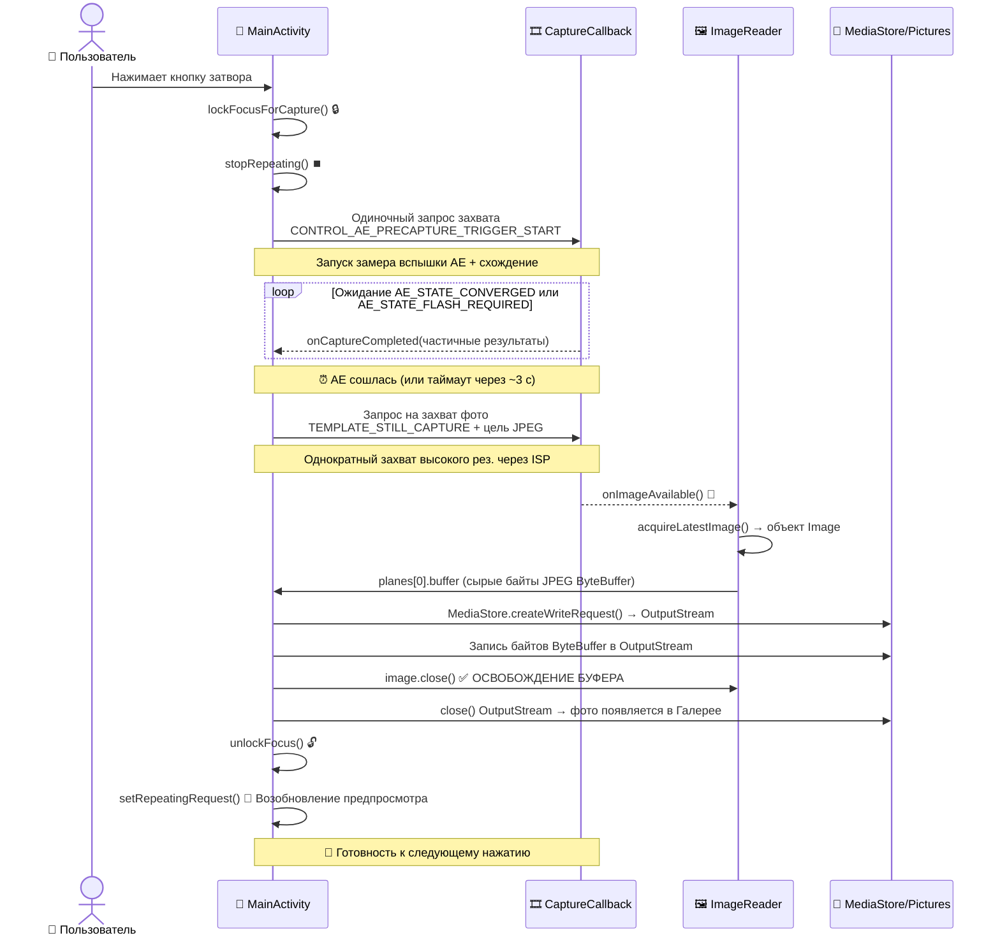

Поздравляем с переходом к финальной главе второй части! Если вы следовали инструкциям начиная с главы 5, в вашем приложении теперь есть: обработка разрешений, выделенный фоновый поток, перечисление камер с помощью `CameraCharacteristics`, надежное управление жизненным циклом через `Semaphore` и плавный, правильно ориентированный живой предпросмотр через `TextureView`. Чего не хватает? **Возможности нажать на кнопку и сохранить фото**. Именно это дает данная глава.

К концу этой главы ваш учебный проект станет полноценным приложением камеры: при нажатии на затвор приложение ненадолго «заморозит» предпросмотр (как и должно быть для очистки конвейера), будет сделан снимок с правильным схождением автоэкспозиции, он будет сохранен в общую папку Pictures устройства с правильными метаданными ориентации EXIF, и предпросмотр возобновится автоматически. После этого вы сможете открыть фото в Google Photos или приложении Android Camera Parameters ([GitHub](https://github.com/zoozooll/AndroidCameraParameters), [Google Play](https://play.google.com/store/apps/details?id=com.minininja.cameraparams)), чтобы проверить данные EXIF, разрешение и качество.

Режим ручного захвата в приложении Android Camera Parameters использует более продвинутую версию конвейера, который мы построим в этой главе: он выполняет серийную съемку нескольких кадров с настраиваемыми для каждого кадра ISO, выдержкой и положением линзы — но всё это строится на тех же основах `ImageReader` + `CaptureCallback`, которые вы изучите здесь.

## Почему сделать фото сложнее, чем показать предпросмотр

На первый взгляд, «просто захватить кадр» кажется легкой задачей — у нас уже есть 60 кадров предпросмотра в секунду, почему мы не можем взять один из них? Ответ заключается в том, что кадры предпросмотра и фотографии — это принципиально разные выходные данные:

1. **Разница в разрешении**: предпросмотр имеет разрешение около 1–2 Мп (1080p). Фотография должна использовать **максимальное** разрешение сенсора (часто 50+ Мп на современных флагманах). Вы же не хотите фото 2 Мп, если ваш телефон может выдать 50 Мп.
2. **Разница в экспозиции**: `TEMPLATE_PREVIEW` оптимизирует частоту кадров для низкой задержки. `TEMPLATE_STILL_CAPTURE` оптимизирует динамический диапазон, шумоподавление и точность цветопередачи — кадру фотографии нужна обработка ISP самого высокого качества, которую может обеспечить конвейер.
3. **Схождение 3A**: перед тем как сделать фото, алгоритму автоэкспозиции (AE) камеры нужно сказать: «мы собираемся сделать снимок — зафиксируй текущую сцену, сведи параметры экспозиции, баланса белого и фокуса и включи вспышку, если нужно». Это последовательность **триггера precapture**. Если ее пропустить, фотографии могут получиться переэкспонированными или недоэкспонированными относительно того, что показывал предпросмотр.
4. **Хранилище и Scoped Storage**: кадр предпросмотра никогда не сохраняется. Фотография должна быть записана на диск в виде валидного JPEG-файла, проиндексирована в MediaStore, чтобы галереи могли ее видеть, а на Android 10+ это должно использовать API Scoped Storage (никаких произвольных записей через `File` в `/sdcard/DCIM/`).

Захват фото — это **многоэтапный асинхронный конечный автомат**, а не один вызов. На диаграмме последовательности ниже показан точный порядок и тайминги, которые вы должны реализовать. Не пропускайте ни одного шага.



Время срабатывания триггера precapture критически важно: он должен быть отправлен ДО захвата фотографии, и вы должны дождаться схождения AE (или наступления таймаута) перед тем, как делать снимок. Если вы пропустите ожидание, фото будет использовать настройки экспозиции предпросмотра, которые могут быть настроены на высокую частоту кадров, а не на качество фотографии.

## Знакомство с ImageReader: приемник кадров для процессора

В главе 8 мы направляли кадры предпросмотра в `SurfaceTexture` (приемник GPU). Для захвата фото нам нужен приемник, доступный процессору (CPU), чтобы мы могли записать байты JPEG на диск. Этим приемником является `ImageReader`.

`ImageReader` создается следующим образом:
```kotlin
val imageReader = ImageReader.newInstance(
    width,           // Ширина кадра фото (макс. размер из характеристик)
    height,          // Высота кадра фото
    ImageFormat.JPEG,// Формат — JPEG для фото, RAW_SENSOR для DNG RAW, YUV_420_888 для обработки
    maxImages        // Сколько буферов выделить в очереди (обычно 2–5)
)
```

Разбор четырех параметров:

1. **width/height**: используйте максимальный размер JPEG камеры из `SCALER_STREAM_CONFIGURATION_MAP.getOutputSizes(ImageFormat.JPEG)`. Всегда выбирайте самый большой размер для получения фотографии наилучшего качества.
2. **ImageFormat.JPEG**: процессор сигналов изображения (ISP) выполнит полный цикл кодирования JPEG (кодирование Хаффмана, квантование, встраивание EXIF, заголовок JFIF) перед доставкой кадра. Буфер `Image.planes[0].buffer` представляет собой **полный, валидный файл JPEG** — перекодирование не требуется; вы можете записать эти байты прямо на диск.
3. **maxImages**: глубина внутренней очереди `BufferQueue`. Буферы JPEG имеют большой размер (5–20 МБ каждый). Установите это значение в **2** для типичного захвата фото (один в работе + один запасной). Большее значение тратит память впустую; установка в **1** и забывание вызвать `close()` для Image приведет к вечной блокировке захвата (очередь никогда не сможет извлечь пустой буфер снова).

`ImageReader` предоставляет два важных API:
- **`imageReader.surface`**: возвращает `Surface`, которую можно добавить как цель (target) в CaptureRequests и включить в список выходных поверхностей `CameraCaptureSession`.
- **`imageReader.setOnImageAvailableListener(listener, handler)`**: регистрирует обратный вызов, который срабатывает на **каждый новый кадр**, доставленный в этот ридер. Внутри этого колбэка вы вызываете `acquireLatestImage()` (или `acquireNextImage()`), чтобы получить объект `Image`.

### ⚠️ КРИТИЧЕСКОЕ ПРАВИЛО: всегда закрывайте Image

Если вы вызвали `acquireLatestImage()` и **не** вызвали `image.close()`, этот буфер **навсегда удаляется из пула**. Как только будет «утеряно» `maxImages` буферов, `OnImageAvailableListener` перестанет срабатывать НАВСЕГДА (в очереди нет пустых буферов для записи новых кадров). Всегда используйте блок try/finally:

```kotlin
val image = imageReader.acquireLatestImage()
try {
    // Используем байты изображения здесь
} finally {
    image.close() // ВСЕГДА. Без исключений.
}
```

Это самая распространенная ошибка главы 9: захват срабатывает один раз, а затем перестает работать до перезапуска приложения.

## Конечный автомат Precapture AE

Система 3A (Auto-Exposure / Auto-Focus / Auto-White-Balance) в Camera2 — это покадровый конечный автомат, управляемый ключом запроса `CONTROL_AE_PRECAPTURE_TRIGGER`. Процесс таков:

1. **Остановка повторения предпросмотра**: `captureSession.stopRepeating()`. Мы не хотим, чтобы кадры предпросмотра перемешивались с конвейером фотографии.
2. **Запуск триггера precapture**: создание одиночного запроса `CaptureRequest`, в котором `CONTROL_AE_PRECAPTURE_TRIGGER` установлен в `START`. Отправка его через `captureSession.capture()` (НЕ `setRepeatingRequest` — это разовая команда).
3. **Ожидание схождения**: в методе `CaptureCallback.onCaptureCompleted()` для триггера precapture (и последующих кадров) проверяем `CaptureResult.CONTROL_AE_STATE`. Мы ждем одно из состояний:
   - `CONTROL_AE_STATE_CONVERGED` ✓ (AE в порядке, сцена замерена правильно)
   - `CONTROL_AE_STATE_FLASH_REQUIRED` ✓ (AE определила, что нужна вспышка, она заряжена)
   - `CONTROL_AE_STATE_LOCKED` ✓ (если пользователь ранее заблокировал AE вручную)
   - Срабатывание таймаута 3000 мс ✗ (страховка — некоторые проблемные устройства никогда не сообщают о схождении).
4. **Запуск захвата фото**: создание запроса `TEMPLATE_STILL_CAPTURE`, нацеленного на Surface от `ImageReader`. Отправка через `captureSession.capture()`.
5. **Прибытие изображения**: срабатывает `OnImageAvailableListener.onImageAvailable()` → получаем байты JPEG → сохраняем на диск.
6. **Разблокировка и возобновление**: создание запроса, отменяющего триггер AE (`CONTROL_AE_PRECAPTURE_TRIGGER_CANCEL`), вызов `unlockFocus()` для AF/AWB, затем `setRepeatingRequest(previewRequest, ...)` для перезапуска предпросмотра.

Каждый из 6 шагов соответствует одному состоянию в нашем перечислении `CaptureStateMachine`, которое мы определим в коде.

## Scoped Storage и MediaStore (Android 10+)

Начиная с Android 10 (API 29), приложения больше не могут записывать произвольные файлы в общую папку `/sdcard/Pictures`, используя API `java.io.File` — такая попытка выбросит `FileNotFoundException` с ошибкой «Permission denied», даже если у вас есть разрешение `WRITE_EXTERNAL_STORAGE`. Правильный, ориентированный на будущее подход использует контент-провайдер `MediaStore`:

1. **Подготовка пакета `ContentValues`**: MIME-тип (`image/jpeg`), относительный путь (`Pictures/Camera2Tutorial/` — система создаст папку, если нужно), отображаемое имя (с меткой времени).
2. **Вставка пустой строки**: `contentResolver.insert(MediaStore.Images.Media.EXTERNAL_CONTENT_URI, values)` возвращает `Uri`.
3. **Открытие OutputStream для этого Uri**: `contentResolver.openOutputStream(uri)` дает вам поток, поддерживаемый дескриптором `ParcelFileDescriptor`.
4. **Запись байтов и закрытие**: ByteBuffer JPEG из `ImageReader` копируется напрямую в OutputStream.
5. **Отображение файла в галереях**: опционально — добавьте `IS_PENDING=0` в значения, если использовали паттерн отложенной записи (мы будем использовать более простой подход с обновлением флага `IS_PENDING` для максимальной совместимости).

На API 28 и ниже мы откатываемся к традиционному пути через `File(Environment.getExternalStoragePublicDirectory(Environment.DIRECTORY_PICTURES), ...)` с прямой записью через `FileOutputStream`.

## Полный код главы 9 — Захват фотографий

Вот полная версия `MainActivity.kt`, объединяющая всё вышеперечисленное: `ImageReader`, конечный автомат precapture AE из 6 состояний, кнопку затвора, сохранение через `MediaStore`/Legacy и завершение работы обеих поверхностей сеанса (preview + jpeg). Мы также обновим XML-макет для кнопки затвора.

### Обновленный макет (activity_main.xml)

```xml
<?xml version="1.0" encoding="utf-8"?>
<FrameLayout xmlns:android="http://schemas.android.com/apk/res/android"
    xmlns:tools="http://schemas.android.com/tools"
    android:layout_width="match_parent"
    android:layout_height="match_parent">

    <TextureView
        android:id="@+id/textureView"
        android:layout_width="match_parent"
        android:layout_height="match_parent"
        android:layout_gravity="center" />

    <TextView
        android:id="@+id/statusTextView"
        android:layout_width="wrap_content"
        android:layout_height="wrap_content"
        android:layout_gravity="top|center_horizontal"
        android:layout_marginTop="16dp"
        android:background="#80000000"
        android:padding="8dp"
        android:textColor="#FFFFFFFF"
        android:textSize="12sp"
        tools:text="Инициализация..." />

    <com.google.android.material.floatingactionbutton.FloatingActionButton
        android:id="@+id/shutterButton"
        android:layout_width="wrap_content"
        android:layout_height="wrap_content"
        android:layout_gravity="bottom|center_horizontal"
        android:layout_marginBottom="48dp"
        android:contentDescription="Сделать фото"
        android:src="@android:drawable/ic_menu_camera"
        app:fabSize="normal" />

</FrameLayout>
```

Если у вас нет Material Components, замените FAB на обычную `Button` с `layout_gravity="bottom|center_horizontal"`.

### Полный код Activity на Kotlin

```kotlin
package com.example.camera2tutorial

import android.Manifest
import android.content.ContentValues
import android.content.Context
import android.content.pm.PackageManager
import android.graphics.ImageFormat
import android.graphics.Matrix
import android.graphics.RectF
import android.graphics.SurfaceTexture
import android.hardware.camera2.CameraAccessException
import android.hardware.camera2.CameraCharacteristics
import android.hardware.camera2.CameraCaptureSession
import android.hardware.camera2.CameraDevice
import android.hardware.camera2.CameraManager
import android.hardware.camera2.CaptureRequest
import android.hardware.camera2.CaptureResult
import android.hardware.camera2.TotalCaptureResult
import android.hardware.camera2.params.StreamConfigurationMap
import android.media.Image
import android.media.ImageReader
import android.os.Build
import android.os.Bundle
import android.os.Environment
import android.os.Handler
import android.os.HandlerThread
import android.provider.MediaStore
import android.util.Log
import android.util.Size
import android.view.Surface
import android.view.TextureView
import android.view.View
import android.view.WindowManager
import android.widget.TextView
import android.widget.Toast
import androidx.appcompat.app.AppCompatActivity
import androidx.core.app.ActivityCompat
import androidx.core.content.ContextCompat
import com.google.android.material.floatingactionbutton.FloatingActionButton
import java.io.File
import java.io.FileOutputStream
import java.io.OutputStream
import java.text.SimpleDateFormat
import java.util.Collections
import java.util.Date
import java.util.Locale
import java.util.concurrent.Semaphore
import java.util.concurrent.TimeUnit
import kotlin.math.max
import kotlin.math.min

class MainActivity : AppCompatActivity() {

    // Интерфейс
    private lateinit var textureView: TextureView
    private lateinit var statusTextView: TextView
    private lateinit var shutterButton: FloatingActionButton

    // Многопоточность
    private lateinit var backgroundThread: HandlerThread
    private lateinit var backgroundHandler: Handler

    // Состояние камеры
    private lateinit var cameraManager: CameraManager
    private var cameraDevice: CameraDevice? = null
    private var captureSession: CameraCaptureSession? = null
    private var previewRequestBuilder: CaptureRequest.Builder? = null
    private var previewRequest: CaptureRequest? = null
    private var selectedCameraId: String? = null
    private var sensorOrientation = 0
    private var jpegOrientation = 0
    private lateinit var previewSize: Size
    private lateinit var jpegSize: Size

    // 🆕 Приемник для фото
    private lateinit var imageReader: ImageReader

    // Параллелизм
    private val cameraOpenCloseLock = Semaphore(1)

    // 🆕 Конечный автомат захвата
    private enum class CaptureState {
        IDLE,                 // Предпросмотр работает обычно
        WAITING_AE_PRECAPTURE, // Триггер AE precapture запущен, ждем схождения
        WAITING_AF_LOCK,      // (опционально) используется при добавлении триггера AF
        WAITING_STILL_CAPTURE,// Запрос на фото отправлен, ждем ImageReader
        PICTURE_SAVED         // Фото сохранено, возврат в IDLE
    }
    private var captureState: CaptureState = CaptureState.IDLE
    private val precaptureTimeoutHandler: Handler by lazy { Handler(mainLooper) }
    private val precaptureTimeoutRunnable = Runnable {
        if (captureState == CaptureState.WAITING_AE_PRECAPTURE) {
            Log.w(TAG, "⏰ Таймаут Precapture AE — делаем снимок как есть")
            captureStillPicture()
        }
    }

    // -------------------------------------------------------------------------
    // Жизненный цикл + интерфейс
    // -------------------------------------------------------------------------
    override fun onCreate(savedInstanceState: Bundle?) {
        super.onCreate(savedInstanceState)
        setContentView(R.layout.activity_main)

        textureView = findViewById(R.id.textureView)
        statusTextView = findViewById(R.id.statusTextView)
        shutterButton = findViewById(R.id.shutterButton)
        statusTextView.text = "Инициализация..."

        shutterButton.setOnClickListener { takePicture() }

        if (allPermissionsGranted()) {
            initializeCameraManager()
        } else {
            val allPerms = REQUIRED_PERMISSIONS + WRITE_EXTERNAL_IF_NEEDED
            ActivityCompat.requestPermissions(this, allPerms, REQUEST_CODE_PERMISSIONS)
        }
    }

    override fun onResume() {
        super.onResume()
        startBackgroundThread()
        if (allPermissionsGranted()) {
            if (!this::cameraManager.isInitialized) initializeCameraManager()
            if (textureView.isAvailable) openCameraAndStartSession(textureView.width, textureView.height)
        }
    }

    override fun onPause() {
        closeEverything()
        stopBackgroundThread()
        super.onPause()
    }

    private fun startBackgroundThread() {
        backgroundThread = HandlerThread("Camera2Background").apply { start() }
        backgroundHandler = Handler(backgroundThread.looper)
    }

    private fun stopBackgroundThread() {
        backgroundThread.quitSafely()
        try { backgroundThread.join(1000) } catch (_: InterruptedException) {}
    }

    // -------------------------------------------------------------------------
    // Глава 6 (кратко): обнаружение
    // -------------------------------------------------------------------------
    data class CamInfo(val id: String, val facing: Int?, val hw: Int?, val chars: CameraCharacteristics)

    private fun initializeCameraManager() {
        cameraManager = getSystemService(Context.CAMERA_SERVICE) as CameraManager
        val cams = mutableListOf<CamInfo>()
        for (id in cameraManager.cameraIdList) {
            val chars = try { cameraManager.getCameraCharacteristics(id) } catch (_: Exception) { continue }
            cams += CamInfo(
                id,
                chars[CameraCharacteristics.LENS_FACING],
                chars[CameraCharacteristics.INFO_SUPPORTED_HARDWARE_LEVEL],
                chars
            )
        }
        val best = cams.sortedWith(
            compareByDescending<CamInfo> { it.facing == CameraCharacteristics.LENS_FACING_BACK }
                .thenByDescending { it.hw ?: -1 }).first()
        selectedCameraId = best.id
        sensorOrientation = best.chars[CameraCharacteristics.SENSOR_ORIENTATION] ?: 90

        textureView.surfaceTextureListener = object : TextureView.SurfaceTextureListener {
            override fun onSurfaceTextureAvailable(s: SurfaceTexture, w: Int, h: Int) {
                openCameraAndStartSession(w, h)
            }
            override fun onSurfaceTextureSizeChanged(s: SurfaceTexture, w: Int, h: Int) {
                if (this@MainActivity::previewSize.isInitialized) configureTransform(w, h)
            }
            override fun onSurfaceTextureDestroyed(s: SurfaceTexture): Boolean = true
            override fun onSurfaceTextureUpdated(s: SurfaceTexture) {}
        }
    }

    // -------------------------------------------------------------------------
    // Глава 7 (кратко): openCamera
    // -------------------------------------------------------------------------
    private val deviceCallback = object : CameraDevice.StateCallback() {
        override fun onOpened(cam: CameraDevice) {
            cameraOpenCloseLock.release()
            cameraDevice = cam
            createCaptureSession()
        }
        override fun onDisconnected(cam: CameraDevice) {
            cameraOpenCloseLock.release()
            cameraDevice?.close(); cameraDevice = null
        }
        override fun onError(cam: CameraDevice, err: Int) {
            cameraOpenCloseLock.release()
            cameraDevice?.close(); cameraDevice = null
            Toast.makeText(this@MainActivity, "Ошибка камеры $err", Toast.LENGTH_LONG).show()
        }
    }

    // -------------------------------------------------------------------------
    // Создание сеанса (теперь с 2 поверхностями: предпросмотр + jpeg)
    // -------------------------------------------------------------------------
    private fun openCameraAndStartSession(vw: Int, vh: Int) {
        val camId = selectedCameraId ?: return
        if (checkSelfPermission(Manifest.permission.CAMERA) != PackageManager.PERMISSION_GRANTED) return
        if (!cameraOpenCloseLock.tryAcquire(2500, TimeUnit.MILLISECONDS)) {
            Toast.makeText(this, "Таймаут блокировки камеры", Toast.LENGTH_SHORT).show(); return
        }
        val chars = cameraManager.getCameraCharacteristics(camId)

        previewSize = choosePreviewSize(chars, vw, vh)
        // 🆕 Максимальный размер JPEG для лучшего качества
        jpegSize = chooseMaxJpegSize(chars)

        // Тег ориентации JPEG = ориентация сенсора с учетом поворота устройства
        jpegOrientation = computeJpegOrientation()

        // 🆕 Создание ImageReader: ширина=jpegW, высота=jpegH, формат=JPEG, 2 буфера
        imageReader = ImageReader.newInstance(
            jpegSize.width,
            jpegSize.height,
            ImageFormat.JPEG,
            2
        )
        // 🆕 Подключение слушателя доступности кадра JPEG
        imageReader.setOnImageAvailableListener(onJpegAvailableListener, backgroundHandler)

        configureTransform(vw, vh)
        textureView.surfaceTexture!!.setDefaultBufferSize(previewSize.width, previewSize.height)
        statusTextView.text = "Сеанс: предпросмотр ${previewSize} • JPEG ${jpegSize}"

        try { cameraManager.openCamera(camId, deviceCallback, backgroundHandler) }
        catch (e: CameraAccessException) { cameraOpenCloseLock.release() }
    }

    private fun createCaptureSession() {
        val cam = cameraDevice ?: return
        val st = textureView.surfaceTexture ?: return
        val previewSurface = Surface(st)
        val jpegSurface = imageReader.surface
        val outputs = listOf(previewSurface, jpegSurface)

        previewRequestBuilder =
            cam.createCaptureRequest(CameraDevice.TEMPLATE_PREVIEW).apply { addTarget(previewSurface) }

        cam.createCaptureSession(outputs, object : CameraCaptureSession.StateCallback() {
            override fun onConfigured(session: CameraCaptureSession) {
                captureSession = session
                previewRequest = previewRequestBuilder!!.build()
                captureState = CaptureState.IDLE
                shutterButton.isEnabled = true
                statusTextView.text = "🎥 Предпросмотр — нажмите на затвор"
                session.setRepeatingRequest(previewRequest!!, captureCallback, backgroundHandler)
            }
            override fun onConfigureFailed(session: CameraCaptureSession) {
                Toast.makeText(this@MainActivity, "Сбой сеанса", Toast.LENGTH_LONG).show()
            }
        }, backgroundHandler)
    }

    // -------------------------------------------------------------------------
    // 🆕 CaptureCallback + конечный автомат takePicture
    // -------------------------------------------------------------------------
    private val captureCallback = object : CameraCaptureSession.CaptureCallback() {
        override fun onCaptureStarted(
            session: CameraCaptureSession,
            request: CaptureRequest,
            timestamp: Long,
            frameNumber: Long
        ) {}

        override fun onCaptureProgressed(
            session: CameraCaptureSession,
            request: CaptureRequest,
            partialResult: CaptureResult
        ) {
            process(partialResult)
        }

        override fun onCaptureCompleted(
            session: CameraCaptureSession,
            request: CaptureRequest,
            result: TotalCaptureResult
        ) {
            process(result)
        }

        /**
         * Вызывается для каждого частичного и завершенного кадра.
         * Когда мы ждем схождения AE precapture, проверяем AE_STATE здесь.
         */
        private fun process(result: CaptureResult) {
            when (captureState) {
                CaptureState.WAITING_AE_PRECAPTURE -> {
                    val aeState = result[CaptureResult.CONTROL_AE_STATE]
                    Log.d(TAG, "AE_STATE = $aeState")
                    if (aeState == null) return
                    when (aeState) {
                        CaptureResult.CONTROL_AE_STATE_CONVERGED,
                        CaptureResult.CONTROL_AE_STATE_FLASH_REQUIRED,
                        CaptureResult.CONTROL_AE_STATE_LOCKED -> {
                            // ✅ AE готова — отменяем таймаут и делаем снимок
                            precaptureTimeoutHandler.removeCallbacks(precaptureTimeoutRunnable)
                            captureStillPicture()
                        }
                        // иначе → CONTROL_AE_STATE_PRECAPTURE / SEARCHING / INACTIVE → продолжаем ждать
                    }
                }
                else -> { /* В IDLE или других состояниях отслеживание не нужно */ }
            }
        }
    }

    /** Точка входа при нажатии на затвор. */
    fun takePicture() {
        if (cameraDevice == null || captureSession == null) return
        if (captureState != CaptureState.IDLE) {
            Log.d(TAG, "⚠️ Захват уже идет — игнорируем повторное нажатие")
            return
        }
        shutterButton.isEnabled = false
        statusTextView.text = "📸 Фиксация экспозиции..."
        lockFocusAndFirePrecaptureTrigger()
    }

    /**
     * Шаги 1–3: Остановка предпросмотра, отправка триггера AE precapture, запуск таймаута 3с.
     * Метод captureCallback.process() следит за AE_STATE и вызывает captureStillPicture().
     */
    private fun lockFocusAndFirePrecaptureTrigger() {
        val session = captureSession ?: return
        try {
            captureState = CaptureState.WAITING_AE_PRECAPTURE

            previewRequestBuilder?.apply {
                set(
                    CaptureRequest.CONTROL_AE_PRECAPTURE_TRIGGER,
                    CaptureRequest.CONTROL_AE_PRECAPTURE_TRIGGER_START
                )
            }

            // Приостанавливаем предпросмотр — используем capture() для ОДНОГО кадра с триггером
            session.stopRepeating()
            session.capture(previewRequestBuilder!!.build(), captureCallback, backgroundHandler)

            // Страховочный таймаут (3 секунды)
            precaptureTimeoutHandler.postDelayed(precaptureTimeoutRunnable, 3000)

        } catch (e: CameraAccessException) {
            Log.e(TAG, "Сбой триггера precapture", e)
            unlockFocusAndResumePreview()
        }
    }

    /**
     * Шаг 4: AE сошлась (или вышел таймаут). Отправка запроса TEMPLATE_STILL_CAPTURE 
     * на поверхность ImageReader → байты JPEG придут в onJpegAvailableListener.
     */
    private fun captureStillPicture() {
        val cam = cameraDevice ?: return
        val session = captureSession ?: return
        captureState = CaptureState.WAITING_STILL_CAPTURE
        statusTextView.text = "📷 Съемка фото..."

        try {
            // 🆕 Используем TEMPLATE_STILL_CAPTURE — конвейер ISP самого высокого качества
            val stillBuilder = cam.createCaptureRequest(CameraDevice.TEMPLATE_STILL_CAPTURE)
            stillBuilder.addTarget(imageReader.surface)
            stillBuilder.set(CaptureRequest.JPEG_ORIENTATION, jpegOrientation)
            stillBuilder.set(CaptureRequest.JPEG_QUALITY, 95.toByte()) // качество 1–100

            val stillCallback = object : CameraCaptureSession.CaptureCallback() {
                override fun onCaptureCompleted(
                    s: CameraCaptureSession,
                    req: CaptureRequest,
                    res: TotalCaptureResult
                ) {
                    Log.d(TAG, "📨 Метаданные снимка доставлены")
                }
            }

            session.stopRepeating()
            session.capture(stillBuilder.build(), stillCallback, backgroundHandler)

        } catch (e: CameraAccessException) {
            Log.e(TAG, "Сбой захвата снимка", e)
            unlockFocusAndResumePreview()
        }
    }

    /**
     * Шаг 5: байты JPEG доступны в ImageReader. Получаем объект Image, пишем байты 
     * в MediaStore (или файл), ЗАКРЫВАЕМ IMAGE, затем возобновляем предпросмотр.
     */
    private val onJpegAvailableListener = ImageReader.OnImageAvailableListener { reader ->
        var image: Image? = null
        try {
            image = reader.acquireLatestImage()
            if (image == null) {
                Log.w(TAG, "acquireLatestImage вернул null")
                return@OnImageAvailableListener
            }
            val buffer = image.planes[0].buffer
            val bytes = ByteArray(buffer.remaining())
            buffer.get(bytes)

            val savedUri = savePhotoToStorage(bytes)
            captureState = CaptureState.PICTURE_SAVED

            runOnUiThread {
                shutterButton.isEnabled = true
                if (savedUri != null) {
                    statusTextView.text = "✅ Сохранено! Uri=$savedUri"
                    Toast.makeText(
                        this@MainActivity,
                        "Фото сохранено: $savedUri",
                        Toast.LENGTH_LONG
                    ).show()
                } else {
                    statusTextView.text = "❌ Ошибка сохранения"
                }
            }
        } catch (e: Exception) {
            Log.e(TAG, "Ошибка в onJpegAvailable", e)
        } finally {
            image?.close() // ✅ ВСЕГДА ЗАКРЫВАЙТЕ IMAGE!
        }

        // Шаг 6: Возобновляем предпросмотр в любом случае
        runOnUiThread { unlockFocusAndResumePreview() }
    }

    /**
     * Шаг 6: Отмена триггера AE precapture, сброс блокировок, запуск предпросмотра.
     */
    private fun unlockFocusAndResumePreview() {
        val session = captureSession ?: return
        try {
            previewRequestBuilder?.apply {
                set(
                    CaptureRequest.CONTROL_AF_TRIGGER,
                    CaptureRequest.CONTROL_AF_TRIGGER_CANCEL
                )
                set(
                    CaptureRequest.CONTROL_AE_PRECAPTURE_TRIGGER,
                    CaptureRequest.CONTROL_AE_PRECAPTURE_TRIGGER_CANCEL
                )
            }
            session.capture(previewRequestBuilder!!.build(), captureCallback, backgroundHandler)

            captureState = CaptureState.IDLE
            precaptureTimeoutHandler.removeCallbacks(precaptureTimeoutRunnable)
            session.setRepeatingRequest(previewRequest!!, captureCallback, backgroundHandler)

            if (statusTextView.text.startsWith("📸") ||
                statusTextView.text.startsWith("📷")) {
                statusTextView.text = "🎥 Предпросмотр — нажмите на затвор"
            }
        } catch (e: CameraAccessException) {
            Log.e(TAG, "Не удалось возобновить предпросмотр", e)
        }
    }

    // -------------------------------------------------------------------------
    // 🆕 savePhotoToStorage: MediaStore (API 29+) + прямой файл (API 28-)
    // -------------------------------------------------------------------------
    private fun savePhotoToStorage(jpegBytes: ByteArray): android.net.Uri? {
        val timestamp = SimpleDateFormat("yyyyMMdd_HHmmss", Locale.US).format(Date())
        val displayName = "IMG_Camera2Tutorial_$timestamp"
        val relativeDir = "${Environment.DIRECTORY_PICTURES}/Camera2Tutorial"

        return if (Build.VERSION.SDK_INT >= Build.VERSION_CODES.Q) {
            // ✅ Scoped Storage через MediaStore
            val values = ContentValues().apply {
                put(MediaStore.Images.Media.DISPLAY_NAME, "$displayName.jpg")
                put(MediaStore.Images.Media.MIME_TYPE, "image/jpeg")
                put(MediaStore.Images.Media.RELATIVE_PATH, relativeDir)
                put(MediaStore.Images.Media.IS_PENDING, 1) // Скрываем файл на время записи
            }
            val resolver = contentResolver
            val uri = resolver.insert(MediaStore.Images.Media.EXTERNAL_CONTENT_URI, values)
                ?: return null
            try {
                resolver.openOutputStream(uri)?.use { os -> os.write(jpegBytes) }
                // Снимаем флаг PENDING, чтобы фото появилось в галерее
                values.clear()
                values.put(MediaStore.Images.Media.IS_PENDING, 0)
                resolver.update(uri, values, null, null)
                Log.d(TAG, "✅ MediaStore сохранил: $uri")
                uri
            } catch (e: Exception) {
                Log.e(TAG, "Ошибка записи MediaStore", e)
                resolver.delete(uri, null, null)
                null
            }
        } else {
            // 🕰️ Устаревший путь: прямая запись в публичную папку Pictures
            val dir = File(Environment.getExternalStoragePublicDirectory(Environment.DIRECTORY_PICTURES), "Camera2Tutorial")
            if (!dir.exists()) dir.mkdirs()
            val file = File(dir, "$displayName.jpg")
            try {
                FileOutputStream(file).use { os -> os.write(jpegBytes) }
                // Индексируем файл, чтобы он сразу появился в галереях
                val values = ContentValues().apply {
                    put(MediaStore.Images.Media.DATA, file.absolutePath)
                    put(MediaStore.Images.Media.MIME_TYPE, "image/jpeg")
                    put(MediaStore.Images.Media.DISPLAY_NAME, displayName)
                }
                contentResolver.insert(MediaStore.Images.Media.EXTERNAL_CONTENT_URI, values)
                android.net.Uri.fromFile(file)
            } catch (e: Exception) {
                Log.e(TAG, "Ошибка записи файла", e)
                null
            }
        }
    }

    // -------------------------------------------------------------------------
    // Помощники по размерам и ориентации
    // -------------------------------------------------------------------------
    private fun choosePreviewSize(chars: CameraCharacteristics, vw: Int, vh: Int): Size {
        val map = chars[CameraCharacteristics.SCALER_STREAM_CONFIGURATION_MAP]!!
        val viewAspect = max(vw, vh).toDouble() / min(vw, vh)
        val choices = map.getOutputSizes(SurfaceTexture::class.java).toList()
        val matches = choices.filter {
            val a = max(it.width, it.height).toDouble() / min(it.width, it.height)
            kotlin.math.abs(a - viewAspect) < 0.02 && (it.width * it.height) <= 1920 * 1080 * 2
        }
        return (matches.ifEmpty { choices }).maxByOrNull { it.width * it.height }!!
    }

    private fun chooseMaxJpegSize(chars: CameraCharacteristics): Size {
        val map = chars[CameraCharacteristics.SCALER_STREAM_CONFIGURATION_MAP]!!
        val choices = map.getOutputSizes(ImageFormat.JPEG).toList()
        val max = choices.maxByOrNull { it.width * it.height }!!
        Log.d(TAG, "Выбран макс. размер JPEG: ${max.width}×${max.height}")
        return max
    }

    private fun computeJpegOrientation(): Int {
        val deviceRotation = (getSystemService(Context.WINDOW_SERVICE) as WindowManager)
            .defaultDisplay.rotation
        val facing = try {
            selectedCameraId?.let {
                cameraManager.getCameraCharacteristics(it)[CameraCharacteristics.LENS_FACING]
            }
        } catch (_: Exception) { CameraCharacteristics.LENS_FACING_BACK }
        val frontFacing = facing == CameraCharacteristics.LENS_FACING_FRONT

        return when (deviceRotation) {
            Surface.ROTATION_0 -> if (frontFacing) (360 - sensorOrientation) % 360 else sensorOrientation
            Surface.ROTATION_90 -> if (frontFacing) (360 - (sensorOrientation + 270) % 360) % 360 else (sensorOrientation + 270) % 360
            Surface.ROTATION_180 -> if (frontFacing) (360 - (sensorOrientation + 180) % 360) % 360 else (sensorOrientation + 180) % 360
            Surface.ROTATION_270 -> if (frontFacing) (360 - (sensorOrientation + 90) % 360) % 360 else (sensorOrientation + 90) % 360
            else -> 0
        }
    }

    private fun configureTransform(vw: Int, vh: Int) {
        val rotation = (getSystemService(Context.WINDOW_SERVICE) as WindowManager).defaultDisplay.rotation
        val matrix = Matrix()
        val vr = RectF(0f, 0f, vw.toFloat(), vh.toFloat())
        val br = RectF(0f, 0f, previewSize.height.toFloat(), previewSize.width.toFloat())
        val cx = vr.centerX(); val cy = vr.centerY()
        br.offset(cx - br.centerX(), cy - br.centerY())
        matrix.setRectToRect(vr, br, Matrix.ScaleToFit.FILL)
        val scale = max(vh.toFloat() / previewSize.height, vw.toFloat() / previewSize.width)
        matrix.postScale(scale, scale, cx, cy)
        val rot = when (rotation) {
            Surface.ROTATION_0 -> sensorOrientation
            Surface.ROTATION_90 -> 0
            Surface.ROTATION_180 -> 360 - sensorOrientation
            Surface.ROTATION_270 -> 180
            else -> 0
        }
        matrix.postRotate(rot.toFloat(), cx, cy)
        textureView.setTransform(matrix)
    }

    // -------------------------------------------------------------------------
    // Завершение работы
    // -------------------------------------------------------------------------
    private fun closeEverything() {
        try {
            cameraOpenCloseLock.acquire()
            precaptureTimeoutHandler.removeCallbacks(precaptureTimeoutRunnable)
            captureSession?.apply {
                try { stopRepeating(); abortCaptures() } catch (_: CameraAccessException) {}
                close()
            }
            captureSession = null
            cameraDevice?.close(); cameraDevice = null
            if (this::imageReader.isInitialized) {
                imageReader.close() // Важно — освобождает память JPEG BufferQueue
            }
        } catch (_: InterruptedException) {
        } finally {
            cameraOpenCloseLock.release()
        }
    }

    // -------------------------------------------------------------------------
    // Разрешения
    // -------------------------------------------------------------------------
    companion object {
        private const val TAG = "Camera2Tutorial"
        private const val REQUEST_CODE_PERMISSIONS = 10
        private val REQUIRED_PERMISSIONS = arrayOf(Manifest.permission.CAMERA)
        private val WRITE_EXTERNAL_IF_NEEDED =
            if (Build.VERSION.SDK_INT < Build.VERSION_CODES.Q)
                arrayOf(Manifest.permission.WRITE_EXTERNAL_STORAGE)
            else
                emptyArray()
    }

    private fun allPermissionsGranted(): Boolean {
        val need = REQUIRED_PERMISSIONS + WRITE_EXTERNAL_IF_NEEDED
        return need.all { ContextCompat.checkSelfPermission(baseContext, it) == PackageManager.PERMISSION_GRANTED }
    }

    override fun onRequestPermissionsResult(
        requestCode: Int, permissions: Array<out String>, grantResults: IntArray
    ) {
        super.onRequestPermissionsResult(requestCode, permissions, grantResults)
        if (requestCode == REQUEST_CODE_PERMISSIONS) {
            if (allPermissionsGranted()) {
                initializeCameraManager()
            } else {
                Toast.makeText(this, "Нужны разрешения", Toast.LENGTH_LONG).show()
                finish()
            }
        }
    }
}
```

### Разбор конечного автомата захвата

Проследите цепочку вызовов: `takePicture()` → `lockFocusAndFirePrecaptureTrigger()` → (схождение AE или таймаут) → `captureStillPicture()` → `onJpegAvailableListener` → `unlockFocusAndResumePreview()`. Переходы на каждом шаге ограничиваются состоянием `captureState`. Повторные нажатия игнорируются (проверка `if (captureState != IDLE) return` в начале `takePicture()`).

Важные детали:
- **`JPEG_ORIENTATION`**: устанавливается в запросе на захват фото. Галереи читают тег ориентации EXIF из заголовка JPEG, чтобы повернуть отображаемую фотографию. Без этого пейзажные фото будут отображаться боком, хотя данные пикселей верны.
- **`JPEG_QUALITY = 95`**: хороший баланс между качеством и размером файла. Значение 100 теоретически без потерь, но дает файлы в 2–3 раза больше при минимальном визуальном выигрыше; значение 80 дает видимые артефакты сжатия.
- **Паттерн `IS_PENDING=1 → 0` (API 29+)**: сообщает MediaStore: «не позволяйте фоторедакторам и галереям видеть этот файл, пока я не закончу запись». Предотвращает появление битых файлов в Google Photos во время записи.

## Проверка: запуск процесса съемки

Установите и запустите приложение главы 9 на физическом устройстве. Проверьте следующие контрольные точки:

1. **Предпросмотр работает как раньше**. Статус показывает *🎥 Предпросмотр — нажмите на затвор*. Кнопка затвора видна и активна.
2. **Нажатие на затвор**. Статус меняется на *📸 Фиксация экспозиции...* → *📷 Съемка фото...* → *✅ Сохранено! Uri=...*.
3. **Предпросмотр ненадолго замирает** (~0,3–1,0 секунды), пока сходится AE и обрабатывается кадр фото. Затем предпросмотр возобновляется. Это нормальное поведение.
4. **Откройте приложение Галерея / Фото**. Перейдите в альбом **Pictures → Camera2Tutorial**. Вы должны увидеть миниатюру сделанного фото. Откройте его — оно должно быть в полном разрешении (например, 8160×6120 для сенсора 50 Мп), правильно ориентировано и экспонировано.
5. **Откройте фото в EXIF-вьюере приложения Android Camera Parameters**. Проверьте, что тег ориентации соответствует повороту устройства, качество JPEG = 95, а разрешение совпадает с `jpegSize`, зафиксированным при запуске сеанса.
6. **Быстро нажмите на затвор 10+ раз**. Проверка `captureState != IDLE` должна отсечь повторные нажатия во время цикла захвата; в итоге у вас должно быть ровно столько сохраненных фото, сколько полных циклов захвата было завершено.

### Пример вывода в Logcat

Успешный захват порождает записи в Logcat примерно в таком порядке:
```
D/Camera2Tutorial: Max JPEG size selected: 8160×6120 (from 9 sizes)
D/Camera2Tutorial: 📸 Фиксация экспозиции...
D/Camera2Tutorial: AE_STATE = CONTROL_AE_STATE_SEARCHING
D/Camera2Tutorial: AE_STATE = CONTROL_AE_STATE_CONVERGED
D/Camera2Tutorial: 📷 Съемка фото...
D/Camera2Tutorial: 📨 Метаданные снимка доставлены
D/Camera2Tutorial: ✅ MediaStore сохранил: content://media/external/images/media/9876
D/Camera2Tutorial: 🎥 Предпросмотр — нажмите на затвор
```

## Решение проблем с захватом

### captureStillPicture() никогда не вызывается (зависает на Фиксации экспозиции...)

Таймаут 3 секунды должен сработать и продолжить процесс — если даже таймаут не срабатывает, значит `precaptureTimeoutRunnable` не был запланирован. Проверьте, вызывает ли `lockFocusAndFirePrecaptureTrigger()` метод `precaptureTimeoutHandler.postDelayed(...)`. Если таймаут срабатывает каждый раз, но `AE_STATE` никогда не сходится, возможно, вы на камере уровня LEGACY с некорректными отчетами о состоянии AE. В этом случае добавьте проверку: если уровень аппаратной поддержки — LEGACY, пропустите триггер precapture и переходите сразу от `takePicture()` к `captureStillPicture()`.

### Захват работает один раз, а последующие попытки не вызывают onImageAvailable

Вы допустили утечку `Image`, забыв вызвать `image.close()`. Пул `maxImages = 2` исчерпан, и новые кадры не могут быть доставлены до перезапуска процесса приложения. Проверьте блок `finally { image?.close() }` в `onJpegAvailableListener`. В качестве помощи при отладке логируйте возврат `null` из `imageReader.acquireLatestImage()`.

### Фото отображается боком в галерее

Возвращаемое значение `computeJpegOrientation()` неверно. Протестируйте его во всех 4 ориентациях устройства (портрет, ландшафт влево, обратный ландшафт, перевернутый портрет) на обеих камерах. Для фронтальной камеры требуется зеркальное отображение ориентации, так как сенсоры `LENS_FACING_FRONT` по традиции зеркальны.

## Резюме

Вторая часть завершается на высокой ноте: ваше учебное приложение теперь является **полноценным приложением для фотосъемки**. Вы реализовали:

1. **ImageReader** как приемник JPEG: правильные ширина/высота (макс. размер), `ImageFormat.JPEG`, количество буферов `maxImages = 2`, регистрация `OnImageAvailableListener` и незыблемое правило **всегда закрывать Image в блоке finally**, чтобы предотвратить вечную нехватку буферов.
2. **Конечный автомат из 6 состояний**: `IDLE → WAITING_AE_PRECAPTURE → (схождение/таймаут) → WAITING_STILL_CAPTURE → PICTURE_SAVED → возврат в IDLE`, защищенный от повторных нажатий и с 3-секундным страховочным таймаутом.
3. **Поток триггера Precapture AE**: `stopRepeating → session.capture(CONTROL_AE_PRECAPTURE_TRIGGER_START) → обработка AE_STATE до CONVERGED/FLASH_REQUIRED/LOCKED → запуск захвата фото`.
4. **TEMPLATE_STILL_CAPTURE + настройки качества**: установка тега ориентации EXIF на основе ориентации сенсора и поворота устройства (с корректным зеркалированием фронтальной камеры), `JPEG_QUALITY = 95`.
5. **Безопасное хранение фото**: паттерн `MediaStore` + `RELATIVE_PATH` + `IS_PENDING=1→0` для Scoped Storage на Android 10+, с откатом к прямому `FileOutputStream` на Android 9 и ниже, плюс немедленная индексация MediaStore.

Этот код является базой для любого серьезного приложения фотосъемки на Camera2. Приложение Android Camera Parameters ([GitHub](https://github.com/zoozooll/AndroidCameraParameters), [Google Play](https://play.google.com/store/apps/details?id=com.minininja.cameraparams)) расширяет этот автомат еще на 10+ состояний для триггера AF, блокировки AWB, серийной съемки, вывода RAW (DNG) наряду с JPEG и ручного переопределения ISO/выдержки — но всё это является инкрементальными дополнениями к той же схеме `ImageReader` + `CaptureCallback`, которую вы теперь полностью понимаете.

## Что дальше (Взгляд в Часть III)

На этом завершается **Часть II: Ваше первое приложение на Camera2**. В пяти главах вы построили качественный скелет приложения. Если бы вы остановились здесь и выпустили этот код, у вас уже было бы приложение камеры лучше многих в Play Store.

Но истинная мощь API Camera2 скрыта в том, что будет дальше. **В Части III (главы 10–12)** мы глубоко погрузимся во внутреннее устройство API:
- **Глава 10: Энциклопедия CameraCharacteristics** — все семейства ключей (SENSOR, LENS, SCALER, STATISTICS, CONTROL, INFO, REQUEST, SYNC), их значение и проектирование флагов функций на их основе.
- **Глава 11: Конвейер Camera2 и архитектура HAL3** — узлы P1, P2 и P3, переобработка, дуальность ключей `CaptureRequest`/`CaptureResult`, фреймворк синхронизации и что на самом деле настраивают шаблоны `TEMPLATE_*`.
- **Глава 12: Типы захвата, серии и глубокое изучение 3A** — повторяющиеся против одиночных и серий, очереди переобработки ZSL, переходы состояний AF/AE/AWB, ручное управление (`LENS_FOCUS_DISTANCE`, `SENSOR_SENSITIVITY`/`SENSOR_EXPOSURE_TIME`) и таксономия `CONTROL_CAPTURE_INTENT`.

А пока — идите и сделайте несколько снимков вашим приложением! Изучите сцены со сложным освещением и посмотрите, как триггер precapture AE подстраивает экспозицию. Поздравляем с созданием вашей первой камеры на Camera2 — вы это заслужили.
