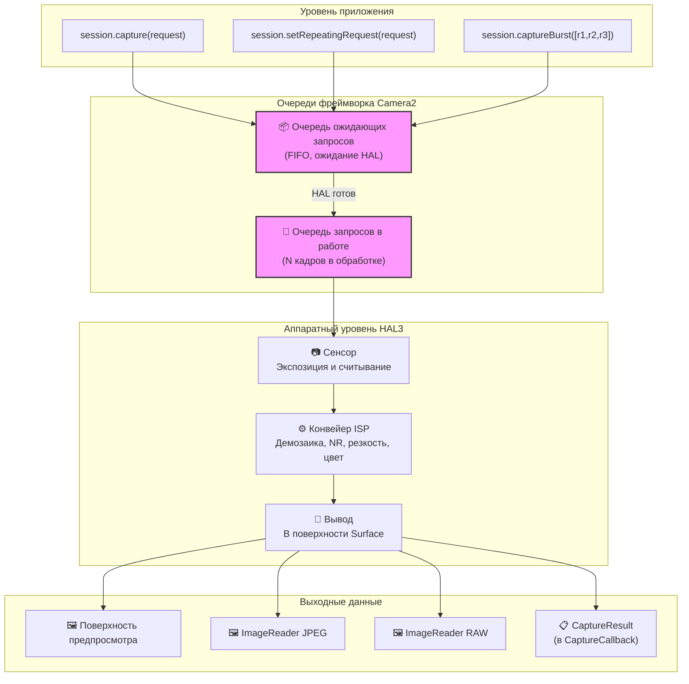
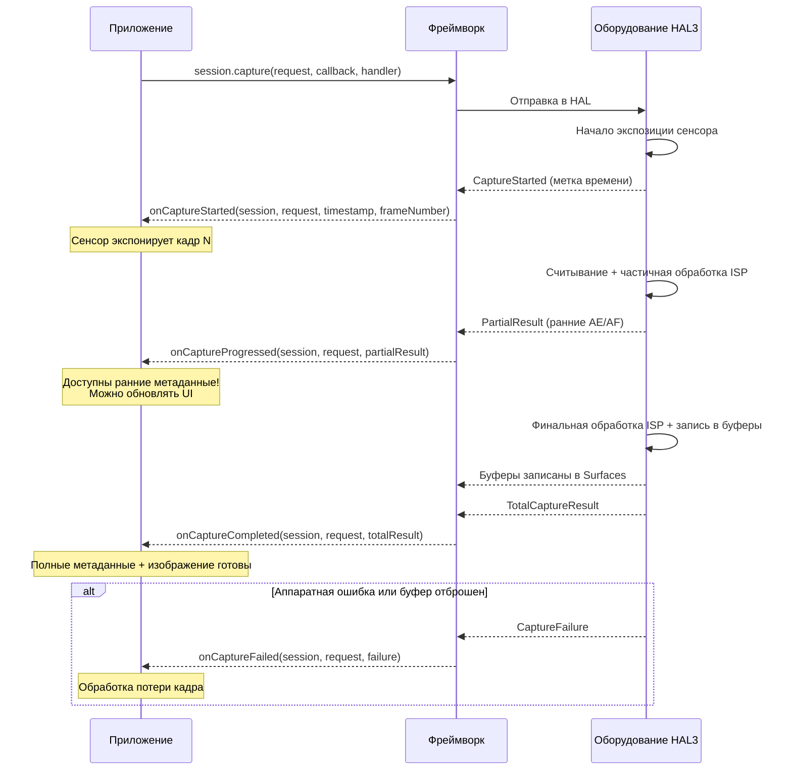
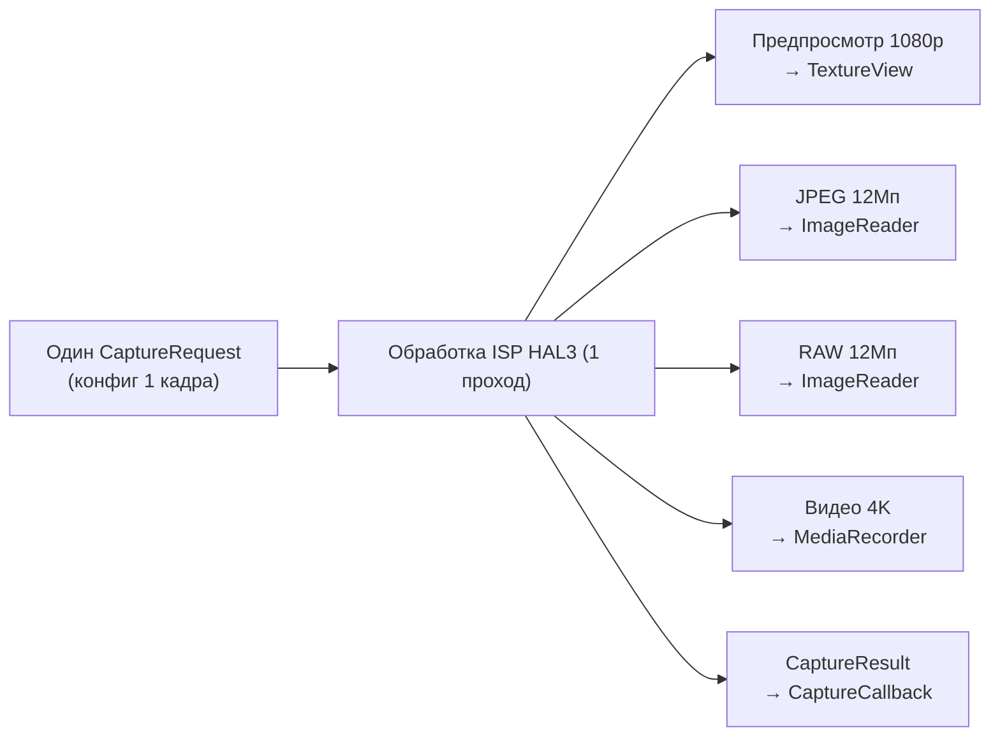
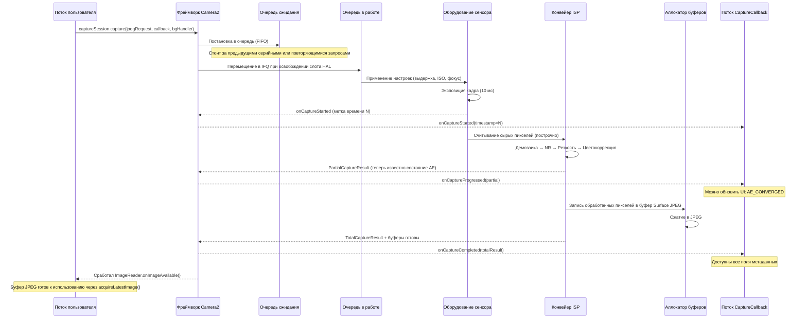

## 10.1 От использования к пониманию

В предыдущих главах этой серии вы *использовали* Camera2: показывали предпросмотр, делали фотографии и работали с файлами RAW. Теперь пришло время заглянуть внутрь — **как на самом деле Camera2 доставляет эти кадры?**

Понимание работы конвейера — это не просто теория. Зная, как запросы проходят через систему, вы сможете:
- Диагностировать пропуски кадров при скоростной съемке.
- Объяснить, почему изменение настроек занимает 1–2 кадра.
- Оптимизировать серийную съемку для исключения пауз.
- Построить правильную ментальную модель времени срабатывания обратных вызовов.

Приложение Android Camera Parameters ([GitHub](https://github.com/zoozooll/AndroidCameraParameters), [Play Store](https://play.google.com/store/apps/details?id=com.minininja.cameraparams)) визуализирует поведение конвейера в реальном времени — загляните на вкладки **Frame Timing** и **Raw JSON**, чтобы увидеть концепции из этой главы в действии на вашем устройстве.

## 10.2 Основные структуры данных

Прежде чем рассматривать сам конвейер, давайте детально изучим два объекта, которые по нему перемещаются: `CaptureRequest` (то, что входит) и `CaptureResult` (то, что выходит).

### CaptureRequest: Неизменяемый чертеж кадра

`CaptureRequest` — это **полная, неизменяемая конфигурация для одного кадра**. Он описывает *всё*, что сенсор, линза и ISP должны сделать для одной экспозиции: время выдержки, ISO, фокусное расстояние линзы, режимы 3A, целевые поверхности вывода, качество JPEG, область обрезки и многое другое.

Ключевые свойства `CaptureRequest`:

- **Неизменяемость после build()** — как только вы вызвали `.build()`, запрос «замораживается». Чтобы изменить настройки, нужно создать новый Builder.
- **Паттерн Builder** — создается через `CaptureRequest.Builder`, получаемый из `CameraDevice.createCaptureRequest(template)`.
- **Покадровость** — каждый отдельный кадр получает свой собственный объект запроса. Даже повторяющиеся захваты создают (неявно) новый запрос на каждый кадр.
- **Нацеленность на поверхности** — каждый запрос явно перечисляет, какие выходные поверхности Surface получают обработанные буферы изображений.

```kotlin
// Создание CaptureRequest с помощью паттерна Builder
val builder = cameraDevice.createCaptureRequest(CameraDevice.TEMPLATE_STILL_CAPTURE)

// Параметры уровня сенсора
builder.set(CaptureRequest.SENSOR_EXPOSURE_TIME, 10_000_000L)   // 10 мс
builder.set(CaptureRequest.SENSOR_SENSITIVITY, 400)             // ISO 400
builder.set(CaptureRequest.SENSOR_FRAME_DURATION, 33_333_333L)  // макс ~30 fps

// Параметры линзы
builder.set(CaptureRequest.LENS_FOCUS_DISTANCE, 0.1f)           // фокус на 10 см
builder.set(CaptureRequest.LENS_APERTURE, 1.8f)                 // f/1.8

// Режимы управления 3A
builder.set(CaptureRequest.CONTROL_AF_MODE, CaptureRequest.CONTROL_AF_MODE_OFF)
builder.set(CaptureRequest.CONTROL_AE_MODE, CaptureRequest.CONTROL_AE_MODE_OFF)
builder.set(CaptureRequest.CONTROL_AWB_MODE, CaptureRequest.CONTROL_AWB_MODE_OFF)

// Цели вывода
builder.addTarget(previewSurface)
builder.addTarget(jpegReader.surface)

// Сборка — теперь объект неизменяем!
val request: CaptureRequest = builder.build()

// Вызов request.set(...) приведет к ошибке — у собранного объекта нет метода set()!
```

:::note
Неизменяемость критически важна для корректности конвейера. Поскольку HAL считывает запрос асинхронно, если бы вы могли изменить его после отправки, возникли бы состояния гонки между потоком приложения и аппаратным потоком обработки.
:::

### CaptureResult: Отчет метаданных (не изображение!)

`CaptureResult` — это **выходные метаданные** для обработанного кадра. Важно: **CaptureResult НЕ содержит пиксельных данных изображения**. Пиксели отправляются на цели `Surface`, которые вы добавили в запрос; `CaptureResult` отправляется в ваш `CaptureCallback`, неся в себе *историю* того, что произошло во время захвата.

Вот наиболее важные поля в `CaptureResult`:

| Ключ результата | Тип | Описание |
|-----------|------|-------------|
| `SENSOR_EXPOSURE_TIME` | `Long` | Фактическое время выдержки в наносекундах (может отличаться от запроса) |
| `SENSOR_SENSITIVITY` | `Int` | Фактически примененное усиление ISO |
| `SENSOR_TIMESTAMP` | `Long` | Наносекундная метка времени начала экспозиции (из `SystemClock.elapsedRealtimeNanos()`) |
| `CONTROL_AE_STATE` | `Int` | Состояние автоэкспозиции: INACTIVE, SEARCHING, CONVERGED, LOCKED, FLASH_REQUIRED |
| `CONTROL_AF_STATE` | `Int` | Состояние автофокуса: INACTIVE, PASSIVE_SCAN, ACTIVE_SCAN, FOCUSED_LOCKED, NOT_FOCUSED_LOCKED |
| `CONTROL_AWB_STATE` | `Int` | Состояние автобаланса белого |
| `LENS_FOCUS_DISTANCE` | `Float` | Фактическая дистанция фокусировки, установленная линзой |
| `SCALER_CROP_REGION` | `Rect` | Фактическая область обрезки, использованная для цифрового зума |
| `JPEG_GPS_LOCATION` | `Location` | Тег GPS, записанный в JPEG (если запрашивался) |
| `STATISTICS_FACE_DETECT_MODE` | `Int` | Фактически использованный режим распознавания лиц |

Поля результата — это ваша **истина в последней инстанции**. `CaptureRequest` — это то, что вы *просили*; `CaptureResult` — это то, что оборудование *сделало на самом деле*. На устройствах уровней LEGACY или LIMITED HAL может молча обрезать, округлять или игнорировать ваши запрошенные значения — результат позволяет это обнаружить.

```kotlin
val captureCallback = object : CameraCaptureSession.CaptureCallback() {
    override fun onCaptureCompleted(
        session: CameraCaptureSession,
        request: CaptureRequest,
        result: TotalCaptureResult
    ) {
        val timestampNs = result.get(CaptureResult.SENSOR_TIMESTAMP)
        val exposureNs = result.get(CaptureResult.SENSOR_EXPOSURE_TIME)
        val iso = result.get(CaptureResult.SENSOR_SENSITIVITY)
        val aeState = result.get(CaptureResult.CONTROL_AE_STATE)
        val afState = result.get(CaptureResult.CONTROL_AF_STATE)
        val focusDistance = result.get(CaptureResult.LENS_FOCUS_DISTANCE)
        val cropRegion = result.get(CaptureResult.SCALER_CROP_REGION)

        val aeStateStr = when (aeState) {
            CaptureResult.CONTROL_AE_STATE_INACTIVE -> "INACTIVE"
            CaptureResult.CONTROL_AE_STATE_SEARCHING -> "SEARCHING"
            CaptureResult.CONTROL_AE_STATE_CONVERGED -> "CONVERGED"
            CaptureResult.CONTROL_AE_STATE_LOCKED -> "LOCKED"
            CaptureResult.CONTROL_AE_STATE_FLASH_REQUIRED -> "FLASH_REQUIRED"
            else -> "UNKNOWN($aeState)"
        }

        val afStateStr = when (afState) {
            CaptureResult.CONTROL_AF_STATE_INACTIVE -> "INACTIVE"
            CaptureResult.CONTROL_AF_STATE_PASSIVE_SCAN -> "PASSIVE_SCAN"
            CaptureResult.CONTROL_AF_STATE_ACTIVE_SCAN -> "ACTIVE_SCAN"
            CaptureResult.CONTROL_AF_STATE_FOCUSED_LOCKED -> "FOCUSED_LOCKED"
            CaptureResult.CONTROL_AF_STATE_NOT_FOCUSED_LOCKED -> "NOT_FOCUSED_LOCKED"
            else -> "UNKNOWN($afState)"
        }

        Log.d("Pipeline", buildString {
            append("Кадр @${timestampNs?.let { it / 1_000_000 } ?: "?"}мс | ")
            append("Выдержка: ${exposureNs?.let { "%.2fms".format(it / 1_000_000.0) } ?: "?"} | ")
            append("ISO: $iso | ")
            append("Фокус: ${focusDistance?.let { "%.3f".format(it) } ?: "?"} диоптрий | ")
            append("AE: $aeStateStr | ")
            append("AF: $afStateStr | ")
            append("Кроп: ${cropRegion?.width()}x${cropRegion?.height()}")
        })
    }
}
```

:::tip
В приложении Android Camera Parameters включите **Live Result Logging** в настройках и наблюдайте за этим потоком метаданных в реальном времени. Вы увидите, как AE_SEARCHING переходит в AE_CONVERGED по мере стабилизации экспозиции, а AF_SCAN — в FOCUSED_LOCKED при нажатии для фокусировки.
:::

## 10.3 Очереди запросов

На уровне фреймворка Camera2 использует **модель с двумя очередями**. Понимание этих очередей объясняет почти любое наблюдаемое поведение во времени.

### Очередь ожидающих запросов (FIFO)

Когда вы вызываете `session.capture()`, `session.captureBurst()` или `session.setRepeatingRequest()`, запрос не попадает в HAL немедленно. Вместо этого он помещается в **очередь ожидающих запросов (Pending Request Queue)** — очередь FIFO (First-In, First-Out), управляемую фреймворком Camera2.

Представьте это как «зал ожидания». Запросы находятся здесь до тех пор, пока у HAL не появится возможность принять новый запрос на обработку.

Ключевые свойства:
- **Порядок FIFO** — запросы обрабатываются в точном порядке их отправки.
- **Атомарность серии** — все кадры в `captureBurst()` ставятся в очередь непрерывно и обрабатываются без вклинивания повторяющихся запросов.
- **Приоритетное переопределение** — одиночные или серийные запросы «прыгают» в очереди *впереди* повторяющегося запроса (повторяющийся запрос автоматически переназначается после завершения одиночного).
- **Ограниченность** — очередь имеет конечную глубину (обычно 4–8 запросов); переполнение приводит к ошибкам.

### Очередь запросов в работе (In-Flight Queue)

Когда HAL извлекает запрос из очереди ожидающих и начинает считывание с сенсора / обработку в ISP, запрос перемещается в **очередь в работе (In-Flight Queue)**. Эта очередь содержит все запросы, которые в данный момент обрабатываются оборудованием.

Глубина этой очереди (`CameraCharacteristics.REQUEST_PIPELINE_MAX_DEPTH`) говорит о том, над сколькими кадрами оборудование может работать одновременно. На типичных устройствах уровня FULL глубина составляет 3–4 кадра, что означает: пока кадр N экспонируется, кадр N-1 обрабатывается в ISP, кадр N-2 записывается в память, а кадр N-3 возвращается приложению. Именно так Camera2 достигает 30+ FPS, несмотря на то что каждый кадр занимает ~100 мс от начала до конца.



## 10.4 Обратные вызовы результатов: Жизненный цикл CaptureCallback

Результаты возвращаются через `CameraCaptureSession.CaptureCallback`. HAL может возвращать результаты в несколько этапов, давая вам ранний доступ к частичным метаданным до того, как весь кадр будет готов.

### Четыре метода обратного вызова

| Метод | Когда вызывается | Что содержит | Случай использования |
|--------|------------|----------|----------|
| `onCaptureStarted` | Сенсор *начинает* экспозицию кадра | Минимум данных: номер кадра, метка времени | Точная синхронизация по времени |
| `onCaptureProgressed` | ISP частично обработал кадр | PartialCaptureResult — часть метаданных | Раннее обновление состояния AE/AF |
| `onCaptureCompleted` | Кадр готов, все буферы доставлены | TotalCaptureResult — все поля | Финальное логирование метаданных |
| `onCaptureFailed` | Кадр был отброшен / произошла ошибка | CaptureFailure — код ошибки, причина | Восстановление после ошибок |

### Частичные и полные результаты

`PartialCaptureResult` возвращается, когда ISP вычислил *некоторые* поля метаданных, но еще не завершил работу всего конвейера. `TotalCaptureResult` возвращается, когда всё готово.



```kotlin
val fullPipelineCallback = object : CameraCaptureSession.CaptureCallback() {
    override fun onCaptureStarted(
        session: CameraCaptureSession,
        request: CaptureRequest,
        timestamp: Long,
        frameNumber: Long
    ) {
        super.onCaptureStarted(session, request, timestamp, frameNumber)
        Log.d("Pipeline", "Кадр #$frameNumber начал экспозицию @ ${timestamp / 1_000_000}мс")
    }

    override fun onCaptureProgressed(
        session: CameraCaptureSession,
        request: CaptureRequest,
        partialResult: CaptureResult
    ) {
        super.onCaptureProgressed(session, request, partialResult)
        val aeState = partialResult.get(CaptureResult.CONTROL_AE_STATE)
        val afState = partialResult.get(CaptureResult.CONTROL_AF_STATE)
        Log.v("Pipeline", "Partial: AE=$aeState AF=$afState")
    }

    override fun onCaptureCompleted(
        session: CameraCaptureSession,
        request: CaptureRequest,
        result: TotalCaptureResult
    ) {
        super.onCaptureCompleted(session, request, result)
        val totalFrames = result.frameNumber
        Log.d("Pipeline", "Кадр #$totalFrames полностью завершен")
    }

    override fun onCaptureFailed(
        session: CameraCaptureSession,
        request: CaptureRequest,
        failure: CaptureFailure
    ) {
        super.onCaptureFailed(session, request, failure)
        val reason = when (failure.reason) {
            CaptureFailure.REASON_ERROR -> "Внутренняя ошибка"
            CaptureFailure.REASON_FLUSHED -> "Сброшено через abortCaptures()"
            else -> "Неизвестно (${failure.reason})"
        }
        Log.e("Pipeline", "Кадр #${failure.frameNumber} ОШИБКА: $reason. Захвачен: ${failure.wasImageCaptured()}")
    }
}
```

## 10.5 Внутреннее устройство: Stateless, Последовательный, Асинхронный, Многоцелевой

Модель конвейера HAL3, которую предоставляет Camera2, имеет четыре определяющих свойства. Усвойте их, и большинство «странностей» поведения Camera2 внезапно обретут смысл.

### 1. Отсутствие состояния (Statelessness)

У оборудования **нет памяти между запросами**. Каждый `CaptureRequest` должен быть самодостаточным — он включает в себя *каждую настройку*, а не только те, которые вы изменили по сравнению с предыдущим кадром.

Это означает:
- Если вы установили `SENSOR_EXPOSURE_TIME` для кадра N, но *пропустили* его для кадра N+1, настройка вернется к значению по умолчанию из шаблона.
- Повторяющийся запрос — это не «набор переопределений», он заново генерируется и отправляется фреймворком в HAL для каждого кадра.
- На уровне HAL нет понятия «настроил и забыл».

```kotlin
// 🔴 НЕПРАВИЛЬНО: Ожидание сохранения настроек
session.setRepeatingRequest(requestWithExposure10ms, callback, handler)
// Позже: меняем только триггер AF, забыв снова задать экспозицию
val triggerBuilder = cameraDevice.createCaptureRequest(CameraDevice.TEMPLATE_PREVIEW)
triggerBuilder.set(CaptureRequest.CONTROL_AF_TRIGGER, CaptureRequest.CONTROL_AF_TRIGGER_START)
triggerBuilder.addTarget(previewSurface)
session.capture(triggerBuilder.build(), callback, handler)
// 🐛 Экспозиция возвращается к значению по умолчанию TEMPLATE_PREVIEW для этого кадра!

// ✅ ПРАВИЛЬНО: Каждый запрос самодостаточен
val triggerBuilder = cameraDevice.createCaptureRequest(CameraDevice.TEMPLATE_PREVIEW)
triggerBuilder.set(CaptureRequest.SENSOR_EXPOSURE_TIME, 10_000_000L)
triggerBuilder.set(CaptureRequest.CONTROL_AF_TRIGGER, CaptureRequest.CONTROL_AF_TRIGGER_START)
triggerBuilder.addTarget(previewSurface)
session.capture(triggerBuilder.build(), callback, handler)
```

### 2. Последовательная обработка

В рамках одного логического потока камеры запросы обрабатываются **по одному в порядке FIFO**. Нет никакой перестановки или параллельного выполнения запросов. Если кадр 50 стоит за кадром 49 в очереди, кадр 50 ждет завершения экспозиции кадра 49, даже если кадр 50 был бы «быстрее» в обработке.

Именно поэтому серийная съемка (burst) дает непрерывные кадры без пропусков: N запросов серии гарантированно выполняются друг за другом.

### 3. Асинхронные результаты

Поток, отправляющий запрос, **никогда** не является потоком, получающим результат. Результаты доставляются в поток `Handler`, который вы предоставили (или в поток binder, если вы передали `null`).

Практическое следствие: **никогда не обращайтесь к общему изменяемому состоянию из обратного вызова без синхронизации**. Распространенная ошибка — чтение/запись `latestExposure` одновременно при нажатии кнопки и в колбэке.

### 4. Несколько выходов на один запрос

Один запрос → много выходов. Один `CaptureRequest` может быть нацелен на 2, 3 или даже 4+ цели `Surface` одновременно:

- **SurfaceTexture предпросмотра** (для дисплея)
- **ImageReader JPEG** (для фотографии)
- **ImageReader RAW** (для DNG)
- **Surface MediaRecorder** (для кодирования видео)
- **Surface Allocation** (для обработки RenderScript/ML)

HAL отвечает за направление одного считывания с сенсора через несколько ветвей ISP для создания каждого выходного формата. Вы не дублируете захват; вы объявляете цели, а оборудование распределяет данные.



## 10.6 Сквозной процесс: Прослеживание одного кадра

Давайте проследим путь одного запроса на захват JPEG через весь конвейер:



## 10.7 Наблюдение за конвейером в действии

Приложение Android Camera Parameters ([GitHub](https://github.com/zoozooll/AndroidCameraParameters), [Play Store](https://play.google.com/store/apps/details?id=com.minininja.cameraparams)) содержит отладочный вид **Pipeline Visualizer**, который накладывает текущую глубину очереди ожидающих запросов, глубину очереди в работе и метки времени каждого кадра. Откройте приложение, включите **Developer Mode** в настройках, выберите камеру и перейдите на вкладку **Pipeline**, чтобы увидеть:

- Сколько запросов находится в очереди, а сколько — в обработке.
- Задержку каждого кадра от момента начала до завершения.
- Количество частичных результатов на кадр (сколько раз вызывается `onCaptureProgressed`).
- Любые отброшенные кадры с указанием причин ошибки.

Эта вкладка — лучший способ развить интуицию для понимания концепций этой главы.

## 10.8 Резюме

| Концепция | Главный вывод |
|---------|-------------|
| **CaptureRequest** | Неизменяемый, покадровый чертеж. Создается через Builder. Содержит ВСЕ настройки (без сохранения состояния). |
| **CaptureResult** | Только метаданные (без пикселей). Истина о том, что оборудование *сделало на самом деле*. Проверяйте состояния AE/AF, выдержку, кроп. |
| **Очередь ожидания** | Зал ожидания FIFO. Серии выполняются непрерывно. Одиночные запросы идут перед повторяющимися. |
| **Очередь в работе** | Запросы в текущей обработке. Глубина = REQUEST_PIPELINE_MAX_DEPTH. Обычно 3–4 кадра на устройствах FULL. |
| **CaptureCallback** | Четыре фазы: started → progressed → completed (или failed). Частичные против полных результатов. |
| **Statelessness** | У оборудования нет памяти. Каждый запрос должен включать все нужные вам настройки. |
| **Последовательно и асинхронно** | Порядок FIFO гарантирован. Обратный вызов — в другом потоке, отличном от потока отправки. |
| **Многоцелевой вывод** | Один запрос → много поверхностей Surface (предпросмотр + JPEG + RAW + видео одновременно). |

## Что дальше

В [Главе 11: Типы захвата](capture-types.md) мы рассмотрим три способа отправки запросов в этот конвейер — одиночный, серийный и повторяющийся — и когда какой использовать. Мы также изучим встроенные шаблоны (`TEMPLATE_PREVIEW`, `TEMPLATE_STILL_CAPTURE` и др.), которые заранее настраивают разумные значения для стандартных случаев.
