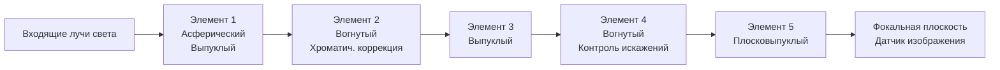
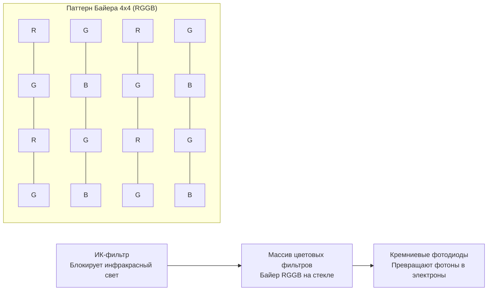
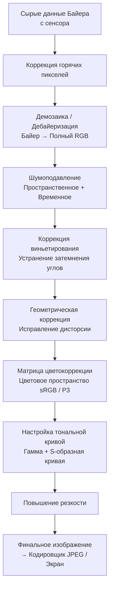
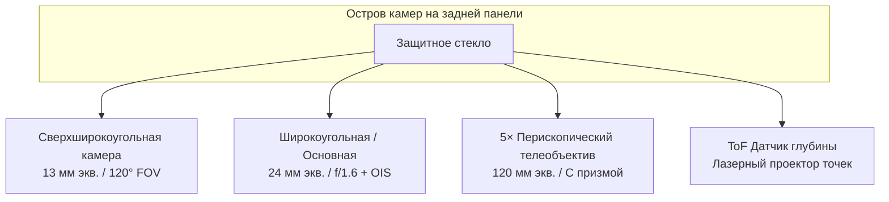
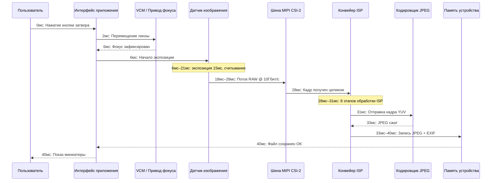

# Глава 2: Устройство камер смартфонов

Прежде чем писать первую строку кода API Camera2, вы должны понять физическое оборудование, которым будет управлять ваш код. Камера смартфона — это не просто «объектив, направленный на датчик». Это плотно интегрированная, герметичная, прецизионная сборка, содержащая оптику, приводы, фильтры, полупроводники и высокоскоростные шины данных. В этой главе объясняется каждый компонент — от стекла, которое первым ловит свет, до чипа флэш-памяти, где хранится ваша итоговая фотография.

Цель этой главы — построить ментальную модель конвейера камеры как физической системы. Когда в следующих главах вам потребуется настроить запрос на захват с помощью `CONTROL_AE_TARGET_FPS_RANGE` или `SENSOR_SENSITIVITY`, вы будете точно понимать, на какую часть оборудования влияют эти параметры и почему их значения важны.

## Модуль камеры: Герметичная оптическая сборка

Когда вы смотрите на заднюю панель современного флагманского телефона — представьте себе Pixel 10 или Galaxy S26 Ultra — вы видите выступающий прямоугольный остров, возвышающийся над задним стеклом на 2–4 миллиметра. Этот остров — не одна камера. В одном прямоугольном острове размещаются три отдельных круглых модуля: самый большой внизу — основной широкоугольный, чуть поменьше над ним — 3-кратный перископический телеобъектив, а средний слева — сверхширокоугольный 0,5×. Каждый круглый выступ внутри этого острова является полноценным, независимым модулем камеры.

Модуль камеры — это герметично закрытый блок, изготовленный в стерильном помещении. Он содержит следующие элементы, расположенные по порядку от внешнего мира внутрь:

1. **Защитное стекло**: Устойчивое к царапинам сапфировое стекло или окно Gorilla Glass, которое герметизирует модуль и защищает его от пыли.
2. **Объектив (Lens barrel)**: Цилиндрический стек из 4–6 отдельных стеклянных (или иногда пластиковых асферических) линз, удерживаемых в точном положении тонкими пластиковыми проставками.
3. **Звуковая катушка (Voice Coil Motor, VCM)**: Электромагнитный привод, который перемещает весь объектив вперед или назад вдоль оптической оси на доли миллиметра для достижения автофокусировки. Некоторые премиальные VCM также могут сдвигать линзу перпендикулярно оси для оптической стабилизации изображения (OIS).
4. **ИК-фильтр**: Тонкая пластина из стекла с покрытием, расположенная непосредственно перед сенсором. Она блокирует инфракрасный свет (к которому чувствителен кремниевый сенсор, но который не виден человеческому глазу), чтобы записанные цвета соответствовали человеческому восприятию.
5. **Кристалл сенсора**: Сам чип CMOS-матрицы, приваренный к подложке. Активная область пикселей направлена вверх, к объективу.
6. **Гибкий шлейф (FPC)**: Тонкий гибкий кабель, по которому передается питание, земля, сигналы управления (I2C) и высокоскоростные данные изображения (MIPI CSI-2) от модуля к материнской плате телефона.
7. **Разъем (Board-to-board connector)**: Крошечный разъем высокой плотности на конце шлейфа, который вставляется в ответную часть на основной плате телефона.

Вся сборка — от защитного стекла до разъема — обычно имеет толщину от 5 до 8 миллиметров для обычной задней камеры и от 10 до 14 миллиметров в длину (внутри телефона, ориентирована горизонтально) для перископического телеобъектива. Модули калибруются индивидуально на заводе: юстировка линз, наклон сенсора, цветовое затенение и положение бесконечности для автофокуса измеряются и записываются в однократно программируемую память (OTP) на самом модуле. API Camera2 считывает эти данные калибровки при загрузке устройства, поэтому вашему приложению не нужно учитывать производственные отклонения от устройства к устройству.

## Объектив: Фокусное расстояние, диафрагма и стабилизация

Объектив — это первый компонент, с которым сталкивается свет. Его задача — преломлять входящие лучи света так, чтобы они сходились в резкое изображение точно на плоскости датчика изображения.

### Фокусное расстояние и полнокадровый эквивалент

Фокусное расстояние определяет угол обзора (какая часть сцены помещается в кадр) и увеличение (насколько большими кажутся удаленные объекты). В характеристиках камер смартфонов всегда указываются **фокусные расстояния в полнокадровом эквиваленте**. Это соглашение, которое нормализует параметры для разных размеров сенсоров, чтобы потребители могли сравнивать их. Полнокадровый сенсор — это размер 36 мм × 24 мм, который исторически использовался в 35-мм пленочных камерах.

Распространенные эквивалентные фокусные расстояния в смартфонах:

- **10–18 мм (Сверхширокоугольный)**: Диагональный угол обзора от 100° до 130°. Используется для пейзажей, архитектуры, групповых селфи и макросъемки крупным планом.
- **22–28 мм (Широкоугольный / Основной)**: Стандартная камера в любом телефоне. Угол обзора около 75°, похож на периферийное зрение человека, но более плоский.
- **45–80 мм (Телеобъектив, 2×–3×)**: Узкий угол обзора от 30° до 50°. Используется для портретов (естественные пропорции лица, меньше искажений перспективы) и общего приближения.
- **100–240 мм (Перископический телеобъектив, 5×–10×)**: Угол обзора от 10° до 25°. Конструкция перископа с изломом луча позволяет получить большие фокусные расстояния, не делая телефон толщиной в 2 сантиметра.

Вот как свет проходит через типичный 5-линзовый широкоугольный объектив:

### Диафрагма (Aperture)

Диафрагма — это размер отверстия, через которое проходит свет внутри объектива. Она описывается как **f-число** (или f-stop): фокусное расстояние, деленное на диаметр отверстия. **Меньшее f-число означает более широкое отверстие, что означает, что больше света** достигает сенсора.

- f/1.4–f/1.8: Очень широкая диафрагма. Типично для основных камер флагманов. Отлично подходит для условий низкой освещенности.
- f/2.0–f/2.4: Умеренная диафрагма. Типично для сверхширокоугольных и телеобъективов на большинстве телефонов.
- f/2.8–f/4.0: Узкая диафрагма. Встречается в недорогих фронтальных камерах и некоторых перископических модулях.

В камерах смартфонов диафрагма обычно фиксированная. Несколько флагманов Samsung 2020-х годов имели **механизм переменной диафрагмы** с двойной шторкой, которая могла механически переключаться между f/1.5 и f/2.4. Сегодня это встречается крайне редко, так как фокусировка на базе VCM и многокадровый вычислительный HDR сделали переменную диафрагму ненужной для большинства случаев.

### Оптическая стабилизация изображения (OIS)

Когда вы держите телефон, ваши руки естественным образом совершают микродрожания — порядка 0,1°–0,5° при выдержке 1/30 секунды. При достаточно долгой экспозиции это дрожание вызывает размытие всего изображения. **Оптическая стабилизация изображения (OIS)** решает эту проблему путем физического перемещения либо блока линз (lens-shift OIS), либо самого кристалла сенсора (sensor-shift OIS) для противодействия обнаруженному движению. Крошечный гироскоп внутри модуля камеры (или данные с основного гироскопа телефона) измеряет угловую скорость от 1 000 до 8 000 раз в секунду, и привод OIS соответствующим образом перемещает оптику. OIS обычно может компенсировать от 3 до 5 ступеней дрожания рук, что означает, что экспозиция, для которой потребовалась бы выдержка 1/60 с для сохранения резкости, теперь может быть снята на 1/8 с или 1/4 с с такой же резкостью.

## Датчик изображения: Где свет становится электричеством

Датчик изображения — это кремниевый чип, содержащий миллионы отдельных детекторов света, называемых **фотодиодами**, расположенных в виде точной прямоугольной сетки. Сегодня в каждом смартфоне используется датчик типа **CMOS (Complementary Metal-Oxide-Semiconductor)**.

### Размер пикселя и мегапиксели

Каждый отдельный фотодиод со схемой считывания называется **пикселем**. Физический размер каждого пикселя (измеряется в микрометрах, мкм) зачастую важнее общего количества мегапикселей. Пиксель большего размера улавливает больше фотонов в единицу времени, что означает меньше дробового шума и лучшую работу при слабом освещении.

Распространенные размеры пикселей в смартфонах 2026 года:

- **0,6 мкм – 0,8 мкм**: Очень маленькие пиксели. Используются в сенсорах высокого разрешения от 108 Мп до 200 Мп. Они полностью полагаются на объединение пикселей (pixel binning) для получения приемлемого уровня шума.
- **1,0 мкм – 1,2 мкм**: Средний размер. Используются в сенсорах от 48 Мп до 64 Мп со стандартным объединением 4:1 для получения на выходе 12–16 Мп.
- **2,0 мкм – 2,4 мкм**: Крупные «флагманские» пиксели. Используются в специализированных сенсорах на 12–16 Мп (Google Pixel, iPhone Pro) или как результат объединения пикселей в сенсорах на 48 Мп в режиме «высокого качества».

Объединение пикселей (Pixel binning) — это метод объединения заряда соседних пикселей 2×2 (или 3×3, или 4×4) в один «суперпиксель» во время считывания. Сенсор 48 Мп с отдельными пикселями 0,8 мкм при объединении 4-в-1 ведет себя как сенсор 12 Мп с эффективным размером пикселя 1,6 мкм, что значительно улучшает отношение сигнал/шум. API Camera2 предоставляет как режим полного разрешения, так и стандартный режим с объединением пикселей в виде отдельных конфигураций потоков.

Математика количества мегапикселей проста: сенсор на 48 Мп имеет активную матрицу из примерно 8 000 × 6 000 фотодиодов = 48 000 000 отдельных датчиков света.

### Классификация размеров сенсоров

Размеры сенсоров следуют устаревшей системе обозначений в дюймах, восходящей к телевизионным трубкам Vidicon 1950-х годов. Формат записи «1/X дюйма», где X — делитель; чем меньше X, тем больше сенсор:

- От 1/3,06" до 1/2,55": Маленькие сенсоры, типичные для фронтальных камер и бюджетных сверхширокоугольных модулей (~5–13 Мп).
- От 1/1,7" до 1/1,3": Крупные мобильные сенсоры, основные камеры флагманов (48 Мп, 50 Мп, 108 Мп).
- 1 дюйм (Тип 1): Очень большой для телефона размер. Встречается в Xiaomi 13 Ultra, серии Sharp Aquos R и Sony Xperia Pro-I. Активная область примерно 13,2 мм × 8,8 мм — по размеру приближается к некоторым камерам системы Micro Four Thirds.

При одинаковом количестве мегапикселей сенсор большего физического размера всегда имеет более крупные отдельные пиксели. Вот почему телефоны с «дюймовым сенсором» делают заметно лучшие снимки при слабом освещении.

### Цветовой фильтр Байера (CFA)

Сырой кремниевый фотодиод не различает цвета — он измеряет только общую интенсивность фотонов, а не длину волны. Чтобы записывать цвет, производители наносят крошечный **цветовой фильтр** поверх каждого отдельного пикселя. Почти универсальным является **фильтр Байера RGGB**: 50% зеленых пикселей, 25% красных и 25% синих, расположенных в виде повторяющегося тайла 2×2. Человеческий глаз более чувствителен к зеленому свету, поэтому удвоение выборки зеленого цвета улучшает воспринимаемое разрешение яркости и шумовые характеристики.

После считывания данные сенсора представляют собой мозаику из отдельных значений красного, зеленого и синего цветов — это еще не полноцветное изображение. Этап, на котором восполняется недостающая цветовая информация для каждого пикселя, называется **демозаикой** (или дебайеризацией), и это первый крупный вычислительный этап, выполняемый в ISP.

### Скользящий затвор (Rolling Shutter) против глобального затвора

Почти каждый датчик изображения в смартфоне использует **скользящий затвор (rolling shutter)**. Датчик не экспонирует и не считывает все пиксели одновременно. Вместо этого он экспонирует и считывает массив пикселей построчно, сверху вниз, по одной горизонтальной линии за раз. Типичное считывание полнокадрового изображения с 48-мегапиксельного сенсора занимает примерно от 15 до 25 миллисекунд.

Скользящий затвор вызывает характерные искажения на очень быстро движущихся объектах: вращающийся пропеллер самолета или лопасти вентилятора кажутся изогнутыми или волнистыми; верхняя и нижняя части здания при резком панорамировании по вертикали наклоняются в разные стороны («эффект желе» в видео). Датчики с глобальным затвором (global shutter), напротив, экспонируют каждый пиксель одновременно и считывают их все сразу после окончания экспозиции. Глобальный затвор используется в системах машинного зрения, экшн-камерах и некоторых специализированных фронтальных ИК-датчиках для распознавания лиц, но конструкция пикселей с глобальным затвором имеет меньшую светочувствительность и более высокую стоимость, поэтому она не используется в основных камерах смартфонов.

## ISP: Процессор сигналов изображения

**ISP (Image Signal Processor)** — это специализированный аппаратный блок (либо отдельный чип, либо, что чаще сегодня, интегрированная часть основной SoC наряду с CPU и GPU), единственная задача которого — превратить сырые, мозаичные, шумные и искаженные данные, поступающие с сенсора, в приятное глазу цветное изображение.

ISP выполняет фиксированный, жестко запрограммированный конвейер этапов обработки изображений с чрезвычайно высокой пропускной способностью. Современный 48-мегапиксельный сенсор, работающий со скоростью 30 кадров в секунду, отправляет в ISP 1,44 миллиарда пикселей в секунду. ISP должен прогнать каждый пиксель через все этапы менее чем за 33 миллисекунды на кадр, чтобы не отставать.

Канонические этапы конвейера ISP по порядку:

1. **Коррекция «горячих» пикселей**: Заводские калиброванные «застрявшие» пиксели (всегда яркие или всегда темные) заменяются интерполированными значениями соседних пикселей.
2. **Демозаика / Дебайеризация**: Мозаика Байера RGGB преобразуется в полноценное RGB-изображение путем оценки недостающих двух цветовых каналов в каждой позиции пикселя на основе окружающих пикселей с использованием алгоритмов интерполяции с учетом краев.
3. **Шумоподавление (временное + пространственное)**: Подавляется случайный дробовой шум и шум считывания сенсора. Пространственное шумоподавление размывает плоские области, сохраняя края. Временное шумоподавление объединяет информацию из предыдущих видеокадров (если они доступны) для еще более чистого результата.
4. **Коррекция виньетирования (Lens Shading Correction)**: Углы изображения естественным образом темнее, так как свет должен проходить через объектив под более острым углом. ISP применяет цифровое усиление для каждого пикселя, более сильное по краям, чтобы выровнять освещенность. Данные калибровки для этого усиления хранятся в OTP модуля.
5. **Коррекция геометрических искажений**: Сверхширокоугольные объективы и объективы типа «фишай» создают бочкообразную дисторсию (прямые линии выгибаются наружу). ISP пересчитывает координаты пикселей, используя заложенную полиномиальную модель объектива, чтобы получить прямолинейное изображение, где прямые линии действительно кажутся прямыми. Этот этап неизбежно приводит к обрезке 5–10% внешнего кольца пикселей.
6. **Матрица цветокоррекции (CCM)**: Спектральная характеристика RGB «сырого» сенсора не совпадает с трихроматической характеристикой человеческого глаза. Умножение на матрицу 3×3 преобразует нативный RGB сенсора в стандартное цветовое пространство sRGB или DCI-P3. Коэффициенты CCM настраиваются для каждого модуля под разные источники света (дневной свет, лампы накаливания, люминесцентные лампы).
7. **Настройка тональной кривой**: К линейным данным RGB применяется нелинейная S-образная кривая тонального отображения, чтобы сжать сигнал сенсора с высоким динамическим диапазоном в выходной сигнал с низким динамическим диапазоном (обычно 8-битный sRGB с гамма-кодированием). Этот этап делает изображение контрастным — контраст увеличивается в средних тонах, света сглаживаются, тени приподнимаются.
8. **Повышение контурной резкости (Sharpening)**: Применяется тонкая нерезкая маска для восстановления высокочастотных деталей, смягченных шумоподавлением и оптическим низкочастотным фильтром. Степень резкости тщательно контролируется, чтобы избежать появления ореолов.

Качество обработки ISP является основным отличием между производителями телефонов. Google, Samsung, Apple и Xiaomi по-разному настраивают свои конвейеры ISP, исходя из художественных приоритетов: кто-то предпочитает естественные цвета, кто-то — перенасыщенный «сочный» результат, кто-то — агрессивное шумоподавление в ущерб деталям. API Camera2 дает вам некоторый контроль над силой отдельных этапов ISP (через элементы управления тональным отображением и цветокоррекцией Android), но большинство детальных параметров этапов заблокированы за проприетарными API производителей.

## RAW против JPEG: два пути от сенсора к памяти

Конвейер ISP, описанный выше, создает обработанное изображение. Но API Camera2 также позволяет обходить ISP и считывать данные непосредственно с сенсора. В этом и заключается критическое различие между выводом в форматах RAW и JPEG.

### Формат RAW

**Файл RAW** (на Android это файл DNG, Digital Negative) содержит именно то, что измерил сенсор до запуска какой-либо обработки в ISP. Это мозаика Байера по 10, 12 или 14 бит на пиксель — всё еще в оригинальном паттерне RGGB, всё еще с виньетированием, всё еще с шумом, всё еще линейная. Файл RAW также содержит теги метаданных, определяющие точный массив цветовых фильтров, цветовой профиль сенсора, уровни черного и белого, а также модель объектива.

- **Разрядность**: RAW10 = 10 бит на канал = 1 024 уровня. RAW12 = 4 096 уровней. RAW14 = 16 384 уровня. Сравните это с 8 битами JPEG = 256 уровней.
- **Размер файла**: 20–40 МБ для фотографии 48 Мп. Без сжатия или со сжатием почти без потерь.
- **Применение**: Профессиональная постобработка. Дополнительный запас позволяет редактору «спасти» переэкспонированные участки (на 2–3 ступени EV) или поднять недоэкспонированные тени без появления полос (бандинга).

### Формат JPEG

**Файл JPEG** — это полностью «готовый» результат работы ISP. Все 8 этапов ISP, описанных выше, уже применены к данным пикселей. Затем изображение преобразуется из RGB в цветовое пространство YCbCr 4:2:0 с субдискретизацией цветности и сжимается алгоритмом дискретного косинусного преобразования с потерями при коэффициенте сжатия примерно от 10:1 до 20:1.

- **Разрядность**: Всегда 8 бит на канал = 256 уровней на цвет.
- **Размер файла**: 2–5 МБ для фотографии 12–48 Мп, в зависимости от уровня качества JPEG.
- **Применение**: Мгновенная отправка в соцсети, любой рабочий процесс, где фотография «готова» сразу после съемки. Редактирование в мобильном приложении быстро ухудшает качество, так как остается всего 256 уровней.

### Таблица сравнения: RAW против JPEG

| Характеристика | RAW (DNG) | JPEG |
|---------|-----------|------|
| Обработка ISP | Нет — все этапы пропущены | Все 8 этапов применены и необратимы |
| Глубина цвета | 10–14 бит (1 024–16 384 уровня) | 8 бит (256 уровней) |
| Баланс белого | Помечен в метаданных, полностью меняется при обработке | Вшит в пиксели — возможны лишь небольшие правки |
| Запас по экспозиции | Можно восстановить ±2–3 ступени | В лучшем случае ±1/2 ступени до появления артефактов |
| Размер файла (48 Мп) | 25–40 МБ | 3–6 МБ |
| Цветовое пространство | Линейный RGB сенсора | sRGB или Display P3 с гамма-коррекцией |
| Резкость / Шумоподавление | Нет — выбор за редактором | Применены; нельзя отменить |
| Типичный процесс | Adobe Lightroom / Capture One | Прямая публикация в Instagram / мессенджеры |

## Мультикамерные телефоны: Почему не один гигантский зум-объектив?

Традиционная компактная камера использует один зум-объектив с подвижными внутренними группами линз, который плавно меняет фокусное расстояние от широкого до телеположения. Почему смартфон не может делать то же самое? Физика. Объектив с 10-кратным зумом, охватывающий диапазон 24–240 мм в полнокадровом эквиваленте с постоянной диафрагмой f/2.8, требует оптического пути длиной около 5 сантиметров. Толщина смартфона в лучшем случае составляет 0,9 сантиметра. Математика просто не сходится.

Индустрия смартфонов решила эту проблему не с помощью зум-объектива, а с помощью **нескольких камер с фиксированным фокусным расстоянием**, каждая из которых оптимизирована для своей цели, и вычислительной системы «плавного зума», которая переключается с одной камеры на другую при определенных коэффициентах приближения.

Типичный остров задней камеры флагмана 2026 года содержит:

1. **Сверхширокоугольная (зум 0,5×, экв. ~13 мм, угол ~120°)**: Короткое фокусное расстояние, большая глубина резкости. Идеально подходит для пейзажей, архитектуры, групповых снимков и макросъемки при программном переключении.
2. **Широкоугольная / Основная (зум 1×, экв. ~24 мм, угол ~75°)**: По умолчанию. Самый большой сенсор, самая широкая диафрагма, лучшая стабилизация OIS. Используется для 80% повседневных фотографий.
3. **Телеобъектив / Перископ (оптический зум от 3× до 10×, экв. от ~72 мм до ~240 мм)**: Обычный телеобъектив (3×) расположен прямо над сенсором. Перископический телеобъектив (5×, 10×) использует 45-градусную призму у края телефона для отражения света на 90 градусов, поэтому блок линз проходит горизонтально внутри корпуса телефона, а не вертикально сквозь него.
4. **ToF / Датчик глубины**: Излучатель ближнего ИК-диапазона (или LiDAR на iPhone), который проецирует сетку из 30 000+ ИК-точек и измеряет время их возврата для построения попиксельной карты глубины. Используется для точного размытия в портретном режиме, дополненной реальности и быстрой фокусировки при слабом освещении.

Когда вы делаете жест масштабирования в приложении камеры, HAL (Hardware Abstraction Layer) плавно переключает активную физическую камеру на определенных порогах. Например, масштабирование от 0,5× до 1,0× — это переход от сверхширокоугольной камеры к основной. При значении 2,9× приложение всё еще делает цифровой кроп с основной камеры. При 3,0× HAL переключает источник на телеобъектив. Между этими значениями сложный алгоритм объединения изображений использует обе камеры одновременно, чтобы переход оставался незаметным для пользователя.

## Путь целиком: От фотона до сохраненной фотографии, миллисекунда за миллисекундой

Вот полный хронологический график того, что физически происходит внутри смартфона во время съемки одной фотографии, начиная с момента, когда палец пользователя отрывается от виртуальной кнопки затвора. Эти цифры характерны для флагмана 2026 года при съемке стандартного JPEG 12 Мп при дневном свете:

- **0 мс**: Пользователь нажимает на затвор. Фреймворк API Camera2 получает запрос `CaptureRequest` с шаблоном `TEMPLATE_STILL_CAPTURE`.
- **0–2 мс**: Алгоритм 3A (Auto-Focus, Auto-Exposure, Auto-White-Balance) сходится к финальным значениям.
- **2–6 мс**: На звуковую катушку (VCM) подается ток, физически перемещая блок линз на 0,2 мм в точно рассчитанную точку фокусировки.
- **6–21 мс (экспозиция 15 мс)**: Сбрасывается заряд пикселей. В течение 15 миллисекунд фотодиоды накапливают электроны, генерируемые фотонами. Скользящий затвор считывает данные построчно во время и после этого окна.
- **18–28 мс**: Сенсор передает сырые данные Байера по высокоскоростной последовательной шине MIPI CSI-2. Типичная конфигурация — 4 линии по 2,5 Гбит/с = 10 Гбит/с общей пропускной способности, что легко справляется с потоком данных 12-мегапиксельного кадра.
- **28–31 мс**: 8-этапный конвейер ISP обрабатывает кадр: коррекция горячих пикселей, демозаика, шумоподавление, виньетирование, геометрия, цветокоррекция, тональная кривая и резкость. Это происходит полностью аппаратно — центральный процессор не участвует в обработке пикселей.
- **31–33 мс**: Обработанное изображение YUV отправляется в аппаратный кодировщик JPEG, который применяет сжатие с потерями и записывает заголовки файла JFIF (EXIF, миниатюра, координаты GPS).
- **33–40 мс**: Готовый JPEG записывается через контент-провайдер MediaStore в папку приложения, например `/data/data/com.yourpackagename/files/DCIM/Camera/IMG_20260806_151042.jpg`. Система уведомляется о новом файле, и фото появляется в галерее.

Весь процесс занимает примерно 40 миллисекунд от начала до конца для фотографии при дневном свете. При слабом освещении время экспозиции увеличивается (потенциально до нескольких секунд для ночного режима), и весь график масштабируется пропорционально.

## Резюме

Теперь у вас есть полная физическая картина работы системы камеры смартфона. Вы знаете, что каждый выступ камеры на задней панели — это герметичный модуль, содержащий блок линз из нескольких элементов, привод автофокуса VCM, ИК-фильтр, CMOS-сенсор с фильтром Байера RGGB и шлейф для передачи данных MIPI CSI-2. Вы понимаете, что такое эквивалентное фокусное расстояние, диафрагма и OIS. Вы знаете, как 8-этапный конвейер ISP превращает сырую мозаику Байера в готовый JPEG, и можете отличить RAW (нативный формат сенсора, 10–14 бит, запас для обработки) от JPEG (обработанный ISP, 8 бит, готовый к публикации). Вы понимаете, почему в современных телефонах используется более 3 фиксированных камер вместо одного зум-объектива, и проследили точный график съемки одной фотографии по миллисекундам.

## Что дальше

В главе 3 мы перейдем от физического оборудования к тому, на что это оборудование способно. Мы изучим реальные функции современной мобильной фотографии: HDR с брекетингом, размытие фона (боке) через стереозрение/ToF/ML, ночную съемку с длинными выдержками, скоростное видео, коррекцию искажений сверхширокоугольных линз и перископический зум. Вы узнаете, как вычислительная фотография — слияние оптики, сенсоров, многокадровой обработки сигналов и машинного обучения на устройстве — создает изображения, которые ни одна комбинация линзы и сенсора не смогла бы получить самостоятельно.
