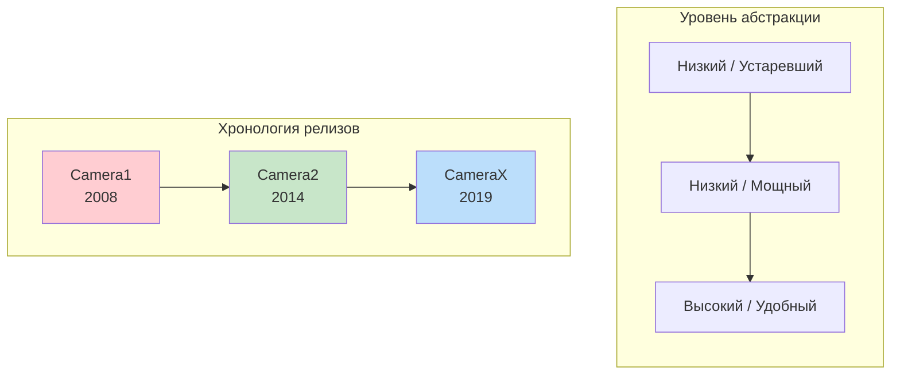
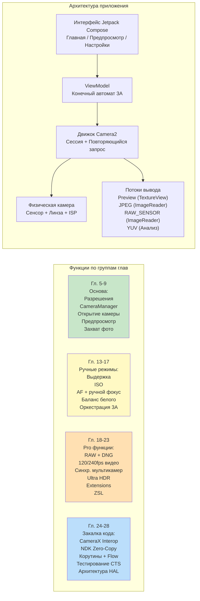

# Глава 1: Добро пожаловать в Android Camera2

> **Обзор главы:** В этой вступительной главе мы посмотрим на общую картину. Зачем существует Camera2? Какие проблемы он решает по сравнению со старым API Camera и новой библиотекой CameraX? Кому стоит тратить время на изучение Camera2? И, что самое важное, что именно вы создадите к концу этой серии? Пока никакой глубокой архитектуры, слоев HAL и диаграмм конвейера — только четкие ответы на вопросы, которые задает каждый разработчик перед тем, как погрузиться в тему.

***

## 1.1 Почему Camera2?

Достаньте свой смартфон.

Посмотрите на его заднюю панель. Скорее всего, вы увидите два, три или даже больше объективов. В этом маленьком прямоугольном выступе скрыто больше оптической и кремниевой мощи, чем в профессиональном зеркальном фотоаппарате середины 2000-х годов.

Теперь откройте стандартное приложение камеры.

Нажмите на затвор. Мгновенно в вашей галерее сохраняется фотография высокого разрешения. Скорее всего, она выглядит отлично — сочные цвета, резкие объекты, плавное размытие фона и проработанные детали в тенях даже при комнатном свете.

Но приложение камеры, которым вы пользуетесь, лишь слегка касается того, на что способно железо. Под этой дружелюбной кнопкой затвора скрыт невероятно сложный конвейер обработки изображений: тот, который может снимать фотографии в RAW, записывать замедленное видео со скоростью 240 кадров в секунду, объединять 10 кадров в один ночной снимок или независимо управлять каждым микроном движения линзы.

Большинство сторонних приложений для Android никогда не используют эту мощь. Почему? Потому что **старый API камер Android (ретроспективно названный Camera1) был крайне ограничен**. Camera1 проектировался для мира однокамерных телефонов с базовыми функциями фото- и видеосъемки. Он не умел:

- Управлять выдержкой или ISO вручную.
- Захватывать сырые данные сенсора (RAW).
- Записывать замедленное видео с высокой частотой кадров.
- Использовать несколько камер одновременно.
- Получать метаданные каждого кадра прямо во время съемки.
- Надежно выполнять серийную съемку.

Начиная с **Android 5.0 (API level 21)**, Google представила **Camera2 (android.hardware.camera2)**, чтобы разрушить эти преграды. Camera2 — это не просто обновление, это **полная переработка**, созданная с нуля, чтобы раскрыть возможности современного кремния камер каждому Android-разработчику.

Короче говоря: **Camera2 существует потому, что камеры смартфонов стали профессиональными, а старый API не справлялся.**

***

## 1.2 Camera1 vs Camera2 vs CameraX

За более чем десять лет разработки камер для Android появилось **три поколения** API. Прежде чем писать код, важно понять, какой API какую задачу решает.

### Три поколения, три философии

### Camera1 — `android.hardware.Camera`

Оригинальный API камер, представленный в Android 1.0 и **объявленный устаревшим (deprecated) в Android 5.0**.

- **Модель:** Процедурные команды. Вы вызываете методы типа `startPreview()`, `takePicture()`, `setFlashMode()`.
- **Философия дизайна:** «Камера — это конечный автомат, которым вы командуете».
- **Для чего подходит:** Только для поддержки очень старых устройств (до Lollipop).
- **Почему стоит избегать:** Google больше не обновляет его. Новые аппаратные функции (мультикамеры, RAW, HDR) никогда не будут добавлены в Camera1. На современных устройствах Camera1 фактически **эмулируется внутренней оберткой Camera2**, поэтому вы получаете сложность Camera2 без ее преимуществ.

### Camera2 — `android.hardware.camera2.*`

Современный низкоуровневый фреймворк, представленный в Android 5.0 и расширяемый в каждой версии Android с тех пор.

- **Модель:** Конвейер «запрос-ответ». Вы создаете неизменяемые объекты `CaptureRequest`, отправляете их в `CameraCaptureSession` и асинхронно получаете метаданные `CaptureResult` + буферы изображений.
- **Философия дизайна:** «Камера — это программируемый конвейер. Вы управляете каждым параметром каждого кадра».
- **Для чего подходит:** Продвинутые фотоприложения, инструменты ручной съемки, конвейеры компьютерного зрения, захват RAW, исследования мультикамер, скоростное видео и любые сценарии, где нужен прямой контроль над железом.
- **Почему стоит использовать:** Полный доступ ко всем возможностям, которые предоставляет производитель (HAL). Прямое управление кадрами. Единственный путь для реализации профессиональных функций. Именно Camera2 вызывается внутри CameraX.

### CameraX — `androidx.camera.*`

**Библиотека Jetpack** (не часть платформы Android), представленная в бета-версии в 2019 году и стабилизированная к Android 11.

- **Модель:** Декларативные случаи использования (use cases). Вы привязываете (`bindToLifecycle()`) набор сценариев `Preview`, `ImageCapture`, `ImageAnalysis` или `VideoCapture`, а библиотека делает всё остальное.
- **Философия дизайна:** «Мы решили за вас 10 000 пограничных случаев. Просто скажите, какой результат вам нужен».
- **Для чего подходит:** Большинство приложений, которым нужна камера. Сканеры QR-кодов, загрузка фото, сканирование документов, простая запись видео — любые сценарии, где удобство и надежность важнее полного контроля.
- **Почему стоит использовать:** Учитывает жизненный цикл (нет утечек ресурсов), автоматический выбор разрешения, встроенные исправления для особенностей разных OEM-устройств. Один и тот же код работает на тысячах моделей устройств.

### Сравнение по ключевым параметрам

| Измерение | Camera1 | Camera2 | CameraX |
|:---|:---|:---|:---|
| **Появление** | Android 1.0 (2008) | Android 5.0 (2014) | Android 10 (Jetpack) |
| **Статус** | Устарел | Активен, развивается | Рекомендуется (Jetpack) |
| **Абстракция** | Низкая (наследие) | Низкая | Высокая |
| **Порог входа** | Низкий | Очень высокий | Низкий |
| **Ручные ISO / выдержка / фокус** | Ограничено | Полный контроль | Ограничено (через Interop) |
| **Захват RAW** | Нет | Да | Через Interop |
| **Мультикамера (физ. потоки)** | Нет | Да | Нет |
| **Скоростное видео (120+ fps)** | Нет | Да | Ограничено |
| **Серии / Брекетинг** | Нет | Полный контроль | Нет |
| **Метаданные кадра** | Нет | Да, полные + частичные | Через колбэки Interop |
| **Безопасность ЖЦ** | Вручную, ошибки | Вручную, ошибки | Автоматически (Lifecycle) |
| **Исправления для устройств** | Нет | Нет | Встроены (1000+ устройств) |
| **Объем кода для работы** | Средний | Очень большой | Очень малый |
| **Производительность** | Средняя (обертка) | Максимально возможная | Почти максимальная |

***

## 1.3 Что может Camera2?

Чтобы наглядно понять мощь Camera2, представьте функции флагманских телефонов. Camera2 делает **все их программно доступными**:

### Профессиональная съемка

- **Полная ручная экспозиция:** Устанавливайте выдержку от 1/8000 с до 30 с и ISO от 50 до 102 400. Создайте настоящий интерфейс режима «Pro».
- **RAW-фотография:** Получайте 10-бит, 12-бит, 14-бит или 16-бит **необработанных данных Байера** прямо с сенсора (без демозаики, шумоподавления и цветокоррекции). Записывайте файлы Adobe DNG с помощью встроенного `DngCreator` для редактирования в Lightroom.
- **Брекетинг экспозиции:** Снимайте серии из 3, 5, 7 или 9 кадров с точно заданным шагом экспозиции (EV). Подавайте их в алгоритм слияния HDR.
- **Блокировка для таймлапса:** Зафиксируйте экспозицию, фокус и баланс белого на **тысячи кадров** — никакого мерцания при движении облаков.

### Доступ к вычислительной фотографии

- **Скоростное видео:** Настраивайте `CameraConstrainedHighSpeedCaptureSession` для захвата со скоростью 120, 240 или даже 960 кадров в секунду. Создавайте редакторы замедленного видео.
- **Логическая мультикамера:** Доступ к **обеим** физическим камерам под одним логическим ID **одновременно**. Получайте синхронизированные YUV-кадры с широкоугольного и телеобъектива для построения карт глубины.
- **Переобработка YUV / PRIVATE (устройства LEVEL_3):** Поддерживайте полноразрешенный **кольцевой буфер в ISP**, а при нажатии на затвор берите кадр из прошлого и применяйте к нему тяжелое шумоподавление. Так реализуется **Zero Shutter Lag (ZSL)**.
- **Ultra HDR / JPEG_R (Android 14+):** Записывайте файлы `ImageFormat.JPEG_R`, содержащие 8-битный SDR JPEG **плюс** вторичную карту усиления HDR. Старые просмотрщики увидят обычное фото, а HDR-панели отобразят яркие блики (1000+ нит).
- **Расширения камеры (Android 12+):** Делегируйте режимы Night, Bokeh (портрет), HDR и Face Retouch **в HAL производителя** — используя те же ИИ-алгоритмы, что и стандартная камера телефона.

### Продвинутое видео и зрение

- **Многопоточный вывод:** Запускайте **предпросмотр**, **YUV-анализ** (для распознавания объектов на 30 fps) и **JPEG-снимок** из одного запроса захвата — всё это без лишнего копирования памяти.
- **Точность вспышки:** Четко координируйте замер предвспышки, срабатывание основной вспышки и считывание сенсора на покадровой основе.
- **Частичные результаты (Partial Capture Results):** Получайте метаданные о состоянии экспозиции и фокусе за **миллисекунды до того**, как будет готов финальный кадр — это дает мгновенный отклик интерфейса.
- **Оффлайн-сеансы (API 30+):** Если пользователь свернул приложение в середине съемки ночного режима, передайте процесс объединения кадров в `CameraOfflineSession`, и HAL закончит работу асинхронно.

### И это только начало

Каждая новая версия Android расширяет Camera2. В Android 15 (API 35) добавлен `CameraDeviceSetup` для проверки конфигураций сессий **без включения сенсора**, что в 10 раз ускоряет проверку возможностей. API живет, развивается и всегда на шаг впереди новейшего железа.

***

## 1.4 Кому стоит учить Camera2?

Изучение Camera2 требует времени. Его API огромен — более 300 ключей метаданных, десятки обратных вызовов, несколько типов сессий и сотни особенностей разных производителей. Вам стоит инвестировать это время, если:

### Вы строите продвинутое приложение камеры

В вашем приложении есть режим «Pro» с ручными настройками ISO/выдержки/фокуса. Или оно снимает в RAW. Или записывает скоростное видео. Ничего из этого невозможно (или сильно ограничено) в CameraX.

### Вы разрабатываете приложение для компьютерного зрения или исследований

Вам нужны YUV-кадры с нулевым копированием и минимальной задержкой для нейросетей. Или вам нужны **синхронизированные с датчиками данные** (метка времени в `SENSOR_TIMESTAMP` должна совпадать с изображением с точностью до ±1 мс).

### Вы создаете инструмент диагностики возможностей камер

Как и приложение-компаньон к этой серии — **Android Camera Parameters** ([GitHub](https://github.com/zoozooll/AndroidCameraParameters), [Google Play](https://play.google.com/store/apps/details?id=com.minininja.cameraparams)) — вам нужно выгрузить каждый ключ `CameraCharacteristics`, чтобы увидеть, что поддерживает устройство. CameraX намеренно скрывает большинство этих деталей.

### Вы отлаживаете проблемы CameraX или системных камер

CameraX иногда ломается на специфических устройствах. Когда предпросмотр растянут или конкретная модель смартфона выдает зеленые кадры, вы **обязаны** спуститься на уровень Camera2, чтобы воспроизвести и изолировать баг.

### Вы работаете с автомобильными или встраиваемыми системами

Если вы касаетесь кода HAL производителя, нативного стека камер (NDK) или миграции автомобильных систем EVS на Camera2 — знание этого API является обязательным требованием.

### Кому **НЕ** нужно учить Camera2?

Если ваша задача: «Мне нужно дать пользователю сделать фото для профиля или отсканировать QR-код» — **используйте CameraX**. Серьезно. CameraX — это шедевр инженерной мысли. Он сэкономит вам месяцы работы над совместимостью. Camera2 — это тяжелый инструмент; беритесь за него только тогда, когда вам действительно нужна его мощь.

***

## 1.5 Что вы создадите в этой серии

Теория без кода абстрактна. Код без последовательности запутывает.

В этой книге вы будете **постепенно собирать реальное, полнофункциональное приложение на Camera2**. Каждая глава добавляет новую функцию. К финальной главе у вас будет готово целое приложение:

Это редкий и востребованный навык. Начнем путь.

***

## 1.6 Резюме

- **Camera2** — это современный низкоуровневый фреймворк камер Android, раскрывающий возможности мультикамерных смартфонов с мощными ISP.
- **Camera1** устарел; **CameraX** удобен для большинства задач, но скрывает мощь, которую дает только Camera2. Выбор зависит от требований.
- Camera2 открывает доступ к **ручному управлению, RAW, скоростному видео, мультикамерам, ZSL, Ultra HDR и расширениям производителей**.
- Изучайте Camera2, если создаете инструменты для профи, системы зрения, диагностические утилиты или работаете с системным уровнем.
- В этой книге вы **пошагово создадите полноценное приложение** — от одной кнопки в главе 9 до флагманского инструмента в главе 23.

## 1.7 Что дальше

Перед тем как писать код, нужно понять оборудование, которым мы командуем. В **Главе 2: Устройство камер смартфонов** вы узнаете, что на самом деле делает каждая часть модуля камеры: линза, сенсор, ISP, и как свет превращается в JPEG. К концу главы вы поймете, почему надпись «48 Мп» на коробке почти ничего не говорит о реальном качестве снимков.
