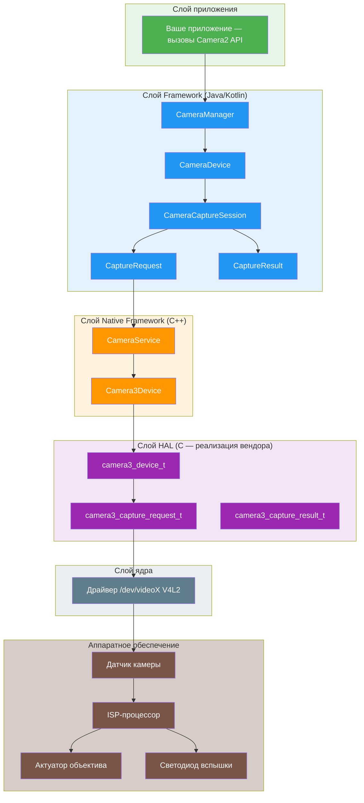
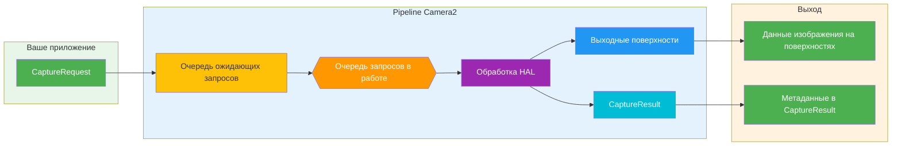
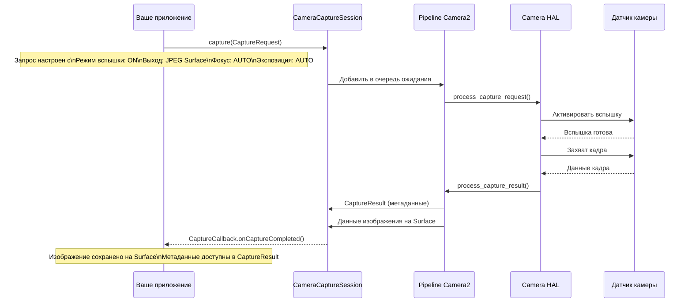
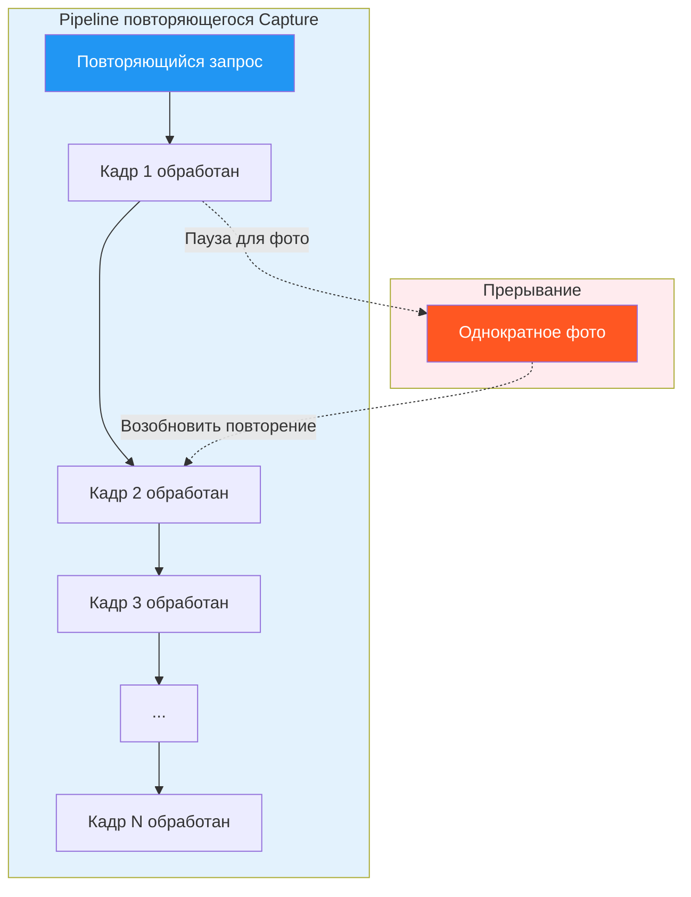
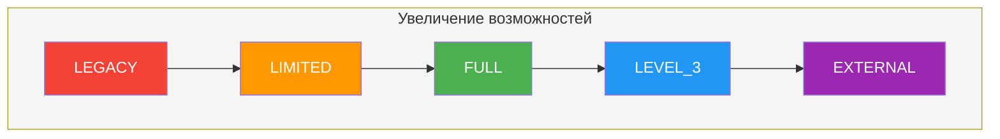
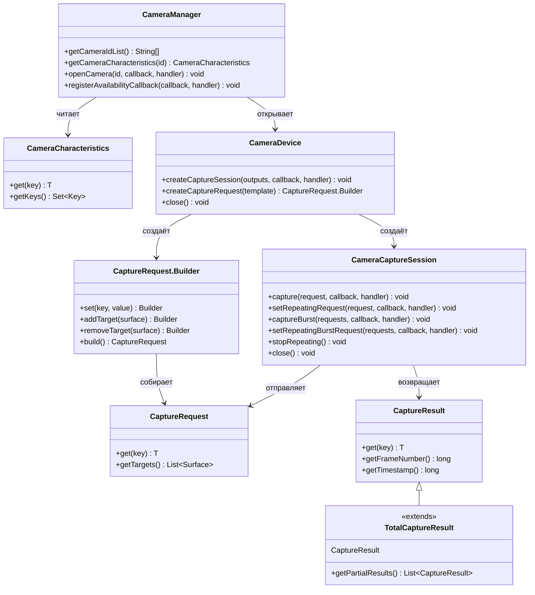
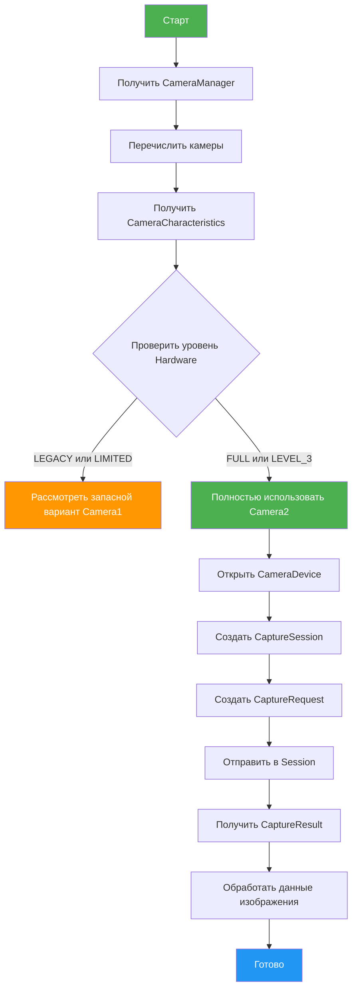
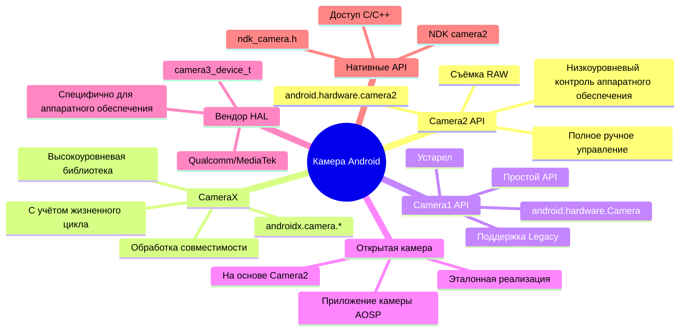

# Глава 1: Добро пожаловать в Android Camera2

> **Обзор главы:** В этой главе мы рассмотрим мир Android Camera2 с нуля. Вы поймёте не только *что* такое Camera2, но и *почему* он был создан, *как* он работает и *какое* место он занимает в экосистеме Android-камер. Мы рассмотрим модель Pipeline, типы Capture, классификацию Hardware Level и полную архитектуру — от приложения до HAL.

---

## 1.1 Зачем учить Camera2?

Почти каждый современный смартфон имеет мощную систему камеры. Современный телефон может:

- Делать фотографии профессионального качества с вычислительной фотографией
- Записывать видео 4K и 8K с высокой частотой кадров
- Создавать портретные эффекты с определением глубины
- Снимать в условиях крайне низкой освещённости с ночным режимом
- Записывать видео сверхзамедления с частотой 960 fps
- Генерировать 3D-информацию о глубине для AR-приложений
- Бесшовно объединять несколько камер

Но когда вы открываете стандартное приложение камеры, вы видите только простой интерфейс: кнопку спуска затвора, регулятор зума и несколько режимов съёмки.

За этим простым интерфейсом скрывается удивительно сложная система. Приложение камеры взаимодействует с аппаратными компонентами, обработчиками изображений и фреймворками Android для создания каждого отдельного кадра.

### Кому стоит учить Camera2?

Как Android-разработчики, мы можем захотеть создать приложения, выходящие за рамки стандартного приложения камеры:

- **Приложение для ручной фотографии** с полным контролем над экспозицией, ISO и фокусом
- **Инструмент тестирования камеры** для технических специалистов по проверке возможностей устройств
- **Приложение компьютерного зрения**, которому требуется прямой доступ к кадрам
- **Приложение 3D-сканирования** с использованием датчиков глубины
- **Профессиональный видеорекордер** с выбором кодека и контролем битрейта
- **Анализатор возможностей камеры**, как наш собственный [Android Camera Parameters](https://github.com/zoozooll/AndroidCameraParameters)

Если любой из этих сценариев вам знаком, Camera2 — это API, которым вам нужно овладеть.

---

## 1.2 Что такое Android Camera2?

**Android Camera2** — это современный фреймворк камеры, представленный Google в **Android 5.0 (уровень API 21)**. Он заменил исходный `android.hardware.Camera` API (теперь ретроактивно называемый **Camera1**).

### Проблема, которую решил Camera2

Старый API камеры (Camera1) был разработан для более простого мира: одна камера, базовая съёмка фото и простая запись видео. Но камеры смартфонов драматически развились:

| Эпоха | Типичное устройство | API камеры |
|-------|---------------------|------------|
| 2010–2014 | Одна камера, базовый датчик | Camera1 |
| 2015–2018 | Две камеры, OIS, HDR | Camera2 (ограниченное использование) |
| 2019–2022 | Три камеры, глубина, телефото | Camera2 (стандартное) |
| 2023+ | Четыре камеры, перископ, LiDAR, UWB | Camera2 (незаменимое) |

Современные устройства могут содержать несколько задних камер (широкоугольная, ультраширокоугольная, телефото, перископ), датчики глубины и даже внешние USB-камеры. Они поддерживают расширенные функции, такие как:

- Ручная экспозиция и фокус
- Съёмка RAW-изображений
- Высокоскоростная запись видео
- HDR-обработка
- Оптическая стабилизация (OIS)
- Мультикамерная фьюзия

Camera2 был создан, чтобы дать разработчикам **глубокий, точный и детальный контроль** над аппаратным обеспечением камеры.

---

## 1.3 Camera2 против Camera1 против CameraX

Прежде чем углубиться в Camera2, давайте разберёмся в отношениях между тремя основными API камеры.

### Camera1 (`android.hardware.Camera`)

- **Представлен:** Android 1.0 (устарел в Android 5.0)
- **Модель:** процедурная, с сохранением состояния, ориентирована на одну камеру
- **Сильные стороны:** простой, понятный, широко совместимый
- **Слабые стороны:** ограниченный контроль, нет поддержки RAW, нет мультикамеры, нет серийной съёмки

### Camera2 (`android.hardware.camera2`)

- **Представлен:** Android 5.0 (API 21)
- **Модель:** объектно-ориентированная, без сохранения состояния, pipeline запрос/ответ
- **Сильные стороны:** глубокий контроль над аппаратным обеспечением, поддержка RAW, мультикамера, высокоскоростное видео
- **Слабые стороны:** сложный, многословный, требует понимания внутреннего устройства камеры

### CameraX (`androidx.camera.*`)

- **Представлен:** Android 10 (предварительная версия), стабильный в Android 11+
- **Модель:** декларативная, с учётом жизненного цикла, ориентирована на сценарии использования
- **Сильные стороны:** простой в использовании, автоматическая совместимость, управление жизненным циклом
- **Слабые стороны:** ограниченный расширенный контроль, может не раскрывать все аппаратные функции

### Сравнительная таблица

| Измерение | Camera1 | Camera2 | CameraX |
|-----------|---------|---------|---------|
| **Уровень** | Низкоуровневый (устарел) | Низкоуровневый (текущий) | Высокоуровневый (Jetpack) |
| **Сложность** | Лёгкий | Сложный | Лёгкий |
| **Контроль** | Минимальный | Максимальный | Умеренный |
| **Поддержка RAW** | Нет | Да | Ограниченная |
| **Мультикамера** | Нет | Да | Ограниченная |
| **Серийная съёмка** | Нет | Да | Нет |
| **Ручное управление** | Ограниченное | Полное | Ограниченное |
| **Лучше для** | Legacy-приложений | Расширенных приложений камеры | Большинства приложений камеры |
| **Статус** | Устарел | Активный | Рекомендуемый |

### Почему этот фокусируется на Camera2

Хотя CameraX рекомендуется для большинства приложений, понимание Camera2 необходимо, потому что:

1. **CameraX построен на Camera2** — CameraX использует Camera2 под капотом. Понимание Camera2 помогает понять, что делает CameraX.
2. **Некоторые функции доступны только в Camera2** — съёмка RAW, ручной контроль датчика и расширенные мультикамерные сценарии требуют Camera2.
3. **Отладка требует знаний Camera2** — когда приложение CameraX работает не так, как ожидается, часто нужно понимать поведение базового Camera2 для диагностики проблем.
4. **Понимание Camera2 является фундаментальным** — даже если вы используете CameraX для своего приложения, понимание Camera2 делает вас лучшим Android-разработчиком камеры.

---

## 1.4 Архитектура Camera2: общая картина

Camera2 находится в центре стека камеры Android, связывая код приложения с аппаратными драйверами. Понимание этой архитектуры критически важно для отладки и оптимизации.

### Многослойная архитектура



### Объяснение слоёв архитектуры

| Слой | Расположение | Язык | Ответственность |
|------|-------------|------|-----------------|
| **Приложение** | Код вашего приложения | Kotlin/Java | Создание CaptureRequest, обработка CaptureResult |
| **Framework (Java)** | `android.hardware.camera2.*` | Java | Публичный API, управление сессиями, преобразование данных |
| **Native Framework** | `frameworks/av/` | C++ | Binder IPC, CameraService, Camera3Device |
| **HAL** | `hardware/libhardware/` + vendor | C | Абстракция аппаратного обеспечения, реализация вендора |
| **Ядро** | `/dev/videoX` | C | Драйвер V4L2, взаимодействие с аппаратным обеспечением |
| **Аппаратное обеспечение** | Физический модуль камеры | — | Датчик, ISP, объектив, вспышка |

### Основной принцип дизайна: Camera2 — это Pipeline

Самая важная концепция, которую нужно понять о Camera2, — это то, что он моделирует операции камеры как **pipeline**. Каждое действие — предпросмотр, съёмка фото, запись видео — выражается как **Capture Request**, который проходит через pipeline и создаёт **Capture Result**.

---

## 1.5 Модель Pipeline Camera2

Pipeline — это сердце дизайна Camera2. Он заменяет модель Camera1 с сохранением состояния и последовательным выполнением на модель без сохранения состояния типа запрос/ответ.

### Как работает Pipeline



### Компоненты Pipeline с описанием

| Компонент | Описание |
|-----------|----------|
| **CaptureRequest** | Объект конфигурации, описывающий *один кадр* съёмки. Содержит все параметры: время экспозиции, режим фокуса, вспышку, выходные поверхности и т.д. |
| **Очередь ожидающих запросов** | FIFO-очередь, в которой новые CaptureRequest ждут обработки |
| **Очередь запросов в работе** | Запросы, которые сейчас обрабатываются HAL. Обычно ограничена 1–4 запросами в зависимости от устройства |
| **Обработка HAL** | Слой абстракции аппаратного обеспечения обрабатывает запрос: управляет датчиком, ISP, объективом и т.д. |
| **Выходные поверхности** | Изображения записываются на настроенные поверхности (поверхность предпросмотра, поверхность ImageReader и т.д.) |
| **CaptureResult** | Метаданные о съёмке: фактическое время экспозиции, состояние AF, временная метка и т.д. НЕ содержит данные изображения |

### Ключевые свойства Pipeline

1. **Запросы без сохранения состояния** — каждый CaptureRequest содержит всю необходимую информацию. Pipeline не хранит память о предыдущих запросах.
2. **Обработка последовательна** — запросы обрабатываются HAL в порядке FIFO.
3. **Результаты асинхронны** — CaptureResult поступают через обратные вызовы, а не возвращаются синхронно.
4. **Несколько выходов на запрос** — один CaptureRequest может записываться на несколько поверхностей (например, предпросмотр + фото одновременно).
5. **Pipeline можно настроить** — вы можете выбрать шаблоны (предпросмотр, съёмка фото, запись) или полностью ручной режим.

### Конкретный пример: съёмка фото со вспышкой

Чтобы понять Pipeline, давайте проследим, что происходит при съёмке фото со вспышкой:



---

## 1.6 Типы Capture: однократный, серийный и повторяющийся

Camera2 определяет три фундаментальных типа Capture, каждый из которых служит разным сценариям использования. Понимание их критически важно для правильной разработки приложений камеры.

### Тип 1: Однократный Capture

**Однократные** съёмки выполняются ровно один раз. Они идеальны для одиночных действий, таких как съёмка фото или применение одноразового изменения настроек.


**Сценарии использования:**
- Съёмка одного фото
- Применение временной вспышки
- Захват кадра для анализа
- Однократный запуск автофокуса

**Вызов API:**
```kotlin
cameraCaptureSession.capture(captureRequest, callback, handler)
```

### Тип 2: Серийный Capture

**Серийные** съёмки выполняются несколько раз подряд без перерыва. После запуска другие запросы не могут быть вставлены до завершения серии.


**Ключевые характеристики:**
- Все кадры в серии имеют одинаковые или постепенно отличающиеся настройки
- Во время серии не могут обрабатываться другие запросы
- Очередь серии отделена от очереди ожидающих запросов
- Более высокий приоритет, чем у повторяющихся запросов

**Сценарии использования:**
- Непрерывная съёмка фото (серийный режим)
- Брекетинг (съёмка одного и того же сценария с разной экспозицией)
- Анализ движения (съёмка быстродвижущихся объектов)
- Последовательный многокадровый захват для комбинирования

**Вызов API:**
```kotlin
cameraCaptureSession.captureBurst(burstRequests, callback, handler)
```

### Тип 3: Повторяющийся Capture

**Повторяющиеся** съёмки выполняются непрерывно, формируя основу для живого предпросмотра и записи видео. Когда активен повторяющийся запрос, он занимает pipeline между другими съёмками.



**Ключевые характеристики:**
- Одновременно может быть активен только один повторяющийся запрос (заменяет предыдущий)
- Прерывается однократными и серийными запросами, затем автоматически возобновляется
- Формирует основу предпросмотра и записи видео
- Не создаёт отдельные CaptureResult для каждого кадра (использует частичные результаты для эффективности)

**Сценарии использования:**
- Живой предпросмотр камеры
- Запись видео
- Непрерывный мониторинг фокуса
- Анализ кадров в реальном времени

**Вызов API:**
```kotlin
cameraCaptureSession.setRepeatingRequest(captureRequest, callback, handler)
// или для видео:
cameraCaptureSession.setRepeatingBurstRequest(burstRequests, callback, handler)
```

### Сравнение типов Capture

| Функция | Однократный | Серийный | Повторяющийся |
|---------|------------|---------|--------------|
| **Выполнение** | Один раз | Несколько (последовательно) | Непрерывно |
| **Приоритет** | Высокий | Самый высокий | Самый низкий |
| **Прерывание** | Нельзя прервать | Нельзя прервать | Можно прервать |
| **Очередь** | Очередь ожидания | Отдельная очередь серии | Занятие pipeline |
| **Типичное использование** | Фото, одиночный кадр | Серийный режим, брекетинг | Предпросмотр, видео |
| **Callback результата** | Один результат на вызов | Один результат на кадр | Результаты периодически |

### Система шаблонов Capture

Camera2 предоставляет предустановленные шаблоны для распространенных сценариев съёмки:

| Шаблон | Описание | Сценарий использования |
|--------|----------|----------------------|
| `TEMPLATE_PREVIEW` | Оптимизирован для живого предпросмотра | Предпросмотр камеры |
| `TEMPLATE_STILL_CAPTURE` | Оптимизирован для съёмки фото | Съёмка фотографий |
| `TEMPLATE_RECORD` | Оптимизирован для записи видео | Запись видео |
| `TEMPLATE_VIDEO_SNAPSHOT` | Фото во время записи видео | Снимок во время записи |
| `TEMPLATE_ZERO_SHUTTER_LAG` | Высокое качество, минимальная задержка | Серийная фотография |
| `TEMPLATE_MANUAL` | Все автоматические элементы управления отключены | Полное ручное управление |

Шаблоны — это ярлыки, которые предварительно настраивают распространённые параметры. Затем вы можете изменить отдельные настройки из шаблона.

---

## 1.7 Поддерживаемые уровни Hardware

Не все Android-устройства поддерживают полный набор функций Camera2. Чтобы решить эту проблему, Google определил **Поддерживаемые уровни Hardware** — систему классификации, которая сообщает разработчикам, чего ожидать от реализации камеры устройства.

### Классификация уровней Hardware



### Описание уровней

| Уровень | Описание | Поддержка Camera2 |
|---------|----------|-------------------|
| **LEGACY** | Обратная совместимость с Camera1. Вызовы Camera2 преобразуются в Camera1 под капотом. | Только базовые функции Camera1 |
| **LIMITED** | Некоторые функции Camera2 поддерживаются. Полный pipeline Camera2 не гарантирован. | Частичные функции Camera2 |
| **FULL** | Полный набор функций Camera2. Полный pipeline, ручное управление, мультикамера. | Все функции Camera2 |
| **LEVEL_3** | Всё из FULL, плюс переобработка YUV и дополнительные выходные потоки. | FULL + расширенные функции |
| **EXTERNAL** | Похож на LIMITED, но для внешних камер (USB и т.д.). | Поддержка внешних камер |

### Как проверить уровень Hardware

Вы можете запросить уровень Hardware с помощью `CameraCharacteristics`:

```kotlin
val cameraManager = getSystemService(Context.CAMERA_SERVICE) as CameraManager
val cameraId = cameraManager.cameraIdList[0]
val characteristics = cameraManager.getCameraCharacteristics(cameraId)

val hardwareLevel = characteristics.get(CameraCharacteristics.INFO_SUPPORTED_HARDWARE_LEVEL)
val levelName = when (hardwareLevel) {
    CameraCharacteristics.INFO_SUPPORTED_HARDWARE_LEVEL_LEGACY -> "LEGACY"
    CameraCharacteristics.INFO_SUPPORTED_HARDWARE_LEVEL_LIMITED -> "LIMITED"
    CameraCharacteristics.INFO_SUPPORTED_HARDWARE_LEVEL_FULL -> "FULL"
    CameraCharacteristics.INFO_SUPPORTED_HARDWARE_LEVEL_3 -> "LEVEL_3"
    CameraCharacteristics.INFO_SUPPORTED_HARDWARE_LEVEL_EXTERNAL -> "EXTERNAL"
    else -> "UNKNOWN"
}
Log.d("Camera", "Hardware Level: $levelName")
```

### Практические последствия

| Уровень | Что это значит для вашего приложения |
|---------|--------------------------------------|
| **LEGACY** | Camera2 может работать, но с ограничениями. Рассмотрите Camera1 как запасной вариант. |
| **LIMITED** | Базовые функции Camera2 работают. Некоторые расширенные функции могут отсутствовать. |
| **FULL** | Полная поддержка Camera2. Можно безопасно использовать все функции Camera2. |
| **LEVEL_3** | Можно использовать переобработку YUV и расширенные мультипотоковые функции. |
| **EXTERNAL** | Можно поддерживать USB-камеры и другие внешние входы. |

### Запрос возможностей во время выполнения

Помимо уровня hardware, всегда проверяйте конкретные возможности во время выполнения:

```kotlin
val capabilities = characteristics.get(CameraCharacteristics.REQUEST_AVAILABLE_CAPABILITIES)
capabilities?.forEach { capability ->
    when (capability) {
        CameraMetadata.REQUEST_AVAILABLE_CAPABILITIES_BACKWARD_COMPATIBLE ->
            Log.d("Camera", "Supports backward compatible mode")
        CameraMetadata.REQUEST_AVAILABLE_CAPABILITIES_MANUAL_SENSOR ->
            Log.d("Camera", "Supports manual sensor control")
        CameraMetadata.REQUEST_AVAILABLE_CAPABILITIES_MANUAL_POST_PROCESSING ->
            Log.d("Camera", "Supports manual post-processing")
        CameraMetadata.REQUEST_AVAILABLE_CAPABILITIES_RAW ->
            Log.d("Camera", "Supports RAW capture")
        CameraMetadata.REQUEST_AVAILABLE_CAPABILITIES_PRIVATE_REPROCESSING ->
            Log.d("Camera", "Supports private reprocessing")
        CameraMetadata.REQUEST_AVAILABLE_CAPABILITIES_DEEP_OUTPUT ->
            Log.d("Camera", "Supports deep output")
    }
}
```

---

## 1.8 Обзор основных классов Camera2

API Camera2 построен вокруг небольшого набора основных классов. Давайте познакомимся с ними, прежде чем углубиться в каждый из них.

### Диаграмма взаимосвязи основных классов



### Ответственность классов

| Класс | Пакет | Ответственность |
|-------|-------|-----------------|
| `CameraManager` | `android.hardware.camera2` | Верхнеуровневый системный сервис. Перечисляет камеры, предоставляет доступ к CameraDevice. |
| `CameraCharacteristics` | `android.hardware.camera2` | Только для чтения метаданные о возможностях камеры. |
| `CameraDevice` | `android.hardware.camera2` | Представляет подключённую камеру. Создаёт сессии и конструкторы запросов на съёмку. |
| `CameraCaptureSession` | `android.hardware.camera2` | Экземпляр pipeline. Отправляет CaptureRequest, управляет повторяющимися съёмками. |
| `CaptureRequest` | `android.hardware.camera2` | Неизменяемая конфигурация съёмки. Все параметры для одного кадра. |
| `CaptureRequest.Builder` | `android.hardware.camera2` | Конструктор для создания объектов CaptureRequest. |
| `CaptureResult` | `android.hardware.camera2` | Выходные метаданные из завершённой съёмки. |
| `TotalCaptureResult` | `android.hardware.camera2` | Полный результат съёмки, включая все частичные результаты. |

### Рабочий процесс Camera2



---

## 1.9 Camera2 против Camera1: подробное сравнение

Если вы работали с Camera1 раньше, вы оцените различия. Если нет, этот раздел поможет вам понять, почему Camera2 является фундаментальной переработкой.

### Сравнение архитектур

| Аспект | Camera1 | Camera2 |
|--------|---------|---------|
| **Модель программирования** | Процедурная (императивная) | Объектно-ориентированная (декларативная) |
| **Управление состоянием** | С сохранением состояния (камера поддерживает состояние) | Без сохранения состояния (каждый запрос самодостаточен) |
| **Модель съёмки** | Команды (takePicture(), startPreview()) | Pipeline (CaptureRequest → CaptureResult) |
| **Потоки** | В основном однопоточная | Разработано для многопоточного использования |
| **Обработка ошибок** | Исключения, сложно восстановить | Коды ошибок + исключения, более детально |
| **Метаданные** | Только для чтения после съёмки | Доступны в реальном времени во время съёмки |
| **Множественные выходы** | Не поддерживаются | Один запрос → несколько поверхностей |
| **Zero-Copy** | Не поддерживается | Поддерживается через ImageReader |

### Сравнение API бок о бок

#### Открытие камеры

```kotlin
// Camera1 (старый API)
val camera = Camera.open()
camera.setPreviewDisplay(surfaceHolder)
camera.startPreview()

// Camera2 (новый API)
val cameraManager = getSystemService(Context.CAMERA_SERVICE) as CameraManager
cameraManager.openCamera(cameraId, object : CameraDevice.StateCallback() {
    override fun onOpened(camera: CameraDevice) {
        mCameraDevice = camera
        // Создание сессии и запросов...
    }
    override fun onDisconnected(camera: CameraDevice) { camera.close() }
    override fun onError(camera: CameraDevice, error: Int) { camera.close() }
}, handler)
```

#### Съёмка фото

```kotlin
// Camera1 (старый API)
camera.takePicture(null, null, object : Camera.PictureCallback() {
    override fun onPictureTaken(data: ByteArray, camera: Camera) {
        // Обработка данных изображения
    }
})

// Camera2 (новый API)
val requestBuilder = mCameraDevice.createCaptureRequest(CameraDevice.TEMPLATE_STILL_CAPTURE)
requestBuilder.addTarget(imageReader.surface)
val captureRequest = requestBuilder.build()
mCameraCaptureSession.capture(captureRequest, object : CameraCaptureSession.CaptureCallback() {
    override fun onCaptureCompleted(session: CameraCaptureSession, 
                                    request: CaptureRequest, 
                                    result: TotalCaptureResult) {
        // Метаданные в результате
        val exposureTime = result.get(CaptureResult.SENSOR_EXPOSURE_TIME)
    }
}, handler)
// Данные изображения поступают через ImageReader.OnImageAvailableListener
```

#### Ключевые различия на практике

| Операция | Camera1 | Camera2 |
|----------|---------|---------|
| **Предпросмотр + Фото** | Нужно остановить предпросмотр для съёмки фото, затем перезапустить | Можно сделать фото без остановки предпросмотра |
| **Множественные фото** | Только по одному фото за раз | Серийный режим с произвольным количеством |
| **Ручная экспозиция** | Недоступна | Полный контроль над временем экспозиции и усилением |
| **Ручной фокус** | Только предустановленные режимы | Полный контроль над позицией объектива |
| **Съёмка RAW** | Недоступна | Поддерживается на устройствах FULL+ |
| **Метаданные в реальном времени** | Недоступны | Доступны через частичные CaptureResult |

### Советы по миграции с Camera1

Если вы мигрируете с Camera1 на Camera2, помните эти советы:

1. **Думайте в терминах CaptureRequest**, а не команд. Каждое действие — фокус, вспышка, фото — это CaptureRequest.
2. **Отделите предпросмотр от съёмки**. В Camera1 приходилось останавливать предпросмотр для захвата. В Camera2 вы отправляете отдельный запрос, пока повторяющийся запрос продолжается.
3. **Используйте обработчики для обратных вызовов**. Обратные вызовы Camera2 выполняются в потоке Handler. Всегда предоставляйте его, чтобы избежать ANR.
4. **Сначала проверьте уровень Hardware**. Если устройство имеет уровень LEGACY, рассмотрите возможность использования Camera1 вместо этого.
5. **Используйте шаблоны CaptureRequest** для распространённых операций. Изменяйте настройки из шаблонов, а не создавайте с нуля.
6. **Не блокируйте основной поток**. Все операции Camera2 должны выполняться в фоновом потоке.

---

## 1.10 Camera2 в экосистеме Android

Camera2 не существует в изоляции. Он является частью большей экосистемы API и библиотек, связанных с камерой.

### Экосистема API камеры



### Когда использовать какой API

| Требование | Рекомендуемый API | Причина |
|------------|------------------|---------|
| Простое приложение камеры | CameraX | Самое простое, самое совместимое |
| Запись видео | CameraX | Встроенная поддержка видео |
| Ручная фотография | Camera2 | Полный контроль над всеми параметрами |
| Компьютерное зрение | Camera2 | Прямой доступ к кадрам, минимальная задержка |
| Мультикамерная фьюзия | Camera2 | Только API с полной поддержкой мультикамеры |
| Съёмка RAW | Camera2 | Только API с поддержкой RAW |
| Внешняя камера | Camera2 | Поддержка внешних камер (уровень EXTERNAL) |
| Поддержка старых устройств | Camera1 | Совместимость с старыми устройствами |

---

## 1.11 Обучение с Android Camera Parameters

Чтение документации полезно, но возможности камеры проще понять, когда вы видите реальные данные с реального телефона. В течение этого серии мы будем использовать [Android Camera Parameters](https://github.com/zoozooll/AndroidCameraParameters), чтобы изучить реальную информацию о камере вашего собственного устройства.

Вы можете использовать приложение, чтобы узнать:

- Доступные камеры (ID, направление, уровень hardware)
- Поддерживаемые разрешения и частоты кадров
- Информацию о датчике (размер активной области, фокусное расстояние)
- Поддержку ручного управления (диапазон ISO, диапазон времени экспозиции)
- Возможность RAW и форматы
- Уровень hardware и поддерживаемые возможности
- Полный дамп CameraCharacteristics

Вместо изучения на абстрактных примерах вы можете напрямую исследовать ваше собственное устройство и увидеть, как концепции этой главы применяются к реальному аппаратному обеспечению.

---

## 1.12 Ключевые выводы

Поздравляем с завершением Главы 1! Вот что вам следует запомнить:

### Основные концепции

1. **Camera2 — это pipeline** — каждая операция камеры представляет собой CaptureRequest, который проходит через pipeline и создаёт CaptureResult.
2. **Типы Capture** — однократный (одиночный), серийный (несколько последовательных), повторяющийся (непрерывный)
3. **Уровни Hardware** — LEGACY → LIMITED → FULL → LEVEL_3 → EXTERNAL
4. **Слои архитектуры** — Приложение → Framework → Native Framework → HAL → Ядро → Аппаратное обеспечение

### Практические принципы

1. **Всегда проверяйте уровень Hardware** — не все устройства поддерживают полные функции Camera2
2. **Проверяйте возможности во время выполнения** — не предполагайте, что функции доступны
3. **Используйте шаблоны для распространённых операций** — `TEMPLATE_PREVIEW`, `TEMPLATE_STILL_CAPTURE` и т.д.
4. **Работайте в фоновых потоках** — операции Camera2 не должны блокировать основной поток
5. **Отделяйте предпросмотр от съёмки** — используйте повторяющийся запрос для предпросмотра, однократный для фото

### Что дальше

В следующей главе, **Понимание камер смартфонов**, мы временно оставим Android и изучим само аппаратное обеспечение камеры. Вы узнаете о:

- Технологии датчиков камеры (CMOS против CCD)
- Дизайне объективов и фокусном расстоянии
- Pipeline обработки ISP (Image Signal Processor)
- Почему два телефона с похожим количеством мегапикселей могут создавать совершенно разные фото
- Полном pipeline изображения — от света до финального фото

Когда вы поймёте аппаратное обеспечение, концепции Camera2 станут намного более интуитивными.

---

## 1.13 Итог

Android Camera2 — это мощный низкоуровневый фреймворк камеры, который даёт разработчикам беспрецедентный контроль над аппаратным обеспечением камеры. Его архитектура на основе Pipeline, три типа Capture и классификация Hardware Levels обеспечивают надёжную основу для создания расширенных приложений камеры.

В этой главе мы рассмотрели:
- ✅ Архитектуру Camera2 и его место в экосистеме
- ✅ Модель Pipeline с потоком запрос/результат
- ✅ Типы Capture: однократный, серийный, повторяющийся
- ✅ Классификацию уровней Hardware и проверку во время выполнения
- ✅ Обзор основных классов и их взаимосвязей
- ✅ Подробное сравнение Camera1 и Camera2

Теперь давайте погрузимся в само аппаратное обеспечение камеры во Второй главе! 🚀