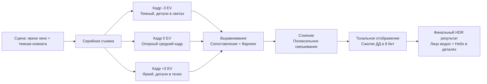
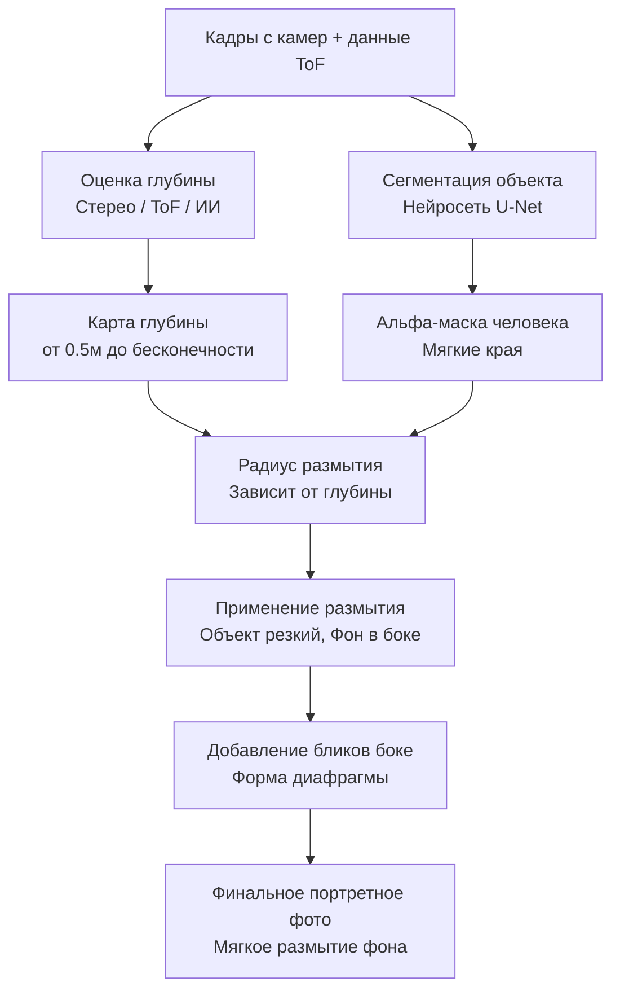
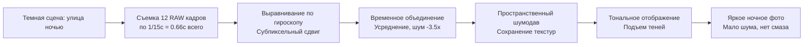
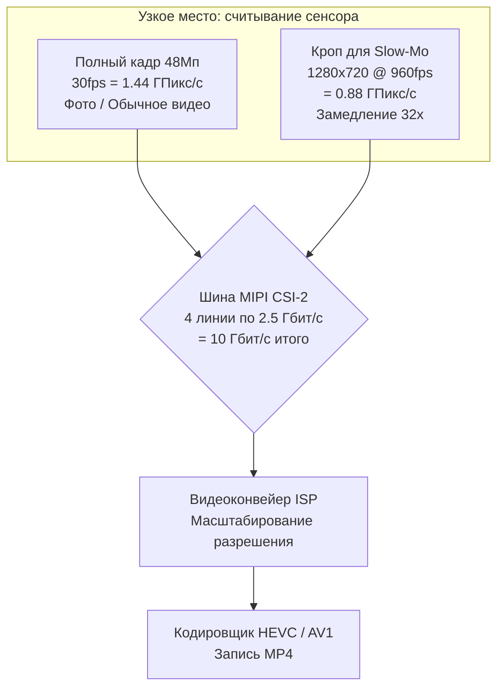
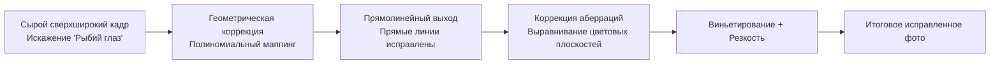
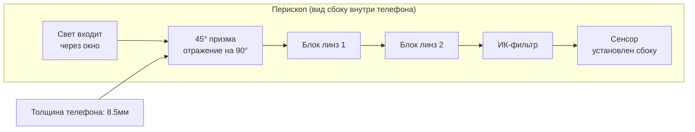
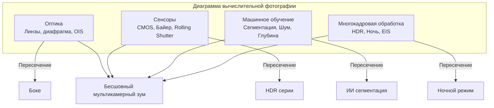

# Глава 3: Возможности современной мобильной фотографии

Глава 2 заложила аппаратный фундамент: объективы, сенсоры, конвейеры ISP и мультикамерные модули. Эта глава отвечает на естественный вопрос: **как современные приложения камер используют это оборудование для создания снимков, которые мы видим в соцсетях?**

Смартфон 2010 года делал одну экспозицию, прогонял ее через базовый ISP и записывал JPEG. Смартфон 2026 года для одной фотографии обычно делает от 5 до 15 отдельных кадров, выравнивает их с субпиксельной точностью с помощью данных гироскопа, объединяет их методами многокадровой обработки сигналов, прогоняет результат через нейросеть для сегментации или оценки глубины и, наконец, выполняет тональное отображение в единое изображение — и всё это за время одного нажатия на кнопку затвора.

Эта глава представляет собой обзор функций современной мобильной фотографии. Мы объясним, как каждая функция работает на уровне железа и софта, не касаясь кода API Camera2. Цель — сформировать представление о возможностях современных систем камер, чтобы позже, когда вы будете писать код для управления этими функциями, вы понимали, что происходит «под капотом».

## HDR: Многокадровое слияние с высоким динамическим диапазоном

**Динамический диапазон** — это отношение между самыми яркими и самыми темными частями сцены, которые система обработки изображений может зафиксировать одновременно без потери деталей (клиппинга). Человеческий глаз может воспринимать примерно 20 ступеней динамического диапазона (коэффициент контрастности 1 000 000:1) одним взглядом благодаря саккадической адаптации. Одна экспозиция сенсора смартфона при базовом ISO может зафиксировать примерно 10–12 ступеней. Разрыв между этими двумя числами и является причиной существования HDR.

Представьте, что вы фотографируете в помещении, а за объектом съемки находится яркое окно. Если вы выставите экспозицию по лицу человека (скажем, 1/30 с, ISO 400), окно превратится в чистое белое пятно — ни неба, ни облаков, никаких деталей. Если вы выставите экспозицию по окну (1/2000 с, ISO 50), лицо человека станет черным силуэтом. Ни одна одиночная экспозиция не сработает.

### Как работает HDR в смартфоне

Каждая система HDR на современных телефонах использует **многокадровый брекетинг** с последующим вычислительным слиянием. Алгоритм работает следующим образом:

1. **Брекетинг захвата**: камера делает быструю серию из 3–10 последовательных кадров с разными значениями экспозиции (EV). Типичный набор может включать кадры с −3 EV (очень короткая выдержка, сохраняет детали в светах), −1 EV, +1 EV и +3 EV (очень длинная выдержка, прорабатывает тени). Сенсор и объектив остаются неподвижными; меняется только время работы электронного затвора.
2. **Выбор опорного кадра**: алгоритм выбирает самый резкий кадр со средней экспозицией в качестве геометрического эталона.
3. **Регистрация / выравнивание изображений**: каждый неопорный кадр вычислительно выравнивается по опорному. Алгоритм находит характерные точки (углы, края) с помощью таких алгоритмов, как FAST или SIFT, вычисляет аффинное преобразование или гомографию, которая сопоставляет признаки каждого кадра с опорным, и соответствующим образом деформирует пиксели. Любые слишком размытые кадры (из-за дрожания рук во время съемки серии) отбрасываются.
4. **Слияние (Fusion)**: для каждой позиции пикселя в финальном изображении алгоритм объединяет информацию из выровненных кадров. Недоэкспонированные пиксели дают чистые детали в светах. Переэкспонированные пиксели дают малошумные данные в тенях. Пиксели средних тонов усредняются по всем кадрам для уменьшения дробового шума.
5. **Тональное отображение (Tone mapping)**: полученное линейное изображение, которое теперь может содержать от 14 до 18 ступеней полезного динамического диапазона, сжимается сложным оператором локального тонального отображения в 8-битное или 10-битное выходное изображение, которое хорошо выглядит на стандартном sRGB-дисплее.

Пример из реальной жизни: Galaxy S26 Ultra в режиме HDR по умолчанию делает серию из 7 кадров общей длительностью около 0,2 секунды. Встроенная система обнаружения движения рук отбрасывает 2 размытых кадра. Остальные 5 выравниваются, объединяются и проходят тональное отображение. Результат записывается в файл **JPEG_R Ultra HDR** на устройствах с Android 14+: это стандартное основное изображение JPEG (8-бит SDR) с внедренной картой усиления (gain map), которую HDR-совместимые просмотрщики (Галерея Android 14, Chrome 120+, Adobe Lightroom) могут использовать для восстановления полного 10-битного диапазона яркости на дисплеях HDR10 или Dolby Vision.

### Когда HDR работает, а когда нет

HDR отлично подходит для статичных сцен с яркими светами и глубокими тенями: пейзажи, портреты в контровом свете, комнаты с окнами, закаты над водой. Он может давать сбои — создавая артефакты-призраки (ghosting) — когда объекты в сцене движутся во время съемки серии: летящая птица, развевающийся флаг, моргающий человек, бегущий ребенок. Современные ИИ-алгоритмы HDR обнаруживают и сегментируют движущиеся объекты, смешивая для этих пикселей только данные из опорного кадра, чтобы избежать классических «призраков».

## Портретный режим: Боке через оценку глубины

Портретный режим создает эффект, при котором лицо объекта идеально резкое, а фон растворяется в мягком размытии, называемом **боке**. Традиционные камеры достигают этого оптически с помощью больших сенсоров, широких диафрагм и больших фокусных расстояний. Смартфоны достигают этого вычислительно, так как сенсор 1/1,3 дюйма при f/1.6 естественным образом не дает достаточно малой глубины резкости для такого эффекта.

### Три метода оценки глубины в смартфонах

В современных портретных системах используются три независимых метода; многие телефоны используют их комбинацию.

**Метод 1: Стерео-диспаратность от двух камер.** Это старейший и наиболее геометрически обоснованный метод. Телефон одновременно задействует широкоугольную и телекамеру. Поскольку две камеры физически разнесены на 10–15 миллиметров (база), они видят объект с немного разных горизонтальных позиций. Положение переднего плана смещается между двумя точками зрения сильнее, чем положение удаленного фона. Это смещение называется **диспаратностью**. Алгоритм сопоставления блоков или полуглобального сопоставления (SGM) вычисляет значение диспаратности для каждого пикселя. Диспаратность обратно пропорциональна глубине, поэтому карта диспаратности напрямую преобразуется в попиксельную карту глубины.

**Метод 2: Активное зондирование глубины ToF / LiDAR.** Датчик глубины ToF (Time-of-Flight) или LiDAR проецирует на сцену структурированный узор из 30 000+ лазерных точек ближнего ИК-диапазона, а затем измеряет время пролета луча (для прямого ToF) или фазовый сдвиг (для непрямого ToF) отраженного света, чтобы вычислить истинную метрическую глубину в метрах для каждого пикселя. ToF дает точные, плотные карты глубины даже в полной темноте и на нетекстурированных поверхностях (простые стены, небо), где стерео-сопоставление пасует. Современные системы обычно используют ToF как основной сигнал глубины, а стерео-диспаратность — как уточняющий.

**Метод 3: Монокулярная ИИ-оценка глубины.** Для телефонов с одной камерой (или для фронтальной селфи-камеры) нейросеть оценивает глубину по одному RGB-изображению. Модель, обученная на миллионах изображений с размеченными данными глубины, изучает статистические признаки, которые люди используют для оценки расстояния: относительный размер, перекрытие, линейная перспектива, градиент текстуры, размытие при дефокусировке и атмосферная перспектива. Монокулярная глубина менее точна метрически, чем стерео или ToF, но ее достаточно для создания правдоподобного боке.

### Конвейер рендеринга портрета

После получения карты глубины шаги остаются одинаковыми независимо от метода ее получения:

1. **Сегментация объекта**: отдельная нейросеть (обычно вариант U-Net) работает с основным изображением и создает мягкую альфа-маску, определяющую, какие пиксели относятся к «человеку», а какие — к «фону». Маска растушевывается по краям — особенно вокруг волос, очков и мелких деталей переднего плана — чтобы избежать вида вырезанной из бумаги фигурки.
2. **Уточнение глубины**: сырая карта глубины перемножается с маской сегментации. Пиксели фона сохраняют свои значения; пиксели объекта привязываются к глубине плоскости фокусировки.
3. **Попиксельное переменное размытие**: каждый пиксель фона размывается по Гауссу (или, в премиальных режимах «оптической симуляции», физически отрисованной сверткой с ядром линзы), радиус которого линейно зависит от расстояния пикселя до плоскости фокуса. Объект на расстоянии 5 метров размывается сильно, на 1,5 метра — слабо. Пиксели объекта копируются без изменений.
4. **Имитация оптических бликов**: премиальный штрих — яркие блики на размытом фоне (фонари, отражения, солнце) отрисовываются в виде характерных шестиугольников или кругов формы диафрагмы объектива. Это завершает иллюзию того, что размытие получено настоящей линзой.

## Ночной режим: Многокадровое временное объединение

До 2018 года съемка смартфоном при слабом освещении была практически невозможна без вспышки. Плохо освещенный бар или ночная улица превращались в шумную, зернистую и размытую кашу. Затем Google выпустила **Night Sight** в Pixel 3, и всё изменилось. Идея была контринтуитивной: вместо одной длинной экспозиции в 1 секунду (которая была бы безнадежно размыта из-за дрожания рук), сделайте 15 очень коротких экспозиций по 1/15 секунды (каждая из которых будет резкой благодаря OIS), а затем алгоритмически выровняйте и усредните их. Общее время накопления света всё равно составит 1 секунду, но короткая выдержка каждого кадра не дает накопиться смазу.

### Алгоритм ночного режима пошагово

1. **Серийная съемка**: камера делает от 8 до 15 RAW-кадров. Каждый кадр имеет умеренную выдержку (типично 1/15–1/8 с) и умеренное ISO (800–3200). Отдельные кадры шумные, но не размытые. Съемка всей серии занимает от 0,5 до 2 секунд.
2. **Выравнивание на базе гироскопа**: гироскоп телефона записывает угловую скорость с частотой 8 000 Гц на протяжении всей съемки. Для каждого кадра вычисляется накопленный поворот и смещение относительно опорного кадра. Затем каждый RAW-кадр цифровым образом сдвигается, поворачивается и слегка масштабируется (EIS) на нейропроцессоре (NPU) с субпиксельной точностью, идеально совмещаясь с опорным кадром, даже если руки пользователя заметно дрожали.
3. **Временное объединение пикселей**: для каждой позиции пикселя алгоритм собирает 12 (например) значений-кандидатов из всех кадров. Затем выполняется робастное статистическое объединение: аномальные значения (вызванные битыми пикселями или светом фар проезжающей машины) отбрасываются. Оставшиеся значения усредняются, что снижает гауссов дробовой шум на величину, равную квадратному корню из количества оставленных кадров. Объединение 12 кадров снижает шум в 3,5 раза.
4. **Пространственное шумоподавление**: нейросетевой шумоподавитель (обученный специально на ночных RAW-снимках) удаляет остаточный высокочастотный шум, сохраняя реальные края и текстуру.
5. **Локальное тональное отображение**: объединенное RAW-изображение имеет очень высокий динамический диапазон. Оператор тонального отображения (на базе билатеральной фильтрации или обученной нейросети) поднимает тени, не пересвечивая огни города, повышает насыщенность цветов в темных областях и создает итоговое 8-битное изображение, которое выглядит ярким и чистым.

«Nightography» от Samsung, «Night Mode» от Apple, «Night Mode 2.0» от Xiaomi и другие используют практически одну и ту же архитектуру алгоритмов. Различия заключаются в точном количестве кадров, выборе статистических методов объединения и эстетике тонального отображения, но само выравнивание по гироскопу и временное усреднение универсальны.

## Замедленная съемка (Slow Motion): Кадрированный захват с высокой частотой

Замедленное видео «растягивает» время, фиксируя кадры быстрее стандартной частоты 30 fps, а затем проигрывая их с нормальной скоростью. Распространенные множители:

- **120 fps → 30 fps = замедление в 4 раза.** Событие длительностью 1 секунду превращается в 4 секунды видео.
- **240 fps → 30 fps = замедление в 8 раз.**
- **960 fps → 30 fps = замедление в 32 раза.** Становятся видны всплеск капли воды, лопающийся шарик или взмах крыла колибри.

### Почему 960 fps требует обрезки (кропа)

Узким местом при скоростной съемке является **пропускная способность считывания сенсора**. Датчик изображения имеет конечное число линий MIPI CSI-2, работающих с максимальной скоростью (типично 2,5 Гбит/с на линию, 4 линии = 10 Гбит/с итого). Сенсор может выдавать только определенное количество пикселей в секунду.

- Считывание полного кадра 48 Мп (8000×6000) при 960 fps потребовало бы 48 000 000 × 960 = 46,08 миллиарда пикселей в секунду. Это в 30 раз больше реальной пропускной способности любого мобильного сенсора 2026 года.
- Следовательно, для достижения 960 fps сенсор должен считывать только небольшую центральную область своей матрицы. Режим 960 fps — это обычно кроп 1280×720 (720p HD) или иногда 1920×1080 (1080p FHD). Поток данных становится управляемым: 1280×720 × 960 fps = 884 мегапикселя в секунду, что укладывается в 10 Гбит/с даже при 10-битном кодировании.

Числа на практике: захват 960 fps в течение 0,3 секунды реального времени дает 288 кадров. При проигрывании на 30 fps это превращается в 9,6 секунд плавного замедленного видео. Некоторые флагманы поддерживают короткие серии 960 fps в 1080p, считывая данные через ограниченный банк АЦП только в центральной области.

## Сверхширокоугольный объектив: Коррекция искажений и качество краев

Сверхширокоугольная камера дает эквивалентное фокусное расстояние 10–18 мм и угол обзора 100–130°. Она открывает новые композиционные возможности: захватывающие пейзажи, архитектурные снимки зданий целиком, групповые селфи и эффект «перспективного искажения», когда объекты вблизи линзы кажутся огромными.

Однако такое фокусное расстояние несет в себе три оптических изъяна, которые ISP должен исправить:

1. **Геометрическая дисторсия**: прямые линии выгибаются наружу, как в объективе «рыбий глаз». Прямоугольная дверная рама будет выглядеть бочкой. Этап геометрической коррекции ISP применяет попиксельный пересчет координат, используя полиномиальную модель линзы, откалиброванную для конкретного модуля. Коррекция неизбежно «съедает» 5–10% внешних пикселей.
2. **Хроматические аберрации**: линза преломляет свет разной длины волны по-разному, поэтому красное, зеленое и синее изображения одной и той же точки попадают в чуть разные координаты. Результат — цветные ореолы на контрастных границах по углам. ISP исправляет это, применяя разный коэффициент масштабирования для плоскостей R и B относительно G.
3. **Виньетирование / нерезкость в углах**: угловые пиксели получают меньше света и линза там оптически слабее. ISP применяет радиальное усиление яркости и более агрессивный фильтр резкости по краям.

## Телеобъектив: Стандартный против перископического

Телеобъектив снимает удаленные объекты, которые основная камера не может разрешить. В современных телефонах используются две конструкции.

**Стандартный телеобъектив (2×–3× оптический зум):** это обычный модуль, где блок линз расположен перпендикулярно задней крышке, прямо над сенсором. Фокусное расстояние 3× составляет ~72 мм экв. Физическая высота ограничена толщиной телефона (7–9 мм), поэтому такой объектив не может быть длиннее. Отсюда практический потолок в 3× для обычных модулей.

**Перископический телеобъектив (5×–10× оптический зум):** чтобы получить большее фокусное расстояние, инженеры «сломали» оптический путь на 90° с помощью призмы. Свет входит через окно, ударяется о 45-градусную призму, поворачивает и идет горизонтально через длинный блок линз (10–14 мм), расположенный параллельно материнской плате, попадая на сенсор, установленный сбоку. Призма обычно установлена на 2-осевом стабилизаторе OIS, что позволяет получать четкие снимки на 10× даже с рук.

На границах зума (например, 2,9× кроп основной камеры против 3,1× телеобъектива) HAL выполняет фокус: в диапазоне ±0,2× он снимает обеими камерами и плавно переходит от одной к другой, чтобы пользователь не видел резкого «прыжка» картинки.

## Макросъемка: Крупный план экстремального уровня

Макросъемка фиксирует мелкие объекты: текстуру лепестков, глаза насекомых, волокна ткани.

Существует две стратегии макросъемки в современных телефонах:

**Выделенная макрокамера:** бюджетные модели часто оснащаются небольшим модулем низкого разрешения (2–5 Мп) с фиксированным фокусом на короткой дистанции (2–4 см). Сенсор там крошечный, поэтому качество быстро падает при любом освещении, кроме яркого солнца.

**Сверхширокоугольная камера в роли макро:** флагманы (Pixel, Samsung Ultra, iPhone Pro) не имеют отдельной макрокамеры. Вместо этого они переключают сверхширокоугольный объектив. Его короткое фокусное расстояние (13 мм экв.) дает очень малую дистанцию фокусировки — часто 1–2 см. Когда приложение обнаруживает близкий объект через ToF, оно переключается на «сверхширик», переводит его привод VCM в положение макро, применяет усиленную коррекцию искажений и делает кроп центра кадра. Большой сенсор флагманского «сверхширика» дает гораздо лучший результат, чем копеечный модуль на 2 Мп.

## Вычислительная фотография: Объединяющая философия

Все описанные функции — HDR, Портрет, Ночь, Slow Motion, коррекция дисторсии, зум — объединены одной идеей. **Вычислительная фотография** — это философия, согласно которой сенсор, ISP, гироскоп, нейропроцессор (NPU) и алгоритмы многокадровой обработки работают вместе для создания изображений, которые не может выдать ни одна комбинация линзы и сенсора сама по себе, какой бы дорогой ни была оптика.

Классическая модель зеркалки: свет → линза → сенсор → память. Модель смартфона: свет → несколько линз → несколько сенсоров → гироскоп → серийная съемка → нейросетевой вывод → попиксельное слияние решений → сложное тональное отображение → память. Обе модели начинаются и заканчиваются одинаково, но смартфон вставляет в середину десятки вычислительных шагов, каждый из которых улучшает результат способами, недоступными чистой оптике.

Плавный зум от 0,5× до 10× — это вычисления: HAL смешивает данные с трех камер. Спасение портрета в контровом свете — это вычисления: слияние 7 кадров HDR. Ночное фото Млечного Пути с рук — это вычисления: объединение 12 кадров по данным гироскопа. Каждая функция в этой главе — это вычислительная фотография.

Это самая важная мысль, которую стоит пронести через главы об API Camera2. Camera2 — это не просто инструмент, чтобы «сделать фотку». Это низкоуровневый интерфейс управления, позволяющий вашему приложению делать точные серии снимков, читать метаданные гироскопа для каждого кадра, выбирать физическую камеру на нужном зуме и прогонять кадры через нейросети — строительные блоки для реализации ваших собственных функций вычислительной фотографии.

## Резюме

В этой главе вы изучили алгоритмы, стоящие за современными функциями камер смартфонов. HDR использует брекетинг экспозиции из 3–10 кадров и тональное отображение. Портретный режим вычисляет глубину через стереозрение, ToF или ИИ, сегментирует человека и применяет переменное размытие. Ночной режим делает 8–15 коротких выдержек, выравнивает их по гироскопу и усредняет для снижения шума в 3,5 раза. Замедленное видео 960 fps требует кропа сенсора из-за ограничений шины MIPI. Сверхширокоугольные фото проходят через исправление дисторсии, аберраций и виньетирования. Перископические камеры используют призму для размещения длинной оптики в тонком корпусе. Вы узнали определение вычислительной фотографии: слияние оптики, сенсоров, машинного обучения и многокадровой обработки сигналов.

## Что дальше

Глава 4 — практическая. Вы установите приложение-компаньон **Android Camera Parameters** и изучите возможности именно вашего смартфона. Вы научитесь читать Camera ID, проверять уровень аппаратной поддержки (LEGACY / LIMITED / FULL / LEVEL_3), перечислять форматы вывода (JPEG, RAW, JPEG_R Ultra HDR), находить диапазоны FPS для замедленной съемки, исследовать точки переключения между физическими камерами и проверять поддержку RAW. Ответы для вашего конкретного устройства определят, что именно ваше приложение на Camera2 сможет на нем делать.
