# Глава 16: Баланс белого и цвет

Вы освоили яркость (экспозиция) и резкость (фокус). Теперь пришло время управлять **видом** — *цветовым тоном* изображения.

Когда вы фотографируете белый лист бумаги под лампой накаливания, ее теплый оранжевый свет падает на бумагу, и сенсор видит ее оранжевой. *Ваш мозг* мгновенно корректирует это и всё равно видит «белую бумагу», но сырые данные сенсора фиксируют правду: она оранжевая.

**Баланс белого (White Balance, WB)** — это процесс компенсации цвета источника света камерой, чтобы нейтральные белые объекты выглядели нейтральными. Ошибитесь здесь — и всё фото получит нежелательный оттенок (слишком оранжевый, синий или зеленый).

Приложение [Android Camera Parameters](https://github.com/zoozooll/AndroidCameraParameters) демонстрирует все пресеты AWB в виде сетки и предоставляет слайдеры ручного усиления — откройте приложение, перейдите на панель White Balance, и вы сможете увидеть в действии именно то, что мы реализуем в этой главе.

---

## Цветовая температура: Спектр от теплого к холодному

Источники света описываются их **цветовой температурой** в Кельвинах (К). Шкала описывает температуру теоретического «абсолютно черного тела», которое светится таким же цветом.

```mermaid
graph LR
    A["1800K<br/>Свет свечи"] --> B["2800K<br/>Лампа накаливания"]
    B --> C[3500K<br/>Теплый люминесцент]
    C --> D[4500K<br/>Холодный люминесцент]
    D --> E[5500K<br/>Дневной свет / Вспышка]
    E --> F[6500K<br/>Облачный день]
    F --> G[8000K<br/>Открытая тень]
    G --> H[10000K+<br/>Голубое небо]
    style A fill:#e67e22,color:#fff
    style B fill:#f39c12,color:#fff
    style C fill:#f1c40f,color:#333
    style D fill:#f9e79f,color:#333
    style E fill:#ffffff,color:#333,stroke:#333
    style F fill:#d4e6f1,color:#333
    style G fill:#85c1e9,color:#333
    style H fill:#3498db,color:#fff
```



**Парадоксальное правило:** Теплый свет = *низкое* число Кельвинов (свеча 1800К = очень оранжевая). Холодный свет = *высокое* число Кельвинов (небо 10000К = очень синее). Ваши глаза привыкают к этому с детства; вашему коду нужно помнить об этом явно.

| Сцена | Типичная цветовая темп. | Оттенок, если выбран WB Daylight |
|-------|-------------------|----------------------------|
| Ужин при свечах | 1800–2200K | Густой оранжевый / янтарный |
| Домашняя лампа | 2700–3000K | Оранжевый / желтый |
| Восход / Закат | 3000–4000K | Теплый золотистый (часто желаемый!) |
| Люминесцентная лампа | 4000–5000K | Зеленоватый оттенок |
| Полдень, солнце | 5200–5800K | Нейтральный правильный |
| Фотовспышка | 5500–6000K | Нейтральный (соответствует дню) |
| Сильная облачность | 6000–7500K | Слегка синеватый |
| Тень (без солнца) | 7000–9000K | Синий оттенок |
| Чистое синее небо | 9000–12000K | Глубокий синий |

Работа автобаланса белого (AWB): определить наиболее вероятный источник света по статистике сцены, а затем *вычесть* цветовой оттенок, чтобы нейтральные объекты выглядели нейтральными.

---

## Режимы автоматического баланса белого (AWB) в Camera2

Устанавливаются через `CaptureRequest.CONTROL_AWB_MODE`:

| Режим (CONTROL_AWB_MODE_*) | Эффект | Случай использования |
|---------------------------|--------|----------|
| `OFF` | Только ручной баланс белого. Используйте `COLOR_CORRECTION_GAINS` или `_TRANSFORM` явно. | Режим Pro, кастомная цветокоррекция, RAW |
| `AUTO` | По умолчанию. ISP непрерывно анализирует сцену. | Обычная фотография |
| `INCANDESCENT` | ~2800K. Сильное синее усиление для компенсации ламп накаливания. | Дом, сцена, вечерний интерьер |
| `FLUORESCENT` | ~4500K. Усиления для офисных ламп (склонны к зеленому). | Офис / школа |
| `WARM_FLUORESCENT` | ~3200K. Компенсация «теплых» люминесцентных трубок. | Дом, современные эконом-лампы |
| `DAYLIGHT` | ~5500K. Стандартный профиль полуденного солнца. | Улица, солнечный день, вспышка |
| `CLOUDY_DAYLIGHT` | ~6500K. Небольшое «утепление» для компенсации пасмурной погоды. | Пасмурный день |
| `TWILIGHT` | Профиль «золотого часа» (~4500K). | Закат, сумерки, теплый пейзаж |
| `SHADE` | ~7500K. Сильное красное усиление против глубокой синей тени. | Портрет в тени, городская тень |

**Сначала проверьте поддержку режимов:** Не каждое устройство поддерживает все 9 пресетов. Флагманы обычно поддерживают; бюджетные модели могут предлагать только `AUTO` + `OFF`.

```kotlin
val availableAwbModes = characteristics.get(
    CameraCharacteristics.CONTROL_AWB_AVAILABLE_MODES
) ?: intArrayOf()
Log.d("AWB", "Доступные режимы: ${availableAwbModes.toList()}")
```

### Состояния AWB (как у AF, но менее «разговорчивые»)

Конечный автомат AWB концептуально похож на AF, но проще — у него меньше состояний:

| Состояние AWB | Значение |
|-----------|---------|
| `CONTROL_AWB_STATE_INACTIVE` | AWB выключен (`AWB_MODE = OFF`) |
| `CONTROL_AWB_STATE_SEARCHING` | Поиск правильного осветителя (цвет может «плавать») |
| `CONTROL_AWB_STATE_CONVERGED` | Стабильный осветитель найден — цвет зафиксирован |
| `CONTROL_AWB_STATE_LOCKED` | Явно заблокирован через `CONTROL_AWB_LOCK = true` |

Используйте тот же паттерн «ожидания схождения перед захватом», что и для AF, для критически важной по цвету съемки (товары для каталогов, репродукции).

---

## Как работает коррекция баланса белого: Изнутри

AWB применяет две трансформации цвета, чтобы перейти от RGB сенсора к отображаемому sRGB. Понимание этого позволит вам полностью заменить AWB ручными значениями.

### Шаг 1: Канальные усиления (Коррекция точки белого)

Сначала умножьте каждый цветовой канал на коэффициент (gain), чтобы нейтральная поверхность имела равные значения R, G, B:

> Если сцена с лампой 3200К дает `[R=200, G=150, B=100]` с сенсора для серой цели, AWB применит коэффициенты примерно `R: 1.0, G: 1.33, B: 2.0`, чтобы нормализовать до `[200, 200, 200]`.

В Camera2 это представлено как **`CaptureRequest.COLOR_CORRECTION_GAINS`**: массив из 4 чисел float в порядке **[R, Geven, B, Godd]**.

Два зеленых канала (`Geven`, `Godd`) существуют потому, что многие сенсоры используют сетку Байера 2×2: чередующиеся строки **GR / BG**. Строки, начинающиеся с Green-R и Green-B, имеют немного разную спектральную чувствительность и требуют независимых цифровых усилений. Для обычной работы можно устанавливать оба зеленых в одно и то же значение.

```kotlin
// COLOR_CORRECTION_GAINS = [ R gain, G-even gain, B gain, G-odd gain ]
val warmGains = floatArrayOf(1.0f, 1.2f, 0.8f, 1.2f)  // Теплый: больше R, меньше B
val coolGains = floatArrayOf(0.85f, 1.0f, 1.25f, 1.0f) // Холодный: больше B, меньше R
val neutralGains = floatArrayOf(1.0f, 1.0f, 1.0f, 1.0f) // Единичные усиления (сырой цвет)
```

**Допустимый диапазон:** Коэффициенты обычно ограничиваются HAL в диапазоне [0.0, 4.0]. Используйте значения от 0.5× до 3× для правдоподобных результатов.

### Шаг 2: Матрица цветовой трансформации 3×3 (Маппинг охвата)

Канальные усиления корректируют только *точку белого*. Но разные сенсоры имеют разные нативные спектральные характеристики фильтров, а разные устройства отображения — разный цветовой охват (sRGB/Rec.709 против DCI-P3). **Матрица цветокоррекции (CCM)** 3×3 сопоставляет нативное цветовое пространство сенсора со стандартным выходным пространством.

Математически:

```
[ R' ]   [ m11  m12  m13 ] [ R ]
[ G' ] = [ m21  m22  m23 ] [ G ]
[ B' ]   [ m31  m32  m33 ] [ B ]
```

Или в коде: `выход = M × вход`, где M — матрица 3×3.

Camera2 предоставляет это через **`COLOR_CORRECTION_TRANSFORM`**, который устанавливается с помощью массива `Rational[9]` (построчно: `m11, m12, m13, m21, m22, m23, m31, m32, m33`). Единичная матрица = копирование входа без изменений:

```kotlin
// Единичная матрица 3x3: 1/1 по диагонали, 0/1 в остальных ячейках
val identityMatrix = arrayOf(
    Rational(1,1), Rational(0,1), Rational(0,1),
    Rational(0,1), Rational(1,1), Rational(0,1),
    Rational(0,1), Rational(0,1), Rational(1,1)
)
```

**Цветовые охваты Rec.709 и DCI-P3:**

| Цветовое пространство | Охват | Случай использования |
|-------------|----------|----------|
| **Rec.709 (sRGB)** | ~35% видимого света | ТВ, веб, JPEG по умолчанию, 100% экранов до ~2020 |
| **DCI-P3** | ~45% видимого света | Цифровое кино, 4K UHD, современные экраны флагманов |

Экран P3 может показывать более насыщенные красные и зеленые цвета, чем Rec.709. Ваша выходная матрица CCM должна выбирать целевой охват, соответствующий ожиданиям экрана пользователя. В Android проверьте `Display.isWideColorGamut()` и используйте подходящую матрицу.

**Практический совет:** Если вы не пишете профессиональный RAW-проявитель или приложение для киносъемки, установите `COLOR_CORRECTION_MODE = TRANSFORM_MATRIX` и позвольте стандартной матрице производителя выполнять маппинг охвата. Большинство приложений режима Pro меняют только `COLOR_CORRECTION_GAINS` (4 коэффициента) и не трогают матрицу.

---

## Полный пример 1: Фиксация AWB на пресете Daylight

Начнем с простого. Иногда вам не нужен полный ручной режим — вы просто хотите **предотвратить «плавание» баланса белого** между кадрами (например, в таймлапсе или видео со сменой сцен). Установка фиксированного пресета, такого как `DAYLIGHT`, гарантирует стабильность цвета.

Это простейшее ручное управление цветом.

```kotlin
class AwbPresetController(
    private val characteristics: CameraCharacteristics,
    private val captureSession: CameraCaptureSession,
    private val previewSurface: Surface
) {
    fun isModeSupported(mode: Int): Boolean {
        val available = characteristics.get(
            CameraCharacteristics.CONTROL_AWB_AVAILABLE_MODES
        ) ?: intArrayOf()
        return mode in available
    }

    fun setPresetDaylightForWarmTintLock(): Boolean {
        if (!isModeSupported(CameraMetadata.CONTROL_AWB_MODE_DAYLIGHT)) {
            Log.w("AWB", "Пресет DAYLIGHT не поддерживается")
            return false
        }

        val request = captureSession.device.createCaptureRequest(
            CameraDevice.TEMPLATE_PREVIEW
        ).apply {
            addTarget(previewSurface)

            // Фиксируем баланс белого на DAYLIGHT (~5500K).
            // Это заставит интерьерные сцены выглядеть теплыми/оранжевыми,
            // что является "кинематографичным" стилем.
            set(CaptureRequest.CONTROL_AWB_MODE,
                CameraMetadata.CONTROL_AWB_MODE_DAYLIGHT)

            set(CaptureRequest.CONTROL_MODE,
                CameraMetadata.CONTROL_MODE_AUTO)
        }

        captureSession.setRepeatingRequest(request.build(),
            object : CameraCaptureSession.CaptureCallback() {
                override fun onCaptureCompleted(
                    session: CameraCaptureSession,
                    request: CaptureRequest,
                    result: TotalCaptureResult
                ) {
                    val awbState = result.get(CaptureResult.CONTROL_AWB_STATE)
                    Log.d("AWB", "Пресет DAYLIGHT применен, состояние AWB=$awbState")
                }
            }, null
        )
        return true
    }
}
```

**Художественное применение:** Если вы снимаете закат с `AWB_MODE = DAYLIGHT`, свет заката (3000К) будет восприниматься как *теплый* относительно фиксированных 5500К — в итоге получатся насыщенные золотисто-оранжевые тона. Режим `AUTO` здесь бы *нейтрализовал закат* (в чем смысл?!), добавляя синего для компенсации золотого света. Пресеты сохраняют настроение.

---

## Полный пример 2: Полный ручной AWB — Теплые закатные усиления

Для максимального контроля выключите AWB и задайте собственные усиления. Создадим стиль «теплый закат» — немного поднимем красный, приглушим синий и добавим каплю зеленого, чтобы избежать фиолетового оттенка.

```kotlin
class ManualColorGradingController(
    private val characteristics: CameraCharacteristics,
    private val captureSession: CameraCaptureSession,
    private val previewSurface: Surface,
    private val jpegReaderSurface: Surface
) {
    object Presets {
        val NEUTRAL = floatArrayOf(1.00f, 1.00f, 1.00f, 1.00f)
        val WARM_SUNSET = floatArrayOf(1.00f, 1.20f, 0.80f, 1.20f)  // Теплый янтарный
        val COOL_MORNING = floatArrayOf(0.85f, 1.00f, 1.25f, 1.00f) // Холодный синий
        val VINTAGE_KODAK = floatArrayOf(1.15f, 1.00f, 0.85f, 1.00f) // Пленочный стиль
    }

    fun applyManualGains(gains: FloatArray, includeMatrix: Boolean = true) {
        val hwLevel = characteristics.get(CameraCharacteristics.INFO_SUPPORTED_HARDWARE_LEVEL)
        val supportsManualColor = (hwLevel == CameraMetadata.INFO_SUPPORTED_HARDWARE_LEVEL_3 ||
                                   hwLevel == CameraMetadata.INFO_SUPPORTED_HARDWARE_LEVEL_FULL ||
                                   isModeSupported(CameraMetadata.CONTROL_AWB_MODE_OFF))
        if (!supportsManualColor) {
            Log.e("AWB", "Это устройство уровня LEGACY не поддерживает ручные усиления")
            return
        }

        val request = captureSession.device.createCaptureRequest(
            CameraDevice.TEMPLATE_PREVIEW
        ).apply {
            addTarget(previewSurface)

            // 1) ВЫКЛЮЧАЕМ AWB полностью
            set(CaptureRequest.CONTROL_AWB_MODE, CameraMetadata.CONTROL_AWB_MODE_OFF)

            // 2) Применяем 4 канальных усиления (R, Geven, B, Godd)
            set(CaptureRequest.COLOR_CORRECTION_GAINS, gains)

            // 3) Выбираем стратегию цветокоррекции
            if (includeMatrix) {
                // FAST: пусть HAL вычислит подходящую матрицу сам
                // (матрица подбирается автоматически, пользователь управляет только усилениями)
                set(CaptureRequest.COLOR_CORRECTION_MODE,
                    CameraMetadata.COLOR_CORRECTION_MODE_FAST)
            } else {
                // EXPERT: устанавливаем свою матрицу 3x3 + усиления вместе
                set(CaptureRequest.COLOR_CORRECTION_MODE,
                    CameraMetadata.COLOR_CORRECTION_MODE_TRANSFORM_MATRIX)
                set(CaptureRequest.COLOR_CORRECTION_TRANSFORM, identityMatrix())
            }
        }

        captureSession.setRepeatingRequest(request.build(), null, null)
    }

    private fun identityMatrix(): Array<Rational> = arrayOf(
        Rational(1,1), Rational(0,1), Rational(0,1),
        Rational(0,1), Rational(1,1), Rational(0,1),
        Rational(0,1), Rational(0,1), Rational(1,1)
    )

    private fun isModeSupported(mode: Int): Boolean {
        val available = characteristics.get(
            CameraCharacteristics.CONTROL_AWB_AVAILABLE_MODES
        ) ?: intArrayOf()
        return mode in available
    }
}
```

### COLOR_CORRECTION_MODE: FAST против TRANSFORM_MATRIX

Используйте эту таблицу для выбора:

| Сценарий | Выбирайте `COLOR_CORRECTION_MODE =` |
|----------|----------------------------------|
| Мне нужны только ручные усиления; пусть OEM выберет матрицу | `FAST` |
| Я применяю внешнюю LUT / матрицу, мне нужен нетронутый цвет сенсора | `TRANSFORM_MATRIX` + единичная матрица |
| У меня есть кастомный профиль цвета (ICC / DCP) для этого сенсора | `TRANSFORM_MATRIX` + своя матрица 3x3 |

**Предупреждение:** `TRANSFORM_MATRIX` с единичной матрицей дает **сырой цвет сенсора** без маппинга охвата производителя. На многих сенсорах это выглядит заметно ненасыщенным и слегка зеленоватым. Это нормальное поведение — это «сырой» выход, готовый к вашей кастомной обработке.

---

## Ручной конвертер Кельвинов в коэффициенты (Слайдер температуры)

Профессиональные приложения (включая [Android Camera Parameters](https://play.google.com/store/apps/details?id=com.minininja.cameraparams)) содержат **слайдер температуры в Кельвинах**. Поскольку Camera2 не принимает Кельвины напрямую, мы аппроксимируем кривую усилений R/B.

Простое приближение, работающее для большинства сенсоров:

```kotlin
class KelvinGainsConverter {
    // Конвертация Кельвинов [2000..10000] → примерные усиления [R, Geven, B, Godd]
    fun kelvinToRgbGains(kelvin: Int): FloatArray {
        val k = kelvin.coerceIn(2000, 10000)
        val temp = k / 100.0

        // Красный (теплый при низких K)
        val r = if (temp <= 66) 255.0 else (329.698 * Math.pow(temp - 60, -0.133)).coerceIn(0.0, 255.0)

        // Зеленый
        val g = if (temp <= 66) {
            (99.47 * Math.log(temp) - 161.11).coerceIn(0.0, 255.0)
        } else {
            (288.12 * Math.pow(temp - 60, -0.075)).coerceIn(0.0, 255.0)
        }

        // Синий (холодный при высоких K)
        val b = when {
            temp >= 66 -> 255.0
            temp <= 19 -> 0.0
            else -> (138.51 * Math.log(temp - 10) - 305.04).coerceIn(0.0, 255.0)
        }

        // Нормализуем так, чтобы GREEN = 1.0, затем инвертируем: нам нужны УСИЛЕНИЯ для компенсации.
        // Если выбрано 2800К (тепло), нам нужно БОЛЬШЕ синего усиления, чтобы убрать желтизну.
        val rGain = (g / r).toFloat().coerceIn(0.3f, 3.0f)
        val bGain = (g / b).toFloat().coerceIn(0.3f, 3.0f)
        return floatArrayOf(rGain, 1.0f, bGain, 1.0f)
    }
}
```

---

## Резюме

Баланс белого и коррекция цвета в Camera2 завершают трилогию ручного управления:

- **Цветовая температура (К):** Низкая (1800К) = тепло/оранжево; высокая (10000К) = холодно/сине. AWB компенсирует это, нейтрализуя оттенок.
- **Режимы AWB:** 9 пресетов (`INCANDESCENT` → `SHADE`) + `AUTO` + `OFF`.
- **Состояния AWB:** `SEARCHING → CONVERGED → LOCKED`.
- **Ручное управление имеет два уровня:**
  1. `COLOR_CORRECTION_GAINS` = 4 коэффициента — коррекция точки белого.
  2. `COLOR_CORRECTION_TRANSFORM` = матрица 3×3 — маппинг охвата (gamut).
- **Rec.709 против DCI-P3:** Матрица сопоставляет цвет сенсора с целевым охватом дисплея.

## Что дальше

Вы изучили **экспозицию, фокус и баланс белого по отдельности**. В **главе 17: Конвейер 3A** мы наконец объединим все три системы в единую связную последовательность захвата:

- Полный цикл `триггер AF → AF locked → precapture AE → AE сошлась со вспышкой → захват фото`.
- Режимы вспышки AE.
- Состояния AE и последовательность триггера precapture.
- Работа на Kotlin, реализующая оркестрацию 3A с диаграммой Mermaid.

Эта глава превратит разрозненные знания в работающее приложение камеры профессионального уровня.
