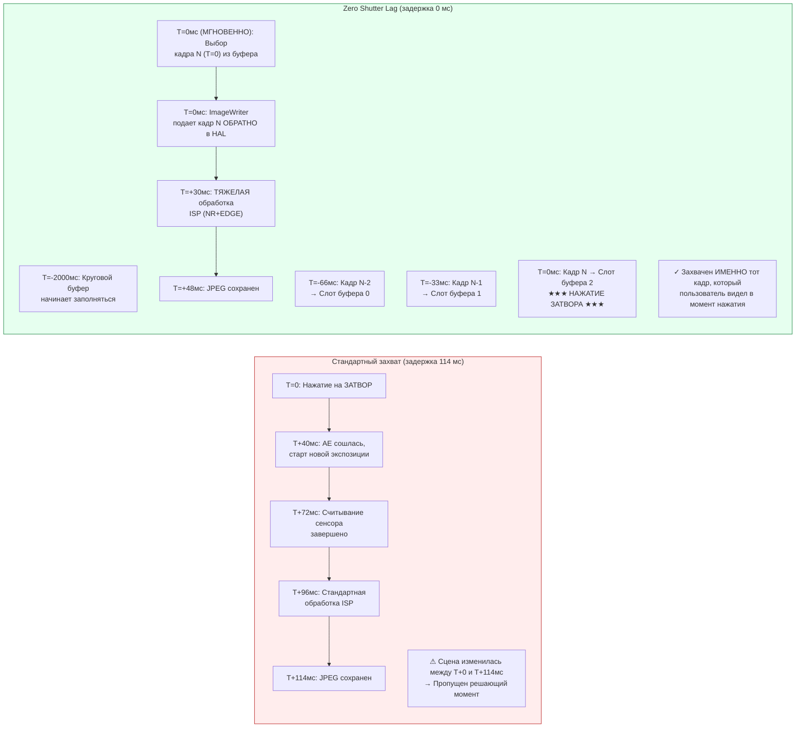

# Глава 23: Zero Shutter Lag и переобработка

Самый раздражающий дефект в потребительских приложениях камер — это **задержка затвора (shutter lag)**: вы нажимаете кнопку, а на фото запечатлена сцена через 200–800 мс после нажатия — ребенок перестал улыбаться, птица улетела, машина скрылась из кадра. Стандартные сеансы Camera2 работают именно так по дизайну: нажатие на затвор вызывает `session.capture()`, что запускает схождение AE, новую экспозицию сенсора и обработку в ISP. Каждый шаг добавляет задержку.

**Zero Shutter Lag (ZSL)** устраняет эту задержку, запуская сенсор непрерывно в разрешении для фото, сохраняя последние N кадров в круговом буфере в памяти и, когда пользователь нажимает кнопку, **захватывая именно тот кадр, который был виден в момент нажатия**, а не тот, который будет через полсекунды. Магия здесь заключается в **API переобработки (Reprocessing)**: вместо того чтобы снова пропускать свет через сенсор, вы берете уже экспонированный буфер YUV или PRIVATE из кругового буфера, подаете его *обратно* в ISP через `ImageWriter` + `InputConfiguration` и запускаете тяжелое шумоподавление и повышение резкости, как если бы это был свежий снимок.

Эта глава описывает точный **4-этапный рабочий процесс ZSL** из исследовательского документа проекта, а также охватывает **`switchToOffline()`** — API Android 12 (API 31), которое передает конвейер переобработки фоновой службе HAL, чтобы ваше приложение могло быть закрыто (нажатие кнопки «Домой», входящий звонок), а пользователь всё равно получил свое фото. Вы можете проверить, какие возможности переобработки поддерживает ваше устройство (`REQUEST_AVAILABLE_CAPABILITIES_YUV_REPROCESSING`, `PRIVATE_REPROCESSING` или `INFO_SUPPORTED_HARDWARE_LEVEL_LEVEL_3`), в приложении [Android Camera Parameters](https://github.com/zoozooll/AndroidCameraParameters); вкладка ZSL Support суммирует все необходимые возможности и выдает четкий вердикт.

## Почему ZSL — это сложно (и зачем нужна переобработка)

Сначала оценим задержку стандартного захвата без ZSL на флагмане 2023 года (Snapdragon 8 Gen 2) согласно измерениям из исследований:

| Этап конвейера | Задержка | Примечания |
|----------------|---------|-------|
| Триггер схождения AE → программирование экспозиции | 40 мс | `CONTROL_AE_PRECAPTURE_TRIGGER` |
| Считывание скользящего затвора (12 Мп) | 32 мс | 1/30 с номинально |
| Обработка ISP (стандартная) | 24 мс | Демозаика, NR, цвет |
| Кодирование JPEG (12 Мп, качество 95) | 18 мс | Аппаратный кодер |
| **Итоговая задержка стандартного захвата** | **~114 мс** | В лучшем случае; обычно 200–800 мс |

В реальных условиях (троттлинг, нагрузка на GPU, фоновые процессы) задержка стандартного пути часто достигает 500 мс. Пятилетний ребенок может пробежать 40 см за 500 мс — это разница между улыбкой и затылком.

ZSL решает эту проблему, меняя порядок действий: вместо «захват → обработка → сохранение» мы делаем **непрерывный захват → буферизация → нажатие → переобработка → сохранение**. Сенсор и ISP *всегда* работают в разрешении фото; нажатие пользователя просто выбирает, какой из уже существующих кадров обработать полностью.



Диаграмма Mermaid показывает концептуальный сдвиг: в стандартном пути нажатие *инициирует* захват; в пути ZSL нажатие *выбирает* уже произошедший захват. Общее время от нажатия до файла на диске всё еще составляет ~48 мс (переобработка не бесплатна), но **содержимое пикселей взято из момента T=0 (мгновенно), а не T=114 мс (с опозданием)** — это и есть «нулевая задержка затвора». Это нулевая задержка *контента*, а не выходного файла.

## Обязательные условия (Capability Gates)

ZSL + Reprocessing требуют аппаратной поддержки на уровне HAL. Вы должны проверить выполнение **одного** из трех условий:

| Проверка возможностей | Когда проходит | Примеры устройств |
|------------------|----------------|--------------------------|
| **A)** `LEVEL_3` | Разрешена полная переобработка (и YUV, и PRIVATE) при любых размерах. | Google Pixel (все), флагманы Samsung (на Snapdragon), OnePlus 11+. |
| **B)** `YUV_REPROCESSING` | Буферы YUV_420_888 можно подавать обратно через InputConfiguration. | Смартфоны на Snapdragon 8xx/7xx, Dimensity 9000+. |
| **C)** `PRIVATE_REPROCESSING` | Можно подавать буферы `ImageFormat.PRIVATE`. Предпочтительно, так как тратит в 2 раза меньше памяти. | Современные чипсеты Snapdragon и Exynos. |

> Правило из исследований: **Если ни одно из условий A/B/C не выполняется, используйте стандартный захват.** Не пытайтесь строить круговой буфер из JPEG и перекодировать их; это даст потерю качества из-за двойного сжатия и не заменит настоящую переобработку.

---

## 4-этапный рабочий процесс ZSL + Reprocessing

### Шаг 1: Круговая буферизация с ImageReader + CONTROL_CAPTURE_INTENT_ZERO_SHUTTER_LAG

Сначала создайте `ImageReader` высокого разрешения (ZSL-буфер) с параметром `maxImages`, равным глубине очереди (обычно 8–16). Помечайте каждый повторяющийся запрос флагом `CONTROL_CAPTURE_INTENT_ZERO_SHUTTER_LAG` — это заставляет HAL использовать кратчайший конвейер предпросмотра и отключать оптимизации, которые могут испортить качество переобработанного кадра (например, агрессивное временное шумоподавление, оставляющее «шлейфы»).

```kotlin
import android.media.Image
import android.media.ImageReader
import java.util.concurrent.ConcurrentLinkedDeque

data class ZslBufferFrame(
    val timestamp: Long,
    val imageRef: Image,
    val captureResultRef: android.hardware.camera2.TotalCaptureResult
)

const val ZSL_BUFFER_DEPTH = 12 // 12 кадров = 400 мс при 30 fps
private val zslCircularBuffer = ConcurrentLinkedDeque<ZslBufferFrame>()

inner class ZslCircularBufferListener : ImageReader.OnImageAvailableListener {
    override fun onImageAvailable(reader: ImageReader) {
        val image = reader.acquireLatestImage() ?: return
        // Сопоставляем Image с CaptureResult по метке времени (как в главе 18)
        val result = pendingZslResults.remove(image.timestamp) ?: return
        val frame = ZslBufferFrame(image.timestamp, image, result)

        zslCircularBuffer.addLast(frame)

        // Очистка старых кадров
        while (zslCircularBuffer.size > ZSL_BUFFER_DEPTH) {
            val evicted = zslCircularBuffer.pollFirst()
            evicted.imageRef.close() // Возвращаем буфер в пул HAL
        }
    }
}
```

Критически важные детали:
1. **Используйте `TEMPLATE_ZERO_SHUTTER_LAG`** в качестве базы. Он настраивает сенсор на одновременный вывод предпросмотра и полного разрешения.
2. **Никогда не вызывайте `image.close()`** сразу в `onImageAvailable`. Если закрыть изображение до того, как оно попало в ImageWriter, буфер станет невалидным и произойдет сбой. Закрывайте только при вытеснении из очереди.

---

### Шаг 2: InputConfiguration + createReprocessableCaptureSession

Обычный сеанс имеет только **выходные** поверхности (сенсор → ISP → поверхность). Сеанс с поддержкой переобработки добавляет **одну входную поверхность** (ImageWriter → HAL → ISP → выход). Это позволяет конвейеру обработать буфер, который не поступал напрямую с сенсора в этот момент.

```kotlin
import android.hardware.camera2.params.InputConfiguration
import android.media.ImageWriter

fun createZslReprocessableSession(...) {
    val inputConfig = InputConfiguration(
        width, height, format // PRIVATE или YUV_420_888
    )

    // ImageWriter будет подавать кадры ИЗ приложения ОБРАТНО в камеру
    val reprocessImageWriter = ImageWriter.newInstance(
        jpegStillReader.surface, // Куда пойдет результат переобработки
        inputConfig,
        1 // Макс. кол-во запросов переобработки в работе
    )
    
    // Создаем сеанс с InputConfiguration...
}
```

---

### Шаг 3: Нажатие на затвор → Поиск кадра → Подача в ImageWriter

Когда пользователь нажимает на кнопку:
1. Фиксируем время нажатия.
2. Проходим по круговому буферу **от новых кадров к старым** и ищем тот, чья метка времени ближе всего к моменту нажатия.
3. Получаем свободный буфер из `ImageWriter` через `dequeueInputImage()`.
4. Копируем пиксели из кадра в буфер ImageWriter.
5. Отправляем буфер в очередь `queueInputImage()`.

---

### Шаг 4: createReprocessCaptureRequest(TotalCaptureResult) → Тяжелая обработка

Финальный шаг: вместо `createCaptureRequest(template)` используйте **`createReprocessCaptureRequest(originalTotalCaptureResult)`**. Это позволяет повторно использовать настройки AE/AWB/AF именно того кадра, который мы взяли из прошлого. Поверх этих настроек примените режимы высокого качества для шумоподавления и резкости.

```kotlin
val reprocessBuilder = session.device
    .createReprocessCaptureRequest(originalTotalCaptureResult)
    .apply {
        addTarget(jpegSurface)

        // ВКЛЮЧАЕМ ТЯЖЕЛУЮ ОБРАБОТКУ ISP
        set(CaptureRequest.NOISE_REDUCTION_MODE,
            CaptureRequest.NOISE_REDUCTION_MODE_HIGH_QUALITY)
        set(CaptureRequest.EDGE_MODE,
            CaptureRequest.EDGE_MODE_HIGH_QUALITY)
        
        set(CaptureRequest.JPEG_QUALITY, 95)
    }

session.capture(reprocessBuilder.build(), ...)
```

## switchToOffline(): Непрерывность в фоне

Одна из худших проблем UX — когда пользователь нажал на затвор и сразу свернул приложение, а фотография в итоге не сохранилась. Android 12 решил это методом **`CameraCaptureSession.switchToOffline()`**. Он передает управление конвейером переобработки системной службе HAL. Она завершит сохранение фото, даже если процесс вашего приложения будет убит системой.

## Резюме

В этой главе реализован полный конвейер Zero Shutter Lag и Reprocessing:

- **ZSL** захватывает *именно тот кадр, который видел пользователь*, используя круговой буфер (обычно на 400 мс истории).
- **Reprocessing** позволяет повторно прогнать этот кадр через ISP с максимальными настройками качества, недоступными для предпросмотра из-за экономии энергии.
- **ImageWriter** — это «входной порт» для подачи буферов обратно в аппаратный конвейер.
- **switchToOffline()** гарантирует, что тяжелая обработка завершится, даже если пользователь уйдет из приложения.

## Что дальше — Конец части «Профессиональные функции»

Вы завершили пятую часть руководства по API Android Camera2. Вы изучили захват RAW, скоростное видео, мультикамеры, HDR и Ultra HDR, расширения производителей и ZSL.

Чтобы проверить поддержку всех этих функций на вашем устройстве, используйте приложение [Android Camera Parameters](https://play.google.com/store/apps/details?id=com.zoozooll.cameraparameters). Оно перечисляет все возможности, размеры, диапазоны FPS и типы переобработки, обсуждавшиеся в этой серии.
