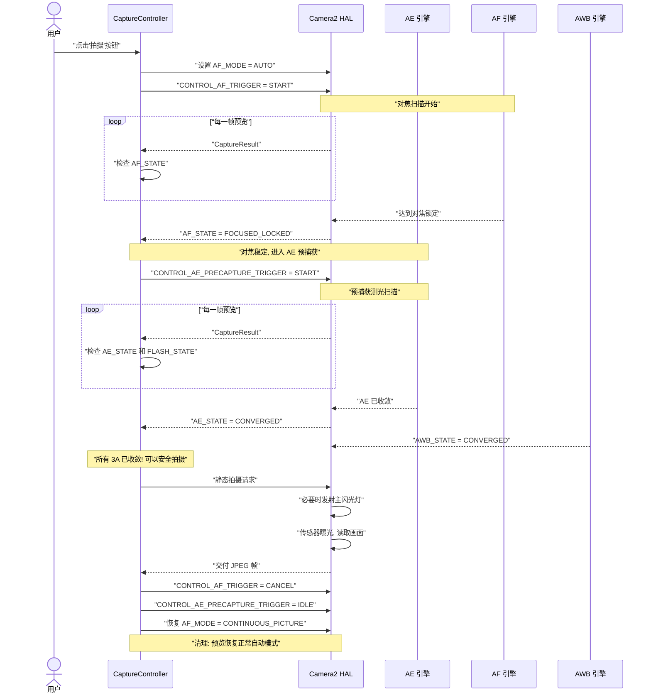
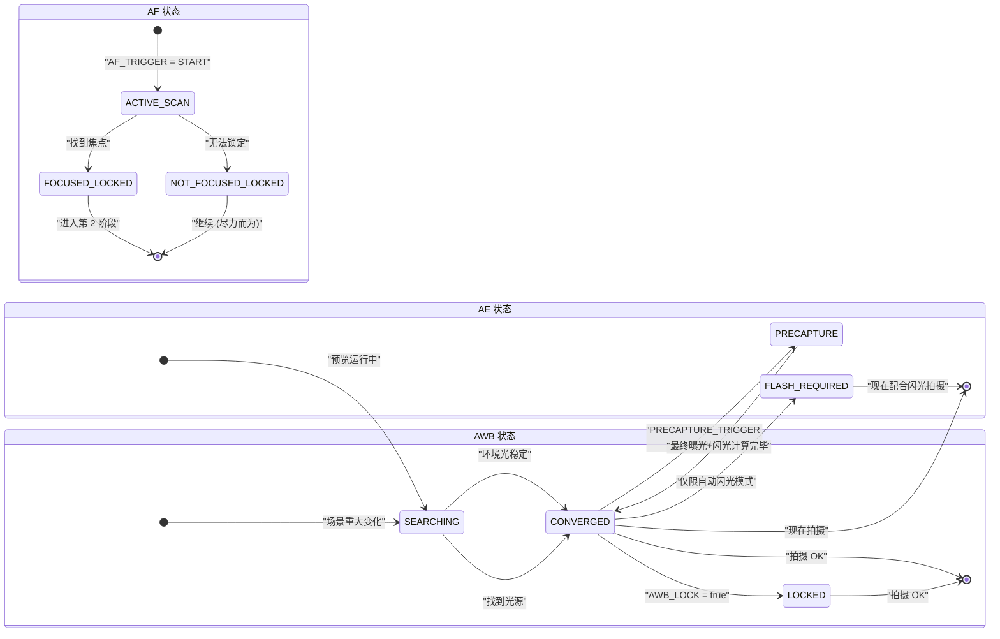

# 第 17 章：3A 管线

我们已经将 **AE**（自动曝光，第 13-14 章）、**AF**（自动对焦，第 15 章）和 **AWB**（自动白平衡，第 16 章）作为独立的系统进行了研究。真实的摄影应用必须在每次按下快门之前协调这三者——而且*顺序和时机*至关重要。

如果只是在用户点击快门按钮时简单地触发 `capture()`，产生的结果会很不稳定：有时对焦准，有时不准；有时闪光灯亮，有时不亮；有时在 AWB 扫描途中拍摄会导致照片发绿。一个可靠的 3A 管线可以消除所有这些问题。

本章中的 3A 管线实现与 **Android Camera Parameters** 应用内部使用的流程以及 Android 相机架构研究文档中描述的专业 Camera2 开发序列完全一致。

---

## 3A 全程编排序列（概览）

在深入研究每个子系统之前，让我们先直观地了解完整的状态流。这是一个真实的生产环境序列，而非简化版。



**每一步都是阻塞的。** 在 HAL 确认第 N 步所需的状态之前，你不会移动到第 N+1 步。切勿跳过步骤——否则你发布的应用会出现间歇性的对焦不实、错误的闪光曝光或带蓝/绿调的照片。

---

## AE（自动曝光）深度挖掘

AE 是三个 A 中最复杂的，因为它不仅包含快门+ISO，还包含**闪光灯测光**和**预捕获触发**。

### AE 模式：CONTROL_AE_MODE

| 模式 | 行为 | 闪光灯支持 |
|------|----------|--------------|
| `OFF` | 完全手动（第 14 章涵盖） | 无 |
| `ON` | 自动曝光，**禁用闪光灯**（永久关闭） | 无 |
| `ON_AUTO_FLASH` | 自动曝光，**自动闪光决策** — HAL 仅在弱光下闪光 | 自动（最常见的默认值） |
| `ON_ALWAYS_FLASH` | 自动曝光，**强制闪光**（用于逆光人像的补光） | 始终 |
| `ON_AUTO_FLASH_REDEYE` | 自动曝光 + 闪光 + 红眼消除（发射预闪序列以收缩瞳孔） | 自动 + 红眼消除 |
| `ON_EXTERNAL_FLASH` | 外部相机配件闪光灯 | 仅限外部（罕见） |

**普通相机应用的默认值**是 `ON_AUTO_FLASH`。用户期望手机能"知道"何时该闪光。

### AE 状态与预捕获触发

与 AF 一样，AE 通过 `CaptureResult.CONTROL_AE_STATE` 报告其状态：

| 状态 | 含义 |
|-------|---------|
| `INACTIVE` (0) | AE 已禁用或尚未启动 |
| `SEARCHING` (1) | 正在积极搜索正确的曝光 |
| `CONVERGED` (2) | 曝光稳定。在闪光灯模式下，这意味着*环境*曝光已收敛，但预闪扫描尚未进行。 |
| `LOCKED` (3) | 通过 `CONTROL_AE_LOCK = true` 显式锁定曝光 |
| `FLASH_REQUIRED` (4) | 环境曝光已收敛，且 HAL 已判定**需要闪光**才能拍摄正确照片 |
| `PRECAPTURE` (5) | **关键状态。** 预捕获扫描正在运行 — HAL 正在测光（如果需要闪光，则发射预闪脉冲）以计算最终拍摄的曝光 + 闪光功率。 |

### 为什么预捕获触发如此重要

在预览帧上运行的 AE 引擎是*近似的*。预览管线使用较小的缓冲区、较低位深的处理，且未考虑拍摄时主闪光灯发射带来的巨量光线贡献。

`CONTROL_AE_PRECAPTURE_TRIGGER = START` 告诉 HAL：

> "我正要拍一张真正的静态照片。停止近似计算。运行全精度的测光管线。如果我处于自动闪光模式，请发射一个或多个低功率预闪，测量反射，并为拍摄计算精确的最终快门/ISO/闪光功率。"

**跳过预捕获 = 闪光照片会随机过曝或欠曝。** HAL 根本没有机会实时针对闪光灯进行测光。

### AE 区域（点测光）

就像针对对焦的 `CONTROL_AF_REGIONS` 一样，`CONTROL_AE_REGIONS` 指定了*场景中的哪个位置*进行测光。人像点击对焦应当同时将该区域应用到 AE —— 让面部获得对焦优先权的同时也获得曝光优先权，而不是针对明亮的天空背景进行测光。

```kotlin
// 为 AF 和 AE 区域使用相同的 MeteringRectangle 数组
val focusWeightedRegions = arrayOf(userTapRegion)
builder.set(CaptureRequest.CONTROL_AF_REGIONS, focusWeightedRegions)
builder.set(CaptureRequest.CONTROL_AE_REGIONS, focusWeightedRegions)
```

**权重：** 每个 `MeteringRectangle` 都有一个 `weight` (0–1000)。权重越高的区域对测光的影响越大。"点测光"模式使用一个高权重矩形 (1000)。"矩阵 / 评价"测光使用分布在画面中的许多低权重矩形。

---

## AWB：三剑客中的沉默伙伴

AWB 通常很早就收敛并保持收敛——这就是为什么它经常被忽略的原因。但它对色彩准确性的贡献至关重要，当你准备拍摄时，它*仍可能*在搜索中。

### AWB 状态回顾

| AWB 状态 | 拍摄决策 |
|-----------|------------------|
| `INACTIVE` (AWB_MODE = OFF) | 可以继续（手动增益） |
| `SEARCHING` | **等待。** 色彩可能仍在变动。通常在场景重大变化后 < 500ms 内完成。 |
| `CONVERGED` | ✅ 完美 — 继续 |
| `LOCKED` | ✅ 同样完美 — 通过 `CONTROL_AWB_LOCK = true` 显式锁定 |

### 将 AWB 锁定与 AE/AF 锁定耦合

对于严谨的影棚/产品摄影，请在拍摄*前*锁定所有三项：

```kotlin
// 在静态拍摄请求中（不要提前——我们要锁定最终收敛后的值）
builder.set(CaptureRequest.CONTROL_AWB_LOCK, true)
builder.set(CaptureRequest.CONTROL_AE_LOCK, true)
// AF 保持锁定，因为我们早些时候触发了它且尚未取消
```

这保证了主捕获所用的色彩/白平衡配置文件与最后一次预捕获测光帧所用的*完全一致*。

---

## 完整的生产级 3A 捕获控制器 (Kotlin)

现在让我们将所有内容组装成一个可复用的类。此实现符合 Android 相机架构研究文档中关于 3A 控制管线的部分以及相关专业 Camera2 开发博文推荐的模式。

```kotlin
class ThreeACaptureController(
    private val characteristics: CameraCharacteristics,
    private val captureSession: CameraCaptureSession,
    private val previewSurface: Surface,
    private val jpegReaderSurface: Surface,
    private val mainHandler: Handler
) {
    // ----------- 公共 API -----------
    interface CaptureListener {
        fun onCaptureStarted() {}
        fun onCaptureSuccess(jpegBytes: ByteArray)
        fun onCaptureError(reason: String)
    }

    /**
     * 编排完整的 3A 捕获序列：
     *   AF 触发 → AF 已锁定 → AE 预捕获 → AE 已收敛 → 静态拍摄 → 清理
     */
    fun captureStillPhoto(
        aeMode: Int = CameraMetadata.CONTROL_AE_MODE_ON_AUTO_FLASH,
        listener: CaptureListener
    ) {
        this.listener = listener
        listener.onCaptureStarted()
        beginPhase1_AfTrigger(aeMode)
    }

    // ----------- 内部状态 -----------
    private var listener: CaptureListener? = null
    private var timeoutRunnable: Runnable? = null
    private var phase: Int = 0
    private lateinit var currentAeMode: Int

    private val SESSION_TIMEOUT_MS = 3500L  // 入门手机可能需要长达约 3s

    // ---- 第 1 阶段：触发 AF，等待 FOCUSED_LOCKED ----
    private fun beginPhase1_AfTrigger(aeMode: Int) {
        currentAeMode = aeMode
        phase = 1

        val request = captureSession.device.createCaptureRequest(
            CameraDevice.TEMPLATE_PREVIEW
        ).apply {
            addTarget(previewSurface)

            set(CaptureRequest.CONTROL_AF_MODE,
                CameraMetadata.CONTROL_AF_MODE_AUTO)
            set(CaptureRequest.CONTROL_AE_MODE, aeMode)
            set(CaptureRequest.CONTROL_AWB_MODE,
                CameraMetadata.CONTROL_AWB_MODE_AUTO)

            // 发起单次 AF 扫描
            set(CaptureRequest.CONTROL_AF_TRIGGER,
                CameraMetadata.CONTROL_AF_TRIGGER_START)
        }

        startTimeout("AF 扫描")
        captureSession.setRepeatingRequest(request.build(), captureCallback, mainHandler)
    }

    // ---- 第 2 阶段：AF 已锁定。开始 AE 预捕获触发 ----
    private fun beginPhase2_AePrecapture() {
        phase = 2
        val request = captureSession.device.createCaptureRequest(
            CameraDevice.TEMPLATE_PREVIEW
        ).apply {
            addTarget(previewSurface)

            // 保持 AF 锁定 — 切勿取消 AF 触发！
            set(CaptureRequest.CONTROL_AF_MODE,
                CameraMetadata.CONTROL_AF_MODE_AUTO)
            // AF_TRIGGER 保持在来自第 1 阶段的 START 状态

            set(CaptureRequest.CONTROL_AE_MODE, currentAeMode)

            // ---- 关键行：运行预捕获 ----
            set(CaptureRequest.CONTROL_AE_PRECAPTURE_TRIGGER,
                CameraMetadata.CONTROL_AE_PRECAPTURE_TRIGGER_START)

            set(CaptureRequest.CONTROL_AWB_MODE,
                CameraMetadata.CONTROL_AWB_MODE_AUTO)
        }

        restartTimeout("AE 预捕获")
        captureSession.setRepeatingRequest(request.build(), captureCallback, mainHandler)
    }

    // ---- 第 3 阶段：AE 已收敛 + AWB 已收敛。发起真正的静态拍摄。 ----
    private fun beginPhase3_StillCapture() {
        phase = 3
        cancelTimeout()

        val request = captureSession.device.createCaptureRequest(
            CameraDevice.TEMPLATE_STILL_CAPTURE
        ).apply {
            addTarget(previewSurface)
            addTarget(jpegReaderSurface)

            // 在捕获完成前保持 AF 锁定
            set(CaptureRequest.CONTROL_AF_MODE,
                CameraMetadata.CONTROL_AF_MODE_AUTO)

            set(CaptureRequest.CONTROL_AE_MODE, currentAeMode)

            // 为静态拍摄锁定 AE 和 AWB，以防止最后时刻的画面漂移
            set(CaptureRequest.CONTROL_AE_LOCK, true)
            set(CaptureRequest.CONTROL_AWB_LOCK, true)

            set(CaptureRequest.CONTROL_AWB_MODE,
                CameraMetadata.CONTROL_AWB_MODE_AUTO)

            set(CaptureRequest.JPEG_QUALITY, 95.toByte())
            // JPEG 朝向：使用屏幕旋转以获得正确的最终朝向
            val jpegOrient = computeJpegOrientation()
            set(CaptureRequest.JPEG_ORIENTATION, jpegOrient)
        }

        captureSession.capture(request.build(), object : CameraCaptureSession.CaptureCallback() {
            override fun onCaptureCompleted(
                session: CameraCaptureSession,
                request: CaptureRequest,
                result: TotalCaptureResult
            ) {
                super.onCaptureCompleted(session, request, result)
                // ImageReader 的 OnImageAvailableListener 将处理保存字节并回调给监听器
                // 现在进行清理：重置回正常的预览模式
                resetToContinuousPreview()
            }
        }, mainHandler)
    }

    // ---- 清理：恢复正常的连续预览 ----
    private fun resetToContinuousPreview() {
        phase = 0
        val request = captureSession.device.createCaptureRequest(
            CameraDevice.TEMPLATE_PREVIEW
        ).apply {
            addTarget(previewSurface)
            set(CaptureRequest.CONTROL_AF_MODE,
                CameraMetadata.CONTROL_AF_MODE_CONTINUOUS_PICTURE)
            set(CaptureRequest.CONTROL_AE_MODE, currentAeMode)
            set(CaptureRequest.CONTROL_AWB_MODE,
                CameraMetadata.CONTROL_AWB_MODE_AUTO)

            // 释放所有锁定并取消所有触发器
            set(CaptureRequest.CONTROL_AF_TRIGGER,
                CameraMetadata.CONTROL_AF_TRIGGER_CANCEL)
            set(CaptureRequest.CONTROL_AE_PRECAPTURE_TRIGGER,
                CameraMetadata.CONTROL_AE_PRECAPTURE_TRIGGER_IDLE)
            set(CaptureRequest.CONTROL_AE_LOCK, false)
            set(CaptureRequest.CONTROL_AWB_LOCK, false)
        }
        captureSession.setRepeatingRequest(request.build(), null, mainHandler)
    }

    // ----------- 主回调：通过状态检查驱动所有 3 个阶段 -----------
    private val captureCallback = object : CameraCaptureSession.CaptureCallback() {
        override fun onCaptureCompleted(
            session: CameraCaptureSession,
            request: CaptureRequest,
            result: TotalCaptureResult
        ) {
            val afState = result.get(CaptureResult.CONTROL_AF_STATE)
            val aeState = result.get(CaptureResult.CONTROL_AE_STATE)
            val awbState = result.get(CaptureResult.CONTROL_AWB_STATE)

            when (phase) {
                1 -> {
                    // ---- 第 1 阶段：等待 AF 锁定 ----
                    when (afState) {
                        CaptureResult.CONTROL_AF_STATE_FOCUSED_LOCKED -> {
                            Log.d("3A", "✓ AF FOCUSED_LOCKED — 进入 AE 预捕获")
                            beginPhase2_AePrecapture()
                        }
                        CaptureResult.CONTROL_AF_STATE_NOT_FOCUSED_LOCKED -> {
                            Log.w("3A", "⚠ AF NOT_FOCUSED_LOCKED — 照常继续 (可能会失焦)")
                            beginPhase2_AePrecapture()
                        }
                        // ACTIVE_SCAN / PASSIVE_SCAN → 继续等待
                    }
                }
                2 -> {
                    // ---- 第 2 阶段：等待预捕获后的 AE 收敛 ----
                    // 接受代表 "AE 已完成预捕获并准备好拍摄" 的状态
                    val aeReady = (aeState == CaptureResult.CONTROL_AE_STATE_CONVERGED
                                || aeState == CaptureResult.CONTROL_AE_STATE_LOCKED
                                || aeState == CaptureResult.CONTROL_AE_STATE_FLASH_REQUIRED)
                    val awbReady = (awbState == CaptureResult.CONTROL_AWB_STATE_CONVERGED
                                 || awbState == CaptureResult.CONTROL_AWB_STATE_LOCKED
                                 || awbState == CaptureResult.CONTROL_AWB_STATE_INACTIVE)

                    if (aeReady && awbReady) {
                        Log.d("3A", "✓ AE=$aeState, AWB=$awbState — 发起拍摄")
                        beginPhase3_StillCapture()
                    }
                }
            }
        }
    }

    // ----------- 超时保护：如果 HAL 永远不收敛，绝不挂起 -----------
    private fun startTimeout(phaseName: String) {
        cancelTimeout()
        timeoutRunnable = Runnable {
            Log.w("3A", "⏱ 等待 $phaseName 超时 — 尽力而为继续进行")
            when (phase) {
                1 -> beginPhase2_AePrecapture()  // 以可能的最佳对焦继续
                2 -> beginPhase3_StillCapture()  // 以可能的最佳曝光继续
            }
        }
        mainHandler.postDelayed(timeoutRunnable!!, SESSION_TIMEOUT_MS)
    }
    private fun restartTimeout(phaseName: String) = startTimeout(phaseName)
    private fun cancelTimeout() {
        timeoutRunnable?.let { mainHandler.removeCallbacks(it) }
        timeoutRunnable = null
    }

    // ----------- 实用工具：基于屏幕旋转纠正 JPEG 朝向 -----------
    private fun computeJpegOrientation(): Int {
        val sensorOrient = characteristics.get(
            CameraCharacteristics.SENSOR_ORIENTATION
        ) ?: 0
        // 与 Activity 中的 Display.rotation (0, 90, 180, 270) 结合
        // 典型实现：return (sensorOrient + displayRotationDegrees) % 360
        return sensorOrient  // 简化的；需连接到你的屏幕旋转
    }
}
```

### 如何使用该控制器

```kotlin
// 在你的相机 Fragment 的拍摄按钮点击监听器内
val controller = ThreeACaptureController(
    characteristics = yourCameraCharacteristics,
    captureSession = yourActiveSession,
    previewSurface = previewView.surface,
    jpegReaderSurface = jpegImageReader.surface,
    mainHandler = yourCameraHandler
)

controller.captureStillPhoto(
    aeMode = CameraMetadata.CONTROL_AE_MODE_ON_AUTO_FLASH
) {
    override fun onCaptureSuccess(jpegBytes: ByteArray) {
        lifecycleScope.launch(Dispatchers.IO) {
            val file = File(requireContext().filesDir, "photo_${System.currentTimeMillis()}.jpg")
            file.writeBytes(jpegBytes)
            withContext(Dispatchers.Main) {
                Toast.makeText(requireContext(), "已保存: ${file.name}", Toast.LENGTH_SHORT).show()
            }
        }
    }
    override fun onCaptureError(reason: String) {
        Toast.makeText(requireContext(), "拍摄失败: $reason", Toast.LENGTH_LONG).show()
    }
}
```

### 与 ImageReader 配合使用

不要忘记在你的 JPEG `ImageReader` 上设置 `OnImageAvailableListener`，以便真正地将 `jpegBytes` 交付给监听器。上述控制器假设你已经连接好了这一步：

```kotlin
// 在创建 ImageReader 时设置好此项 (参见拍摄章节)
jpegImageReader.setOnImageAvailableListener({ reader ->
    val image = reader.acquireLatestImage() ?: return@setOnImageAvailableListener
    image.use {
        val buffer = it.planes[0].buffer
        val bytes = ByteArray(buffer.remaining())
        buffer.get(bytes)
        // 交付字节数据给你的 UI / 文件保存程序
        lastCaptureListener?.onCaptureSuccess(bytes)
    }
}, mainHandler)
```

---

## 闪光灯处理的微妙之处

对于 `ON_AUTO_FLASH` / `ON_ALWAYS_FLASH` / `ON_AUTO_FLASH_REDEYE` 模式，预捕获触发会发射预闪脉冲。两个重要考虑因素：

1. **预闪脉冲的可视性：** 预闪是*真实的闪光* —— 用户会在主闪光之前看到一个低亮度的闪光脉冲。大多数现代相机 UI 通过"快门按钮动画"或调暗预览来隐藏这一点。

2. **`FLASH_STATE` 必须为 READY：** 除了 `AE_STATE = CONVERGED` 之外，还要在拍摄前验证闪光模式下的 `CaptureResult.FLASH_STATE = FLASH_STATE_READY` (或 `FIRED`)。AE 有可能已收敛，但闪光灯充电电容仍在爬升。

```kotlin
// 在第 2 阶段针对闪光灯模式的回调中增强 aeReady 检查：
val aeState = result.get(CaptureResult.CONTROL_AE_STATE)
val flashState = result.get(CaptureResult.FLASH_STATE)

val flashModeWantsFlash = (currentAeMode == CameraMetadata.CONTROL_AE_MODE_ON_ALWAYS_FLASH ||
                          (currentAeMode == CameraMetadata.CONTROL_AE_MODE_ON_AUTO_FLASH &&
                           aeState == CaptureResult.CONTROL_AE_STATE_FLASH_REQUIRED))

val aeReady = when {
    flashModeWantsFlash -> {
        // HAL 必须同时达到 AE 已收敛且闪光灯准备就绪可以发射
        (aeState == CaptureResult.CONTROL_AE_STATE_CONVERGED
         || aeState == CaptureResult.CONTROL_AE_STATE_FLASH_REQUIRED) &&
        (flashState == CaptureResult.FLASH_STATE_READY
         || flashState == CaptureResult.FLASH_STATE_FIRED)
    }
    else -> {
        // 无闪光模式：普通的 AE 收敛即可
        (aeState == CaptureResult.CONTROL_AE_STATE_CONVERGED
         || aeState == CaptureResult.CONTROL_AE_STATE_LOCKED)
    }
}
```

---

## 3A 状态转换机（总结图）

为了在调试时快速参考，这里是 AE、AF 和 AWB 的合并状态图，展示了成功拍摄期间的预期转换。



全局控制器仅在所有三个子状态同时达到最终的"拍摄 OK"状态时，才会发起静态拍摄。

---

## 3A 管线问题排查

| 症状 | 根本原因 | 解决办法 |
|---------|-----------|-----|
| 闪光照片随机欠曝/过曝 | 跳过了 `AE_PRECAPTURE_TRIGGER = START` | 在任何闪光模式下，静态拍摄前务必运行预捕获 |
| 每 5-10 张照片就有一张略微模糊 | 在达到 `FOCUSED_LOCKED` 之前就发起了拍摄 | 阻塞等待 AF 状态 (我们的控制器已实现此功能) |
| 相机挂起数秒后崩溃 | 无超时；HAL 永远停留在 SEARCHING | 按示例所示添加 3500ms 超时 + 尽力而为的回退机制 |
| 闪光灯亮了但照片仍是暗的 | 在 `FLASH_STATE = READY` 之前就发起了拍摄 | 电容正在充电；在 AE 就绪条件中增加 FLASH_STATE 检查 |
| 逆光人物肖像欠曝 | AE 针对天空而非人脸进行了测光 | 将 `CONTROL_AE_REGIONS` 与点击对焦的 `CONTROL_AF_REGIONS` 矩形耦合 |
| 连拍帧之间有 2° 的色调偏移 | 连拍拍摄前忘记设置 `AWB_LOCK = true` | 在第一个收敛帧上锁定 AWB；并在整个连拍期间保持锁定 |
| 入门手机上的拍摄序列明显缓慢 | `TEMPLATE_STILL_CAPTURE` 启动了冷管线 | 先用带有相同 AE/AF 设置的哑 `TEMPLATE_PREVIEW` 预热管线 |

---

## 小结

本章将曝光、对焦和白平衡统一到了单个、可靠的 **3A 拍摄管线** 中——这正是专业相机应用在每次按下快门时所用的精确序列：

1. **阶段 1 (AF):** 设置 `AF_MODE = AUTO` + `AF_TRIGGER = START`。等待直到 `AF_STATE = FOCUSED_LOCKED`（或以 `NOT_FOCUSED_LOCKED` 为回退）。
2. **阶段 2 (AE 预捕获):** 设置 `AE_PRECAPTURE_TRIGGER = START`。等待 `AE_STATE = CONVERGED` / `FLASH_REQUIRED` 且 `FLASH_STATE = READY`（若为闪光模式）。同时要求 `AWB_STATE = CONVERGED`。
3. **阶段 3 (静态拍摄):** 提交带有 `AE_LOCK = true`, `AWB_LOCK = true` 的 `TEMPLATE_STILL_CAPTURE` 请求。
4. **阶段 4 (清理):** 取消所有触发器，释放所有锁定，恢复 `AF_MODE = CONTINUOUS_PICTURE`。

关键的支持概念：
- **AE 模式：** `ON_AUTO_FLASH` 是面向普通应用最合理的默认值。
- **AE 区域** = 点测光；在点击对焦时始终与 AF 区域配对。
- **AWB 收敛很快**，但对于色彩关键的工作，务必阻塞等待 `CONVERGED` 或 `LOCKED`。
- **超时是不可商榷的。** 廉价手机和弱光环境可能导致 AF/AE 扫描永不停止；务必在约 3.5s 后以尽力而为的方式回退继续。

## 下一章

恭喜你完成了 3A 手动摄影模块。你现在已经达到了专业级别，了解如何控制：

- **曝光 (第 13-14 章):** 曝光三角、ISO + 快门、纳秒转换、手动覆盖、长曝光、延时锁定、包围曝光
- **对焦 (第 15 章):** AF 模式、AF 状态机、单次触发与拍摄、手动对焦屈光度、超焦距预设、点击对焦区域
- **色彩 (第 16 章):** 色温、AWB 预设、手动 COLOR_CORRECTION_GAINS、3×3 CCM 变换、开尔文滑块实现
- **编排 (第 17 章):** 带有预捕获、防闪光 AE 收敛、逐阶段超时、锁定/释放清理的完整 3A 管线

你现在可以构建一个功能足以媲美 **Android Camera Parameters** 应用本身的完整专业模式相机应用了！

在接下来的章节中，我们将从捕获**控制**转向捕获**画质** —— 涵盖 RAW 捕获、DNG 保存、多帧处理、HDR，以及基于你现已掌握的 3A 管线构建的计算摄影技术。
