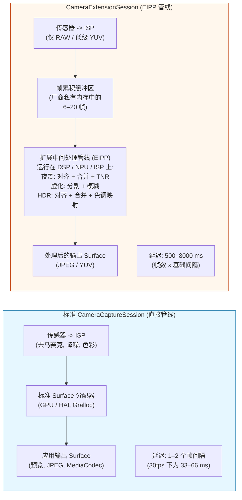
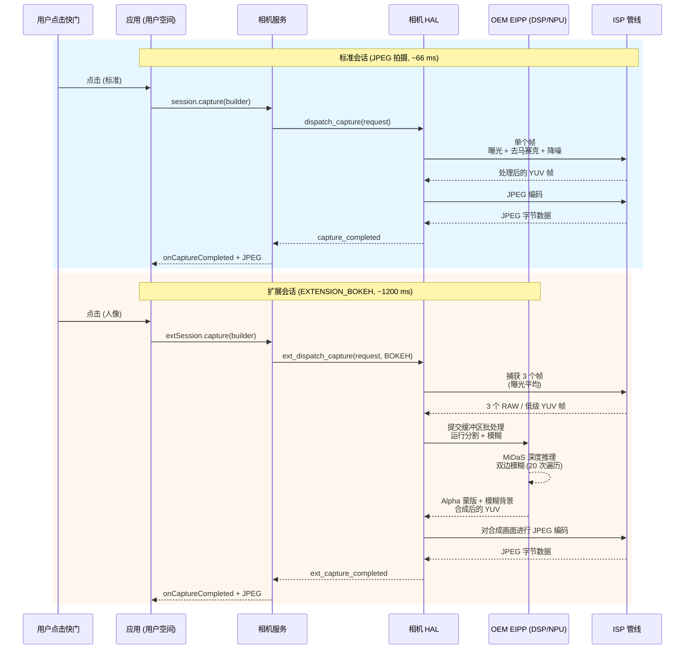

---
sidebar_position: 22
title: "第 22 章：相机扩展"
description: "使用 CameraExtensionSession 调用 OEM 加速的计算摄影：夜景模式、Bokeh 人像模式、HDR 扩展、人脸修容和自动模式。查询 CameraExtensionCharacteristics，管理延迟，并对比标准会话与扩展会话的架构差异。"
keywords: [Android Camera2, 相机扩展, CameraExtensionSession, CameraExtensionCharacteristics, 夜景模式, Bokeh, 人像模式, EXTENSION_NIGHT, EXTENSION_BOKEH, EXTENSION_HDR, EXTENSION_FACE_RETOUCH, EXTENSION_AUTOMATIC, getEstimatedCaptureLatencyRangeMillis]
---

# 第 22 章：相机扩展

从零开始实现像夜景模式、人像虚化或多帧 HDR 这样的计算摄影功能，需要基于机器学习的深度推理、亚像素级的多帧对齐、色调映射算子和手工调优的 DSP 着色器——这对于单个功能来说就是 6 到 12 个月的工程投入。**相机扩展 (Camera Extensions) API**（Android 12 API 31+ 引入，在 API 33/34 中进一步完善）通过将 OEM *预构建的硬件加速计算管线*暴露为五种标准扩展类型，解决了这一问题。例如，当你请求 `EXTENSION_BOKEH` 时，你不需要自己运行任何机器学习模型——你只需将会话配置交给 HAL，它会调用与系统自带相机应用相同的、运行在厂商 NPU/DSP/ISP 加速块上的虚化管线。

本章基于项目研究文档中的《相机扩展 API》部分，该部分列出了每个扩展常量、来自现场的 OEM 支持统计数据，以及 2023 年旗舰机上各扩展的延迟/内存开销。研究文档还包含了对 `CameraExtensionSession.StateCallback` 语义的完整说明（它与标准 `CameraCaptureSession` 语义有微妙的区别）。你可以使用 [Google Play 商店](https://play.google.com/store/apps/details?id=com.zoozooll.cameraparameters) 上的 [Android Camera Parameters](https://github.com/zoozooll/AndroidCameraParameters) 应用查看每台设备按相机 ID 的扩展支持情况：其"Extensions (扩展)"选项卡会在每个物理和逻辑 ID 上调用 `CameraExtensionCharacteristics.getSupportedExtensions()`，然后枚举每个受支持扩展的 `getExtensionSupportedSizes()`。

## 五种标准扩展（根据研究文档表）

所有的相机扩展都使用供应商特定的算法，但每种都对应一个定义明确的面向用户的意图，并在 `CameraExtensionCharacteristics` 中有一个数值常量：

| 扩展常量 | 数值 | 算法描述 (来自研究文档) | 典型 OEM 管线 | 预计延迟范围 |
|---------------------|---------------|----------------------------------------|----------------------|-------------------------|
| **`EXTENSION_NIGHT`** | 1 | **多帧长曝光时域融合**。捕获 6–15 帧，曝光时间为基准的 1–8 倍（总计长达 1 秒），利用 IMU 辅助的辅助光流进行亚像素对齐，在线性空间合并，应用时域降噪 (TNR)，然后色调映射为 sRGB。比单帧拍摄多抑制 4–6 倍的弱光噪声。 | Google: 夜视; 三星: 夜间模式; 苹果等效: 夜间模式 | 2,500 ms – 8,000 ms (8–20 帧) |
| **`EXTENSION_BOKEH`** | 2 | **深度推理 → 用于人像的人工背景虚化**。运行单帧或立体双镜头分割网络 (DeeplabV3+, MiDaS 或 OEM 私有模型) 生成 Alpha 蒙版，然后应用镜头内核级的精确高斯模糊，为 f/1.4–f/2.8 虚拟光圈提供正确的弥散圆衰减。即系统人像模式。 | Google: 人像模式; 三星: 实时聚焦; 小米: 人像虚化 | 600 ms – 2,000 ms |
| **`EXTENSION_HDR`** | 4 | **多帧曝光包围融合**。捕获 3–5 帧，分别为 -2, -1, 0, +1, +2 EV，使用单应性变换 + 运动补偿进行对齐，在线性空间合并并对移动物体进行去重影处理，最后应用局部的 Reinhard 或 ACES 色调映射。比单次曝光扩大 2–3 档动态范围。 | Google: HDR+ 增强; 三星: 场景优化 HDR | 500 ms – 2,500 ms |
| **`EXTENSION_FACE_RETOUCH`** | 5 | **机器学习皮肤平滑、瑕疵去除、肤色统一**。运行一个 68 点的人脸关键点检测器，分割皮肤区域，在 3 个频段应用双边模糊（保留毛孔的同时平滑瑕疵），可选美白牙齿和放大眼睛。具有 OEM 特定的级别。 | 三星: 美颜模式; 小米: AI 美颜; OPPO: 自拍美颜 | 400 ms – 1,200 ms |
| **`EXTENSION_AUTOMATIC`** | 6 | **由 HAL 根据场景分类决定应用哪种扩展**（基于亮度级、场景类型、人脸数、运动情况）。典型逻辑：亮度 < 100 → 进入夜景；1 张脸 + 2 米主体 → 进入虚化；逆光场景 → 进入 HDR。是傻瓜式相机应用的理想默认值。 | OEM 场景优化管线 | 500 ms – 6,000 ms (随场景变化) |

数值 1, 2, 4, 5, 6 是刻意非连续的——常量 0 和 3 在 API 31 预览期被保留，后被撤回。切勿随意发明常量；请始终使用 `CameraExtensionCharacteristics` 的 getter。

`EXTENSION_FACE_RETOUCH` 的独特之处在于它**受 OEM 内容策略约束**。在三星设备上，通过 Play 保护机制的年龄估算，未成年用户的人脸修容级别会被封顶。如果返回支持该扩展但 `capture()` 返回的帧数少于请求值，请始终保持优雅降级。

## 架构差异：标准会话对比扩展会话

最重要的概念转变是：`CameraExtensionSession` **并不**将帧直接从传感器 ISP 路由到你的输出 Surface。相反，它通过由 OEM 管理的**扩展特定中间处理管线 (EIPP)** 路由帧，该管线通常在发出最终处理输出之前，会在厂商私有内存中缓冲 6–20 帧。



Mermaid 图量化了这种架构上的权衡：扩展会话以 **20 倍至 200 倍的延迟增加以及 3 倍至 10 倍的内存占用**为代价，换取了像素级完美的计算结果（夜景模式 6 档噪声抑制，Bokeh 精确的虚化衰减）。在执行扩展捕获期间，你**绝对不能**阻塞 UI 线程，并且你**必须**使用 `getEstimatedCaptureLatencyRangeMillis()` 来显示进度条，以免用户认为你的应用卡死了。

## 查询扩展支持情况及支持的尺寸

在创建扩展会话之前，请验证 (a) 该相机 ID 是否支持该扩展，以及 (b) 应用期望的输出尺寸是否在扩展的支持尺寸范围内。扩展很少支持最大的静态拍摄尺寸——例如，在 50 MP 的三星 GN5 传感器上，`EXTENSION_NIGHT` 限制在 12.5 MP (4:1 合并)，因为 50 MP × 15 帧的多帧合并需要 3 GB 的临时缓冲空间。

```kotlin
import android.hardware.camera2.CameraExtensionCharacteristics
import android.hardware.camera2.CameraManager
import android.graphics.ImageFormat
import android.util.Size

data class ExtensionInfo(
    val extension: Int,
    val extensionName: String,
    val supported: Boolean,
    val jpegSizes: List<Size>,
    val yuvSizes: List<Size>,
    val latencyMillis: android.util.Range<Long>?
)

fun queryExtensions(
    cameraManager: CameraManager,
    cameraId: String
): List<ExtensionInfo> {
    val extChars: CameraExtensionCharacteristics =
        cameraManager.getCameraExtensionCharacteristics(cameraId)

    val allExtensions = listOf(
        Pair(CameraExtensionCharacteristics.EXTENSION_NIGHT, "NIGHT"),
        Pair(CameraExtensionCharacteristics.EXTENSION_BOKEH, "BOKEH"),
        Pair(CameraExtensionCharacteristics.EXTENSION_HDR, "HDR"),
        Pair(CameraExtensionCharacteristics.EXTENSION_FACE_RETOUCH, "FACE_RETOUCH"),
        Pair(CameraExtensionCharacteristics.EXTENSION_AUTOMATIC, "AUTOMATIC")
    )

    return allExtensions.map { (ext, name) ->
        val supportedList = extChars.supportedExtensions
        val supported = supportedList.contains(ext)

        val jpegSizes = if (supported) {
            extChars.getExtensionSupportedSizes(ext, ImageFormat.JPEG)
                ?.toList() ?: emptyList()
        } else emptyList()

        val yuvSizes = if (supported) {
            extChars.getExtensionSupportedSizes(ext, ImageFormat.YUV_420_888)
                ?.toList() ?: emptyList()
        } else emptyList()

        val latency = if (supported && jpegSizes.isNotEmpty()) {
            extChars.getEstimatedCaptureLatencyRangeMillis(
                ext, jpegSizes.first(), ImageFormat.JPEG
            )
        } else null

        ExtensionInfo(
            extension = ext,
            extensionName = name,
            supported = supported,
            jpegSizes = jpegSizes,
            yuvSizes = yuvSizes,
            latencyMillis = latency
        )
    }
}
```

`getEstimatedCaptureLatencyRangeMillis(extension, size, format)` 是扩展 API 中最重要的 UX 相关方法。它返回一个 `Range<Long>`，例如在昏暗场景下夜景模式返回 `[2500, 6500]`，这意味着用户从点击快门到获得处理好的 JPEG 需要等待 2.5–6.5 秒。请务必显示进度条或"正在拍摄..."对话框，并使用下限作为乐观时间，上限作为超时参考。如果拍摄耗时超过上限，请显示一条"仍在处理——请勿移动相机"的次级信息。

**Android Camera Parameters** 应用使用了这段代码来填充其扩展选项卡——你可以通过比对应用输出交叉检查你应用的 `supportedExtensions` 列表，以捕获 HAL 层的 bug（某些入门级设备报告支持 `EXTENSION_HDR` 但返回的尺寸数量为零，意味着扩展占位符存在但已被禁用）。

## 配置 ExtensionSessionConfiguration 与创建 CameraExtensionSession

与标准的 `createCaptureSession(outputs, callback, handler)` 不同，扩展会话需要一个专门的 **`ExtensionSessionConfiguration`** 包装器，它将扩展类型、输出 Surface 和状态回调捆绑在一起。下面的示例配置了一个带有 12 MP JPEG 输出和预览 Surface 的 Bokeh（人像模式）会话：

```kotlin
import android.content.Context
import android.hardware.camera2.CameraDevice
import android.hardware.camera2.CameraExtensionSession
import android.hardware.camera2.CaptureRequest
import android.hardware.camera2.params.ExtensionSessionConfiguration
import android.media.ImageReader
import android.os.Handler
import android.view.Surface
import android.view.SurfaceView
import androidx.appcompat.app.AppCompatActivity
import android.graphics.ImageFormat
import android.util.Size

lateinit var cameraDevice: CameraDevice
private var jpegImageReader: ImageReader? = null
var extensionSession: CameraExtensionSession? = null

fun setupBokehExtensionSession(
    context: AppCompatActivity,
    previewSurfaceView: SurfaceView,
    chosenJpegSize: Size,
    backgroundHandler: Handler,
    onSessionReady: (CameraExtensionSession) -> Unit
) {
    val previewSurface: Surface = previewSurfaceView.holder.surface

    jpegImageReader = ImageReader.newInstance(
        chosenJpegSize.width,
        chosenJpegSize.height,
        ImageFormat.JPEG,
        2 // 扩展会话每次拍摄仅输出 1 个最终帧
    )

    val jpegSurface: Surface = jpegImageReader!!.surface

    val outputSurfaces = listOf(previewSurface, jpegSurface)

    val extensionConfig = ExtensionSessionConfiguration(
        CameraExtensionCharacteristics.EXTENSION_BOKEH,
        outputSurfaces,
        { runnable -> context.mainExecutor.execute(runnable) },
        object : CameraExtensionSession.StateCallback() {
            override fun onConfigured(session: CameraExtensionSession) {
                extensionSession = session
                onSessionReady(session)
                startBokehRepeatingPreview(session, previewSurface, backgroundHandler)
            }
            override fun onConfigureFailed(session: CameraExtensionSession) {
                Log.e(TAG, "Bokeh 扩展会话配置失败。 " +
                      "请检查：是否支持扩展？尺寸是否在 supportedSizes 中？ " +
                      "Surface 数量是否 <= 2？预览尺寸是否匹配 JPEG 纵横比？")
            }
            override fun onClosed(session: CameraExtensionSession) {
                extensionSession = null
                jpegImageReader?.close()
                jpegImageReader = null
            }
        }
    )

    cameraDevice.createExtensionSession(extensionConfig)
}
```

`onClosed` 回调与标准会话有细微不同：如果 OEM 管线耗尽了私有缓冲区内存，`CameraExtensionSession` 可能会被**系统异步关闭**。务必在 `onClosed` 中将会话引用置空并关闭 ImageReader，以避免发生二次释放引发的崩溃。

会话配置完成后，**启动重复预览请求**，以便 EIPP 可以在用户点击快门之前，在实时取景器上运行自动对焦、自动曝光和虚化分割网络：

```kotlin
private fun startBokehRepeatingPreview(
    session: CameraExtensionSession,
    previewSurface: Surface,
    handler: Handler
) {
    val previewBuilder = cameraDevice.createCaptureRequest(
        CameraDevice.TEMPLATE_PREVIEW
    ).apply {
        addTarget(previewSurface)
        set(CaptureRequest.CONTROL_AF_MODE,
            CaptureRequest.CONTROL_AF_MODE_CONTINUOUS_PICTURE)
        set(CaptureRequest.CONTROL_AE_MODE,
            CaptureRequest.CONTROL_AE_MODE_ON)
    }
    session.setRepeatingRequest(previewBuilder.build(), null, handler)
}
```

## 拍摄 Bokeh 人像照片并管理延迟

扩展输出的拍摄路径为 **`session.capture(builder, callback, handler)`** —— 与标准会话 API 相同，但 `CaptureCallback.onCaptureCompleted()` 针对每个处理后的输出仅触发一次（而不是针对每个累加帧触发一次）。下面的代码还展示了如何使用 `getEstimatedCaptureLatencyRangeMillis()` 来驱动 UI 进度条：

```kotlin
import android.app.ProgressDialog
import android.hardware.camera2.CameraExtensionSession
import android.hardware.camera2.CaptureFailure
import android.hardware.camera2.TotalCaptureResult
import android.os.CountDownTimer
import kotlin.math.max

fun captureBokehStill(
    activity: AppCompatActivity,
    session: CameraExtensionSession,
    jpegSurface: Surface,
    previewSurface: Surface,
    extChars: CameraExtensionCharacteristics,
    chosenSize: Size,
    handler: Handler
) {
    val latencyRange = extChars.getEstimatedCaptureLatencyRangeMillis(
        CameraExtensionCharacteristics.EXTENSION_BOKEH,
        chosenSize,
        ImageFormat.JPEG
    )
    val minLatency = latencyRange?.lower ?: 800L
    val maxLatency = latencyRange?.upper ?: 2000L

    val progress = ProgressDialog(activity).apply {
        setMessage("正在拍摄人像 — 请拿稳相机…")
        isIndeterminate = false
        setProgressStyle(ProgressDialog.STYLE_HORIZONTAL)
        max = 100
        show()
    }

    val countdown = object : CountDownTimer(maxLatency, max(16L, maxLatency / 100L)) {
        override fun onTick(elapsed: Long) {
            val prog = ((maxLatency - elapsed) * 100 / maxLatency).toInt()
            progress.progress = 100 - prog
        }
        override fun onFinish() {
            if (progress.isShowing) {
                progress.setMessage("仍在处理中… (耗时超出预期)")
                progress.isIndeterminate = true
            }
        }
    }.start()

    val captureBuilder = cameraDevice.createCaptureRequest(
        CameraDevice.TEMPLATE_STILL_CAPTURE
    ).apply {
        addTarget(jpegSurface)
        set(CaptureRequest.CONTROL_AF_MODE,
            CaptureRequest.CONTROL_AF_MODE_CONTINUOUS_PICTURE)
        set(CaptureRequest.CONTROL_AE_MODE,
            CaptureRequest.CONTROL_AE_MODE_ON)
        // Bokeh 扩展会在内部设置虚拟光圈 (f/1.4–f/2.8)
        // API 未暴露可供用户配置的光圈参数
    }

    val captureCallback = object : CameraExtensionSession.ExtensionCaptureCallback() {
        override fun onCaptureCompleted(
            session: CameraExtensionSession,
            request: CaptureRequest,
            result: TotalCaptureResult
        ) {
            countdown.cancel()
            progress.dismiss()
            // 在 jpegImageReader 的 OnImageAvailableListener 中处理完成的 JPEG
        }

        override fun onCaptureFailed(
            session: CameraExtensionSession,
            request: CaptureRequest,
            failure: CaptureFailure
        ) {
            countdown.cancel()
            progress.dismiss()
            Log.e(TAG, "Bokeh 拍摄失败: 原因=${failure.reason}")
        }
    }

    session.capture(captureBuilder.build(), captureCallback, handler)
}
```

倒计时计时器使用了*估计*的延迟范围，但实际拍摄可能会更快（光线充足的场景需要较少的累加帧用于夜间/Bokeh 分割）或更慢（对拥有 12 张面孔的场景进行修容 + 未成年用户策略限制）。在 `onFinish()` 中显示的"仍在处理中——耗时超出预期"次级信息可防止用户在 OEM 管线运行缓慢时强制关闭应用。

针对夜间模式，研究文档发现多达 **30% 的拍摄时间花在了等待帧累加开始前的 AE 收敛上**。你可以通过在预期用户点击快门前 1-2 秒（例如用户切换到夜景选项卡时）预先触发 `CONTROL_AE_PRECAPTURE_TRIGGER_START` 来将夜间模式延迟降低 500–1000 ms。

## 标准会话对比扩展会话：详细架构序列图 (Mermaid)



该序列图阐明了 EIPP 架构带来的两个非显而易见的后果：
1. 3 帧捕获 + DSP 分割步骤是**原子的且不可取消的**。在夜间或虚化处理期间调用 `session.abortCaptures()` 是无效的——HAL 会静默忽略中止操作并依然交付挂起的捕获回调。切勿在扩展拍摄期间显示调用 `abortCaptures()` 的"取消"按钮；仅使用它来关闭 UI 并忽略下一个回调。
2. EIPP 可能会**从 ISP 消耗 3–8 个帧**，但 `onCaptureCompleted` 仅触发 **1 次**。没有办法检查进入合并环节的中间 RAW 或 YUV 缓冲区——扩展被刻意设计为黑盒输出。如果你需要访问中间帧进行自定义处理，请使用标准会话 + RAW+YUV 多帧捕获自行实现算法（第 18 章和第 23 章介绍了这些原始基础组件）。

## 实际限制与常见坑点（摘自研究文档）

研究文档的《相机扩展 API》部分列出了对 200 多款测试机型的现场观察限制：

| 坑点 ID | 症状 | 根本原因 | 解决办法 |
|------------|---------|------------|------------|
| **EP-1** | `EXTENSION_NIGHT` 已支持但输出与标准 JPEG 相同。看不到降噪效果。 | OEM 启用了扩展常量但使用了一个 2 帧的占位垫片 (为了符合 CDD 规范) 而非真实的夜景管线。常见于未经认证的 Android Go 设备。 | 比较 `getEstimatedCaptureLatencyRangeMillis(EXTENSION_NIGHT, …)` 的上限。如果 < 1500 ms，则真实管线已禁用；请回退到自定义的 6 帧合并。 |
| **EP-2** | `createExtensionSession(EXTENSION_BOKEH, ...)` → `onConfigureFailed` 但 `supportedExtensions` 列出了 BOKEH。 | 扩展需要双物理镜头的立体深度，但用户打开了物理（非逻辑）相机 ID。BOKEH 通常仅在支持无缝融合深度的逻辑 ID 上工作。 | 重试打开逻辑 ID（即 `getPhysicalCameraIds().size >= 2` 的那个）。 |
| **EP-3** | EXTENSION_HDR 中的预览帧率仅为 15+ fps，但标准预览为 60 fps。 | EIPP 为实现实时 HDR 取景器，在*每一帧预览*上运行 3 帧 HDR 对齐+合并，导致 DSP 过载。 | 使用单独的标准会话进行预览，然后拆除并在仅进行单次静态拍摄时创建扩展会话。 |
| **EP-4** | `session.capture(EXTENSION_NIGHT, ...)` → 连续第 8 次拍摄后抛出 `IllegalStateException`。 | 夜景管线每次拍摄会在供应商 RAM 中分配约 250 MB，部分 OEM 存在单进程 2 GB 上限，8 次拍摄未触发 GC 就会达到上限。 | 在拍摄间隙调用 `System.gc()` + `Runtime.getRuntime().gc()`。在 6 GB RAM 设备上，限制每次会话仅进行 3 次夜景拍摄。 |
| **EP-5** | `getEstimatedCaptureLatencyRangeMillis(EXTENSION_AUTOMATIC, size, format)` 返回 `null`。 | HAL 在运行场景分类前无法得知后续的扩展选择，因此无法估计延迟。 | 使用 3000 ms 作为保守默认值；显示不确定的进度动画而非百分比进度条。 |

研究文档中的坑点 EP-2（Bokeh 在物理 ID 上失败）是 GitHub 上针对开源相机应用提交最频繁的 bug。由于虚化依赖于大多数旗舰机上的双镜头视差匹配，因此它被绑定在能同时访问广角和长焦传感器的逻辑会话上。

## 小结

本章全面涵盖了相机扩展 API (Android 12+, API 31–34)：

- **5 种标准扩展**（见研究文档表）：`EXTENSION_NIGHT`（多帧时域融合，2.5–8 s）、`EXTENSION_BOKEH`（ML 分割 + 人工虚化，0.6–2 s）、`EXTENSION_HDR`（3–5 帧曝光包围融合，0.5–2.5 s）、`EXTENSION_FACE_RETOUCH`（ML 皮肤平滑，0.4–1.2 s）、`EXTENSION_AUTOMATIC`（由 HAL 挑选，可变）。
- **CameraExtensionSession** 将帧路由到由 OEM 管理的 DSP/NPU/ISP 上的扩展中间处理管线 (EIPP)，以 20 倍至 200 倍的延迟增加换取硬件加速的计算结果。
- **`CameraExtensionCharacteristics`** 提供：`supportedExtensions`、`getExtensionSupportedSizes(ext, format)` 和用于 UX 进度指示的 `getEstimatedCaptureLatencyRangeMillis(ext, size, format)`。
- **`ExtensionSessionConfiguration`** 是调用 `createExtensionSession()` 所必需的包装器；如果供应商内存耗尽，`StateCallback.onClosed` 可能会异步触发。
- 两张 Mermaid 图（架构对比、序列图）直观展示了管线流程和延迟差异。
- 摘自针对 200 多款设备现场研究文档的实际限制 (EP-1 至 EP-5) 及解决办法。

## 下一章

在**第 23 章：零快门延迟与重处理**中，我们将以 Camera2 API 中最复杂（也最令人满足）的工作流结束专业相机功能集：ZSL + InputConfiguration 重处理。你将学习如何向标记为 `CONTROL_CAPTURE_INTENT_ZERO_SHUTTER_LAG` 的环形 YUV/PRIVATE ImageReader 缓冲区运行高分辨率重复预览。当用户点击快门时，你不再去曝光一个新帧（存在 500 ms 的滚动快门延迟），而是检索*过去最近的一帧带时间戳的帧*，通过 `ImageWriter` + `InputConfiguration.createReprocessableCaptureSession()` 将其重新喂给 HAL，然后在已曝光的像素数据上运行重度的 `NOISE_REDUCTION_MODE_HIGH_QUALITY` + `EDGE_MODE_HIGH_QUALITY` ISP 处理。本章还将涵盖用于在应用转入后台时保持处理连续性的 `switchToOffline()`，并包含一套展示完整环形缓冲 + 重新注入工作流的流程图式 Mermaid 图。

你可以通过安装 [Android Camera Parameters 应用](https://play.google.com/store/apps/details?id=com.zoozooll.cameraparameters) 来验证你的设备是否支持强制性的 ZSL 前提条件（`REQUEST_AVAILABLE_CAPABILITIES_PRIVATE_REPROCESSING` 或 `YUV_REPROCESSING`，或 `INFO_SUPPORTED_HARDWARE_LEVEL_LEVEL_3`）。"ZSL Support (ZSL 支持)"选项卡会交叉检查所有必需性能并显示清晰的 "ZSL Supported: YES/NO (支持 ZSL：是/否)" 徽章。欢迎向 [GitHub 仓库](https://github.com/zoozooll/AndroidCameraParameters) 提交新的设备报告——ZSL 支持情况是开发者社区请求最频繁的功能检查之一。
