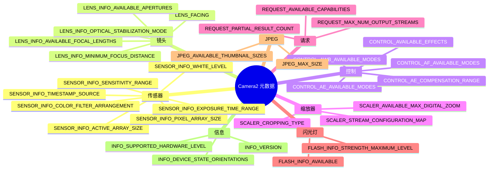

import Tabs from '@theme/Tabs';
import TabItem from '@theme/TabItem';

# 摄像头元数据百科全书

## 配套应用

在你自己的设备上实时查看本百科中每一个键 —— 安装 Android Camera Parameters 应用:

- **GitHub(开源):** [github.com/zoozooll/AndroidCameraParameters](https://github.com/zoozooll/AndroidCameraParameters)
- **Google Play:** [play.google.com/store/apps/details?id=com.minininja.cameraparams](https://play.google.com/store/apps/details?id=com.minininja.cameraparams)

该应用是本页每一个概念的活实现。下方每个元数据条目都会告诉你具体在哪个标签页和屏幕显示该值,以便你与手中真实设备进行对照验证。

---

## 元数据分类法



---

## 简介

欢迎来到摄像头元数据百科全书,这是理解描述 Android 摄像头设备每一项能力的 300+ 元数据键的权威参考。如果本系列之前的章节教的是 *如何* 操作 Camera2 —— 打开会话、构建请求、流式传输 Surface —— 本百科教的是你的摄像头 *实际能做什么*。你在 `CaptureRequest.Builder` 中启用的每一个功能,都必须先与 `CameraCharacteristics` 校对。跳过这一步,你的应用就会在某一比例的设备上崩溃,或者更糟,静默地产生损坏的输出。

本百科的存在,是因为 Camera2 元数据在官方 Android SDK 参考中的文档出了名的匮乏。文档告诉你每个键的类型(一个 `Range&lt;Int&gt;`、一个 `FloatArray` 等),却很少告诉你 *语义*:实践中的"屈光度(diopter)"是什么意思,为什么 active array size 与 pixel array size 不同,或者在暴露手动 ISO 按钮之前必须把哪些键组合在一起检查。这里的条目通过生产级代码、常见 OEM 坑,以及来自 Android Camera Parameters 数据库中数千份设备配置文件的真实设备行为,弥合了这一鸿沟。

把本页当作摄像头应用架构的查阅表。设计设置界面时,去 Control 章节;构建变焦 UI 时,去 Scaler;编写 RAW 处理流水线时,去 Sensor。每个条目都遵循同样的六点结构,所以你可以直接跳到需要的代码而无需重新学习布局。手机上的配套应用随后会验证同样的查询能对三星、索尼、海思、联发科和 Google Tensor 的真实芯片工作。

没有任何设备支持本百科中的每一个键。这正是全部要点。Camera2 开发的正确模式是:查询键 → 对结果做空检查 → 对 UI 做功能门控 → 记录兜底路径。本页给你查询、检查,以及跳过它就会踩到的坑。

---

## Camera2 元数据如何组织

Camera2 元数据存在于三个并列的类层级中,全部以 `android.hardware.camera2.CameraMetadata` 为根。摄像头 *能* 做什么的静态描述位于 `CameraCharacteristics` 中 —— 你通过 `CameraManager.getCameraIdList()` 发现某个 camera ID 后,每个 ID 只查询一次。每个请求中你 *想让* 摄像头做什么的描述位于 `CaptureRequest` 中 —— 你通过 `CaptureRequest.Builder.set()` 填充键。每帧中摄像头 *实际做了什么* 的描述位于 `CaptureResult`(或其完整变体 `TotalCaptureResult`)中 —— 你从 `CameraCaptureSession.CaptureCallback.onCaptureCompleted()` 回调里读取键。

三个层级中的所有键都继承自 `CaptureResult.Key<T>`(或其兄弟 `CameraCharacteristics.Key<T>` 和 `CaptureRequest.Key<T>`),都是强类型字段描述符。三个类合计有超过 300 个公开键,加上通过 `CameraCharacteristics.get(CameraCharacteristics.REQUEST_AVAILABLE_SESSION_KEYS)` 在某些厂商扩展上可访问的额外 OEM 私有键。本百科中的分类遵循 HAL3 接口规范所用的概念分组:Sensor 描述成像器,Lens 描述光学组件,Control 描述 3A(自动曝光、自动对焦、自动白平衡)算法,Scaler 描述裁剪与缩放流水线,Request 描述跨切面能力标志,Flash 描述手电筒/闪光灯 LED,JPEG 描述静态图像编码器,Info 描述摄像头封装与 HAL 版本。

---

## 本百科的约定

下方每个元数据条目都严格包含六个章节:

1. **它是什么?** 键、其类型和语义的 1–2 段定义。
2. **它为什么存在?** 促使 Android 工程师暴露此键(而不是隐式派生该值)的设计动机。
3. **哪些设备支持?** 此键变得有意义的最低硬件等级、能力标志和 Android 版本。
4. **如何查询?** 完整的、带空安全的 Kotlin 代码片段,展示确切的 `characteristics.get()` 调用以及错误处理。
5. **如何在 Android Camera Parameters 中查看?** 配套应用中能看到该值在设备上渲染的确切标签页层级。
6. **常见坑。** 开发者遇到的一个或多个真实问题,通常涉及 OEM 碎片化、键之间隐藏的状态耦合,或对单位的误解。

代码片段使用地道的 Kotlin,带有空安全操作符(`?.`)、Elvis 操作符(`?:`)以及用于兜底的 `run` 块。所有片段假定你已持有名为 `characteristics` 的 `CameraCharacteristics` 实例(通过 `cameraManager.getCameraCharacteristics(cameraId)` 获取)。产生用户可见输出的片段使用带单位(屈光度、纳秒、EV 步进)的字符串格式化,便于直接放进 `PreferenceScreen` 或 `TextView` 调试叠加层。

配套应用的引用总是使用同样的模式:*标签页名 / 子标签页名*。例如 "Overview / Hardware Level" 表示:打开应用,点击底部导航的 Overview 标签页,然后找 Hardware Level 卡片。如果某个键出现在多个屏幕,我们先列出规范的主位置。

---

## Sensor 分类

### SENSOR_INFO_ACTIVE_ARRAY_SIZE

**1. 它是什么?**

`SENSOR_INFO_ACTIVE_ARRAY_SIZE` 是一个 `android.graphics.Rect`,描述完整传感器晶粒(die)内活动成像区的像素坐标。实践中这是能实际读出并交付给输出流的最大像素矩形。该矩形始终轴向对齐,以 `(0,0)` 为完整像素阵列左上角的像素坐标系表示。8K×6K 传感器的典型值形如 `Rect(0, 0, 8000, 6000)`;当传感器厂商在边缘留下一圈非活动边框(光学黑像素)时则形如 `Rect(120, 160, 3880, 2880)`。

你配置的每一个输出流 —— 无论是 JPEG、YUV_420_888、RAW 还是预览 SurfaceTexture —— 最终都从这个活动区裁剪而来。当你请求一张 4:3 的 12MP JPEG,摄像头 ISP 把活动阵列裁剪到 4:3 宽高比并缩放。当你通过 `SCALER_CROP_REGION` 应用数码变焦时,该裁剪区本身就是相对活动阵列(而非像素阵列)裁剪的。

**2. 它为什么存在?**

传感器晶粒总是含有比交付给 ISP 流水线更多的物理光敏二极管。最外圈的行与列是"哑元"或"光学黑"像素,用于暗电流校准和镜头阴影校正 —— 不是真正的图像数据。没有 `SENSOR_INFO_ACTIVE_ARRAY_SIZE`,开发者就无法知道该用哪个坐标系来计算 `SCALER_CROP_REGION` 或基于人脸的裁剪跟踪。Camera1 时代完全隐藏了这一区别,导致数码变焦的数学在不同 OEM 间不一致。Camera2 显式暴露它,使裁剪区可被像素级精确计算。

**3. 哪些设备支持?**

所有 Camera2 设备在所有硬件等级(LEGACY、LIMITED、FULL、LEVEL_3)都支持此键。它出现在每个 camera ID(包括外部 USB 摄像头)的 `CameraCharacteristics.getAvailableCaptureResultKeys()` 中。该矩形始终非空,其宽/高永不超过 `SENSOR_INFO_PIXEL_ARRAY_SIZE`。

**4. 如何查询?**

```kotlin
val activeArray: Rect? = characteristics.get(
    CameraCharacteristics.SENSOR_INFO_ACTIVE_ARRAY_SIZE
)

activeArray?.let { rect ->
    val widthPx = rect.width()
    val heightPx = rect.height()
    val megapixels = (widthPx * heightPx) / 1_000_000.0
    Log.d(TAG, "活动阵列: ${widthPx}×${heightPx}px (%.1f MP)".format(megapixels))
    Log.d(TAG, "  Left=${rect.left}, Top=${rect.top}, Right=${rect.right}, Bottom=${rect.bottom}")
} ?: run {
    Log.w(TAG, "此设备上活动阵列尺寸不可用")
}
```

**5. 如何在 Android Camera Parameters 中查看?**

前往 **Sensor / Sensor Info**。活动阵列渲染为 "Sensor Geometry" 卡片的第二行,位于像素阵列尺寸下方。配套应用还把活动阵列矩形以视觉方式叠加在像素阵列的缩放表示上,让你一眼看出物理晶粒中实际可用的部分。

**6. 常见坑**

最大的错误是查询 `SENSOR_INFO_PIXEL_ARRAY_SIZE` 后期望 JPEG 输出是该分辨率。全尺寸静态图像始终使用活动阵列尺寸,而非像素阵列。在典型的 50MP 三星 ISOCELL 传感器上,像素阵列可能是 8192×6144,而活动阵列是 8000×6000。如果你按像素阵列分配 50.3MP 缓冲区,会得到一张 48MP 图像,其余像素被静默丢弃;更糟的是在旧 HAL 设备上会得到损坏的缓冲区。缓冲区尺寸永远用 `activeArray.width() * activeArray.height()`,而非像素阵列乘积。第二个常见坑是使用活动阵列坐标却不带偏移:当矩形 top/left 非零时,裁剪区数学必须加上该原点,否则变焦会偏向左上角漂移。

---

### SENSOR_INFO_PIXEL_ARRAY_SIZE

**1. 它是什么?**

`SENSOR_INFO_PIXEL_ARRAY_SIZE` 是一个 `android.util.Size`,表示传感器晶粒上物理光敏二极管的总数,包括任何光学黑或哑元边框像素。这就是"营销像素"数:108MP 传感器对外标称像素阵列尺寸为 12000×9000,无论实际交付给 ISP 流水线多少像素。类型上它是简单的 `Size`,带 `.width` 与 `.height` 字段。

与活动阵列的关系始终是:
- `pixelArray.width >= activeArray.width`
- `pixelArray.height >= activeArray.height`

差值通常在每条轴 100–400 像素,用于光学黑(OB)行和出厂镜头阴影校准。

**2. 它为什么存在?**

RAW 拍摄流水线需要完整像素尺寸以正确解析 RAW10/RAW12/RAW16 缓冲区,因为 RAW 格式(当 `SENSOR_INFO_PRE_CORRECTION_ACTIVE_ARRAY_SIZE` 不可用时)有时包含 OB 行。编写自定义去马赛克或暗帧相减代码的开发者,也需要知道每条边框要剥除多少像素才能处理。面向消费端,营销团队和基准测试应用用像素阵列尺寸报告"真实"传感器分辨率,绕开 OEM 的 ISP 裁剪。

**3. 哪些设备支持?**

所有硬件等级都暴露此键。无能力标志前置条件。支持 RAW 的设备(声明 `REQUEST_AVAILABLE_CAPABILITIES_RAW` 的设备)受 Camera2 CDD 要求,需将像素阵列尺寸报告至与物理传感器规格相差一行/列之内。

**4. 如何查询?**

```kotlin
val pixelArray: Size? = characteristics.get(
    CameraCharacteristics.SENSOR_INFO_PIXEL_ARRAY_SIZE
)

pixelArray?.let { size ->
    val mp = (size.width * size.height) / 1_000_000.0
    Log.d(TAG, "像素阵列: ${size.width}×${size.height}px (%.1f MP 营销值)".format(mp))
    
    characteristics.get(CameraCharacteristics.SENSOR_INFO_ACTIVE_ARRAY_SIZE)?.let { active ->
        val usablePct = (active.width() * active.height()).toDouble() /
                        (size.width * size.height).toDouble() * 100.0
        Log.d(TAG, "  %.1f%% 的像素可通过活动阵列交付".format(usablePct))
    }
} ?: run {
    Log.w(TAG, "像素阵列尺寸不可用")
}
```

**5. 如何在 Android Camera Parameters 中查看?**

打开 **Sensor / Sensor Info**,查看 "Sensor Geometry" 卡片第一项,标签为 "Pixel Array"。应用以 宽×高 渲染,括号中是营销像素数(例如 "8192 × 6144 (50.3 MP)")。点击该行会弹出对话框,以对比表展示像素阵列、活动阵列与 pre-correction active array。

**6. 常见坑**

把像素阵列与可交付 JPEG 尺寸混淆,在 Camera2 新手中几乎人手一份。流程始终是:(1) 查询 `SCALER_STREAM_CONFIGURATION_MAP.getOutputSizes(ImageFormat.JPEG)` 获取编码器能产生的 *实际* 分辨率,(2) 最大 JPEG 尺寸会等于(或是 `SENSOR_INFO_ACTIVE_ARRAY_SIZE` 的缩放裁剪),绝不是像素阵列。如果你写代码用像素阵列尺寸算 4:3 裁剪,结果会比 ISP 实际能交付的略宽,摄像头设备会静默夹紧 —— 在人脸跟踪变焦中引入细微的像素漂移。第二,在声明 `REQUEST_AVAILABLE_CAPABILITIES_PRIVATE_REPROCESSING` 的可重处理设备上,重处理输入尺寸使用像素阵列语义;用活动阵列做重处理会导致帧对齐错误。

---

### SENSOR_INFO_SENSITIVITY_RANGE

**1. 它是什么?**

`SENSOR_INFO_SENSITIVITY_RANGE` 是一个 `android.util.Range&lt;Int&gt;`,指定传感器 *在原始读出期间* 可应用的最小和最大 ISO(模拟增益)值。单位是 ISO 算术值:100 是基础 ISO(最干净、噪声最低的图像),6400 或更高是高感光度模式(噪声更大,相同 EV 下快门时间更短)。现代设备的典型范围:中端机 `[100, 6400]`;像素阱较大的旗舰传感器 `[50, 12800]` 或 `[32, 25600]`。

感光度在 ISP 流水线中 *先于* 任何数字增益应用。这里返回的值对应你启用手动控制后在 `CaptureRequest.SENSOR_SENSITIVITY` 中所设的值。

**2. 它为什么存在?**

每个 CMOS 传感器都有物理最小增益等级(由读出放大器决定)和最大等级(由模拟信号在削波或不可接受噪声之前可被放大多少决定)。没有显式范围,各 OEM 会用不同的隐式默认值。Camera2 暴露此范围,使手动曝光 UI 滑块有正确的最小/最大端点,并让开发者能在提交给 capture session 之前 *先* 校验手动 ISO 请求 —— 避免请求越界时 session 抛出含糊的 `IllegalArgumentException`。

**3. 哪些设备支持?**

所有设备均以 `Range&lt;Int&gt;` 暴露此键。但只有在设备能力列表中声明 `REQUEST_AVAILABLE_CAPABILITIES_MANUAL_SENSOR` 时,这些值才是 *可控制* 的。在缺少该标志的 LIMITED 等级设备上,范围仍会返回值(通常 `[100, 800]`),但在 CaptureRequest 中设置 `SENSOR_SENSITIVITY` 会被忽略 —— AE 算法继续做主。手动 ISO 的 UI 一定要基于 MANUAL_SENSOR 标志门控,而非基于范围非空。

**4. 如何查询?**

```kotlin
val sensitivityRange: Range<Int>? = characteristics.get(
    CameraCharacteristics.SENSOR_INFO_SENSITIVITY_RANGE
)

val capabilities: IntArray? = characteristics.get(
    CameraCharacteristics.REQUEST_AVAILABLE_CAPABILITIES
)
val hasManualSensor = capabilities?.contains(
    CameraCharacteristics.REQUEST_AVAILABLE_CAPABILITIES_MANUAL_SENSOR
) ?: false

sensitivityRange?.let { range ->
    Log.d(TAG, "感光度范围: ISO ${range.lower} 至 ISO ${range.upper}")
    Log.d(TAG, "  手动 ISO 控制可用: $hasManualSensor")
    
    if (hasManualSensor) {
        val stopCount = log2(range.upper.toDouble() / range.lower.toDouble())
        Log.d(TAG, "  动态范围: %.1f 档".format(stopCount))
    } else {
        Log.w(TAG, "  警告: 范围已报告但 MANUAL_SENSOR 标志缺失。")
        Log.w(TAG, "  设置 SENSOR_SENSITIVITY 会被 AE 算法忽略!")
    }
} ?: run {
    Log.w(TAG, "感光度范围不可用")
}
```

**5. 如何在 Android Camera Parameters 中查看?**

前往 **Sensor / Manual Sensor**,感光度范围以第一张卡片的 "ISO Range" 呈现。在具备 MANUAL_SENSOR 能力的设备上,范围下方有滑块预览,指示手动 UI 暴露的范围。在不支持手动的设备上,应用明确把范围标为 "Read Only",并显示警告横幅说明这些值仅供参考。

**6. 常见坑**

第一个坑:看到有效的感光度范围就启用手动 ISO 控件,却不检查 `MANUAL_SENSOR`。这会在开发者测试机(比如 Pixel 8,FULL 硬件等级)上工作,但滑块在现场约 60% 的中端机上静默无效。用户看到 UI、拖动滑块、看不到噪声变化,然后留下一星差评。一定要两个键一起检查。

第二个坑:单位混淆。`SENSOR_SENSITIVITY` 用 ISO *算术值*,不是对数。一个 *线性* 从 100 到 6400 的滑块会让顶部 75% 的轨道感觉一样(6400→3200 是一档,3200→1600 又一档,……,200→100 是最后一档),而底部 25% 覆盖 6 档。正确的滑块用对数刻度插值,使每 10% 轨道约等于一档。

---

### SENSOR_INFO_EXPOSURE_TIME_RANGE

**1. 它是什么?**

`SENSOR_INFO_EXPOSURE_TIME_RANGE` 是一个 `android.util.Range&lt;Long&gt;`,指定传感器对单帧曝光的最短和最长快门时长,以 **纳秒** 为单位。该范围内的每个值都是启用手动传感器控制时 `CaptureRequest.SENSOR_EXPOSURE_TIME` 的合法参数。中端设备的典型范围约从 `Range(1_000_000L, 1_000_000_000L)`(最短 1 毫秒、最长 1 秒),到具备专用夜景模式的旗舰 FULL 等级设备 `Range(100_000L, 10_000_000_000L)`(0.1 毫秒至 10 秒)。少数 LEVEL_3 影院级外接摄像头可达 30 秒或更长。

纳秒与常用时间单位换算:
- 1 微秒 = 1,000 ns
- 1 毫秒 = 1,000,000 ns
- 1 秒 = 1,000,000,000 ns

**2. 它为什么存在?**

Camera HAL 需要与上层有显式的快门时长约定,原因有二。其一,长曝光与 `SENSOR_FRAME_DURATION` 的交互不直观:如果你请求 5 秒曝光,最小帧时长会跳到 5 秒加传感器消隐,意味着预览回调 5 秒不到,UI 看起来卡死。其二,极短曝光(微秒级)与传感器的 rolling-shutter 倾斜交互;低于最小曝光时长时传感器读出时序跟不上,输出帧会出现损坏的扫描线。

**3. 哪些设备支持?**

与感光度范围一样,此键在所有设备上都存在,但只有当 `MANUAL_SENSOR` 在能力列表中时才 *可控制*。缺乏手动传感器支持的 LIMITED 设备仍会报告一个合理的曝光范围(通常 1 毫秒至 1/30 秒),以便 AE 时序分析工具推断 AE 算法行为,但手动设置会被忽略。完整手动控制需要范围 *加上* 能力标志两者皆有。

**4. 如何查询?**

```kotlin
fun Long.nanosToSeconds(): Double = this / 1_000_000_000.0
fun Long.nanosToMillis(): Double = this / 1_000_000.0
fun Double.secondsToNanos(): Long = (this * 1_000_000_000.0).toLong()

val exposureRange: Range<Long>? = characteristics.get(
    CameraCharacteristics.SENSOR_INFO_EXPOSURE_TIME_RANGE
)

val hasManualSensor = characteristics.get(
    CameraCharacteristics.REQUEST_AVAILABLE_CAPABILITIES
)?.contains(CameraCharacteristics.REQUEST_AVAILABLE_CAPABILITIES_MANUAL_SENSOR) ?: false

exposureRange?.let { range ->
    Log.d(TAG, "曝光时长范围:")
    Log.d(TAG, "  最小: ${range.lower} ns = %.4f ms = %.7f s"
        .format(range.lower.nanosToMillis(), range.lower.nanosToSeconds()))
    Log.d(TAG, "  最大: ${range.upper} ns = %.2f ms = %.4f s"
        .format(range.upper.nanosToMillis(), range.upper.nanosToSeconds()))
    Log.d(TAG, "  手动快门控制可用: $hasManualSensor")
    
    val shutterSpeeds = listOf(
        0.001, 0.002, 0.004, 0.008, 0.016, 0.033,
        0.066, 0.125, 0.25, 0.5, 1.0, 2.0, 4.0, 8.0
    )
    val supportedSpeeds = shutterSpeeds.filter { s ->
        val ns = s.secondsToNanos()
        ns >= range.lower && ns <= range.upper
    }
    Log.d(TAG, "  支持的常用档位: $supportedSpeeds 秒")
} ?: run {
    Log.w(TAG, "曝光时长范围不可用")
}
```

**5. 如何在 Android Camera Parameters 中查看?**

前往 **Sensor / Manual Sensor** 卡片,标题 "Exposure Range"。应用以三种方式展示数值:两端点的原始纳秒、毫秒、秒。下方一条横向时间线可视化该范围,常用快门档位(1/1000 s 至 8 s)标为刻度,一眼可看出长曝光夜景是否可行。手动控制能力用绿色对勾(可控制)或红色 "read-only" 标签指示。

**6. 常见坑**

预览卡死坑:开发者为弱光静态拍摄设置 4 秒曝光,却忘了同一个 `CaptureRequest` 会应用到 session 中的 *所有* Surface,包括预览 `SurfaceTexture`。结果:4 秒内无预览帧到达,屏幕冻结,用户以为应用崩溃。修复:为预览 Surface 使用单帧 30 fps 的常规 repeating request,然后通过 `CaptureRequest.Builder.addTarget()` 把长曝光只应用到 JPEG/RAW Surface,以单独的 `setRepeatingBurst` 或 `capture` 调用发起。

第二个坑是单位换算中的整数溢出。乘除 `1_000_000_000` 接近 32 位整数极限。任何持有纳秒的变量一律用 `Long`(64 位),并写显式辅助扩展函数(如上面的 `nanosToSeconds()`),以避免除法顺序错误。1 秒曝光存为 Int 在约 2.1 秒处溢出,导致 HAL 收到负的曝光时长,在某些联发科 HAL 上会崩溃 session 或静默夹紧到最小值。

---

### SENSOR_INFO_WHITE_LEVEL

**1. 它是什么?**

`SENSOR_INFO_WHITE_LEVEL` 是单个 `Int`,表示 RAW 传感器像素在削波前能达到的最大模数转换器(ADC)码值。对 RAW10 传感器(每通道每像素 10 位),white level 通常为 1023(2¹⁰−1)。RAW12 通常 4095。RAW14 通常 16383。部分传感器略向下取整(如 RAW14 用 16300 而非 16383),为 HDR 高光或像素缺陷校正留余量;具体值由工厂逐传感器校准。

这是每通道的饱和值。在该传感器的任一 RAW 帧中,任何达到(或超过)white level 的像素通道都代表过曝高光,无可恢复细节。

**2. 它为什么存在?**

RAW 像素格式每通道使用相同位深。RAW10 缓冲区把每个像素存为 16 位对齐整数,不熟悉 RAW 处理的开发者在归一化到浮点时自然会除以 65535(16 位最大值)。这会产生偏暗、发灰且黑点扣除错误的图像。`SENSOR_INFO_WHITE_LEVEL` 给你正确的除数:把 RAW 像素除以 `WHITE_LEVEL - BLACK_LEVEL_PATTERN`(不是 65535)得到 0.0–1.0 线性光范围。每个 RAW 传感器还有 `SENSOR_BLACK_LEVEL_PATTERN` 键,给出每通道零曝光偏移;两者结合即得完整 RAW 到浮点的归一化曲线。

**3. 哪些设备支持?**

任何在能力列表中声明 `REQUEST_AVAILABLE_CAPABILITIES_RAW` 的设备都要求此键 —— 即任何能通过 `ImageReader` 输出 RAW10/RAW12/RAW16 缓冲区的摄像头。在非 RAW 设备上该键可能仍存在(返回与传感器原生位深匹配的标称值),但无法读取 RAW 像素,所以该键仅作信息。

**4. 如何查询?**

```kotlin
val whiteLevel: Int? = characteristics.get(
    CameraCharacteristics.SENSOR_INFO_WHITE_LEVEL
)

val blackLevelPattern: IntArray? = characteristics.get(
    CameraCharacteristics.SENSOR_BLACK_LEVEL_PATTERN
)

whiteLevel?.let { wl ->
    Log.d(TAG, "SENSOR_INFO_WHITE_LEVEL = $wl")
    
    val bits = ceil(log2(wl.toDouble() + 1.0)).toInt()
    Log.d(TAG, "  有效 RAW 位深: $bits 位每通道")
    Log.d(TAG, "  最大 RAW 像素值(饱和): $wl")
    
    blackLevelPattern?.let { bl ->
        if (bl.size == 4) {
            Log.d(TAG, "  黑电平模式 (R, Gr, Gb, B) = [${bl[0]}, ${bl[1]}, ${bl[2]}, ${bl[3]}]")
            val avgBlack = (bl[0] + bl[1] + bl[2] + bl[3]) / 4.0
            val usableDnRange = wl - avgBlack
            val stops = log2(usableDnRange / avgBlack)
            Log.d(TAG, "  归一化除数: ${wl - avgBlack.toInt()}")
            Log.d(TAG, "  估算 RAW 动态范围: %.1f 档".format(stops))
        }
    } ?: run {
        Log.d(TAG, "  无黑电平模式。假设 0,直接用 $wl 归一化。")
    }
} ?: run {
    Log.w(TAG, "white level 不可用 —— 可能不支持 RAW 输出")
}
```

**5. 如何在 Android Camera Parameters 中查看?**

white level 在 **Sensor / Sensor Info** 的 "RAW Sensor Parameters" 卡片中,紧邻 black level pattern 和 color filter arrangement。若 RAW 能力存在,配套应用用设备自身的 white level 正确归一化水平渐变条做实时预览,便于视觉对比正确归一化(使用此键)与常见的除以 65535 的错误 —— 错误版本明显更暗。

**6. 常见坑**

用 65535 而非 white level 归一化,是 RAW 处理的通用第一错误。一张 RAW10 照片用 65535 归一化后亮度约为 1/64 —— 几乎纯黑。开发者会注意到并加 64× 增益补偿,但这会引入带状瑕疵,因为把 10 位信息拉伸到 16 位精度,压缩了色调范围。正确代码先减去黑电平,再除以(white level 减黑电平)。这给出正确曝光的线性光图像,可送入 gamma 与色调映射。

第二个坑:在部分 HDR 传感器上 white level 会 *逐帧* 变化,因为 staggered-HDR 读出的长/短曝光间 ADC 增益变化。在 Android 13+ 设备上,于每个 `onCaptureCompleted` 回调中检查 `CaptureResult.SENSOR_DYNAMIC_WHITE_LEVEL`;可用时用逐帧值,而非静态 `CameraCharacteristics` 常量。在 HDR 传感器上静态缓存 white level 会让短曝光帧高光削波。

---

### SENSOR_INFO_COLOR_FILTER_ARRANGEMENT

**1. 它是什么?**

`SENSOR_INFO_COLOR_FILTER_ARRANGEMENT` 是一个 `Int` 枚举,描述传感器光敏二极管上方 Bayer 滤色阵列(CFA)的布局。CFA 是给每个像素赋予红、绿、蓝感色性的微观光学马赛克(每个 2×2 块中有两个绿像素)。可能取值:
- `SENSOR_INFO_COLOR_FILTER_ARRANGEMENT_RGGB` —— 最常见(顶行红-绿,次行绿-蓝)
- `SENSOR_INFO_COLOR_FILTER_ARRANGEMENT_GRBG` —— 绿-红 / 蓝-绿 变体
- `SENSOR_INFO_COLOR_FILTER_ARRANGEMENT_BGGR` —— 蓝-绿 / 绿-红 变体(索尼传感器常见)
- `SENSOR_INFO_COLOR_FILTER_ARRANGEMENT_GBRG` —— 绿-蓝 / 红-绿 变体
- `SENSOR_INFO_COLOR_FILTER_ARRANGEMENT_MONOCHROME` —— 无滤色片,纯亮度传感器(红外或专用夜视摄像头)

该排列描述活动阵列 (x=0, y=0) 左上像素。整个传感器表面每 2×2 块重复此模式。

**2. 它为什么存在?**

RAW 传感器数据天然是单色的。必须应用去马赛克算法,通过插值每个像素缺失的两个颜色通道来重建完整 RGB 图像。去马赛克算法 *必须* 知道每个物理位置是什么颜色。若对 BGGR 传感器跑 RGGB 去马赛克,会得到颜色反转的图像:红像素变蓝,蓝变红,人眼立刻察觉肤色不对。去马赛克质量也依赖 CFA —— AMaZE 或 LMMSE 等自适应算法需要确切排列才能选对插值方向。

**3. 哪些设备支持?**

所有 RAW 能力设备必需。在不支持 RAW 输出的设备上该键可能仍存在(便于分析工具描述传感器构造),但没有 *需要* 该值的代码路径。通过 EXTERNAL 硬件等级接入的外接 USB 摄像头有时省略此键;你必须兜底为 `SENSOR_INFO_COLOR_FILTER_ARRANGEMENT_RGGB` 默认值,因为 USB UVC 摄像头几乎都用 RGGB。

**4. 如何查询?**

```kotlin
val cfa: Int? = characteristics.get(
    CameraCharacteristics.SENSOR_INFO_COLOR_FILTER_ARRANGEMENT
)

cfa?.let { arrangement ->
    val arrangementName = when (arrangement) {
        CameraCharacteristics.SENSOR_INFO_COLOR_FILTER_ARRANGEMENT_RGGB -> "RGGB"
        CameraCharacteristics.SENSOR_INFO_COLOR_FILTER_ARRANGEMENT_GRBG -> "GRBG"
        CameraCharacteristics.SENSOR_INFO_COLOR_FILTER_ARRANGEMENT_BGGR -> "BGGR"
        CameraCharacteristics.SENSOR_INFO_COLOR_FILTER_ARRANGEMENT_GBRG -> "GBRG"
        CameraCharacteristics.SENSOR_INFO_COLOR_FILTER_ARRANGEMENT_MONOCHROME -> "MONOCHROME"
        else -> "UNKNOWN (value=$arrangement)"
    }
    Log.d(TAG, "Color Filter Arrangement = $arrangementName")
    
    val isMono = arrangement == CameraCharacteristics
        .SENSOR_INFO_COLOR_FILTER_ARRANGEMENT_MONOCHROME
    
    Log.d(TAG, "  是否为单色传感器: $isMono")
    if (isMono) {
        Log.d(TAG, "  去马赛克: 不需要。像素已是纯亮度。")
        Log.d(TAG, "  提示: 跳过 de-Bayer 步骤。直接把 RAW 当灰度处理。")
    } else {
        Log.d(TAG, "  去马赛克: 需要。在 RAW 解码器中使用 CFA '$arrangementName'。")
        Log.d(TAG, "  像素 (0,0) 通道: " + when (arrangement) {
            CameraCharacteristics.SENSOR_INFO_COLOR_FILTER_ARRANGEMENT_RGGB -> "红"
            CameraCharacteristics.SENSOR_INFO_COLOR_FILTER_ARRANGEMENT_GRBG -> "绿(红行)"
            CameraCharacteristics.SENSOR_INFO_COLOR_FILTER_ARRANGEMENT_BGGR -> "蓝"
            CameraCharacteristics.SENSOR_INFO_COLOR_FILTER_ARRANGEMENT_GBRG -> "绿(蓝行)"
            else -> "?"
        })
    }
} ?: run {
    Log.w(TAG, "无 CFA 信息。外接 USB / 旧设备兜底为 RGGB。")
}
```

**5. 如何在 Android Camera Parameters 中查看?**

打开 **Sensor / Sensor Info**,在 RAW Sensor Parameters 卡片中查看 "Color Filter Array" 行。应用按传感器报告的实际排列渲染 4×4 像素的马赛克可视化 —— 红、绿、蓝方块按芯片看到的方式铺排。单色传感器渲染为平面灰色网格,标签 "NO CFA"。

**6. 常见坑**

硬编码 RGGB 去马赛克是硬失败模式。市面每颗索尼 Exmor-RS 传感器都用 BGGR,所以硬编码 RGGB 后,代码在你测试的三星 ISOCELL 手机上工作,却在每台 Xperia、大多数 Pixel 以及所有运行 Android 的 iPhone(若真存在)上产生颜色反转图像。修复很简单:读键并对去马赛克分支。许多开源 RAW 库(libraw、OpenImageIO)直接接受 CFA 枚举,把 Android CFA 值映射到库常量并透传即可。

第二个坑:`SENSOR_INFO_COLOR_FILTER_ARRANGEMENT` 描述活动阵列左上像素。若裁剪 RAW 缓冲区(比如提取 1000×1000 区域做人脸处理),CFA 模式会按 (crop.left mod 2, crop.top mod 2) *偏移*。向右裁 1 像素把 RGGB 变成 GRBG;右 1 下 1 把 RGGB 变成 BGGR。多数开发者忘了这点,用原始模式对裁剪区去马赛克,产生高频色彩摩尔纹,看起来像去马赛克 bug,其实是坐标 bug。修复:按裁剪奇偶性调整 CFA,或始终在偶数边界裁剪。

---

## Lens 分类

### LENS_FACING

**1. 它是什么?**

`LENS_FACING` 是一个 `Int` 枚举,描述摄像头模组相对于设备屏幕的物理安装方向。三个可能值:
- `LENS_FACING_BACK` —— 摄像头背向用户("主"摄像头,用于横拍风景)
- `LENS_FACING_FRONT` —— 摄像头朝向用户(自拍相机,始终装在屏幕边框或刘海中)
- `LENS_FACING_EXTERNAL` —— USB 摄像头、HDMI 采集卡或其他热插拔、方向未知的摄像头

此键对每个 camera ID 是静态的;在设备生命周期中永不变(可折叠设备除外 —— 见 Info 章节的 `INFO_DEVICE_STATE_ORIENTATIONS`)。

**2. 它为什么存在?**

facing 最直观的影响在预览变换。Android 要求后置摄像头预览随设备方向旋转,使用传感器的自然横屏方向加上 `SENSOR_ORIENTATION`;前置摄像头预览还必须 **水平镜像**,让用户像照镜子一样看自己。没有 facing 键,每个应用都得用启发式猜测哪颗是哪颗(第一 ID = 后,第二 = 前),这在 ID 0、1、2、3 全是后置的多摄设备上会失效。

**3. 哪些设备支持?**

每个设备的每个 camera ID 都报告此键。通过 `CameraManager.getCameraIdList()` 枚举的合法 camera ID 不可能没填 `LENS_FACING`。即便是 LEGACY 等级的 Camera1 包装设备也暴露它。外接 USB 摄像头默认得到 `LENS_FACING_EXTERNAL`。

**4. 如何查询?**

```kotlin
val facing: Int? = characteristics.get(
    CameraCharacteristics.LENS_FACING
)

facing?.let { f ->
    val (name, emoji) = when (f) {
        CameraCharacteristics.LENS_FACING_BACK -> "Back" to "📷"
        CameraCharacteristics.LENS_FACING_FRONT -> "Front" to "🤳"
        CameraCharacteristics.LENS_FACING_EXTERNAL -> "External" to "🔌"
        else -> "Unknown ($f)" to "❓"
    }
    Log.d(TAG, "LENS_FACING = $name $emoji")
    
    val sensorOrientation = characteristics.get(
        CameraCharacteristics.SENSOR_ORIENTATION
    ) ?: 0
    
    Log.d(TAG, "  传感器方向(自然旋转): $sensorOrientation°")
    
    val totalDisplayRotation = when (f) {
        CameraCharacteristics.LENS_FACING_FRONT -> {
            (sensorOrientation + displayRotation) % 360
            (360 - ((sensorOrientation + displayRotation) % 360)) % 360
        }
        CameraCharacteristics.LENS_FACING_BACK,
        CameraCharacteristics.LENS_FACING_EXTERNAL -> {
            (sensorOrientation + displayRotation) % 360
        }
        else -> displayRotation
    }
    Log.d(TAG, "  计算出的显示旋转: $totalDisplayRotation°")
    Log.d(TAG, "  前置摄像头: 必须水平镜像预览 TextureView/SurfaceView")
} ?: run {
    Log.e(TAG, "LENS_FACING 为 null —— 这在合法 camera ID 上不应发生")
}
```

**5. 如何在 Android Camera Parameters 中查看?**

前往 **Overview / Cameras**。第一张卡片把每个 camera ID 列为一行,以紧凑形式显示 facing、传感器方向、像素数和硬件等级。前置摄像头有 "🤳" 徽章,后置有 "📷",外接 USB 摄像头显示 "🔌"。点击任一行打开详情视图,facing 是第一个元数据字段。

**6. 常见坑**

自拍镜像坑几乎人手一份:开发者正确地为前置预览 `TextureView` 做镜像以获得自然的"照镜子"体验,然后通过 `ImageReader` 拍 JPEG,疑惑照片 *没* 镜像。镜像只是应用于预览 Surface 的 **仅显示变换**。实际传感器像素(因而 JPEG 字节)从不被镜像。用户讨厌这点:"我的自拍看起来反了!" 修复是把水平翻转写入 JPEG 的 EXIF 方向标签,用 `ExifInterface`。对前置摄像头把 `TAG_ORIENTATION` 设为 `ORIENTATION_FLIP_HORIZONTAL`。多数相册应用尊重此标志并以镜像方式显示照片;图片编辑器同理。若确需像素级翻转输出(用于上传到忽略 EXIF 的服务器),则用 `Canvas` 配合水平 `Matrix.preScale(-1f, 1f)` 在保存前对 `Bitmap` 后处理。

第二个坑:带屏下摄像头的折叠设备。同一个逻辑 camera ID 在展开时报告 `LENS_FACING_FRONT`,但预览变换会因传感器方向变化而改变。见 Info 章节的 `INFO_DEVICE_STATE_ORIENTATIONS`。永远不要把 `LENS_FACING` + `SENSOR_ORIENTATION` 作为静态对缓存 —— 设备报告配置变化时两者都要重新查询。

---

### LENS_INFO_AVAILABLE_FOCAL_LENGTHS

**1. 它是什么?**

`LENS_INFO_AVAILABLE_FOCAL_LENGTHS` 是一个 `FloatArray`,列出本摄像头通过物理镜头移动或多摄切换能产生的离散光学焦距(毫米)。单摄设备报告单元素数组如 `[4.2]`,表示 4.2 mm 定焦镜头。多摄逻辑设备(同一 camera ID 由多颗物理传感器支撑)报告形如 `[1.7, 5.0, 12.0]` 的数组,表示可选超广角(1.7 mm)、广角(5.0 mm)和潜望长焦(12.0 mm)。注意这是 **光学** 焦距,不是 35mm 等效营销数值。要得到 35mm 等效,乘以 `LENS_INFO_AVAILABLE_FOCAL_LENGTHS[i] / SENSOR_INFO_PHYSICAL_SIZE.width`。

**2. 它为什么存在?**

焦距是决定照片视角的基本属性。Camera2 变焦子系统为多摄设备重新设计,允许框架在用户捏合变焦时 *无缝切换* 物理摄像头。不知道有哪些光学焦距可用,开发者就无法设计出能在光学变焦"甜点"(1×、3×、5×)处高亮的变焦 UI —— 那些位置框架用的是真实镜头、无数码裁剪。此键让你在每个焦距处渲染带视觉刻度的变焦条。

**3. 哪些设备支持?**

所有硬件等级。单摄设备总是单元素数组。多摄能力(`REQUEST_AVAILABLE_CAPABILITIES_LOGICAL_MULTI_CAMERA`)与更长数组相关,但非严格要求 —— 部分 OEM 通过 LEGACY 等级 Camera1 包装暴露多焦距数组。在合规设备上数组保证按升序排序。

**4. 如何查询?**

```kotlin
val focalLengths: FloatArray? = characteristics.get(
    CameraCharacteristics.LENS_INFO_AVAILABLE_FOCAL_LENGTHS
)

val sensorSize: SizeF? = characteristics.get(
    CameraCharacteristics.SENSOR_INFO_PHYSICAL_SIZE
)

focalLengths?.let { fLengths ->
    Log.d(TAG, "光学焦距(${fLengths.size} 个离散值):")
    
    fLengths.sort()
    fLengths.forEachIndexed { index, mm ->
        Log.d(TAG, "  [$index] ${"%.2f".format(mm)}mm (光学)")
        
        sensorSize?.let { size ->
            val fullFrameDiagonalMm = 43.27
            val cropFactor = fullFrameDiagonalMm / hypot(size.width.toDouble(), size.height.toDouble())
            val equivalent35mm = mm * cropFactor
            val angleOfViewDeg = 2.0 * atan(size.width.toDouble() / (2.0 * mm.toDouble())) * 180.0 / Math.PI
            Log.d(TAG, "       35mm 等效: ${"%.1f".format(equivalent35mm)}mm | " +
                       "视角: ${"%.0f".format(angleOfViewDeg)}° | " +
                       "剪裁系数: ${"%.2f".format(cropFactor)}×")
        }
    }
    
    if (fLengths.size > 1) {
        val zoomRatios = fLengths.map { it / fLengths[0] }
        Log.d(TAG, "  光学变焦步进(相对最广角): " +
                   zoomRatios.joinToString("×, ") { "%.1f".format(it) } + "×")
    }
} ?: run {
    Log.w(TAG, "可用焦距数组不可用")
}
```

**5. 如何在 Android Camera Parameters 中查看?**

打开 **Lens / Lens Info**。焦距以 "Focal Lengths" 卡片呈现,显示每个光学焦距及其 35mm 等效、视角和剪裁系数。在多摄逻辑设备上,每个焦距有徽章说明它由哪个物理 camera ID 支撑,点击会渲染视角锥的视觉表示(角度越宽,三角形图越宽)。

**6. 常见坑**

焦距 vs. 对焦距离:Camera2 中最容易混淆的一对。`LENS_INFO_AVAILABLE_FOCAL_LENGTHS`(毫米)是 **镜头的光学属性** —— 场景有多宽或多窄。`LENS_FOCUS_DISTANCE`(屈光度,1/m)是 **当前对焦位置** —— 摄像头对焦在多远。设 `LENS_FOCAL_LENGTH` 在物理摄像头间切换;设 `LENS_FOCUS_DISTANCE` 移动单镜头内的对焦马达。两者正交独立。开发者常建一个滑块试图同时控制两者,结果离奇。

第二个坑:假设数组已排序。在多数 FULL 等级设备上是,但在小米和 Oppo 的某些 LEGACY 包装上最广镜头是最后一个元素而非第一个。计算变焦步进比之前一定先 `fLengths.sort()`。用错元素算比会得到 0.25× "变焦",UI 无法正确显示。

---

### LENS_INFO_MINIMUM_FOCUS_DISTANCE

**1. 它是什么?**

`LENS_INFO_MINIMUM_FOCUS_DISTANCE` 是单个 `Float`,单位 **屈光度(D)**,定义为最近可对焦距离(米)的倒数。值 `10.0` 表示镜头能对焦近至 0.1 米(10 厘米)的物体。值 `0.0` 表示镜头是定焦("focus free")—— 完全不能改变对焦距离,因为它对无穷远优化。多数自拍相机、廉价手机摄像头和广角前置摄像头是定焦。20D 或更高表示具备微距能力的模组,能对焦贴着镜头的物体。

屈光度在数学上便利,因为它们在透镜方程中线性:`1 / 距离 = 1 / 焦距 + 1 / 像距`。当你把 `CaptureRequest.LENS_FOCUS_DISTANCE` 设为某值,HAL 把它解释为屈光度。

**2. 它为什么存在?**

没有最小对焦距离,就没有编程方式判断摄像头是否支持手动对焦。若在定焦摄像头(0.0 屈光度)上显示手动对焦滑块,滑块移动对图像毫无改变 —— 让用户困惑。此键还定义 `LENS_FOCUS_DISTANCE` 请求参数的合法范围:合法值始终跨 `[0.0, minimum_focus_distance]`(无穷远到最近对焦)。拍微距时你确切知道图像变软前能凑多近。

**3. 哪些设备支持?**

所有设备都暴露,但只有配合手动控制才有意义。`MANUAL_SENSOR` 能力标志(同样)决定设置 `LENS_FOCUS_DISTANCE` 是否真改变镜头。LIMITED 等级设备可能报告 `LENS_INFO_MINIMUM_FOCUS_DISTANCE = 10.0`,但若缺 `MANUAL_SENSOR`,在 capture request 中写 `LENS_FOCUS_DISTANCE` 会被 AF 系统静默忽略。LEGACY 包装设备有时报告 `0.0`,即使物理模组 *能* 对焦 —— 这是已知的 LEGACY 包装局限。

**4. 如何查询?**

```kotlin
val minFocusDiopters: Float? = characteristics.get(
    CameraCharacteristics.LENS_INFO_MINIMUM_FOCUS_DISTANCE
)

val hasManualSensor = characteristics.get(
    CameraCharacteristics.REQUEST_AVAILABLE_CAPABILITIES
)?.contains(CameraCharacteristics.REQUEST_AVAILABLE_CAPABILITIES_MANUAL_SENSOR) ?: false

minFocusDiopters?.let { d ->
    Log.d(TAG, "LENS_INFO_MINIMUM_FOCUS_DISTANCE = %.2f D (屈光度)".format(d))
    
    val closestFocusMeters = if (d > 0.0f) (1.0 / d.toDouble()) else Double.POSITIVE_INFINITY
    val closestFocusCm = if (d > 0.0f) (100.0 / d.toDouble()) else Double.POSITIVE_INFINITY
    
    when {
        d == 0.0f -> {
            Log.d(TAG, "  镜头类型: 定焦(完全不能改变对焦)")
            Log.d(TAG, "  最近对焦: 实际为无穷远(仅风景)")
            Log.d(TAG, "  UI 操作: 完全隐藏手动对焦滑块。")
        }
        d < 2.0f -> {
            Log.d(TAG, "  镜头类型: 软可对焦(最近对焦约 ${"%.0f".format(closestFocusCm)} cm)")
            Log.d(TAG, "  UI: 显示滑块,但用户看不到多少变化。")
        }
        d >= 2.0f && d < 10.0f -> {
            Log.d(TAG, "  镜头类型: 标准对焦(最近约 ${"%.0f".format(closestFocusCm)} cm)")
        }
        d >= 10.0f && d < 20.0f -> {
            Log.d(TAG, "  镜头类型: 近摄能力(最近约 ${"%.0f".format(closestFocusCm)} cm)")
        }
        else -> {
            Log.d(TAG, "  镜头类型: 微距能力(最近 ${"%.1f".format(closestFocusCm)} cm!)")
        }
    }
    
    if (hasManualSensor) {
        Log.d(TAG, "  手动对焦: 可通过 CaptureRequest.LENS_FOCUS_DISTANCE 控制")
        Log.d(TAG, "  合法范围: [0.0 (∞) → %.2f D (${"%.0f".format(closestFocusCm)} cm)]".format(d))
    } else {
        Log.w(TAG, "  警告: 镜头报告对焦范围但 MANUAL_SENSOR 缺失。")
        Log.w(TAG, "  手动对焦滑块毫无作用。隐藏它。")
    }
} ?: run {
    Log.w(TAG, "最小对焦距离不可用")
}
```

**5. 如何在 Android Camera Parameters 中查看?**

在 **Lens / Lens Info** 的 "Minimum Focus Distance" 处查看。应用以三种方式渲染数值:原始屈光度、最近距离厘米、最近距离英寸,让你立刻判断摄像头是否具备微距能力。若值为 0.0,红色横幅警告 "FIXED FOCUS — 手动对焦滑块不可用"。应用内的手动对焦屏先读此键,当最小对焦为 0.0 或缺 MANUAL_SENSOR 时拒绝显示滑块。

**6. 常见坑**

第一:在 `minFocusDistance == 0.0f` 时显示手动对焦滑块。滑块从 0.0 到 0.0 —— 单点。UI 上这是一个无操作轨道,QA 会作为 bug 提交。正确做法是同时检查 `minFocusDistance > 0.0` 和 `MANUAL_SENSOR` 能力。任一不满足就从设置面板移除或禁用对焦滑块。Compose 中:`if (minFocus > 0f && hasManualSensor) { ManualFocusSlider(...) }`。

第二个坑:滑块上屈光度刻度反向。屈光度 *朝向* 摄像头增长(10 D = 10 cm,1 D = 1 m,0 D = ∞)。如果你天真地把 slider-left = 0.0、slider-right = minFocusDistance,"把滑块拉右"对焦 *更近* 而非更远,与用户对"近 → 远对焦"滑块的预期相反。翻转映射:滑块位置 `p ∈ [0,1]` 应映射到 `focus = (1.0 - p) * minFocusDistance`,使 slider-left = 无穷远,slider-right = 最近对焦。

---

### LENS_INFO_AVAILABLE_APERTURES

**1. 它是什么?**

`LENS_INFO_AVAILABLE_APERTURES` 是一个 `FloatArray`,列出镜头能实现的离散光圈 f 值。f 值是 `焦距 / 光圈直径` 的比值 —— 数字越小光圈越大(更多光、更浅景深),数字越大光圈越小(更少光、更深焦)。多数现代手机光圈固定:`[1.8]` 或 `[1.7]` 或 `[2.2]`,取决于镜头。少数高端设备(三星 Galaxy S9–S23 Ultra、部分小米旗舰)有 *机械双光圈* 光阑,在两档间物理切换,如 `[1.5, 2.4]`。

在 CDD 合规设备上数组按升序排序。

**2. 它为什么存在?**

摄影的"曝光三角"是 ISO、快门速度和光圈。在固定光圈手机上,三角退化为两个变量,因为光圈被锁死。可用光圈数组告诉开发者 ISO+SS+A 中的"A"到底真是第三个变量还是常量。给固定光圈摄像头显示光圈滑块的手动曝光 UI 是有 bug 的。

**3. 哪些设备支持?**

所有设备报告此数组。单元素数组(固定光圈)主导市场。多数组只存在于带物理双光圈机构的高端设备,约占 2024 年活跃设备的 &lt;1%。无能力标志前置:若数组多于一项,你可把 `CaptureRequest.LENS_APERTURE` 设为其中任一项,即可工作 —— 无需 MANUAL_SENSOR 检查,因为机械光阑切换独立于传感器增益/时序控制。

**4. 如何查询?**

```kotlin
val apertures: FloatArray? = characteristics.get(
    CameraCharacteristics.LENS_INFO_AVAILABLE_APERTURES
)

apertures?.let { stops ->
    stops.sort()
    Log.d(TAG, "可用光圈: f/${stops.joinToString(", f/") { "%.1f".format(it) }}")
    
    when (stops.size) {
        0 -> {
            Log.e(TAG, "  错误: 空光圈数组(HAL 违规)")
        }
        1 -> {
            val f = stops[0]
            Log.d(TAG, "  固定光圈 f/${"%.1f".format(f)}。")
            Log.d(TAG, "  曝光三角: 2 变量(仅 ISO + 快门速度)。")
            Log.d(TAG, "  UI: 隐藏光圈选择器 / 禁用按钮。")
        }
        else -> {
            Log.d(TAG, "  可变光圈(${stops.size} 档 —— 机械光阑!)")
            stops.forEachIndexed { i, f ->
                val lightGainedVersusSmallest = (stops.last() / f) * (stops.last() / f)
                Log.d(TAG, "    [$i] f/${"%.1f".format(f)} — 相对 f/${"%.1f".format(stops.last())} 进光 ${"%.1f".format(lightGainedVersusSmallest)}×")
            }
            Log.d(TAG, "  UI: 显示光圈选择器。通过 CaptureRequest.LENS_APERTURE 设置。")
        }
    }
} ?: run {
    Log.w(TAG, "可用光圈数组不可用")
}
```

**5. 如何在 Android Camera Parameters 中查看?**

前往 **Lens / Lens Info** —— 光圈以 "Aperture" 呈现,每个可用档位一个药丸形按钮。在可变光圈设备上,点击每个按钮实时切换光圈,预览随之变暗/变亮,可见真实景深变化。固定光圈设备上药丸呈灰色,tooltip 说明 "Fixed aperture — 不可控制"。

**6. 常见坑**

把光圈当作每台设备都可控制的参数。许多开发者从 DSLR 学曝光三角,假设手机三控件都存在。当他们在固定 f/1.8 摄像头上写 `captureRequest.set(CaptureRequest.LENS_APERTURE, 2.8f)`,HAL 静默忽略(好 HAL)或崩溃 session(差 LEGACY 包装)。在暴露光圈 UI 前总是检查 `apertures.size > 1`。两只手数得过来:少于 2 项 = 无选择器。

第二个坑:把 f 值单位与线性亮度混淆。f 值是二次的。f/1.4 比 f/2.0 进光多 2×,比 f/2.8 进光多 4×。显示光圈滑块时,用数组中的真实 f 值标签,而非线性百分比,因为每一整档视觉上让图像亮度减半或加倍。

---

### LENS_INFO_OPTICAL_STABILIZATION_MODE

**1. 它是什么?**

`LENS_INFO_OPTICAL_STABILIZATION_MODE`(注意:与列出模式数组的 `LENS_INFO_AVAILABLE_OPTICAL_STABILIZATION` 配对)是一个 `IntArray`,列出硬件光学防抖(OIS)是否可用及 HAL 支持哪些模式。标准值:
- `LENS_OPTICAL_STABILIZATION_MODE_OFF` —— 无 OIS,所有防抖须在软件(EIS)做
- `LENS_OPTICAL_STABILIZATION_MODE_ON` —— 标准静态图像 OIS,陀螺仪让镜头组上下左右移动零点几毫米抵消手抖
- `LENS_OPTICAL_STABILIZATION_MODE_VIDEO_STABILIZATION` —— 为视频拍摄优化的 OIS 配置,带匹配帧时序的滤波调校

CaptureRequest 中的配套键是 `LENS_OPTICAL_STABILIZATION_MODE`,从可用列表中选择活动模式。

**2. 它为什么存在?**

OIS 与软件 EIS(电子防抖)是两种独立防抖技术,相互交互很重要。OIS 物理移动镜头,要求为 EIS 形变预留的裁剪余量被调整。在 2019–2024 大多数 Android 设备上,HAL 不允许 OIS 与 `CONTROL_VIDEO_STABILIZATION_MODE_ON` 同时启用 —— 同时启用会导致 HAL 冲突,因为 ISP 的 EIS 形变计算器期望静态光路,而 OIS 马达照常移动。

**3. 哪些设备支持?**

所有设备暴露可用模式数组。数组中存在 `ON` 表示真实 OIS 硬件。旗舰机、多数中端机和现代长焦/潜望镜头含 OIS。廉价机(300 美元以下)和自拍相机通常只有 `[OFF]`。OIS 与硬件等级无关:存在带 OIS 的 LIMITED 设备,也存在无 OIS 的 FULL 设备。

**4. 如何查询?**

```kotlin
val availableOisModes: IntArray? = characteristics.get(
    CameraCharacteristics.LENS_INFO_AVAILABLE_OPTICAL_STABILIZATION
)

availableOisModes?.let { modes ->
    val modeNames = modes.map { m ->
        when (m) {
            CameraCharacteristics.LENS_OPTICAL_STABILIZATION_MODE_OFF -> "OFF"
            CameraCharacteristics.LENS_OPTICAL_STABILIZATION_MODE_ON -> "ON"
            CameraCharacteristics.LENS_OPTICAL_STABILIZATION_MODE_VIDEO_STABILIZATION -> "VIDEO"
            else -> "UNKNOWN($m)"
        }
    }
    Log.d(TAG, "可用 OIS 模式: [${modeNames.joinToString(", ")}]")
    
    val hasOisHardware = modes.contains(
        CameraCharacteristics.LENS_OPTICAL_STABILIZATION_MODE_ON
    ) || modes.contains(
        CameraCharacteristics.LENS_OPTICAL_STABILIZATION_MODE_VIDEO_STABILIZATION
    )
    
    Log.d(TAG, "  存在 OIS 硬件: $hasOisHardware")
    
    characteristics.get(
        CameraCharacteristics.CONTROL_AVAILABLE_VIDEO_STABILIZATION_MODES
    )?.let { eisModes ->
        val hasEis = eisModes.contains(
            CameraCharacteristics.CONTROL_VIDEO_STABILIZATION_MODE_ON
        )
        Log.d(TAG, "  软件 EIS 可用: $hasEis")
        
        if (hasOisHardware && hasEis) {
            Log.w(TAG, "  注意: 设备同时声称支持 OIS + EIS。")
            Log.w(TAG, "  许多 HAL 只允许同时开一个 —— 同时启用要测试。")
            Log.w(TAG, "  若同时启用 session 创建失败,选其一。")
        }
    }
    
    val recommendedMode = when {
        modes.contains(CameraCharacteristics
            .LENS_OPTICAL_STABILIZATION_MODE_VIDEO_STABILIZATION) -> "VIDEO 配置"
        modes.contains(CameraCharacteristics
            .LENS_OPTICAL_STABILIZATION_MODE_ON) -> "ON"
        else -> "OFF(无 OIS 硬件)"
    }
    Log.d(TAG, "  录像推荐的 OIS: $recommendedMode")
} ?: run {
    Log.w(TAG, "OIS 信息不可用")
}
```

**5. 如何在 Android Camera Parameters 中查看?**

前往 **Lens / Stabilization**。卡片以 "Available OIS Modes" 列表呈现,带 ON/OFF 状态指示。下方配套应用还显示 EIS 模式及(若两者都有的)警告横幅,说明互斥风险。应用内预览界面允许独立切换 OIS 与 EIS,让你立即看到同时启用是否在设备上导致 session 失败。

**6. 常见坑**

互斥性:头号问题是同时启用 `LENS_OPTICAL_STABILIZATION_MODE = ON` 与 `CONTROL_VIDEO_STABILIZATION_MODE = ON`。在三星 Exynos 设备上会静默丢弃 OIS(防抖效果不如纯 OIS)。在联发科设备上 CaptureSession 创建抛 `CameraAccessException` 无诊断信息。在骁龙 8 Gen 1+ 设备上能工作但预览引入 1–2 帧抖动延迟,因为 EIS 形变要等 OIS 陀螺仪延迟。安全规则:选 OIS 或 EIS,绝不两者。OIS 可用时优先(它在拍摄前纠正,保留更多光),镜头缺硬件时退而用 EIS。

第二个坑:视频优化 OIS vs. 静态 OIS。许多旗舰把 `LENS_OPTICAL_STABILIZATION_MODE_VIDEO_STABILIZATION` 作为独立模式放在数组中。录像时设 `ON` 会让 OIS 用静态图像陀螺滤波,对快速摇摄过度纠正,素材看起来"抖着粘在原地"。视频 capture session 用 VIDEO 专用模式,`ON` 只用于静态。

---

## Control 分类

### CONTROL_AE_AVAILABLE_MODES

**1. 它是什么?**

`CONTROL_AE_AVAILABLE_MODES` 是 `CONTROL_AE_MODE_*` 常量的 `IntArray`,描述 3A AE 算法支持哪些自动曝光工作模式。标准值:
- `CONTROL_AE_MODE_OFF` —— AE 锁定;曝光时长和 ISO 仅取自手动 `SENSOR_EXPOSURE_TIME` 与 `SENSOR_SENSITIVITY` 键。
- `CONTROL_AE_MODE_ON` —— 标准自动曝光;摄像头自动调整快门与增益。
- `CONTROL_AE_MODE_ON_AUTO_FLASH` —— AE + 弱光自动闪光。
- `CONTROL_AE_MODE_ON_ALWAYS_FLASH` —— AE + 强制闪光。
- `CONTROL_AE_MODE_ON_AUTO_FLASH_REDEYE` —— AE + 防红眼预闪脉冲。
- `CONTROL_AE_MODE_ON_EXTERNAL_FLASH` —— AE 配置为离机闪光灯。

CaptureRequest 等价键 `CONTROL_AE_MODE` 每次请求选其中之一。

**2. 它为什么存在?**

每个 AE 模式需要不同的 HAL 内部状态。比如防红眼模式需配置预闪序列(通常在主闪前 20–50 ms 三个 ~1/16 功率短脉冲)。外闪模式完全禁用内置闪光测光,期待同步线信号。若 HAL 不支持防红眼(比如只有单闪驱动的廉价机),该模式必须不在可用列表中。要求 HAL 用不支持的模式会导致回退到 `ON`(好 HAL)或 session 崩溃(差 LEGACY 包装)。

**3. 哪些设备支持?**

所有硬件等级。任一合法 camera ID 上保证的最小集合是 `[OFF, ON]`。闪光相关模式仅在 `FLASH_INFO_AVAILABLE = true` 时存在。防红眼即便在带闪设备上也可选;许多廉价 HAL 为省成本省略预闪脉冲电路。

**4. 如何查询?**

```kotlin
val aeModes: IntArray? = characteristics.get(
    CameraCharacteristics.CONTROL_AE_AVAILABLE_MODES
)

aeModes?.let { modes ->
    val map = modes.map { m ->
        m to when (m) {
            CameraCharacteristics.CONTROL_AE_MODE_OFF -> "OFF(仅手动)"
            CameraCharacteristics.CONTROL_AE_MODE_ON -> "ON"
            CameraCharacteristics.CONTROL_AE_MODE_ON_AUTO_FLASH -> "ON_AUTO_FLASH"
            CameraCharacteristics.CONTROL_AE_MODE_ON_ALWAYS_FLASH -> "ON_ALWAYS_FLASH"
            CameraCharacteristics.CONTROL_AE_MODE_ON_AUTO_FLASH_REDEYE -> "ON_AUTO_FLASH_REDEYE"
            CameraCharacteristics.CONTROL_AE_MODE_ON_EXTERNAL_FLASH -> "ON_EXTERNAL_FLASH"
            else -> "UNKNOWN($m)"
        }
    }
    Log.d(TAG, "可用 AE 模式:")
    map.forEach { (v, s) -> Log.d(TAG, "  $v — $s") }
    
    val hasFlash = characteristics.get(CameraCharacteristics.FLASH_INFO_AVAILABLE)
        ?: false
    val hasAutoFlash = modes.contains(
        CameraCharacteristics.CONTROL_AE_MODE_ON_AUTO_FLASH
    )
    val hasRedeye = modes.contains(
        CameraCharacteristics.CONTROL_AE_MODE_ON_AUTO_FLASH_REDEYE
    )
    
    if (!hasAutoFlash && hasFlash) {
        Log.w(TAG, "  有闪光但缺 AUTO_FLASH 模式? " +
                   "兜底: ALWAYS_FLASH 或手动手电。")
    }
    if (hasRedeye) {
        Log.d(TAG, "  防红眼: 通过预闪脉冲支持。")
    }
} ?: run {
    Log.w(TAG, "AE 模式列表不可用")
}
```

**5. 如何在 Android Camera Parameters 中查看?**

在 **Control / 3A Modes** 的第一张卡片 "AE Modes"。每个可用模式渲染为可切换按钮。点击按钮即把该模式实时应用到预览 capture session,便于观察行为变化 —— 比如指向人脸时点 RED_EYE 会触发预览帧可见的预闪序列。

**6. 常见坑**

双重 OFF 坑:`CONTROL_AE_MODE_OFF` 单独 **不会** 启用手动曝光。每个开发者接触 Camera2 第一周都会踩。存在一个全局"主控"键 `CONTROL_MODE`。若 `CONTROL_MODE` 仍是默认 `CONTROL_MODE_AUTO`,HAL 把各 3A 模式的 OFF 值理解为"别动自动行为" —— 与你期望的恰恰相反。正确的手动曝光序列是:

```kotlin
builder.set(CaptureRequest.CONTROL_MODE, CaptureRequest.CONTROL_MODE_OFF)
builder.set(CaptureRequest.CONTROL_AE_MODE, CaptureRequest.CONTROL_AE_MODE_OFF)
builder.set(CaptureRequest.CONTROL_AF_MODE, CaptureRequest.CONTROL_AF_MODE_OFF)
builder.set(CaptureRequest.CONTROL_AWB_MODE, CaptureRequest.CONTROL_AWB_MODE_OFF)
builder.set(CaptureRequest.SENSOR_SENSITIVITY, iso)
builder.set(CaptureRequest.SENSOR_EXPOSURE_TIME, exposureNs)
```

`CONTROL_MODE` 与 `CONTROL_AE_MODE` 都必须 `OFF`。只设第二个会得到看似合法的请求(不抛异常),但 AE 继续运行 —— 开发者盯着日志不明白为何 ISO 仍在变,尽管显式设置了。

---

### CONTROL_AF_AVAILABLE_MODES

**1. 它是什么?**

`CONTROL_AF_AVAILABLE_MODES` 是一个 `IntArray`,列出所有支持的对焦工作模式。标准值:
- `CONTROL_AF_MODE_OFF` —— AF 禁用;镜头对焦位置取自 `LENS_FOCUS_DISTANCE`(需 MANUAL_SENSOR)。
- `CONTROL_AF_MODE_AUTO` —— 单次 AF:用 `CONTROL_AF_TRIGGER = START` 触发对焦,收敛后锁定。
- `CONTROL_AF_MODE_MACRO` —— 单次 AF,搜索算法针对近距离(&lt;30 cm)优化。
- `CONTROL_AF_MODE_CONTINUOUS_PICTURE` —— 连续重对焦,激进,为静态拍摄调校:快速 hunt,场景变化即重对焦。
- `CONTROL_AF_MODE_CONTINUOUS_VIDEO` —— 连续重对焦,缓慢平滑:通过逐步驱动镜头避免录像中的"呼吸感"伪影。
- `CONTROL_AF_MODE_EDOF` —— 扩展景深:软件后处理模拟从 ~30 cm 到无穷远的清晰对焦,无物理镜头马达移动。

**2. 它为什么存在?**

不同用例需要根本不同的 AF 策略。视频无法容忍静态连续 AF 的激进 hunting,因为每次对焦变化都会可见地形变图像(呼吸感)并在麦克风轨上产生可闻的马达噪声。微距场景需把搜索范围限制在近距离,因为搜索完整 ∞→0.1m 范围要 800 ms 或更久。EDOF 完全不需要镜头马达。此键传达 HAL 中实际编译进了哪些算法。

**3. 哪些设备支持?**

所有硬件等级。最小集合:几乎每台设备含 `[AUTO, CONTINUOUS_PICTURE]`。`MACRO` 在定焦设备上可选(当 `LENS_INFO_MINIMUM_FOCUS_DISTANCE = 0.0` 时 MACRO 通常被省略,因为 AF 反正不能近对焦)。`EDOF` 只出现在带小传感器和后处理对焦的廉价机上。`CONTINUOUS_VIDEO` 出现在任何能通过 `MediaRecorder` 录像的设备上 —— 即几乎所有。

**4. 如何查询?**

```kotlin
val afModes: IntArray? = characteristics.get(
    CameraCharacteristics.CONTROL_AF_AVAILABLE_MODES
)

afModes?.let { modes ->
    Log.d(TAG, "可用 AF 模式:")
    modes.forEach { m ->
        val s = when (m) {
            CameraCharacteristics.CONTROL_AF_MODE_OFF -> "OFF(手动对焦位置)"
            CameraCharacteristics.CONTROL_AF_MODE_AUTO -> "AUTO(单次,触发一次)"
            CameraCharacteristics.CONTROL_AF_MODE_MACRO -> "MACRO(单次,近距优化)"
            CameraCharacteristics.CONTROL_AF_MODE_CONTINUOUS_PICTURE -> "CONTINUOUS_PICTURE(快 hunt,静态)"
            CameraCharacteristics.CONTROL_AF_MODE_CONTINUOUS_VIDEO -> "CONTINUOUS_VIDEO(平滑,无呼吸)"
            CameraCharacteristics.CONTROL_AF_MODE_EDOF -> "EDOF(软件扩展景深,无马达)"
            else -> "UNKNOWN($m)"
        }
        Log.d(TAG, "  $m — $s")
    }
    
    val hasContinuousVideo = modes.contains(
        CameraCharacteristics.CONTROL_AF_MODE_CONTINUOUS_VIDEO
    )
    val hasContinuousPicture = modes.contains(
        CameraCharacteristics.CONTROL_AF_MODE_CONTINUOUS_PICTURE
    )
    val hasEdof = modes.contains(CameraCharacteristics.CONTROL_AF_MODE_EDOF)
    
    if (hasEdof) {
        Log.w(TAG, "  存在 EDOF: AF 状态机永远报告 INACTIVE。")
        Log.w(TAG, "  不要在 EDOF 镜头上等 AF_STATE_FOCUSED_LOCKED。")
    }
    
    Log.d(TAG, "  录像模式选择器: " +
               if (hasContinuousVideo) "CONTINUOUS_VIDEO" else
               if (hasContinuousPicture) "CONTINUOUS_PICTURE(兜底)" else
               "AUTO(兜底)")
} ?: run {
    Log.w(TAG, "AF 模式列表不可用")
}
```

**5. 如何在 Android Camera Parameters 中查看?**

打开 **Control / 3A Modes**,查看 "AF Modes" 卡片。每个可用模式是一个按钮。配套应用在每个模式旁显示实时 AF 状态指示:在镜头前挥手时点 CONTINUOUS_PICTURE,状态机循环 PASSIVE_SCAN → PASSIVE_FOCUSED;点 CONTINUOUS_VIDEO 时即便有场景运动,状态机也仅每 ~2 秒迁移一次 —— 慢调校的可见证据。EDOF 模式显示 tooltip 说明无马达移动。

**6. 常见坑**

视频用 CONTINUOUS_PICTURE:这会让素材随每次重对焦"呼吸",因为静态模式调校把 AF 马达在 ~80 ms 内驱到新位置。当镜头大光圈(f/1.8)时焦平面可见偏移,用户感知为"抖动视频"。更糟的是,麦克风贴近镜头马达的手机,录音会拾取每帧马达移动的微弱可闻"嘀嘀嘀"。任何 MediaRecorder/MediaCodec 输出 Surface 都用 CONTINUOUS_VIDEO(或兜底用 AUTO 周期触发)。

EDOF 是第二个坑:在 EDOF 设备上 AF 状态机 *永不迁移到 FOCUSED_LOCKED*。阻塞在 `CaptureResult.CONTROL_AF_STATE == CONTROL_AF_STATE_FOCUSED_LOCKED` 上的开发者会永远等待一个永不到来的状态。EDOF 用 `CONTROL_AF_STATE_INACTIVE` 作稳态,因为没有物理马达可锁。开始静态拍摄的正确模式是:若 `AF_MODE == EDOF` → 跳过 AF 触发,立即拍摄。否则:触发 AF,等 FOCUSED_LOCKED 或 NOT_FOCUSED_LOCKED,再拍。

---

### CONTROL_AWB_AVAILABLE_MODES

**1. 它是什么?**

`CONTROL_AWB_AVAILABLE_MODES` 是一个 `IntArray`,枚举 AWB 算法支持的自动白平衡与固定色温模式。标准值:
- `CONTROL_AWB_MODE_OFF` —— AWB 禁用;颜色校正取自 `COLOR_CORRECTION_TRANSFORM` 与 `COLOR_CORRECTION_GAINS`(手动控制需 MANUAL_POST_PROCESSING 能力,否则被忽略)。
- `CONTROL_AWB_MODE_AUTO` —— 连续 AWB 收敛;从图像统计估计场景色温。
- `CONTROL_AWB_MODE_INCANDESCENT` —— 固定暖白平衡 ~2700K(钨丝/室内灯泡)。
- `CONTROL_AWB_MODE_FLUORESCENT` —— 固定冷白荧光 ~4500K。
- `CONTROL_AWB_MODE_WARM_FLUORESCENT` —— 固定暖荧光 ~3000K。
- `CONTROL_AWB_MODE_DAYLIGHT` —— 固定日光 ~5500K。
- `CONTROL_AWB_MODE_CLOUDY_DAYLIGHT` —— 固定阴天日光 ~6500K。
- `CONTROL_AWB_MODE_TWILIGHT` —— 固定黄昏/黎明 ~4000K。
- `CONTROL_AWB_MODE_SHADE` —— 固定深荫 ~7500K。

每个预设对应 ISP 颜色校正流水线中应用的一组固定 RGB 增益。

**2. 它为什么存在?**

AWB 预设解决"如何让照片看起来像我眼睛所见"的问题,在可预测光线下。通用 `AUTO` 模式有时会决策错误:纯红色的墙让 AWB 算法以为场景被青光照亮,于是施加整体绿色偏。如果用户明确在钨丝灯下拍照,选 `INCANDESCENT` 告诉 HAL:"我已知光温 —— 用为此光源校准的增益,别用自动估计器。"

**3. 哪些设备支持?**

所有设备。最小集合 `[OFF, AUTO]`。八个预设模式出现在约 70% 设备上;其余 30%(较旧设备、某些 USB 摄像头)省略较稀有的 `WARM_FLUORESCENT` 或 `SHADE`。无闪光依赖:这些是独立于光源的固定颜色校准值。

**4. 如何查询?**

```kotlin
val awbModes: IntArray? = characteristics.get(
    CameraCharacteristics.CONTROL_AWB_AVAILABLE_MODES
)

awbModes?.let { modes ->
    val labelFor: (Int) -> Pair<String, Int> = { m ->
        when (m) {
            CameraCharacteristics.CONTROL_AWB_MODE_OFF -> "OFF(手动 CC 增益)" to 0
            CameraCharacteristics.CONTROL_AWB_MODE_AUTO -> "AUTO(连续估计)" to -1
            CameraCharacteristics.CONTROL_AWB_MODE_INCANDESCENT -> "INCANDESCENT(钨丝)" to 2700
            CameraCharacteristics.CONTROL_AWB_MODE_FLUORESCENT -> "FLUORESCENT(冷白)" to 4500
            CameraCharacteristics.CONTROL_AWB_MODE_WARM_FLUORESCENT -> "WARM_FLUORESCENT" to 3000
            CameraCharacteristics.CONTROL_AWB_MODE_DAYLIGHT -> "DAYLIGHT" to 5500
            CameraCharacteristics.CONTROL_AWB_MODE_CLOUDY_DAYLIGHT -> "CLOUDY_DAYLIGHT" to 6500
            CameraCharacteristics.CONTROL_AWB_MODE_TWILIGHT -> "TWILIGHT" to 4000
            CameraCharacteristics.CONTROL_AWB_MODE_SHADE -> "SHADE" to 7500
            else -> "UNKNOWN($m)" to -1
        }
    }
    
    Log.d(TAG, "可用 AWB 模式:")
    modes.forEach { m ->
        val (s, k) = labelFor(m)
        val kelvinStr = if (k > 0) " ~${k}K" else if (k == 0) " (通过 MANUAL_POST_PROCESSING 手动 CTCC)" else ""
        Log.d(TAG, "  $m — $s$kelvinStr")
    }
    
    val presetCount = modes.count { it != CameraCharacteristics.CONTROL_AWB_MODE_OFF &&
                                     it != CameraCharacteristics.CONTROL_AWB_MODE_AUTO }
    Log.d(TAG, "  可用固定预设: $presetCount / 7 标准")
    
    val missing = listOf(
        CameraCharacteristics.CONTROL_AWB_MODE_INCANDESCENT,
        CameraCharacteristics.CONTROL_AWB_MODE_FLUORESCENT,
        CameraCharacteristics.CONTROL_AWB_MODE_WARM_FLUORESCENT,
        CameraCharacteristics.CONTROL_AWB_MODE_DAYLIGHT,
        CameraCharacteristics.CONTROL_AWB_MODE_CLOUDY_DAYLIGHT,
        CameraCharacteristics.CONTROL_AWB_MODE_TWILIGHT,
        CameraCharacteristics.CONTROL_AWB_MODE_SHADE
    ).filter { !modes.contains(it) }
    
    if (missing.isNotEmpty()) {
        Log.w(TAG, "  缺少的标准 AWB 预设: $missing")
        Log.w(TAG, "  UI: 只显示存在的预设。不要硬编码全部 8 个。")
    }
} ?: run {
    Log.w(TAG, "AWB 模式列表不可用")
}
```

**5. 如何在 Android Camera Parameters 中查看?**

在 **Control / 3A Modes** 的 "AWB Modes" 卡片。每个预设是一个按钮,带一小块色样展示该预设的大致偏色。在室内光下从 AUTO 起步,然后点 INCANDESCENT,预览立即变冷(橙色减少),因为预设去除了钨丝灯橙色偏。日光下点 SHADE 让预览略变暖,因为预设补偿荫光的蓝色偏。

**6. 常见坑**

假设预设温度值跨 OEM 一致。Android CDD 不要求 `DAYLIGHT` 精确为 5500K;只要求预设"近似日光"。实践中:三星的 `DAYLIGHT` ~5200K(略暖),Google Pixel 的 `DAYLIGHT` ~5700K(略冷),一加的 `DAYLIGHT` ~5400K。若你建自定义颜色流水线并依赖 DAYLIGHT 产生精确 5500K 增益,输出颜色会随设备偏移 200–500K。要跨设备精确颜色,用 `MANUAL_POST_PROCESSING` 能力并基于校准场景(X-Rite 色卡)手动设 `COLOR_CORRECTION_GAINS` + `COLOR_CORRECTION_TRANSFORM`。

无 MANUAL_POST_PROCESSING 的 AWB_MODE_OFF 是第二个坑。像 AE 一样,全局主控至关重要。AWB 设 OFF 而 `CONTROL_MODE != OFF` 会产生 HAL 忽略 OFF 的请求。手动 AWB(自定义色温)需 `CONTROL_MODE = OFF` *和* `MANUAL_POST_PROCESSING` 能力,而非仅 `MANUAL_SENSOR`。MANUAL_SENSOR 给 ISO/快门;MANUAL_POST_PROCESSING 给颜色增益和色调映射。

---

### CONTROL_AVAILABLE_EFFECTS

**1. 它是什么?**

`CONTROL_AVAILABLE_EFFECTS` 是 `IntArray`,列出在 ISP 流水线内应用的内置 OEM 滤镜。标准效果值:
- `CONTROL_EFFECT_MODE_OFF` —— 无颜色效果(默认)。
- `CONTROL_EFFECT_MODE_MONO` —— 灰度/黑白。
- `CONTROL_EFFECT_MODE_NEGATIVE` —— 反色(胶片负片观感)。
- `CONTROL_EFFECT_MODE_SOLARIZE` —— Sabattier 风格的部分反转。
- `CONTROL_EFFECT_MODE_SEPIA` —— 棕调复古观感。
- `CONTROL_EFFECT_MODE_POSTERIZE` —— 减少调色板/色带化。
- `CONTROL_EFFECT_MODE_WHITEBOARD` —— 为白板拍摄增强(提对比、去阴影)。
- `CONTROL_EFFECT_MODE_BLACKBOARD` —— 为深色粉笔板增强(提暗笔触,部分 HAL 裁到板边缘)。
- `CONTROL_EFFECT_MODE_AQUA` —— 增强蓝色通道/水下观感。

加上完全由厂商定义的 OEM 专有值(100+、101+ 等)。

**2. 它为什么存在?**

内置 ISP 效果以全预览分辨率运行,零 CPU 开销,因为它们由摄像头 ISP 内的硬件查找表实现。在 CPU/GPU 上通过 RenderScript 或 Vulkan 跑等效效果,4K 每帧 5–15 ms,挤占帧预算。此键广告 HAL 中烘焙了哪些 LUT。

**3. 哪些设备支持?**

所有设备至少列 `[OFF]`。中端和廉价机典型含 3–6 个效果(MONO、SEPIA、NEGATIVE,可能加 POSTERIZE)。旗舰三星和小米设备提供 12+ 效果,包括通过厂商私有值(不在标准枚举)提供的"Vintage""Blue Ice""Provia"等 OEM 扩展。Pixel 设备效果最少,多数代际仅提供 OFF 和 MONO。

**4. 如何查询?**

```kotlin
val effects: IntArray? = characteristics.get(
    CameraCharacteristics.CONTROL_AVAILABLE_EFFECTS
)

effects?.let { effs ->
    val standardName = mapOf(
        CameraCharacteristics.CONTROL_EFFECT_MODE_OFF to "OFF(无效果)",
        CameraCharacteristics.CONTROL_EFFECT_MODE_MONO to "MONO(黑白)",
        CameraCharacteristics.CONTROL_EFFECT_MODE_NEGATIVE to "NEGATIVE(反色)",
        CameraCharacteristics.CONTROL_EFFECT_MODE_SOLARIZE to "SOLARIZE",
        CameraCharacteristics.CONTROL_EFFECT_MODE_SEPIA to "SEPIA",
        CameraCharacteristics.CONTROL_EFFECT_MODE_POSTERIZE to "POSTERIZE",
        CameraCharacteristics.CONTROL_EFFECT_MODE_WHITEBOARD to "WHITEBOARD",
        CameraCharacteristics.CONTROL_EFFECT_MODE_BLACKBOARD to "BLACKBOARD",
        CameraCharacteristics.CONTROL_EFFECT_MODE_AQUA to "AQUA"
    )
    
    Log.d(TAG, "可用 ISP 效果(${effs.size} 个模式):")
    effs.forEach { e ->
        val standard = standardName[e]
        if (standard != null) {
            Log.d(TAG, "  $e — $standard")
        } else {
            Log.d(TAG, "  $e — OEM_PRIVATE_EFFECT(厂商定义)")
        }
    }
    
    val oemCount = effs.count { it > CameraCharacteristics.CONTROL_EFFECT_MODE_AQUA }
    if (oemCount > 0) {
        Log.w(TAG, "  OEM 私有效果: $oemCount。行为跨设备不可移植。")
        Log.w(TAG, "  三星上同数值效果 ≠ 小米上同数值视觉效果。")
    }
} ?: run {
    Log.w(TAG, "效果列表不可用")
}
```

**5. 如何在 Android Camera Parameters 中查看?**

前往 **Control / Effects**。每个效果是一个小缩略图,显示带效果名的预览色样。点击缩略图即时把效果应用到实时预览 —— 快速切换可并排比较 MONO、SEPIA、AQUA。OEM 私有效果标为 "OEM [编号]",带警告 tooltip 说明可能不可移植。效果画廊下方有基准卡片,显示开/关效果时的帧率,展示 ISP 效果相对 GPU 处理的零成本特性。

**6. 常见坑**

可移植性:内置效果是 Camera2 中 OEM 差异最大的特性。即便 *标准* MONO 模式视觉也不一致:三星 MONO 用红通道加权亮度(`0.30R + 0.50G + 0.20B`)带轻微 S 曲线;Pixel MONO 用 BT.709 加权(`0.2126R + 0.7152G + 0.0722B`)无 S 曲线。SEPIA 色调从 reddish-brown(LG)、纯黄棕(索尼)到近冷棕(一加)不等。若应用核心视觉身份依赖特定滤镜观感,用固定系数的 GPU 着色器实现。把 ISP 效果留给:(1) 零成本预览便利,或(2) 已 QA 测试设备上的平台专属特性。绝不要在营销中把效果标为"Sepia",若跨设备视觉输出差异达 100ΔE。

第二个坑:效果 + 人脸检测 + HDR 流水线交互。在某些索尼和联发科 HAL 上,启用 SEPIA 或 NEGATIVE 效果会禁用 HDR 处理(因为 ISP HDR 色调映射与 SEPIA LUT 共用同一硬件流水线阶段)。开发者启用 HDR 与 SEPIA,拍一张,看不到 HDR 高光恢复。唯一修复是 HDR 激活时把效果改到拍摄后处理。

---

### CONTROL_AE_COMPENSATION_RANGE

**1. 它是什么?**

`CONTROL_AE_COMPENSATION_RANGE` 是一个 `android.util.Range&lt;Int&gt;`,指定你可传给 `CaptureRequest.CONTROL_AE_EXPOSURE_COMPENSATION` 的最小和最大 EV 调整偏移。关键是,这些值 **是整数步进**,不是档。每步对应 `CONTROL_AE_COMPENSATION_STEP`,后者是 `Rational`(分数)如 `Rational(1, 3)`(每步 0.333 EV)。组合:
- `范围 = [-12, +12]`,`步进 = 1/3 EV` → 有效 EV 范围 = -4 EV 到 +4 EV(1/3 档增量)
- `范围 = [-24, +24]`,`步进 = 1/2 EV` → 有效 EV 范围 = -12 EV 到 +12 EV(1/2 档增量)

补偿值加到 AE 算法本会选的曝光上,让图像偏亮(+)或偏暗(−)。

**2. 它为什么存在?**

AE 算法做全局场景决策。当亮光占画面 10%(室内场景的窗户),AE 会让室内区域欠曝。用户想"+1 EV"让室内更亮,哪怕窗户过曝。EV 补偿是摄影师的标准控件 —— 每个 DSLR 都有 ± 拨盘。

**3. 哪些设备支持?**

所有硬件等级,CDD 最低要求某步进下至少 ±3 EV 范围。LIMITED 设备典型提供 `[-12, +12]` 配 1/3 或 1/2 步进(±4 EV 或 ±6 EV 总量)。FULL 设备提供 `[-24, +24]` 或更宽。无能力标志要求 —— 只要范围存在(始终存在),设 `CONTROL_AE_EXPOSURE_COMPENSATION` 就工作,与 MANUAL_SENSOR 无关。

**4. 如何查询?**

```kotlin
val compensationRange: Range<Int>? = characteristics.get(
    CameraCharacteristics.CONTROL_AE_COMPENSATION_RANGE
)

val compensationStep: Rational? = characteristics.get(
    CameraCharacteristics.CONTROL_AE_COMPENSATION_STEP
)

compensationRange?.let { rng ->
    val step = compensationStep ?: Rational(1, 3)
    
    val stepValue = step.numerator.toDouble() / step.denominator.toDouble()
    val evMin = rng.lower * stepValue
    val evMax = rng.upper * stepValue
    
    Log.d(TAG, "CONTROL_AE_COMPENSATION_RANGE = [${rng.lower}, ${rng.upper}] (步进)")
    Log.d(TAG, "CONTROL_AE_COMPENSATION_STEP = ${step.numerator}/${step.denominator} = ${"%.4f".format(stepValue)} EV/步")
    Log.d(TAG, "  有效 EV 范围: ${"%.1f".format(evMin)} EV — ${"%.1f".format(evMax)} EV")
    Log.d(TAG, "  总余量: ${"%.1f".format(evMax - evMin)} EV")
    
    val discreteSteps = (rng.upper - rng.lower) + 1
    Log.d(TAG, "  离散位置: $discreteSteps (含 0)")
    
    val sliderPositions: List<Pair<Int, Double>> = (rng.lower..rng.upper step max(1, discreteSteps / 10))
        .map { stepIdx -> stepIdx to stepIdx * stepValue }
    
    Log.d(TAG, "  采样滑块位置(步进 → EV):")
    sliderPositions.take(11).forEach { (idx, ev) ->
        val marker = when {
            idx == rng.lower -> " (MIN)"
            idx == 0 -> " (ZERO/METERED)"
            idx == rng.upper -> " (MAX)"
            else -> ""
        }
        Log.d(TAG, "    步进=$idx → EV=${"%+.2f".format(ev)}$marker")
    }
} ?: run {
    Log.w(TAG, "AE 补偿信息不可用")
}
```

**5. 如何在 Android Camera Parameters 中查看?**

前往 **Control / 3A Modes**,查看 "Exposure Compensation" 卡片。卡片以双向标签显示有效 EV 范围(如 "−4 EV 至 +4 EV")、步进(如 "1/3 EV 步进")及一条实时可拖滑块,对上例有 21 个离散刻度。拖动滑块实时应用补偿,预览立即变亮或变暗。滑块下方并排显示原始整数步进值与有效 EV 值,可见步进到 EV 的乘法过程。

**6. 常见坑**

单位、单位、单位。头号错误:把 `Range&lt;Int&gt;` 值直接当 *档*。开发者看到 `[-12, +12]`,显示标签 "−12 EV" 到 "+12 EV" 的滑块,而滑块最大效果只有 +4 EV(因为步进是 1/3)。用户抱怨:"为什么 +12 EV 设置只有 +4 档?" 修复简单:在格式化 EV 标签前乘 `sliderInt × step.numerator / step.denominator`,把滑块内部最大设为 `range.upper` 而非人类可读档数。UI 滑块内部存整数步进,向用户显示换算后的 EV 值。

第二个坑:补偿跨请求持久。与 ISO 或快门时长不同,AE 补偿在多数 HAL 上是 3A 算法内的粘滞状态。若为某次静态拍摄设补偿 = +6 后忘了为下次拍摄重置 0,下一次预览和拍摄都会亮 2 档。一次性拍摄后总是把补偿归 0,或显式在每个 repeating request 中设置,而非依赖 HAL 默认状态。

## 缩放器类别

### SCALER_STREAM_CONFIGURATION_MAP

**1. 它是什么?**

`SCALER_STREAM_CONFIGURATION_MAP` 是一个 `android.hardware.camera2.params.StreamConfigurationMap` 对象 —— 整个 Camera2 中用于发现支持的输出的最重要数据结构。它包含:
- `getOutputSizes(int format)` —— `ImageFormat.JPEG`、`ImageFormat.YUV_420_888`、`ImageFormat.RAW_SENSOR` 等支持的分辨率。
- `getOutputSizes(Class<T> klass)` —— `SurfaceTexture`(预览)、`MediaRecorder`、`MediaCodec`、`RenderScript.Allocation` 支持的分辨率。
- `getHighSpeedVideoSizes()` / `getHighSpeedVideoFpsRanges()` —— 受限高速视频(120 fps、240 fps 等)的分辨率和帧率。
- `getValidOutputFormatsForInput()` —— `PRIVATE_REPROCESSING` 或 `YUV_REPROCESSING` 设备上支持作为再处理输入的格式。
- `getOutputMinFrameDuration(int format, Size size)` —— 此格式/尺寸对的最快可能帧间隔(纳秒),即 max fps = 1e9 / minFrameDuration。

此映射是"我可以配置哪些分辨率"的权威来源;切勿在不先检查映射的情况下使用硬编码的 1920×1080 或 3840×2160 值。

**2. 它为何存在?**

Camera2 支持 8+ 种输出格式 × 30+ 种可能的 Surface 类 × 厂商特定分辨率。在 `StreamConfigurationMap` 出现之前(Camera1 时代),开发者必须为每种 Surface 类分别遍历 `getSupportedPictureSizes()` / `getSupportedPreviewSizes()` 列表,并手动交叉匹配宽高比。统一映射通过为每个格式-Surface 对返回 HAL 能驱动的精确分辨率列表解决了这一问题。最小帧时长数据让你能确定某设备上 4K60 是否可行,或 4K30 是否是上限。

**3. 哪些设备支持它?**

所有有效的 Camera2 设备。LEGACY 级设备通过包装 Camera1 的 `Parameters.getSupported*Sizes()` 方法在内部生成映射,这偶尔会导致 LEGACY 怪异行为(报告了分辨率但无法驱动,或反之)。FULL 级设备保证映射中的每个尺寸在其列出的最小帧时长下确实可驱动。高速尺寸仅在具有 `CONSTRAINED_HIGH_SPEED_VIDEO` 能力的设备上才会填充。

**4. 如何查询它?**

```kotlin
val configMap: StreamConfigurationMap? = characteristics.get(
    CameraCharacteristics.SCALER_STREAM_CONFIGURATION_MAP
)

configMap?.let { map ->
    Log.d(TAG, "Stream Configuration Map summary:")
    
    // JPEG(静态照片)
    val jpegSizes = map.getOutputSizes(ImageFormat.JPEG)?.sortedByDescending { it.width * it.height }
        ?: emptyArray()
    Log.d(TAG, "  JPEG still sizes (${jpegSizes.size}): " +
               if (jpegSizes.isNotEmpty())
                   "${jpegSizes.first().width}×${jpegSizes.first().height} (max) " +
                   "down to ${jpegSizes.last().width}×${jpegSizes.last().height}"
               else "none")
    
    // YUV_420_888(图像分析)
    val yuvSizes = map.getOutputSizes(ImageFormat.YUV_420_888)?.sortedByDescending { it.width * it.height }
        ?: emptyArray()
    Log.d(TAG, "  YUV_420_888 sizes (${yuvSizes.size}): " +
               if (yuvSizes.isNotEmpty()) "${yuvSizes.first()} (max)" else "none")
    
    // SurfaceTexture(预览)
    val previewSizes = map.getOutputSizes(SurfaceTexture::class.java)
        ?.sortedByDescending { it.width * it.height } ?: emptyArray()
    Log.d(TAG, "  Preview (SurfaceTexture) sizes (${previewSizes.size}): " +
               if (previewSizes.isNotEmpty()) "${previewSizes.first()} (max)" else "none")
    
    // RAW10/RAW12(若支持)
    if (characteristics.get(CameraCharacteristics.REQUEST_AVAILABLE_CAPABILITIES)
            ?.contains(CameraCharacteristics.REQUEST_AVAILABLE_CAPABILITIES_RAW) == true) {
        val rawSizes = map.getOutputSizes(ImageFormat.RAW_SENSOR)
        Log.d(TAG, "  RAW_SENSOR sizes (${rawSizes?.size ?: 0}): ${rawSizes?.joinToString() ?: "none"}")
    }
    
    // 最大帧率
    jpegSizes.firstOrNull()?.let { maxJpeg ->
        val ns = map.getOutputMinFrameDuration(ImageFormat.JPEG, maxJpeg)
        val fps = 1_000_000_000.0 / ns.toDouble()
        Log.d(TAG, "  Max JPEG (${maxJpeg}): ${ns}ns/frame = ${"%.1f".format(fps)} fps ceiling")
    }
    
    previewSizes.firstOrNull { it.width <= 1920 && it.height <= 1080 }?.let { fhd ->
        val ns = map.getOutputMinFrameDuration(SurfaceTexture::class.java, fhd)
        Log.d(TAG, "  1080p preview min frame: ${ns}ns (${"%.0f".format(1e9 / ns)} fps max)")
    }
    
    // 高速视频
    val hsCaps = characteristics.get(
        CameraCharacteristics.REQUEST_AVAILABLE_CAPABILITIES
    )?.contains(
        CameraCharacteristics.REQUEST_AVAILABLE_CAPABILITIES_CONSTRAINED_HIGH_SPEED_VIDEO
    ) ?: false
    if (hsCaps) {
        val hsSizes = map.highSpeedVideoSizes
        val hsRanges = map.highSpeedVideoFpsRanges
        Log.d(TAG, "  High-speed video sizes: ${hsSizes?.joinToString() ?: "none"}")
        Log.d(TAG, "  High-speed FPS ranges: ${hsRanges?.joinToString() ?: "none"}")
    }
    
    // 宽高比匹配辅助演示
    val sensor = characteristics.get(CameraCharacteristics.SENSOR_INFO_ACTIVE_ARRAY_SIZE)!!
    val sensorAr = sensor.width().toDouble() / sensor.height().toDouble()
    val ratios = setOf(4.0/3.0, 16.0/9.0, 18.0/9.0, 1.0, 20.0/9.0, sensorAr)
    Log.d(TAG, "  Sensor aspect ratio: ${"%.3f".format(sensorAr)} (w:h)")
    Log.d(TAG, "  Common target ratios: 4:3=${"%.3f".format(4.0/3.0)}, " +
               "16:9=${"%.3f".format(16.0/9.0)}, 1:1=1.000")
} ?: run {
    Log.w(TAG, "Stream configuration map unavailable — this is a FATAL error")
}
```

**5. 如何在 Android Camera Parameters 中查看?**

前往 **Streams / Formats**。该标签页以格式选择器芯片条打开(JPEG、YUV、RAW、Preview SurfaceTexture、MediaRecorder……)。选择一种格式会按像素数降序渲染支持的分辨率。每个分辨率行显示:像素尺寸、百万像素数、宽高比徽章,以及由最小帧时长推导出的最大 FPS。点击任意分辨率会打开详情页,显示该特定格式-尺寸对的 `getOutputMinFrameDuration()`,以及一个"在预览中尝试此尺寸"按钮,可实时将配套应用的预览切换到所选分辨率,以便你确认它确实可用。当能力存在时,Streams 标签页还有一个专用的"High Speed"子标签页用于 `getHighSpeedVideoSizes()`。

**6. 常见坑**

宽高比计算中的旋转/方向。摄像头自然方向为横向:`SENSOR_ORIENTATION = 90` 意味着传感器的像素行相对于设备的竖屏是竖向排列的。对 JPEG 的 `getOutputSizes()` 调用返回 `3840×2160`(横向),但在竖向的后置摄像头上,这对用户表现为 2160×3840(竖向)。如果你的 UI 使用原始 `Size.width / Size.height` 值计算宽高比而不考虑 90°/270° 旋转,你会把 16:9 和 9:16 颠倒,把 3840×2160 标为"宽屏",而它本应匹配屏幕的 9:19.5 宽高比。正确代码:

```kotlin
fun Size.aspectRatioForDisplay(sensorOrientationDeg: Int): Double {
    val swapped = sensorOrientationDeg == 90 || sensorOrientationDeg == 270
    return if (swapped) height.toDouble() / width.toDouble()
           else width.toDouble() / height.toDouble()
}
```

第二个坑:LEGACY 包装的 HAL 在 StreamConfigurationMap 中报告了 Camera1 实际无法驱动的尺寸。常见模式是 `LEGACY` 映射列出 4K JPEG,而 Camera1 能产生的最大值是 1080p。如果 `INFO_SUPPORTED_HARDWARE_LEVEL == LEGACY`,应对最大 JPEG 尺寸持怀疑态度;优先使用 `Parameters.getSupportedPictureSizes()`,或通过实际创建 `ImageReader` 并执行一次测试拍摄来验证,然后再在 UI 中暴露它。

---

### SCALER_AVAILABLE_MAX_DIGITAL_ZOOM

**1. 它是什么?**

`SCALER_AVAILABLE_MAX_DIGITAL_ZOOM` 是单个 `Float`,表示数字变焦允许的最大裁剪比率。值 `10.0f` 意味着你可以在每个维度上裁剪到活动数组的 1/10(裁剪区域的宽度和高度不小于活动数组宽度和高度的 1/10)。这是*纯数字变焦* —— 是 ISP 裁剪 + 放大操作,固有地存在质量损失。例如,zoom = 2.0× 意味着:将活动数组裁剪到 50% 宽 × 50% 高,然后使用 ISP 的缩放器块将其放大回输出流尺寸。

此键定义了 `CaptureRequest.SCALER_CROP_REGION` 矩形逆尺寸的有效范围。

**2. 它为何存在?**

没有明确的变焦最大比率,开发者会把活动数组裁剪到任意尺寸。裁剪到 1 像素 × 1 像素并让 HAL 放大到 4K 输出在数学上合法,但产生的是 0.0 MP 的图像。HAL 使用最小尺寸限制(每个输出 Surface 有最小输出尺寸,通常每轴 ≥64 px),而 max-zoom 键将组合约束作为单个对开发者友好的比率传达。

**3. 哪些设备支持它?**

所有硬件级别。值始终 ≥ 1.0。LIMITED 设备通常出厂最大变焦在 4× 到 8× 之间。FULL 设备和具有 `LOGICAL_MULTI_CAMERA` 能力的设备通常出厂时为 10×、20× 甚至 100× 最大数字变焦,以匹配营销变焦规格。无能力标志先决条件。

**4. 如何查询它?**

```kotlin
val maxDigitalZoom: Float? = characteristics.get(
    CameraCharacteristics.SCALER_AVAILABLE_MAX_DIGITAL_ZOOM
)

maxDigitalZoom?.let { maxZoom ->
    Log.d(TAG, "SCALER_AVAILABLE_MAX_DIGITAL_ZOOM = ${"%.1f".format(maxZoom)}×")
    
    val active = characteristics.get(CameraCharacteristics.SENSOR_INFO_ACTIVE_ARRAY_SIZE)!!
    val activeW = active.width()
    val activeH = active.height()
    
    Log.d(TAG, "  Active array: ${activeW}×${activeH}")
    val minCropW = ceil(activeW / maxZoom).toInt()
    val minCropH = ceil(activeH / maxZoom).toInt()
    Log.d(TAG, "  Minimum crop region size at max zoom: ${minCropW}×${minCropH}px")
    
    val optical = characteristics.get(CameraCharacteristics.LENS_INFO_AVAILABLE_FOCAL_LENGTHS)
    if (optical != null && optical.size > 1) {
        val opticalMax = optical.last() / optical[0]
        Log.d(TAG, "  Optical zoom from multi-camera: ${"%.1f".format(opticalMax)}×")
        Log.d(TAG, "  'Marketing' zoom (optical × digital): " +
                   "${"%.1f".format(opticalMax)} × ${"%.1f".format(maxZoom)} = " +
                   "${"%.0f".format(opticalMax * maxZoom)}×")
    }
    
    val stepCount = 100
    Log.d(TAG, "  Slider zoom values (0 → $stepCount):")
    for (i in 0..stepCount step 25) {
        val zoom = 1.0 + (maxZoom - 1.0) * (i.toDouble() / stepCount.toDouble())
        Log.d(TAG, "    pos $i → zoom=${"%.2f".format(zoom)}×")
    }
} ?: run {
    Log.w(TAG, "Max digital zoom not available")
}
```

**5. 如何在 Android Camera Parameters 中查看?**

导航到 **Zoom / Crop Region**。标题为"Maximum Digital Zoom"的卡片显示比率(如"10.0×")以及一个可拖动、可双指捏合直至恰好此最大值的可视裁剪矩形预览。配套应用在变焦滑块上绘制"质量梯度":物理摄像头切换的变焦比率(基于焦距)被标记为质量过渡线;该线以下变焦是光学的(绿色),该线以上滑块变为琥珀色(数字,质量下降)。你可以在预览中并排视觉对比 1×、3× 光学和 10× 数字变焦。

**6. 常见坑**

把最大数字变焦当作"高质量变焦"。营销材料宣传"100× Space Zoom",但此键告诉你的是*数字*变焦上限。48MP 活动数组上 100× 变焦裁剪到大约 480×360 像素并放大 100× —— 结果只有不到 0.17 百万像素的真实信息,除了暗背景下的亮点光源(月亮、星星)外模糊得无法辨认。正确 UI:用颜色编码标记滑块上的变焦值。绿色区域 = 纯光学变焦位置(在焦距最佳点切换物理摄像头)。黄色 = 小幅数字裁剪(1×–3× 光学摄像头基础,仍然合理)。红色 = 重度数字变焦(5×+),实际上只是营销噱头,在月亮以外的任何东西上都产生不可用的细节。

第二个坑:变焦数学符号错误。变焦比率 z 的裁剪矩形计算为:
```
cropWidth  = activeWidth  / z
cropHeight = activeHeight / z
```
常见错误是 `crop = size * z`,这会产生比活动数组更大的裁剪矩形。HAL 随后将裁剪钳制到活动数组,所以变焦在 z > 1 的值上看起来卡在 1×。始终用活动数组尺寸**除以**变焦比率。

---

### SCALER_CROPPING_TYPE

**1. 它是什么?**

`SCALER_CROPPING_TYPE` 是一个 `Int` 枚举,描述 HAL 如何验证你在每个 CaptureRequest 中提交的 `SCALER_CROP_REGION` 矩形。两个值:
- `SCALER_CROPPING_TYPE_CENTER_ONLY` —— 裁剪区域*始终居中*于活动数组内,无论你提交什么 (left, top)。HAL 忽略偏移并自动将裁剪居中。
- `SCALER_CROPPING_TYPE_FREEFORM` —— 裁剪区域可放置在活动数组内任意位置,具有任意 (left, top),只要尺寸匹配变焦缩放即可。

这一区别对人脸跟踪变焦、运动体育取景以及任何希望裁剪偏离中心以跟随移动主体的应用至关重要。

**2. 它为何存在?**

CENTER_ONLY 裁剪存在是因为它在硬件上便宜。ISP 缩放器每帧只需一次除法运算即可计算裁剪。自由裁剪向缩放器流水线添加可编程偏移寄存器,这增加了 ISP 硅片的门数。预算 SoC(MediaTek Helio G 系列、Snapdragon 4 系列)出厂配备 CENTER_ONLY 以节省成本。此键让框架通告硅片上是哪种缩放器,以便应用可以优雅降级。

**3. 哪些设备支持它?**

所有硬件级别。FULL 级设备几乎总是具有 FREEFORM,因为 CDD 强烈推荐它以符合 FULL 要求。LIMITED 设备按 SoC 年代和成本大致 50/50 分为 FREEFORM 与 CENTER_ONLY。LEGACY 设备始终报告 CENTER_ONLY(Camera1 API 从未有"移动裁剪偏移"的 API)。约 60% 的 2020–2024 活跃中端 Android 设备出厂配备 CENTER_ONLY。

**4. 如何查询它?**

```kotlin
val croppingType: Int? = characteristics.get(
    CameraCharacteristics.SCALER_CROPPING_TYPE
)

croppingType?.let { type ->
    val (name, free) = when (type) {
        CameraCharacteristics.SCALER_CROPPING_TYPE_CENTER_ONLY ->
            "CENTER_ONLY" to false
        CameraCharacteristics.SCALER_CROPPING_TYPE_FREEFORM ->
            "FREEFORM" to true
        else -> "UNKNOWN($type)" to false
    }
    Log.d(TAG, "SCALER_CROPPING_TYPE = $name")
    Log.d(TAG, "  SCALER_CROP_REGION offset honored? $free")
    
    if (free) {
        Log.d(TAG, "  Supported use cases:")
        Log.d(TAG, "    ✓ Face-tracking crop (move zoom region to face)")
        Log.d(TAG, "    ✓ Action framing (follow subject moving horizontally)")
        Log.d(TAG, "    ✓ Rule-of-thirds offset crop")
    } else {
        Log.w(TAG, "  CENTER_ONLY crop limitations:")
        Log.w(TAG, "    ✗ Face-tracking crop: HAL ignores offset, stays centered")
        Log.w(TAG, "    ✗ Subject-tracking zoom: will NOT follow movement")
        Log.w(TAG, "    ✗ Any non-centered crop rectangle")
        Log.w(TAG, "  UI: Disable 'track face' and 'follow subject' controls.")
    }
    
    characteristics.get(CameraCharacteristics.STATISTICS_INFO_AVAILABLE_FACE_DETECT_MODES)
        ?.let { faceModes ->
            val hasFace = faceModes.any { it > 0 }
            if (hasFace && !free) {
                Log.w(TAG, "  Face detection present but CENTER_ONLY crop: " +
                           "cannot move crop rectangle to detected face.")
                Log.w(TAG, "  Implement face track via UI post-crop + re-scale, not via CROP_REGION.")
            }
        }
} ?: run {
    Log.w(TAG, "Cropping type unavailable — assume CENTER_ONLY for safety")
}
```

**5. 如何在 Android Camera Parameters 中查看?**

打开 **Zoom / Crop Region**。屏幕右上角显示徽章:要么是"FREEFORM CROP"(绿色徽章,带"Arbitrary position OK"),要么是"CENTER ONLY"(琥珀色徽章,带"Fixed center position")。可拖动的裁剪矩形叠加层强制执行实际的 HAL 行为:如果类型是 CENTER_ONLY,拖动矩形会弹回中心并带有动画反弹,toast 解释"CENTER_ONLY: offset is ignored by the HAL."。如果是 FREEFORM,你可以将裁剪矩形拖到活动数组边界内的任意位置,实时预览相应地重新裁剪。

**6. 常见坑**

在 CENTER_ONLY 设备上实现人脸跟踪变焦。天真做法:在 (x=60% of frame, y=30%) 检测到人脸,然后构建以这些坐标为中心、变焦 2.0× 的 `SCALER_CROP_REGION`。结果:在 CENTER_ONLY HAL 上,HAL 丢弃偏移并将裁剪居中 —— 人脸出现在裁剪图像的相同 (60%, 30%) 位置,而不是被居中取景。用户报告:"人脸跟踪毫无作用。"CENTER_ONLY 设备上的正确回退是:(a) 通过 `CROP_REGION` 像往常一样居中变焦,(b) 在流**之后**作为 GPU 变换实现横向人脸跟踪(裁剪 + 平移预览纹理,并在拍摄后用 Bitmap region decode 裁剪 + 平移 JPEG 字节)。这需要将完整流保留在缓冲区中以供后裁剪,有内存成本。或者,在 CENTER_ONLY 设备上完全禁用人脸跟踪 UI。

---

## 请求类别

### REQUEST_AVAILABLE_CAPABILITIES

**1. 它是什么?**

`REQUEST_AVAILABLE_CAPABILITIES` 是单个最重要的元数据键。它是一个 `IntArray`,包含描述 HAL 支持哪些高级功能的能力标志。Camera2 中的每个高级功能都有匹配的标志。最重要的标志:

| Flag | 含义 |
|---|---|
| `BACKWARD_COMPATIBLE` | 默认基线;始终存在。 |
| `MANUAL_SENSOR` | 手动 ISO、曝光时长、帧时长、镜头对焦距离。 |
| `MANUAL_POST_PROCESSING` | 手动颜色校正增益/变换、色调映射曲线、镜头阴影、边缘模式、降噪模式。 |
| `RAW` | `ImageReader` 输出 `ImageFormat.RAW_SENSOR`(RAW10/12/16)。 |
| `PRIVATE_REPROCESSING` | 将 `PRIVATE` 格式 Image 作为输入喂回会话,用于零快门延迟再处理。 |
| `YUV_REPROCESSING` | 将 `YUV_420_888` Image 作为输入喂回会话。 |
| `DEPTH_OUTPUT` | 通过专用深度流输出 `DEPTH16` 或 `DEPTH_POINT_CLOUD` 缓冲区。 |
| `LOGICAL_MULTI_CAMERA` | 此 camera ID 由多个物理传感器支撑;HAL 可在变焦期间透明地在它们之间切换。 |
| `BURST_CAPTURE` | HAL 能在不丢帧的情况下每秒处理 ≥20 张全尺寸帧的连拍。 |
| `CONSTRAINED_HIGH_SPEED_VIDEO` | 通过受限高速会话进行 ≥120 fps 的高速录制。 |
| `MOTION_TRACKING` | 摄像头能产生用于 AR 风格稳定输出的运动跟踪帧。 |

应用中的每个功能门控都应检查此数组。组合 `MANUAL_SENSOR + MANUAL_POST_PROCESSING` 定义了"专业模式" capable 设备。

**2. 它为何存在?**

`INFO_SUPPORTED_HARDWARE_LEVEL` 将设备分入粗略层级(LEGACY / LIMITED / FULL / LEVEL_3 / EXTERNAL)。但硬件级别是*累积的*且非细粒度的:FULL 意味着 MANUAL_SENSOR、RAW 和 BURST_CAPTURE —— 但 LIMITED 设备可以有 MANUAL_SENSOR *但没有* RAW,或 RAW 但没有 BURST_CAPTURE。三星中端 A 系列 2023 设备是 LIMITED + MANUAL_SENSOR + RAW(部分 FULL 功能集,没有 BURST_CAPTURE 或完整色调映射控制)。没有每能力标志,开发者将不得不检查硬件级别并失去对这些部分 LIMITED 功能的访问。能力数组是细粒度开关。

**3. 哪些设备支持它?**

每个硬件级别上的每个 camera ID。`BACKWARD_COMPATIBLE` 始终包含;数组不可能为空。完整标志列表随每个 Android 版本增长:Android 11 添加了 ULTRA_HIGH_RESOLUTION_SENSOR 能力,Android 12 添加了 DYNAMIC_RANGE_TEN_BIT 等。旧设备上不存在新标志 —— 所以始终用 null 安全检查 `.contains()`。

**4. 如何查询它?**

```kotlin
val capabilities: IntArray? = characteristics.get(
    CameraCharacteristics.REQUEST_AVAILABLE_CAPABILITIES
)

capabilities?.let { caps ->
    fun has(c: Int) = caps.contains(c)
    
    val flagMap = mapOf(
        "BACKWARD_COMPATIBLE" to CameraCharacteristics
            .REQUEST_AVAILABLE_CAPABILITIES_BACKWARD_COMPATIBLE,
        "MANUAL_SENSOR" to CameraCharacteristics
            .REQUEST_AVAILABLE_CAPABILITIES_MANUAL_SENSOR,
        "MANUAL_POST_PROCESSING" to CameraCharacteristics
            .REQUEST_AVAILABLE_CAPABILITIES_MANUAL_POST_PROCESSING,
        "RAW" to CameraCharacteristics
            .REQUEST_AVAILABLE_CAPABILITIES_RAW,
        "PRIVATE_REPROCESSING" to CameraCharacteristics
            .REQUEST_AVAILABLE_CAPABILITIES_PRIVATE_REPROCESSING,
        "YUV_REPROCESSING" to CameraCharacteristics
            .REQUEST_AVAILABLE_CAPABILITIES_YUV_REPROCESSING,
        "DEPTH_OUTPUT" to CameraCharacteristics
            .REQUEST_AVAILABLE_CAPABILITIES_DEPTH_OUTPUT,
        "LOGICAL_MULTI_CAMERA" to CameraCharacteristics
            .REQUEST_AVAILABLE_CAPABILITIES_LOGICAL_MULTI_CAMERA,
        "BURST_CAPTURE" to CameraCharacteristics
            .REQUEST_AVAILABLE_CAPABILITIES_BURST_CAPTURE,
        "CONSTRAINED_HIGH_SPEED_VIDEO" to CameraCharacteristics
            .REQUEST_AVAILABLE_CAPABILITIES_CONSTRAINED_HIGH_SPEED_VIDEO,
        "MOTION_TRACKING" to CameraCharacteristics
            .REQUEST_AVAILABLE_CAPABILITIES_MOTION_TRACKING
    )
    
    Log.d(TAG, "REQUEST_AVAILABLE_CAPABILITIES (${caps.size} flags):")
    flagMap.entries.forEach { (name, id) ->
        val present = has(id)
        Log.d(TAG, "  ${if (present) "✓" else "✗"} $name")
    }
    
    val hwLevel = characteristics.get(
        CameraCharacteristics.INFO_SUPPORTED_HARDWARE_LEVEL
    )
    Log.d(TAG, "  Hardware level relationship:")
    Log.d(TAG, "    Hardware level reported: ${hwLevelToString(hwLevel)}")
    
    val impliedFull = has(CameraCharacteristics.REQUEST_AVAILABLE_CAPABILITIES_MANUAL_SENSOR)
            && has(CameraCharacteristics.REQUEST_AVAILABLE_CAPABILITIES_MANUAL_POST_PROCESSING)
            && has(CameraCharacteristics.REQUEST_AVAILABLE_CAPABILITIES_RAW)
            && has(CameraCharacteristics.REQUEST_AVAILABLE_CAPABILITIES_BURST_CAPTURE)
    Log.d(TAG, "    Implied FULL-level from caps: $impliedFull")
    
    // UI 门控:基于 caps 显示/隐藏整个屏幕
    Log.d(TAG, "  UI feature gating recommendations:")
    Log.d(TAG, "    Manual ISO/SS button: ${has(CameraCharacteristics.REQUEST_AVAILABLE_CAPABILITIES_MANUAL_SENSOR)}")
    Log.d(TAG, "    Manual WB/tonemap:   ${has(CameraCharacteristics.REQUEST_AVAILABLE_CAPABILITIES_MANUAL_POST_PROCESSING)}")
    Log.d(TAG, "    RAW photo format:    ${has(CameraCharacteristics.REQUEST_AVAILABLE_CAPABILITIES_RAW)}")
    Log.d(TAG, "    Portrait (depth):    ${has(CameraCharacteristics.REQUEST_AVAILABLE_CAPABILITIES_DEPTH_OUTPUT)}")
    Log.d(TAG, "    Burst mode:          ${has(CameraCharacteristics.REQUEST_AVAILABLE_CAPABILITIES_BURST_CAPTURE)}")
    Log.d(TAG, "    Slow-mo 120+ fps:    ${has(CameraCharacteristics.REQUEST_AVAILABLE_CAPABILITIES_CONSTRAINED_HIGH_SPEED_VIDEO)}")
    Log.d(TAG, "    Multi-camera zoom:   ${has(CameraCharacteristics.REQUEST_AVAILABLE_CAPABILITIES_LOGICAL_MULTI_CAMERA)}")
} ?: run {
    Log.e(TAG, "Capability list missing — FATAL. Cannot gate features.")
}

private fun hwLevelToString(level: Int?): String = when (level) {
    CameraCharacteristics.INFO_SUPPORTED_HARDWARE_LEVEL_LEGACY -> "LEGACY"
    CameraCharacteristics.INFO_SUPPORTED_HARDWARE_LEVEL_LIMITED -> "LIMITED"
    CameraCharacteristics.INFO_SUPPORTED_HARDWARE_LEVEL_FULL -> "FULL"
    CameraCharacteristics.INFO_SUPPORTED_HARDWARE_LEVEL_3 -> "LEVEL_3"
    CameraCharacteristics.INFO_SUPPORTED_HARDWARE_LEVEL_EXTERNAL -> "EXTERNAL"
    else -> "UNKNOWN($level)"
}
```

**5. 如何在 Android Camera Parameters 中查看?**

导航到 **Overview / Hardware Level**。能力列表是此屏幕上的第二张卡片,渲染为开/关开关网格(绿色 = 支持,灰色 = 不支持),带短名称和括号中的整数标志值。点击任何能力会打开信息对话框,准确解释应用中哪些 UI 屏幕受该标志门控,并附有这些屏幕出现/消失的截图。这是配套应用中的规范屏幕,因为每个其他屏幕的可见性都源自此卡片。硬件级别卡片就在其上方,显示关系:"Full implies"检查清单显示每个硬件桶预期有哪些标志,突出显示任何不匹配(例如,一个碰巧有 FULL 级能力标志的 LIMITED 设备)。

**6. 常见坑**

检查硬件级别而非能力。反模式:`if (hwLevel == FULL) { showManualControls() }`。问题:约 25% 的 2021–2024 LIMITED 设备(如 Samsung A53、A54、Xiaomi Redmi Note 12 Pro、Motorola Edge 30 Neo)出厂配备 MANUAL_SENSOR,即使其硬件级别是 LIMITED。反模式在这些设备上无故隐藏手动 ISO —— 拥有能干中端手机的用户得到残缺的功能。正确门控*始终*基于能力:`if (caps.contains(MANUAL_SENSOR)) { showManualControls() }`。硬件级别仅用于日志记录,不用于功能门控。

第二个坑:能力数组随 Android 版本增长。Android 13 上添加了新标志 `ULTRA_HIGH_RESOLUTION_SENSOR`。如果你的应用用 targetSdk=33 编译,并在运行 Android 11 的设备上检查 `caps.contains(ULTRA_HIGH_RESOLUTION_SENSOR)`,该标志不在数组中(它当时尚未定义)。`.contains()` 调用正确返回 false —— 不会崩溃。但如果你使用带完整枚举但没有 `else` 分支的 `when` 语句,编译器不会警告你。始终为未知的未来能力标志包含 else 分支。

---

### REQUEST_PARTIAL_RESULT_COUNT

**1. 它是什么?**

`REQUEST_PARTIAL_RESULT_COUNT` 是单个 `Int`,描述 HAL 每帧触发多少个*部分* `CaptureResult` 回调,以及帧末的最终 `TotalCaptureResult`。值 `1` 表示没有部分结果 —— 只交付最终总结果。值大于 1(典型值:FULL 设备上为 4、5、6 或 8)意味着 `onCaptureProgressed()` 被触发 N-1 次,随着 ISP 硬件完成每个流水线阶段,逐渐填充更多字段。字段以匹配 HAL3 流水线的固定顺序到达:AE 状态 + 灵敏度在部分 1 中到达(早期从传感器时序寄存器读取),AF 状态 + 对焦距离在部分 3–4 中到达(镜头收敛后),AWB 状态 + 颜色校正增益最后在部分 5 中到达,其他一切在 TotalCaptureResult 中一起到达。

**2. 它为何存在?**

低延迟响应。50MP 传感器上的全分辨率静态拍摄帧端到端需要 40–80 ms。如果 AE 算法决定需要增加 ISO +2 档以维持曝光目标,该决定在 10 ms 后(部分 1)就已知,但没有部分结果的应用只能在 30–70 ms 后完整结果到达时才得知。那 60 ms 延迟使手动 UI 滑块感觉"粘滞"。部分结果允许 UI 密集型应用(手动相机、电影摄影监视器取景器)比帧最终回调更早地更新 AE 状态指示器、峰值对焦叠加层和 AWB 色温读数。

**3. 哪些设备支持它?**

所有设备上都存在此键。值 1(无部分结果)在 LEGACY 和约 50% 的 LIMITED 设备上典型。FULL 硬件级别按 CDD 要求至少 N ≥ 4。LEVEL_3 设备通常提供 N = 8 或更多,具有更细粒度的阶段报告。CDD 保证每帧返回的部分结果数*恰好*为 N-1,后跟一个 TotalCaptureResult —— 绝不会有不同数量。

**4. 如何查询它?**

```kotlin
val partialCount: Int? = characteristics.get(
    CameraCharacteristics.REQUEST_PARTIAL_RESULT_COUNT
)

partialCount?.let { count ->
    Log.d(TAG, "REQUEST_PARTIAL_RESULT_COUNT = $count")
    val numPartialCallbacks = count - 1
    when {
        count <= 1 -> {
            Log.w(TAG, "  No partial results available.")
            Log.w(TAG, "  All metadata available ONLY in TotalCaptureResult.")
            Log.w(TAG, "  UI implications:")
            Log.w(TAG, "    - AE state indicator lags by full frame latency (40-80ms)")
            Log.w(TAG, "    - Focus peaking overlay updates only after frame done")
            Log.w(TAG, "    - ISO/SS readout cannot be faster than capture pipeline")
        }
        count <= 3 -> {
            Log.d(TAG, "  Minimal partials: $numPartialCallbacks partial callbacks per frame")
            Log.d(TAG, "  AE state typically available mid-pipeline (partial 1-2)")
        }
        else -> {
            Log.d(TAG, "  Rich partials: $numPartialCallbacks partial callbacks per frame")
            Log.d(TAG, "  Typical arrival order (device-specific):")
            Log.d(TAG, "    Partial 1: SENSOR_SENSITIVITY, SENSOR_EXPOSURE_TIME, CONTROL_AE_STATE")
            Log.d(TAG, "    Partial 2: LENS_FOCUS_DISTANCE (pre-convergence estimate)")
            Log.d(TAG, "    Partial 3: CONTROL_AF_STATE, LENS_FOCUS_DISTANCE (final)")
            Log.d(TAG, "    Partial 4: STATISTICS_FACE_DETECT_MODE, face rectangles")
            Log.d(TAG, "    Partial 5: CONTROL_AWB_STATE, COLOR_CORRECTION_GAINS")
            Log.d(TAG, "    TotalCaptureResult: ALL FIELDS + JPEG/YUV bytes")
        }
    }
} ?: run {
    Log.w(TAG, "Partial result count unavailable — assume = 1 (no partials)")
}
```

**5. 如何在 Android Camera Parameters 中查看?**

前往 **Request / Results**。第一张卡片是"Partial Results",整数计数显著显示。下方的实时"每帧时序"图为最后 8 帧的每一帧绘制水平时间线:左端是拍摄开始,右端是 TotalCaptureResult 到达,中间的点显示每个部分回调到达及其填充的键。如果 count = 1,每帧在最右端看到一个点;如果 count = 5,你看到 4 个均匀间隔的点加一个最终总结果点。点击每个点会打开弹出框,列出所选帧该部分中存在哪些键。

**6. 常见坑**

假设每个键在每个部分中都已填充。在 count = 5 的 FULL 设备上,部分 1 仅包含 AE 相关键。如果你从部分 1 读取 `CONTROL_AF_STATE`,值将为 `null`(键尚不存在)。正确模式是始终对每个键进行 null 安全访问并带回退:在每个 `onCaptureProgressed()` 中,单独检查你需要的键,仅当它们非 null 时才更新 UI。帧末的 TotalCaptureResult 始终包含每个可用键,所以对你仅从部分结果收到*再次*从总结果更新 UI 字段。如果你只从部分结果读取而从不读取总结果,某些 UI 字段永远不会填充。

第二个坑:假设部分 N 在不同设备上具有相同的键。Pixel 8 在部分 3 中填充 AF 状态,但 Samsung S24 在部分 2 中填充它。CDD 只保证"每个部分逐渐更多字段" —— 不是固定排序。基于部分索引切换的代码 `if (partial == 3) updateAfIndicator()` 在具有不同时间表的设备上会失败。正确代码基于键而非索引:`result[CaptureResult.CONTROL_AF_STATE]?.let { updateAfIndicator(it) }`。

---

### REQUEST_MAX_NUM_OUTPUT_STREAMS

**1. 它是什么?**

`REQUEST_MAX_NUM_OUTPUT_STREAMS` 是一个 `IntArray`,恰好有 **3 个元素**,描述可在一个 `CameraCaptureSession` 中同时创建的每个*停滞类*输出流(Surface/ImageReader)的最大数量。停滞类有:

- **索引 0(RAW)** —— RAW-SENSOR 格式输出流(RAW10/12/16 ImageReader)的最大数量。这些消耗大量 ISP/CPHY 总线带宽;在支持 RAW 的设备上限制通常为 1,在不支持 RAW 的设备上为 0。
- **索引 1(非停滞可处理)** —— 非停滞、可处理流(YUV_420_888 ImageReader、PRIVATE 格式 Surface 如 SurfaceTexture/MediaRecorder/MediaCodec、RenderScript Allocation)的最大数量。这些通常限制为 3–5 个并发 Surface。
- **索引 2(停滞可处理)** —— *停滞*可处理流(JPEG ImageReader、HEIC/JPEG_R 输出)的最大数量。停滞格式在硬件中编码,需要专用编码器流水线块;限制通常 JPEG 单独为 1,或在 JPEG + YUV 之间共享编码器容量时为 2。

如果你创建的 Surface 数量超过每索引限制,`createCaptureSession()` 调用会通过 `onConfigureFailed()` 返回失败。

**2. 它为何存在?**

相机会话中的每个输出流消耗硬件资源:MIPI-DPHY 带宽、ISP 回写流水线端口、JPEG 编码器队列槽和 DRAM。单个相机会话尝试同时输出 RAW + 1080p 预览 + 4K 视频 + 4K JPEG + 人脸分析 YUV + 机器学习流水线 YUV 超出了除 LEVEL_3 设备外所有设备的相机总线物理带宽。CDD 要求设备预先发布明确的每停滞类限制,而不是让每个设备以不同方式失败(有时静默损坏,有时 2 分钟后会话失败)。

**3. 哪些设备支持它?**

所有有效 Camera2 设备。3 元素数组契约是基础 Camera2 规范的一部分。LEGACY 级设备限制紧张:通常 `[0, 2, 1]` 表示无 RAW、最多 2 个非停滞(预览 + YUV 分析)、最多 1 个 JPEG。FULL 设备通常为 `[1, 4, 2]` 或 `[1, 5, 2]`。LEVEL_3 电影级芯片高达 `[2, 10, 3]`。

**4. 如何查询它?**

```kotlin
val maxStreams: IntArray? = characteristics.get(
    CameraCharacteristics.REQUEST_MAX_NUM_OUTPUT_STREAMS
)

maxStreams?.let { max ->
    check(max.size == 3) { "Malformed max streams array: size=${max.size}" }
    
    val (maxRaw, maxProcessNoStall, maxProcessStall) = Triple(max[0], max[1], max[2])
    
    Log.d(TAG, "REQUEST_MAX_NUM_OUTPUT_STREAMS = [RAW=${max[0]}, PROC=${max[1]}, STALL=${max[2]}]")
    Log.d(TAG, "  RAW streams (RAW_SENSOR ImageReader):      $maxRaw simultaneous max")
    Log.d(TAG, "  Non-stalling (YUV_420/SurfaceTexture/etc): $maxProcessNoStall simultaneous max")
    Log.d(TAG, "  Stalling (JPEG/HEIC ImageReader):          $maxProcessStall simultaneous max")
    
    data class StreamPlan(
        val label: String, val format: Int, val stallClass: Int
    )
    
    val plannedStreams = mutableListOf(
        StreamPlan("Preview SurfaceTexture", -1, 1),
        StreamPlan("4K video MediaCodec", -1, 1),
        StreamPlan("Full-res JPEG ImageReader", ImageFormat.JPEG, 2),
        StreamPlan("ML analysis YUV ImageReader", ImageFormat.YUV_420_888, 1)
    )
    
    val counts = plannedStreams.groupingBy { it.stallClass }.eachCount()
    val rawNeeded = counts[0] ?: 0
    val procNeeded = counts[1] ?: 0
    val stallNeeded = counts[2] ?: 0
    
    Log.d(TAG, "  Proposed session stream count:")
    Log.d(TAG, "    RAW: needed=$rawNeeded / max=$maxRaw → ${if (rawNeeded <= maxRaw) "✓ OK" else "✗ OVER LIMIT"}")
    Log.d(TAG, "    PROC: needed=$procNeeded / max=$maxProcessNoStall → ${if (procNeeded <= maxProcessNoStall) "✓ OK" else "✗ OVER LIMIT"}")
    Log.d(TAG, "    STALL: needed=$stallNeeded / max=$maxProcessStall → ${if (stallNeeded <= maxProcessStall) "✓ OK" else "✗ OVER LIMIT"}")
    
    val sessionValid = rawNeeded <= maxRaw
            && procNeeded <= maxProcessNoStall
            && stallNeeded <= maxProcessStall
    
    if (!sessionValid) {
        Log.w(TAG, "  SESSION WOULD FAIL CONFIGURATION. Reduce stream count.")
        Log.w(TAG, "  Common fix: combine ML analysis + preview single YUV + GPU readback.")
    }
} ?: run {
    Log.w(TAG, "Max streams array unavailable — assume tight limits [0,2,1] (LEGACY baseline)")
}
```

**5. 如何在 Android Camera Parameters 中查看?**

导航到 **Streams / Limits**。第一张卡片将三元素数组渲染为三个大数字磁贴:RAW(红色)、NON-STALL(绿色)、STALL(蓝色)。磁贴下方,应用显示一个"Session Builder"沙盒,你可以点击添加按钮向假设会话添加 Surface(预览、视频、JPEG、YUV 分析、RAW、人脸检测),并实时查看每个停滞类计数是否超过限制。超过限制的会话会显示红色横幅,底部显示 OK/FAIL 状态。这是原型化多 Surface 会话配置的最快方式。

**6. 常见坑**

添加第二个 JPEG `ImageReader`。许多开发者为 1080p 缩略图添加一个 JPEG reader,为 48MP 全分辨率添加第二个 JPEG reader。但 `JPEG` 是停滞格式,典型限制为 1。60% 的设备上会话创建失败。正确模式:使用*单个*全分辨率 JPEG `ImageReader`,通过 `BitmapFactory` 用 `inSampleSize` 将全 JPEG 解码为 1080×1080 缩略图,拍摄后生成缩略图。重新编码缩略图的磁盘/CPU 成本与第二个编码器流水线的成本相比可忽略。

第二个坑:混淆停滞类。`MediaRecorder` Surface 是非停滞的(索引 1),即使 `MediaRecorder` 内部产生停滞的 H.264/H.265 输出。停滞类分类计算 Surface 的*面向相机*一侧,而非下游消费者。面向相机的 `MediaRecorder` 是 PRIVATE 格式且非停滞;只有 `JPEG`/`HEIC` `ImageReader` 消耗停滞编码器槽。在构建流计划核算时,将 `MediaRecorder`、`MediaCodec`、`SurfaceTexture` 和 `SurfaceHolder` 全部视为类 1。仅将 `ImageFormat.JPEG`、`JPEG_R`、`HEIC` ImageReader 视为类 2。

---

## 闪光灯类别

### FLASH_INFO_AVAILABLE

**1. 它是什么?**

`FLASH_INFO_AVAILABLE` 是单个 `Boolean`,指示相机模组是否物理焊接了闪光灯 LED(手电筒/频闪)。`true` = 闪光灯硬件存在;`false` = 无闪光灯硬件。这是应用是否可以尝试使用手电筒模式、闪光触发或任何与闪光相关的 CaptureRequest 键的规范布尔值。在多摄像头逻辑设备上,每个物理摄像头可独立有或无闪光灯:超广角后置摄像头通常无闪光灯,主广角有,长焦有时通过导光板共享广角的闪光灯。

**2. 它为何存在?**

没有此布尔值,每次调用 `CaptureRequest.FLASH_MODE = TORCH` 或 `FLASH_MODE = SINGLE` 都需要用 try/catch 包裹 `CameraAccessException`。由于约 25% 的 camera ID 上没有闪光灯(自拍相机、超广角后置摄像头、USB 摄像头、折叠屏下摄像头),静态布尔值比每次尝试调用时的动态异常便宜得多、安全得多。

**3. 哪些设备支持它?**

每个设备上的所有 camera ID 都报告此布尔值。无需能力标志。LEGACY、LIMITED、FULL、LEVEL_3 和 EXTERNAL 设备都有此键。USB 摄像头通常返回 `false`,除非摄像头模组包含内置 LED 环。

**4. 如何查询它?**

```kotlin
val flashAvailable: Boolean? = characteristics.get(
    CameraCharacteristics.FLASH_INFO_AVAILABLE
)

val hasFlash = flashAvailable == true
Log.d(TAG, "FLASH_INFO_AVAILABLE = $hasFlash")

if (hasFlash) {
    val availableModes = characteristics.get(
        CameraCharacteristics.FLASH_INFO_AVAILABLE_MODES
    ) ?: intArrayOf()
    val modeNames = availableModes.map { m ->
        when (m) {
            CameraCharacteristics.FLASH_MODE_OFF -> "OFF"
            CameraCharacteristics.FLASH_MODE_SINGLE -> "SINGLE"
            CameraCharacteristics.FLASH_MODE_TORCH -> "TORCH"
            else -> "UNKNOWN($m)"
        }
    }
    Log.d(TAG, "  Flash modes available: [${modeNames.joinToString(", ")}]")
    Log.d(TAG, "  UI: Show flash-mode icon + torch toggle.")
    
    val maxLevel = characteristics.get(
        CameraCharacteristics.FLASH_INFO_STRENGTH_MAXIMUM_LEVEL
    ) ?: 0
    Log.d(TAG, "  Variable torch strength levels (0=ON/OFF only): $maxLevel")
} else {
    Log.w(TAG, "  No flash hardware on this camera ID.")
    Log.w(TAG, "  UI: HIDE flash-mode selector, HIDE torch button entirely.")
    Log.w(TAG, "  Any call to set FLASH_MODE will throw CameraAccessException.")
}
```

**5. 如何在 Android Camera Parameters 中查看?**

导航到 **Flash / Info**。顶部卡片是"Flash Available",带简单布尔徽章:true 时绿色"PRESENT",false 时红色"ABSENT"。下方,**Flash / Control** 标签页仅在布尔值为 true 时启用,显示实时 TORCH 切换按钮和闪光模式选择器按钮。如果 `FLASH_INFO_AVAILABLE = false`,Control 标签页显示禁用状态和解释卡片:"No flash LED — torch is not available on this camera."

**6. 常见坑**

首要:null 检查 + 全局 true 假设。开发者写 `val hasFlash = characteristics.get(FLASH_INFO_AVAILABLE)` 并忘了 ` ?: false`,所以变量是 `Boolean?` 而非 `Boolean`。将此可空值传给 `if (hasFlash)` 在 Kotlin 中可行(自动转换),但 `if (!hasFlash)` 是编译错误,或更糟,在 `null` 值上 UI 代码中的 Elvis 操作符回退被跳过,手电筒按钮被显示。始终 `val hasFlash = characteristics.get(...) == true` 或 `val hasFlash = characteristics.get(...) ?: false`。第一种模式(精确 `== true`)更安全,因为它统一拒绝 null 和 false。

第二个坑:自拍相机 + 手电筒切换。用户切换到前置摄像头,应用仍显示手电筒按钮。点击它抛出 `CameraAccessException: setTorchMode failed: The camera device has no flash unit`。每次用户切换摄像头时始终重新查询 `FLASH_INFO_AVAILABLE` —— 不要缓存上一个后置摄像头的值。每个 camera ID 有自己独立的闪光灯硬件。正确的生命周期回调是:在 `openCamera(cameraId)` 内 → 查询 characteristics → 基于新摄像头的布尔值设置闪光灯按钮可见性,在用户可与取景器交互之前。

---

### FLASH_INFO_STRENGTH_MAXIMUM_LEVEL

**1. 它是什么?**

`FLASH_INFO_STRENGTH_MAXIMUM_LEVEL` 是单个 `Int`,描述线性手电筒和闪光灯控制的最大亮度级别,在 Android 13(API 级别 33)中引入。值 `0` 表示仅支持 ON/OFF 控制(通过 `FLASH_MODE_TORCH` / `FLASH_MODE_OFF` 的二进制手电筒)。值 `10` 表示 10 个线性亮度步进(0 = 关,1 = 10% 亮度,……,10 = 100% 亮度)。值 `100` 表示 100 个线性步进(每步 1%)。CaptureRequest 中对应的请求键是 `FLASH_STRENGTH_DEFAULT_LEVEL`,接受 0 到 MAX 之间的任意整数。

CaptureResult 中对应的请求键是 `FLASH_STATE` 结合每帧的 `FLASH_STRENGTH_LEVEL` 用于监视。

**2. 它为何存在?**

之前的 Android 版本仅提供二进制闪光灯控制。用户想要用于近距离摄影(100% 功率下过曝)和视频录制(可调补光)的手电筒调光器。OEM 多年来通过厂商私有元数据键在其默认相机应用中实现了可变手电筒功能。Android 13 标准化了 API,使同一滑块在 Pixel、Samsung、Xiaomi 和 OnePlus 上都能工作。

**3. 哪些设备支持它?**

所有运行 Android 13 或更高版本且 `FLASH_INFO_AVAILABLE = true` 的设备。*有*闪光灯但运行 Android 12 或更早的设备报告此键但值为 0(无调光器,仅 ON/OFF)。并非所有 Android 13 配备闪光的设备在硬件上都有线性调光器:约 60% 的 2023 设备出厂 MAX_LEVEL ≥ 1,其余 40%(预算设备)MAX_LEVEL = 0。

**4. 如何查询它?**

```kotlin
val flashAvailable = characteristics.get(
    CameraCharacteristics.FLASH_INFO_AVAILABLE
) ?: false

val maxStrengthLevel: Int? = if (Build.VERSION.SDK_INT >= 33) {
    characteristics.get(
        CameraCharacteristics.FLASH_INFO_STRENGTH_MAXIMUM_LEVEL
    )
} else {
    Log.w(TAG, "Device is Android 12 or earlier — variable strength unsupported.")
    0
}

Log.d(TAG, "FLASH_INFO_STRENGTH_MAXIMUM_LEVEL = $maxStrengthLevel")

when {
    !flashAvailable -> {
        Log.w(TAG, "  No flash hardware. Strength irrelevant.")
    }
    maxStrengthLevel == null || maxStrengthLevel <= 0 -> {
        Log.d(TAG, "  Binary torch only: ON/OFF, no dimmer.")
        Log.d(TAG, "  Use FLASH_MODE_TORCH / FLASH_MODE_OFF for control.")
        Log.d(TAG, "  UI: Show torch ToggleButton, hide strength slider.")
    }
    else -> {
        Log.d(TAG, "  Linear torch dimmer: 0 (off) .. $maxStrengthLevel (max)")
        val pctPerStep = 100.0 / maxStrengthLevel
        Log.d(TAG, "  Step granularity: ${"%.1f".format(pctPerStep)}% per step")
        Log.d(TAG, "  Use CaptureRequest.FLASH_STRENGTH_DEFAULT_LEVEL = 0..$maxStrengthLevel")
        Log.d(TAG, "  UI: Show torch toggle + SeekBar with ${maxStrengthLevel + 1} notches.")
        
        val commonLevels = (0..100 step 25).mapNotNull { pct ->
            val level = (maxStrengthLevel * pct / 100.0).roundToInt()
            if (level in 0..maxStrengthLevel) level to pct else null
        }
        Log.d(TAG, "  Common preset levels: " +
                   commonLevels.joinToString { (l, p) -> "$l=${p}%" })
    }
}
```

**5. 如何在 Android Camera Parameters 中查看?**

打开 **Flash / Control**。强度级别在控制卡片顶部显示为"Max Level"磁贴。当级别 > 0 时,手电筒切换下方会出现实时 `SeekBar`,标签"0% / 25% / 50% / 75% / 100%"映射到整数值 0、max/4、max/2、3max/4、max。拖动滑块会立即改变真实世界中的手电筒亮度,以便你验证调光实际上是线性的(非线性驱动程序会在亮度上产生跳跃而非平滑渐变)。如果级别为 0,滑块被隐藏,仅显示 ON/OFF 切换。

**6. 常见坑**

在较旧 Android 版本上使用 `FLASH_STRENGTH_DEFAULT_LEVEL`。此键是 `@RequiresApi(33)`。如果你的 `minSdk` 是 28 或 30,在 Android 12 上调用 `builder.set(FLASH_STRENGTH_DEFAULT_LEVEL, 5)` 会在运行时抛出 `NoSuchFieldError`,因为该键不存在于该 SDK 的 CameraMetadata 类中。正确代码用 `if (Build.VERSION.SDK_INT >= 33 && maxStrengthLevel > 0) { builder.set(...) }` 保护,*并且* `characteristics.get(...)` 对该键返回非 null。切勿因为你设置了 `targetSdk=34` 就假设所有设备都支持此键。

第二个坑:非线性调光。CDD 将级别描述为"线性感知亮度",但某些预算设备将 MAX_LEVEL = 10 对数映射到 PWM 占空比:步进 1 = 0.1% 亮度,步进 2 = 0.5%,步进 10 = 100%。用户感知滑块下半部分为"无变化",上半部分为"突然跳到全亮"。没有元数据键描述亮度曲线;获得线性感知输出的唯一可靠方法是按设备用测光仪测量,并为已知不良设备提供按 OEM 的校正曲线,或接受某些 OEM 在线性契约上作弊。

---

## JPEG 类别

### JPEG_AVAILABLE_THUMBNAIL_SIZES

**1. 它是什么?**

`JPEG_AVAILABLE_THUMBNAIL_SIZES` 是 `android.util.Size` 对象数组,每个代表 JPEG 编码器与全尺寸主图像一起写入的嵌入式 EXIF 缩略图的有效 `(width, height)` 分辨率。当编码器支持写入*无*缩略图(零字节,每个 JPEG 文件节省约 30–50 KB)时,存在特殊哨兵值 `Size(0, 0)`。现代设备上的标准尺寸通常为 `[0×0, 96×96, 160×120, 176×144, 256×144]`。对应的请求键是 `CaptureRequest.JPEG_THUMBNAIL_SIZE`,你必须设置为从此列表中的尺寸之一;按 CDD,任何其他尺寸是未定义行为。

**2. 它为何存在?**

相册应用和图像文件管理器使用 EXIF 缩略图渲染数千张照片的网格视图,而无需解码 12–48 MB 的全尺寸 JPEG。为 48×48 网格单元解码 5000×5000 JPEG 代价过高(每张照片解码时间约 200 ms,而每个缩略图 0.1 ms)。现代 SoC 上的硬件 JPEG 编码器可以零 CPU 成本在硬件中嵌入缩略图,但编码器的缩略图缩放器仅支持一小组固定尺寸 —— 通常是 2 的幂或 3GPP MMS 标准尺寸。

**3. 哪些设备支持它?**

所有支持 JPEG 格式的设备(实际上是现存每个 camera ID)。数组始终至少包含两个元素:`0×0` 哨兵加上至少一个真实缩略图尺寸。FULL 级设备保证列表中的每个尺寸都确实可用。LEGACY 包装器有时列出编码器静默拒绝的尺寸 —— 建议在 LEGACY 设备上通过一次测试拍摄验证。

**4. 如何查询它?**

```kotlin
val thumbnailSizes: Array<Size>? = characteristics.get(
    CameraCharacteristics.JPEG_AVAILABLE_THUMBNAIL_SIZES
)

thumbnailSizes?.let { sizes ->
    Log.d(TAG, "JPEG_AVAILABLE_THUMBNAIL_SIZES (${sizes.size} options):")
    
    val noThumbnail = sizes.firstOrNull { it.width == 0 && it.height == 0 } != null
    Log.d(TAG, "  Disable thumbnail (0×0) supported? $noThumbnail")
    
    val realSizes = sizes.filter { it.width > 0 && it.height > 0 }
        .sortedByDescending { it.width * it.height }
    
    realSizes.forEach { size ->
        val mp = size.width * size.height / 1_000.0
        val ar = size.width.toDouble() / size.height.toDouble()
        val arLabel = when {
            abs(ar - 4.0/3.0) < 0.05 -> "4:3"
            abs(ar - 16.0/9.0) < 0.05 -> "16:9"
            abs(ar - 1.0) < 0.05 -> "1:1"
            else -> "%.2f".format(ar)
        }
        Log.d(TAG, "    ${size.width}×${size.height}px ($mp KB estimate, $arLabel)")
    }
    
    Log.d(TAG, "  Selection strategy:")
    val recommended = when {
        realSizes.isEmpty() -> Size(0, 0)
        else -> {
            val largest = realSizes.first()
            val wLimit = 512
            realSizes.firstOrNull { it.width <= wLimit } ?: largest
        }
    }
    Log.d(TAG, "  Recommended: ${recommended} (best balance of clarity vs. storage)")
    
    if (noThumbnail) {
        Log.d(TAG, "  Alternative: 0×0 if gallery thumbnails are not required (saves space)")
    }
} ?: run {
    Log.w(TAG, "Thumbnail sizes array unavailable — fallback to 160×120 or omit thumbnail")
}
```

**5. 如何在 Android Camera Parameters 中查看?**

导航到 **JPEG / Thumbnails**。整张卡片将每个支持的尺寸渲染为按实际宽高比缩放的小矩形预览框,框内打印像素尺寸。点击任何尺寸会以该缩略图尺寸执行真实静态拍摄,然后显示提取的 EXIF 缩略图与全尺寸图像并排,以便你视觉对比不同尺寸的缩略图质量。0×0 选项在底部显示为禁用外观的"No thumbnail"行;点击它执行拍摄并验证 EXIF 不包含 0x0002-IFD0 缩略图标签。

**6. 常见坑**

设置不在可用列表中的缩略图尺寸。开发者天真地请求 256×256 方形缩略图,因为它很好地适合其相册网格。在 LEGACY 设备上,编码器静默丢弃缩略图(无错误,EXIF 缩略图标签为空)。在某些 Snapdragon 845/855 HAL 上,为缩略图设置非列表尺寸会导致*完整 JPEG* 输出损坏:图像左边缘有 16 像素黑条,或底部 10% 扫描线为纯黑。修复简单:始终从 `JPEG_AVAILABLE_THUMBNAIL_SIZES` 数组中选取 Size。如果你确实需要服务器上传的 256×256 缩略图,将 `JPEG_THUMBNAIL_SIZE` 设置为最接近的支持尺寸(比如 `0×0` 表示无嵌入式缩略图),然后在文件关闭前用 `ExifInterface` 后处理保存的 JPEG 字节,通过 `setThumbnail()` 写入自定义缩略图。

第二个坑:宽高比不匹配。缩略图尺寸必须与主图像宽高比紧密匹配,否则硬件缩放器用黑边对缩略图进行信箱化。如果你的主图像是 4:3(4000×3000),缩略图是 16:9(256×144),结果是 256×144 缩略图,上下有 24 像素黑条,实际图像数据被压缩到中间 96 像素。用户报告"缩略图在我的相册里看起来被压扁了"。修复是为*每次拍摄*选择宽高比最接近主 JPEG 分辨率宽高比的缩略图尺寸,而非一次性应用默认值。

---

### JPEG_MAX_SIZE

**1. 它是什么?**

`JPEG_MAX_SIZE` 是单个 `Int`,表示此相机单个 JPEG 输出缓冲区将占用的最大*字节数*。2024 旗舰的典型值:50–208 MP Bayer 传感器约 30–50 MB。12 MP 中端传感器通常报告约 12–16 MB。RAW-SENSOR 输出不使用此键;RAW 缓冲区大小直接从 `pixelArray × bytesPerPixel` 计算。JPEG 编码器保证在 `JPEG_QUALITY = 100` 下编码的最大复杂度图像(颗粒状、高细节、最坏情况熵)产生的字节数不超过 `JPEG_MAX_SIZE`。

**2. 它为何存在?**

为 JPEG 拍摄直接 `ByteBuffer` 分配:某些高级应用预分配 ByteBuffer 池,通过 `ImageReader.attachBuffer()` 交给相机,而非让框架按拍摄分配。这消除了连拍期间的 GC 暂停。在不知道最大缓冲区大小的情况下,开发者不得不猜测,要么浪费内存(每个缓冲区分配 128 MB),要么损坏数据(分配 8 MB 并得到 14 MB 高质量 JPEG 覆盖缓冲区)。

**3. 哪些设备支持它?**

所有硬件级别。FULL 级 CDD 要求值在实际最坏情况最大值的 10% 以内。LEGACY 设备有时少报 `JPEG_MAX_SIZE`(100% 质量 12 MP JPEG 达到 10 MB 时报告 8 MB);LEGACY 上的缓冲区池应使用报告值的 125% 并加 2 MB 安全余量。

**4. 如何查询它?**

```kotlin
val jpegMaxBytes: Int? = characteristics.get(
    CameraCharacteristics.JPEG_MAX_SIZE
)

jpegMaxBytes?.let { maxBytes ->
    val maxMB = maxBytes / (1024.0 * 1024.0)
    Log.d(TAG, "JPEG_MAX_SIZE = $maxBytes bytes (${"%.1f".format(maxMB)} MB)")
    
    val largestJpegSize = characteristics.get(
        CameraCharacteristics.SCALER_STREAM_CONFIGURATION_MAP
    )?.getOutputSizes(ImageFormat.JPEG)?.firstOrNull()
    
    largestJpegSize?.let { size ->
        val pixels = size.width * size.height
        val bppMax = maxBytes.toDouble() / pixels.toDouble()
        Log.d(TAG, "  Largest JPEG size: ${size.width}×${size.height} = $pixels pixels")
        Log.d(TAG, "  Worst-case bytes per pixel: ${"%.3f".format(bppMax)} Bpp")
        Log.d(TAG, "  Rule of thumb: JPEG at quality 100 = ~1.5–3 Bpp, " +
                   "so max ${pixels * 2 / 1_000_000}–${pixels * 3 / 1_000_000} MB expected")
        
        when {
            bppMax < 1.0 -> {
                Log.w(TAG, "  WARNING: JPEG_MAX_SIZE < 1 Bpp. Encoder enforces " +
                           "low quality ceiling OR metadata is under-reported.")
            }
            bppMax > 5.0 -> {
                Log.w(TAG, "  WARNING: JPEG_MAX_SIZE > 5 Bpp. Buffer pool will " +
                           "over-allocate (HAL is being conservative).")
            }
        }
    }
    
    Log.d(TAG, "  Buffer pool sizing recommendation:")
    val burstCapacity = 20
    val poolBytesPerBuffer = (maxBytes * 1.10).toLong()  // 10% 安全余量
    Log.d(TAG, "    Per buffer: $poolBytesPerBuffer bytes")
    Log.d(TAG, "    $burstCapacity-buffer burst pool total: " +
               "${poolBytesPerBuffer * burstCapacity / (1024.0 * 1024.0)} MB")
    
    if (Build.VERSION.SDK_INT < Build.VERSION_CODES.P) {
        Log.w(TAG, "  Legacy Android < 9: manual ByteBuffer pool via attachBuffer() " +
                   "is the only way to avoid GC during burst.")
    } else {
        Log.d(TAG, "  Android 9+: ImageReader allocates internally; use max size " +
                   "to calculate in-memory footprint.")
    }
} ?: run {
    Log.w(TAG, "JPEG_MAX_SIZE not available. Default to 32 MB safety.")
}
```

**5. 如何在 Android Camera Parameters 中查看?**

导航到 **JPEG / Encoder**。最大尺寸以字节和兆字节显示为"Max JPEG size"。配套应用执行实时基准测试:在质量 = 100 下拍摄 3 张 JPEG,在质量 = 50 下拍摄 3 张,在质量 = 25 下拍摄 3 张,并渲染柱状图显示每张 JPEG 的实际字节数,以及在 `JPEG_MAX_SIZE` 处的红色虚线。这让你视觉验证所有拍摄尺寸都低于 HAL 报告的上限,并给出实际平均 JPEG 大小的粗略估计(对大多数真实世界场景通常为最大值的 40–60%)。

**6. 常见坑**

把 `JPEG_MAX_SIZE` 用作默认 `ImageReader` 最大尺寸参数。`ImageReader.newInstance(width, height, format, maxImages)` 构造函数接受图像数量,而非缓冲区字节数。开发者读取 `JPEG_MAX_SIZE = 16_000_000` 并错误调用 `ImageReader.newInstance(w, h, JPEG, 16_000_000)` —— 请求 1600 万个 JPEG 缓冲区。结果要么 `newInstance` 上 OOM,要么框架侧限制钳制。正确:`ImageReader.newInstance(w, h, ImageFormat.JPEG, 5)` 预留 5 个图像槽。`JPEG_MAX_SIZE` 用于*如果*你自己预分配 `ByteBuffer` 对象时预计算总预期内存。

第二个坑:HEIC 格式使用不同键。在支持 `ImageFormat.HEIC` 的 Android 10+ 设备上(Pixel 4+、Samsung One UI 2.0+),相同质量下 HEIC 输出通常是 JPEG 大小的 20–40%。`JPEG_MAX_SIZE` 仅描述 JPEG;对于 HEIC,你必须分配 `JPEG_R` 或 `HEIC` ImageReader,并使用 `SCALER_STREAM_CONFIGURATION_MAP.getOutputSizes(ImageFormat.HEIC)` 尺寸结合 HEIC 特定的最坏情况 Bpp 估计(约 1.0 字节每像素)。目前没有元数据键报告每帧 HEIC 最大字节数 —— 用复杂测试场景手动测量。

---

## 信息类别

### INFO_SUPPORTED_HARDWARE_LEVEL

**1. 它是什么?**

`INFO_SUPPORTED_HARDWARE_LEVEL` 是粗略层级分桶枚举。五个标准值:

- `INFO_SUPPORTED_HARDWARE_LEVEL_LEGACY` (2) —— Camera2 API 是旧 Camera1 HAL 的*包装器*。无逐帧控制,限于 Camera1 时代功能。2020+ 活跃设备的约 5%,大多数 2017 年前的手机。
- `INFO_SUPPORTED_HARDWARE_LEVEL_LIMITED` (0) —— 原生 Camera2 HAL,实现基础功能集加*某些*高级功能(如 MANUAL_SENSOR 但无 MANUAL_POST_PROCESSING)。大多数 2017 年至今的中端手机。
- `INFO_SUPPORTED_HARDWARE_LEVEL_FULL` (1) —— 支持所有强制标准 Camera2 功能:MANUAL_SENSOR、MANUAL_POST_PROCESSING、RAW 输出、BURST_CAPTURE ≥ 20 fps。通常是旗舰设备。
- `INFO_SUPPORTED_HARDWARE_LEVEL_3` (3) —— 添加再处理输入流(YUV/PRIVATE → → ISP → 输出)、聚焦深度增强、自定义色调映射曲线 ≥ 64 控制点。电影级 / Pixel Visual Core 设备。
- `INFO_SUPPORTED_HARDWARE_LEVEL_EXTERNAL` (4) —— 外部 USB / HDMI 摄像头。功能集可变并动态协商;某些键在摄像头热插拔时改变。

层级是*累积的*:LEVEL_3 ⊇ FULL ⊇ LIMITED ⊇ LEGACY 在功能上。

**2. 它为何存在?**

在 `INFO_SUPPORTED_HARDWARE_LEVEL` 于 Lollipop MR1 最终确定之前,开发者必须检查 10+ 个独立能力以获得设备分析的粗略层级。硬件级别提供了一个单数字桶,应用分析仪表板可使用("X% 的 DAU 是 LIMITED")。注意前面的警告:*功能门控仍必须检查单独能力*,而非仅此桶。

**3. 哪些设备支持它?**

每个 camera ID。2019 年后的设备从不返回 LEGACY。LIMITED 是 2020–2024 手机的中位硬件级别(约 65% 活跃设备)。FULL 约占 25%,LEVEL_3 约 5%,EXTERNAL 约 5%。

**4. 如何查询它?**

```kotlin
val hwLevel: Int? = characteristics.get(
    CameraCharacteristics.INFO_SUPPORTED_HARDWARE_LEVEL
)

hwLevel?.let { level ->
    val name = when (level) {
        CameraCharacteristics.INFO_SUPPORTED_HARDWARE_LEVEL_LEGACY -> "LEGACY"
        CameraCharacteristics.INFO_SUPPORTED_HARDWARE_LEVEL_LIMITED -> "LIMITED"
        CameraCharacteristics.INFO_SUPPORTED_HARDWARE_LEVEL_FULL -> "FULL"
        CameraCharacteristics.INFO_SUPPORTED_HARDWARE_LEVEL_3 -> "LEVEL_3"
        CameraCharacteristics.INFO_SUPPORTED_HARDWARE_LEVEL_EXTERNAL -> "EXTERNAL"
        else -> "UNKNOWN($level)"
    }
    Log.d(TAG, "INFO_SUPPORTED_HARDWARE_LEVEL = $name")
    
    val caps = characteristics.get(
        CameraCharacteristics.REQUEST_AVAILABLE_CAPABILITIES
    ) ?: intArrayOf()
    fun has(c: Int) = caps.contains(c)
    
    Log.d(TAG, "  Feature tier summary:")
    when (level) {
        CameraCharacteristics.INFO_SUPPORTED_HARDWARE_LEVEL_LEGACY -> {
            Log.w(TAG, "    LEGACY: Camera1 wrapper. Avoid per-frame requests.")
            Log.w(TAG, "    Repeating requests may be batched. No manual controls.")
        }
        CameraCharacteristics.INFO_SUPPORTED_HARDWARE_LEVEL_LIMITED -> {
            Log.d(TAG, "    LIMITED: Native HAL. Check per-feature capabilities:")
            Log.d(TAG, "      MANUAL_SENSOR:        ${has(CameraCharacteristics.REQUEST_AVAILABLE_CAPABILITIES_MANUAL_SENSOR)}")
            Log.d(TAG, "      MANUAL_POST_PROC:     ${has(CameraCharacteristics.REQUEST_AVAILABLE_CAPABILITIES_MANUAL_POST_PROCESSING)}")
            Log.d(TAG, "      RAW:                  ${has(CameraCharacteristics.REQUEST_AVAILABLE_CAPABILITIES_RAW)}")
            Log.d(TAG, "      BURST:                ${has(CameraCharacteristics.REQUEST_AVAILABLE_CAPABILITIES_BURST_CAPTURE)}")
        }
        CameraCharacteristics.INFO_SUPPORTED_HARDWARE_LEVEL_FULL -> {
            Log.i(TAG, "    FULL: All standard features guaranteed.")
            Log.i(TAG, "      Manual sensor + post-processing + RAW + burst all REQUIRED.")
        }
        CameraCharacteristics.INFO_SUPPORTED_HARDWARE_LEVEL_3 -> {
            Log.i(TAG, "    LEVEL_3: FULL + YUV/PRIVATE reprocessing + depth + advanced tonemap.")
            Log.i(TAG, "      Zero-shutter-lag via reprocessing possible.")
        }
        CameraCharacteristics.INFO_SUPPORTED_HARDWARE_LEVEL_EXTERNAL -> {
            Log.w(TAG, "    EXTERNAL: USB/HDMI camera. Feature set is DYNAMIC.")
            Log.w(TAG, "      Re-query on hotplug. Some keys may change between connections.")
        }
    }
} ?: run {
    Log.e(TAG, "Hardware level missing — impossible on valid Camera2 device")
}
```

**5. 如何在 Android Camera Parameters 中查看?**

导航到 **Overview / Hardware Level**。硬件级别渲染为顶部的大层级徽章并带颜色代码:LEGACY = 灰色,LIMITED = 琥珀色,FULL = 绿色,LEVEL_3 = 蓝色,EXTERNAL = 紫色。徽章下方是层级-能力检查清单,对比 CDD 为该层级*要求*哪些能力 vs. 设备上*实际存在*哪些能力,突出显示任何差异(例如,碰巧有 RAW 能力的 LIMITED 设备被标记为"LIMITED+")。

**6. 常见坑**

编写需要 FULL 硬件级别才能运行的代码。这排除了约 70% 的活跃中端 LIMITED 设备,这些设备有 MANUAL_SENSOR 和 RAW 能力但没有 BURST_CAPTURE 或完整色调映射控制。正确架构是:每个功能(手动 ISO、RAW、手动 WB)在能力数组中有自己的单独能力检查。硬件级别仅用于分析:记录它、显示它,但从不 `if (hwLevel != FULL) return`。

LEGACY 设备是第二个坑。在 LEGACY 上,整个 Camera2 API 是围绕 Camera1 的模拟包装器。逐帧 CaptureRequest 被批量处理 3–10 个一次;在连拍中为每帧设置不同 AE 补偿值会批量应用它们,而非逐帧。任何连拍或逐帧动画(平滑拉焦)必须有 LEGACY 回退路径:后处理帧而非依赖逐帧 CaptureRequest 值。

---

### INFO_DEVICE_STATE_ORIENTATIONS

**1. 它是什么?**

`INFO_DEVICE_STATE_ORIENTATIONS` 是一个 `IntArray`(在 Android 12,API 级别 31 中引入),列出当设备折叠、展开或以其他方式重新配置时,此 camera ID 可报告的所有*传感器方向值*。标准值为 `0`、`90`、`180`、`270` —— 与 `SENSOR_ORIENTATION` 中使用的度数相同。对于典型非折叠手机,数组对后置摄像头恰好包含一个元素 `[90]`,对前置摄像头 `[270]`(固定方向)。对于像 Pixel Fold 或 Galaxy Z Fold 这样的折叠屏,数组为 `[90, 270]` 用于后屏自拍模式:当用户合上折叠并使用后屏作为取景器时,摄像头的有效传感器方向*翻转*以匹配新的观看方向。

配套的 `SENSOR_ORIENTATION` 键仍报告当前设备折叠状态的当前方向。此键通告跨所有设备状态的*完整可能值集*,以便你可以预分配 UI 旋转代码路径。

**2. 它为何存在?**

在折叠屏出现之前,`SENSOR_ORIENTATION` 保证是设备生命周期的静态常量。你在 `onCreate()` 中查询一次并缓存值。在折叠屏上,同一物理摄像头传感器可面向两个不同的逻辑方向(后置 = 背离大内屏,当用户激活"后屏自拍"时面向前),所以 `SENSOR_ORIENTATION` 在 90° 和 270° 之间动态变化。如果你的应用缓存旧旋转值且从不重新查询,当用户折叠设备时预览旋转 180°。`INFO_DEVICE_STATE_ORIENTATIONS` 键给你预先警告:"此摄像头的方向可能改变,这里是可能的值。"

**3. 哪些设备支持它?**

所有运行 Android 12 及更高版本的折叠/翻盖设备。运行 Android 12+ 的非折叠设备仍报告此键,但为单元素数组(与 `SENSOR_ORIENTATION` 相同的值)。在 Android 12 之前的设备上,键不存在(null),表示仅有一个静态方向。无能力标志先决条件。

**4. 如何查询它?**

```kotlin
val currentOrientation: Int = characteristics.get(
    CameraCharacteristics.SENSOR_ORIENTATION
) ?: 0

val possibleOrientations: IntArray? = if (Build.VERSION.SDK_INT >= 31) {
    characteristics.get(
        CameraCharacteristics.INFO_DEVICE_STATE_ORIENTATIONS
    )
} else {
    Log.d(TAG, "Android < 12. Static orientation only.")
    intArrayOf(currentOrientation)
}

Log.d(TAG, "Current SENSOR_ORIENTATION = ${currentOrientation}°")
possibleOrientations?.let { orients ->
    Log.d(TAG, "INFO_DEVICE_STATE_ORIENTATIONS = [${orients.joinToString("°, ")}°]")
    
    val isFoldableCamera = orients.size > 1
    Log.d(TAG, "  Dynamic orientation (foldable/reconfigurable)? $isFoldableCamera")
    
    if (isFoldableCamera) {
        Log.w(TAG, "  WARNING: SENSOR_ORIENTATION is NOT STATIC.")
        Log.w(TAG, "  Register DeviceStateManager callback to re-query on fold.")
        Log.w(TAG, "  Never cache SENSOR_ORIENTATION as a val/const.")
    }
    
    orients.forEach { deg ->
        val displayRot = when (characteristics.get(CameraCharacteristics.LENS_FACING)) {
            CameraCharacteristics.LENS_FACING_FRONT ->
                (360 - ((deg + displayRotation) % 360)) % 360
            else -> (deg + displayRotation) % 360
        }
        Log.d(TAG, "    If sensor= ${deg}° → display rotation= ${displayRot}°")
    }
} ?: run {
    Log.d(TAG, "  Static orientation. Never changes. Cache value: ${currentOrientation}°")
}
```

**5. 如何在 Android Camera Parameters 中查看?**

打开 **Info / Device State**。卡片"Supported Orientations"将数组显示为多个方向罗盘图形(每个显示旋转以匹配度数值的小手机剪影)。在折叠设备上,在应用打开时物理折叠设备会导致 **Overview / Cameras** 卡片上的 `SENSOR_ORIENTATION` 值翻转,Info 卡片用绿色边框突出显示当前激活的可能方向。屏幕右上角的小"折叠状态"指示器也实时更新(FOLDED / UNFOLDED / HALF-FOLDED / TENT)。

**6. 常见坑**

将 `SENSOR_ORIENTATION` 缓存为顶层 `val`。经典代码模式:
```kotlin
private val sensorRotation = cameraManager
    .getCameraCharacteristics(camId)[SENSOR_ORIENTATION] ?: 90
```
这在非折叠设备上可行,在折叠设备上失效。展开 Pixel Fold 后旋转翻转,但你的 `val` 持有过时的 90° 值。预览然后倒置,直到进程被杀死。修复:使用在 `DeviceStateManager.DeviceStateCallback`(Android 12 中添加)中更新的 `var`,或简单地在每个 `onSurfaceTextureChanged()` 回调内重新查询 `characteristics[SENSOR_ORIENTATION]`。

第二个坑:用过时的 EXIF 方向标签保存 JPEG。EXIF 方向标签必须匹配拍摄时的当前方向。如果你在会话打开时计算一次 EXIF 标签并在会话中途折叠设备,下一个 JPEG 有错误的 EXIF 方向并旋转显示。为每次拍摄从 `SENSOR_ORIENTATION` + `display.rotation` 重新计算 EXIF 标签,而非每会话一次。

---

### INFO_VERSION

**1. 它是什么?**

`INFO_VERSION` 是一个 `IntArray`,恰好 2 个元素,以 `[MAJOR, MINOR]` 形式报告 Camera HAL 实现版本。值 `[3, 2]` 表示 HAL 3.2。`[3, 5]` 表示 HAL 3.5。Camera HAL 规范版本大致与 Android 版本相关:HAL 3.2 随 Android 9 出现,HAL 3.4 随 Android 11,HAL 3.5 随 Android 12,HAL 3.6 随 Android 13,HAL 3.8+ 随 Android 14。

每个后续 HAL 3.x 修订添加额外强制元数据键并收紧行为保证。例如,HAL 3.2 要求正确 `SCALER_CROP_REGION` 的宽高比保持行为,之前是可选的。HAL 3.5 要求 staggered-HDR 传感器准确的 `SENSOR_DYNAMIC_WHITE_LEVEL`,HAL 3.8 添加强制 UHRS(Ultra-High Resolution Sensor)bayer 模式曝光控制。

**2. 它为何存在?**

针对已知 HAL 错误的变通路由。例如:所有运行 HAL 3.1 的设备都有一个特定错误,在会话中提交多个 JPEG Surface 会导致 `onConfigFailed`,无论 `REQUEST_MAX_NUM_OUTPUT_STREAMS` 如何。与其发布受影响手机的巨大 `Build.MODEL` 黑名单,不如检查 `INFO_VERSION < [3, 2]` 并全局应用变通。

**3. 哪些设备支持它?**

所有运行 HAL 3.0 及更高版本的 Camera2 设备(即从 Android 5.0 起的每个 LEGACY/LIMITED/FULL/LEVEL_3 设备)。外部 USB 摄像头有时报告 `[1, 0]` 表示 UVC 1.0,`[1, 5]` 表示 UVC 1.5。

**4. 如何查询它?**

```kotlin
val version: IntArray? = characteristics.get(
    CameraCharacteristics.INFO_VERSION
)

version?.let { v ->
    check(v.size == 2) { "Malformed INFO_VERSION array size=${v.size}" }
    val (major, minor) = v[0] to v[1]
    Log.d(TAG, "INFO_VERSION = HAL $major.$minor")
    
    val androidEquivalent = when {
        major == 3 && minor >= 8 -> "Android 14+ behavior"
        major == 3 && minor >= 6 -> "Android 13+ behavior"
        major == 3 && minor >= 5 -> "Android 12+ behavior"
        major == 3 && minor >= 4 -> "Android 11+ behavior"
        major == 3 && minor >= 2 -> "Android 9+ behavior"
        major == 3 && minor >= 0 -> "Android 5.0–8 behavior"
        else -> "UVC/other HAL spec"
    }
    Log.d(TAG, "  Corresponding Android guarantees: ~$androidEquivalent")
    
    data class Workaround(val halMin: Pair<Int, Int>, val label: String, val action: () -> Unit)
    
    val workarounds = listOfNotNull(
        if (major == 3 && minor < 2)
            Workaround(3 to 2, "HAL 3.1: multi-output JPEG bug") {
                Log.w(TAG, "  ENABLE workaround: single JPEG surface only")
            }
        else null,
        if (major == 3 && minor < 4)
            Workaround(3 to 4, "HAL 3.3: partial results not populated reliably") {
                Log.w(TAG, "  ENABLE workaround: ignore partials, use TotalCaptureResult only")
            }
        else null,
        if (major == 3 && minor < 5)
            Workaround(3 to 5, "HAL 3.4: dynamic white-level missing on HDR sensors") {
                Log.w(TAG, "  ENABLE workaround: use static SENSOR_WHITE_LEVEL always")
            }
        else null
    )
    
    if (workarounds.isNotEmpty()) {
        Log.w(TAG, "  Applying HAL workarounds (${workarounds.size} total):")
        workarounds.forEach { wa ->
            Log.w(TAG, "    ✓ < HAL ${wa.halMin.first}.${wa.halMin.second}: ${wa.label}")
            wa.action()
        }
    } else {
        Log.d(TAG, "  No HAL-version-specific workarounds needed.")
    }
} ?: run {
    Log.w(TAG, "INFO_VERSION not reported. Assume HAL 3.0 (oldest) — enable all workarounds.")
}
```

**5. 如何在 Android Camera Parameters 中查看?**

导航到 **Info / Version**。HAL 版本在顶部显示为大的"HAL 3.5"药丸。版本下方是"Android Release Compatibility"卡片,显示哪个 Android 版本的保证大致匹配 HAL 版本。再下方是所有已知 HAL 变通的表格,带其 HAL 最低版本、错误描述,以及显示变通当前是否启用的切换开关。点击 HAL 行显示该次修订的 CDD 更改摘要(如 HAL 3.4 更改日志:"Added mandatory LOGICAL_MULTI_CAMERA fused focal-length reporting")。

**6. 常见坑**

将 HAL 版本等同于 Android SDK 版本。在 Android 13 上发布的 Samsung A54 *可以*出厂配备 HAL 3.4(Android 11 时代保证),因为 CDD 不强制在所有更新 Android 版本上发布的设备使用新 HAL 版本。反之,最初在 Android 10(HAL 3.5)上发布的 Pixel 4a 通过 Android 14 更新;更新后 HAL 版本保持 3.5,即使 SDK 版本是 34。对于 HAL 特定行为,始终检查 HAL 键,从不 `Build.VERSION.SDK_INT`。

第二个坑:假设相同的 major.minor 值在不同供应商间意味着相同行为。Snapdragon 上的 HAL 3.4 意味着与 Exynos 上的 HAL 3.4 略有不同的保证合规 —— CDD 除了"MUST"项外还有"SHOULD"项,供应商挑选要实现哪些"SHOULD"项。调试每供应商问题时,结合 HAL 版本 + `Build.BRAND` + 硬件级别 + 能力来缩小变通激活范围。

---

## 扩展本参考

本百科涵盖日常 Camera2 应用开发约 30 个最关键的元数据键。完整 `CameraCharacteristics` 类仅在 `Characteristics.*` 家族中就包含超过 120 个键,加上 CaptureRequest 和 CaptureResult 中的另外 200+ 个。如果你想向本百科添加条目,请按以下步骤:

1. **从缺失类别中选取一个键。** 未来扩展的热门候选包括:
   - **Statistics 类别:** `STATISTICS_INFO_AVAILABLE_FACE_DETECT_MODES`、`STATISTICS_INFO_MAX_FACE_COUNT`、`STATISTICS_INFO_HISTOGRAM_BUCKET_COUNT`、`STATISTICS_INFO_MAX_LENS_SHADING_MAP_SIZE`。
   - **Sync 类别:** `SYNC_MAX_LATENCY`(多摄像头的逐帧 vs. 多帧同步)、`SYNC_INFO_TYPE`(APPROXIMATE vs. CALIBRATED)。
   - **Depth 类别:** `DEPTH_DEPTH_IS_EXCLUSIVE`、`DEPTH_AVAILABLE_DEPTH_STREAM_CONFIGURATIONS`、`DEPTH_AVAILABLE_DEPTH_MIN_FRAME_DURATIONS`。
   - **Disting 类别(Android 14+):** `DISTORTION_CORRECTION_AVAILABLE_MODES`(用于超广角镜头的几何标定)。

2. **严格遵循 6 点结构。** 即使章节看似冗余(如,需要能力标志的键的"哪些设备支持它"),保留所有六个章节,使每个条目有相同查阅节奏。

3. **向 Android Camera Parameters 仓库提交 PR。** 配套应用 [github.com/zoozooll/AndroidCameraParameters](https://github.com/zoozooll/AndroidCameraParameters) 为添加到本百科的每个键实现一个检查器。每个新元数据条目必须包含匹配的应用检查标签页(或对现有标签页的更新),以便"如何在 Android Camera Parameters 中查看"章节对所有用户保持准确。

4. **包含设备测试的坑数据。** "常见坑"章节是每个条目最高价值的部分。从至少两个不同 OEM(如 Pixel + Samsung、Samsung + Xiaomi)捕获展示坑的截图,然后描述行为差异。纯粹基于 CDD 阅读的坑(没有实际设备故障报告)用途有限。

5. **保持 Kotlin 代码片段 null 安全。** 每个 `characteristics.get()` 调用后必须跟 `?.let { ... } ?: run { ... }` 块或显式回退。代码片段必须能针对 `compileSdk = 34` 编译,目标 minSdk 为 21。使用较新键(Android 12+)的代码片段需要周围的 `Build.VERSION.SDK_INT` 保护块。
