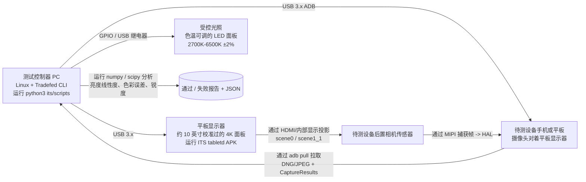

# 第 27 章：相机测试

## 摘要

你构建了一个相机应用。它在你的 Pixel 上工作正常。在你的 Galaxy 上也工作正常。那么，它在那个售价 99 美元、带有 `LEGACY` HAL 的 Android Go 设备上能跑通吗？该设备的供应商可能错误地实现了 `CONTROL_AF_TRIGGER_START`，并以*微秒*而非纳秒为单位返回每一个 `SENSOR_EXPOSURE_TIME`。

相机软件的测试是一个由两部分组成的问题：**HAL 层的 OEM 验证**（即 Google *强制*要求每个制造商在设备搭载 Google Play 出货前必须通过的测试）和**应用层的 CI 测试**（你在不要求物理相机硬件的情况下针对自己的代码运行的测试）。本章涵盖了这两个方面。首先，你将学习相机 ITS（图像测试套件，CTS 的一部分）在物理测试架上究竟验证了什么：流组合枚举、物理场景亮度线性度以及传感器/陀螺仪时间戳融合。然后，你将学习如何针对 `CameraManager`/`CameraDevice`/`CaptureSession` 使用 Mockito mock 编写你自己的插桩测试，以便你的整个相机堆栈能在无头 CI 服务器上运行，外加一个断言你的代码在 `LEGACY` 硬件上优雅降级而非崩溃的参数化测试模式。

请使用 **Android Camera Parameters** ([Google Play](https://play.google.com/store/apps/details?id=com.minininja.cameraparams), [GitHub](https://github.com/zoozooll/AndroidCameraParameters)) 作为参考工具，来检查你的测试应当断言的精确能力 —— 它表面化了 ITS 同样会在真实测试架上验证的每一个 `CameraCharacteristics` 键。

---

## 第一部分：OEM 如何验证相机 —— 相机 ITS 和 CTS

在设备搭载 Google 移动服务 (GMS) 出货之前，它必须通过 Android 兼容性测试套件 (CTS)。相机 CTS 分为两半：通过 `Tradefed` 运行的程序化 CTS 测试，以及需要带有自动化支架的物理测试实验室的相机 ITS（图像测试套件）。

### 测试类别

```mermaid
graph TB
    subgraph CTS[Android CTS — 相机部分]
        direction TB
        CTS_API[API 测试<br/>— CameraCharacteristics 键值<br/>— isSessionConfigurationSupported<br/>— 所有用例均能正确枚举]
        CTS_FLOW[流程测试<br/>— 打开 -> 关闭<br/>— 打开 -> 会话 -> 拍摄 -> 关闭<br/>— 快速打开/关闭压力测试]
        CTS_V[CTS 验证程序<br/>设备上手动测试<br/>— 预览流畅度<br/>— 拍摄质量<br/>— 多摄像头切换]
    end
    subgraph ITS[相机 ITS — 图像测试套件]
        direction TB
        ITS_COMBI[test_feature_combination<br/>流排列组合 x FPS x HDR<br/>数千次调用<br/>isSessionConfigurationSupported]
        ITS_SCENE[物理场景测试<br/>scene0 (均匀灰色)<br/>scene1_1 (色彩检查图)<br/>自动化平板显示 → 待测设备]
        ITS_FUSION[传感器融合测试<br/>陀螺仪时间戳必须与<br/>CaptureResult 中的 SENSOR_TIMESTAMP<br/>对齐，误差 ±1ms]
        ITS_3A[3A 收敛测试<br/>AE/AF/AWB 必须在标准光照下<br/>的 N 帧内收敛]
        ITS_HDR[HDR / Ultra HDR 测试<br/>JPEG_R 增益图有效性<br/>动态范围测量]
    end
    CTS --> SHIP[(全部通过方可出货)]
    ITS --> SHIP

    style ITS_COMBI fill:#d9e6f2
    style ITS_SCENE fill:#d9f2e6
    style ITS_FUSION fill:#f2d9e6
    style CTS_API fill:#fff3cd
    style CTS_V fill:#fff3cd
```

图表中的所有内容都是必选的。如果哪怕只有一个测试在单个相机 ID 上失败，设备就不能出货。这就是为什么理解 ITS 对你的应用有帮助：它保证了任何 HAL 都不能跌落的底线，并且准确记录了你可以依赖的行为。

### 相机 ITS 测试架架构

一个真实的相机 ITS 实验室看起来是这样的：



关键细节在于*闭环*。测试控制器准确知道它命令平板显示器显示什么像素值（例如强度为 50%、具有精确已知的 6500K 色温的均匀灰色），然后从数值上验证待测设备相机的输出 —— 包括 JPEG/DNG 中的像素亮度*以及* `CaptureResult` 中报告的 `SENSOR_EXPOSURE_TIME` × `SENSOR_SENSITIVITY` —— 是否在允许的公差范围内与物理输入匹配。

#### `test_feature_combination`：枚举大考

运行时间最长的单个 ITS 测试是 `test_feature_combination`。它会枚举来自 `SCALER_STREAM_CONFIGURATION_MAP` 的每一个合法流尺寸、每种格式 (`PRIV`, `YUV`, `JPEG`, `RAW_SENSOR`, `JPEG_R`, `DEPTH`)、来自 `CONTROL_AE_AVAILABLE_TARGET_FPS_RANGES` 的每个 FPS 范围、每种输出 Surface *数量*组合（1 输出、2 输出、3 输出的会话配置）以及每个 HDR 模式标志 —— 然后对生成的 SessionConfiguration 调用 `isSessionConfigurationSupported`，为每个受支持的配置捕获一帧，并断言该帧没有损坏。组合总数在每个相机 ID 上通常达到 30,000–100,000 个。

对于作为应用开发者的你来说，结论很简单：**如果在通过 CTS 的设备上 `isSessionConfigurationSupported` 返回 `true`，那么该流组合在双向上都确实有效。** 如果返回 `false`，则不要尝试。在回退到较小尺寸之前，请先依赖此调用。这正是 CameraX 在其分辨率选择器内部使用的同款查询。

#### 物理场景测试：曝光的线性度

Scene0 和 scene1_1 测试验证了相机的*报告*曝光数学运算与其*实测*像素输出是否匹配。测试架将已知亮度 `L` 的均匀灰场 (scene0) 投影到待测设备上。然后，它在整个可用范围内命令扫描 N 个不同的 `(SENSOR_EXPOSURE_TIME, SENSOR_SENSITIVITY)` 对，为每一对捕获一个 DNG 帧，并计算传感器活动阵列上的算术平均像素值 `Y`。

断言是严格线性的：

```
Y_i / (EXPOSURE_TIME_i × SENSITIVITY_i) = 常数 ± 公差
```

对*所有*捕获的配对均适用。如果乘积翻倍，像素亮度必须翻倍。如果减半，亮度必须减半。在中间色调中任何超过约 1% 的偏差都会导致测试失败。

这对你很重要的原因：它是你的手动曝光滑块（第 14 章）在符合 CTS 标准的设备上产生数学上可预测结果的保证。如果你的应用为 +1 EV 步长计算了"下一组 ISO/曝光对"，输出图像确实会亮一档。在不符合 CTS 标准的设备上（进口的水货手机、没有 CTS 的自定义 ROM），此保证不成立，你的手动曝光 UI 看起来会像是坏掉了。

#### `sensor_fusion`：传感器融合测试

EIS（电子防抖）和 AR 追踪的生死取决于此项测试。在待测设备录制视频的同时，测试控制器通过电动云台物理性地旋转手机，旋转速度已知。与此同时，它通过 `SensorManager` 以 400Hz+ 的频率轮询待测设备的陀螺仪传感器，并以 30/60fps 的频率轮询相机的 `CaptureResult.SENSOR_TIMESTAMP`。

通过条件：每个陀螺仪时间戳和每一帧的 `SENSOR_TIMESTAMP` 必须处于完全相同的 `CLOCK_MONOTONIC` 时基中，且在相机采样时间插值得到的陀螺仪样本必须在 ±0.1 rad/s 和 ±1ms 的公差内与云台的指令角速度匹配。

如果此项测试失败，说明 HAL 的时间戳源有误 —— 通常是它将 `CLOCK_REALTIME`（墙上时间，在 NTP 同步期间会跳变）与 `CLOCK_MONOTONIC`（稳定的、单调递增的时间）混淆了。Google 会拒绝该设备。对你而言，这意味着你可以在任何经过 GMS 认证的设备上，直接将 `CaptureResult.SENSOR_TIMESTAMP` 馈送到 ARCore 的相机图像更新调用中，而无需应用任何自定义时间戳偏移。

### CTS 验证程序：手动用户测试

并非所有内容都能自动化。CTS 验证程序是一个由人工 QA 测试员使用的设备端 APK，用于主观测试：

- **预览流畅度：** 摇晃设备 30 秒；测试员给出 1–5 分的感知流畅度评分。（客观遥测数据也会通过 Choreographer 的 dumpsys 获取。）
- **拍摄质量：** 在标准光照下拍摄 5 张标准场景的照片；测试员将其与黄金参考设备进行对比。
- **多摄像头变焦转换：** 在 0.5×–10× 的连续变焦过程中，物理相机切换之间不得有可见的跳变、故障或黑帧。
- **HDR/JPEG_R 质量：** 将 SDR 和 HDR 的并排拍摄效果与已知的良好参考图像进行比对。

这些虽然是主观的，但标准是公开的。如果你的应用有类似的 UX 目标（平滑的变焦过渡、HDR 拍摄），你可以在内部 QA 实验室中使用同样的 scene0/scene1_1 平板测试架复制这些测试流程。

---

## 第二部分：测试你自己的应用 —— 插桩与 Mocking

OEM 测试验证 HAL。你需要验证*你的*代码。开发团队常犯的一个典型错误是要求 CI 服务器上必须有一台带有可用相机的真实手机。其实没必要。通过 Mockito 的 `mock()` + `ArgumentCaptor`，Camera2 的每一个类 —— `CameraManager`、`CameraDevice`、`CameraCaptureSession`、`CaptureResult` —— 都是接口或可以干净 mock 的非 final 类。你可以在完全没有相机硬件的无头 Linux x86 模拟器上的 CI 环境中运行整个相机管线。

### 示例 1：捕获一个"帧"并验证 CaptureResult 包含预期的 EXPOSURE_TIME（使用 Mockito 的 AndroidTest）

```kotlin
// app/src/androidTest/java/com/example/camera/CameraCaptureTest.kt
@RunWith(AndroidJUnit4::class)
@SmallTest
class CameraCaptureTest {

    @Test
    fun captureRequest_containsManualExposureTime_andResultEchoesIt() = runTest {
        // ---- 准备 (Arrange) ----
        val mockCameraManager = mock<CameraManager>()
        val mockCameraDevice = mock<CameraDevice>()
        val mockSession = mock<CameraCaptureSession>()
        val mockSurface = mock<Surface>()
        val testHandler = Handler(Looper.getMainLooper())

        val expectedExposureNs = 16_666_666L // 1/60 s
        val expectedIso = 400

        // 捕获传递给 openCamera 的 StateCallback
        val deviceCallbackCaptor =
            argumentCaptor<CameraDevice.StateCallback>()
        whenever(mockCameraManager.openCamera(
            anyString(), deviceCallbackCaptor.capture(), any()
        )).thenAnswer { /* 无操作；我们手动触发回调 */ }

        // 捕获会话状态回调
        val sessionCallbackCaptor =
            argumentCaptor<CameraCaptureSession.StateCallback>()
        whenever(mockCameraDevice.createCaptureSession(
            anyList<Surface>(),
            sessionCallbackCaptor.capture(),
            any()
        )).thenAnswer { /* 无操作 */ }

        // 捕获传递给 capture() 的 CaptureCallback
        val captureCallbackCaptor =
            argumentCaptor<CameraCaptureSession.CaptureCallback>()
        whenever(mockSession.capture(
            any(), captureCallbackCaptor.capture(), any()
        )).thenReturn(1)

        // 使用你的包装类构建被测相机
        val cameraWrapper = YourCameraWrapper(mockCameraManager, testHandler)

        // ---- 动作 (Act): 触发 打开 → 配置 → 拍摄 链条 ----
        cameraWrapper.open("0")
        // (在 YourCameraWrapper.open() 内部调用了 
        //  mockCameraManager.openCamera，它捕获了回调。)
        // 模拟 HAL 返回成功：
        deviceCallbackCaptor.lastValue.onOpened(mockCameraDevice)

        cameraWrapper.createSession(listOf(mockSurface))
        sessionCallbackCaptor.lastValue.onConfigured(mockSession)

        val requestBuilder: CaptureRequest.Builder =
            mockCameraDevice.createCaptureRequest(CameraDevice.TEMPLATE_STILL_CAPTURE)
        // (你的包装类在此处应用手动设置)
        requestBuilder.set(CaptureRequest.CONTROL_MODE,
                           CaptureRequest.CONTROL_MODE_OFF)
        requestBuilder.set(CaptureRequest.SENSOR_EXPOSURE_TIME,
                           expectedExposureNs)
        requestBuilder.set(CaptureRequest.SENSOR_SENSITIVITY,
                           expectedIso)

        val resultDeferred = async { cameraWrapper.capture(requestBuilder.build()) }

        // ---- 断言 1 (Assert): 发送到 HAL 的 CaptureRequest 具有正确的键 ----
        val sentRequest: CaptureRequest = captureArg(mockSession, 0) {
            capture(any(), any(), any())
        }
        assertThat(sentRequest[CaptureRequest.SENSOR_EXPOSURE_TIME])
            .isEqualTo(expectedExposureNs)
        assertThat(sentRequest[CaptureRequest.SENSOR_SENSITIVITY])
            .isEqualTo(expectedIso)

        // ---- 动作 2: 模拟 HAL 返回一个 CaptureResult ----
        val mockResult = mock<TotalCaptureResult>().apply {
            whenever(get(CaptureResult.SENSOR_EXPOSURE_TIME))
                .thenReturn(expectedExposureNs)
            whenever(get(CaptureResult.SENSOR_SENSITIVITY))
                .thenReturn(expectedIso)
            whenever(frameNumber).thenReturn(1L)
        }
        captureCallbackCaptor.lastValue
            .onCaptureCompleted(mockSession, sentRequest, mockResult)

        // ---- 断言 2: 包装类返回的捕获结果呼应了曝光值 ----
        val actual = resultDeferred.await()
        assertThat(actual.exposureTimeNanos).isEqualTo(expectedExposureNs)
        assertThat(actual.iso).isEqualTo(expectedIso)
    }
}
```

模式始终如一：
1. `argumentCaptor` 抓取本应发往 HAL 的回调。
2. 调用你的包装类。
3. *假装 HAL 响应了*，手动触发回调的成功方法。
4. 对输入（你的包装类发送给 HAL 的内容）和输出（你的包装类交还给调用者的内容）同时进行断言。

这能跑在没有相机的模拟器上。不需要硬件。没有来自光照的干扰。运行 10,000 次就会产生同样的 10,000 次通过。

### 示例 2：参数化测试 —— LEGACY 设备必须优雅降级，绝不崩溃

每一个生产级相机应用都必须能运行在 `LEGACY` HAL 上。最常见的 bug 是在 `LEGACY` 设备上调用 `CaptureRequest.CONTROL_MODE_OFF`：HAL 会忽略它，但你的包装类会将产生的 `CaptureResult.CONTROL_AE_STATE == SEARCHING` 解释为瞬时故障并尝试在一个无限循环中重启 AE，最终导致 ANR。

请针对每个 `INFO_SUPPORTED_HARDWARE_LEVEL` 进行参数化测试：

```kotlin
@RunWith(Parameterized::class)
class HardwareLevelGracefulDegradationTest(
    private val hardwareLevel: Int,
    private val hardwareLevelName: String
) {
    companion object {
        @JvmStatic
        @Parameterized.Parameters(name = "{1}")
        fun data() = listOf(
            arrayOf(CameraCharacteristics.INFO_SUPPORTED_HARDWARE_LEVEL_LEGACY,
                    "LEGACY"),
            arrayOf(CameraCharacteristics.INFO_SUPPORTED_HARDWARE_LEVEL_LIMITED,
                    "LIMITED"),
            arrayOf(CameraCharacteristics.INFO_SUPPORTED_HARDWARE_LEVEL_FULL,
                    "FULL"),
            arrayOf(CameraCharacteristics.INFO_SUPPORTED_HARDWARE_LEVEL_3,
                    "LEVEL_3"),
        )
    }

    @Test
    fun requestManualExposure_onAnyHardwareLevel_doesNotCrash_orHang() = runTest {
        val mockCameraManager = mock<CameraManager>()
        val mockChars = mock<CameraCharacteristics>()
        whenever(mockChars.get<Int>(
            CameraCharacteristics.INFO_SUPPORTED_HARDWARE_LEVEL
        )).thenReturn(hardwareLevel)
        whenever(mockCameraManager.getCameraCharacteristics("0"))
            .thenReturn(mockChars)

        val wrapper = YourCameraWrapper(mockCameraManager, testHandler)
        wrapper.open("0")
        // ... (省略之前的会话设置样板代码)

        val job = launch {
            wrapper.setManualExposure(iso = 400, exposureNs = 8_000_000L)
        }

        // 不得挂起 — 即使在 LEGACY 上也必须在超时内完成
        withTimeoutOrNull(2_000) { job.join() }
            ?: fail("setManualExposure 在 $hardwareLevelName 硬件上挂起了")

        // 没有泄露到未捕获状态的异常
        assertThat(job.isCancelled).isFalse()
    }
}
```

针对每个新 build 运行此测试。它只需 400ms。它能捕捉到那一类 `LEGACY` HAL 挂起问题，否则此类问题几个月后才会出现在 Play 控制台的崩溃报告中。

### 真实硬件上的 AndroidTest：对 EXPOSURE_TIME 准确性的压力测试

对于针对少量真机机队的每晚运行，编写一个简短的 AndroidTest，打开*真实*相机，捕获一个 RAW 帧，并断言 `CaptureResult.SENSOR_EXPOSURE_TIME` 在请求值的 5% 范围内。这可以防止特定 OS build 上的 HAL 退化：

```kotlin
@RunWith(AndroidJUnit4::class)
@RequiresDevice
@LargeTest
class RealHardwareCaptureSanityTest {

    @Test
    fun realCapture_exposureTimeIsWithin5PercentOfRequested() = runTest {
        val context = InstrumentationRegistry.getInstrumentation().context
        val camManager = context.getSystemService(Context.CAMERA_SERVICE)
            as CameraManager
        val chars = camManager.getCameraCharacteristics("0")
        assumeTrue(
            "手动曝光需要 FULL 或 LEVEL_3",
            chars[CameraCharacteristics.INFO_SUPPORTED_HARDWARE_LEVEL] in
            setOf(
                CameraCharacteristics.INFO_SUPPORTED_HARDWARE_LEVEL_FULL,
                CameraCharacteristics.INFO_SUPPORTED_HARDWARE_LEVEL_3,
            )
        )

        // ... 打开相机，创建 ImageReader (PRIVATE 或 YUV) 会话，使用
        // 第 26 章协程包装器捕获一个具有已知曝光的手动帧 ...

        val requestedNs = 10_000_000L // 1/100s
        val result: TotalCaptureResult =
            cameraWrapper.captureManualExposure(requestedNs, iso = 200)

        val actualNs = result[CaptureResult.SENSOR_EXPOSURE_TIME]!!
        val tolerancePct = abs(actualNs - requestedNs) * 100.0 / requestedNs
        assertThat(tolerancePct)
            .withFailMessage(
                "请求了 %d ns, 实际得到 %d ns (%$.1f%% 偏差 >5%%)",
                requestedNs, actualNs, tolerancePct
            )
            .isLessThan(5.0)
    }
}
```

这类测试天生是不稳定的 —— 它依赖于真实硬件。但它能捕捉到厂商 OTA 更新中会悄悄破坏旗舰设备上手动曝光功能的那一类问题。在你的 5–10 台设备的小型机队上每晚运行一次；这样的信号价值值得忍受其噪声。

---

## 小结

相机测试分为 OEM 验证和应用验证。OEM 必须通过 CTS 和相机 ITS，这是一个需要物理设备的测试套件，强制要求支持流组合（通过数千次 `isSessionConfigurationSupported` 调用）、曝光 × 灵敏度平面上的亮度线性度，以及用于 EIS 和 AR 的传感器/陀螺仪时间戳对齐。应用通过插桩进行测试：Mockito 用于 mock 每一个 Camera2 类，`ArgumentCaptor` 抓取 HAL 回调，你手动触发它们，并在不接触真实硬件的情况下同时断言请求和结果 —— 从而实现在无头模拟器上的 CI 运行。针对每一个 `INFO_SUPPORTED_HARDWARE_LEVEL`（特别是 `LEGACY`）对你的包装类进行参数化测试以保证优雅降级，并运行一套少量的 `@RequiresDevice @LargeTest` 压力捕获测试针对真实机队，以捕捉 OTA 导致的退化。

## 下一章

你已经从 Kotlin 到原生 NDK 掌握了 Camera2 的公共 API，并用协程将其包装并经过了测试验证。但当你调用 `CameraManager.openCamera` 时，*底层* 到底发生了什么？什么是 HAL3？Binder IPC 边界到底在哪？Android 15 (API 35) 的 `CameraDeviceSetup` 如何通过解耦性能查询与传感器供电来改变架构？第 28 章是架构的大结局：从应用代码到镜筒内 VCM 音圈马达的完整堆栈解析。
