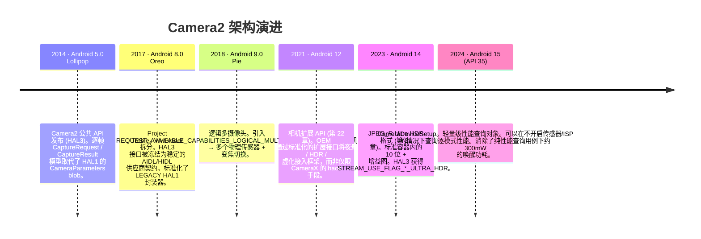
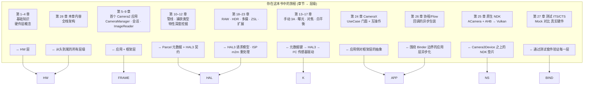

# 第 28 章：Camera2 架构

## 摘要

这是你应得的一章。在第 1-27 章中，你使用了 `CameraManager`、`CameraCharacteristics`、`CaptureRequest`、`CaptureResult`、`CameraCaptureSession`、`ImageReader`、CameraX、NDK 原生堆栈、协程包装器以及测试 Mock。你已经熟悉了每一个公共 API 表面。现在，我们将按顺序剥开每一个抽象层，从你写的 Kotlin 代码行开始，一直到穿越传感器与 SoC 之间 MIPI CSI-2 总线的每一个电子，再到微调镜组 10 微米的音圈马达，以及与传感器的滚动快门以微秒级步调同步脉冲的闪光灯 LED 控制器。

到本章结束时，你将能够观察任何一个 `CaptureRequest` 并逐层映射出它的去向：谁翻译了它，谁验证了它，谁最终在硅片上执行了它。你还将理解 Android 15 (API 35) 的 `CameraDeviceSetup` 抽象，它是长达十年的架构趋势的一个缩影：逐步将*性能查询*与*硬件供电状态*解耦，以便应用可以在不消耗传感器和 ISP 开启所需的约 300mW 电量的情况下探测相机。

若要检查任何真实设备的精确性能并将其与此处描述的架构层进行交叉参考，请安装 **Android Camera Parameters** ([Google Play](https://play.google.com/store/apps/details?id=com.minininja.cameraparams), [GitHub](https://github.com/zoozooll/AndroidCameraParameters))。它读取了下层暴露给公共 API 的每一个 `CameraCharacteristics` 键。

---

## 全堆栈分层图

这是整本书中最重要的一张图。从这里向下的每一层都是真实的代码，在 Android 开源项目 (AOSP) 中有真实的路径、真实的归属以及真实的 Binder 或函数调用边界。我们将从上到下梳理每一层，然后展示过去十年中该堆栈的演进，最后将你的学习旅程映射到这些层级上。

```mermaid
graph TB
    subgraph APP["应用层 (你的代码)"]
        direction TB
        A1["Kotlin / Java / C++ NDK<br/>cameraManager.openCamera(id, cb, handler)<br/>session.capture(request, cb, handler)<br/>captureResult.get(SENSOR_EXPOSURE_TIME)"]
    end
    subgraph FRAME["Java/Kotlin 框架层 — android.hardware.camera2.*"]
        direction TB
        F1["CameraManager · CameraCharacteristics<br/>CaptureRequest.Builder · CaptureResult<br/>CameraDevice · CameraCaptureSession"]
        F2["CameraBinderWrapper (AOSP frameworks/base)<br/>将 Java 对象转换为 AIDL Binder parcel"]
    end
    subgraph BIND["IPC 层 — Binder / HwBinder"]
        direction TB
        B1["AIDL ICameraService (AOSP)<br/>框架 ↔ CameraService"]
        B2["HIDL / AIDL HAL Binder (Treble)<br/>CameraService ↔ 供应商 HAL"]
    end
    subgraph NS["原生 Mediaserver 层 (system/bin/cameraserver)"]
        direction TB
        N1["CameraService (frameworks/av/services/camera/)"]
        N2["Camera3Device<br/>frameworks/av/services/camera/libcameraservice/device3/<br/>— 验证请求 vs 会话输出<br/>— 构建 camera3_capture_request_t<br/>— 解析 camera3_capture_result_t"]
        N3["CameraProviderManager (frameworks/av)<br/>枚举供应商 HAL 实现"]
    end
    subgraph HAL["供应商 HAL 层 (OEM / SoC 代码)"]
        direction TB
        H1["HAL3 接口: camera3_device_t<br/>— process_capture_request()<br/>— process_capture_result()<br/>— flush()"]
        H2["HAL1 封装器 (Legacy)<br/>camera2compat::Camera2Compat<br/>针对硬件级别低于 LIMITED 的设备<br/>将 HAL3 请求翻译为 HAL1 CameraParameters"]
        H3["供应商实现<br/>高通 QCamera2 · 联发科 CamHAL · 三星 Exynos Camera HAL"]
    end
    subgraph K["内核层 (Linux)"]
        direction TB
        K1["/dev/videoX — V4L2 视频捕获驱动<br/>VIDIOC_S_FMT · VIDIOC_REQBUFS · VIDIOC_QBUF / DQBUF"]
        K2["ISP 驱动 (高通 CAMSS / 联发科 ISP 驱动)<br/>内存到内存处理 V4L2 m2m 节点"]
        K3["传感器子设备驱动<br/>通过 I2C 写入模式 / 曝光 / 增益 / VCM"]
        K4["MIPI CSI-2 接收驱动 (SoC)<br/>通道配置、LP/HS 转换、ECC/CRC 校验"]
    end
    subgraph HW["物理硬件层"]
        direction TB
        HW1["镜头组件<br/>VCM 音圈马达 (I2C)<br/>移动镜组以实现对焦 / OIS"]
        HW2["相机传感器像素阵列<br/>CMOS 传感器 (索尼 IMX / 三星 ISOCELL / 豪威)<br/>曝光 → 读取 → A/D 转换"]
        HW3["MIPI CSI-2 物理总线<br/>2/4/8 对差分对，每通道 1.5 – 2.5 Gbps"]
        HW4["ISP 图像信号处理器 (在 SoC 上)<br/>硬件实现去马赛克 · 降噪 · 锐化 · HDR 合并 · 人脸检测"]
        HW5["闪光灯 LED 控制器 (I2C)<br/>氙气闪光灯或 LED 电流沉<br/>同步至传感器 EXRST 引脚"]
    end

    APP -->|函数调用| FRAME
    FRAME -->|AIDL parcel| BIND
    BIND -->|HwBinder| NS
    NS -->|HAL3 AIDL/HIDL| HAL
    HAL -->|ioctl() 系统调用| K
    K -->|I2C 写入 + MIPI 通道信号 + ISP 命令队列| HW

    style APP fill:#e6d9f2
    style FRAME fill:#d9e6f2
    style BIND fill:#fff3cd,stroke:#ffc107,stroke-width:2px
    style NS fill:#d9f2e6
    style HAL fill:#f2d9e6
    style K fill:#e6d9e6
    style HW fill:#f2e6d9,stroke:#d4a373,stroke-width:2px
```

现在按从上到下的顺序看。

---

## 第 1 层 — 应用层 (你的代码)

这是你写的代码。`cameraManager.openCamera(id, stateCallback, cameraHandler)`。你对此烂熟于心。但有两个事实你可能尚未内化：
- 你发出的每一个 `CaptureRequest.Builder.set(key, value)` 调用，都会向一个 parcelable 结构附加一个*带标签的元数据条目*，该结构准确镜像了 `system/media/camera/include/system/camera_metadata.h` 中的 `camera_metadata_t` C 结构体。你的 Kotlin `CaptureRequest` 与 HAL 的请求之间不存在魔法转换 —— 它们具有相同的二进制元数据格式，只是用了不同的语言绑定包装。
- 你发出的每一个 `CaptureResult.get(key)` 调用，读出的都是 HAL 写入响应缓冲区的原始字节。如果某个 HAL 在特定的 OTA 版本中错误报告了曝光时间，你的应用读到的就是那个错误的数值。框架层在 HAL 之上没有任何纠错机制。这就是为什么第 27 章的真实硬件压力测试必不可少的原因。

---

## 第 2 层 — Java/Kotlin 框架层 (`android.hardware.camera2.*`)

框架层 (AOSP `frameworks/base/core/java/android/hardware/camera2/`) 只做两件事：
1. 暴露你所调用的公共 API 表面 (`CameraManager`、`CameraDevice` 等)。
2. 在 `CaptureRequest` / `CaptureResult` 的 Java 对象与其在 Binder 通信中的 parcelable 表示之间进行翻译。

它不在 HAL 之上强制执行任何策略，不重写元数据，也不"修补"请求。它是一个轻量级的翻译层，外加对设备启动时从每个相机 ID 获取的不可变 `CameraCharacteristics` blob 的缓存。

Binder 边界位于 `CameraManager` → `ICameraService` AIDL 中，即下一层。

---

## 第 3 层 — IPC 层: Binder / HwBinder (Treble)

这是 Project Treble (Android 8.0, 2017) 锁定的关键架构契约。涉及两个 Binder 域：

| Binder 域 | 连接 | 协议 | 谁负责强制执行 ABI 稳定性 |
|-------------------|-------------------------------------------------------|-----------------|---------------------------------|
| `/dev/binder` | 框架 ↔ cameraserver (system_server 侧) | AIDL | 平台 (同一分区构建) |
| `/dev/hwbinder` | cameraserver ↔ 供应商相机 HAL | HIDL / AIDL HAL | Treble (稳定的供应商接口)|

在 Treble 之前，HAL 是一个直接被 `dlopen` 到 `cameraserver` 进程中的 `.so` 文件。OEM 的每一次 OTA 都必须同时重新构建相机*和*框架。Treble 的 HwBinder 拆分意味着供应商 HAL 是其自己的进程、自己的分区、拥有自己的 3 年安全更新时间线，且它与 `cameraserver` 之间的契约在设备寿命周期内是版本化且冻结的。对于应用开发者来说，这是 Camera2 API 行为在不同 OTA 之间可预测的首要原因：如果 HAL 接口发生改变，就无法通过 Treble 合规性测试。

LEGACY HAL1 封装器活在此边界之下，位于供应商 HAL 进程内部，因此除通过 `INFO_SUPPORTED_HARDWARE_LEVEL_LEGACY` 外，它对应用层是不可见的。

---

## 第 4 层 — 原生 Mediaserver 层: `CameraService` / `Camera3Device`

`/system/bin/cameraserver` 是一个在启动时由 `init.rc` 开启的原生守护进程。它始终运行，拥有设备上每一个已打开的相机，并且是决定哪个应用获得相机访问权的唯一仲裁者（前台应用获胜；其余应用会被断开连接）。

其最重要的两个类：

1. **`CameraService`** (`frameworks/av/services/camera/libcameraservice/CameraService.cpp`):
   - 向框架暴露 `ICameraService` AIDL 接口。
   - 为每一次 binder 调用强制执行 `android.permission.CAMERA` 权限检查（没有权限的应用发出的调用会在进入 HAL 前被 `cameraserver` 拒绝）。
   - 处理并发打开的仲裁（两个应用请求同一个相机 → 处于最前台的 Activity 获得权限；后台应用收到 `onDisconnected`）。
   - 管理用于枚举供应商 HAL 模块的 `CameraProviderManager`。

2. **`Camera3Device`** (`frameworks/av/services/camera/libcameraservice/device3/Camera3Device.cpp`):
   - 管线的核心。
   - 验证捕获请求中的每一个输出 Surface 是否确实属于会话配置的输出集。（这就是框架抛出 `IllegalArgumentException: Surface not in configured outputs` 的地方。）
   - 将你发来的 Parceled `CaptureRequest` 打包进 HAL3 的 `camera3_capture_request_t` 结构体。
   - 通过 `process_capture_request(request)` 将请求逐一流式输入 HAL。
   - 从 HAL 接收 `camera3_capture_result_t`，将元数据 + fence 封装并*回传* Binder 链条，直到你的 `CaptureCallback.onCaptureCompleted`。
   - 为你处理 `flush()`、错误路径、`notify()` 快门与错误回调，以及用于 EGL/Vulkan 互操作的输出缓冲区释放 fence。

`Camera3Device` 约有 15,000 行 C++ 代码，是整个堆栈中经过最严格测试的部分（第 27 章的 CTS 测试正是从框架侧直接针对 `Camera3Device` 行为进行的）。如果你读到过 bug 报告说"这个请求键在 Camera2 NDK 下有效但在 Java 版下无效"，这种差异几乎总是源于 `Camera3Device` 内部缺失的验证或转换路径。

---

## 第 5 层 — 供应商 HAL 层: HAL3 (`camera3_device_t`)

这是 OEM 差异化的真正所在。每个 SoC 供应商都提供其自己的 HAL3 实现：

| 供应商 | HAL 代号 | AOSP 接口 |
|--------------|-------------------------------------------|----------------------------------------------|
| 高通 | QCamera2 / QCamera3 (mm-camera 代码库) | `camera3_device_t` + `vendor.qti.hardware.camera*` 扩展 |
| 联发科 | CamHAL (mtkcam) | 同样的 `camera3_device_t` + 联发科扩展 |
| 三星 | Exynos Camera HAL | 同样的 `camera3_device_t` + 三星扩展 |
| Google Tensor| Google Camera HAL (Pixel 系列) | 同样的 `camera3_device_t` + 用于夜视 / 计算 RAW 的 Google 自定义逻辑 |

HAL3 契约（定义在 `hardware/libhardware/include/hardware/camera3.h`）对一个已打开的设备只有四项核心操作：

```cpp
// 简化的 HAL3 契约 — 这就是全部接口
typedef struct camera3_device {
    hw_device_t common;

    int (*configure_streams)(
        const struct camera3_device *,
        camera3_stream_configuration_t *stream_list
    );

    int (*process_capture_request)(
        const struct camera3_device *,
        camera3_capture_request_t *request
    );

    void (*get_metadata_vendor_tag_ops)(...);

    int (*flush)(const struct camera3_device *);

    void (*dump)(...);
} camera3_device_t;
```

HAL 接收请求，产出结果和输出缓冲区。仅此而已。请求/响应模型是 HAL3 的标志 —— HAL1 曾是一个单一的 `CameraParameters` 字符串 blob (`"preview-size=1920x1080;picture-size=..."`)，整个行业都因其缺乏逐帧控制能力而对其深恶痛绝。正是 HAL3 的请求/响应模型*实现*了你在本书中使用过的每一项高级功能：逐帧手动曝光、RAW 捕获、多摄像头物理流、重处理、ZSL 输入 Surface。这些在 HAL1 下都是不可能实现的。

### LEGACY HAL1 封装器

`INFO_SUPPORTED_HARDWARE_LEVEL_LEGACY` 意味着供应商*依然*只提供了一个 HAL1 `.so` 文件，设备使用 AOSP 的 `camera2compat::Camera2Compat` 垫片将 HAL3 的请求/响应调用翻译回旧的 `CameraParameters` blob + `startPreview()`/`takePicture()` HAL1 入口点。这种翻译层正是第 24 章警告你 `CONTROL_MODE_OFF` 在 `LEGACY` 设备上静默无效的原因 —— HAL1 没有可以与之对应翻译的逐帧 `CONTROL_MODE` 概念。该垫片会直接丢弃该元数据条目。

---

## 第 6 层 — 内核层: V4L2 + MIPI CSI-2 + 传感器驱动

HAL3 进程仅通过设备节点上的 `ioctl()` 系统调用与 Linux 内核交互。处理单帧需要四类内核驱动程序协作：

1. **MIPI CSI-2 接收驱动** (`/dev/v4l-subdevX`): 配置 PHY 通道数和数据速率，处理差分对上的低功耗到高速切换，验证数据包 ECC/CRC，并通过 DMA 将接收到的像素行存入 ISP 的输入环形缓冲区。你永远不会从用户空间接触到此驱动。CSI-2 CRC 错误对你而言表现为损坏的输出缓冲区，并带有匹配的 `camera3_stream_buffer_t.status == BUFFER_ERROR`。

2. **传感器子设备驱动** (`/dev/v4l-subdevY`, 通过 I2C 控制):
   - 通过 I2C (一种缓慢的、约 100KHz 的带外总线) 写入传感器寄存器，这就是为什么即使是 `HARDWARE_LEVEL_3` 设备，曝光更改和模式切换也有约 2-3 帧延迟的原因。
   - 设置曝光时间 (逐帧滚动快门开始/停止)、模拟增益、数字增益、分辨率、合并 (binning) 模式。
   - 通过将电流导入音圈的 I2C DAC 来控制 VCM 对焦 (见 HW 层)。
   - 通过传感器侧的 EXRST 输出引脚控制闪光灯同步，闪光灯控制器会监听该引脚。

3. **V4L2 视频捕获节点** (`/dev/video0` 等): HAL 调用 `VIDIOC_REQBUFS` 来分配由 gralloc 支持的缓冲区 (正是你在第 25 章导入 Vulkan 的同一类 `AHardwareBuffer` 句柄)，然后在循环中调用 `VIDIOC_QBUF` (将缓冲区入队)。随着帧从 CSI-2 接收器 + ISP 到达，HAL 调用 `VIDIOC_DQBUF` (将缓冲区出队) 并将其作为 `camera3_stream_buffer_t` 发送给 `Camera3Device`。

4. **ISP 内存到内存驱动** (`/dev/videoN m2m` 节点): 独立于捕获路径，HAL 将重处理输入缓冲区 (用于 ZSL, 第 23 章) 排入 ISP m2m 队列，以便对先前捕获的 RAW 帧运行去马赛克、去噪、HDR 合并或人脸检测。结果会作为处理后的 JPEG/YUV/PRIVATE 输出缓冲区输出。

---

## 第 7 层 — 物理硬件层

最后，是电子。以上每一层都是在 SoC 上执行的代码。硬件层才是光子转化为电子并被处理的地方：

```mermaid
graph LR
    LENS["镜组<br/>玻璃元件<br/>~10–20mm 焦距"] --> VCM["VCM 音圈马达<br/>I2C DAC → 线圈电流 →<br/>镜组位移 ±50 µm<br/>对焦 + OIS 防抖"]
    VCM --> SENSOR[CMOS 传感器像素阵列<br/>索尼 IMX / 三星 ISOCELL<br/>~12MP – 200MP<br/>滚动快门: 逐行读取<br/>全局快门 (罕见) 用于工业传感器]
    SENSOR -->|A/D 转换后的 10/12/14 位拜耳数据| CSI[MIPI CSI-2 PHY<br/>2/4/8 对<br/>总带宽高达 20 Gbps]
    CSI -->|SoC 内部互连| ISP[ISP — 位于 SoC 芯片上<br/>去马赛克 · CCM · 降噪 · 3A 统计 · HDR 合并<br/>通常具备 1 TOPS+ 的人脸/分割 DNN 能力]
    ISP -->|Gralloc 缓冲区 → DRAM| CPU[CPU / GPU<br/>你的应用进程读取它们]
    FLASH["闪光灯 LED / 氙气灯<br/>I2C 闪光灯控制器<br/>闪光同步至传感器 EXRST"] --> SENSOR
```

每个物理子系统：
- **镜头与 VCM**: 镜组 10µm 的移动即为 AF 的一步。OIS (光学防抖) 为 VCM 增加了闭环陀螺仪反馈，每秒微调镜组 500–5000 次以抵消手抖。内核驱动写入 I²C DAC 值；你的应用通过 `LENS_FOCUS_DISTANCE` 和 `LENS_OPTICAL_STABILIZATION_MODE` 元数据键对其进行控制。
- **传感器像素阵列**: 光电二极管积累与入射光子数成正比的电荷。读取方式是滚动快门 (逐行自上而下)，这就是为什么你在第 14 章的 AE 滑块有 2–3 帧延迟的原因 —— 第 N 帧的曝光是在第 N-1 帧读取期间编程的。
- **MIPI CSI-2 总线**: 差分对高达 2.5Gbps/通道 × 8 通道 = 20Gbps 原始带宽。足以应对 60fps 4K 12 位拜耳数据。数据包错误会触发硬件级的 CRC 重传，但损坏的帧会以 `BUFFER_ERROR` 的形式传达给你。
- **ISP**: 幕后英雄。其去马赛克 + 降噪 + 锐化硬件运行速度超过 10 亿像素/秒，免去了 CPU 处理之苦。在现代 Tensor / 骁龙 SoC 上，它还在 CPU 看到帧之前，在传感器内部运行用于场景分割、人脸检测和 HDR 合并的 DNN 加速器。
- **闪光灯控制器**: 闪光脉冲必须*精确地*在它要照亮的那一帧的滚动快门曝光窗口内发射。`CaptureResult` 中的 `FLASH_STATE_FIRED` 位确认了对齐情况；对齐不良会导致帧曝光不全。

---

## 架构演进：随 Android 版本迭代的 Camera2

Camera2 并非一日建成。每隔 2–3 个 Android 版本就会增加一个新的架构原语，为开发者解锁真实的功能：



每个版本的趋势都很明显：**解耦 (decoupling)**。
- Android 8 将 HAL 与框架解耦 (Treble)。
- Android 9 将逻辑相机 ID 与物理传感器解耦。
- Android 12 将 OEM 扩展与应用代码解耦。
- Android 14 将 HDR 编码与 RAW 管线解耦。
- **Android 15 的 `CameraDeviceSetup` 将性能查询与硬件供电解耦。**

### 焦点：Android 15 `CameraDeviceSetup` — 架构解耦的实践

`CameraDeviceSetup` (Android 15, API 35) 是这一趋势最纯粹的例子。在 API 35 之前，如果应用想知道"是否支持同时开启 4K@60 流和 YUV_420_888 分析？"，调用 `isSessionConfigurationSupported` 的唯一方法是通过由 `CameraManager.getCameraCharacteristics(id)` 获取的 `CameraCharacteristics` 实例。在内部，这强制 HAL 为传感器供电 (≈250–350mW) 并开启 ISP 数毫秒，仅仅是为了读取一张在设备寿命期内实际上是静态的性能表。对于电池受限的应用，这在任何"起飞前功能检查" UX 中都是不可接受的。

`CameraDeviceSetup` 通过提供一个轻量级的、不消耗电量的表示来解决了这个问题：

```kotlin
// 需要 API 35+
val setup: CameraDeviceSetup = cameraManager.getCameraDeviceSetup(cameraId)
val supported: Boolean = setup.isSessionConfigurationSupported(sessionConfig)
// getCameraDeviceSetup() 不会开启传感器或 ISP
// 结果可以在设备的整个运行期间进行缓存
```

从架构上讲，性能表现在存在于供应商分区中一个预先获取的、经过签名且与分区无关的 blob 中，而 `getCameraDeviceSetup` 通过一个独立的 HwBinder 调用来读取它，完全跳过了 `Camera3Device` 的上电序列。这是未来十年的方向：*每一个*可以静态回答的 API 最终都会有一个无功耗的轻量级副本。预计 `CameraDeviceSetup` 将在 Android 16+ 中获得越来越多的性能查询功能。

---

## 读者旅程与架构层级的映射

最后，将你在这本书中的旅程映射到架构层级上。每一章都对应一个特定的层级或接口边界：



通过最后阅读这一章，你已经将架构与实践相结合。你不是在第一天抽象地学习 HAL3 并挣扎着将其映射到真实代码中，而是通过 27 章的*实践*学习：打开 → 配置 → 捕获 → 结果，然后拉开幕帘，看看到底是谁在响应其中的每一次调用。

---

## 小结

Camera2 是一个七层堆栈：应用层 → 框架层 (Java/Kotlin `android.hardware.camera2.*`) → Binder/HwBinder IPC 层 → 原生 `CameraService` + `Camera3Device` 层 → 供应商 HAL3 层 (`camera3_device_t`, 带有一个 LEGACY HAL1 封装器) → V4L2 内核驱动层 (MIPI CSI-2, 传感器, 捕获, ISP m2m) → 物理硬件层 (镜头/VCM, 传感器, MIPI 总线, ISP, 闪光灯控制器)。Project Treble 通过 HwBinder 锁定了 HAL 契约，确保了长期稳定性。十年来的架构趋势是渐进式的解耦，最终体现在 Android 15 的 `CameraDeviceSetup` 上，它可以不给传感器供电就查询性能。你现在已经将每一项功能 —— 从第 14 章的手动 ISO 到第 23 章的 ZSL，再到第 25 章的原生 Vulkan 零拷贝 —— 映射到了执行它的精确层级上。

## 下一步：第七部分 — 相机元数据百科全书

《第六部分：现代 Android 相机开发》到此结束。最后的疆域是针对你在所有 28 章中一直使用的每一个 `CameraCharacteristics`、`CaptureRequest` 和 `CaptureResult` 元数据键的详细百科全书式参考。第七部分即是元数据百科全书：SENSOR, LENS, CONTROL, SCALER, REQUEST —— 每一个标签都有定义、解释、查询方法，且经过真实设备的交叉验证，并经由 **Android Camera Parameters** 应用验证。当你需要准确了解 `SCALER_CROPPING_TYPE` 的含义、哪些设备支持 `REQUEST_AVAILABLE_CAPABILITIES_OFFLINE_PROCESSING` 或者某个特定键在真实的 `LEGACY` HAL 上到底表现如何时，请翻阅它。
