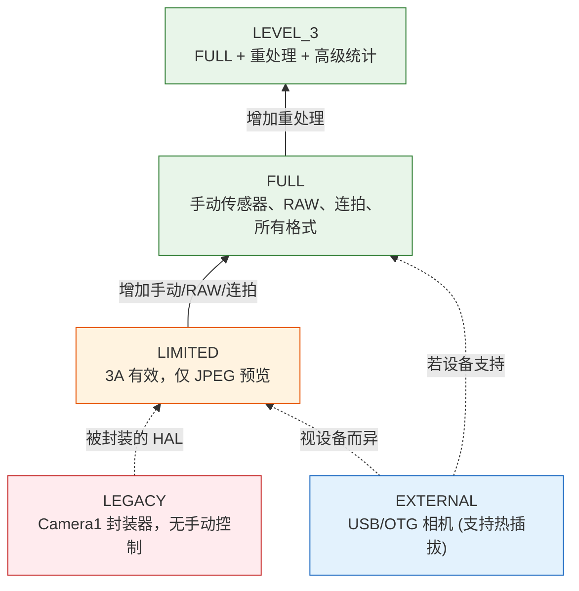
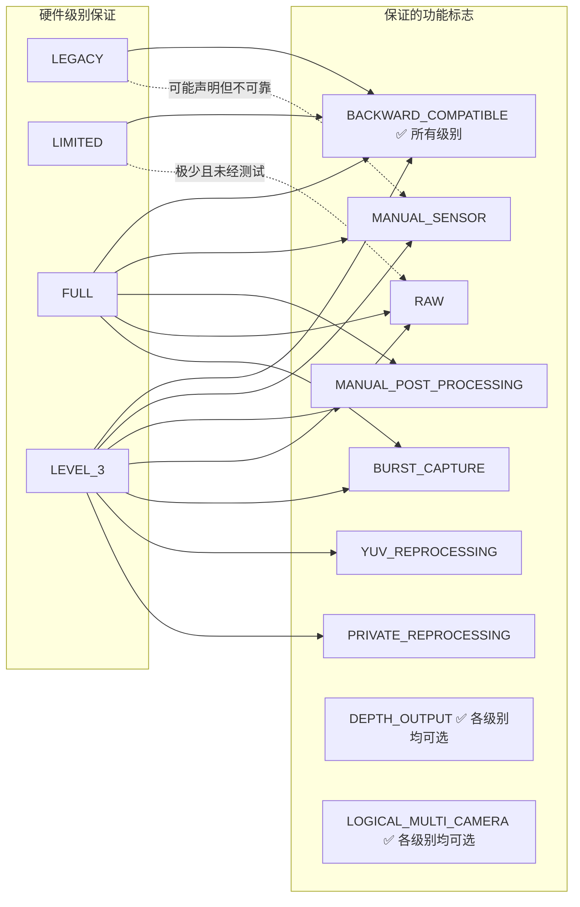
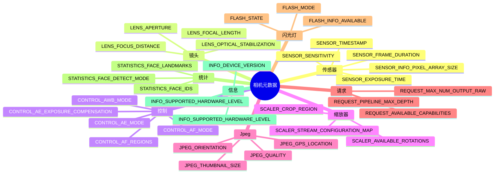

## 12.1 你口袋里的规格表

在你可以调用 `openCamera()`、构建 `CaptureRequest` 或配置会话之前——首先要面对的是 `CameraCharacteristics`。它是无需通电即可了解相机*一切*能力的窗口。可以把它看作是相机的规格表，以结构化可查询对象的形式呈现。

`CameraCharacteristics` 是编写能跨越 Android 10,000 多种设备型号运行的应用的最重要工具。你不能假设手动 ISO 可用。你不能假设支持 RAW。你甚至不能假设相机支持 1080p 预览——除非你询问 `CameraCharacteristics`。

在[第 6 章](discovering-cameras.md)中，我们涉及了基础知识：镜头朝向、传感器尺寸、焦距。在这次深度挖掘中，我们将走得更远：
- 五个**硬件级别** (LEGACY → LIMITED → FULL → LEVEL_3 → EXTERNAL) 及其各自保证的功能
- 十多个**功能标志** (`MANUAL_SENSOR`、`RAW`、`DEPTH_OUTPUT` 等) 以及哪些硬件级别提供它们
- 元数据键如何按子系统（`android.sensor.*`、`android.lens.*`、`android.control.*`……）进行**分层组织**
- 如何编写带有优雅回退的**综合运行时功能查询**

**Android Camera Parameters** 应用（[GitHub](https://github.com/zoozooll/AndroidCameraParameters)，[Play 商店](https://play.google.com/store/apps/details?id=com.minininja.cameraparams)）本质上是一个加强版的 `CameraCharacteristics` 浏览器。打开它查看任何一个相机，你都能看到我们在本章中讨论的键，按类别组织，并配有易于理解的标签和实时数值渲染。

## 12.2 CameraCharacteristics 究竟是什么

正式来说，`CameraCharacteristics` 是：

- **不可变的** — 一旦从 `CameraManager.getCameraCharacteristics(id)` 获取，该对象就永远不会改变（有一个记录在案的例外：API 32+ 上的可折叠设备 `SENSOR_ORIENTATION`）。
- **零功耗** — 查询它**不会**开启传感器或 ISP。你可以在第一个 Activity 的 `onCreate()` 中调用它，而不会影响电池寿命。
- **针对每个相机的** — 每个逻辑相机 ID 都有其自己的 `CameraCharacteristics` 对象。
- **类型安全且基于键的** — 通过 ``<Key<T>> get(Key<T> key)`` 访问数据，其中每个键都有记录在案的类型（Int、Long、Float、Rect、数组等）。

你只需一次调用即可获取它：

```kotlin
val cameraManager = getSystemService(CAMERA_SERVICE) as CameraManager
val cameraIdList = cameraManager.cameraIdList  // 例如 ["0", "1", "2", "3"]

for (id in cameraIdList) {
    val characteristics: CameraCharacteristics = cameraManager.getCameraCharacteristics(id)
    // 尽管查询吧 — 不消耗传感器电量！
}
```

在 Android 15 (API 35) 上，你可以使用 `CameraManager.getCameraDeviceSetup(id)` 进行轻量级的会话配置查询，而无需打开相机（详见[第 28 章](camera2-architecture.md)关于 `CameraDeviceSetup` 的内容）。

## 12.3 硬件级别：INFO_SUPPORTED_HARDWARE_LEVEL

最重要的 `CameraCharacteristics` 键是 **`INFO_SUPPORTED_HARDWARE_LEVEL`**。它定义了相机 HAL 的整个层级，并告诉你（宽泛地）哪些功能可以保证正常工作。共有五个硬件级别：

### 五个硬件级别

| 级别 | 常量 | 典型设备 | 实践中的含义 |
|-------|----------|----------------|---------------------------|
| **LEGACY** | `INFO_SUPPORTED_HARDWARE_LEVEL_LEGACY` | 2015 年前的廉价设备，非常旧的芯片组 | Camera2 API 是对旧版 `android.hardware.Camera` API 的封装。没有逐帧控制，没有手动设置，无法拍摄 RAW，连拍不可靠。将这些设备视为"具有 Camera2 语法的 Camera1 时代产物"。 |
| **LIMITED** | `INFO_SUPPORTED_HARDWARE_LEVEL_LIMITED` | 廉价手机（Android Go，入门级 SoC 如联发科 Helio、骁龙 4xx） | 原生 Camera2 HAL，但仅支持子集功能。3A (AF/AE/AWB) 有效。预览 + JPEG 有效。但**没有**手动传感器控制，**没有** RAW，**没有**保证的连拍，**没有** YUV 重处理。这是 Android 的"基本可用"相机级别。 |
| **FULL** | `INFO_SUPPORTED_HARDWARE_LEVEL_FULL` | 中端及旗舰手机（骁龙 6xx/7xx/8xx，三星 Exynos 中高端，天玑 7xxx+） | "专业相机"级别。保证支持 MANUAL_SENSOR、MANUAL_POST_PROCESSING、BURST_CAPTURE、逐帧设置、30fps 全分辨率、RAW、所有输出格式、可预测的管线深度。这是任何严谨相机应用所追求的级别。 |
| **LEVEL_3** | `INFO_SUPPORTED_HARDWARE_LEVEL_3` | 配备高级 ISP 的高端旗舰机（骁龙 8 Gen 1+，Pixel 6+，Exynos 2xxx+） | FULL 级别外加：YUV 重处理（输入流支持、离线重处理）、私有重处理、高级统计信息、同时以最大分辨率输出硬件 JPEG + RAW。支持 RAW 输出的 ZSL 所必需的。 |
| **EXTERNAL** | `INFO_SUPPORTED_HARDWARE_LEVEL_EXTERNAL` | USB 摄像头，通过 OTG 连接的网络摄像头 | 外部相机 HAL。根据 USB 设备的性能，表现类似于 LIMITED 或 FULL。关键提示：相机可能随时被热插拔/断开连接，因此要监听 `ACTION_CAMERA_DEVICE_STATE_CHANGED`。 |



:::important
硬件级别是一项**保证**，而不仅仅是一个"尽力而为"的标志。如果一台设备报告为 FULL，则意味着 Google 的 CTS (兼容性测试套件) 已经验证了每一项 FULL 级别功能都能正常工作。如果设备报告为 LIMITED，你不能依赖任何 FULL 级别功能——即使它在某一台特定的 LIMITED 设备上恰好能用，在另一台设备上也可能会报错。
:::

### 在运行时检查硬件级别

```kotlin
val hardwareLevel = characteristics.get(CameraCharacteristics.INFO_SUPPORTED_HARDWARE_LEVEL)

when (hardwareLevel) {
    CameraCharacteristics.INFO_SUPPORTED_HARDWARE_LEVEL_LEGACY -> {
        Log.w("CamCaps", "LEGACY 硬件 — 已禁用手动/RAW。回退到基础 JPEG。")
        disableManualControls()
        disableRawCapture()
    }
    CameraCharacteristics.INFO_SUPPORTED_HARDWARE_LEVEL_LIMITED -> {
        Log.i("CamCaps", "LIMITED 硬件 — 仅支持基础照片 + 预览。")
        disableManualControls()
        disableRawCapture()
        disableBurstCapture()
    }
    CameraCharacteristics.INFO_SUPPORTED_HARDWARE_LEVEL_FULL -> {
        Log.i("CamCaps", "FULL 硬件 — 启用手动控制、RAW 和连拍。")
        enableManualControls()
        enableRawCapture()
        enableBurstCapture()
    }
    CameraCharacteristics.INFO_SUPPORTED_HARDWARE_LEVEL_3 -> {
        Log.i("CamCaps", "LEVEL_3 硬件 — FULL + 重处理 + ZSL + 高级统计。")
        enableManualControls()
        enableRawCapture()
        enableBurstCapture()
        enableReprocessing()
        enableZeroShutterLag()
    }
    CameraCharacteristics.INFO_SUPPORTED_HARDWARE_LEVEL_EXTERNAL -> {
        Log.i("CamCaps", "EXTERNAL 相机 — 可能是 LIMITED 或 FULL；正在注册断开连接监听器。")
        registerHotplugListener()
        // 动态探测功能而非直接假设
    }
    else -> {
        Log.w("CamCaps", "未知硬件级别 $hardwareLevel — 为了安全假设为 LIMITED。")
        safeDefaultFeatures()
    }
}
```

## 12.4 功能标志：REQUEST_AVAILABLE_CAPABILITIES

硬件级别是一个*粗略*的分类。为了进行细粒度的功能检测，Camera2 暴露了 `REQUEST_AVAILABLE_CAPABILITIES` —— 一个包含功能标志的 `IntArray`。每个标志描述了相机可以执行的一个特定操作。

硬件级别保证与功能标志之间的正式关系：



### 功能标志详解

| 标志常量 | 含义 | 硬件级别保证 | 实践意义 |
|--------------|---------|--------------------------|----------------------|
| `BACKWARD_COMPATIBLE` | 相机实现了基础 Camera2 API | **所有 5 个级别** (LEGACY–EXTERNAL) | 如果缺失此项，该相机设备对你的应用来说实际上是不可用的。 |
| `MANUAL_SENSOR` | 应用可以手动控制 `SENSOR_EXPOSURE_TIME`、`SENSOR_SENSITIVITY`、`SENSOR_FRAME_DURATION`、`LENS_FOCUS_DISTANCE`、`LENS_APERTURE` | **FULL** 和 **LEVEL_3** 保证 | 专业模式和手动相机 UI 需要此项。没有它，所有的手动 ISO/曝光滑块必须隐藏。 |
| `MANUAL_POST_PROCESSING` | 应用可以手动控制 ISP 阶段：降噪、边缘增强、色调曲线、色彩校正增益、色彩校正变换 | **FULL** 和 **LEVEL_3** 保证 | 自定义"电影感" LUT、通过增益实现的手动白平衡、锐度/模糊控制所需。 |
| `RAW` | 传感器通过 `ImageFormat.RAW_SENSOR`、`RAW10` 或 `RAW12` 输出 RAW 拜耳数据 | **FULL** 和 **LEVEL_3** 保证 | DNG 拍摄、RAW 转 JPEG 编辑管线、计算摄影都从此开始。 |
| `PRIVATE_REPROCESSING` | 相机支持 `InputSurface` + 将 HAL 私有格式图像离线重处理为 JPEG/YUV | **LEVEL_3** 保证。FULL 较罕见。 | 实现零快门延迟 (ZSL)：环形缓冲过去的帧，将近期的一帧重处理为高质量静态图。 |
| `YUV_REPROCESSING` | 相机支持 `InputSurface` + 将应用提供的 YUV_420_888 图像重新传回 ISP 进行处理 | **LEVEL_3** 保证 | 实现"在后期为录制的视频应用电影级 LUT"或"在后期重新对焦人像深度"管线。 |
| `DEPTH_OUTPUT` | 相机可以输出深度图 (`DEPTH16` / `DEPTH_POINT_CLOUD` 格式) | **任何**级别均可选。显式检查数组。 | 人像模式虚化、AR 测量、3D 扫描。通常与 `LOGICAL_MULTI_CAMERA` 配对（用于立体深度的双物理摄像头）。 |
| `LOGICAL_MULTI_CAMERA` | 此逻辑相机由 2 个以上物理传感器支持（例如超广角 + 广角 + 长焦） | **任何**级别均可选。通常仅见于旗舰机。 | 实现无缝光学变焦（详见[第 20 章](multi-camera.md)）。你可以查询 `LOGICAL_MULTI_CAMERA_PHYSICAL_IDS` 来获取物理相机 ID。 |
| `BURST_CAPTURE` | 以每秒 ≥20 帧的全分辨率运行 `captureBurst()`，且不掉帧 | **FULL** 和 **LEVEL_3** 保证 | 没有此项，连拍捕获可能会卡顿、掉帧或静默失败。曝光/对焦包围需要此项。 |
| `CONSTRAINED_HIGH_SPEED_VIDEO` | 支持 `createHighSpeedRequestList()` + 高速视频 (120fps, 240fps) | **FULL/LEVEL_3 可选**。LIMITED 较罕见。 | 慢动作录制（详见[第 19 章](high-speed-video.md)）。 |
| `MOTION_TRACKING` | 相机可以高帧率、低延迟地追踪物体 / 人脸 | 可选 (罕见)。见于 Pixel 和部分旗舰机。 | AR 运动追踪、运动自动对焦。 |
| `LOGICAL_MULTI_CAMERA_SYNC` | 逻辑设备中的多个物理相机可以捕获同步帧 | 可选。真正的同步多传感器捕获所需。 | 使用多个镜头的计算摄影（例如融合变焦）。 |

### 在运行时查询所有功能

```kotlin
val capabilities = characteristics.get(
    CameraCharacteristics.REQUEST_AVAILABLE_CAPABILITIES
) ?: intArrayOf()

fun hasCapability(cap: Int): Boolean = capabilities.contains(cap)

val supportsManualSensor = hasCapability(
    CameraCharacteristics.REQUEST_AVAILABLE_CAPABILITIES_MANUAL_SENSOR
)
val supportsRaw = hasCapability(
    CameraCharacteristics.REQUEST_AVAILABLE_CAPABILITIES_RAW
)
val supportsBurst = hasCapability(
    CameraCharacteristics.REQUEST_AVAILABLE_CAPABILITIES_BURST_CAPTURE
)
val supportsDepth = hasCapability(
    CameraCharacteristics.REQUEST_AVAILABLE_CAPABILITIES_DEPTH_OUTPUT
)
val supportsLogicalMultiCam = hasCapability(
    CameraCharacteristics.REQUEST_AVAILABLE_CAPABILITIES_LOGICAL_MULTI_CAMERA
)
val supportsHighSpeed = hasCapability(
    CameraCharacteristics.REQUEST_AVAILABLE_CAPABILITIES_CONSTRAINED_HIGH_SPEED_VIDEO
)
val supportsYuvReprocessing = hasCapability(
    CameraCharacteristics.REQUEST_AVAILABLE_CAPABILITIES_YUV_REPROCESSING
)
val supportsPrivateReprocessing = hasCapability(
    CameraCharacteristics.REQUEST_AVAILABLE_CAPABILITIES_PRIVATE_REPROCESSING
)

// 构建人类可读的报告
val capabilityReport = buildString {
    appendLine("=== 相机功能报告 ===")
    appendLine("BACKWARD_COMPATIBLE:     ${hasCapability(
        CameraCharacteristics.REQUEST_AVAILABLE_CAPABILITIES_BACKWARD_COMPATIBLE
    )}")
    appendLine("MANUAL_SENSOR:           $supportsManualSensor")
    appendLine("MANUAL_POST_PROCESSING:  ${hasCapability(
        CameraCharacteristics.REQUEST_AVAILABLE_CAPABILITIES_MANUAL_POST_PROCESSING
    )}")
    appendLine("RAW:                     $supportsRaw")
    appendLine("BURST_CAPTURE:           $supportsBurst")
    appendLine("YUV_REPROCESSING:        $supportsYuvReprocessing")
    appendLine("PRIVATE_REPROCESSING:    $supportsPrivateReprocessing")
    appendLine("DEPTH_OUTPUT:            $supportsDepth")
    appendLine("LOGICAL_MULTI_CAMERA:    $supportsLogicalMultiCam")
    appendLine("CONSTRAINED_HIGH_SPEED:  $supportsHighSpeed")
}

Log.i("CamCaps", capabilityReport)

// 现在进行 UI 功能门控
manualIsoSlider.isEnabled = supportsManualSensor
manualExposureSlider.isEnabled = supportsManualSensor
rawCaptureToggle.isEnabled = supportsRaw
burstCaptureButton.isEnabled = supportsBurst
depthPortraitMode.isEnabled = supportsDepth
zoomSwitcher.isEnabled = supportsLogicalMultiCam
slowMoButton.isEnabled = supportsHighSpeed
zslMode.isEnabled = supportsPrivateReprocessing  // LEVEL_3
```

:::tip
**Android Camera Parameters** 应用在相机摘要视图的 **Capabilities** 卡片中将此查询渲染为颜色编码的复选框。绿色 = 支持，灰色 = 不支持。你可以并排比较多个相机，查看超广角镜头的功能与主相机有何不同。
:::

## 12.5 元数据组织：android.* 命名空间

`CameraCharacteristics`、`CaptureRequest` 和 `CaptureResult` 中的每个键都遵循分层命名约定：`android.<subsystem>.<parameter>`。由点分隔的组件按其控制的硬件/软件子系统对相关设置进行分组。

### 子系统类

| 子系统前缀 | Kotlin 元数据类 | 涵盖内容 |
|-----------------|----------------------|---------------|
| `android.sensor.*` | `CameraCharacteristics.SensorInfo*`, `CaptureRequest.SENSOR_*`, `CaptureResult.SENSOR_*` | 传感器读取：曝光时间、ISO 灵敏度、帧时长、时间戳、像素阵列、活动阵列、滚动快门方向、测试图案模式 |
| `android.lens.*` | `LensInfo*`, `Lens.*` | 光学：对焦距离、光圈、焦距、光学防抖 (OIS)、滤镜密度 (ND)、对焦范围、可用光圈 |
| `android.control.*` | `Control*` | 3A 算法：自动曝光 (AE) 模式 / 状态 / 目标 / 区域、自动对焦 (AF) 模式 / 状态 / 触发 / 区域、自动白平衡 (AWB) 模式 / 状态 / 区域、抗条纹、场景模式、特效模式、视频防抖 (EIS) |
| `android.scaler.*` | `Scaler.*` | 输出管线配置：裁剪区域 (数字变焦)、旋转、流配置映射 (输出格式、尺寸、时长)、可用最小帧时长 |
| `android.jpeg.*` | `Jpeg*` | JPEG 编码：质量、朝向、GPS 坐标、缩略图尺寸、缩略图质量 |
| `android.request.*` | `Request*` | 全局管线性能：可用功能标志数组、管线最大深度、最大输出 raw/proc 数量、元数据对象键、可用模板列表 |
| `android.flash.*` | `FlashInfo*`, `Flash*` | 闪光灯单元：可用性、充电状态、色温、最大亮度、模式 (off / single / torch) |
| `android.statistics.*` | `Statistics*` | ISP 统计输出：人脸检测、人脸 ID、人脸关键点、人脸评分、直方图、清晰度图、镜头遮蔽图、热像素图 |
| `android.info.*` | `Info*` | 静态相机信息：支持的硬件级别、设备版本、可用人脸检测模式、可用降噪模式 |
| `android.black.*` | `BlackLevel*` | 黑电平锁定、黑电平模式 (固定模式噪声校正) |
| `android.colorCorrection.*` | `ColorCorrection*` | 色彩管线：变换矩阵、色彩校正增益 (R, G, B 通道)、色差校正模式 |
| `android.tonemap.*` | `Tonemap*` | 色调映射：色调映射曲线 (自定义伽马)、色调映射模式、对比度、饱和度 |
| `android.edge.*` | `Edge*` | 边缘增强 / 锐化：模式、强度 |
| `android.noiseReduction.*` | `NoiseReduction*` | 降噪：模式、强度、时域降噪强度 |
| `android.shading.*` | `Shading*` | 镜头遮蔽 / 暗角校正：模式、强度 |
| `android.hotPixel.*` | `HotPixel*` | 热像素校正：模式、热像素图 |
| `android.distortionCorrection.*` | `DistortionCorrection*` | 镜头几何畸变校正：模式 |
| `android.depth.*` | `Depth*` | 深度输出：深度是否排他、最大深度样本、深度格式 |
| `android.logicalMultiCamera.*` | `LogicalMultiCamera*` | 逻辑多摄像头：物理相机 ID、物理传感器同步 |



### 关于键可用性的说明

并非每个键都存在于每台设备上。如果你在设备不支持的键上调用 `get(KEY)`，你将得到 `null` —— 因此你在本书中随处可见 `?: 0` 或 `?.let` 模式。

安全的做法是：**在读取键之前检查其是否存在**，或者使用 Kotlin 的空安全提供默认值。

```kotlin
// 使用回退默认值的安全访问
val exposureTimeNs: Long = characteristics.get(
    CameraCharacteristics.SENSOR_INFO_EXPOSURE_TIME_RANGE
)?.upper ?: 1_000_000L  // 如果键缺失，默认最大 1ms

// 如果键存在则进行可选处理
characteristics.get(CameraCharacteristics.LENS_INFO_AVAILABLE_APERTURES)?.let { apertures ->
    Log.d("CamCaps", "设备支持 ${apertures.size} 种光圈: ${apertures.contentToString()}")
    buildApertureSelector(apertures)
} ?: run {
    Log.d("CamCaps", "此设备无级变光圈")
    hideApertureControl()
}
```

## 12.6 完整的运行时功能查询 (生产级)

综合以上内容，这里有一个可以放入任何 Camera2 应用的生产级功能查询实现。它结合了硬件级别、功能标志和单个键的检查：

```kotlin
data class CameraCapabilityProfile(
    val cameraId: String,
    val lensFacing: Int,
    val hardwareLevel: Int,
    val hardwareLevelName: String,
    val supportsManualSensor: Boolean,
    val supportsManualPostProcessing: Boolean,
    val supportsRaw: Boolean,
    val supportsBurst: Boolean,
    val supportsDepth: Boolean,
    val supportsLogicalMultiCam: Boolean,
    val supportsHighSpeedVideo: Boolean,
    val supportsYuvReprocessing: Boolean,
    val supportsPrivateReprocessing: Boolean,
    val maxBurstRaw: Int,
    val maxBurstProcessed: Int,
    val pipelineMaxDepth: Int,
    val availableFocalLengths: FloatArray?,
    val availableApertures: FloatArray?,
    val minFocusDistanceDiopters: Float?,
    val maxDigitalZoom: Float?
)

fun buildCapabilityProfile(
    cameraManager: CameraManager,
    cameraId: String
): CameraCapabilityProfile {
    val c = cameraManager.getCameraCharacteristics(cameraId)

    val hwLevel = c.get(CameraCharacteristics.INFO_SUPPORTED_HARDWARE_LEVEL)
        ?: CameraCharacteristics.INFO_SUPPORTED_HARDWARE_LEVEL_LEGACY

    val hwLevelName = when (hwLevel) {
        CameraCharacteristics.INFO_SUPPORTED_HARDWARE_LEVEL_LEGACY -> "LEGACY"
        CameraCharacteristics.INFO_SUPPORTED_HARDWARE_LEVEL_LIMITED -> "LIMITED"
        CameraCharacteristics.INFO_SUPPORTED_HARDWARE_LEVEL_FULL -> "FULL"
        CameraCharacteristics.INFO_SUPPORTED_HARDWARE_LEVEL_3 -> "LEVEL_3"
        CameraCharacteristics.INFO_SUPPORTED_HARDWARE_LEVEL_EXTERNAL -> "EXTERNAL"
        else -> "UNKNOWN($hwLevel)"
    }

    val caps = c.get(CameraCharacteristics.REQUEST_AVAILABLE_CAPABILITIES) ?: intArrayOf()
    fun has(cap: Int) = caps.contains(cap)

    // 硬件级别提供功能保证，但为了安全起见也要检查标志
    val atLeastFull = hwLevel == CameraCharacteristics.INFO_SUPPORTED_HARDWARE_LEVEL_FULL ||
                      hwLevel == CameraCharacteristics.INFO_SUPPORTED_HARDWARE_LEVEL_3

    return CameraCapabilityProfile(
        cameraId = cameraId,
        lensFacing = c.get(CameraCharacteristics.LENS_FACING)
            ?: CameraCharacteristics.LENS_FACING_BACK,
        hardwareLevel = hwLevel,
        hardwareLevelName = hwLevelName,

        // 使用标志检查 + 硬件级别保证回退以确保安全
        supportsManualSensor = has(
            CameraCharacteristics.REQUEST_AVAILABLE_CAPABILITIES_MANUAL_SENSOR
        ) || atLeastFull,
        supportsManualPostProcessing = has(
            CameraCharacteristics.REQUEST_AVAILABLE_CAPABILITIES_MANUAL_POST_PROCESSING
        ) || atLeastFull,
        supportsRaw = has(
            CameraCharacteristics.REQUEST_AVAILABLE_CAPABILITIES_RAW
        ) || atLeastFull,
        supportsBurst = has(
            CameraCharacteristics.REQUEST_AVAILABLE_CAPABILITIES_BURST_CAPTURE
        ) || atLeastFull,
        supportsDepth = has(
            CameraCharacteristics.REQUEST_AVAILABLE_CAPABILITIES_DEPTH_OUTPUT
        ),
        supportsLogicalMultiCam = has(
            CameraCharacteristics.REQUEST_AVAILABLE_CAPABILITIES_LOGICAL_MULTI_CAMERA
        ),
        supportsHighSpeedVideo = has(
            CameraCharacteristics.REQUEST_AVAILABLE_CAPABILITIES_CONSTRAINED_HIGH_SPEED_VIDEO
        ),
        supportsYuvReprocessing = has(
            CameraCharacteristics.REQUEST_AVAILABLE_CAPABILITIES_YUV_REPROCESSING
        ),
        supportsPrivateReprocessing = has(
            CameraCharacteristics.REQUEST_AVAILABLE_CAPABILITIES_PRIVATE_REPROCESSING
        ),

        maxBurstRaw = c.get(CameraCharacteristics.REQUEST_MAX_NUM_OUTPUT_RAW) ?: 1,
        maxBurstProcessed = c.get(CameraCharacteristics.REQUEST_MAX_NUM_OUTPUT_PROC) ?: 1,
        pipelineMaxDepth = c.get(CameraCharacteristics.REQUEST_PIPELINE_MAX_DEPTH) ?: 1,

        availableFocalLengths = c.get(CameraCharacteristics.LENS_INFO_AVAILABLE_FOCAL_LENGTHS),
        availableApertures = c.get(CameraCharacteristics.LENS_INFO_AVAILABLE_APERTURES),
        minFocusDistanceDiopters = c.get(CameraCharacteristics.LENS_INFO_MINIMUM_FOCUS_DISTANCE),
        maxDigitalZoom = c.get(CameraCharacteristics.SCALER_AVAILABLE_MAX_DIGITAL_ZOOM)
    )
}

// 用法：
val profile = buildCapabilityProfile(cameraManager, "0")
Log.d("CamCaps", "相机 0 简况: ${profile.hardwareLevelName}, " +
    "手动=${profile.supportsManualSensor}, RAW=${profile.supportsRaw}, " +
    "连拍=${profile.supportsBurst}, 深度=${profile.supportsDepth}, " +
    "变焦=${profile.maxDigitalZoom}x")
```

## 12.7 在 Android Camera Parameters 应用中可视化

**Android Camera Parameters** 应用（[GitHub](https://github.com/zoozooll/AndroidCameraParameters)，[Play 商店](https://play.google.com/store/apps/details?id=com.minininja.cameraparams)）是本章的理想伴侣。它将原始的 `CameraCharacteristics` 键/值对转换为可浏览的 UI：

- **摘要卡片** — 硬件级别（带有颜色编码徽章：红色=LEGACY, 橙色=LIMITED, 绿色=FULL, 青色=LEVEL_3, 蓝色=EXTERNAL）、镜头朝向、传感器分辨率、焦距
- **功能卡片** — 每个 `REQUEST_AVAILABLE_CAPABILITIES` 标志的复选框列表，支持则为绿色
- **类别选项卡** — 严格按 `android.*` 子系统组织：Sensor (传感器)、Lens (镜头)、Control (控制)、Scaler (缩放器)、Jpeg、Flash (闪光灯)、Statistics (统计)、Info (信息)、Request (请求)
- **原生 JSON 选项卡** — 用于复制/粘贴到 bug 报告中的完整序列化 `CameraCharacteristics` 对象
- **比较模式** — 在相机 (0, 1, 2, 3) 之间滑动，查看不同镜头的硬件级别和功能有何差异

## 12.8 小结

| 概念 | 关键要点 |
|---------|-------------|
| **硬件级别** | 5 个层级：LEGACY (封装器) → LIMITED (基准) → FULL (专业 + 手动/RAW) → LEVEL_3 (FULL + 重处理) → EXTERNAL (USB)。FULL 是进行任何严肃相机工作的最低要求。通过 CTS 验证的保证。 |
| **功能标志** | 通过 `REQUEST_AVAILABLE_CAPABILITIES` 进行细粒度功能检测。关键标志：`MANUAL_SENSOR`、`MANUAL_POST_PROCESSING`、`RAW`、`BURST_CAPTURE`、`DEPTH_OUTPUT`、`LOGICAL_MULTI_CAMERA`、`PRIVATE_REPROCESSING`、`YUV_REPROCESSING`、`CONSTRAINED_HIGH_SPEED_VIDEO`。 |
| **级别与功能映射** | FULL 保证支持 MANUAL_SENSOR、MANUAL_POST_PROCESSING、RAW、BURST。LEVEL_3 增加了 YUV/PRIVATE_REPROCESSING。DEPTH 和 LOGICAL_MULTI_CAMERA 在所有级别上都是可选的。 |
| **元数据命名空间** | 键组织为 `android.<子系统>.<参数>`。主要子系统：sensor、lens、control、scaler、jpeg、request、flash、statistics、info。每个子系统都有静态信息 (CameraCharacteristics)、请求输入 (CaptureRequest) 和结果输出 (CaptureResult)。 |
| **安全查询** | 始终为 `get()` 提供空安全默认值——许多键是可选的。使用硬件级别作为粗略门控，功能标志作为细化门控，单个键的存在作为针对特定设备的调优。 |

## 下一章

既然你已经了解了相机的能力（特性）以及如何控制它（管线 + 捕获类型），你就已经为第四部分打下了完整的基础。

在**第 13 章：手动相机 ISO 与曝光**中，你将学习使用 `MANUAL_SENSOR` 功能来手动控制 `SENSOR_EXPOSURE_TIME` 和 `SENSOR_SENSITIVITY` —— 实现一个带有实时预览、曝光补偿和曝光三角权衡的专业模式曝光滑块。
