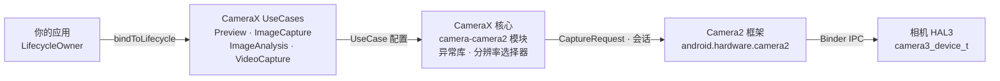

---
sidebar_position: 24
title: "第 24 章：CameraX"
description: "精通 CameraX，它是封装了 Camera2 的 Jetpack 生命周期感知相机库。学习 UseCase 架构、用于注入手动参数的 Camera2Interop，以及选择 CameraX 或 Camera2 的决策框架。"
keywords: [camerax, jetpack camera, camerax 架构, UseCase 模型, camera2interop, processcameraprovider, preview usecase, imagecapture, imageanalysis, videocapture, camerax 对比 camera2]
---

# 第 24 章：CameraX

## 摘要

当你读到本章时，你已经掌握了原生的 Camera2 API：手动打开 `CameraDevice` 实例、构造 `CaptureRequest.Builder` 对象、管理 `CameraCaptureSession` 生命周期、应对三种不同的回调类型，并小心翼翼地在每种边缘情况下释放所有资源。你已经历练有成。现在我们要退后一步问：如果 80% 的样板代码可以消失呢？

CameraX 是 Google 推出的 Jetpack 库，它以生命周期感知、声明式、用例驱动的 API 封装了 Camera2。它并不是要取代 Camera2 —— 它底层就是 Camera2。它取代的是数百行会话配置代码、设备特定的异常处理以及手动的生命周期簿记。在本章中，你将学习 CameraX 的架构，理解 `UseCase`（用例）模型，了解如何通过 `Camera2Interop` 将原生的 Camera2 参数*注入*到 CameraX 中，并带走一份准确决定何时选择 CameraX 以及何时必须下沉到 Camera2 的决策表。

若想在决定针对哪一层进行开发前检查你自己设备上的每一项相机性能，请安装来自 [Google Play](https://play.google.com/store/apps/details?id=com.minininja.cameraparams) 的 **Android Camera Parameters**，或访问 [github.com/zoozooll/AndroidCameraParameters](https://github.com/zoozooll/AndroidCameraParameters) 查看源码。

---

## CameraX 架构

CameraX 以五个 Jetpack 组件的形式发布：`camera-core`、`camera-camera2`、`camera-lifecycle`、`camera-view` 和 `camera-extensions`。其架构核心是 `UseCase` 模型 —— 你思考的不再是 Surface 和会话，而是*你希望相机做什么*。

### UseCase 模型

共有四个规范的用例，你可以同时将它们的任意子集绑定到生命周期：

| UseCase (用例) | 用途 |
|------------------|----------------------------------------------------------------|
| `Preview` | 将帧流式传输到 `PreviewView` 或 `Surface`。类似于设置针对 `SurfaceTexture` 的重复请求。 |
| `ImageAnalysis` | 在后台线程将 `ImageProxy` 帧流式传输到你的分析器。取代了手动创建 `YUV_420_888` 格式的 `ImageReader` 并将其监听器连接到重复请求的操作。 |
| `ImageCapture` | 单次或连拍照片拍摄。为你处理捕获请求、`ImageReader` 管道、旋转和 EXIF。 |
| `VideoCapture` | 自 1.1 版本起合并入 CameraX；封装了具有正确的暂停/恢复语义和音频路由的 `MediaRecorder` 或 `ParcelFileDescriptor` 管线。 |

同时绑定所有四个用例是完全合法的 —— CameraX 会在内部针对 `SCALER_STREAM_CONFIGURATION_MAP` 解析流组合，并代表你调用 `isSessionConfigurationSupported`，如果你的精确组合不被支持，它会自动回退到较低分辨率。这是最大的优势之一：你再也不用花三个小时去发现测试矩阵中的某台 2019 年三星中端机不支持同时开启 `4:3 PRIV + 16:9 JPEG_MAX`。CameraX 能让它直接跑通。

### ProcessCameraProvider 与生命周期感知

绑定点是 `ProcessCameraProvider`，这是由你的应用进程拥有的单例。核心代码如下：

```kotlin
val cameraProviderFuture = ProcessCameraProvider.getInstance(context)
cameraProviderFuture.addListener({
    val cameraProvider = cameraProviderFuture.get()
    val camera: Camera = cameraProvider.bindToLifecycle(
        lifecycleOwner,
        cameraSelector,
        preview,
        imageCapture,
        imageAnalysis
    )
}, ContextCompat.getMainExecutor(context))
```

仅此而已。没有 `openCamera` 的回调地狱，没有 `StateCallback`，没有会话配置回调，也没有拆除工作。当 `lifecycleOwner`（你的 `Fragment` 或 `Activity`）达到 `ON_STOP` 时，CameraX 会关闭 `CameraDevice`。在 `ON_DESTROY` 时，它会拆除会话并释放每个 Surface。你在第 7 章中苦苦追查的资源泄漏根本不会发生 —— 生命周期契约强制执行了这一切。

### CameraX 在内部封装了 Camera2

在内部，CameraX 就是 Camera2。`camera-camera2` 组件包含了 `Camera2Camera`、`Camera2CameraCaptureResult` 和 `Camera2RequestProcessor`，它们都会将你的高级 UseCase 声明转换为你在前 23 章中手写的精确的 `CameraManager.openCamera`、`createCaptureSession` 和 `setRepeatingRequest` 调用。特定供应商的变通方案被编码在库内部的按设备分类的 XML 文件中 —— 这就是著名的"CameraX 异常行为数据库 (quirk database)"。

完整的架构如下所示：



按从左到右的箭头观察：你的应用声明*想要什么*（用例），CameraX 解析*如何获取*（Surface 尺寸、会话配置、异常处理），然后发出与你手写完全相同的 Camera2 调用。附加值在于中间的两个框 —— 数十万行由 Google 编写的你无需重复编写的设备兼容代码。

---

## Camera2Interop：向 CameraX 注入 Camera2 参数

CameraX 在 80% 的场景下都非常出色。但你，亲爱的读者，是一位 Camera2 大师。你知道 `CONTROL_AE_MODE_OFF` 意味着什么。你了解 `SENSOR_SENSITIVITY` 与 `CONTROL_AE_EXPOSURE_COMPENSATION` 之间的区别。当产品规范要求"即使用户在使用 CameraX 时也要能将 ISO 锁定在 400 且曝光锁定在 1/60s"时，你不需要用原生 Camera2 重写整个功能。你只需要求助于 `Camera2Interop`。

### Extender (扩展器) 模式

每个 `UseCase.Builder` 都有一个匹配的 `Camera2Interop.Extender`。在 `build()` *之前* 调用它，可以在会话级别或逐请求级别注入原生的 Camera2 键：

| 方法 | Camera2 等效操作 |
|------------------------------------------------|----------------------------------------------|
| `extender.setCaptureRequestOption(key, value)` | `CaptureRequest.Builder.set(key, value)` |
| `extender.setSessionOption(key, value)` | 会话初始化参数 (较少用到) |

扩展器是累加式的：对于你没有覆盖的每一个键，CameraX 仍会设置其自己的默认值。如果你仅设置了 `SENSOR_SENSITIVITY`，CameraX 仍会处理 AF、AWB、旋转和元数据。

### 现实示例：在 CameraX 中手动设置 ISO 和曝光

这里是一个完整的 `ImageCapture` 构建器，它将相机锁定为手动 AE，ISO 固定为 400，快门时间为 1/60 秒，然后拍摄一张照片：

```kotlin
val iso = 400
val exposureTimeNanos = 1_000_000_000L / 60 // 1/60 秒

val imageCapture = ImageCapture.Builder()
    .setTargetResolution(Size(4032, 3024))
    .setCaptureMode(ImageCapture.CAPTURE_MODE_MAXIMIZE_QUALITY)
    .apply {
        val interop = Camera2Interop.Extender(this)
        interop.setCaptureRequestOption(
            CaptureRequest.CONTROL_AE_MODE,
            CaptureRequest.CONTROL_AE_MODE_OFF
        )
        interop.setCaptureRequestOption(
            CaptureRequest.CONTROL_AE_LOCK,
            false
        )
        interop.setCaptureRequestOption(
            CaptureRequest.SENSOR_SENSITIVITY,
            iso
        )
        interop.setCaptureRequestOption(
            CaptureRequest.SENSOR_EXPOSURE_TIME,
            exposureTimeNanos
        )
        interop.setCaptureRequestOption(
            CaptureRequest.CONTROL_MODE,
            CaptureRequest.CONTROL_MODE_OFF
        )
    }
    .build()

cameraProvider.bindToLifecycle(
    viewLifecycleOwner,
    CameraSelector.DEFAULT_BACK_CAMERA,
    preview,
    imageCapture
)

// 稍后，触发拍摄：
imageCapture.takePicture(
    ContextCompat.getMainExecutor(context),
    object : ImageCapture.OnImageCapturedCallback() {
        override fun onCaptureSuccess(imageProxy: ImageProxy) {
            // imageProxy 包含了经过手动曝光的帧
            imageProxy.close()
        }

        override fun onError(exception: ImageCaptureException) {
            Log.e(TAG, "拍摄失败: ${exception.imageCaptureError}", exception)
        }
    }
)
```

**关键警告：** 设置 `CONTROL_MODE_OFF` 会禁用*所有* 3A。如果你只想锁定曝光但仍希望运行 AF 和 AWB，请仅设置 `CONTROL_AE_MODE_OFF`（或 `CONTROL_AE_LOCK = true`），并保持 `CONTROL_MODE` 为默认值 (`CONTROL_MODE_AUTO`)。CameraX 会默认设置你未触及的每一个键。

是的 —— 你也可以对 `Preview.Builder` 和 `ImageAnalysis.Builder` 进行同样的操作，以实现重复的手动流。扩展器适用于在该 UseCase 生命周期内发出的每一个重复请求或单次请求。

### 读回 Camera2 结果

另一个方向 —— 从 CameraX 回调中提取 `TotalCaptureResult` —— 通过 `Camera2CameraCaptureResult` 同样可以直接实现：

```kotlin
imageCapture.takePicture(
    executor,
    object : ImageCapture.OnImageCapturedCallback() {
        override fun onCaptureSuccess(imageProxy: ImageProxy) {
            val camera2Result = imageProxy.imageInfo
                .cameraCaptureResult as? Camera2CameraCaptureResult
            val totalResult: TotalCaptureResult? = camera2Result?.captureResult
            val actualIso = totalResult?.get(CaptureResult.SENSOR_SENSITIVITY)
            Log.d(TAG, "传感器上的实际 ISO: $actualIso")
            imageProxy.close()
        }
    }
)
```

这可以让你验证你的注入参数是否真的传达到了传感器。请使用 **Android Camera Parameters** 交叉检查你的设备声明的 `SENSOR_INFO_SENSITIVITY_RANGE` —— 如果你注入的 ISO 超出了该范围，CameraX 会静默将其夹断（或者由 HAL 执行），而读回结果是了解这一点的唯一方法。

---

## 选择 CameraX 还是 Camera2

最难的架构问题不是"如何使用 CameraX？"，而是"我到底该不该用 CameraX？" 这里有一份从真实生产工作中提炼出来的决策框架。

### 决策流程图

```mermaid
flowchart TD
    A["开始"] --> B{是否需要 RAW 捕获、<br/>ZSL 重处理、<br/>多摄像头物理流、<br/>大于 60fps 的高速模式？}
    B -->|是| D[使用原生 Camera2]
    B -->|否| C{是否需要每个物理相机的<br/>逐帧 CaptureRequest 模板、<br/>自定义会话拓扑<br/>(输入重处理 Surface)、<br/>或离线会话？}
    C -->|是| D
    C -->|否| E{是否仅需基础预览+照片<br/>+视频+分析，<br/>以及广泛的设备兼容性？}
    E -->|是| F[使用 CameraX]
    E -->|否| G{CameraX 异常库是否覆盖了<br/>你的目标设备集？<br/>通过 Android Camera Parameters 验证}
    G -->|是| F
    G -->|否| D
```

### 决策表

| 场景 | CameraX | 原生 Camera2 |
|-----------------------------------------------------------------------|:-------:|:-----------:|
| Instagram 风格的预览 + 一键拍照 + 视频 | ✅ | ⛔ |
| 无需自定义帧参数的二维码 / 条码 / ML Kit 人脸检测 | ✅ | ⛔ |
| 带有固定 ISO + 快门的手动曝光 (Camera2Interop 已涵盖) | ✅ | ⚠️ |
| 重写 OEM 算法的自定义 3A 状态机 | ⛔ | ✅ |
| `RAW_SENSOR` / `RAW_PRIVATE` / DNG 专业摄影 | ⛔ | ✅ |
| 带有重处理输入 Surface 的零快门延迟 (第 23 章) | ⛔ | ✅ |
| 逻辑多摄像头物理流访问 (第 20 章) | ⛔ | ✅ |
| 通过受限高速会话实现的 120/240fps 高速模式 | ⛔ | ✅ |
| 通过 OEM 扩展实现的相机扩展 (夜景 / 虚化 / HDR) | ✅ | ✅ |
| 具有早期启动 EVS 迁移需求的汽车后视相机 | ⛔ | ✅ (NDK) |
| 跨设备兼容性是第一大非功能性需求 | ✅ | ⚠️ |

中间地带 (⚠️) 是需要权衡判断的地方。通过 `Camera2Interop` 进行的手动曝光控制在 `HARDWARE_LEVEL_FULL` 设备上运行可靠，但在 `LEGACY` 设备上会静默失效，因为 `LEGACY` HAL 会完全忽略 `CONTROL_MODE_OFF`。在你的测试机队上运行 **Android Camera Parameters**，检查每台设备的 `INFO_SUPPORTED_HARDWARE_LEVEL`，如果你的机队中有 20% 是 `LEGACY`，那么要么退到原生 Camera2 并提供回退路径，要么接受手动控制在这些设备上无效的事实。

### 基础 CameraX 预览 + ImageCapture 设置 (完整版)

作为参考，这里是一个完整的最小化设置，它取代了你在第 6-9 章中手写的约 300 行原生 Camera2 代码。

```kotlin
class CameraXFragment : Fragment() {

    private lateinit var viewBinding: FragmentCameraXBinding
    private lateinit var imageCapture: ImageCapture

    override fun onViewCreated(view: View, savedInstanceState: Bundle?) {
        super.onViewCreated(view, savedInstanceState)
        viewBinding = FragmentCameraXBinding.bind(view)

        val cameraProviderFuture = ProcessCameraProvider.getInstance(requireContext())
        cameraProviderFuture.addListener({
            val cameraProvider = cameraProviderFuture.get()
            bindCameraUseCases(cameraProvider)
        }, ContextCompat.getMainExecutor(requireContext()))
    }

    private fun bindCameraUseCases(cameraProvider: ProcessCameraProvider) {
        val preview = Preview.Builder().build().also {
            it.setSurfaceProvider(viewBinding.previewView.surfaceProvider)
        }

        imageCapture = ImageCapture.Builder()
            .setCaptureMode(ImageCapture.CAPTURE_MODE_MINIMIZE_LATENCY)
            .setTargetRotation(viewBinding.previewView.display.rotation)
            .build()

        val cameraSelector = CameraSelector.Builder()
            .requireLensFacing(CameraSelector.LENS_FACING_BACK)
            .build()

        cameraProvider.unbindAll()
        try {
            cameraProvider.bindToLifecycle(
                viewLifecycleOwner,
                cameraSelector,
                preview,
                imageCapture
            )
        } catch (exc: Exception) {
            Log.e(TAG, "UseCase 绑定失败", exc)
        }
    }

    private fun takePhoto() {
        val photoFile = File(
            outputDirectory,
            "PHOTO_${System.currentTimeMillis()}.jpg"
        )
        val outputOptions = ImageCapture.OutputFileOptions
            .Builder(photoFile)
            .build()

        imageCapture.takePicture(
            outputOptions,
            ContextCompat.getMainExecutor(requireContext()),
            object : ImageCapture.OnImageSavedCallback {
                override fun onImageSaved(output: ImageCapture.OutputFileResults) {
                    val savedUri = Uri.fromFile(photoFile)
                    Toast.makeText(requireContext(),
                        "已保存: $savedUri", Toast.LENGTH_SHORT).show()
                }
                override fun onError(exc: ImageCaptureException) {
                    Log.e(TAG, "照片拍摄失败: ${exc.message}", exc)
                }
            }
        )
    }

    companion object {
        private const val TAG = "CameraXFragment"
    }
}
```

这就是全部的预览 + 拍照管线。请注意，这里完全没有 `HandlerThread`、`CameraDevice.StateCallback`、`CameraCaptureSession.StateCallback`、`ImageReader.OnImageAvailableListener` 或手动的 `close()` 调用。CameraX 处理了其中的每一个环节。

---

## 小结

CameraX 是 Camera2 的生命周期感知、用例驱动的门面，由 Google 的跨设备异常数据库提供支持。其架构层次为：你的应用 → UseCases → CameraX 核心 → Camera2 → HAL，而 `ProcessCameraProvider.bindToLifecycle()` 调用取代了数百行手动设置代码。对于 CameraX 未在 UseCase 级别暴露的 20% 的参数，`Camera2Interop.Extender` 可以注入原生的 `CaptureRequest` 键并读回原生的 `TotalCaptureResult` 数值。决定何时使用它的标准非常明确：除非你的功能明确需要 RAW、ZSL、物理多摄像头流、高速视频或 CameraX 解析器无法表达的自定义会话拓扑，否则 CameraX 就是默认选择。

## 下一章

CameraX 仍然是运行在 Binder 边界之上的 Java/Kotlin (Dalvik/ART) 代码。如果即使这样的开销对于你的 AR 引擎的 16ms 帧预算来说也太大了怎么办？在第 25 章中，我们完全跨过 JNI 线，使用 NDK 的原生相机堆栈直接从 C++ 打开相机，并将帧作为 Vulkan 纹理进行零拷贝绑定。
