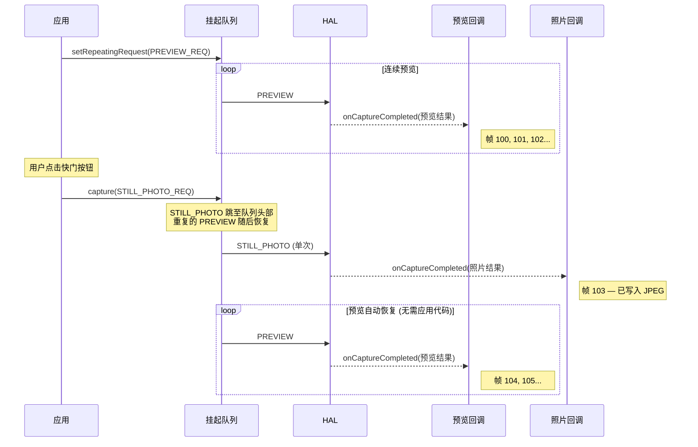
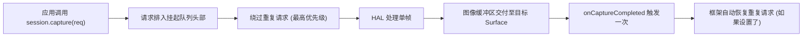
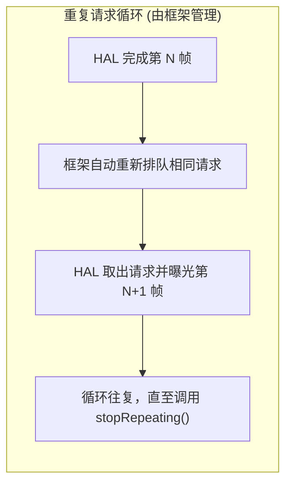
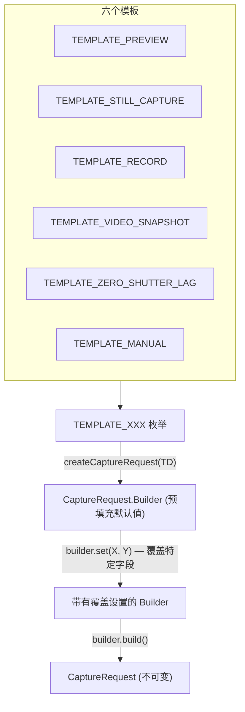

## 11.1 馈送管线的三种方式

在[第 10 章](the-camera2-pipeline.md)中，你已经看到了请求如何流经 Camera2 管线：从挂起队列到在途队列，到 HAL，再到你的回调和输出 Surface。但是，*如何提交*这些请求至关重要。Camera2 提供了三种提交机制，每种机制的行为都有根本不同：

1. **单次 (One-shot)** (`capture()`) — 执行一次单个请求
2. **连拍 (Burst)** (`captureBurst()`) — 连续执行一组请求，中间无间隔
3. **重复 (Repeating)** (`setRepeatingRequest()`) — 永久（或直到被中断）连续执行同一个请求

除了这三种提交模式外，框架还提供了六个**捕获模板**，它们为常见用例（预览、静态捕获、视频录制、零快门延迟、手动控制等）预先填充了 `CaptureRequest.Builder` 的合理默认值。

本章结束时，你将准确了解何时使用每种捕获类型和模板——包括为什么预览始终使用重复请求，为什么连拍是实现曝光包围的唯一方法，以及为什么即使在预览运行时静态照片也使用单次请求。

**Android Camera Parameters** 应用（[GitHub](https://github.com/zoozooll/AndroidCameraParameters)，[Play 商店](https://play.google.com/store/apps/details?id=com.minininja.cameraparams)）在 **Capture Demo (捕获演示)** 选项卡中演示了所有三种捕获类型。在 "Preview (Repeating)"、"Single Photo (One-Shot)" 和 "Burst (3 Frames)" 模式之间切换，即可在你自己的设备上实时观察回调行为和时序差异。

## 11.2 单次：capture()

最简单的提交模式是通过 `CameraCaptureSession.capture()` 进行的**单次捕获 (one-shot capture)**。它正如其名：向管线提交一个 `CaptureRequest`，执行且仅执行一次。

```kotlin
// 单次：捕获单个静态帧至 JPEG ImageReader
fun captureStillPhoto() {
    val builder = cameraDevice.createCaptureRequest(CameraDevice.TEMPLATE_STILL_CAPTURE)
    builder.addTarget(jpegReader.surface)
    builder.set(CaptureRequest.JPEG_QUALITY, 100)
    builder.set(CaptureRequest.CONTROL_AF_MODE, CaptureRequest.CONTROL_AF_MODE_CONTINUOUS_PICTURE)
    builder.set(CaptureRequest.CONTROL_AE_MODE, CaptureRequest.CONTROL_AE_MODE_ON)

    val request = builder.build()

    captureSession.capture(request, object : CameraCaptureSession.CaptureCallback() {
        override fun onCaptureCompleted(
            session: CameraCaptureSession,
            request: CaptureRequest,
            result: TotalCaptureResult
        ) {
            super.onCaptureCompleted(session, request, result)
            Log.d("Capture", "单次照片完成。帧号 #${result.frameNumber}")
        }
    }, backgroundHandler)
}
```

### 何时使用单次模式

| 用例 | 为什么用单次？ |
|----------|--------------|
| 单次静态照片 | 每点击一次快门执行一次 |
| 单次 AF/AE 触发 | 针对一次点击对焦事件发射 `CONTROL_AF_TRIGGER_START` |
| 视频期间抓拍 | 在重复视频请求活动期间抓取一帧高分辨率帧 |
| 捕获单帧 RAW | 针对一张照片同时捕获 RAW + JPEG |

### 单次捕获如何与重复预览交互

Camera2 中的一个关键设计模式是：**预览作为重复请求运行，而静态照片作为单次请求注入**。正如我们在第 10 章的队列模型中所讨论的，单次请求会跳到挂起队列中重复请求的前面，因此它会立即执行。单次请求完成后，框架会自动恢复重复的预览请求——你无需重新提交。



:::tip
这种自动恢复行为是集成在 Camera2 框架中的。在单次捕获后，你永远不需要手动"重新启动预览"——框架会为你重新排队重复请求。
:::

### 单次执行流程



## 11.3 连拍：captureBurst()

`capture()` 提交一个请求，而 `captureBurst()` 提交一个 **`List<CaptureRequest>`**，并保证列表中所有的 N 帧**连续且按顺序执行，中间不会穿插来自其他源（包括重复请求）的帧**。

这种原子、无间隙的保证使得连拍捕获对于以下场景至关重要：

- **曝光包围 (Exposure bracketing)** — 在 ±1EV、±2EV 处捕获 3-5 帧，然后将其合并为 HDR
- **对焦包围 (Focus bracketing)** — 扫描对焦距离，然后进行景深合成
- **动作 / 运动捕捉** — 拍摄 10-30 帧快速移动的主体，然后挑选最清晰的一帧
- **慢动作视频 (高速)** — `createHighSpeedRequestList()` + 受限高速连拍
- **3A 收敛采样** — 触发 AF/AE，然后连拍直至收敛

```kotlin
// 连拍：3 帧曝光包围 (-2EV, 0EV, +2EV)
fun captureExposureBracket() {
    val baseIso = 100
    val baseExposure = 10_000_000L  // 10ms = "0EV" 基准

    val burstList: MutableList<CaptureRequest> = mutableListOf()

    // 帧 0: -2EV (4x 短曝光 = 更暗)
    burstList += cameraDevice.createCaptureRequest(CameraDevice.TEMPLATE_STILL_CAPTURE).apply {
        addTarget(jpegReader.surface)
        set(CaptureRequest.SENSOR_SENSITIVITY, baseIso)
        set(CaptureRequest.SENSOR_EXPOSURE_TIME, baseExposure / 4)
        set(CaptureRequest.CONTROL_AE_MODE, CaptureRequest.CONTROL_AE_MODE_OFF)
    }.build()

    // 帧 1: 0EV (正确曝光)
    burstList += cameraDevice.createCaptureRequest(CameraDevice.TEMPLATE_STILL_CAPTURE).apply {
        addTarget(jpegReader.surface)
        set(CaptureRequest.SENSOR_SENSITIVITY, baseIso)
        set(CaptureRequest.SENSOR_EXPOSURE_TIME, baseExposure)
        set(CaptureRequest.CONTROL_AE_MODE, CaptureRequest.CONTROL_AE_MODE_OFF)
    }.build()

    // 帧 2: +2EV (4x 长曝光 = 更亮)
    burstList += cameraDevice.createCaptureRequest(CameraDevice.TEMPLATE_STILL_CAPTURE).apply {
        addTarget(jpegReader.surface)
        set(CaptureRequest.SENSOR_SENSITIVITY, baseIso)
        set(CaptureRequest.SENSOR_EXPOSURE_TIME, baseExposure * 4)
        set(CaptureRequest.CONTROL_AE_MODE, CaptureRequest.CONTROL_AE_MODE_OFF)
    }.build()

    captureSession.captureBurst(burstList, object : CameraCaptureSession.CaptureCallback() {
        private var completedCount = 0

        override fun onCaptureCompleted(
            session: CameraCaptureSession,
            request: CaptureRequest,
            result: TotalCaptureResult
        ) {
            super.onCaptureCompleted(session, request, result)
            completedCount++
            Log.d("Burst", "连拍帧 $completedCount/${burstList.size} 完成。帧号 #${result.frameNumber}")

            if (completedCount == burstList.size) {
                Log.d("Burst", "所有 ${burstList.size} 个包围帧已捕获！")
                // TODO: 合并 HDR、对焦堆栈，或让用户挑选最好的一帧
            }
        }
    }, backgroundHandler)
}
```

### 连续性保证的运作

连拍的关键属性在于**整个列表是原子排队的**——即使 `setRepeatingRequest()` 处于活动状态，N 个连拍帧也会在重复请求恢复之前背靠背全部运行。重复请求不会穿插在连拍帧之间。

```mermaid
flowchart TB
    subgraph QueueBefore ["连拍提交前"]
        direction LR
        R1["PREVIEW (重复)"] --> R2["PREVIEW (重复)"] --> R3["PREVIEW (重复)"]
    end

    subgraph Arrow ["应用调用 captureBurst([B1,B2,B3])"]
        style Arrow fill:#fff3e0
    end

    subgraph QueueAfter ["连拍提交后 (原子入队)"]
        direction LR
        B1["连拍帧 1"] --> B2["连拍帧 2"] --> B3["连拍帧 3"] --> R4["PREVIEW (重复) 恢复"] --> R5["PREVIEW"]
    end

    QueueBefore --> Arrow --> QueueAfter

    Note over B1,B3: 预览帧不会从中间溜进来！
```

### 连拍大小限制

单次 `captureBurst()` 调用中可以提交的最大连拍大小由以下因素决定：
- `CameraCharacteristics.REQUEST_MAX_NUM_OUTPUT_RAW` — 针对 RAW 输出
- `CameraCharacteristics.REQUEST_MAX_NUM_OUTPUT_PROC` — 针对处理后的（YUV/JPEG）输出
- 实际硬件带宽（4K 连拍会比 1080p 连拍更短）

对于典型的 FULL 设备，10-50 帧的处理后 JPEG 连拍通常没有问题。RAW 连拍可能受限于传感器和内存，限制在 5-10 帧。

### 用于慢动作的高速连拍

对于慢动作视频，Camera2 提供了 `CameraDevice.createHighSpeedRequestList()`，它将一个普通的 `CaptureRequest` 转换为适合高速、受限捕获视频（例如 120fps 或 240fps）的连拍请求列表。这需要与 `CameraCaptureSession.captureBurst()` 配合使用，且需要具备 `CONSTRAINED_HIGH_SPEED_VIDEO` 功能：

```kotlin
// 连拍：高速慢动作 (120fps)
fun captureHighSpeedSlowMo() {
    val capabilities = characteristics.get(CameraCharacteristics.REQUEST_AVAILABLE_CAPABILITIES)
    val supportsHighSpeed = capabilities?.contains(
        CameraCharacteristics.REQUEST_AVAILABLE_CAPABILITIES_CONSTRAINED_HIGH_SPEED_VIDEO
    ) ?: false

    if (!supportsHighSpeed) {
        Log.w("HighSpeed", "设备不支持受限的高速视频")
        return
    }

    // 构建一个基础请求 (目标指向 MediaRecorder Surface)
    val baseBuilder = cameraDevice.createCaptureRequest(CameraDevice.TEMPLATE_RECORD)
    baseBuilder.addTarget(mediaRecorderSurface)
    val baseRequest = baseBuilder.build()

    // 展开为高速连拍列表 — 框架针对 120fps 进行了优化
    val highSpeedBurst = cameraDevice.createHighSpeedRequestList(listOf(baseRequest))

    // 通过 captureBurst 提交优化的连拍列表
    captureSession.captureBurst(highSpeedBurst, highSpeedCallback, backgroundHandler)
}
```

## 11.4 重复：setRepeatingRequest()

Camera2 的主力是**重复请求 (repeating request)**，通过 `CameraCaptureSession.setRepeatingRequest()` 提交。它不是执行一次，而是框架在每一帧之后永远（直到被中断）自动重新排队*同一个请求*，从而以硬件的原生帧率产生连续的帧流。

```kotlin
// 重复：启动相机预览 (30fps 连续流)
fun startPreview() {
    val builder = cameraDevice.createCaptureRequest(CameraDevice.TEMPLATE_PREVIEW)
    builder.addTarget(previewSurface)
    builder.set(CaptureRequest.CONTROL_AF_MODE, CaptureRequest.CONTROL_AF_MODE_CONTINUOUS_PICTURE)
    builder.set(CaptureRequest.CONTROL_AE_MODE, CaptureRequest.CONTROL_AE_MODE_ON)
    builder.set(CaptureRequest.CONTROL_AWB_MODE, CaptureRequest.CONTROL_AWB_MODE_AUTO)

    val repeatingRequest = builder.build()

    captureSession.setRepeatingRequest(
        repeatingRequest,
        object : CameraCaptureSession.CaptureCallback() {
            private var frameCount = 0
            private var lastFpsLogMs = 0L

            override fun onCaptureCompleted(
                session: CameraCaptureSession,
                request: CaptureRequest,
                result: TotalCaptureResult
            ) {
                super.onCaptureCompleted(session, request, result)
                frameCount++
                val now = System.currentTimeMillis()
                if (now - lastFpsLogMs > 1000) {
                    Log.d("Preview", "预览 FPS: $frameCount")
                    frameCount = 0
                    lastFpsLogMs = now
                }
            }
        },
        backgroundHandler
    )
}
```

### 为什么预览*必须*使用重复请求

如果你尝试使用每秒调用 30 次 `capture()` 的定时器来实现 30fps 预览，你会：
1. 每 33ms 重新提交相同的请求，浪费 CPU
2. 如果你的定时器延迟，会产生漂移
3. 如果单次回调发生阻塞，会出现帧间隙
4. 会与框架的队列管理发生冲突

重复请求完全在框架/HAL 内部处理。每一帧完成后，HAL 会自动调度下一次曝光——无需应用线程参与。这以零应用 CPU 开销产生平滑、无间隙的预览。



### 停止重复请求

要停止重复流，调用 `stopRepeating()`。这会从队列中移除重复请求，但不会刷新已经在途的帧。调用 `abortCaptures()` 可强制刷新所有请求（并针对在途帧触发带有 `REASON_FLUSHED` 的 `onCaptureFailed`）。

```kotlin
// 暂时暂停预览
fun pausePreview() {
    captureSession.stopRepeating()
    Log.d("Preview", "重复已停止。在途帧仍会完成。")
}

// 紧急停止 — 立即丢弃所有捕获
fun emergencyStopAllCaptures() {
    captureSession.stopRepeating()
    captureSession.abortCaptures()
    // 所有在途帧将以 REASON_FLUSHED 失败
}
```

### 重复请求也用于视频录制

除了预览外，重复请求还用于**视频录制**（针对 `MediaRecorder` 或 `MediaCodec` 的 `Surface`）和**持续图像分析**（针对用于人脸检测、机器学习推理等的低分辨率 YUV `ImageReader`）。

模式始终相同：设置一次，让它流动，当你想要更改设置时更新请求参数（例如，通过在新的重复请求中更新裁剪区域来在流中途更改数字变焦）。

```kotlin
// 重复：在预览/视频期间实时更新变焦级别
fun updateDigitalZoom(cropRegion: Rect) {
    val builder = cameraDevice.createCaptureRequest(CameraDevice.TEMPLATE_PREVIEW)
    builder.addTarget(previewSurface)
    builder.addTarget(mediaRecorderSurface)
    builder.set(CaptureRequest.SCALER_CROP_REGION, cropRegion)
    builder.set(CaptureRequest.CONTROL_AF_MODE, CaptureRequest.CONTROL_AF_MODE_CONTINUOUS_PICTURE)

    // 使用新请求替换旧的重复请求 (相同目标, 新裁剪区域)
    captureSession.setRepeatingRequest(builder.build(), currentCallback, backgroundHandler)
    Log.d("Zoom", "重复请求已更新，裁剪区域为 ${cropRegion.width()}x${cropRegion.height()}")
}
```

## 11.5 捕获模板

每个 `CaptureRequest.Builder` 都从一个**模板 (template)** 开始：你调用 `cameraDevice.createCaptureRequest(TEMPLATE_XXX)`，框架会针对该用例用硬件优化的默认值填充构建器。然后你只需覆盖你需要的特定设置。

模板之所以存在，是因为手机的相机管线有数十个旋钮（降噪强度、边缘增强、色调曲线、抗条纹模式、帧率范围……）。模板设置了合理的基准，因此你不必从头开始配置每一个。



### 六个模板：预配置内容及使用时机

| 模板 | 用例 | 关键预配置设置 |
|----------|----------|---------------------------|
| `TEMPLATE_PREVIEW` | 实时取景器 / 预览 | 低延迟优先，3A (AF/AE/AWB) 为连续自动模式，适度的降噪/锐化，高帧率 (30fps)。牺牲微小画质以换取流畅度。 |
| `TEMPLATE_STILL_CAPTURE` | 单次拍摄照片 | 最高质量优先，AF 为图片模式，完整降噪/锐化，高质量 JPEG 编码。为了提升那一帧的画质可能会降低帧率。 |
| `TEMPLATE_RECORD` | 视频录制 | 稳定的帧率（匹配 MediaRecorder 输出），连续对焦，音视频同步时间戳，启用抗条纹，中等降噪——针对运动 + 压缩进行了调优。 |
| `TEMPLATE_VIDEO_SNAPSHOT` | 视频录制期间的高清静态图 | 类似于 STILL_CAPTURE 但保留了视频帧设置——在不停止视频录制流的情况下抓取一张高清照片。 |
| `TEMPLATE_ZERO_SHUTTER_LAG` | ZSL 静态拍摄 (第 14 章) | 构建一个近期帧的环形缓冲区。当点击快门时，返回一帧*过去*的帧以实现零黑屏。需要连拍能力和私有重处理支持。 |
| `TEMPLATE_MANUAL` | 手动 / 专业控制 | 默认情况下所有 3A 模式均设置为 OFF，以便你可以手动设置传感器曝光、ISO、镜头焦距和色彩校正增益而无需干扰。作为专业相机 UI 的基准。 |

```kotlin
// 模板示例 — 查看从各个模板开始会发生什么

// TEMPLATE_PREVIEW — 平滑，低延迟
val previewBuilder = cameraDevice.createCaptureRequest(CameraDevice.TEMPLATE_PREVIEW)
val previewRequest = previewBuilder.build()
Log.d("Template", "PREVIEW AF_MODE = ${previewRequest.get(CaptureRequest.CONTROL_AF_MODE)}")
// ^ 通常为 CONTROL_AF_MODE_CONTINUOUS_PICTURE (始终在重新对焦)

// TEMPLATE_STILL_CAPTURE — 每帧最高画质
val stillBuilder = cameraDevice.createCaptureRequest(CameraDevice.TEMPLATE_STILL_CAPTURE)
val stillRequest = stillBuilder.build()
Log.d("Template", "STILL_CAPTURE JPEG_QUALITY = ${stillRequest.get(CaptureRequest.JPEG_QUALITY)}")
// ^ 通常为 100 (最高质量编码)

// TEMPLATE_MANUAL — 禁用所有自动控制
val manualBuilder = cameraDevice.createCaptureRequest(CameraDevice.TEMPLATE_MANUAL)
val manualRequest = manualBuilder.build()
Log.d("Template", "MANUAL AE_MODE = ${manualRequest.get(CaptureRequest.CONTROL_AE_MODE)}")
Log.d("Template", "MANUAL AF_MODE = ${manualRequest.get(CaptureRequest.CONTROL_AF_MODE)}")
Log.d("Template", "MANUAL AWB_MODE = ${manualRequest.get(CaptureRequest.CONTROL_AWB_MODE)}")
// ^ 通常为 AE_MODE_OFF, AF_MODE_OFF, AWB_MODE_OFF — 从一开始就是手动的
```

:::tip
始终从模板开始并覆盖特定字段。相比于从空模板创建请求（这甚至是不可能的——每一个 `createCaptureRequest` 都需要模板），从 `TEMPLATE_PREVIEW` 开始然后覆盖 2-3 个设置（例如用于变焦的裁剪区域、用于曝光补偿的 AE 目标偏差）出错的可能性要小得多。
:::

## 11.6 三种捕获类型对比

| 维度 | 单次 `capture()` | 连拍 `captureBurst()` | 重复 `setRepeatingRequest()` |
|-----------|---------------------|----------------------|---------------------------------|
| **执行** | 单个请求运行一次 | N 个请求列表连续运行 | 同一个请求每帧运行 (自动重新入队) |
| **优先级** | 最高 — 跳至挂起队列头部 | 高 — 所有 N 帧原子地插入头部 | 最低 — 单次/连拍会在其前面插队，随后恢复重复 |
| **中断** | 中断重复请求；完成后恢复重复 | 中断重复请求；整个连拍完成后恢复 | 被任何单次或连拍请求抢占；之后自动恢复 |
| **队列行为** | 单个请求排队 | N 个请求连续排队 (无间隙) | 每个周期重新排队一个概念请求 |
| **典型用途** | 单张照片、单次 AF 触发、闪光灯照片 | 曝光包围、对焦堆叠、动作连拍、慢动作、HDR | 预览、视频录制、持续 ML 分析、实时人脸检测 |
| **结果回调** | `onCaptureCompleted` 触发且仅触发一次 | `onCaptureCompleted` 触发 N 次 (每连拍一帧一次) | `onCaptureCompleted` 针对每一帧持续触发 (每秒 30-60 次) |

```mermaid
quadrantChart
    title 捕获类型使用模式
    x-axis ["低帧数", "高帧数"]
    y-axis ["单一配置", "变化的逐帧配置"]
    quadrant-1 ["连拍：曝光 / 对焦包围"]
    quadrant-2 ["连拍：高速慢动作"]
    quadrant-3 ["单次：静态照片"]
    quadrant-4 ["重复：预览 + 视频"]
    "单张 JPEG 捕获": [0.15, 0.2]
    "点击对焦触发": [0.1, 0.15]
    "3 帧 HDR 包围": [0.4, 0.75]
    "7 帧对焦堆叠": [0.45, 0.8]
    "120fps 慢动作 2秒": [0.85, 0.25]
    "CameraFinder 预览 30fps": [0.9, 0.1]
    "4K 视频录制": [0.88, 0.18]
```

## 11.7 在 Android Camera Parameters 应用中查看捕获类型

打开 **Android Camera Parameters** 应用（[GitHub](https://github.com/zoozooll/AndroidCameraParameters)，[Play 商店](https://play.google.com/store/apps/details?id=com.minininja.cameraparams)）并导航到 **Capture Demo (捕获演示)** 选项卡。该应用并排展示了所有三种捕获类型：

- 点击 **Start Preview** 以调用 `setRepeatingRequest(TEMPLATE_PREVIEW)` 并查看实时的 `CaptureCallback` 日志（帧 1, 2, 3, ... 大约每 33ms 滚动一次）
- 在预览运行时点击 **Take Photo** 以注入一个 `capture(TEMPLATE_STILL_CAPTURE)` 单次请求。你会看到回调计数针对高质量帧短暂暂停，随后随着重复请求的自动恢复而无缝继续。
- 点击 **Burst 5 Frames** 以调用 `captureBurst(List<CaptureRequest(5)>)`。观察到在预览滚动继续之前，恰好有 5 帧背靠背完成——证明了连续性保证。

你还可以在 **Raw JSON** 选项卡中检查 `REQUEST_MAX_NUM_OUTPUT_RAW` 和 `REQUEST_MAX_NUM_OUTPUT_PROC`，以查看你设备的连拍大小限制。

## 11.8 小结

| 概念 | 关键要点 |
|---------|-------------|
| **单次 `capture()`** | 单个请求，运行一次，优先级最高。用于静态照片、AF 触发。完成后自动恢复重复请求。 |
| **连拍 `captureBurst()`** | `List<CaptureRequest>` 连续运行，无穿插。用于包围、动作、慢动作。整个列表原子地跳过队列。 |
| **重复 `setRepeatingRequest()`** | 一个请求流式连续运行。框架自动重新排队。用于预览、视频、分析。优先级最低。 |
| **模板** | 六个基准模板为 Builder 填充默认值。从 TEMPLATE_PREVIEW/STILL_CAPTURE/RECORD/ZSL/MANUAL 开始，仅覆盖你需要的内容。 |
| **中断规则** | 单次和连拍*总是*抢占重复请求。重复请求之后自动恢复。连拍帧永远不会被拆散。 |

## 下一章

在[第 12 章：CameraCharacteristics 深度挖掘](cameracharacteristics-deep-dive.md)中，我们将挖掘在打开相机之前，描述*相机究竟能做什么*的静态元数据对象。我们将分解硬件级别（LEGACY → LIMITED → FULL → LEVEL_3 → EXTERNAL）、性能标志系统（MANUAL_SENSOR、RAW、DEPTH_OUTPUT 等），以及如何在运行时查询所有这些内容，以编写可在 10,000 多种 Android 设备型号上运行的应用。
